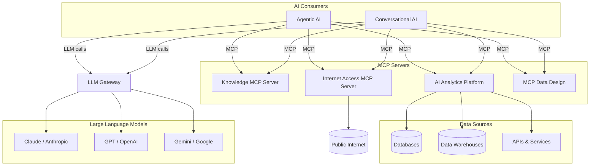

> [!CAUTION]
> **Disclaimer:** The materials in this repository are provided as-is for accelerator and reference purposes only. They should not be relied upon for production systems or live business decision-making without independent review and professional adaptation. © M&A Operating System. All rights reserved.

# M&A Operating System — Research & Product Accelerators

This repository contains research projects and product accelerator guides developed by M&A Operating System to fast-track client engagements under our **Practical AI** and **Practical Data** proprietary methodologies.

The materials here — product design specifications, technical reference guides, and implementation frameworks — are used as starting points that we adapt and apply with clients to accelerate delivery rather than starting from scratch. They reflect real design decisions made in the field and are updated as our methodologies evolve.

Documents are intended for internal distribution across advisory, product, engineering, and design review functions.

---

## About M&A Operating System

M&A Operating System is a boutique advisory firm focused on helping organizations modernize the operational foundations required for scalable analytics, trusted enterprise information, and practical AI adoption.

Our work sits at the intersection of enterprise data strategy, information architecture, operating model modernization, and transformation execution. We specialize in helping organizations design practical, business-aligned approaches to enterprise information management that support operational scalability, analytics enablement, governance, and modern AI capabilities.

A core part of our approach is the recognition that successful data and AI initiatives are not driven solely by technology platforms. Long-term success depends on how well organizations structure, model, govern, operationalize, and align information with real business processes and decision-making.

Our approach combines:

- Enterprise data and AI strategy
- Subject-based data modeling and information architecture
- Semantic and operational data design
- Governance and organizational alignment
- Operating model modernization
- Transformation execution and delivery leadership
- Practical AI operationalization and readiness

Our goal is simple: help organizations build practical, scalable, and trusted information foundations that improve operational effectiveness, accelerate analytics and AI adoption, and support better business outcomes.

[maoperatingsystem.com](https://maoperatingsystem.com)

---

## Practical AI and Data Ecosystem



---

## Product Areas

| Product | Description | Specification |
|---|---|---|
| [AI Analytics Platform](docs/product/analytics/README.md) | A deterministic semantic computation engine for AI-native enterprise analytics. Exposes governed, role-aware analytical capabilities to MCP-compatible consumers through a headless API backed by a federated query planner and a governed Semantic Metrics Repository. Eliminates Text-to-SQL as an architectural pattern for regulated analytics. | `docs/product/analytics/` |
| [AI Chat Platform](docs/product/assistant/README.md) | A white-label, embeddable conversational AI layer that any application can adopt. Host applications bring their own domain scope, MCP tooling, and branding. The platform provides the conversation engine, content rendering, audit storage, and memory management. | `docs/product/assistant/` |
| [Knowledge MCP Server](docs/product/knowledge/README.md) | A centralised MCP server exposing a structured knowledge directory as resources, prompts, skills, commands, and agent definitions. Serves as the single source of truth for all reusable AI assets across the platform — eliminating local copies and providing governed access over the Model Context Protocol. | `docs/product/knowledge/` |
| [Internet Access MCP Server](docs/product/internet/README.md) | A self-hosted MCP server that exposes web search and page fetch as production-grade, infrastructure-controlled capabilities. Built-in entitlements and site classification govern what internet content AI agents and users can access and consume. No external API dependency required for core operation. | `docs/product/internet/` |
| MCP Data Design | The authoritative source of data definition and context needed by AI capabilities to understand and reliably consume data across an enterprise. Covers data model and object definitions, entity relationships, analytics definitions, organisational ownership constructs, and all other context required to interpret enterprise data correctly. | COMING SOON! |

---

## Repository Structure

```
docs/
└── product/
    ├── about.md                  # Company background
    ├── analytics/                # AI Analytics Platform specification
    ├── assistant/                # AI Chat Platform specification
    ├── knowledge/                # Knowledge MCP Server specification
    ├── internet/                 # Internet Access MCP Server specification
    └── data-design/              # COMING SOON! MCP Data Design specification
```

---

*Provided as a public research resource. Not intended for use in live or production environments without independent professional review and adaptation.*

---

## Keywords

enterprise data strategy, practical AI, practical data, AI adoption, AI operationalization, AI readiness, enterprise analytics, analytics governance, semantic metrics, semantic layer, federated query, data architecture, information architecture, subject-based data modeling, data governance, operating model modernization, transformation execution, enterprise information management, knowledge management, AI agents, autonomous agents, conversational AI, MCP server, Model Context Protocol, agentic AI, AI chat platform, analytics platform, knowledge MCP server, internet access MCP server, web search MCP, AI web grounding, site classification, entitlements, self-hosted AI infrastructure, data lineage, data quality, enterprise AI strategy, AI accelerator, data modernization, AI consulting, data consulting, boutique advisory, M&A Operating System
