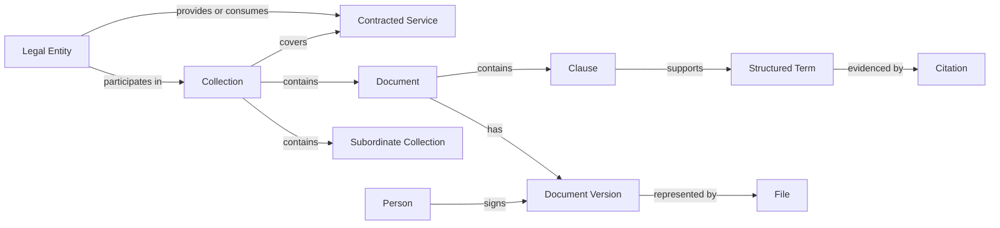
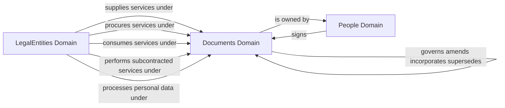
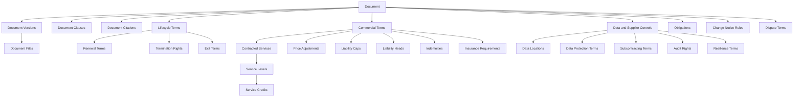

# Contract Management Data Model

This document presents the business scope and logical data model for third-party IT, cloud and SaaS contracts. It moves from the business problem to the objects, domains and concepts needed to manage contract data, then provides the full data dictionary.

## 1 Business Scope

A buyer organisation acquires IT, cloud and SaaS services from third-party providers under written agreements, and must know at any date what each executed agreement obliges, permits, costs and protects, and be able to show the words in the signed original that say so.

### In scope

| ID | Business scope |
|---|---|
| SCI001 | The executed agreement as an original artefact (the signed PDF) with its renditions, execution status and signature evidence |
| SCI002 | The documents that make up an agreement: master agreement, order forms and statements of work, schedules, amendments, renewals and successor agreements, and terms incorporated by reference from the provider's website |
| SCI003 | The parties to an agreement and what each is to it: service provider, signing recipient, consuming entity, subcontractor, data processor, signatory and internal owner |
| SCI004 | The clauses of an agreement classified against a governed clause taxonomy, and the rights, obligations and prohibitions they create |
| SCI005 | The service definition: contracted services, ICT service type, deployment model, service levels, service credits, data locations, security, resilience and audit terms |
| SCI006 | Commercial and risk-allocation terms: fees, licence metrics and quantities, pricing and price change, payment, liability caps and heads of loss, indemnities and insurance |
| SCI007 | Lifecycle terms: effective and expiry dates, renewal, notice, termination rights, change regime for online terms, exit and data return |
| SCI008 | Evidence of each structured term: the clause, page, words and extraction method in the executed original, and whether a reviewer has verified it |

### Out of scope

| ID | Excluded subject | Owned by |
|---|---|---|
| SCO001 | Sourcing events, RFPs, bids and negotiation workflow before execution | A procurement process; its outcomes arrive here as documents |
| SCO002 | Invoices, payments and spend transactions | Transactions domain (DMD000000022) |
| SCO003 | Measured service performance, credits claimed and obligation fulfilment events | Metrics domain (DMD000000030) and Events domain (DMD000000020) |
| SCO004 | Master data of parties themselves: legal names, identifiers (LEI, EUID), group structure, addresses | LegalEntities (DMD000000012) and People (DMD000000001), referenced not redefined |
| SCO005 | Third-party risk assessments, due diligence, criticality assessments of business functions, exit-plan testing and audit findings | A third-party risk management model (not yet in DDA); see DEC004 |
| SCO006 | The provider's service catalogue as an enterprise subject independent of any agreement | A future Services or Products domain (not yet in DDA); see DEC003 |
| SCO007 | Sell-side customer contracts and non-IT contract types (leases, employment, M&A) | Later extensions of the same Documents model |

### Business requirement coverage

The discovery package contains 41 sourced business requirements. The table below shows their coverage by business topic.

| Business topic | Requirements |
|---|---|
| Agreement structure | 3 |
| Change of terms | 3 |
| Clauses | 1 |
| Commercial | 3 |
| Data protection | 3 |
| Evidence | 4 |
| Formation and execution | 3 |
| Governing law | 1 |
| Identification | 1 |
| Obligations | 1 |
| Oversight | 2 |
| Parties | 2 |
| Records retention | 2 |
| Regulatory reporting | 1 |
| Risk allocation | 3 |
| Security and resilience | 1 |
| Service definition | 1 |
| Service levels | 2 |
| Term and renewal | 2 |
| Termination and exit | 2 |

## 2 Object Model

The object model separates the commercial arrangement from the instruments and files that evidence it. Collections organize the arrangement. Documents represent independently identifiable instruments. Versions represent substantive states or editions of a Document. Files represent stored renditions of a Version.

| Object | Business meaning | Examples |
|---|---|---|
| Collection | A governed grouping administered as one arrangement or sub-arrangement. | Provider relationship, framework agreement, order, statement of work |
| Document | One independently identifiable legal or operational instrument. | MSA, order form, amendment, DPA, SLA, notice |
| Document Version | A substantive state or published edition of the same Document. | Draft, redline, agreed form, executed version, online edition |
| File | A stored rendition of one Document Version. | Signed PDF, native file, OCR copy, web snapshot |
| Legal Entity | A company or other legal person participating in an arrangement. | Provider, customer entity, subcontractor, processor |
| Person | An individual acting in relation to a contract. | Signatory, contract owner |
| Contracted Service | The agreement-specific service purchased from a provider. | Cloud hosting, SaaS subscription, managed service |
| Clause and Citation | The provision and source evidence supporting a structured term. | Clause number, page, quoted words, verification |

## 3 Domain Model

The model requires three enterprise domains. Service Provider, Customer, Consumer, Subcontractor, Processor, Signatory and Contract Owner are roles established by relationships; they are not separate masters.

| Domain | Anchor subject | Scope in this model |
|---|---|---|
| Documents | Document | A single document that evidences or forms part of an agreement: for an executed agreement, the executed original as signed, together with what it states. Extended from 'basic details about a single document including its name, type, brief description and link' to hold execution status, dates and the fingerprint of the executed original. |
| LegalEntities | LegalEntity | Reused as held in DDA: the primary concept for all legal entities. |
| People | Person | Reused as held in DDA: fundamental information about a real person. |

### Domain relationships

| ID | Source role | Forward verb | Target role | Inverse verb | Cardinality |
|---|---|---|---|---|---|
| REL001 | Service Provider | supplies services under | Service Contract | engages | MANY_TO_MANY |
| REL002 | Service Recipient | procures services under | Service Contract | is procured by | MANY_TO_MANY |
| REL003 | Service Consumer | consumes services under | Service Contract | is consumed by | MANY_TO_MANY |
| REL004 | Subcontractor | performs subcontracted services under | Head Contract | is subcontracted to | MANY_TO_MANY |
| REL005 | Data Processor | processes personal data under | Processing Agreement | appoints | MANY_TO_MANY |
| REL006 | Signatory | signs | Signed Instrument | is signed by | MANY_TO_MANY |
| REL007 | Owned Contract | is owned by | Contract Owner | owns | MANY_TO_ONE |
| REL008 | Amendment | amends | Amended Agreement | is amended by | MANY_TO_MANY |
| REL009 | Subordinate Agreement | is governed by | Master Agreement | governs | MANY_TO_ONE |
| REL010 | Incorporating Agreement | incorporates | Incorporated Terms | is incorporated into | MANY_TO_MANY |
| REL011 | Successor Agreement | supersedes | Predecessor Agreement | is succeeded by | MANY_TO_MANY |

## 4 Concept Model

The Documents domain contains the concepts needed to describe documentary evidence, lifecycle, commercial terms, services, risk allocation, data protection and continuing obligations. Document Versions sit between Document and Document Files, while recursive Document composition supports Collections containing Documents and subordinate Collections.

### Concepts

| ID | Concept | Parent | Cardinality | Definition |
|---|---|---|---|---|
| SBJ033 | DocumentVersions | Document | ONE_TO_MANY | A substantive state, edition, publication or execution form of one Document. One record exists per recognized Version. |
| SBJ010 | DocumentFiles | DocumentVersions | ONE_TO_MANY_OPTIONAL | A stored file of the document: the executed original or another rendition of it (FRBR manifestation and item). |
| SBJ011 | DocumentClauses | Document | ONE_TO_MANY_OPTIONAL | A provision of the document at a numbered place in it, classified against the governed clause taxonomy. |
| SBJ012 | DocumentCitations | Document | ONE_TO_MANY_OPTIONAL | The evidence for one abstracted term value: where in the executed original it is stated, how it was extracted and whether it has been verified. |
| SBJ013 | DocumentRenewalTerms | Document | ONE_TO_ONE_OPTIONAL | The term and renewal provisions the document states. |
| SBJ014 | DocumentTerminationRights | Document | ONE_TO_MANY_OPTIONAL | A right to terminate the document held by one side on a stated trigger. |
| SBJ015 | DocumentExitTerms | Document | ONE_TO_ONE_OPTIONAL | What happens when the agreement ends: transition, assistance, data return and deletion. |
| SBJ016 | DocumentCommercialTerms | Document | ONE_TO_ONE_OPTIONAL | The document-level commercial terms: currency, value and payment. |
| SBJ017 | DocumentServices | Document | ONE_TO_MANY_OPTIONAL | A service the document contracts for: the service definition and its commercial line. |
| SBJ018 | DocumentServiceLevels | DocumentServices | ONE_TO_MANY_OPTIONAL | A service level committed for a contracted service. |
| SBJ019 | DocumentServiceCredits | DocumentServiceLevels | ONE_TO_MANY_OPTIONAL | A tier of service credit payable when achieved performance falls within a band. |
| SBJ020 | DocumentPriceAdjustments | Document | ONE_TO_MANY_OPTIONAL | A mechanism by which prices change during the term or at renewal. |
| SBJ021 | DocumentLiabilityCaps | Document | ONE_TO_MANY_OPTIONAL | A cap on one side's liability under the document. |
| SBJ022 | DocumentLiabilityHeads | Document | ONE_TO_MANY_OPTIONAL | A head of loss the document excludes or removes from the cap. |
| SBJ023 | DocumentIndemnities | Document | ONE_TO_MANY_OPTIONAL | An indemnity one side gives the other under the document. |
| SBJ024 | DocumentInsuranceRequirements | Document | ONE_TO_MANY_OPTIONAL | Insurance the provider must maintain under the document. |
| SBJ025 | DocumentDataLocations | Document | ONE_TO_MANY_OPTIONAL | A location where the document permits services to be provided or data to be stored or processed. |
| SBJ026 | DocumentDataProtectionTerms | Document | ONE_TO_ONE_OPTIONAL | The document's data-protection and data-use terms. |
| SBJ027 | DocumentSubcontractingTerms | Document | ONE_TO_ONE_OPTIONAL | The document's terms on subcontracting. |
| SBJ028 | DocumentAuditRights | Document | ONE_TO_MANY_OPTIONAL | A right of access, inspection or audit granted by the document. |
| SBJ029 | DocumentResilienceTerms | Document | ONE_TO_ONE_OPTIONAL | The document's continuity, incident and security-cooperation terms. |
| SBJ030 | DocumentObligations | Document | ONE_TO_MANY_OPTIONAL | A continuing commitment the document imposes: an obligation, a right or a prohibition binding one side. |
| SBJ031 | DocumentChangeNoticeRules | Document | ONE_TO_MANY_OPTIONAL | The notice the provider must give, and the customer's right, for one kind of change to online terms or services. |
| SBJ032 | DocumentDisputeTerms | Document | ONE_TO_ONE_OPTIONAL | Governing law and dispute resolution terms of the document. |

## 5 Data Dictionary

All attributes are listed once under their final owning concept or relationship.

| Concept or relationship | Owner type | Attribute ID | Attribute | Data type | Lookup | Nature | Definition |
|---|---|---|---|---|---|---|---|
| Document | Concept | ATR207 | DocumentCollectionPurpose | LOOKUP | DocumentCollectionPurposes | observed | Purpose of a Collection, such as provider relationship, agreement, framework, order, statement of work or assurance pack. |
| Document | Concept | ATR002 | DocumentDescription | LONGTEXT |  | observed | A short statement of what the document covers. |
| Document | Concept | ATR007 | DocumentExpirationDate | DATE |  | observed | The date on which the document's initial or current stated term ends, if not perpetual. |
| Document | Concept | ATR008 | DocumentIsPerpetual | BOOLEAN |  | observed | True when the document has no fixed end date (CUAD answer 'Perpetual'). |
| Document | Concept | ATR009 | DocumentLanguage | LOOKUP | DLT000000082 | observed | The language of the executed text. |
| Document | Concept | ATR010 | DocumentPageCount | INTEGER |  | observed | Number of pages in the executed original. |
| Document | Concept | ATR206 | DocumentRepresentationType | LOOKUP | DocumentRepresentationTypes | observed | Whether the Document represents a governed Collection or one Individual instrument. |
| Document | Concept | ATR016 | DocumentReviewDate | DATE |  | observed | The date the review status was reached. |
| Document | Concept | ATR015 | DocumentReviewStatus | LOOKUP | LKP003 | observed | How far the whole document has been read and its terms abstracted and verified. |
| Document | Concept | ATR012 | DocumentSourceUrl | URL |  | observed | For a document published online and incorporated by reference, the web address it is published at. |
| Document | Concept | ATR001 | DocumentTitle | TEXT |  | observed | The title the document gives itself, e.g. 'Master Subscription Agreement'. |
| Document | Concept | ATR003 | DocumentType | LOOKUP | LKP001 | observed | The form of the instrument, e.g. Order Form or Data Processing Agreement. |
| DocumentAmendment | Relationship | ATR202 | DocumentAmendmentModificationType | LOOKUP | LKP042 | observed | The kind of textual change the amendment makes. |
| DocumentAmendment | Relationship | ATR201 | DocumentAmendmentSequence | INTEGER |  | observed | Order in which the amendment applies to the amended document (1 for the first). |
| DocumentAuditRights | Concept | ATR151 | DocumentAuditRightsAuditParty | LOOKUP | LKP037 | observed | Who may exercise the right. |
| DocumentAuditRights | Concept | ATR156 | DocumentAuditRightsCertificationOnly | BOOLEAN |  | observed | True when the provider may satisfy the right with certifications or reports alone. |
| DocumentAuditRights | Concept | ATR154 | DocumentAuditRightsCostAllocation | LOOKUP | LKP038 | observed | Who bears the cost. |
| DocumentAuditRights | Concept | ATR152 | DocumentAuditRightsFrequency | LOOKUP | LKP050 | observed | How often the right may be exercised. |
| DocumentAuditRights | Concept | ATR153 | DocumentAuditRightsNoticeDays | INTEGER |  | observed | Days of notice before an audit. |
| DocumentAuditRights | Concept | ATR155 | DocumentAuditRightsOnsiteAccess | BOOLEAN |  | observed | True when on-site inspection is allowed. |
| DocumentChangeNoticeRules | Concept | ATR174 | DocumentChangeNoticeRulesChangeType | LOOKUP | LKP039 | observed | The kind of change. |
| DocumentChangeNoticeRules | Concept | ATR177 | DocumentChangeNoticeRulesCustomerRight | LOOKUP | LKP040 | observed | What the customer may do in response. |
| DocumentChangeNoticeRules | Concept | ATR175 | DocumentChangeNoticeRulesNoticeDays | INTEGER |  | observed | Days of notice before the change binds. |
| DocumentChangeNoticeRules | Concept | ATR176 | DocumentChangeNoticeRulesNoticeMethod | LOOKUP | LKP011 | observed | How notice of the change is given. |
| DocumentCitations | Concept | ATR037 | DocumentCitationsBoundingRegion | TEXT |  | observed | Polygon on the page enclosing the quoted words. |
| DocumentCitations | Concept | ATR036 | DocumentCitationsCharLength | INTEGER |  | observed | Length in characters of the quoted words. |
| DocumentCitations | Concept | ATR035 | DocumentCitationsCharOffset | INTEGER |  | observed | Character offset of the quoted words in the document text. |
| DocumentCitations | Concept | ATR031 | DocumentCitationsCitedAttributeCode | TEXT |  | observed | The DDA attribute code of the term value evidenced, e.g. DocumentLiabilityCapsFixedAmount. |
| DocumentCitations | Concept | ATR032 | DocumentCitationsCitedRecordKey | TEXT |  | observed | Where the evidenced concept holds many records per document, the key of the record evidenced (e.g. the service or tier). |
| DocumentCitations | Concept | ATR033 | DocumentCitationsClauseNumber | TEXT |  | observed | The number of the provision that states the value. |
| DocumentCitations | Concept | ATR040 | DocumentCitationsConfidence | FLOAT |  | observed | Confidence from 0 to 1 reported by an automated extraction. |
| DocumentCitations | Concept | ATR039 | DocumentCitationsExtractionMethod | LOOKUP | LKP007 | observed | How the value was taken from the original. |
| DocumentCitations | Concept | ATR034 | DocumentCitationsPageNumber | INTEGER |  | observed | Page of the executed original on which the value is stated (1-indexed). |
| DocumentCitations | Concept | ATR038 | DocumentCitationsQuotedText | LONGTEXT |  | observed | The words of the executed original that state the value. |
| DocumentCitations | Concept | ATR041 | DocumentCitationsVerificationStatus | LOOKUP | LKP008 | observed | Whether a reviewer has confirmed the passage states the value. |
| DocumentCitations | Concept | ATR042 | DocumentCitationsVerifiedBy | USER |  | observed | The reviewer who reached the verification status. |
| DocumentCitations | Concept | ATR043 | DocumentCitationsVerifiedDate | DATE |  | observed | The date the reviewer reached the verification status. |
| DocumentClauses | Concept | ATR030 | DocumentClausesActivityClass | LOOKUP | LKP006 | observed | Whether the provision calls for action in normal performance or only when something goes wrong. |
| DocumentClauses | Concept | ATR026 | DocumentClausesClauseHeading | TEXT |  | observed | The heading of the provision as written. |
| DocumentClauses | Concept | ATR025 | DocumentClausesClauseNumber | TEXT |  | observed | The number or reference the document gives the provision, e.g. '11.2' or 'Schedule 3, para 4'. |
| DocumentClauses | Concept | ATR027 | DocumentClausesClauseText | LONGTEXT |  | observed | The full text of the provision as written in the executed original. |
| DocumentClauses | Concept | ATR024 | DocumentClausesClauseType | LOOKUP | LKP005 | observed | The governed type of the provision. |
| DocumentClauses | Concept | ATR029 | DocumentClausesPageEnd | INTEGER |  | observed | Page on which the provision ends. |
| DocumentClauses | Concept | ATR028 | DocumentClausesPageStart | INTEGER |  | observed | Page of the executed original on which the provision begins. |
| DocumentCommercialTerms | Concept | ATR071 | DocumentCommercialTermsAnnualValue | CURRENCY |  | observed | Annual value of the fees, as stated or annualised; the DORA register's annual expense. |
| DocumentCommercialTerms | Concept | ATR073 | DocumentCommercialTermsBillingFrequency | LOOKUP | LKP050 | observed | How often fees are invoiced. |
| DocumentCommercialTerms | Concept | ATR069 | DocumentCommercialTermsCurrency | LOOKUP | DLT000000072 | observed | Currency of the fees. |
| DocumentCommercialTerms | Concept | ATR075 | DocumentCommercialTermsFeesNonCancellable | BOOLEAN |  | observed | True when fees are non-cancellable and non-refundable. |
| DocumentCommercialTerms | Concept | ATR074 | DocumentCommercialTermsLateInterestPercent | FLOAT |  | observed | Interest rate charged on late payment, per month. |
| DocumentCommercialTerms | Concept | ATR072 | DocumentCommercialTermsPaymentDays | INTEGER |  | observed | Days after invoice within which payment is due. |
| DocumentCommercialTerms | Concept | ATR070 | DocumentCommercialTermsTotalValue | CURRENCY |  | observed | Total value the document commits over its stated term. |
| DocumentComposition | Relationship | ATR216 | DocumentCompositionApplicabilityScope | LONGTEXT |  | observed | The services, entities or circumstances to which the membership applies. |
| DocumentComposition | Relationship | ATR213 | DocumentCompositionIsConstitutive | BOOLEAN |  | observed | True when the member forms part of the governed arrangement rather than being retained only as supporting material. |
| DocumentComposition | Relationship | ATR215 | DocumentCompositionIsPrimary | BOOLEAN |  | observed | True when the member is the primary governing Document or subordinate Collection. |
| DocumentComposition | Relationship | ATR212 | DocumentCompositionMembershipRole | LOOKUP | DocumentCompositionMembershipRoles | observed | The member's function in the Collection. |
| DocumentComposition | Relationship | ATR214 | DocumentCompositionSequence | INTEGER |  | observed | Display or processing order of the member within its immediate Collection. |
| DocumentDataLocations | Concept | ATR137 | DocumentDataLocationsChangeNoticeDays | INTEGER |  | observed | Days of notice the provider must give before changing the location. |
| DocumentDataLocations | Concept | ATR135 | DocumentDataLocationsCountry | LOOKUP | DLT000000071 | observed | The country. |
| DocumentDataLocations | Concept | ATR134 | DocumentDataLocationsPurpose | LOOKUP | LKP032 | observed | What happens at the location. |
| DocumentDataLocations | Concept | ATR136 | DocumentDataLocationsRegion | TEXT |  | observed | Region or data-centre area within the country, where stated. |
| DocumentDataProtectionTerms | Concept | ATR143 | DocumentDataProtectionTermsAiTrainingUse | LOOKUP | LKP035 | observed | Whether the provider may use customer data to train AI models. |
| DocumentDataProtectionTerms | Concept | ATR138 | DocumentDataProtectionTermsBreachNotificationHours | INTEGER |  | observed | Hours within which the provider must notify a personal-data or security breach. |
| DocumentDataProtectionTerms | Concept | ATR139 | DocumentDataProtectionTermsEncryptionAtRestRequired | BOOLEAN |  | observed | True when data must be encrypted at rest. |
| DocumentDataProtectionTerms | Concept | ATR140 | DocumentDataProtectionTermsEncryptionInTransitRequired | BOOLEAN |  | observed | True when data must be encrypted in transit. |
| DocumentDataProtectionTerms | Concept | ATR141 | DocumentDataProtectionTermsMultiFactorAuthRequired | BOOLEAN |  | observed | True when multi-factor authentication is required for access to customer data. |
| DocumentDataProtectionTerms | Concept | ATR142 | DocumentDataProtectionTermsTransferMechanism | LOOKUP | LKP033 | observed | Legal basis for international transfers of personal data. |
| DocumentDataProtectionTerms | Concept | ATR144 | DocumentDataProtectionTermsUsageDataAggregation | LOOKUP | LKP035 | observed | Whether the provider may aggregate and use usage data. |
| DocumentDisputeTerms | Concept | ATR182 | DocumentDisputeTermsArbitrationRules | TEXT |  | observed | Arbitration rules named, e.g. ICC, LCIA. |
| DocumentDisputeTerms | Concept | ATR178 | DocumentDisputeTermsGoverningLawCountry | LOOKUP | DLT000000071 | observed | Country whose law governs the document. |
| DocumentDisputeTerms | Concept | ATR179 | DocumentDisputeTermsGoverningLawRegion | TEXT |  | observed | State, province or legal system within the country, e.g. 'England and Wales', 'New York'. |
| DocumentDisputeTerms | Concept | ATR181 | DocumentDisputeTermsMechanism | LOOKUP | LKP046 | observed | How disputes are resolved. |
| DocumentDisputeTerms | Concept | ATR180 | DocumentDisputeTermsVenue | TEXT |  | observed | Courts or seat named for disputes. |
| DocumentExitTerms | Concept | ATR061 | DocumentExitTermsAssistanceChargeBasis | LOOKUP | LKP016 | observed | How exit assistance is charged. |
| DocumentExitTerms | Concept | ATR064 | DocumentExitTermsDataDeletionDays | INTEGER |  | observed | Days after termination by which the provider must delete customer data. |
| DocumentExitTerms | Concept | ATR063 | DocumentExitTermsDataExportFormat | TEXT |  | observed | The format in which data is returned. |
| DocumentExitTerms | Concept | ATR062 | DocumentExitTermsDataExportWindowDays | INTEGER |  | observed | Days after termination during which the customer may export its data. |
| DocumentExitTerms | Concept | ATR065 | DocumentExitTermsDeletionCertified | BOOLEAN |  | observed | True when the provider must certify deletion. |
| DocumentExitTerms | Concept | ATR066 | DocumentExitTermsExitPlanRequired | BOOLEAN |  | observed | True when the provider must maintain an exit plan. |
| DocumentExitTerms | Concept | ATR068 | DocumentExitTermsInsolvencyDataReturn | BOOLEAN |  | observed | True when the customer keeps access to and recovery of its data on the provider's insolvency, resolution or discontinuation (DORA Art 30(2)(d)). |
| DocumentExitTerms | Concept | ATR067 | DocumentExitTermsStressedExitCovered | BOOLEAN |  | observed | True when the exit provisions apply on the provider's failure or insolvency as well as on planned exit. |
| DocumentExitTerms | Concept | ATR060 | DocumentExitTermsTransitionPeriodMonths | INTEGER |  | observed | Months the provider must continue the service after termination to allow migration. |
| DocumentFiles | Concept | ATR022 | DocumentFilesCapturedDate | DATE |  | observed | For a web snapshot, the date the online document was captured as published; for other files, the date the file was produced. |
| DocumentFiles | Concept | ATR020 | DocumentFilesFileHash | TEXT |  | observed | SHA-256 fingerprint of the file content. |
| DocumentFiles | Concept | ATR018 | DocumentFilesFileName | TEXT |  | observed | The file name as stored. |
| DocumentFiles | Concept | ATR017 | DocumentFilesFileRole | LOOKUP | LKP004 | observed | What the file is: executed original, certified copy, preservation copy, text rendition, web snapshot or signature evidence. |
| DocumentFiles | Concept | ATR023 | DocumentFilesIsPdfA | BOOLEAN |  | observed | True when the file conforms to PDF/A for long-term preservation. |
| DocumentFiles | Concept | ATR019 | DocumentFilesMediaType | TEXT |  | observed | IANA media type of the file, e.g. application/pdf. |
| DocumentFiles | Concept | ATR021 | DocumentFilesStorageLocation | URL |  | observed | Where the file is held in the authoritative repository. |
| DocumentIncorporation | Relationship | ATR204 | DocumentIncorporationIncorporationMode | LOOKUP | LKP041 | observed | How the document is incorporated. |
| DocumentIncorporation | Relationship | ATR203 | DocumentIncorporationPrecedenceRank | INTEGER |  | observed | Rank of the incorporated document in the order of precedence of the incorporating agreement (1 prevails over 2). |
| DocumentIndemnities | Concept | ATR128 | DocumentIndemnitiesCapTreatment | LOOKUP | LKP029 | observed | How the indemnity stands against the liability cap. |
| DocumentIndemnities | Concept | ATR127 | DocumentIndemnitiesClaimType | LOOKUP | LKP030 | observed | The kind of claim covered. |
| DocumentIndemnities | Concept | ATR130 | DocumentIndemnitiesExclusions | LONGTEXT |  | observed | Circumstances the indemnity does not cover. |
| DocumentIndemnities | Concept | ATR126 | DocumentIndemnitiesIndemnifyingSide | LOOKUP | LKP009 | observed | The side giving the indemnity. |
| DocumentIndemnities | Concept | ATR129 | DocumentIndemnitiesRemedies | LONGTEXT |  | observed | Remedies the indemnifier may elect, e.g. procure a licence, modify, or refund. |
| DocumentInsuranceRequirements | Concept | ATR133 | DocumentInsuranceRequirementsCurrency | LOOKUP | DLT000000072 | observed | Currency of the minimum cover. |
| DocumentInsuranceRequirements | Concept | ATR131 | DocumentInsuranceRequirementsInsuranceType | LOOKUP | LKP031 | observed | The type of insurance. |
| DocumentInsuranceRequirements | Concept | ATR132 | DocumentInsuranceRequirementsMinimumAmount | CURRENCY |  | observed | Minimum cover required. |
| DocumentLiabilityCaps | Concept | ATR122 | DocumentLiabilityCapsBasisPeriodMonths | INTEGER |  | observed | Months of fees the cap is measured over, e.g. 12. |
| DocumentLiabilityCaps | Concept | ATR117 | DocumentLiabilityCapsCapType | LOOKUP | LKP025 | observed | How the cap is expressed. |
| DocumentLiabilityCaps | Concept | ATR119 | DocumentLiabilityCapsCurrency | LOOKUP | DLT000000072 | observed | Currency of the fixed amount. |
| DocumentLiabilityCaps | Concept | ATR121 | DocumentLiabilityCapsFeeBasis | LOOKUP | LKP027 | observed | Which fees a fee-based cap is measured against. |
| DocumentLiabilityCaps | Concept | ATR120 | DocumentLiabilityCapsFeeMultiplier | FLOAT |  | observed | Multiple of fees, e.g. 1.25 for 125% of charges. |
| DocumentLiabilityCaps | Concept | ATR118 | DocumentLiabilityCapsFixedAmount | CURRENCY |  | observed | The fixed amount of the cap, where it has one. |
| DocumentLiabilityCaps | Concept | ATR116 | DocumentLiabilityCapsScope | LOOKUP | LKP026 | observed | Which liability the cap limits. |
| DocumentLiabilityCaps | Concept | ATR115 | DocumentLiabilityCapsSide | LOOKUP | LKP009 | observed | The side whose liability is capped. |
| DocumentLiabilityHeads | Concept | ATR123 | DocumentLiabilityHeadsHeadType | LOOKUP | LKP028 | observed | The head of loss. |
| DocumentLiabilityHeads | Concept | ATR125 | DocumentLiabilityHeadsSide | LOOKUP | LKP009 | observed | The side whose liability the treatment applies to. |
| DocumentLiabilityHeads | Concept | ATR124 | DocumentLiabilityHeadsTreatment | LOOKUP | LKP029 | observed | How the head stands against the cap. |
| DocumentObligations | Concept | ATR173 | DocumentObligationsClauseNumber | TEXT |  | observed | The provision stating the commitment. |
| DocumentObligations | Concept | ATR168 | DocumentObligationsDescription | LONGTEXT |  | observed | What must, may or must not be done. |
| DocumentObligations | Concept | ATR172 | DocumentObligationsFirstDueDate | DATE |  | observed | The first date the commitment falls due. |
| DocumentObligations | Concept | ATR170 | DocumentObligationsFrequency | LOOKUP | LKP050 | observed | How often a recurring commitment falls due. |
| DocumentObligations | Concept | ATR169 | DocumentObligationsIsRecurring | BOOLEAN |  | observed | True when the commitment recurs. |
| DocumentObligations | Concept | ATR165 | DocumentObligationsModality | LOOKUP | LKP045 | observed | Obligation, right or prohibition. |
| DocumentObligations | Concept | ATR166 | DocumentObligationsObligatedSide | LOOKUP | LKP009 | observed | The side bound by the commitment. |
| DocumentObligations | Concept | ATR167 | DocumentObligationsObligationType | LOOKUP | LKP044 | observed | The kind of commitment. |
| DocumentObligations | Concept | ATR171 | DocumentObligationsTriggerEvent | TEXT |  | observed | The event that brings an event-driven commitment into play. |
| DocumentPriceAdjustments | Concept | ATR108 | DocumentPriceAdjustmentsBasis | LOOKUP | LKP012 | observed | The mechanism. |
| DocumentPriceAdjustments | Concept | ATR111 | DocumentPriceAdjustmentsCapPercent | FLOAT |  | observed | Maximum increase per adjustment, in percent. |
| DocumentPriceAdjustments | Concept | ATR114 | DocumentPriceAdjustmentsFirstReviewDate | DATE |  | observed | Date of the first adjustment the mechanism allows. |
| DocumentPriceAdjustments | Concept | ATR112 | DocumentPriceAdjustmentsFrequency | LOOKUP | LKP050 | observed | How often adjustments may be made. |
| DocumentPriceAdjustments | Concept | ATR110 | DocumentPriceAdjustmentsIndexName | TEXT |  | observed | The index followed, e.g. 'UK CPI'. |
| DocumentPriceAdjustments | Concept | ATR113 | DocumentPriceAdjustmentsNoticeDays | INTEGER |  | observed | Days of notice required before an adjustment takes effect. |
| DocumentPriceAdjustments | Concept | ATR109 | DocumentPriceAdjustmentsTiming | LOOKUP | LKP013 | observed | When the mechanism applies. |
| DocumentRenewalTerms | Concept | ATR044 | DocumentRenewalTermsInitialTermMonths | INTEGER |  | observed | Length of the initial term in months. |
| DocumentRenewalTerms | Concept | ATR047 | DocumentRenewalTermsMaximumRenewals | INTEGER |  | observed | Maximum number of renewals; empty when unlimited. |
| DocumentRenewalTerms | Concept | ATR048 | DocumentRenewalTermsNonRenewalNoticeDays | INTEGER |  | observed | Days before expiry by which notice of non-renewal must be given. |
| DocumentRenewalTerms | Concept | ATR049 | DocumentRenewalTermsNoticeDayBasis | LOOKUP | LKP010 | observed | Whether the notice period counts calendar or business days. |
| DocumentRenewalTerms | Concept | ATR052 | DocumentRenewalTermsNoticeDeadline | DATE |  | derived | The last date on which notice of non-renewal can be given: the expiry date less the notice period on its day basis. |
| DocumentRenewalTerms | Concept | ATR050 | DocumentRenewalTermsNoticeMethod | LOOKUP | LKP011 | observed | How non-renewal notice must be given. |
| DocumentRenewalTerms | Concept | ATR046 | DocumentRenewalTermsRenewalPeriodMonths | INTEGER |  | observed | Length of each renewal period in months. |
| DocumentRenewalTerms | Concept | ATR051 | DocumentRenewalTermsRenewalPriceBasis | LOOKUP | LKP012 | observed | How prices are set for a renewal period. |
| DocumentRenewalTerms | Concept | ATR045 | DocumentRenewalTermsRenewalType | LOOKUP | LKP014 | observed | How the document renews at the end of a term. |
| DocumentResilienceTerms | Concept | ATR164 | DocumentResilienceTermsAuthorityCooperation | BOOLEAN |  | observed | True when the provider must cooperate fully with competent and resolution authorities. |
| DocumentResilienceTerms | Concept | ATR157 | DocumentResilienceTermsBcpRequired | BOOLEAN |  | observed | True when the provider must maintain a business continuity plan. |
| DocumentResilienceTerms | Concept | ATR158 | DocumentResilienceTermsBcpTestFrequency | LOOKUP | LKP050 | observed | How often the plan must be tested. |
| DocumentResilienceTerms | Concept | ATR161 | DocumentResilienceTermsIncidentAssistanceChargeBasis | LOOKUP | LKP016 | observed | How incident assistance is charged. |
| DocumentResilienceTerms | Concept | ATR162 | DocumentResilienceTermsPenetrationTestParticipation | BOOLEAN |  | observed | True when the provider must take part in the customer's threat-led penetration testing. |
| DocumentResilienceTerms | Concept | ATR160 | DocumentResilienceTermsRecoveryPointHours | FLOAT |  | observed | Recovery point objective in hours. |
| DocumentResilienceTerms | Concept | ATR159 | DocumentResilienceTermsRecoveryTimeHours | FLOAT |  | observed | Recovery time objective in hours. |
| DocumentResilienceTerms | Concept | ATR163 | DocumentResilienceTermsSecurityTrainingParticipation | BOOLEAN |  | observed | True when the provider must take part in the customer's security awareness training. |
| DocumentServiceCredits | Concept | ATR107 | DocumentServiceCreditsCreditApplication | LOOKUP | LKP024 | observed | How the credit is given. |
| DocumentServiceCredits | Concept | ATR106 | DocumentServiceCreditsCreditPercent | FLOAT |  | observed | Credit as a percentage of the fee for the period. |
| DocumentServiceCredits | Concept | ATR104 | DocumentServiceCreditsLowerBound | FLOAT |  | observed | Lowest achieved value in the tier (inclusive). |
| DocumentServiceCredits | Concept | ATR105 | DocumentServiceCreditsUpperBound | FLOAT |  | observed | Highest achieved value in the tier (exclusive). |
| DocumentServiceLevels | Concept | ATR102 | DocumentServiceLevelsChronicFailureThreshold | TEXT |  | observed | Number of failures in a number of periods that gives a right to terminate. |
| DocumentServiceLevels | Concept | ATR099 | DocumentServiceLevelsClaimWindowDays | INTEGER |  | observed | Days after the failure within which a credit must be claimed. |
| DocumentServiceLevels | Concept | ATR100 | DocumentServiceLevelsCreditCapPercent | FLOAT |  | observed | Maximum total credit as a percentage of the fee for the period. |
| DocumentServiceLevels | Concept | ATR101 | DocumentServiceLevelsCreditsSoleRemedy | BOOLEAN |  | observed | True when credits are the customer's sole and exclusive remedy for the failure. |
| DocumentServiceLevels | Concept | ATR103 | DocumentServiceLevelsEarnBackAvailable | BOOLEAN |  | observed | True when the provider may earn back credits by over-performance. |
| DocumentServiceLevels | Concept | ATR098 | DocumentServiceLevelsExclusions | LONGTEXT |  | observed | Events excluded from measurement, e.g. scheduled maintenance. |
| DocumentServiceLevels | Concept | ATR097 | DocumentServiceLevelsMeasurementBasis | LOOKUP | LKP023 | observed | How the metric is computed. |
| DocumentServiceLevels | Concept | ATR096 | DocumentServiceLevelsMeasurementPeriod | LOOKUP | LKP050 | observed | The period over which performance is measured. |
| DocumentServiceLevels | Concept | ATR091 | DocumentServiceLevelsMetricType | LOOKUP | LKP021 | observed | What the service level measures. |
| DocumentServiceLevels | Concept | ATR092 | DocumentServiceLevelsObjectiveType | LOOKUP | LKP022 | observed | Quantitative objective or qualitative commitment. |
| DocumentServiceLevels | Concept | ATR093 | DocumentServiceLevelsScope | TEXT |  | observed | What the commitment covers, e.g. 'region, multi-zone deployment'. |
| DocumentServiceLevels | Concept | ATR095 | DocumentServiceLevelsTargetUnit | TEXT |  | observed | Unit of the target, e.g. percent, minutes, hours. |
| DocumentServiceLevels | Concept | ATR094 | DocumentServiceLevelsTargetValue | FLOAT |  | observed | The committed target, e.g. 99.95. |
| DocumentServices | Concept | ATR086 | DocumentServicesBillingFrequency | LOOKUP | LKP050 | observed | How often the service is invoiced. |
| DocumentServices | Concept | ATR084 | DocumentServicesCurrency | LOOKUP | DLT000000072 | observed | Currency of the unit price. |
| DocumentServices | Concept | ATR080 | DocumentServicesDeploymentModel | LOOKUP | LKP018 | observed | Cloud deployment model of the service. |
| DocumentServices | Concept | ATR078 | DocumentServicesDescription | LONGTEXT |  | observed | What the service does, as described in the document. |
| DocumentServices | Concept | ATR089 | DocumentServicesEndDate | DATE |  | observed | Date the service line ends. |
| DocumentServices | Concept | ATR079 | DocumentServicesIctServiceType | LOOKUP | LKP017 | observed | Type of ICT service per the DORA register taxonomy. |
| DocumentServices | Concept | ATR081 | DocumentServicesLicenceMetric | LOOKUP | LKP019 | observed | The unit the service is licensed or consumed against. |
| DocumentServices | Concept | ATR087 | DocumentServicesOverageRate | CURRENCY |  | observed | Charge per unit of use beyond the contracted quantity. |
| DocumentServices | Concept | ATR085 | DocumentServicesPricingModel | LOOKUP | LKP020 | observed | How charges for the service are calculated. |
| DocumentServices | Concept | ATR077 | DocumentServicesProviderServiceCode | TEXT |  | observed | The provider's product or SKU code for the service. |
| DocumentServices | Concept | ATR082 | DocumentServicesQuantity | FLOAT |  | observed | Quantity of the metric contracted. |
| DocumentServices | Concept | ATR076 | DocumentServicesServiceName | TEXT |  | observed | The name of the service as the document states it. |
| DocumentServices | Concept | ATR088 | DocumentServicesStartDate | DATE |  | observed | Date the service line starts. |
| DocumentServices | Concept | ATR090 | DocumentServicesSupportsCriticalFunction | BOOLEAN |  | observed | True when the customer has assessed the service as supporting a critical or important function, which brings DORA Art 30(3) provisions into play. |
| DocumentServices | Concept | ATR083 | DocumentServicesUnitPrice | CURRENCY |  | observed | Price per unit of the metric. |
| DocumentSubcontractingTerms | Concept | ATR149 | DocumentSubcontractingTermsFlowDownRequired | BOOLEAN |  | observed | True when the provider must flow the document's obligations down to subcontractors. |
| DocumentSubcontractingTerms | Concept | ATR146 | DocumentSubcontractingTermsNoticeDays | INTEGER |  | observed | Days of notice of a new or replacement subcontractor. |
| DocumentSubcontractingTerms | Concept | ATR147 | DocumentSubcontractingTermsObjectionDays | INTEGER |  | observed | Days within which the customer may object. |
| DocumentSubcontractingTerms | Concept | ATR145 | DocumentSubcontractingTermsPermission | LOOKUP | LKP036 | observed | Whether and on what consent subcontracting is allowed. |
| DocumentSubcontractingTerms | Concept | ATR150 | DocumentSubcontractingTermsProviderRemainsResponsible | BOOLEAN |  | observed | True when the provider stays fully responsible for subcontracted services. |
| DocumentSubcontractingTerms | Concept | ATR148 | DocumentSubcontractingTermsTerminationOnObjection | BOOLEAN |  | observed | True when the customer may terminate if a change goes ahead despite objection. |
| DocumentSupersession | Relationship | ATR205 | DocumentSupersessionReason | LOOKUP | LKP043 | observed | Why the successor supersedes the predecessor. |
| DocumentTerminationRights | Concept | ATR056 | DocumentTerminationRightsCureDays | INTEGER |  | observed | Period the other side has to remedy a breach before the right arises. |
| DocumentTerminationRights | Concept | ATR057 | DocumentTerminationRightsDayBasis | LOOKUP | LKP010 | observed | Whether the notice and cure periods count calendar or business days. |
| DocumentTerminationRights | Concept | ATR058 | DocumentTerminationRightsFeePayable | BOOLEAN |  | observed | True when exercising the right triggers a termination fee. |
| DocumentTerminationRights | Concept | ATR055 | DocumentTerminationRightsNoticeDays | INTEGER |  | observed | Notice period for exercising the right. |
| DocumentTerminationRights | Concept | ATR059 | DocumentTerminationRightsPrepaidFeesRefunded | BOOLEAN |  | observed | True when prepaid fees for the remaining term are refunded on exercise. |
| DocumentTerminationRights | Concept | ATR053 | DocumentTerminationRightsSide | LOOKUP | LKP009 | observed | The side of the agreement that holds the right. |
| DocumentTerminationRights | Concept | ATR054 | DocumentTerminationRightsTrigger | LOOKUP | LKP015 | observed | The ground on which the right arises. |
| DocumentVersions | Concept | ATR006 | DocumentVersionsEffectiveDate | DATE |  | observed | The date from which the document states it takes effect. |
| DocumentVersions | Concept | ATR005 | DocumentVersionsExecutionDate | DATE |  | derived | The date the last required signature was applied, making the document fully executed. Derived from the signing times on the signing relationship. |
| DocumentVersions | Concept | ATR004 | DocumentVersionsExecutionStatus | LOOKUP | LKP002 | observed | How far the document has been executed. |
| DocumentVersions | Concept | ATR210 | DocumentVersionsIsAuthoritative | BOOLEAN |  | observed | True when this is the Version approved for operational use. |
| DocumentVersions | Concept | ATR211 | DocumentVersionsIsLegallyEffective | BOOLEAN |  | derived | Derived from execution, effective dates and supersession. |
| DocumentVersions | Concept | ATR014 | DocumentVersionsPublicationDate | DATE |  | observed | The date the publisher states this version was published or last amended. |
| DocumentVersions | Concept | ATR208 | DocumentVersionsSequence | INTEGER |  | observed | Order of the Version within the Document. |
| DocumentVersions | Concept | ATR209 | DocumentVersionsState | LOOKUP | DocumentVersionStates | observed | Draft, redline, agreed form, executed, published, withdrawn or superseded. |
| DocumentVersions | Concept | ATR013 | DocumentVersionsVersionLabel | TEXT |  | observed | The version or edition the publisher gives the document, e.g. 'November 2025' or 'v3.2'. |
| LegalEntityDataProcessing | Relationship | ATR193 | LegalEntityDataProcessingDataSubjectCategories | LONGTEXT |  | observed | Categories of data subjects. |
| LegalEntityDataProcessing | Relationship | ATR192 | LegalEntityDataProcessingPersonalDataTypes | LONGTEXT |  | observed | Types of personal data processed. |
| LegalEntityDataProcessing | Relationship | ATR191 | LegalEntityDataProcessingPurposes | LONGTEXT |  | observed | Purposes of the processing. |
| LegalEntityDataProcessing | Relationship | ATR194 | LegalEntityDataProcessingSccModule | LOOKUP | LKP034 | observed | Module of the standard contractual clauses used, where transfers occur. |
| LegalEntityDataProcessing | Relationship | ATR190 | LegalEntityDataProcessingSubjectMatter | LONGTEXT |  | observed | Subject matter and nature of the processing. |
| LegalEntityServiceProcurement | Relationship | ATR184 | LegalEntityServiceProcurementReferenceName | TEXT |  | observed | The name the document uses for the customer entity. |
| LegalEntityServiceProvision | Relationship | ATR183 | LegalEntityServiceProvisionReferenceName | TEXT |  | observed | The name the document uses for the provider, e.g. 'Supplier' or 'AWS'. |
| LegalEntitySubcontracting | Relationship | ATR188 | LegalEntitySubcontractingProcessesPersonalData | BOOLEAN |  | observed | True when the subcontractor processes personal data (a sub-processor). |
| LegalEntitySubcontracting | Relationship | ATR185 | LegalEntitySubcontractingRank | INTEGER |  | observed | Place in the supply chain: 2 for a subcontractor of the direct provider, 3 for its subcontractor, and so on (the direct provider is rank 1). |
| LegalEntitySubcontracting | Relationship | ATR186 | LegalEntitySubcontractingRecipientProvider | MASTERID |  | observed | Master ID of the legal entity to which this subcontractor provides the subcontracted service (the next link up the chain). |
| LegalEntitySubcontracting | Relationship | ATR189 | LegalEntitySubcontractingServiceCountry | LOOKUP | DLT000000071 | observed | Country from which the subcontractor performs the services. |
| LegalEntitySubcontracting | Relationship | ATR187 | LegalEntitySubcontractingServicesPerformed | LONGTEXT |  | observed | What the subcontractor performs. |
| PersonDocumentSigning | Relationship | ATR199 | PersonDocumentSigningAssuranceLevel | LOOKUP | LKP048 | observed | Legal assurance level of an electronic signature. |
| PersonDocumentSigning | Relationship | ATR196 | PersonDocumentSigningCapacity | TEXT |  | observed | The capacity or title in which the person signed, e.g. 'Chief Procurement Officer'. |
| PersonDocumentSigning | Relationship | ATR197 | PersonDocumentSigningOnBehalfOf | MASTERID |  | observed | Master ID of the legal entity for which the person signed. |
| PersonDocumentSigning | Relationship | ATR200 | PersonDocumentSigningPadesLevel | LOOKUP | LKP049 | observed | PAdES baseline level of the PDF signature. |
| PersonDocumentSigning | Relationship | ATR198 | PersonDocumentSigningSignatureMethod | LOOKUP | LKP047 | observed | How the signature was applied. |
| PersonDocumentSigning | Relationship | ATR195 | PersonDocumentSigningSignedDateTime | DATETIME |  | observed | When the signature was applied. |
