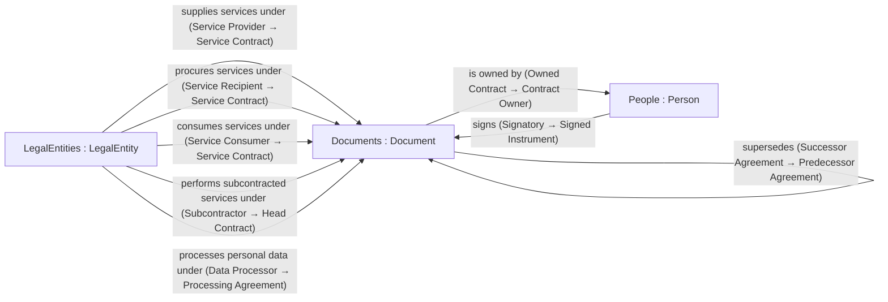

# Data Design Document — Contract Document Master

## About This Document

This Data Design Document is the approval record for a proposed data model. It is generated from the discovery package that accompanies it: every requirement, subject, role, relationship, attribute and lookup shown here is an artefact in that package, traced to the sources and requirements that caused it. Nothing in the document is written separately from the package, so what is approved here is exactly what the change package would put into the Data Design Authority.

## Version

| Domain | Document date | Package reference | Method version |
|---|---|---|---|
| Contract Document Master: third-party IT, Cloud and SaaS service contracts | 2026-09-23 | MAOS-BDD-CDM-2026-001 | 1.0 (dda://skills/domain-discovery) |

## Table of Contents

- 1 Introduction
- 2 Scope
- 3 Business Requirements
- 4 Data Requirements
- 5 Data Model
- 6 Source Validation
- 7 Existing Model Findings
- 8 Conformance to DDA Standards
- 9 Exceptions
- 10 Outstanding Decisions
- 11 Approval
- A Sources
- B DDA Domain Definitions
- C Standards
- D Subject Domain Proposals

## 1 Introduction

### 1.1 About M&A Operating System
M&A Operating System (MAOS) is a data advisory and platform practice. Its Data Design Authority (DDA) holds the authoritative definition of a company's data model: its subject domains, the concepts and attributes within them, the relationships between them, the governed vocabularies they draw on, and the standards that constrain all of it.

### 1.2 About the MAOS Practical Data Modelling Approach
The MAOS Practical Data Modelling Approach models the subjects a business deals in, not the processes that use them. Each domain has one anchoring subject; what one subject is to another is a role, derived from a relationship record that names both verb directions and both roles, never stored on the subject. Requirements are statements about the business, each resting on a cited source; data requirements say what must be recorded, answered and prevented; every structure traces back to them; and test cases walk the model to show each question can be answered.

### 1.3 Summary of Findings

**Status:** Converged — reference model (requirements uncertified, DEC001)

The Contract Document Master is modelled as an extension of the existing DDA Documents domain, not as a new domain. Its anchor, Document, is the executed original of each instrument: the signed PDF, identified by the fingerprint of its file, with its execution status and dates. An agreement is the family of documents that make it up — a master agreement, the order forms and statements of work it governs, its amendments in sequence, its successors, and the online terms it incorporates, each published version of which is its own document. These documents are related by dated relationship records, so the terms in force on any date are found by walking the amendments effective by then. Twenty-three concepts under Document hold the terms, conditions and service definition in typed form: term and renewal, termination rights, exit, commercial terms, contracted services with their ICT service type, service levels and credit tiers, price adjustment, liability caps and heads of loss, indemnities, insurance, data locations, data protection and AI data use, subcontracting, audit rights, resilience, change-notice rules, continuing obligations, governing law, clauses against a 58-type taxonomy, and a citation for every abstracted value giving the page and words of the original that state it and whether a reviewer has verified it. Providers, customer entities, consuming entities, subcontractors, data processors, signatories and contract owners are not stored on documents: each is a Legal Entity or Person related to the document, and the role derives from that relationship. Fifty-four test cases, including a DORA register-of-information extract, walk the model; one is an accepted limit because business functions are not yet modelled in DDA. The model is a reference model: its requirements are uncertified, and seven decisions are open for the Committee, including whether to separate Agreement from Document and whether to create a Services domain.

| Measure | Count |
|---|---|
| Sources | 107 |
| Business requirements | 41 |
| Data requirements | 22 |
| Domains in scope | 3 |
| Concepts proposed or extended | 24 |
| Roles | 20 |
| Relationships | 11 |
| Attributes | 205 |
| Lookups | 50 |
| Lookup values | 356 |
| Test cases | 54 |
| Test cases passing | 53 |
| Accepted limits | 1 |
| Open decisions | 7 |
| Platform findings | 12 |

## 2 Scope
The scope below states what this model covers, what it leaves to other models, and what it assumes.

### 2.1 The business
A buyer organisation acquires IT, cloud and SaaS services from third-party providers under written agreements, and must know at any date what each executed agreement obliges, permits, costs and protects, and be able to show the words in the signed original that say so.

| Subgroup | Name | Primary |
|---|---|---|
| SCG001 | Regulated financial-services buyers (EU DORA, EBA outsourcing, UK PRA SS2/21, US interagency TPRM, NYDFS Part 500) | Yes |
| SCG002 | General commercial buyers of IT, cloud and SaaS services | No |

### 2.2 In scope
| ID | Statement |
|---|---|
| SCI001 | The executed agreement as an original artefact (the signed PDF) with its renditions, execution status and signature evidence |
| SCI002 | The documents that make up an agreement: master agreement, order forms and statements of work, schedules, amendments, renewals and successor agreements, and terms incorporated by reference from the provider's website |
| SCI003 | The parties to an agreement and what each is to it: service provider, signing recipient, consuming entity, subcontractor, data processor, signatory and internal owner |
| SCI004 | The clauses of an agreement classified against a governed clause taxonomy, and the rights, obligations and prohibitions they create |
| SCI005 | The service definition: contracted services, ICT service type, deployment model, service levels, service credits, data locations, security, resilience and audit terms |
| SCI006 | Commercial and risk-allocation terms: fees, licence metrics and quantities, pricing and price change, payment, liability caps and heads of loss, indemnities and insurance |
| SCI007 | Lifecycle terms: effective and expiry dates, renewal, notice, termination rights, change regime for online terms, exit and data return |
| SCI008 | Evidence of each structured term: the clause, page, words and extraction method in the executed original, and whether a reviewer has verified it |

### 2.3 Out of scope
| ID | Statement | Owned by |
|---|---|---|
| SCO001 | Sourcing events, RFPs, bids and negotiation workflow before execution | A procurement process; its outcomes arrive here as documents |
| SCO002 | Invoices, payments and spend transactions | Transactions domain (DMD000000022) |
| SCO003 | Measured service performance, credits claimed and obligation fulfilment events | Metrics domain (DMD000000030) and Events domain (DMD000000020) |
| SCO004 | Master data of parties themselves: legal names, identifiers (LEI, EUID), group structure, addresses | LegalEntities (DMD000000012) and People (DMD000000001), referenced not redefined |
| SCO005 | Third-party risk assessments, due diligence, criticality assessments of business functions, exit-plan testing and audit findings | A third-party risk management model (not yet in DDA); see DEC004 |
| SCO006 | The provider's service catalogue as an enterprise subject independent of any agreement | A future Services or Products domain (not yet in DDA); see DEC003 |
| SCO007 | Sell-side customer contracts and non-IT contract types (leases, employment, M&A) | Later extensions of the same Documents model |

### 2.4 Shared with other models
| ID | Object | DDA record |
|---|---|---|
| SCS001 | LegalEntity (anchor of LegalEntities) | DMC000000106 |
| SCS002 | Person (anchor of People) | DMC000000143 |
| SCS003 | Document (anchor of Documents) | DMC000000142 |
| SCS004 | MasterCrossReference: secondary identifiers such as the DORA arrangement reference and provider contract numbers | DMC000000102 |
| SCS005 | UniversalCountryCodes, UniversalCurrencyCodes, UniversalLanguageCodes, MetricPeriodTypes | DLT000000071 |

### 2.5 Assumptions
| ID | Assumption |
|---|---|
| SCA001 | Gate H1 was passed on the agent's own authority: the user was sent the draft scope and replied by directing deep research to proceed without answering the scoping questions. This scope statement is that draft, confirmed by the instruction to proceed. |
| SCA002 | Mode is research-only: the output is a reference model for the MAOS practice, not a design for a named client. No business owner is available to certify requirements, so test cases are the falsification mechanism. |
| SCA003 | The buyer's perspective is modelled: the organisation mastering the contract is the customer of the service provider. |
| SCA004 | Regulated financial-services buyers are the primary subgroup because their obligations (DORA Art 28 and 30, EBA GL/2019/02) are the most demanding; every other buyer's needs are a subset. |
| SCA005 | The source cap is raised from the default of 6 to 24 per function because the user asked for deep research across data models, extraction solutions and taxonomies. |

### 2.6 Open questions
| ID | Scoping question | Note |
|---|---|---|
| SCQ001 | Q11 | Reference model or client design: not answered; assumed reference model (SCA002). |
| SCQ002 | Q16 | Certifier: not answered; none in research-only mode, see DEC001. |
| SCQ003 | Q3 | Operating jurisdictions: not answered; EU, UK and US regimes are all covered. |

## 3 Business Requirements

### 3.1 Business Requirements
Each requirement is a statement about the business that a domain expert could disagree with. The Sources column links to the evidence.

| ID | Category | Business requirement | Owner | Subgroup | Satisfied by | Certified | Sources |
|---|---|---|---|---|---|---|---|
| REQ007 | Agreement structure | IT, cloud and SaaS agreements are layered: a master agreement governs many order forms or statements of work, each with its own services, term and fees, and an order form or statement of work does not stand without the master that governs it. | Chief Procurement Officer | — | model | No | [SRC004](https://learning.sap.com/learning-journeys/introducing-sap-ariba-contracts/creating-contract-workspaces), [SRC006](https://documentation.conga.com/en/contracts/current/conga-contracts-for-users/conga-contracts-basics-for-users/hierarchical-relationships-for-conga-contracts), [SRC008](https://resources.agiloft.com/hubfs/documentation/contract-mgmt-user-guide.pdf), [SRC033](https://cdm.finos.org/docs/legal-agreements/), [SRC062](https://eur-lex.europa.eu/legal-content/EN/TXT/HTML/?uri=OJ:L_202402956), [SRC080](https://www.salesforce.com/en-us/wp-content/uploads/sites/4/documents/legal/Salesforce_MSA.pdf) |
| REQ008 | Agreement structure | An agreement incorporates other documents, such as service-specific terms, service level agreements, data processing terms and acceptable use policies. Some are attached and signed; others are published online by the provider and incorporated by reference. | General Counsel (Commercial Contracts) | — | model | No | [SRC075](https://aws.amazon.com/agreement/), [SRC078](https://www.microsoft.com/licensing/terms/product/ForOnlineServices/all), [SRC079](https://cloud.google.com/terms), [SRC081](https://assets.applytosupply.digitalmarketplace.service.gov.uk/g-cloud-14/documents/704436/580085418822207-terms-and-conditions-2024-05-07-1333.pdf), [SRC028](https://docs.oasis-open.org/legalxml-econtracts/CS01/legalxml-econtracts-specification-1.0.html) |
| REQ009 | Agreement structure | When the documents making up an agreement conflict, an order of precedence stated in the agreement decides which prevails, and that order differs from one agreement to another. | General Counsel (Commercial Contracts) | — | model | No | [SRC079](https://cloud.google.com/terms), [SRC080](https://www.salesforce.com/en-us/wp-content/uploads/sites/4/documents/legal/Salesforce_MSA.pdf), [SRC081](https://assets.applytosupply.digitalmarketplace.service.gov.uk/g-cloud-14/documents/704436/580085418822207-terms-and-conditions-2024-05-07-1333.pdf), [SRC075](https://aws.amazon.com/agreement/), [SRC083](https://www.acquisition.gov/gsam/552.232-78) |
| REQ010 | Change of terms | Providers alter online terms after signature. Whether an alteration binds the customer depends on the agreement's change regime (effective on posting with notice that varies by kind of change, or fixed for the subscription term), and an alteration posted without notice may not bind an existing customer. | General Counsel (Commercial Contracts) | — | model | No | [SRC075](https://aws.amazon.com/agreement/), [SRC078](https://www.microsoft.com/licensing/terms/product/ForOnlineServices/all), [SRC079](https://cloud.google.com/terms), [SRC105](https://blog.ericgoldman.org/archives/2007/07/ninth_circuit_s_1.htm), [SRC083](https://www.acquisition.gov/gsam/552.232-78) |
| REQ011 | Change of terms | An executed agreement is varied only by a later executed amendment. Amendments take effect from a stated date and apply in sequence, so the terms in force on any date are the original as varied by every amendment effective by then. | General Counsel (Commercial Contracts) | — | model | No | [SRC027](https://docs.oasis-open.org/legaldocml/akn-core/v1.0/akn-core-v1.0-part1-vocabulary.html), [SRC035](https://standard.open-contracting.org/latest/en/schema/reference/), [SRC003](https://iciwikiapac.icertis.com/ICIHelp8.1/index.php?title=Associations), [SRC007](https://documentation.conga.com/en/clm-for-advantage-platform/current/clm-for-users/contract-records-management/contract-relationships), [SRC103](https://www.stateoig.gov/uploads/report/report_pdf_file/ma-0002_0.pdf) |
| REQ012 | Change of terms | An agreement can be renewed, replaced, consolidated or novated by a later agreement, which supersedes it from the successor's effective date. | General Counsel (Commercial Contracts) | — | model | No | [SRC007](https://documentation.conga.com/en/clm-for-advantage-platform/current/clm-for-users/contract-records-management/contract-relationships), [SRC008](https://resources.agiloft.com/hubfs/documentation/contract-mgmt-user-guide.pdf), [SRC020](https://learn.microsoft.com/en-us/dynamics365/customerengagement/on-premises/developer/entities/contract), [SRC024](https://www.omg.org/spec/EDMC-FIBO/FND/Agreements/Contracts.rdf), [SRC040](https://www.dublincore.org/specifications/dublin-core/dcmi-terms/) |
| REQ040 | Clauses | Contract provisions fall into recognised types that recur across agreements (change of control, anti-assignment, most favoured customer, audit rights, source-code escrow) and each provision sits at a numbered place in the agreement. Some provisions call for action in normal performance, others only when something goes wrong. | General Counsel (Commercial Contracts) | — | model | No | [SRC045](https://github.com/TheAtticusProject/cuad/blob/main/category_descriptions.csv), [SRC049](https://huggingface.co/datasets/lex_glue), [SRC056](https://uploads-ssl.webflow.com/613bd27ef12e2e208a2732c0/6149c6148047d92cb11a49ca_Standard-Features-and-Provisions-DS.pdf), [SRC019](https://docs.oracle.com/en/cloud/saas/sales/fascc/how-contract-terms-library-setups-work-together.html), [SRC050](https://arxiv.org/abs/2501.06582), [SRC043](https://contract-design.worldcc.foundation/business-first) |
| REQ022 | Commercial | What a customer buys is a set of services, each licensed or consumed against a metric (named users, cores, storage, transactions) in a quantity, at a unit price, under a pricing model, with charges for use beyond the entitlement. | Chief Procurement Officer | — | model | No | [SRC080](https://www.salesforce.com/en-us/wp-content/uploads/sites/4/documents/legal/Salesforce_MSA.pdf), [SRC098](https://zylo.com/news/2024-saas-management-index/), [SRC099](https://zylo.com/news/2025-saas-management-index), [SRC102](https://www.gao.gov/products/gao-24-105717), [SRC005](https://learning.sap.com/courses/contract-workspace-creation/working-with-contract-documents) |
| REQ023 | Commercial | Prices change during the term and at renewal by a stated mechanism (fixed, the then-current list price, a capped percentage, or an index such as CPI) and with stated notice. | Chief Procurement Officer | — | model | No | [SRC100](https://www.cfodive.com/news/saas-prices-jumped-vertice-generativeai/691458/), [SRC095](https://www.digitaljournal.com/article/contracts-signed-value-lost-how-businesses-are-leaking-11-of-spend/), [SRC085](https://www.morganlewis.com/blogs/sourcingatmorganlewis/2026/05/top-5-issues-customers-should-consider-in-saas-agreement-renewals), [SRC087](https://parrbrown.com/negotiating-a-cloud-services-agreement/) |
| REQ024 | Commercial | An agreement states the fees payable, their currency, how often they are invoiced, the period for payment and the interest on late payment, and so fixes the agreement's total and annual value. | Chief Procurement Officer | — | model | No | [SRC065](https://www.bankofengland.co.uk/-/media/boe/files/paper/2020/december/gl-outsourcing-arrangements.pdf), [SRC062](https://eur-lex.europa.eu/legal-content/EN/TXT/HTML/?uri=OJ:L_202402956), [SRC014](https://fluidlabs.com/resources/how-iris-ai-reads-agreements-technical-deep-dive), [SRC016](https://documentation.insightsoftware.com/simba-servicenow-jdbc-data-connector-reference-guide/content/reference/svc/schema/ast_contract.htm) |
| REQ015 | Data protection | Where a provider processes personal data for the customer it does so as processor, on documented instructions, for a stated subject matter, nature, purpose and duration, and for stated types of data and categories of data subjects; transfers outside the jurisdiction rest on a stated transfer mechanism. | Data Protection Officer | — | model | No | [SRC068](https://eur-lex.europa.eu/eli/reg/2016/679/oj/eng), [SRC069](https://eur-lex.europa.eu/legal-content/EN/TXT/HTML/?uri=CELEX:32021D0914), [SRC072](https://www.ecfr.gov/current/title-45/subtitle-A/subchapter-C/part-164/subpart-E/section-164.504) |
| REQ031 | Data protection | Services are provided, and data stored and processed, in stated countries or regions, and the provider must give notice before changing them. | Data Protection Officer | — | model | No | [SRC061](https://eur-lex.europa.eu/eli/reg/2022/2554/oj/eng), [SRC065](https://www.bankofengland.co.uk/-/media/boe/files/paper/2020/december/gl-outsourcing-arrangements.pdf), [SRC071](https://www.dfs.ny.gov/industry-guidance/industry-letters/il20251021-guidance-managing-risks-third-party), [SRC086](https://www.mayerbrown.com/public_docs/ARTICLE-Cloud_Computing_Eisner_0910.pdf), [SRC084](https://www.twobirds.com/en/insights/2024/global/dora-some-insights-on-contractual-clauses-in-agreements-between-financial-entities) |
| REQ035 | Data protection | Agreements state whether the provider may use customer data to train artificial-intelligence models or aggregate usage data, and on what consent. | Data Protection Officer | — | model | No | [SRC071](https://www.dfs.ny.gov/industry-guidance/industry-letters/il20251021-guidance-managing-risks-third-party), [SRC085](https://www.morganlewis.com/blogs/sourcingatmorganlewis/2026/05/top-5-issues-customers-should-consider-in-saas-agreement-renewals), [SRC058](https://www.docusign.com/blog/developers/agreement-data-actionable-insights-docusign-iam) |
| REQ003 | Evidence | The executed original is the authoritative evidence of an agreement. A regulated firm holds the full contract, including its service levels, as one written document in a durable and accessible form, and can produce it when a supervisor asks. | General Counsel (Commercial Contracts) | SCG001 | model | No | [SRC061](https://eur-lex.europa.eu/eli/reg/2022/2554/oj/eng), [SRC024](https://www.omg.org/spec/EDMC-FIBO/FND/Agreements/Contracts.rdf), [SRC103](https://www.stateoig.gov/uploads/report/report_pdf_file/ma-0002_0.pdf), [SRC097](https://www.sirion.ai/press/trusted-contract-data-world-cc-research-report/), [SRC039](https://www.iso.org/standard/57229.html), [SRC041](https://www.iso.org/standard/62542.html) |
| REQ004 | Evidence | Every stated term of an agreement can be pointed to in the executed original, at a clause, a page and a passage of words; a term that cannot be located in the original is not evidenced by it. | General Counsel (Commercial Contracts) | — | model | No | [SRC045](https://github.com/TheAtticusProject/cuad/blob/main/category_descriptions.csv), [SRC046](https://arxiv.org/abs/2103.06268), [SRC052](https://learn.microsoft.com/en-us/azure/ai-services/document-intelligence/concept/analyze-document-response), [SRC053](https://docs.cloud.google.com/document-ai/docs/reference/rest/v1/Document), [SRC060](https://github.com/google/langextract), [SRC012](https://support.ironcladapp.com/hc/en-us/articles/12947738534935-Ironclad-AI-Overview) |
| REQ005 | Evidence | Automated reading of contracts produces suggested terms with a confidence, and a qualified reviewer decides whether a suggested term is what the contract says. | General Counsel (Commercial Contracts) | — | model | No | [SRC057](https://help.linksquares.com/hc/en-us/articles/360001102754-Smart-Values), [SRC059](https://info.litera.com/rs/046-QLX-552/images/Kira%20and%20Generative%20AI.pdf), [SRC052](https://learn.microsoft.com/en-us/azure/ai-services/document-intelligence/concept/analyze-document-response), [SRC053](https://docs.cloud.google.com/document-ai/docs/reference/rest/v1/Document) |
| REQ006 | Evidence | An agreement that is silent on a matter is different from one that expressly denies the right, and whether an agreement is silent is only known once the whole agreement has been read. | General Counsel (Commercial Contracts) | — | model | No | [SRC047](https://aclanthology.org/2021.findings-emnlp.164.pdf), [SRC048](https://hazyresearch.stanford.edu/legalbench/tasks/contract_nli_survival_of_obligations.html) |
| REQ001 | Formation and execution | An agreement binds its parties when they execute it with the intent to sign. An unsigned draft, an agreed but unsigned text, a partially signed copy and a fully executed original are different things, and which one exists decides which terms bind. | General Counsel (Commercial Contracts) | — | model | No | [SRC038](https://www.law.cornell.edu/uscode/text/15/7006), [SRC037](https://eur-lex.europa.eu/eli/reg/2014/910/oj), [SRC106](https://ukscblog.com/case-comment-rts-flexible-systems-limited-v-molkerei-alois-muller-gmbh-2010-uksc-14/), [SRC104](https://www.oversight.gov/sites/default/files/documents/reports/2025-09/2025108052fr.pdf) |
| REQ002 | Formation and execution | Electronic signatures carry legally distinct levels of assurance (simple, advanced, qualified, and electronic seals), and the evidential weight of a digital signature over time depends on the validation data and trusted timestamps kept with it. | General Counsel (Commercial Contracts) | — | model | No | [SRC037](https://eur-lex.europa.eu/eli/reg/2014/910/oj), [SRC036](https://www.etsi.org/deliver/etsi_en/319100_319199/31914201/01.02.01_60/en_31914201v010201p.pdf) |
| REQ016 | Formation and execution | Individuals sign agreements in a stated capacity on behalf of an entity, each signature is made at a point in time, and an agreement may be signed by different people on different days. | General Counsel (Commercial Contracts) | — | model | No | [SRC012](https://support.ironcladapp.com/hc/en-us/articles/12947738534935-Ironclad-AI-Overview), [SRC028](https://docs.oasis-open.org/legalxml-econtracts/CS01/legalxml-econtracts-specification-1.0.html), [SRC104](https://www.oversight.gov/sites/default/files/documents/reports/2025-09/2025108052fr.pdf) |
| REQ036 | Governing law | Each agreement is governed by the law of a stated jurisdiction, with disputes resolved in a stated venue or by arbitration, and a provider's contracting entity can depend on where the customer is. | General Counsel (Commercial Contracts) | — | model | No | [SRC062](https://eur-lex.europa.eu/legal-content/EN/TXT/HTML/?uri=OJ:L_202402956), [SRC075](https://aws.amazon.com/agreement/), [SRC015](https://github.com/Azure-Samples/document-intelligence-code-samples/blob/main/schema/2024-11-30-ga/contract.md), [SRC065](https://www.bankofengland.co.uk/-/media/boe/files/paper/2020/december/gl-outsourcing-arrangements.pdf), [SRC083](https://www.acquisition.gov/gsam/552.232-78) |
| REQ039 | Identification | Each agreement is uniquely identified, and the same agreement is known by different reference numbers in the customer's, the provider's and the supervisor's records. | Head of Third-Party Risk Management | — | platform | No | [SRC062](https://eur-lex.europa.eu/legal-content/EN/TXT/HTML/?uri=OJ:L_202402956), [SRC091](https://www.eba.europa.eu/sites/default/files/2024-12/c1454b59-15cc-445e-be14-966e3338cedc/ESA%202024%2035%20DORA%20Dry%20Run%20exercise%20summary%20report%20for%20publication.pdf), [SRC016](https://documentation.insightsoftware.com/simba-servicenow-jdbc-data-connector-reference-guide/content/reference/svc/schema/ast_contract.htm), [SRC033](https://cdm.finos.org/docs/legal-agreements/) |
| REQ034 | Obligations | Beyond one-off terms, agreements impose continuing duties on each party (reporting, notification, payment, delivery, cooperation), each owed by one side, falling due on a date or recurring at a frequency; rights, obligations and prohibitions are different kinds of commitment. | Head of Third-Party Risk Management | — | model | No | [SRC002](https://iciwikiapac.icertis.com/ICIHelp8.2/index.php?title=ICI_Obligation_Management), [SRC025](https://www.w3.org/TR/odrl-model/), [SRC026](https://docs.oasis-open.org/legalruleml/legalruleml-core-spec/v1.0/legalruleml-core-spec-v1.0.html), [SRC034](https://github.com/accordproject/models/blob/master/src/accordproject/runtime@0.2.0.cto), [SRC095](https://www.digitaljournal.com/article/contracts-signed-value-lost-how-businesses-are-leaking-11-of-spend/) |
| REQ017 | Oversight | Each agreement has an accountable owner in the customer organisation who is responsible for overseeing it, and that owner changes over the life of the agreement. | Head of Third-Party Risk Management | — | model | No | [SRC107](https://www.federalreserve.gov/newsevents/pressreleases/enforcement20240614a.htm), [SRC002](https://iciwikiapac.icertis.com/ICIHelp8.2/index.php?title=ICI_Obligation_Management), [SRC066](https://www.federalregister.gov/documents/2023/06/09/2023-12340/interagency-guidance-on-third-party-relationships-risk-management) |
| REQ033 | Oversight | The customer, auditors it appoints and its supervisors have rights to access, inspect and audit the provider on stated notice, frequency and cost terms; for critical functions these rights cannot be met by certifications alone. | Chief Compliance Officer | SCG001 | model | No | [SRC061](https://eur-lex.europa.eu/eli/reg/2022/2554/oj/eng), [SRC074](https://eur-lex.europa.eu/legal-content/EN/TXT/HTML/?uri=OJ:L_202401773), [SRC067](https://www.bankofengland.co.uk/-/media/boe/files/prudential-regulation/supervisory-statement/2024/ss221-november-2024-update.pdf), [SRC065](https://www.bankofengland.co.uk/-/media/boe/files/paper/2020/december/gl-outsourcing-arrangements.pdf), [SRC093](https://www.bankingsupervision.europa.eu/press/supervisory-newsletters/newsletter/2024/html/ssm.nl240221.en.html) |
| REQ013 | Parties | An agreement is entered into between one or more customer entities and one or more service providers. One group entity may sign for others, and the entities that consume the services can differ from those that sign. | Head of Third-Party Risk Management | — | model | No | [SRC062](https://eur-lex.europa.eu/legal-content/EN/TXT/HTML/?uri=OJ:L_202402956), [SRC024](https://www.omg.org/spec/EDMC-FIBO/FND/Agreements/Contracts.rdf), [SRC015](https://github.com/Azure-Samples/document-intelligence-code-samples/blob/main/schema/2024-11-30-ga/contract.md) |
| REQ014 | Parties | A provider may perform services through subcontractors, who may subcontract in turn, forming a chain in which each subcontractor sits at a rank below the direct provider. The agreement sets whether subcontracting is allowed, on what consent, with what notice and objection period, and with what right to terminate. | Head of Third-Party Risk Management | SCG001 | model | No | [SRC062](https://eur-lex.europa.eu/legal-content/EN/TXT/HTML/?uri=OJ:L_202402956), [SRC073](https://eur-lex.europa.eu/legal-content/EN/TXT/HTML/?uri=OJ:L_202500532), [SRC094](https://www.bankingsupervision.europa.eu/press/supervisory-newsletters/newsletter/2025/html/ssm.nl250219_2.en.html), [SRC067](https://www.bankofengland.co.uk/-/media/boe/files/prudential-regulation/supervisory-statement/2024/ss221-november-2024-update.pdf), [SRC068](https://eur-lex.europa.eu/eli/reg/2016/679/oj/eng) |
| REQ038 | Records retention | Documentation of ended arrangements is kept for a period set by law and stays producible. | Chief Compliance Officer | SCG001 | platform | No | [SRC065](https://www.bankofengland.co.uk/-/media/boe/files/paper/2020/december/gl-outsourcing-arrangements.pdf), [SRC041](https://www.iso.org/standard/62542.html) |
| REQ041 | Records retention | The same executed agreement is commonly held in several repositories at once, and the copies must be recognised as one agreement. | General Counsel (Commercial Contracts) | — | platform | No | [SRC097](https://www.sirion.ai/press/trusted-contract-data-world-cc-research-report/), [SRC023](https://www.servicenow.com/community/spm-forum/relationship-between-the-contract-and-the-ci/m-p/1030283) |
| REQ037 | Regulatory reporting | A regulated financial firm keeps a register of every contractual arrangement for ICT services, identifying each by a unique reference and by its type (standalone, overarching or subsequent), its parties, services, dates, notice periods, locations and governing law, and reports it to its supervisor at least yearly. | Chief Compliance Officer | SCG001 | model | No | [SRC061](https://eur-lex.europa.eu/eli/reg/2022/2554/oj/eng), [SRC062](https://eur-lex.europa.eu/legal-content/EN/TXT/HTML/?uri=OJ:L_202402956), [SRC064](https://www.eba.europa.eu/sites/default/files/2024-11/0f0f79a0-6f9d-413f-b6f3-917371e404ba/Data%20Model%20for%20DORA%20RoI.pdf), [SRC091](https://www.eba.europa.eu/sites/default/files/2024-12/c1454b59-15cc-445e-be14-966e3338cedc/ESA%202024%2035%20DORA%20Dry%20Run%20exercise%20summary%20report%20for%20publication.pdf), [SRC092](https://www.eba.europa.eu/sites/default/files/2024-12/7d38950b-c20f-4865-a2e2-e9f8a342996d/2024_12_18_dora_dry_run_summary_workshop_-_final.pdf) |
| REQ028 | Risk allocation | Each party's liability is limited by a cap (a fixed amount, a multiple of fees paid or payable over a period, or the greater or lesser of the two), with some heads of loss excluded altogether and others carved out as unlimited or subject to a higher cap. | General Counsel (Commercial Contracts) | — | model | No | [SRC079](https://cloud.google.com/terms), [SRC081](https://assets.applytosupply.digitalmarketplace.service.gov.uk/g-cloud-14/documents/704436/580085418822207-terms-and-conditions-2024-05-07-1333.pdf), [SRC045](https://github.com/TheAtticusProject/cuad/blob/main/category_descriptions.csv), [SRC042](https://www.worldcc.com/resource/most-negotiated-terms-2024-report.html), [SRC089](https://www.volody.com/resource/wcc-top-10-negotiated-terms-of-2024) |
| REQ029 | Risk allocation | A party indemnifies the other against stated kinds of claim, such as third-party intellectual-property infringement or a data breach, with stated remedies, exclusions and treatment against the liability cap. | General Counsel (Commercial Contracts) | — | model | No | [SRC087](https://parrbrown.com/negotiating-a-cloud-services-agreement/), [SRC086](https://www.mayerbrown.com/public_docs/ARTICLE-Cloud_Computing_Eisner_0910.pdf), [SRC042](https://www.worldcc.com/resource/most-negotiated-terms-2024-report.html), [SRC056](https://uploads-ssl.webflow.com/613bd27ef12e2e208a2732c0/6149c6148047d92cb11a49ca_Standard-Features-and-Provisions-DS.pdf) |
| REQ030 | Risk allocation | An agreement may require a provider to hold insurance of stated types and minimum amounts. | General Counsel (Commercial Contracts) | — | model | No | [SRC065](https://www.bankofengland.co.uk/-/media/boe/files/paper/2020/december/gl-outsourcing-arrangements.pdf), [SRC081](https://assets.applytosupply.digitalmarketplace.service.gov.uk/g-cloud-14/documents/704436/580085418822207-terms-and-conditions-2024-05-07-1333.pdf), [SRC058](https://www.docusign.com/blog/developers/agreement-data-actionable-insights-docusign-iam) |
| REQ032 | Security and resilience | Providers commit to protect the availability, authenticity, integrity and confidentiality of data; to notify security incidents within a stated time; to assist in incidents at no cost or a cost agreed in advance; to maintain and test continuity plans with recovery objectives; and, for critical functions, to take part in threat-led penetration testing and security training. | Chief Information Security Officer | — | model | No | [SRC061](https://eur-lex.europa.eu/eli/reg/2022/2554/oj/eng), [SRC070](https://regulations.justia.com/states/new-york/title-23/chapter-i/part-500/section-500-11/), [SRC067](https://www.bankofengland.co.uk/-/media/boe/files/prudential-regulation/supervisory-statement/2024/ss221-november-2024-update.pdf), [SRC082](https://digital-strategy.ec.europa.eu/en/news/cloud-service-level-agreement-standardisation-guidelines), [SRC031](https://www.iso.org/standard/68242.html) |
| REQ025 | Service definition | Each contracted service is described by what it does, how it is delivered and its deployment model, and regulated firms classify each service against a regulatory list of ICT service types that separates infrastructure, platform and software as a service. | Head of Third-Party Risk Management | SCG001 | model | No | [SRC061](https://eur-lex.europa.eu/eli/reg/2022/2554/oj/eng), [SRC063](https://service.betterregulation.com/sites/default/files/2024-01/JC%202023%2085%20-%20Final%20report%20on%20draft%20ITS%20on%20Register%20of%20Information%20(1)-67-68.pdf), [SRC065](https://www.bankofengland.co.uk/-/media/boe/files/paper/2020/december/gl-outsourcing-arrangements.pdf), [SRC090](https://www.matrix42.com/en/itil-service-catalogue-management-practice), [SRC078](https://www.microsoft.com/licensing/terms/product/ForOnlineServices/all), [SRC084](https://www.twobirds.com/en/insights/2024/global/dora-some-insights-on-contractual-clauses-in-agreements-between-financial-entities) |
| REQ026 | Service levels | A service level commits a provider to a target for a metric (availability, response time, support response, recovery) measured over a period on a stated basis and subject to stated exclusions. Where a service supports a critical or important function, its targets must be precise and quantitative. | Head of Third-Party Risk Management | — | model | No | [SRC029](https://www.iso.org/standard/67545.html), [SRC030](https://www.iso.org/standard/67546.html), [SRC032](https://www.nitrd.gov/nitrdgroups/images/4/47/Simmon-cc_sla_standardization_20140804.pdf), [SRC076](https://aws.amazon.com/compute/sla/), [SRC077](https://www.microsoft.com/licensing/docs/view/Service-Level-Agreements-SLA-for-Online-Services), [SRC082](https://digital-strategy.ec.europa.eu/en/news/cloud-service-level-agreement-standardisation-guidelines), [SRC061](https://eur-lex.europa.eu/eli/reg/2022/2554/oj/eng), [SRC088](https://www.wardclassen.com/post/2019/05/22/service-levels-the-devil-is-in-the-details) |
| REQ027 | Service levels | Missing a service level entitles the customer to a service credit graded by the size of the shortfall, claimed within a window and limited by a cap; credits may or may not be the sole remedy, and repeated failure may give a right to terminate. | Head of Third-Party Risk Management | — | model | No | [SRC076](https://aws.amazon.com/compute/sla/), [SRC077](https://www.microsoft.com/licensing/docs/view/Service-Level-Agreements-SLA-for-Online-Services), [SRC088](https://www.wardclassen.com/post/2019/05/22/service-levels-the-devil-is-in-the-details), [SRC087](https://parrbrown.com/negotiating-a-cloud-services-agreement/), [SRC021](https://www.sirion.ai/sirion-university/manage/contracting-use-cases/obligations/), [SRC095](https://www.digitaljournal.com/article/contracts-signed-value-lost-how-businesses-are-leaking-11-of-spend/) |
| REQ018 | Term and renewal | An agreement runs for an initial term from its effective date and then renews automatically, by option, only on express agreement, or not at all, for renewal periods up to a maximum number, unless notice of non-renewal is given a stated period before expiry. Some agreements are perpetual. | Chief Procurement Officer | — | model | No | [SRC010](https://support.ironcladapp.com/hc/en-us/articles/22752303578903-Lifecycle-Preset-Overview), [SRC045](https://github.com/TheAtticusProject/cuad/blob/main/category_descriptions.csv), [SRC101](https://blog.termscout.com/is-auto-renewal-really-standard-what-4000-vendor-contracts-tell-procurement-teams), [SRC080](https://www.salesforce.com/en-us/wp-content/uploads/sites/4/documents/legal/Salesforce_MSA.pdf), [SRC004](https://learning.sap.com/learning-journeys/introducing-sap-ariba-contracts/creating-contract-workspaces) |
| REQ019 | Term and renewal | The last day for giving notice of non-renewal follows from the expiry date and the notice period; missing it commits the customer to a further term, often at a higher price. | Chief Procurement Officer | — | model | No | [SRC101](https://blog.termscout.com/is-auto-renewal-really-standard-what-4000-vendor-contracts-tell-procurement-teams), [SRC100](https://www.cfodive.com/news/saas-prices-jumped-vertice-generativeai/691458/), [SRC010](https://support.ironcladapp.com/hc/en-us/articles/22752303578903-Lifecycle-Preset-Overview), [SRC095](https://www.digitaljournal.com/article/contracts-signed-value-lost-how-businesses-are-leaking-11-of-spend/), [SRC096](https://www.worldcc.com/resource/Poor-Contract-Management-Continues-To-Costs-Companies-9-Of-Their-Bottom-Line.html) |
| REQ020 | Termination and exit | Each party's rights to terminate arise from stated triggers (convenience, material breach after a cure period, insolvency, change of control, chronic service failure, change in law, direction of a supervisor), each with its own notice period. Regulated firms must be able to terminate on the grounds their regulator specifies. | General Counsel (Commercial Contracts) | — | model | No | [SRC079](https://cloud.google.com/terms), [SRC081](https://assets.applytosupply.digitalmarketplace.service.gov.uk/g-cloud-14/documents/704436/580085418822207-terms-and-conditions-2024-05-07-1333.pdf), [SRC061](https://eur-lex.europa.eu/eli/reg/2022/2554/oj/eng), [SRC065](https://www.bankofengland.co.uk/-/media/boe/files/paper/2020/december/gl-outsourcing-arrangements.pdf), [SRC045](https://github.com/TheAtticusProject/cuad/blob/main/category_descriptions.csv) |
| REQ021 | Termination and exit | When an agreement ends, the provider continues the service for a transition period, assists migration, returns the customer's data in a usable format within an export window, and deletes it within a stated period, certifying deletion; regulated firms plan for both orderly and stressed exit. | Head of Third-Party Risk Management | — | model | No | [SRC061](https://eur-lex.europa.eu/eli/reg/2022/2554/oj/eng), [SRC067](https://www.bankofengland.co.uk/-/media/boe/files/prudential-regulation/supervisory-statement/2024/ss221-november-2024-update.pdf), [SRC080](https://www.salesforce.com/en-us/wp-content/uploads/sites/4/documents/legal/Salesforce_MSA.pdf), [SRC081](https://assets.applytosupply.digitalmarketplace.service.gov.uk/g-cloud-14/documents/704436/580085418822207-terms-and-conditions-2024-05-07-1333.pdf), [SRC071](https://www.dfs.ny.gov/industry-guidance/industry-letters/il20251021-guidance-managing-risks-third-party), [SRC068](https://eur-lex.europa.eu/eli/reg/2016/679/oj/eng) |

### 3.2 Example Business Test Cases
Each test case is a question the model must answer, walked through the concepts, relationships and attributes that answer it.

**[REQ001](#req001) — An agreement binds its parties when they execute it with the intent to sign. An unsigned draft, an agreed but …**

| Case ID | Tests | Question | Kind | As at | Walked through | Result | Note |
|---|---|---|---|---|---|---|---|
| SCN001 | [REQ001](#req001), [REQ003](#req003) | Given an agreement, which file is its executed original, and is the agreement fully executed? | designed | current | Document → DocumentOriginalFileHash → DocumentFiles → DocumentFilesFileRole → DocumentFilesFileHash → DocumentExecutionStatus | pass | The executed original is the file whose hash equals the document's original-file hash and whose role is Executed Original. |
| SCN002 | [REQ001](#req001), [REQ003](#req003) | Which agreements in force have no fully executed original? | designed | current | Document → DocumentExecutionStatus → DocumentExpirationDate → DocumentIsPerpetual | pass | Filter documents in force by execution status other than Fully Executed. |
| SCN003 | [REQ001](#req001), [REQ002](#req002), [REQ016](#req016) | Who signed agreement X, for which entity, in what capacity, when and by what method? | designed | current | Document → PersonDocumentSigning → PersonDocumentSigningOnBehalfOf → PersonDocumentSigningCapacity → PersonDocumentSigningSignedDateTime → PersonDocumentSigningSignatureMethod → Person | pass |  |
| SCN004 | [REQ001](#req001), [REQ002](#req002), [REQ016](#req016) | Which executed agreements were signed only by simple electronic signature? | designed | current | Document → DocumentExecutionStatus → PersonDocumentSigning → PersonDocumentSigningAssuranceLevel | pass |  |
| SCN050 | [REQ001](#req001), [REQ003](#req003), [REQ011](#req011), [REQ012](#req012) | Work is under way on a long-form contract that was never signed: which terms apply? | awkward | current | Document → DocumentExecutionStatus → DocumentSupersession → DocumentSupersessionReason | pass | Execution status Binding By Conduct or Agreed Unsigned marks the position; which terms a court would apply is a legal judgement, not a data fact. |
| SCN053 | [REQ001](#req001), [REQ003](#req003) | Two repositories hold PDFs of what appears to be the same MSA: are they the same executed agreement? | awkward | current | Document → DocumentOriginalFileHash → DocumentFiles → DocumentFilesFileHash | pass | Identical hashes identify the same file; recognising different scans of one agreement is entity resolution, a platform capability (REQ041). |

**[REQ004](#req004) — Every stated term of an agreement can be pointed to in the executed original, at a clause, a page and a passag…**

| Case ID | Tests | Question | Kind | As at | Walked through | Result | Note |
|---|---|---|---|---|---|---|---|
| SCN005 | [REQ004](#req004), [REQ005](#req005) | For the liability cap of agreement X, which page and words of the executed original state it, and has a reviewer verified it? | designed | current | Document → DocumentLiabilityCaps → DocumentCitations → DocumentCitationsCitedAttributeCode → DocumentCitationsPageNumber → DocumentCitationsQuotedText → DocumentCitationsVerificationStatus | pass | Citations are selected by the cited attribute code DocumentLiabilityCapsFixedAmount and the cap's record key. |
| SCN006 | [REQ004](#req004), [REQ005](#req005) | Which term values of agreements supporting critical functions are unverified machine extractions? | designed | current | Document → DocumentServices → DocumentServicesSupportsCriticalFunction → DocumentCitations → DocumentCitationsExtractionMethod → DocumentCitationsVerificationStatus | pass |  |
| SCN046 | [REQ004](#req004), [REQ005](#req005), [REQ018](#req018), [REQ019](#req019) | A reviewer corrected an extracted notice period: what is the verified value, and is the correction evidenced? | awkward | current | Document → DocumentRenewalTerms → DocumentRenewalTermsNonRenewalNoticeDays → DocumentCitations → DocumentCitationsVerificationStatus → DocumentCitationsVerifiedBy → DocumentCitationsVerifiedDate | pass | The history of the value before correction is held by the platform audit trail (A02). |

**[REQ006](#req006) — An agreement that is silent on a matter is different from one that expressly denies the right, and whether an …**

| Case ID | Tests | Question | Kind | As at | Walked through | Result | Note |
|---|---|---|---|---|---|---|---|
| SCN007 | [REQ006](#req006), [REQ040](#req040) | Which agreements in force contain a change-of-control clause? | designed | current | Document → DocumentClauses → DocumentClausesClauseType | pass |  |
| SCN008 | [REQ006](#req006), [REQ040](#req040) | Is agreement X silent on termination for convenience, or has it not yet been fully reviewed? | designed | current | Document → DocumentReviewStatus → DocumentTerminationRights → DocumentTerminationRightsTrigger | pass | Silent only when review status is Fully Verified and no Convenience right exists; otherwise unknown. |

**[REQ007](#req007) — IT, cloud and SaaS agreements are layered: a master agreement governs many order forms or statements of work, …**

| Case ID | Tests | Question | Kind | As at | Walked through | Result | Note |
|---|---|---|---|---|---|---|---|
| SCN009 | [REQ007](#req007), [REQ037](#req037) | Which order forms and statements of work does master agreement X govern? | designed | current | Document → DocumentCallOff → DocumentType | pass |  |
| SCN010 | [REQ007](#req007), [REQ037](#req037) | Is arrangement X standalone, overarching or subsequent in the DORA register? | designed | current | Document → DocumentCallOff | pass | Derived in the register product: subordinate if it is governed by a master; overarching if it governs any; otherwise standalone. Not stored, because it states what the document is to another. |
| SCN011 | [REQ007](#req007), [REQ037](#req037) | Which subordinate agreements were in force under master agreement X on date D? | designed | as-at | Document → DocumentCallOff | pass | Filter the governs relationship by its business start and end dates. |

**[REQ008](#req008) — An agreement incorporates other documents, such as service-specific terms, service level agreements, data proc…**

| Case ID | Tests | Question | Kind | As at | Walked through | Result | Note |
|---|---|---|---|---|---|---|---|
| SCN012 | [REQ008](#req008), [REQ009](#req009), [REQ010](#req010) | Which version of the provider's SLA was incorporated into agreement X on date D? | designed | as-at | Document → DocumentIncorporation → DocumentIncorporationIncorporationMode → DocumentVersionLabel → DocumentPublicationDate → DocumentFiles → DocumentFilesCapturedDate | pass | Each published version is its own Document; the incorporation relationship's dates say which version applied when. |
| SCN013 | [REQ008](#req008), [REQ009](#req009), [REQ010](#req010) | When the order form and the data processing terms of agreement X conflict, which prevails? | designed | current | Document → DocumentIncorporation → DocumentIncorporationPrecedenceRank → DocumentType | pass |  |
| SCN014 | [REQ008](#req008), [REQ009](#req009), [REQ010](#req010) | How much notice must the provider give before an adverse service-level change under agreement X, and what can we do about it? | designed | current | Document → DocumentChangeNoticeRules → DocumentChangeNoticeRulesChangeType → DocumentChangeNoticeRulesNoticeDays → DocumentChangeNoticeRulesCustomerRight | pass |  |
| SCN047 | [REQ008](#req008), [REQ009](#req009), [REQ010](#req010), [REQ015](#req015), [REQ031](#req031), [REQ035](#req035) | An MSA incorporates a DPA, which incorporates the EU standard contractual clauses: which transfer clauses bind us under the MSA? | awkward | current | Document → DocumentIncorporation → DocumentType → DocumentDataProtectionTerms → DocumentDataProtectionTermsTransferMechanism | pass | Incorporation is walked to any depth; no document may incorporate itself. |
| SCN049 | [REQ008](#req008), [REQ009](#req009), [REQ010](#req010) | The provider republished its online SLA after we signed; which version binds us today, given our terms are locked for the subscription term? | awkward | as-at | Document → DocumentIncorporation → DocumentIncorporationIncorporationMode → DocumentVersionLabel → DocumentChangeNoticeRules → DocumentChangeNoticeRulesCustomerRight | pass |  |

**[REQ011](#req011) — An executed agreement is varied only by a later executed amendment. Amendments take effect from a stated date …**

| Case ID | Tests | Question | Kind | As at | Walked through | Result | Note |
|---|---|---|---|---|---|---|---|
| SCN015 | [REQ011](#req011), [REQ012](#req012), [REQ028](#req028), [REQ029](#req029), [REQ030](#req030) | What was the liability cap of agreement X as at date D, taking every amendment into account? | designed | as-at | Document → DocumentAmendment → DocumentAmendmentSequence → DocumentLiabilityCaps → DocumentLiabilityCapsCapType → DocumentLiabilityCapsFixedAmount | pass | Take the original's cap, then each amendment effective by D in sequence that states a cap of the same side and scope. |
| SCN016 | [REQ011](#req011), [REQ012](#req012) | Which amendments to agreement X exist, and in what order do they apply? | designed | current | Document → DocumentAmendment → DocumentAmendmentSequence | pass |  |
| SCN017 | [REQ011](#req011), [REQ012](#req012) | Which agreement succeeded agreement X, and from when? | designed | as-at | Document → DocumentSupersession → DocumentSupersessionReason | pass |  |
| SCN048 | [REQ011](#req011), [REQ012](#req012) | One amendment varies both the MSA and its DPA: which documents does it amend, and from when? | awkward | as-at | Document → DocumentAmendment → DocumentAmendmentSequence | pass | Amendment is many-to-many with its own dates per amended document. |

**[REQ013](#req013) — An agreement is entered into between one or more customer entities and one or more service providers. One grou…**

| Case ID | Tests | Question | Kind | As at | Walked through | Result | Note |
|---|---|---|---|---|---|---|---|
| SCN018 | [REQ013](#req013) | Which agreements does provider P supply services under today? | designed | current | LegalEntity → LegalEntityServiceProvision → Document | pass |  |
| SCN019 | [REQ013](#req013) | Which of our entities signed agreement X, and which consume services under it? | designed | current | Document → LegalEntityServiceProcurement → LegalEntityServiceConsumption → LegalEntity | pass |  |
| SCN045 | [REQ013](#req013), [REQ014](#req014) | A legal entity supplies services to us under one agreement and is a subcontractor under another: which agreements involve it, in which role? | awkward | current | LegalEntity → LegalEntityServiceProvision → LegalEntitySubcontracting → Document | pass | Roles are derived from the relationships in force; the entity is mastered once. |
| SCN054 | [REQ013](#req013), [REQ036](#req036) | The provider's contracting entity differs by our country: which provider entity is party to our EU agreement, and which law governs it? | awkward | current | Document → LegalEntityServiceProvision → LegalEntity → DocumentDisputeTerms → DocumentDisputeTermsGoverningLawCountry | pass |  |

**[REQ014](#req014) — A provider may perform services through subcontractors, who may subcontract in turn, forming a chain in which …**

| Case ID | Tests | Question | Kind | As at | Walked through | Result | Note |
|---|---|---|---|---|---|---|---|
| SCN020 | [REQ014](#req014) | Which subcontractors perform services under agreement X, at what rank, and on whose behalf? | designed | current | Document → LegalEntitySubcontracting → LegalEntitySubcontractingRank → LegalEntitySubcontractingRecipientProvider → LegalEntity | pass |  |
| SCN021 | [REQ014](#req014) | Does agreement X permit subcontracting of critical services, and on what consent? | designed | current | Document → DocumentSubcontractingTerms → DocumentSubcontractingTermsPermission | pass |  |

**[REQ015](#req015) — Where a provider processes personal data for the customer it does so as processor, on documented instructions,…**

| Case ID | Tests | Question | Kind | As at | Walked through | Result | Note |
|---|---|---|---|---|---|---|---|
| SCN022 | [REQ015](#req015), [REQ031](#req031), [REQ035](#req035) | In which countries may data under agreement X be stored and processed? | designed | current | Document → DocumentDataLocations → DocumentDataLocationsPurpose → DocumentDataLocationsCountry | pass |  |
| SCN023 | [REQ015](#req015), [REQ031](#req031), [REQ035](#req035) | Under which agreements may a provider train AI models on our data? | designed | current | Document → DocumentDataProtectionTerms → DocumentDataProtectionTermsAiTrainingUse | pass |  |
| SCN024 | [REQ015](#req015), [REQ031](#req031), [REQ035](#req035) | Which providers process personal data for us, for what purposes, under which transfer clauses? | designed | current | LegalEntity → LegalEntityDataProcessing → LegalEntityDataProcessingPurposes → LegalEntityDataProcessingSccModule → Document | pass |  |

**[REQ017](#req017) — Each agreement has an accountable owner in the customer organisation who is responsible for overseeing it, and…**

| Case ID | Tests | Question | Kind | As at | Walked through | Result | Note |
|---|---|---|---|---|---|---|---|
| SCN043 | [REQ017](#req017) | Who is accountable for agreement X today, and who was on date D? | designed | as-at | Document → DocumentOwnership → Person | pass |  |

**[REQ018](#req018) — An agreement runs for an initial term from its effective date and then renews automatically, by option, only o…**

| Case ID | Tests | Question | Kind | As at | Walked through | Result | Note |
|---|---|---|---|---|---|---|---|
| SCN025 | [REQ018](#req018), [REQ019](#req019) | Which agreements renew automatically in the next 180 days, and by when must notice be given? | designed | current | Document → DocumentExpirationDate → DocumentRenewalTerms → DocumentRenewalTermsRenewalType → DocumentRenewalTermsNoticeDeadline | pass |  |
| SCN026 | [REQ018](#req018), [REQ019](#req019) | What renewal terms applied to agreement X on date D, as amended? | designed | as-at | Document → DocumentAmendment → DocumentRenewalTerms → DocumentRenewalTermsRenewalType | pass |  |

**[REQ020](#req020) — Each party's rights to terminate arise from stated triggers (convenience, material breach after a cure period,…**

| Case ID | Tests | Question | Kind | As at | Walked through | Result | Note |
|---|---|---|---|---|---|---|---|
| SCN027 | [REQ020](#req020) | Can we terminate agreement X for convenience, on how much notice, and at what cost? | designed | current | Document → DocumentTerminationRights → DocumentTerminationRightsSide → DocumentTerminationRightsTrigger → DocumentTerminationRightsNoticeDays → DocumentTerminationRightsFeePayable | pass |  |
| SCN028 | [REQ020](#req020) | Does agreement X give us each termination right DORA Art 28(7) requires? | designed | current | Document → DocumentTerminationRights → DocumentTerminationRightsTrigger | pass | Compare the customer-side triggers against Material Breach, ICT Risk Weakness, Impediment To Supervision and Supervisory Direction. |

**[REQ021](#req021) — When an agreement ends, the provider continues the service for a transition period, assists migration, returns…**

| Case ID | Tests | Question | Kind | As at | Walked through | Result | Note |
|---|---|---|---|---|---|---|---|
| SCN029 | [REQ021](#req021) | How long must the provider continue service after agreement X ends, and within how many days must we export our data? | designed | current | Document → DocumentExitTerms → DocumentExitTermsTransitionPeriodMonths → DocumentExitTermsDataExportWindowDays | pass |  |
| SCN030 | [REQ021](#req021) | Which critical agreements have no stressed-exit or insolvency data-return provision? | designed | current | Document → DocumentServices → DocumentServicesSupportsCriticalFunction → DocumentExitTerms → DocumentExitTermsStressedExitCovered → DocumentExitTermsInsolvencyDataReturn | pass |  |

**[REQ022](#req022) — What a customer buys is a set of services, each licensed or consumed against a metric (named users, cores, sto…**

| Case ID | Tests | Question | Kind | As at | Walked through | Result | Note |
|---|---|---|---|---|---|---|---|
| SCN031 | [REQ022](#req022), [REQ024](#req024), [REQ025](#req025) | What quantity of which licence metric have we contracted for service S across all agreements, and at what unit price? | designed | current | Document → DocumentServices → DocumentServicesProviderServiceCode → DocumentServicesLicenceMetric → DocumentServicesQuantity → DocumentServicesUnitPrice | pass | Service S is matched by provider service code across documents; a catalogue identity for services is DEC003. |
| SCN032 | [REQ022](#req022), [REQ024](#req024), [REQ025](#req025) | What is the annual value of agreements for SaaS services that support critical functions? | designed | current | Document → DocumentServices → DocumentServicesIctServiceType → DocumentServicesSupportsCriticalFunction → DocumentCommercialTerms → DocumentCommercialTermsAnnualValue | pass |  |
| SCN052 | [REQ022](#req022), [REQ024](#req024), [REQ025](#req025) | Which arrangements support our payments function, which the entity has assessed as critical? | awkward | current | Document → DocumentServices → DocumentServicesSupportsCriticalFunction | accepted-limit | The model holds whether a contracted service supports a critical or important function, not which business function it supports. The function register (DORA B_06.01) belongs to a model not yet in DDA (SCO005, DEC004). |

**[REQ023](#req023) — Prices change during the term and at renewal by a stated mechanism (fixed, the then-current list price, a capp…**

| Case ID | Tests | Question | Kind | As at | Walked through | Result | Note |
|---|---|---|---|---|---|---|---|
| SCN033 | [REQ023](#req023) | Which agreements allow increases at renewal that are uncapped or index-linked, and what cap applies? | designed | current | Document → DocumentPriceAdjustments → DocumentPriceAdjustmentsBasis → DocumentPriceAdjustmentsTiming → DocumentPriceAdjustmentsCapPercent | pass |  |

**[REQ026](#req026) — A service level commits a provider to a target for a metric (availability, response time, support response, re…**

| Case ID | Tests | Question | Kind | As at | Walked through | Result | Note |
|---|---|---|---|---|---|---|---|
| SCN034 | [REQ026](#req026), [REQ027](#req027) | What availability target and credit tiers apply to service S under agreement X, and by when must a credit be claimed? | designed | current | Document → DocumentServices → DocumentServiceLevels → DocumentServiceLevelsTargetValue → DocumentServiceLevelsClaimWindowDays → DocumentServiceCredits → DocumentServiceCreditsCreditPercent | pass |  |
| SCN035 | [REQ026](#req026), [REQ027](#req027) | Which SaaS services supporting critical functions have no quantitative service level? | designed | current | Document → DocumentServices → DocumentServicesIctServiceType → DocumentServicesSupportsCriticalFunction → DocumentServiceLevels → DocumentServiceLevelsObjectiveType | pass |  |
| SCN051 | [REQ026](#req026), [REQ027](#req027) | Achieved monthly availability was 98.7%: what credit is due under service S of agreement X? | awkward | current | Document → DocumentServices → DocumentServiceLevels → DocumentServiceCredits → DocumentServiceCreditsLowerBound → DocumentServiceCreditsCreditPercent → DocumentServiceLevelsCreditCapPercent | pass | Achieved performance is a Metrics fact (SCO003); the tier table here gives the percentage. |

**[REQ028](#req028) — Each party's liability is limited by a cap (a fixed amount, a multiple of fees paid or payable over a period, …**

| Case ID | Tests | Question | Kind | As at | Walked through | Result | Note |
|---|---|---|---|---|---|---|---|
| SCN036 | [REQ028](#req028), [REQ029](#req029), [REQ030](#req030) | What is the provider's aggregate liability cap under agreement X, and which heads of loss are uncapped? | designed | current | Document → DocumentLiabilityCaps → DocumentLiabilityCapsScope → DocumentLiabilityCapsCapType → DocumentLiabilityHeads → DocumentLiabilityHeadsTreatment | pass |  |
| SCN037 | [REQ028](#req028), [REQ029](#req029), [REQ030](#req030) | Which agreements give us an IP-infringement indemnity outside the cap? | designed | current | Document → DocumentIndemnities → DocumentIndemnitiesClaimType → DocumentIndemnitiesCapTreatment | pass |  |
| SCN038 | [REQ028](#req028), [REQ029](#req029), [REQ030](#req030) | Which providers must carry cyber insurance, and for how much? | designed | current | LegalEntity → LegalEntityServiceProvision → Document → DocumentInsuranceRequirements → DocumentInsuranceRequirementsInsuranceType → DocumentInsuranceRequirementsMinimumAmount | pass |  |

**[REQ032](#req032) — Providers commit to protect the availability, authenticity, integrity and confidentiality of data; to notify s…**

| Case ID | Tests | Question | Kind | As at | Walked through | Result | Note |
|---|---|---|---|---|---|---|---|
| SCN039 | [REQ032](#req032), [REQ033](#req033) | Does agreement X give our supervisor unrestricted access, inspection and on-site audit rights? | designed | current | Document → DocumentAuditRights → DocumentAuditRightsAuditParty → DocumentAuditRightsOnsiteAccess → DocumentAuditRightsCertificationOnly | pass |  |
| SCN040 | [REQ032](#req032), [REQ033](#req033) | What incident-notification time and recovery objectives has each provider of a critical service committed to? | designed | current | LegalEntity → LegalEntityServiceProvision → Document → DocumentDataProtectionTerms → DocumentDataProtectionTermsBreachNotificationHours → DocumentResilienceTerms → DocumentResilienceTermsRecoveryTimeHours | pass |  |

**[REQ034](#req034) — Beyond one-off terms, agreements impose continuing duties on each party (reporting, notification, payment, del…**

| Case ID | Tests | Question | Kind | As at | Walked through | Result | Note |
|---|---|---|---|---|---|---|---|
| SCN041 | [REQ034](#req034) | What reporting obligations does the provider owe us under agreement X, and when is the next one due? | designed | current | Document → DocumentObligations → DocumentObligationsObligationType → DocumentObligationsObligatedSide → DocumentObligationsFrequency → DocumentObligationsFirstDueDate | pass | The next due date is computed from the first due date and the frequency; fulfilment events are out of scope (SCO003). |

**[REQ036](#req036) — Each agreement is governed by the law of a stated jurisdiction, with disputes resolved in a stated venue or by…**

| Case ID | Tests | Question | Kind | As at | Walked through | Result | Note |
|---|---|---|---|---|---|---|---|
| SCN042 | [REQ036](#req036) | Which agreements supporting critical functions are governed by the law of a country outside the EU? | designed | current | Document → DocumentServices → DocumentServicesSupportsCriticalFunction → DocumentDisputeTerms → DocumentDisputeTermsGoverningLawCountry | pass |  |

**[REQ037](#req037) — A regulated financial firm keeps a register of every contractual arrangement for ICT services, identifying eac…**

| Case ID | Tests | Question | Kind | As at | Walked through | Result | Note |
|---|---|---|---|---|---|---|---|
| SCN044 | [REQ037](#req037) | For each contractual arrangement, give its reference, arrangement type, providers, ICT service types, start and end dates, notice periods, governing-law country and data locations, as at the reporting date. | designed | as-at | Document → DocumentCallOff → LegalEntityServiceProvision → DocumentServices → DocumentServicesIctServiceType → DocumentEffectiveDate → DocumentTerminationRights → DocumentDisputeTerms → DocumentDataLocations → DocumentAmendment | pass | The arrangement reference is held as a MasterCrossReference secondary identifier (platform); the register is assembled as a Platinum data product. |

## 4 Data Requirements
Each data requirement states what must be recorded, what must be answerable, whether as at now or a past date, and what must be prevented, with the structure that prevents it.

| ID | Must record | Must answer | As at | Must prevent | Business requirements | Prevented by |
|---|---|---|---|---|---|---|
| DRQ001 | The document's title, form (type) and description Its execution status and the date it became fully executed Its stated effective and expiry dates, or that it is perpetual Its language and page count The executed original file and its fingerprint (hash), and every other rendition with its role, storage location and capture date | Given an agreement, which file is its executed original, and is the agreement fully executed? Which agreements in force have no fully executed original? | current | A document with no identified executed original An unsigned or partly signed document treated as executed A rendition confused with the executed original | [REQ001](#req001), [REQ003](#req003) | mandatory-attribute: DocumentOriginalFileHash lookup: DocumentExecutionStatus lookup: DocumentFilesFileRole |
| DRQ002 | Each person who signed the document, the capacity in which they signed and the entity they signed for When each signature was made, how it was applied, its legal assurance level and its PAdES level | Who signed agreement X, for which entity, in what capacity, when and by what method? Which executed agreements were signed only by simple electronic signature? | current | A signature with no time of signing A signature assurance level outside the legal categories | [REQ001](#req001), [REQ002](#req002), [REQ016](#req016) | mandatory-attribute: PersonDocumentSigningSignedDateTime lookup: PersonDocumentSigningAssuranceLevel |
| DRQ003 | For each abstracted term value, the attribute it evidences, the clause number, page, character position, region and quoted words in the executed original How the value was extracted, the extraction confidence, and who verified it, when, with what outcome | For the liability cap of agreement X, which page and words of the executed original state it, and has a reviewer verified it? Which term values of agreements supporting critical functions are unverified machine extractions? | current | A term value cited without a page of the original A citation without the quoted words An extraction method or verification outcome in free text | [REQ004](#req004), [REQ005](#req005) | mandatory-attribute: DocumentCitationsPageNumber mandatory-attribute: DocumentCitationsQuotedText lookup: DocumentCitationsVerificationStatus |
| DRQ004 | Each clause of the document with its governed type, number, heading, text and page range, and whether it is an active or passive term How far the whole document has been reviewed and when | Which agreements in force contain a change-of-control clause? Is agreement X silent on termination for convenience, or has it not yet been fully reviewed? | current | Clause types described in free text so the same provision cannot be found across agreements Silence confused with not having reviewed the document | [REQ006](#req006), [REQ040](#req040) | lookup: DocumentClausesClauseType lookup: DocumentReviewStatus |
| DRQ005 | Which master agreement governs each order form, statement of work or call-off, and from and to when | Which order forms and statements of work does master agreement X govern? Is arrangement X standalone, overarching or subsequent in the DORA register? Which subordinate agreements were in force under master agreement X on date D? | both | A subordinate agreement governed by two masters at once | [REQ007](#req007), [REQ037](#req037) | relationship-cardinality: DocumentCallOff |
| DRQ006 | Each document incorporated into an agreement, how it is incorporated, its precedence rank and whether its version is locked, with dates For online documents, the web address, version label and publication date, and a captured snapshot with its capture date The change regime: for each kind of change, the notice period, notice method, the customer's right and whether the terms are locked | Which version of the provider's SLA was incorporated into agreement X on date D? When the order form and the data processing terms of agreement X conflict, which prevails? How much notice must the provider give before an adverse service-level change under agreement X, and what can we do about it? | both | An incorporated online document with no captured, dated version An incorporated document with no precedence rank A document incorporating itself, directly or through others Two notice rules for the same kind of change in one document | [REQ008](#req008), [REQ009](#req009), [REQ010](#req010) | mandatory-attribute: DocumentFilesCapturedDate mandatory-attribute: DocumentIncorporationPrecedenceRank composition: DocumentIncorporation parent-cardinality: DocumentChangeNoticeRules |
| DRQ007 | Each amendment and the document it amends, its sequence and effective date, and the kind of textual change Each successor agreement and the agreement it supersedes, why, and from when | What was the liability cap of agreement X as at date D, taking every amendment into account? Which amendments to agreement X exist, and in what order do they apply? Which agreement succeeded agreement X, and from when? | as-at | The order in which amendments apply being unknowable An amendment whose effect cannot be dated | [REQ011](#req011), [REQ012](#req012) | mandatory-attribute: DocumentAmendmentSequence dates: DocumentAmendment |
| DRQ008 | Each service provider party to the document and the name the document uses for it Each customer entity that signs for the services and the name the document uses for it Each entity that consumes the services, with dates | Which agreements does provider P supply services under today? Which of our entities signed agreement X, and which consume services under it? | both | A provider held only as free text rather than as a legal entity The same provider mastered twice | [REQ013](#req013) | relationship-cardinality: LegalEntityServiceProvision platform capability |
| DRQ009 | Whether subcontracting is permitted and on what consent, the notice and objection periods, the right to terminate on objection, flow-down, and whether the provider stays responsible Each subcontractor named under the document, its rank in the chain, the provider it serves, what it performs, where, and whether it processes personal data, with dates | Which subcontractors perform services under agreement X, at what rank, and on whose behalf? Does agreement X permit subcontracting of critical services, and on what consent? | both | A subcontractor whose place in the chain is unknown Consent terms held as free text | [REQ014](#req014) | mandatory-attribute: LegalEntitySubcontractingRank lookup: DocumentSubcontractingTermsPermission |
| DRQ010 | Each processor appointed by the document, the subject matter, purposes, personal-data types and data-subject categories, and the transfer clauses module Each location of service provision, data storage and data processing, by country and region, with the notice period for changing it Breach-notification time, encryption and authentication requirements, transfer mechanism, and whether the provider may train AI on, or aggregate, customer data | In which countries may data under agreement X be stored and processed? Under which agreements may a provider train AI models on our data? Which providers process personal data for us, for what purposes, under which transfer clauses? | both | A location held as free text rather than a country Storage and processing locations mixed in one entry Processing purposes not stated | [REQ015](#req015), [REQ031](#req031), [REQ035](#req035) | lookup: DocumentDataLocationsCountry lookup: DocumentDataLocationsPurpose mandatory-attribute: LegalEntityDataProcessingPurposes |
| DRQ011 | Initial term, renewal type, renewal period, maximum renewals, non-renewal notice period and its day basis, notice method and renewal price basis The last date for giving notice of non-renewal, derived from the expiry date and the notice period | Which agreements renew automatically in the next 180 days, and by when must notice be given? What renewal terms applied to agreement X on date D, as amended? | both | Two conflicting sets of renewal terms in one document A perpetual agreement read as having no expiry recorded A renewal type outside the field's set | [REQ018](#req018), [REQ019](#req019) | parent-cardinality: DocumentRenewalTerms mandatory-attribute: DocumentIsPerpetual lookup: DocumentRenewalTermsRenewalType |
| DRQ012 | Each termination right: the side holding it, its trigger, notice period, cure period, day basis, and whether a fee or a refund of prepaid fees follows | Can we terminate agreement X for convenience, on how much notice, and at what cost? Does agreement X give us each termination right DORA Art 28(7) requires? | both | A termination trigger held as free text so required grounds cannot be checked | [REQ020](#req020) | lookup: DocumentTerminationRightsTrigger |
| DRQ013 | Transition period, assistance charge basis, data export window and format, deletion period and certification, whether an exit plan is required, whether stressed exit and data return on insolvency are covered | How long must the provider continue service after agreement X ends, and within how many days must we export our data? Which critical agreements have no stressed-exit or insolvency data-return provision? | both | Two conflicting sets of exit terms in one document | [REQ021](#req021) | parent-cardinality: DocumentExitTerms |
| DRQ014 | Each contracted service: name, provider service code, description, ICT service type, deployment model, licence metric, quantity, unit price and currency, pricing model, billing frequency, overage rate, start and end dates, and whether it supports a critical or important function The document's currency, total and annual value, payment days, billing frequency, late-payment interest and whether fees are non-cancellable | What quantity of which licence metric have we contracted for service S across all agreements, and at what unit price? What is the annual value of agreements for SaaS services that support critical functions? | both | A service classified in free text so the register cannot group it A quantity without the metric it counts Two sets of commercial terms in one document | [REQ022](#req022), [REQ024](#req024), [REQ025](#req025) | lookup: DocumentServicesIctServiceType mandatory-attribute: DocumentServicesLicenceMetric parent-cardinality: DocumentCommercialTerms |
| DRQ015 | Each price-adjustment mechanism: its basis, when it applies, index, cap percentage, frequency, notice period and first review date | Which agreements allow increases at renewal that are uncapped or index-linked, and what cap applies? | both | A price mechanism held as free text | [REQ023](#req023) | lookup: DocumentPriceAdjustmentsBasis |
| DRQ016 | Each service level of a contracted service: metric, objective type, scope, target and unit, measurement period and basis, exclusions, claim window, credit cap, whether credits are the sole remedy, chronic-failure threshold and earn-back Each service-credit tier: lower and upper bound, credit percentage and how the credit is given | What availability target and credit tiers apply to service S under agreement X, and by when must a credit be claimed? Which SaaS services supporting critical functions have no quantitative service level? | both | Credit tiers held as text so the credit for a shortfall cannot be computed A service level whose metric is free text A service level with no target | [REQ026](#req026), [REQ027](#req027) | parent-cardinality: DocumentServiceCredits lookup: DocumentServiceLevelsMetricType mandatory-attribute: DocumentServiceLevelsTargetValue |
| DRQ017 | Each liability cap: the side it limits, its scope, type, fixed amount, currency, fee multiplier, fee basis and basis period Each head of loss treated specially and how (excluded, unlimited, super-capped) Each indemnity: indemnifying side, claim type, treatment against the cap, remedies and exclusions Each insurance requirement: type, minimum amount and currency | What is the provider's aggregate liability cap under agreement X, and which heads of loss are uncapped? Which agreements give us an IP-infringement indemnity outside the cap? Which providers must carry cyber insurance, and for how much? | both | A cap formula held as text so the cap cannot be computed A head of loss named in free text | [REQ028](#req028), [REQ029](#req029), [REQ030](#req030) | lookup: DocumentLiabilityCapsCapType lookup: DocumentLiabilityHeadsHeadType |
| DRQ018 | Continuity plan and testing frequency, recovery time and point objectives, incident assistance charge basis, participation in penetration testing and security training, cooperation with authorities Each access and audit right: who may audit, frequency, notice, cost allocation, on-site access, and whether certifications alone may satisfy it | Does agreement X give our supervisor unrestricted access, inspection and on-site audit rights? What incident-notification time and recovery objectives has each provider of a critical service committed to? | both | An audit party held as free text Two sets of resilience terms in one document | [REQ032](#req032), [REQ033](#req033) | lookup: DocumentAuditRightsAuditParty parent-cardinality: DocumentResilienceTerms |
| DRQ019 | Each continuing commitment: whether it is an obligation, right or prohibition, the side it binds, its type, description, frequency or trigger event, first due date and clause | What reporting obligations does the provider owe us under agreement X, and when is the next one due? | both | Rights, obligations and prohibitions indistinguishable A commitment with no bound side | [REQ034](#req034) | lookup: DocumentObligationsModality mandatory-attribute: DocumentObligationsObligatedSide |
| DRQ020 | Governing-law country and region, venue, dispute mechanism and arbitration rules | Which agreements supporting critical functions are governed by the law of a country outside the EU? | both | Governing law held as free text so the register cannot report its country | [REQ036](#req036) | lookup: DocumentDisputeTermsGoverningLawCountry |
| DRQ021 | The person accountable for each agreement, from and to when | Who is accountable for agreement X today, and who was on date D? | both | Two accountable owners of one agreement at the same time | [REQ017](#req017) | relationship-cardinality: DocumentOwnership |
| DRQ022 | Nothing beyond DRQ001-DRQ020: the register is a product assembled from the documents, parties, services, dates, notice periods, locations and governing law already held | For each contractual arrangement, give its reference, arrangement type, providers, ICT service types, start and end dates, notice periods, governing-law country and data locations, as at the reporting date | as-at | The same arrangement reported under two references | [REQ037](#req037) | platform capability |

## 5 Data Model

### 5.1 Roles and their Alignment to Subject Domains
Roles are what subjects are to one another. They are held on relationship records, never on the subject.

**Documents** — anchor Document, extend

| Role ID | Role (plural) | Counterpart role | Counterpart domain | Definition | Established by | Also called | From |
|---|---|---|---|---|---|---|---|
| ROL014 | Amended Agreement (Amended Agreements) | Amendment | Documents | A document is a Amended Agreement while it is amended by a document, which is its Amendment. | [REL008](#rel008) |  | [REQ011](#req011) |
| ROL013 | Amendment (Amendments) | Amended Agreement | Documents | A document is a Amendment while it amends a document, which is its Amended Agreement. | [REL008](#rel008) | Variation, Addendum | [REQ011](#req011) |
| ROL006 | Head Contract (Head Contracts) | Subcontractor | LegalEntities | A document is a Head Contract while it is subcontracted to a legal entity, which is its Subcontractor. | [REL004](#rel004) | Prime contract | [REQ014](#req014) |
| ROL018 | Incorporated Terms (Incorporated Terms) | Incorporating Agreement | Documents | A document is a Incorporated Terms while it is incorporated into a document, which is its Incorporating Agreement. | [REL010](#rel010) | URL Terms, Online terms, Documentation | [REQ008](#req008) |
| ROL017 | Incorporating Agreement (Incorporating Agreements) | Incorporated Terms | Documents | A document is a Incorporating Agreement while it incorporates a document, which is its Incorporated Terms. | [REL010](#rel010) |  | [REQ008](#req008) |
| ROL016 | Master Agreement (Master Agreements) | Subordinate Agreement | Documents | A document is a Master Agreement while it governs a document, which is its Subordinate Agreement. | [REL009](#rel009) | MSA, Overarching arrangement, Framework | [REQ007](#req007) |
| ROL012 | Owned Contract (Owned Contracts) | Contract Owner | People | A document is a Owned Contract while it is owned by a person, which is its Contract Owner. | [REL007](#rel007) |  | [REQ017](#req017) |
| ROL020 | Predecessor Agreement (Predecessor Agreements) | Successor Agreement | Documents | A document is a Predecessor Agreement while it is succeeded by a document, which is its Successor Agreement. | [REL011](#rel011) | Replaced agreement, Originating contract | [REQ012](#req012) |
| ROL008 | Processing Agreement (Processing Agreements) | Data Processor | LegalEntities | A document is a Processing Agreement while it appoints a legal entity, which is its Data Processor. | [REL005](#rel005) | DPA, Business associate agreement | [REQ015](#req015) |
| ROL002 | Service Contract (Service Contracts) | Service Provider, Service Recipient, Service Consumer | LegalEntities | A document is a Service Contract while it engages a legal entity, which is its Service Provider. A document is a Service Contract while it is procured by a legal entity, which is its Service Recipient. A document is a Service Contract while it is consumed by a legal entity, which is its Service Consumer. | [REL001](#rel001), [REL002](#rel002), [REL003](#rel003) | Contractual arrangement, Vendor contract, Supplier agreement | [REQ013](#req013), [REQ037](#req037) |
| ROL010 | Signed Instrument (Signed Instruments) | Signatory | People | A document is a Signed Instrument while it is signed by a person, which is its Signatory. | [REL006](#rel006) | Executed document | [REQ016](#req016) |
| ROL015 | Subordinate Agreement (Subordinate Agreements) | Master Agreement | Documents | A document is a Subordinate Agreement while it is governed by a document, which is its Master Agreement. | [REL009](#rel009) | Order Form, Statement of Work, Call-Off, Sub Agreement, Subsequent or associated arrangement | [REQ007](#req007) |
| ROL019 | Successor Agreement (Successor Agreements) | Predecessor Agreement | Documents | A document is a Successor Agreement while it supersedes a document, which is its Predecessor Agreement. | [REL011](#rel011) | Renewal, Superseding agreement | [REQ012](#req012) |

**LegalEntities** — anchor LegalEntity, reuse

| Role ID | Role (plural) | Counterpart role | Counterpart domain | Definition | Established by | Also called | From |
|---|---|---|---|---|---|---|---|
| ROL007 | Data Processor (Data Processors) | Processing Agreement | Documents | A legal entity is a Data Processor while it processes personal data under a document, which is its Processing Agreement. | [REL005](#rel005) | Processor, Business associate | [REQ015](#req015) |
| ROL004 | Service Consumer (Service Consumers) | Service Contract | Documents | A legal entity is a Service Consumer while it consumes services under a document, which is its Service Contract. | [REL003](#rel003) | Entity making use of the ICT services, Affiliate user | [REQ013](#req013) |
| ROL001 | Service Provider (Service Providers) | Service Contract | Documents | A legal entity is a Service Provider while it supplies services under a document, which is its Service Contract. | [REL001](#rel001) | Vendor, Supplier, ICT third-party service provider, Licensor | [REQ013](#req013) |
| ROL003 | Service Recipient (Service Recipients) | Service Contract | Documents | A legal entity is a Service Recipient while it procures services under a document, which is its Service Contract. | [REL002](#rel002) | Customer, Financial entity signing the arrangement, Licensee | [REQ013](#req013) |
| ROL005 | Subcontractor (Subcontractors) | Head Contract | Documents | A legal entity is a Subcontractor while it performs subcontracted services under a document, which is its Head Contract. | [REL004](#rel004) | Sub-processor, Fourth party, Sub-outsourcing provider | [REQ014](#req014) |

**People** — anchor Person, reuse

| Role ID | Role (plural) | Counterpart role | Counterpart domain | Definition | Established by | Also called | From |
|---|---|---|---|---|---|---|---|
| ROL011 | Contract Owner (Contract Owners) | Owned Contract | Documents | A person is a Contract Owner while it owns a document, which is its Owned Contract. | [REL007](#rel007) | Relationship owner, Contract manager, Business owner | [REQ017](#req017) |
| ROL009 | Signatory (Signatories) | Signed Instrument | Documents | A person is a Signatory while it signs a document, which is its Signed Instrument. | [REL006](#rel006) | Authorised signatory, Signer | [REQ016](#req016) |

### 5.2 Role–Verb–Role Relationships
Each relationship reads as a sentence: source domain as source role, forward verb, destination domain as target role.

| Relationship ID | Source domain | Source role | Forward verb | Target role | Destination domain | Inverse verb | Forward view | Mirror view | Cardinality | Dates | DDA |
|---|---|---|---|---|---|---|---|---|---|---|---|
| REL008 DocumentAmendment | Documents | Amendment | amends | Amended Agreement | Documents | is amended by | DocumentAmendedAgreements | DocumentAmendments | MANY_TO_MANY | Yes | create |
| REL010 DocumentIncorporation | Documents | Incorporating Agreement | incorporates | Incorporated Terms | Documents | is incorporated into | DocumentIncorporatedTerms | DocumentIncorporatingAgreements | MANY_TO_MANY | Yes | create |
| REL007 DocumentOwnership | Documents | Owned Contract | is owned by | Contract Owner | People | owns | DocumentContractOwners | PersonOwnedContracts | MANY_TO_ONE | Yes | create |
| REL009 DocumentCallOff | Documents | Subordinate Agreement | is governed by | Master Agreement | Documents | governs | DocumentMasterAgreements | DocumentSubordinateAgreements | MANY_TO_ONE | Yes | create |
| REL011 DocumentSupersession | Documents | Successor Agreement | supersedes | Predecessor Agreement | Documents | is succeeded by | DocumentPredecessorAgreements | DocumentSuccessorAgreements | MANY_TO_MANY | Yes | create |
| REL005 LegalEntityDataProcessing | LegalEntities | Data Processor | processes personal data under | Processing Agreement | Documents | appoints | LegalEntityProcessingAgreements | DocumentDataProcessors | MANY_TO_MANY | Yes | create |
| REL003 LegalEntityServiceConsumption | LegalEntities | Service Consumer | consumes services under | Service Contract | Documents | is consumed by | LegalEntityConsumedServiceContracts | DocumentServiceConsumers | MANY_TO_MANY | Yes | create |
| REL001 LegalEntityServiceProvision | LegalEntities | Service Provider | supplies services under | Service Contract | Documents | engages | LegalEntityServiceContracts | DocumentServiceProviders | MANY_TO_MANY | Yes | create |
| REL002 LegalEntityServiceProcurement | LegalEntities | Service Recipient | procures services under | Service Contract | Documents | is procured by | LegalEntityProcuredServiceContracts | DocumentServiceRecipients | MANY_TO_MANY | Yes | create |
| REL004 LegalEntitySubcontracting | LegalEntities | Subcontractor | performs subcontracted services under | Head Contract | Documents | is subcontracted to | LegalEntityHeadContracts | DocumentSubcontractors | MANY_TO_MANY | Yes | create |
| REL006 PersonDocumentSigning | People | Signatory | signs | Signed Instrument | Documents | is signed by | PersonSignedInstruments | DocumentSignatories | MANY_TO_MANY | Yes | create |

*LegalEntityServiceProvision attributes:*

| Attribute | Definition | Type | Lookup | Mandatory | Critical |
|---|---|---|---|---|---|
| LegalEntityServiceProvisionReferenceName | The name the document uses for the provider, e.g. 'Supplier' or 'AWS'. | TEXT |  | No | No |

*LegalEntityServiceProcurement attributes:*

| Attribute | Definition | Type | Lookup | Mandatory | Critical |
|---|---|---|---|---|---|
| LegalEntityServiceProcurementReferenceName | The name the document uses for the customer entity. | TEXT |  | No | No |

*LegalEntitySubcontracting attributes:*

| Attribute | Definition | Type | Lookup | Mandatory | Critical |
|---|---|---|---|---|---|
| LegalEntitySubcontractingRank | Place in the supply chain: 2 for a subcontractor of the direct provider, 3 for its subcontractor, and so on (the direct provider is rank 1). | INTEGER |  | Yes | Yes |
| LegalEntitySubcontractingRecipientProvider | Master ID of the legal entity to which this subcontractor provides the subcontracted service (the next link up the chain). | MASTERID |  | No | No |
| LegalEntitySubcontractingServicesPerformed | What the subcontractor performs. | LONGTEXT |  | No | No |
| LegalEntitySubcontractingProcessesPersonalData | True when the subcontractor processes personal data (a sub-processor). | BOOLEAN |  | No | No |
| LegalEntitySubcontractingServiceCountry | Country from which the subcontractor performs the services. | LOOKUP | UniversalCountryCodes (DLT000000071) | No | No |

*LegalEntityDataProcessing attributes:*

| Attribute | Definition | Type | Lookup | Mandatory | Critical |
|---|---|---|---|---|---|
| LegalEntityDataProcessingSubjectMatter | Subject matter and nature of the processing. | LONGTEXT |  | No | No |
| LegalEntityDataProcessingPurposes | Purposes of the processing. | LONGTEXT |  | Yes | Yes |
| LegalEntityDataProcessingPersonalDataTypes | Types of personal data processed. | LONGTEXT |  | Yes | No |
| LegalEntityDataProcessingDataSubjectCategories | Categories of data subjects. | LONGTEXT |  | Yes | No |
| LegalEntityDataProcessingSccModule | Module of the standard contractual clauses used, where transfers occur. | LOOKUP | DocumentSccModules (LKP034) | No | No |

*PersonDocumentSigning attributes:*

| Attribute | Definition | Type | Lookup | Mandatory | Critical |
|---|---|---|---|---|---|
| PersonDocumentSigningSignedDateTime | When the signature was applied. | DATETIME |  | Yes | Yes |
| PersonDocumentSigningCapacity | The capacity or title in which the person signed, e.g. 'Chief Procurement Officer'. | TEXT |  | No | No |
| PersonDocumentSigningOnBehalfOf | Master ID of the legal entity for which the person signed. | MASTERID |  | No | Yes |
| PersonDocumentSigningSignatureMethod | How the signature was applied. | LOOKUP | DocumentSignatureMethods (LKP047) | Yes | No |
| PersonDocumentSigningAssuranceLevel | Legal assurance level of an electronic signature. | LOOKUP | DocumentSignatureAssuranceLevels (LKP048) | No | No |
| PersonDocumentSigningPadesLevel | PAdES baseline level of the PDF signature. | LOOKUP | DocumentPadesLevels (LKP049) | No | No |

*DocumentAmendment attributes:*

| Attribute | Definition | Type | Lookup | Mandatory | Critical |
|---|---|---|---|---|---|
| DocumentAmendmentSequence | Order in which the amendment applies to the amended document (1 for the first). | INTEGER |  | Yes | Yes |
| DocumentAmendmentModificationType | The kind of textual change the amendment makes. | LOOKUP | DocumentModificationTypes (LKP042) | No | No |

*DocumentIncorporation attributes:*

| Attribute | Definition | Type | Lookup | Mandatory | Critical |
|---|---|---|---|---|---|
| DocumentIncorporationPrecedenceRank | Rank of the incorporated document in the order of precedence of the incorporating agreement (1 prevails over 2). | INTEGER |  | Yes | Yes |
| DocumentIncorporationIncorporationMode | How the document is incorporated. | LOOKUP | DocumentIncorporationModes (LKP041) | Yes | Yes |

*DocumentSupersession attributes:*

| Attribute | Definition | Type | Lookup | Mandatory | Critical |
|---|---|---|---|---|---|
| DocumentSupersessionReason | Why the successor supersedes the predecessor. | LOOKUP | DocumentSupersessionReasons (LKP043) | Yes | No |

### 5.3 Domain Concepts to Add
Concepts and attributes proposed for each domain. Cardinality states how many records may exist per parent record.

#### Documents (DMD000000016)

> The Documents Domain contains records that provide documentary evidence or support for business processes including Legal, Transactional, Regulatory, Identification and Commercial.  Centrally managing Document data is useful when multiple business processes refer to the same document and the correct data/information maintained within the Document needs to be represented in a machine readable form that can be leveraged as structured data within a business process. 

| Concept ID | Concept | Action | Definition | Parent | Cardinality to parent | Grain | Kind | Mastery | From |
|---|---|---|---|---|---|---|---|---|---|
| SBJ001 | Document | extend DMC000000142 | A single document that evidences or forms part of an agreement: for an executed agreement, the executed original as signed, together with what it states. Extended from 'basic details about a single document including its name, type, brief description and link' to hold execution status, dates and the fingerprint of the executed original. | — | — | One record per distinct document instrument (one executed original, or one published version of an online document) | subject | mastered | [DRQ001](#drq001), [DRQ004](#drq004), [DRQ005](#drq005), [DRQ006](#drq006), [DRQ007](#drq007), [DRQ011](#drq011) |
| SBJ010 | DocumentFiles | create | A stored file of the document: the executed original or another rendition of it (FRBR manifestation and item). | Document | ONE_TO_MANY_OPTIONAL | One record per stored file of a document | subject | mastered | [DRQ001](#drq001), [DRQ006](#drq006) |
| SBJ011 | DocumentClauses | create | A provision of the document at a numbered place in it, classified against the governed clause taxonomy. | Document | ONE_TO_MANY_OPTIONAL | One record per provision of a document | subject | mastered | [DRQ004](#drq004) |
| SBJ012 | DocumentCitations | create | The evidence for one abstracted term value: where in the executed original it is stated, how it was extracted and whether it has been verified. | Document | ONE_TO_MANY_OPTIONAL | One record per term value cited, per document | subject | mastered | [DRQ003](#drq003) |
| SBJ013 | DocumentRenewalTerms | create | The term and renewal provisions the document states. | Document | ONE_TO_ONE_OPTIONAL | At most one record per document | subject | mastered | [DRQ011](#drq011) |
| SBJ014 | DocumentTerminationRights | create | A right to terminate the document held by one side on a stated trigger. | Document | ONE_TO_MANY_OPTIONAL | One record per side and trigger per document | subject | mastered | [DRQ012](#drq012) |
| SBJ015 | DocumentExitTerms | create | What happens when the agreement ends: transition, assistance, data return and deletion. | Document | ONE_TO_ONE_OPTIONAL | At most one record per document | subject | mastered | [DRQ013](#drq013) |
| SBJ016 | DocumentCommercialTerms | create | The document-level commercial terms: currency, value and payment. | Document | ONE_TO_ONE_OPTIONAL | At most one record per document | subject | mastered | [DRQ014](#drq014) |
| SBJ017 | DocumentServices | create | A service the document contracts for: the service definition and its commercial line. | Document | ONE_TO_MANY_OPTIONAL | One record per contracted service line per document | subject | mastered | [DRQ014](#drq014), [DRQ016](#drq016) |
| SBJ018 | DocumentServiceLevels | create | A service level committed for a contracted service. | DocumentServices | ONE_TO_MANY_OPTIONAL | One record per metric and scope per contracted service | subject | mastered | [DRQ016](#drq016) |
| SBJ019 | DocumentServiceCredits | create | A tier of service credit payable when achieved performance falls within a band. | DocumentServiceLevels | ONE_TO_MANY_OPTIONAL | One record per tier per service level | subject | mastered | [DRQ016](#drq016) |
| SBJ020 | DocumentPriceAdjustments | create | A mechanism by which prices change during the term or at renewal. | Document | ONE_TO_MANY_OPTIONAL | One record per mechanism per document | subject | mastered | [DRQ015](#drq015) |
| SBJ021 | DocumentLiabilityCaps | create | A cap on one side's liability under the document. | Document | ONE_TO_MANY_OPTIONAL | One record per side and cap scope per document | subject | mastered | [DRQ017](#drq017) |
| SBJ022 | DocumentLiabilityHeads | create | A head of loss the document excludes or removes from the cap. | Document | ONE_TO_MANY_OPTIONAL | One record per head of loss per side per document | subject | mastered | [DRQ017](#drq017) |
| SBJ023 | DocumentIndemnities | create | An indemnity one side gives the other under the document. | Document | ONE_TO_MANY_OPTIONAL | One record per indemnifying side and claim type per document | subject | mastered | [DRQ017](#drq017) |
| SBJ024 | DocumentInsuranceRequirements | create | Insurance the provider must maintain under the document. | Document | ONE_TO_MANY_OPTIONAL | One record per insurance type per document | subject | mastered | [DRQ017](#drq017) |
| SBJ025 | DocumentDataLocations | create | A location where the document permits services to be provided or data to be stored or processed. | Document | ONE_TO_MANY_OPTIONAL | One record per purpose and country per document | subject | mastered | [DRQ010](#drq010) |
| SBJ026 | DocumentDataProtectionTerms | create | The document's data-protection and data-use terms. | Document | ONE_TO_ONE_OPTIONAL | At most one record per document | subject | mastered | [DRQ010](#drq010) |
| SBJ027 | DocumentSubcontractingTerms | create | The document's terms on subcontracting. | Document | ONE_TO_ONE_OPTIONAL | At most one record per document | subject | mastered | [DRQ009](#drq009) |
| SBJ028 | DocumentAuditRights | create | A right of access, inspection or audit granted by the document. | Document | ONE_TO_MANY_OPTIONAL | One record per audit party per document | subject | mastered | [DRQ018](#drq018) |
| SBJ029 | DocumentResilienceTerms | create | The document's continuity, incident and security-cooperation terms. | Document | ONE_TO_ONE_OPTIONAL | At most one record per document | subject | mastered | [DRQ018](#drq018) |
| SBJ030 | DocumentObligations | create | A continuing commitment the document imposes: an obligation, a right or a prohibition binding one side. | Document | ONE_TO_MANY_OPTIONAL | One record per commitment per document | subject | mastered | [DRQ019](#drq019) |
| SBJ031 | DocumentChangeNoticeRules | create | The notice the provider must give, and the customer's right, for one kind of change to online terms or services. | Document | ONE_TO_MANY_OPTIONAL | One record per kind of change per document | subject | mastered | [DRQ006](#drq006) |
| SBJ032 | DocumentDisputeTerms | create | Governing law and dispute resolution terms of the document. | Document | ONE_TO_ONE_OPTIONAL | At most one record per document | subject | mastered | [DRQ020](#drq020) |

**Document** attributes

| Attribute | Definition | Type | Lookup | Observed / derived | As at | Mandatory | Critical | Classification | From |
|---|---|---|---|---|---|---|---|---|---|
| DocumentTitle | The title the document gives itself, e.g. 'Master Subscription Agreement'. | TEXT |  | observed | current | Yes | No |  | DRQ001 |
| DocumentDescription | A short statement of what the document covers. | LONGTEXT |  | observed | current | No | No |  | DRQ001 |
| DocumentType | The form of the instrument, e.g. Order Form or Data Processing Agreement. | LOOKUP | DocumentTypes (LKP001) | observed | current | Yes | Yes |  | DRQ001 |
| DocumentExecutionStatus | How far the document has been executed. | LOOKUP | DocumentExecutionStatuses (LKP002) | observed | current | Yes | Yes |  | DRQ001 |
| DocumentExecutionDate | The date the last required signature was applied, making the document fully executed. Derived from the signing times on the signing relationship. | DATE |  | derived from PersonDocumentSigningSignedDateTime | current | No | Yes |  | DRQ001, DRQ002 |
| DocumentEffectiveDate | The date from which the document states it takes effect. | DATE |  | observed | current | No | Yes |  | DRQ001, DRQ011 |
| DocumentExpirationDate | The date on which the document's initial or current stated term ends, if not perpetual. | DATE |  | observed | current | No | Yes |  | DRQ001, DRQ011 |
| DocumentIsPerpetual | True when the document has no fixed end date (CUAD answer 'Perpetual'). | BOOLEAN |  | observed | current | Yes | No |  | DRQ001, DRQ011 |
| DocumentLanguage | The language of the executed text. | LOOKUP | UniversalLanguageCodes (DLT000000082) | observed | current | No | No |  | DRQ001 |
| DocumentPageCount | Number of pages in the executed original. | INTEGER |  | observed | current | No | No |  | DRQ001 |
| DocumentOriginalFileHash | SHA-256 fingerprint of the executed original file; identifies which file is the master evidence of the document. | TEXT |  | observed | current | Yes | Yes |  | DRQ001 |
| DocumentSourceUrl | For a document published online and incorporated by reference, the web address it is published at. | URL |  | observed | current | No | No |  | DRQ006 |
| DocumentVersionLabel | The version or edition the publisher gives the document, e.g. 'November 2025' or 'v3.2'. | TEXT |  | observed | current | No | No |  | DRQ006 |
| DocumentPublicationDate | The date the publisher states this version was published or last amended. | DATE |  | observed | current | No | No |  | DRQ006 |
| DocumentReviewStatus | How far the whole document has been read and its terms abstracted and verified. | LOOKUP | DocumentReviewStatuses (LKP003) | observed | current | Yes | No |  | DRQ004 |
| DocumentReviewDate | The date the review status was reached. | DATE |  | observed | current | No | No |  | DRQ004 |

**DocumentFiles** attributes

| Attribute | Definition | Type | Lookup | Observed / derived | As at | Mandatory | Critical | Classification | From |
|---|---|---|---|---|---|---|---|---|---|
| DocumentFilesFileRole | What the file is: executed original, certified copy, preservation copy, text rendition, web snapshot or signature evidence. | LOOKUP | DocumentFileRoles (LKP004) | observed | current | Yes | Yes |  | DRQ001 |
| DocumentFilesFileName | The file name as stored. | TEXT |  | observed | current | Yes | No |  | DRQ001 |
| DocumentFilesMediaType | IANA media type of the file, e.g. application/pdf. | TEXT |  | observed | current | No | No |  | DRQ001 |
| DocumentFilesFileHash | SHA-256 fingerprint of the file content. | TEXT |  | observed | current | Yes | Yes |  | DRQ001 |
| DocumentFilesStorageLocation | Where the file is held in the authoritative repository. | URL |  | observed | current | Yes | No |  | DRQ001 |
| DocumentFilesCapturedDate | For a web snapshot, the date the online document was captured as published; for other files, the date the file was produced. | DATE |  | observed | current | Yes | No |  | DRQ006 |
| DocumentFilesIsPdfA | True when the file conforms to PDF/A for long-term preservation. | BOOLEAN |  | observed | current | No | No |  | DRQ001 |

**DocumentClauses** attributes

| Attribute | Definition | Type | Lookup | Observed / derived | As at | Mandatory | Critical | Classification | From |
|---|---|---|---|---|---|---|---|---|---|
| DocumentClausesClauseType | The governed type of the provision. | LOOKUP | DocumentClauseTypes (LKP005) | observed | current | Yes | No |  | DRQ004 |
| DocumentClausesClauseNumber | The number or reference the document gives the provision, e.g. '11.2' or 'Schedule 3, para 4'. | TEXT |  | observed | current | No | No |  | DRQ004 |
| DocumentClausesClauseHeading | The heading of the provision as written. | TEXT |  | observed | current | No | No |  | DRQ004 |
| DocumentClausesClauseText | The full text of the provision as written in the executed original. | LONGTEXT |  | observed | current | Yes | No |  | DRQ004 |
| DocumentClausesPageStart | Page of the executed original on which the provision begins. | INTEGER |  | observed | current | Yes | No |  | DRQ004 |
| DocumentClausesPageEnd | Page on which the provision ends. | INTEGER |  | observed | current | No | No |  | DRQ004 |
| DocumentClausesActivityClass | Whether the provision calls for action in normal performance or only when something goes wrong. | LOOKUP | DocumentClauseActivityClasses (LKP006) | observed | current | No | No |  | DRQ004 |

**DocumentCitations** attributes

| Attribute | Definition | Type | Lookup | Observed / derived | As at | Mandatory | Critical | Classification | From |
|---|---|---|---|---|---|---|---|---|---|
| DocumentCitationsCitedAttributeCode | The DDA attribute code of the term value evidenced, e.g. DocumentLiabilityCapsFixedAmount. | TEXT |  | observed | current | Yes | No |  | DRQ003 |
| DocumentCitationsCitedRecordKey | Where the evidenced concept holds many records per document, the key of the record evidenced (e.g. the service or tier). | TEXT |  | observed | current | No | No |  | DRQ003 |
| DocumentCitationsClauseNumber | The number of the provision that states the value. | TEXT |  | observed | current | No | No |  | DRQ003 |
| DocumentCitationsPageNumber | Page of the executed original on which the value is stated (1-indexed). | INTEGER |  | observed | current | Yes | Yes |  | DRQ003 |
| DocumentCitationsCharOffset | Character offset of the quoted words in the document text. | INTEGER |  | observed | current | No | No |  | DRQ003 |
| DocumentCitationsCharLength | Length in characters of the quoted words. | INTEGER |  | observed | current | No | No |  | DRQ003 |
| DocumentCitationsBoundingRegion | Polygon on the page enclosing the quoted words. | TEXT |  | observed | current | No | No |  | DRQ003 |
| DocumentCitationsQuotedText | The words of the executed original that state the value. | LONGTEXT |  | observed | current | Yes | Yes |  | DRQ003 |
| DocumentCitationsExtractionMethod | How the value was taken from the original. | LOOKUP | DocumentCitationExtractionMethods (LKP007) | observed | current | Yes | No |  | DRQ003 |
| DocumentCitationsConfidence | Confidence from 0 to 1 reported by an automated extraction. | FLOAT |  | observed | current | No | No |  | DRQ003 |
| DocumentCitationsVerificationStatus | Whether a reviewer has confirmed the passage states the value. | LOOKUP | DocumentCitationVerificationStatuses (LKP008) | observed | current | Yes | Yes |  | DRQ003 |
| DocumentCitationsVerifiedBy | The reviewer who reached the verification status. | USER |  | observed | current | No | No | DCT000000004 | DRQ003 |
| DocumentCitationsVerifiedDate | The date the reviewer reached the verification status. | DATE |  | observed | current | No | No |  | DRQ003 |

**DocumentRenewalTerms** attributes

| Attribute | Definition | Type | Lookup | Observed / derived | As at | Mandatory | Critical | Classification | From |
|---|---|---|---|---|---|---|---|---|---|
| DocumentRenewalTermsInitialTermMonths | Length of the initial term in months. | INTEGER |  | observed | current | No | Yes |  | DRQ011 |
| DocumentRenewalTermsRenewalType | How the document renews at the end of a term. | LOOKUP | DocumentRenewalTypes (LKP014) | observed | current | Yes | Yes |  | DRQ011 |
| DocumentRenewalTermsRenewalPeriodMonths | Length of each renewal period in months. | INTEGER |  | observed | current | No | No |  | DRQ011 |
| DocumentRenewalTermsMaximumRenewals | Maximum number of renewals; empty when unlimited. | INTEGER |  | observed | current | No | No |  | DRQ011 |
| DocumentRenewalTermsNonRenewalNoticeDays | Days before expiry by which notice of non-renewal must be given. | INTEGER |  | observed | current | No | Yes |  | DRQ011 |
| DocumentRenewalTermsNoticeDayBasis | Whether the notice period counts calendar or business days. | LOOKUP | UniversalDayBases (LKP010) | observed | current | No | No |  | DRQ011 |
| DocumentRenewalTermsNoticeMethod | How non-renewal notice must be given. | LOOKUP | UniversalNoticeMethods (LKP011) | observed | current | No | No |  | DRQ011 |
| DocumentRenewalTermsRenewalPriceBasis | How prices are set for a renewal period. | LOOKUP | UniversalPriceChangeBases (LKP012) | observed | current | No | No |  | DRQ011 |
| DocumentRenewalTermsNoticeDeadline | The last date on which notice of non-renewal can be given: the expiry date less the notice period on its day basis. | DATE |  | derived from DocumentExpirationDate, DocumentRenewalTermsNonRenewalNoticeDays, DocumentRenewalTermsNoticeDayBasis | current | No | Yes |  | DRQ011 |

**DocumentTerminationRights** attributes

| Attribute | Definition | Type | Lookup | Observed / derived | As at | Mandatory | Critical | Classification | From |
|---|---|---|---|---|---|---|---|---|---|
| DocumentTerminationRightsSide | The side of the agreement that holds the right. | LOOKUP | UniversalContractSides (LKP009) | observed | current | Yes | Yes |  | DRQ012 |
| DocumentTerminationRightsTrigger | The ground on which the right arises. | LOOKUP | DocumentTerminationTriggers (LKP015) | observed | current | Yes | Yes |  | DRQ012 |
| DocumentTerminationRightsNoticeDays | Notice period for exercising the right. | INTEGER |  | observed | current | No | Yes |  | DRQ012 |
| DocumentTerminationRightsCureDays | Period the other side has to remedy a breach before the right arises. | INTEGER |  | observed | current | No | No |  | DRQ012 |
| DocumentTerminationRightsDayBasis | Whether the notice and cure periods count calendar or business days. | LOOKUP | UniversalDayBases (LKP010) | observed | current | No | No |  | DRQ012 |
| DocumentTerminationRightsFeePayable | True when exercising the right triggers a termination fee. | BOOLEAN |  | observed | current | No | No |  | DRQ012 |
| DocumentTerminationRightsPrepaidFeesRefunded | True when prepaid fees for the remaining term are refunded on exercise. | BOOLEAN |  | observed | current | No | No |  | DRQ012 |

**DocumentExitTerms** attributes

| Attribute | Definition | Type | Lookup | Observed / derived | As at | Mandatory | Critical | Classification | From |
|---|---|---|---|---|---|---|---|---|---|
| DocumentExitTermsTransitionPeriodMonths | Months the provider must continue the service after termination to allow migration. | INTEGER |  | observed | current | No | Yes |  | DRQ013 |
| DocumentExitTermsAssistanceChargeBasis | How exit assistance is charged. | LOOKUP | UniversalAssistanceChargeBases (LKP016) | observed | current | No | No |  | DRQ013 |
| DocumentExitTermsDataExportWindowDays | Days after termination during which the customer may export its data. | INTEGER |  | observed | current | No | Yes |  | DRQ013 |
| DocumentExitTermsDataExportFormat | The format in which data is returned. | TEXT |  | observed | current | No | No |  | DRQ013 |
| DocumentExitTermsDataDeletionDays | Days after termination by which the provider must delete customer data. | INTEGER |  | observed | current | No | No |  | DRQ013 |
| DocumentExitTermsDeletionCertified | True when the provider must certify deletion. | BOOLEAN |  | observed | current | No | No |  | DRQ013 |
| DocumentExitTermsExitPlanRequired | True when the provider must maintain an exit plan. | BOOLEAN |  | observed | current | No | No |  | DRQ013 |
| DocumentExitTermsStressedExitCovered | True when the exit provisions apply on the provider's failure or insolvency as well as on planned exit. | BOOLEAN |  | observed | current | No | Yes |  | DRQ013 |
| DocumentExitTermsInsolvencyDataReturn | True when the customer keeps access to and recovery of its data on the provider's insolvency, resolution or discontinuation (DORA Art 30(2)(d)). | BOOLEAN |  | observed | current | No | Yes |  | DRQ013 |

**DocumentCommercialTerms** attributes

| Attribute | Definition | Type | Lookup | Observed / derived | As at | Mandatory | Critical | Classification | From |
|---|---|---|---|---|---|---|---|---|---|
| DocumentCommercialTermsCurrency | Currency of the fees. | LOOKUP | UniversalCurrencyCodes (DLT000000072) | observed | current | No | No |  | DRQ014 |
| DocumentCommercialTermsTotalValue | Total value the document commits over its stated term. | CURRENCY |  | observed | current | No | No |  | DRQ014 |
| DocumentCommercialTermsAnnualValue | Annual value of the fees, as stated or annualised; the DORA register's annual expense. | CURRENCY |  | observed | current | No | Yes |  | DRQ014 |
| DocumentCommercialTermsPaymentDays | Days after invoice within which payment is due. | INTEGER |  | observed | current | No | No |  | DRQ014 |
| DocumentCommercialTermsBillingFrequency | How often fees are invoiced. | LOOKUP | MetricPeriodTypes (LKP050) | observed | current | No | No |  | DRQ014 |
| DocumentCommercialTermsLateInterestPercent | Interest rate charged on late payment, per month. | FLOAT |  | observed | current | No | No |  | DRQ014 |
| DocumentCommercialTermsFeesNonCancellable | True when fees are non-cancellable and non-refundable. | BOOLEAN |  | observed | current | No | No |  | DRQ014 |

**DocumentServices** attributes

| Attribute | Definition | Type | Lookup | Observed / derived | As at | Mandatory | Critical | Classification | From |
|---|---|---|---|---|---|---|---|---|---|
| DocumentServicesServiceName | The name of the service as the document states it. | TEXT |  | observed | current | Yes | No |  | DRQ014 |
| DocumentServicesProviderServiceCode | The provider's product or SKU code for the service. | TEXT |  | observed | current | No | No |  | DRQ014 |
| DocumentServicesDescription | What the service does, as described in the document. | LONGTEXT |  | observed | current | No | No |  | DRQ014 |
| DocumentServicesIctServiceType | Type of ICT service per the DORA register taxonomy. | LOOKUP | DocumentIctServiceTypes (LKP017) | observed | current | Yes | Yes |  | DRQ014 |
| DocumentServicesDeploymentModel | Cloud deployment model of the service. | LOOKUP | DocumentCloudDeploymentModels (LKP018) | observed | current | No | No |  | DRQ014 |
| DocumentServicesLicenceMetric | The unit the service is licensed or consumed against. | LOOKUP | DocumentLicenceMetrics (LKP019) | observed | current | Yes | No |  | DRQ014 |
| DocumentServicesQuantity | Quantity of the metric contracted. | FLOAT |  | observed | current | No | No |  | DRQ014 |
| DocumentServicesUnitPrice | Price per unit of the metric. | CURRENCY |  | observed | current | No | Yes |  | DRQ014 |
| DocumentServicesCurrency | Currency of the unit price. | LOOKUP | UniversalCurrencyCodes (DLT000000072) | observed | current | No | No |  | DRQ014 |
| DocumentServicesPricingModel | How charges for the service are calculated. | LOOKUP | DocumentPricingModels (LKP020) | observed | current | No | No |  | DRQ014 |
| DocumentServicesBillingFrequency | How often the service is invoiced. | LOOKUP | MetricPeriodTypes (LKP050) | observed | current | No | No |  | DRQ014 |
| DocumentServicesOverageRate | Charge per unit of use beyond the contracted quantity. | CURRENCY |  | observed | current | No | No |  | DRQ014 |
| DocumentServicesStartDate | Date the service line starts. | DATE |  | observed | as-at | No | No |  | DRQ014 |
| DocumentServicesEndDate | Date the service line ends. | DATE |  | observed | as-at | No | No |  | DRQ014 |
| DocumentServicesSupportsCriticalFunction | True when the customer has assessed the service as supporting a critical or important function, which brings DORA Art 30(3) provisions into play. | BOOLEAN |  | observed | current | No | Yes |  | DRQ014, DRQ016 |

**DocumentServiceLevels** attributes

| Attribute | Definition | Type | Lookup | Observed / derived | As at | Mandatory | Critical | Classification | From |
|---|---|---|---|---|---|---|---|---|---|
| DocumentServiceLevelsMetricType | What the service level measures. | LOOKUP | DocumentServiceLevelMetricTypes (LKP021) | observed | current | Yes | Yes |  | DRQ016 |
| DocumentServiceLevelsObjectiveType | Quantitative objective or qualitative commitment. | LOOKUP | DocumentServiceLevelObjectiveTypes (LKP022) | observed | current | No | No |  | DRQ016 |
| DocumentServiceLevelsScope | What the commitment covers, e.g. 'region, multi-zone deployment'. | TEXT |  | observed | current | No | No |  | DRQ016 |
| DocumentServiceLevelsTargetValue | The committed target, e.g. 99.95. | FLOAT |  | observed | current | Yes | Yes |  | DRQ016 |
| DocumentServiceLevelsTargetUnit | Unit of the target, e.g. percent, minutes, hours. | TEXT |  | observed | current | No | No |  | DRQ016 |
| DocumentServiceLevelsMeasurementPeriod | The period over which performance is measured. | LOOKUP | MetricPeriodTypes (LKP050) | observed | current | No | No |  | DRQ016 |
| DocumentServiceLevelsMeasurementBasis | How the metric is computed. | LOOKUP | DocumentServiceLevelMeasurementBases (LKP023) | observed | current | No | No |  | DRQ016 |
| DocumentServiceLevelsExclusions | Events excluded from measurement, e.g. scheduled maintenance. | LONGTEXT |  | observed | current | No | No |  | DRQ016 |
| DocumentServiceLevelsClaimWindowDays | Days after the failure within which a credit must be claimed. | INTEGER |  | observed | current | No | Yes |  | DRQ016 |
| DocumentServiceLevelsCreditCapPercent | Maximum total credit as a percentage of the fee for the period. | FLOAT |  | observed | current | No | No |  | DRQ016 |
| DocumentServiceLevelsCreditsSoleRemedy | True when credits are the customer's sole and exclusive remedy for the failure. | BOOLEAN |  | observed | current | No | Yes |  | DRQ016 |
| DocumentServiceLevelsChronicFailureThreshold | Number of failures in a number of periods that gives a right to terminate. | TEXT |  | observed | current | No | No |  | DRQ016 |
| DocumentServiceLevelsEarnBackAvailable | True when the provider may earn back credits by over-performance. | BOOLEAN |  | observed | current | No | No |  | DRQ016 |

**DocumentServiceCredits** attributes

| Attribute | Definition | Type | Lookup | Observed / derived | As at | Mandatory | Critical | Classification | From |
|---|---|---|---|---|---|---|---|---|---|
| DocumentServiceCreditsLowerBound | Lowest achieved value in the tier (inclusive). | FLOAT |  | observed | current | Yes | No |  | DRQ016 |
| DocumentServiceCreditsUpperBound | Highest achieved value in the tier (exclusive). | FLOAT |  | observed | current | No | No |  | DRQ016 |
| DocumentServiceCreditsCreditPercent | Credit as a percentage of the fee for the period. | FLOAT |  | observed | current | Yes | Yes |  | DRQ016 |
| DocumentServiceCreditsCreditApplication | How the credit is given. | LOOKUP | DocumentServiceCreditApplications (LKP024) | observed | current | No | No |  | DRQ016 |

**DocumentPriceAdjustments** attributes

| Attribute | Definition | Type | Lookup | Observed / derived | As at | Mandatory | Critical | Classification | From |
|---|---|---|---|---|---|---|---|---|---|
| DocumentPriceAdjustmentsBasis | The mechanism. | LOOKUP | UniversalPriceChangeBases (LKP012) | observed | current | Yes | Yes |  | DRQ015 |
| DocumentPriceAdjustmentsTiming | When the mechanism applies. | LOOKUP | DocumentPriceAdjustmentTimings (LKP013) | observed | current | Yes | No |  | DRQ015 |
| DocumentPriceAdjustmentsIndexName | The index followed, e.g. 'UK CPI'. | TEXT |  | observed | current | No | No |  | DRQ015 |
| DocumentPriceAdjustmentsCapPercent | Maximum increase per adjustment, in percent. | FLOAT |  | observed | current | No | Yes |  | DRQ015 |
| DocumentPriceAdjustmentsFrequency | How often adjustments may be made. | LOOKUP | MetricPeriodTypes (LKP050) | observed | current | No | No |  | DRQ015 |
| DocumentPriceAdjustmentsNoticeDays | Days of notice required before an adjustment takes effect. | INTEGER |  | observed | current | No | No |  | DRQ015 |
| DocumentPriceAdjustmentsFirstReviewDate | Date of the first adjustment the mechanism allows. | DATE |  | observed | current | No | No |  | DRQ015 |

**DocumentLiabilityCaps** attributes

| Attribute | Definition | Type | Lookup | Observed / derived | As at | Mandatory | Critical | Classification | From |
|---|---|---|---|---|---|---|---|---|---|
| DocumentLiabilityCapsSide | The side whose liability is capped. | LOOKUP | UniversalContractSides (LKP009) | observed | current | Yes | Yes |  | DRQ017 |
| DocumentLiabilityCapsScope | Which liability the cap limits. | LOOKUP | DocumentLiabilityCapScopes (LKP026) | observed | current | Yes | Yes |  | DRQ017 |
| DocumentLiabilityCapsCapType | How the cap is expressed. | LOOKUP | DocumentLiabilityCapTypes (LKP025) | observed | current | Yes | Yes |  | DRQ017 |
| DocumentLiabilityCapsFixedAmount | The fixed amount of the cap, where it has one. | CURRENCY |  | observed | current | No | Yes |  | DRQ017 |
| DocumentLiabilityCapsCurrency | Currency of the fixed amount. | LOOKUP | UniversalCurrencyCodes (DLT000000072) | observed | current | No | No |  | DRQ017 |
| DocumentLiabilityCapsFeeMultiplier | Multiple of fees, e.g. 1.25 for 125% of charges. | FLOAT |  | observed | current | No | Yes |  | DRQ017 |
| DocumentLiabilityCapsFeeBasis | Which fees a fee-based cap is measured against. | LOOKUP | DocumentLiabilityFeeBases (LKP027) | observed | current | No | No |  | DRQ017 |
| DocumentLiabilityCapsBasisPeriodMonths | Months of fees the cap is measured over, e.g. 12. | INTEGER |  | observed | current | No | No |  | DRQ017 |

**DocumentLiabilityHeads** attributes

| Attribute | Definition | Type | Lookup | Observed / derived | As at | Mandatory | Critical | Classification | From |
|---|---|---|---|---|---|---|---|---|---|
| DocumentLiabilityHeadsHeadType | The head of loss. | LOOKUP | DocumentLiabilityHeadTypes (LKP028) | observed | current | Yes | No |  | DRQ017 |
| DocumentLiabilityHeadsTreatment | How the head stands against the cap. | LOOKUP | UniversalLiabilityTreatments (LKP029) | observed | current | Yes | Yes |  | DRQ017 |
| DocumentLiabilityHeadsSide | The side whose liability the treatment applies to. | LOOKUP | UniversalContractSides (LKP009) | observed | current | No | No |  | DRQ017 |

**DocumentIndemnities** attributes

| Attribute | Definition | Type | Lookup | Observed / derived | As at | Mandatory | Critical | Classification | From |
|---|---|---|---|---|---|---|---|---|---|
| DocumentIndemnitiesIndemnifyingSide | The side giving the indemnity. | LOOKUP | UniversalContractSides (LKP009) | observed | current | Yes | Yes |  | DRQ017 |
| DocumentIndemnitiesClaimType | The kind of claim covered. | LOOKUP | DocumentIndemnityClaimTypes (LKP030) | observed | current | Yes | Yes |  | DRQ017 |
| DocumentIndemnitiesCapTreatment | How the indemnity stands against the liability cap. | LOOKUP | UniversalLiabilityTreatments (LKP029) | observed | current | No | Yes |  | DRQ017 |
| DocumentIndemnitiesRemedies | Remedies the indemnifier may elect, e.g. procure a licence, modify, or refund. | LONGTEXT |  | observed | current | No | No |  | DRQ017 |
| DocumentIndemnitiesExclusions | Circumstances the indemnity does not cover. | LONGTEXT |  | observed | current | No | No |  | DRQ017 |

**DocumentInsuranceRequirements** attributes

| Attribute | Definition | Type | Lookup | Observed / derived | As at | Mandatory | Critical | Classification | From |
|---|---|---|---|---|---|---|---|---|---|
| DocumentInsuranceRequirementsInsuranceType | The type of insurance. | LOOKUP | DocumentInsuranceTypes (LKP031) | observed | current | Yes | No |  | DRQ017 |
| DocumentInsuranceRequirementsMinimumAmount | Minimum cover required. | CURRENCY |  | observed | current | No | No |  | DRQ017 |
| DocumentInsuranceRequirementsCurrency | Currency of the minimum cover. | LOOKUP | UniversalCurrencyCodes (DLT000000072) | observed | current | No | No |  | DRQ017 |

**DocumentDataLocations** attributes

| Attribute | Definition | Type | Lookup | Observed / derived | As at | Mandatory | Critical | Classification | From |
|---|---|---|---|---|---|---|---|---|---|
| DocumentDataLocationsPurpose | What happens at the location. | LOOKUP | DocumentDataLocationPurposes (LKP032) | observed | current | Yes | Yes |  | DRQ010 |
| DocumentDataLocationsCountry | The country. | LOOKUP | UniversalCountryCodes (DLT000000071) | observed | current | Yes | Yes |  | DRQ010 |
| DocumentDataLocationsRegion | Region or data-centre area within the country, where stated. | TEXT |  | observed | current | No | No |  | DRQ010 |
| DocumentDataLocationsChangeNoticeDays | Days of notice the provider must give before changing the location. | INTEGER |  | observed | current | No | No |  | DRQ010 |

**DocumentDataProtectionTerms** attributes

| Attribute | Definition | Type | Lookup | Observed / derived | As at | Mandatory | Critical | Classification | From |
|---|---|---|---|---|---|---|---|---|---|
| DocumentDataProtectionTermsBreachNotificationHours | Hours within which the provider must notify a personal-data or security breach. | INTEGER |  | observed | current | No | Yes |  | DRQ010 |
| DocumentDataProtectionTermsEncryptionAtRestRequired | True when data must be encrypted at rest. | BOOLEAN |  | observed | current | No | No |  | DRQ010 |
| DocumentDataProtectionTermsEncryptionInTransitRequired | True when data must be encrypted in transit. | BOOLEAN |  | observed | current | No | No |  | DRQ010 |
| DocumentDataProtectionTermsMultiFactorAuthRequired | True when multi-factor authentication is required for access to customer data. | BOOLEAN |  | observed | current | No | No |  | DRQ010 |
| DocumentDataProtectionTermsTransferMechanism | Legal basis for international transfers of personal data. | LOOKUP | DocumentDataTransferMechanisms (LKP033) | observed | current | No | No |  | DRQ010 |
| DocumentDataProtectionTermsAiTrainingUse | Whether the provider may use customer data to train AI models. | LOOKUP | DocumentDataUsePermissions (LKP035) | observed | current | No | Yes |  | DRQ010 |
| DocumentDataProtectionTermsUsageDataAggregation | Whether the provider may aggregate and use usage data. | LOOKUP | DocumentDataUsePermissions (LKP035) | observed | current | No | No |  | DRQ010 |

**DocumentSubcontractingTerms** attributes

| Attribute | Definition | Type | Lookup | Observed / derived | As at | Mandatory | Critical | Classification | From |
|---|---|---|---|---|---|---|---|---|---|
| DocumentSubcontractingTermsPermission | Whether and on what consent subcontracting is allowed. | LOOKUP | DocumentSubcontractingPermissions (LKP036) | observed | current | Yes | Yes |  | DRQ009 |
| DocumentSubcontractingTermsNoticeDays | Days of notice of a new or replacement subcontractor. | INTEGER |  | observed | current | No | No |  | DRQ009 |
| DocumentSubcontractingTermsObjectionDays | Days within which the customer may object. | INTEGER |  | observed | current | No | No |  | DRQ009 |
| DocumentSubcontractingTermsTerminationOnObjection | True when the customer may terminate if a change goes ahead despite objection. | BOOLEAN |  | observed | current | No | No |  | DRQ009 |
| DocumentSubcontractingTermsFlowDownRequired | True when the provider must flow the document's obligations down to subcontractors. | BOOLEAN |  | observed | current | No | No |  | DRQ009 |
| DocumentSubcontractingTermsProviderRemainsResponsible | True when the provider stays fully responsible for subcontracted services. | BOOLEAN |  | observed | current | No | No |  | DRQ009 |

**DocumentAuditRights** attributes

| Attribute | Definition | Type | Lookup | Observed / derived | As at | Mandatory | Critical | Classification | From |
|---|---|---|---|---|---|---|---|---|---|
| DocumentAuditRightsAuditParty | Who may exercise the right. | LOOKUP | DocumentAuditParties (LKP037) | observed | current | Yes | Yes |  | DRQ018 |
| DocumentAuditRightsFrequency | How often the right may be exercised. | LOOKUP | MetricPeriodTypes (LKP050) | observed | current | No | No |  | DRQ018 |
| DocumentAuditRightsNoticeDays | Days of notice before an audit. | INTEGER |  | observed | current | No | No |  | DRQ018 |
| DocumentAuditRightsCostAllocation | Who bears the cost. | LOOKUP | DocumentAuditCostAllocations (LKP038) | observed | current | No | No |  | DRQ018 |
| DocumentAuditRightsOnsiteAccess | True when on-site inspection is allowed. | BOOLEAN |  | observed | current | No | Yes |  | DRQ018 |
| DocumentAuditRightsCertificationOnly | True when the provider may satisfy the right with certifications or reports alone. | BOOLEAN |  | observed | current | No | Yes |  | DRQ018 |

**DocumentResilienceTerms** attributes

| Attribute | Definition | Type | Lookup | Observed / derived | As at | Mandatory | Critical | Classification | From |
|---|---|---|---|---|---|---|---|---|---|
| DocumentResilienceTermsBcpRequired | True when the provider must maintain a business continuity plan. | BOOLEAN |  | observed | current | No | No |  | DRQ018 |
| DocumentResilienceTermsBcpTestFrequency | How often the plan must be tested. | LOOKUP | MetricPeriodTypes (LKP050) | observed | current | No | No |  | DRQ018 |
| DocumentResilienceTermsRecoveryTimeHours | Recovery time objective in hours. | FLOAT |  | observed | current | No | Yes |  | DRQ018 |
| DocumentResilienceTermsRecoveryPointHours | Recovery point objective in hours. | FLOAT |  | observed | current | No | Yes |  | DRQ018 |
| DocumentResilienceTermsIncidentAssistanceChargeBasis | How incident assistance is charged. | LOOKUP | UniversalAssistanceChargeBases (LKP016) | observed | current | No | No |  | DRQ018 |
| DocumentResilienceTermsPenetrationTestParticipation | True when the provider must take part in the customer's threat-led penetration testing. | BOOLEAN |  | observed | current | No | No |  | DRQ018 |
| DocumentResilienceTermsSecurityTrainingParticipation | True when the provider must take part in the customer's security awareness training. | BOOLEAN |  | observed | current | No | No |  | DRQ018 |
| DocumentResilienceTermsAuthorityCooperation | True when the provider must cooperate fully with competent and resolution authorities. | BOOLEAN |  | observed | current | No | No |  | DRQ018 |

**DocumentObligations** attributes

| Attribute | Definition | Type | Lookup | Observed / derived | As at | Mandatory | Critical | Classification | From |
|---|---|---|---|---|---|---|---|---|---|
| DocumentObligationsModality | Obligation, right or prohibition. | LOOKUP | DocumentDeonticModalities (LKP045) | observed | current | Yes | No |  | DRQ019 |
| DocumentObligationsObligatedSide | The side bound by the commitment. | LOOKUP | UniversalContractSides (LKP009) | observed | current | Yes | No |  | DRQ019 |
| DocumentObligationsObligationType | The kind of commitment. | LOOKUP | DocumentObligationTypes (LKP044) | observed | current | Yes | No |  | DRQ019 |
| DocumentObligationsDescription | What must, may or must not be done. | LONGTEXT |  | observed | current | Yes | No |  | DRQ019 |
| DocumentObligationsIsRecurring | True when the commitment recurs. | BOOLEAN |  | observed | current | No | No |  | DRQ019 |
| DocumentObligationsFrequency | How often a recurring commitment falls due. | LOOKUP | MetricPeriodTypes (LKP050) | observed | current | No | No |  | DRQ019 |
| DocumentObligationsTriggerEvent | The event that brings an event-driven commitment into play. | TEXT |  | observed | current | No | No |  | DRQ019 |
| DocumentObligationsFirstDueDate | The first date the commitment falls due. | DATE |  | observed | as-at | No | No |  | DRQ019 |
| DocumentObligationsClauseNumber | The provision stating the commitment. | TEXT |  | observed | current | No | No |  | DRQ019 |

**DocumentChangeNoticeRules** attributes

| Attribute | Definition | Type | Lookup | Observed / derived | As at | Mandatory | Critical | Classification | From |
|---|---|---|---|---|---|---|---|---|---|
| DocumentChangeNoticeRulesChangeType | The kind of change. | LOOKUP | DocumentChangeTypes (LKP039) | observed | current | Yes | No |  | DRQ006 |
| DocumentChangeNoticeRulesNoticeDays | Days of notice before the change binds. | INTEGER |  | observed | current | No | Yes |  | DRQ006 |
| DocumentChangeNoticeRulesNoticeMethod | How notice of the change is given. | LOOKUP | UniversalNoticeMethods (LKP011) | observed | current | No | No |  | DRQ006 |
| DocumentChangeNoticeRulesCustomerRight | What the customer may do in response. | LOOKUP | DocumentChangeResponseRights (LKP040) | observed | current | No | Yes |  | DRQ006 |

**DocumentDisputeTerms** attributes

| Attribute | Definition | Type | Lookup | Observed / derived | As at | Mandatory | Critical | Classification | From |
|---|---|---|---|---|---|---|---|---|---|
| DocumentDisputeTermsGoverningLawCountry | Country whose law governs the document. | LOOKUP | UniversalCountryCodes (DLT000000071) | observed | current | Yes | Yes |  | DRQ020 |
| DocumentDisputeTermsGoverningLawRegion | State, province or legal system within the country, e.g. 'England and Wales', 'New York'. | TEXT |  | observed | current | No | No |  | DRQ020 |
| DocumentDisputeTermsVenue | Courts or seat named for disputes. | TEXT |  | observed | current | No | No |  | DRQ020 |
| DocumentDisputeTermsMechanism | How disputes are resolved. | LOOKUP | DocumentDisputeMechanisms (LKP046) | observed | current | No | No |  | DRQ020 |
| DocumentDisputeTermsArbitrationRules | Arbitration rules named, e.g. ICC, LCIA. | TEXT |  | observed | current | No | No |  | DRQ020 |

#### LegalEntities (DMD000000012)

> The LegalEntities (aka Party, Entities, Business Entities, Company) Domain defines the different entities that are involved in business transactions, services, or other processes in any capacity including trades/transactions, banking, ownership, governance, regulatory, advisory or otherwise, including: - Legal entities in general - Internal corporate structural entities that relate to internal, ownership and control, including primary executive roles for businesses - ie Branches, Subsidiaries and Affiliates - Functional entities such as governments and government entities, oversight bodies and rul issuing agencies, non-governmental organizations, international organizations, - not-for-profits organizations charities etc. - Other legal structures such as partnerships, private limited companies, sole proprietorships, and trusts etc.  Optionally this domain can include data relating to people as records as they play a similar role to an entity in business transactions. In Relationship Management situations it may also be convenient to establish ""People"" as a separate domain. 

None recorded.

#### People (DMD000000001)

> The People Domain contains information about individuals.  Depending on the nature of the business model it may be beneficial to manage People as a subset of Legal Entities, however for the purpose of modeling people data we cover them separately here.

None recorded.

### 5.4 Lookups and Values
Governed lists of values used by the attributes above.

**LKP050 MetricPeriodTypes** — universal, extend DLT000000100. The time window for which a metric or a recurring commitment applies. Extended with the periods contract terms use for billing, measurement, audit and testing frequency. Used by: DocumentCommercialTermsBillingFrequency, DocumentServicesBillingFrequency, DocumentServiceLevelsMeasurementPeriod, DocumentPriceAdjustmentsFrequency, DocumentAuditRightsFrequency, DocumentResilienceTermsBcpTestFrequency, DocumentObligationsFrequency. From: DRQ014, DRQ016, DRQ018, DRQ019.

| Code | Name | Definition |
|---|---|---|
| DAILY | DAILY | Each day |
| WEEKLY | WEEKLY | Each week |
| MONTHLY | MONTHLY | Each month (held in DDA) |
| QUARTERLY | QUARTERLY | Each quarter (held in DDA) |
| SEMI_ANNUALLY | SEMI_ANNUALLY | Every six months |
| ANNUALLY | ANNUALLY | Each year (held in DDA) |
| BIENNIALLY | BIENNIALLY | Every two years |

**LKP016 UniversalAssistanceChargeBases** — universal, create. How assistance the provider gives, on exit or in an incident, is charged. Used by: DocumentExitTermsAssistanceChargeBasis, DocumentResilienceTermsIncidentAssistanceChargeBasis. From: DRQ013, DRQ018.

| Code | Name | Definition |
|---|---|---|
| NO_ADDITIONAL_COST | No Additional Cost | Included in the fees |
| PRE_AGREED_RATES | Pre-Agreed Rates | At rates fixed in advance |
| MARKET_RATES | Market Rates | Time and materials at the provider's then-current rates |
| NOT_ADDRESSED | Not Addressed | Agreement is silent |

**LKP009 UniversalContractSides** — universal, create. Which side of an agreement a term burdens or benefits. Classifies the term, not the party: the party playing each side is found through the relationship records. Used by: DocumentTerminationRightsSide, DocumentLiabilityCapsSide, DocumentLiabilityHeadsSide, DocumentIndemnitiesIndemnifyingSide, DocumentObligationsObligatedSide. From: DRQ012, DRQ017, DRQ019.

| Code | Name | Definition |
|---|---|---|
| CUSTOMER | Customer | The side receiving the services |
| PROVIDER | Provider | The side supplying the services |
| EITHER_PARTY | Either Party | Both sides equally |

**LKP010 UniversalDayBases** — universal, create. Whether a period in days counts calendar days or business days. Used by: DocumentRenewalTermsNoticeDayBasis, DocumentTerminationRightsDayBasis. From: DRQ011, DRQ012.

| Code | Name | Definition |
|---|---|---|
| CALENDAR_DAY | Calendar Day | Every day counts |
| BUSINESS_DAY | Business Day | Only working days in the stated jurisdiction count |

**LKP029 UniversalLiabilityTreatments** — universal, create. How a head of loss or an indemnity stands against the liability cap. Used by: DocumentLiabilityHeadsTreatment, DocumentIndemnitiesCapTreatment. From: DRQ017.

| Code | Name | Definition |
|---|---|---|
| EXCLUDED | Excluded | No liability at all |
| UNLIMITED | Unlimited | Outside any cap |
| SUPER_CAPPED | Super-Capped | Subject to a separate higher cap |
| WITHIN_GENERAL_CAP | Within General Cap | Counts towards the general cap |

**LKP011 UniversalNoticeMethods** — universal, create. How a notice under an agreement is given. Used by: DocumentRenewalTermsNoticeMethod, DocumentChangeNoticeRulesNoticeMethod. From: DRQ011, DRQ006.

| Code | Name | Definition |
|---|---|---|
| WRITTEN_NOTICE | Written Notice | Letter or signed notice to the stated address |
| EMAIL_TO_ACCOUNT_CONTACT | Email To Account Contact | Email to the account or notice address |
| REGISTERED_MAIL | Registered Mail | Registered or certified post |
| COURIER | Courier | Courier delivery |
| POSTING_ON_PROVIDER_WEBSITE | Posting On Provider Website | Publication on the provider's website |
| IN_PRODUCT_NOTIFICATION | In-Product Notification | Notice in the service console or portal |

**LKP012 UniversalPriceChangeBases** — universal, create. The mechanism by which prices change during the term or at renewal. Used by: DocumentRenewalTermsRenewalPriceBasis, DocumentPriceAdjustmentsBasis. From: DRQ011, DRQ015.

| Code | Name | Definition |
|---|---|---|
| FIXED_FOR_TERM | Fixed For Term | No change during the stated period |
| THEN_CURRENT_LIST_PRICE | Then-Current List Price | Provider's list price at the time |
| CAPPED_PERCENTAGE | Capped Percentage | Increase limited to a stated percentage |
| INDEX_LINKED | Index-Linked | Change follows a named index such as CPI or RPI, possibly capped |
| PROVIDER_DISCRETION_WITH_NOTICE | Provider Discretion With Notice | Provider may change prices on notice |

**LKP038 DocumentAuditCostAllocations** — concept, create. Who bears the cost of an audit. Used by: DocumentAuditRightsCostAllocation. From: DRQ018.

| Code | Name | Definition |
|---|---|---|
| CUSTOMER | Customer | The auditing customer pays |
| PROVIDER | Provider | The provider pays |
| PROVIDER_IF_MATERIAL_FINDINGS | Provider If Material Findings | Provider pays if the audit finds material non-compliance |
| SHARED | Shared | Costs are shared |

**LKP037 DocumentAuditParties** — concept, create. Who may exercise an access, inspection or audit right. Used by: DocumentAuditRightsAuditParty. From: DRQ018.

| Code | Name | Definition |
|---|---|---|
| CUSTOMER | Customer | The customer itself |
| APPOINTED_THIRD_PARTY | Appointed Third Party | An auditor the customer appoints |
| COMPETENT_AUTHORITY | Competent Authority | The customer's supervisor |
| RESOLUTION_AUTHORITY | Resolution Authority | The resolution authority |
| LEAD_OVERSEER | Lead Overseer | The DORA lead overseer of a critical provider |

**LKP040 DocumentChangeResponseRights** — concept, create. What the customer may do when the provider gives notice of a change. Used by: DocumentChangeNoticeRulesCustomerRight. From: DRQ006.

| Code | Name | Definition |
|---|---|---|
| NONE | None | Change binds on notice |
| OBJECT | Object | Customer may object |
| TERMINATE_WITHOUT_PENALTY | Terminate Without Penalty | Customer may terminate |
| REJECT_CHANGE | Reject Change | Change does not bind the customer |
| LOCKED_UNTIL_RENEWAL | Locked Until Renewal | Change binds only from the next renewal |

**LKP039 DocumentChangeTypes** — concept, create. Kind of change a provider may make to online terms or services, each with its own notice rule. Used by: DocumentChangeNoticeRulesChangeType. From: DRQ006.

| Code | Name | Definition |
|---|---|---|
| AGREEMENT_TEXT_CHANGE | Agreement Text Change | Change to the master terms |
| ADVERSE_SERVICE_LEVEL_CHANGE | Adverse Service Level Change | Service level reduced |
| NEW_OR_INCREASED_FEE | New Or Increased Fee | Fees introduced or raised |
| MATERIAL_SERVICE_UPDATE | Material Service Update | Material change to service features |
| SERVICE_DISCONTINUATION | Service Discontinuation | Service or material functionality discontinued |
| SUBPROCESSOR_CHANGE | Subprocessor Change | Subprocessor appointed or replaced |
| DATA_LOCATION_CHANGE | Data Location Change | Service or data location moved |
| SECURITY_OR_COMPLIANCE_CHANGE | Security Or Compliance Change | Change affecting security or compliance |

**LKP007 DocumentCitationExtractionMethods** — concept, create. How a term value was taken from the executed original. Used by: DocumentCitationsExtractionMethod. From: DRQ003.

| Code | Name | Definition |
|---|---|---|
| MANUAL_ABSTRACTION | Manual Abstraction | Read and keyed by a person |
| RULE_BASED_EXTRACTION | Rule-Based Extraction | Extracted by patterns or templates |
| MACHINE_LEARNING_EXTRACTION | Machine Learning Extraction | Extracted by a trained model |
| GENERATIVE_AI_EXTRACTION | Generative AI Extraction | Extracted by a large language model against a schema |

**LKP008 DocumentCitationVerificationStatuses** — concept, create. Whether a reviewer has confirmed that the cited passage states the term value. Used by: DocumentCitationsVerificationStatus. From: DRQ003.

| Code | Name | Definition |
|---|---|---|
| UNVERIFIED | Unverified | Not yet reviewed |
| VERIFIED | Verified | Reviewer confirmed value and passage |
| CORRECTED | Corrected | Reviewer set a different value |
| REJECTED | Rejected | Reviewer found the passage does not state the value |
| INCONCLUSIVE | Inconclusive | Passage ambiguous; needs legal interpretation |

**LKP006 DocumentClauseActivityClasses** — concept, create. Whether a provision calls for action in normal performance or applies only when something goes wrong. Used by: DocumentClausesActivityClass. From: DRQ004.

| Code | Name | Definition |
|---|---|---|
| ACTIVE_TERM | Active Term | Requires action or resources in normal performance |
| PASSIVE_TERM | Passive Term | Triggered only if something goes wrong |

**LKP005 DocumentClauseTypes** — concept, create. Governed taxonomy of contract provisions for IT, cloud and SaaS agreements, built from the CUAD categories, the provision types of contract-extraction products and the regulatory contract-content lists (DORA Art 30, EBA GL/2019/02 para 75, GDPR Art 28). Used by: DocumentClausesClauseType. From: DRQ004.

| Code | Name | Definition |
|---|---|---|
| PARTIES_AND_RECITALS | Parties And Recitals | Identification of the parties and background |
| DEFINITIONS | Definitions | Defined terms |
| ORDER_OF_PRECEDENCE | Order Of Precedence | Which document prevails on conflict |
| INCORPORATION_BY_REFERENCE | Incorporation By Reference | Documents incorporated by reference, including online terms |
| SCOPE_OF_SERVICES | Scope Of Services | Description of the services and functions provided |
| SERVICE_LEVELS | Service Levels | Service level objectives and measurement |
| SERVICE_CREDITS | Service Credits | Credits payable for service-level failure |
| SUPPORT_AND_MAINTENANCE | Support And Maintenance | Support tiers and maintenance commitments |
| TERM | Term | Effective date and duration |
| RENEWAL | Renewal | Automatic or optional renewal and non-renewal notice |
| TERMINATION_FOR_CONVENIENCE | Termination For Convenience | Right to end without cause |
| TERMINATION_FOR_CAUSE | Termination For Cause | Right to end for breach, insolvency or other cause |
| SUSPENSION | Suspension | Provider right to suspend the service |
| EXIT_AND_TRANSITION | Exit And Transition | Transition assistance and exit plan |
| DATA_RETURN_AND_DELETION | Data Return And Deletion | Return, export and deletion of customer data |
| FEES_AND_PAYMENT | Fees And Payment | Fees, invoicing and payment terms |
| PRICE_ADJUSTMENT | Price Adjustment | Price increases, indexation and caps |
| MOST_FAVOURED_CUSTOMER | Most Favoured Customer | Pricing no worse than other customers |
| MINIMUM_COMMITMENT | Minimum Commitment | Minimum purchase or spend commitment |
| USAGE_LIMITS_AND_OVERAGE | Usage Limits And Overage | Entitlement limits and charges for excess use |
| LICENCE_GRANT | Licence Grant | Scope of rights to use software or service |
| LICENCE_RESTRICTIONS | Licence Restrictions | Prohibited uses of the software or service |
| INTELLECTUAL_PROPERTY_OWNERSHIP | Intellectual Property Ownership | Ownership of pre-existing and developed IP |
| CUSTOMER_DATA_OWNERSHIP | Customer Data Ownership | Ownership and control of customer data |
| DATA_USE_AND_AI_TRAINING | Data Use And AI Training | Provider use of customer or usage data, including AI model training |
| CONFIDENTIALITY | Confidentiality | Obligations to protect confidential information |
| DATA_PROTECTION | Data Protection | Processing of personal data and processor obligations |
| INTERNATIONAL_DATA_TRANSFER | International Data Transfer | Transfer mechanisms such as standard contractual clauses |
| DATA_AND_SERVICE_LOCATION | Data And Service Location | Where services are provided and data stored or processed |
| INFORMATION_SECURITY | Information Security | Security measures, certifications and controls |
| SECURITY_INCIDENT_NOTIFICATION | Security Incident Notification | Notice of security incidents and breaches |
| BUSINESS_CONTINUITY | Business Continuity | Continuity and disaster recovery obligations |
| PENETRATION_TESTING_COOPERATION | Penetration Testing Cooperation | Participation in customer or threat-led penetration testing |
| AUDIT_AND_ACCESS_RIGHTS | Audit And Access Rights | Customer, auditor and supervisor access and audit |
| REGULATORY_COOPERATION | Regulatory Cooperation | Cooperation with competent and resolution authorities |
| SUBCONTRACTING | Subcontracting | Permission and conditions for subcontracting |
| CHANGE_CONTROL | Change Control | Procedure for varying services or terms |
| UNILATERAL_CHANGE | Unilateral Change | Provider right to change online terms or services |
| WARRANTIES | Warranties | Performance and conformity warranties |
| WARRANTY_DISCLAIMER | Warranty Disclaimer | Exclusion of implied warranties |
| LIMITATION_OF_LIABILITY | Limitation Of Liability | Caps on liability |
| EXCLUSION_OF_LIABILITY | Exclusion Of Liability | Heads of loss excluded |
| UNCAPPED_LIABILITY | Uncapped Liability | Heads of loss carved out of the cap |
| INDEMNIFICATION | Indemnification | Indemnities between the parties |
| INSURANCE | Insurance | Insurance to be maintained |
| SOURCE_CODE_ESCROW | Source Code Escrow | Deposit of source code with an escrow agent |
| ASSIGNMENT | Assignment | Restrictions on transferring the agreement |
| CHANGE_OF_CONTROL | Change Of Control | Rights on a change of control of a party |
| NON_SOLICITATION | Non-Solicitation | Restrictions on soliciting employees or customers |
| EXCLUSIVITY | Exclusivity | Exclusive dealing obligations |
| FORCE_MAJEURE | Force Majeure | Relief for events beyond a party's control |
| GOVERNING_LAW | Governing Law | Law governing the agreement |
| DISPUTE_RESOLUTION | Dispute Resolution | Venue, arbitration and escalation |
| NOTICES | Notices | How notices are given and deemed received |
| COMPLIANCE_WITH_LAWS | Compliance With Laws | Obligation to comply with applicable law, sanctions, anti-bribery |
| SURVIVAL | Survival | Provisions surviving termination |
| ENTIRE_AGREEMENT | Entire Agreement | Agreement supersedes prior understandings |
| OTHER | Other | A provision of no listed type |

**LKP018 DocumentCloudDeploymentModels** — concept, create. Cloud deployment model of a contracted service (EBA GL/2019/02 para 54). Used by: DocumentServicesDeploymentModel. From: DRQ014.

| Code | Name | Definition |
|---|---|---|
| PUBLIC | Public | Shared public cloud |
| PRIVATE | Private | Dedicated to one customer |
| HYBRID | Hybrid | Combination of public and private |
| COMMUNITY | Community | Shared by a defined community |
| NOT_CLOUD | Not Cloud | Not a cloud service |

**LKP032 DocumentDataLocationPurposes** — concept, create. What happens at a stated location (DORA Art 30(2)(b); ITS B_02.02). Used by: DocumentDataLocationsPurpose. From: DRQ010.

| Code | Name | Definition |
|---|---|---|
| SERVICE_PROVISION | Service Provision | Where the service is provided from |
| DATA_STORAGE | Data Storage | Where data is stored at rest |
| DATA_PROCESSING | Data Processing | Where data is processed |
| SUPPORT_ACCESS | Support Access | Where support staff access data from |
| BACKUP_AND_RECOVERY | Backup And Recovery | Where backups and recovery sites are |

**LKP033 DocumentDataTransferMechanisms** — concept, create. Legal basis for transferring personal data out of its jurisdiction. Used by: DocumentDataProtectionTermsTransferMechanism. From: DRQ010.

| Code | Name | Definition |
|---|---|---|
| ADEQUACY_DECISION | Adequacy Decision | Destination deemed adequate |
| STANDARD_CONTRACTUAL_CLAUSES | Standard Contractual Clauses | Regulator-approved clauses |
| BINDING_CORPORATE_RULES | Binding Corporate Rules | Approved intra-group rules |
| INTERNATIONAL_DATA_TRANSFER_ADDENDUM | International Data Transfer Addendum | UK addendum or agreement |
| DATA_PRIVACY_FRAMEWORK | Data Privacy Framework | Certified under a transatlantic framework |
| DEROGATION | Derogation | A specific derogation applies |
| NO_TRANSFER | No Transfer | No transfer takes place |

**LKP035 DocumentDataUsePermissions** — concept, create. Whether the provider may use customer data for its own purposes, such as training AI models or aggregating usage data. Used by: DocumentDataProtectionTermsAiTrainingUse, DocumentDataProtectionTermsUsageDataAggregation. From: DRQ010.

| Code | Name | Definition |
|---|---|---|
| PROHIBITED | Prohibited | Not permitted |
| PERMITTED_WITH_OPT_IN | Permitted With Opt-In | Only with the customer's prior consent |
| PERMITTED_UNLESS_OPT_OUT | Permitted Unless Opt-Out | Permitted until the customer objects |
| PERMITTED | Permitted | Permitted without consent |
| NOT_ADDRESSED | Not Addressed | Agreement is silent |

**LKP045 DocumentDeonticModalities** — concept, create. Whether a commitment is an obligation, a right or a prohibition (W3C ODRL; OASIS LegalRuleML). Used by: DocumentObligationsModality. From: DRQ019.

| Code | Name | Definition |
|---|---|---|
| OBLIGATION | Obligation | Must be done |
| RIGHT | Right | May be done; implies a correlative duty on the other side |
| PROHIBITION | Prohibition | Must not be done |

**LKP046 DocumentDisputeMechanisms** — concept, create. How disputes under an agreement are resolved. Used by: DocumentDisputeTermsMechanism. From: DRQ020.

| Code | Name | Definition |
|---|---|---|
| COURTS | Courts | Courts of the named venue |
| ARBITRATION | Arbitration | Binding arbitration under named rules |
| EXPERT_DETERMINATION | Expert Determination | Determination by an expert |
| ESCALATION_THEN_COURTS | Escalation Then Courts | Management escalation, then courts |

**LKP002 DocumentExecutionStatuses** — concept, create. How far a document has been executed, which decides whether and how its terms bind. Used by: DocumentExecutionStatus. From: DRQ001.

| Code | Name | Definition |
|---|---|---|
| DRAFT | Draft | Under negotiation; binds no one |
| AGREED_UNSIGNED | Agreed Unsigned | Text agreed but not signed; may bind by conduct only |
| PARTIALLY_EXECUTED | Partially Executed | Signed by some but not all required parties |
| FULLY_EXECUTED | Fully Executed | Signed by all required parties |
| ACCEPTED_ONLINE | Accepted Online | Accepted by click-through or continued use under the provider's online terms |
| BINDING_BY_CONDUCT | Binding By Conduct | Not executed, but parties have performed as if bound |
| VOID | Void | Executed but of no effect, e.g. set aside or rescinded |

**LKP004 DocumentFileRoles** — concept, create. What a file held for a document is: the executed original or another rendition of it. Used by: DocumentFilesFileRole. From: DRQ001.

| Code | Name | Definition |
|---|---|---|
| EXECUTED_ORIGINAL | Executed Original | The signed file as executed; the master evidence of the document |
| CERTIFIED_COPY | Certified Copy | A copy certified as true to the executed original |
| PRESERVATION_COPY | Preservation Copy | PDF/A rendition kept for long-term preservation |
| TEXT_RENDITION | Text Rendition | Machine-readable text produced from the original, e.g. by OCR |
| WEB_SNAPSHOT | Web Snapshot | Captured copy of an online document as published at a date |
| SIGNATURE_EVIDENCE | Signature Evidence | Signing-platform certificate of completion or audit report |

**LKP017 DocumentIctServiceTypes** — concept, create. Type of ICT service per the DORA register of information (ITS (EU) 2024/2956, Annex III). Used by: DocumentServicesIctServiceType. From: DRQ014.

| Code | Name | Definition |
|---|---|---|
| S01 | ICT project management | ICT project management |
| S02 | ICT development | ICT development |
| S03 | ICT help desk and first level support | ICT help desk and first level support |
| S04 | ICT security management services | ICT security management services |
| S05 | Provision of data | Provision of data |
| S06 | Data analysis | Data analysis |
| S07 | ICT, facilities and hosting services (excluding cloud services) | ICT, facilities and hosting services (excluding cloud services) |
| S08 | Computation | Computation |
| S09 | Non-cloud data storage | Non-cloud data storage |
| S10 | Telecom carrier | Telecom carrier |
| S11 | Network infrastructure | Network infrastructure |
| S12 | Hardware and physical devices | Hardware and physical devices |
| S13 | Software licensing (excluding SaaS) | Software licensing (excluding SaaS) |
| S14 | ICT operation management (including maintenance) | ICT operation management (including maintenance) |
| S15 | ICT consulting | ICT consulting |
| S16 | ICT risk management | ICT risk management |
| S17 | Cloud services: IaaS | Cloud services: IaaS |
| S18 | Cloud services: PaaS | Cloud services: PaaS |
| S19 | Cloud services: SaaS | Cloud services: SaaS |

**LKP041 DocumentIncorporationModes** — concept, create. How a document is made part of an agreement. Used by: DocumentIncorporationIncorporationMode. From: DRQ006.

| Code | Name | Definition |
|---|---|---|
| ATTACHED_AND_SIGNED | Attached And Signed | Attached to and executed with the agreement |
| BY_URL_MUTABLE | By URL Mutable | Incorporated by web address; provider may change it on posting |
| BY_URL_VERSION_LOCKED | By URL Version Locked | Incorporated by web address; version fixed at order or renewal |
| BY_FRAMEWORK_REFERENCE | By Framework Reference | Clauses of a framework incorporated with term substitution |

**LKP030 DocumentIndemnityClaimTypes** — concept, create. The kind of claim an indemnity covers. Used by: DocumentIndemnitiesClaimType. From: DRQ017.

| Code | Name | Definition |
|---|---|---|
| THIRD_PARTY_IP_INFRINGEMENT | Third-Party IP Infringement | Claims that the service infringes third-party IP |
| DATA_BREACH | Data Breach | Claims arising from a security or data breach |
| CONFIDENTIALITY_BREACH | Confidentiality Breach | Claims from disclosure of confidential information |
| CUSTOMER_CONTENT | Customer Content | Claims about customer data or content |
| ACCEPTABLE_USE_BREACH | Acceptable Use Breach | Claims from misuse of the service |
| VIOLATION_OF_LAW | Violation Of Law | Claims from breach of law |

**LKP031 DocumentInsuranceTypes** — concept, create. Type of insurance a provider must maintain. Used by: DocumentInsuranceRequirementsInsuranceType. From: DRQ017.

| Code | Name | Definition |
|---|---|---|
| PROFESSIONAL_INDEMNITY | Professional Indemnity | Errors and omissions |
| CYBER_LIABILITY | Cyber Liability | Cyber and data breach |
| COMMERCIAL_GENERAL_LIABILITY | Commercial General Liability | Public or general liability |
| EMPLOYERS_LIABILITY | Employers Liability | Employer's liability |
| PRODUCT_LIABILITY | Product Liability | Product liability |
| CRIME_AND_FIDELITY | Crime And Fidelity | Crime or fidelity |

**LKP026 DocumentLiabilityCapScopes** — concept, create. Which liability a cap limits. Used by: DocumentLiabilityCapsScope. From: DRQ017.

| Code | Name | Definition |
|---|---|---|
| GENERAL_AGGREGATE | General Aggregate | All liability not otherwise treated, in aggregate |
| PER_CLAIM | Per Claim | Each claim or event |
| DATA_PROTECTION_SUPER_CAP | Data Protection Super-Cap | Liability for data-protection breaches |
| CONFIDENTIALITY_SUPER_CAP | Confidentiality Super-Cap | Liability for confidentiality breaches |
| IP_INDEMNITY_CAP | IP Indemnity Cap | Liability under the IP indemnity |
| FREE_SERVICES | Free Services | Free or trial services |

**LKP025 DocumentLiabilityCapTypes** — concept, create. How a liability cap is expressed. Used by: DocumentLiabilityCapsCapType. From: DRQ017.

| Code | Name | Definition |
|---|---|---|
| FEES_OVER_PERIOD | Fees Over Period | Fees paid or payable over a stated number of months |
| MULTIPLE_OF_FEES | Multiple Of Fees | A multiple of fees over a period |
| FIXED_AMOUNT | Fixed Amount | A stated amount |
| GREATER_OF_FIXED_AND_FEES | Greater Of Fixed And Fees | The greater of a fixed amount and a fee-based amount |
| LESSER_OF_FIXED_AND_FEES | Lesser Of Fixed And Fees | The lesser of a fixed amount and a fee-based amount |
| UNLIMITED | Unlimited | No cap |

**LKP027 DocumentLiabilityFeeBases** — concept, create. Which fees a fee-based cap is measured against. Used by: DocumentLiabilityCapsFeeBasis. From: DRQ017.

| Code | Name | Definition |
|---|---|---|
| FEES_PAID | Fees Paid | Paid in the period |
| FEES_PAYABLE | Fees Payable | Payable in the period |
| FEES_PAID_OR_PAYABLE | Fees Paid Or Payable | Either |
| FEES_COMMITTED | Fees Committed | Committed for the period |

**LKP028 DocumentLiabilityHeadTypes** — concept, create. A head of loss a liability clause treats specially, by excluding it or removing it from the cap. Used by: DocumentLiabilityHeadsHeadType. From: DRQ017.

| Code | Name | Definition |
|---|---|---|
| FRAUD | Fraud | Fraud or fraudulent misrepresentation |
| DEATH_OR_PERSONAL_INJURY | Death Or Personal Injury | Caused by negligence |
| IP_INFRINGEMENT_INDEMNITY | IP Infringement Indemnity | Losses under the IP indemnity |
| CONFIDENTIALITY_BREACH | Confidentiality Breach | Breach of confidentiality |
| DATA_PROTECTION_BREACH | Data Protection Breach | Breach of data-protection obligations |
| PAYMENT_OBLIGATIONS | Payment Obligations | Fees due |
| GROSS_NEGLIGENCE_OR_WILFUL_MISCONDUCT | Gross Negligence Or Wilful Misconduct | Deliberate or reckless default |
| NON_EXCLUDABLE_LIABILITY | Non-Excludable Liability | Liability that cannot lawfully be limited |
| INDIRECT_LOSS | Indirect Loss | Indirect or consequential loss |
| SPECIAL_OR_PUNITIVE_DAMAGES | Special Or Punitive Damages | Special, incidental or punitive damages |
| LOST_PROFITS_OR_REVENUE | Lost Profits Or Revenue | Loss of profit or revenue |
| LOSS_OF_GOODWILL | Loss Of Goodwill | Loss of goodwill or reputation |
| LOSS_OF_DATA | Loss Of Data | Loss or corruption of data |
| BUSINESS_INTERRUPTION | Business Interruption | Interruption of business |

**LKP019 DocumentLicenceMetrics** — concept, create. The unit against which a service is licensed or consumed. Used by: DocumentServicesLicenceMetric. From: DRQ014.

| Code | Name | Definition |
|---|---|---|
| NAMED_USER | Named User | Per identified user |
| CONCURRENT_USER | Concurrent User | Per simultaneous user |
| DEVICE | Device | Per device |
| CORE_OR_VCPU | Core Or vCPU | Per processor core |
| INSTANCE_HOUR | Instance Hour | Per compute instance-hour |
| STORAGE_GB | Storage GB | Per gigabyte stored |
| TRANSACTION_OR_API_CALL | Transaction Or API Call | Per transaction or call |
| REVENUE_OR_EMPLOYEE_BAND | Revenue Or Employee Band | By size of customer |
| ENTERPRISE_WIDE | Enterprise-Wide | Unlimited within the enterprise |
| FIXED_SERVICE | Fixed Service | Not metered |

**LKP042 DocumentModificationTypes** — concept, create. Kind of textual change an amendment makes (OASIS Akoma Ntoso). Used by: DocumentAmendmentModificationType. From: DRQ007.

| Code | Name | Definition |
|---|---|---|
| INSERTION | Insertion | New text inserted |
| REPEAL | Repeal | Text deleted |
| SUBSTITUTION | Substitution | Text replaced |
| RENUMBERING | Renumbering | Provisions renumbered |
| RESTATEMENT | Restatement | Whole agreement restated |

**LKP044 DocumentObligationTypes** — concept, create. Kind of continuing commitment an agreement imposes. Used by: DocumentObligationsObligationType. From: DRQ019.

| Code | Name | Definition |
|---|---|---|
| PAYMENT | Payment | Pay an amount |
| NOTIFICATION | Notification | Give a notice |
| REPORTING | Reporting | Deliver a report |
| DELIVERY | Delivery | Deliver a product or service |
| SECURITY | Security | Maintain a security control |
| COOPERATION | Cooperation | Cooperate with the other party or an authority |
| DATA_RETURN | Data Return | Return or delete data |
| INSURANCE_MAINTENANCE | Insurance Maintenance | Keep insurance in force |
| COMPLIANCE_ATTESTATION | Compliance Attestation | Provide certifications or attestations |

**LKP049 DocumentPadesLevels** — concept, create. PAdES baseline level of a PDF signature (ETSI EN 319 142-1). Used by: PersonDocumentSigningPadesLevel. From: DRQ002.

| Code | Name | Definition |
|---|---|---|
| B_B | B-B | Basic signature with signing certificate |
| B_T | B-T | With a trusted timestamp |
| B_LT | B-LT | With long-term validation data |
| B_LTA | B-LTA | With archive timestamps |
| NOT_PADES | Not PAdES | Not a PAdES signature |

**LKP013 DocumentPriceAdjustmentTimings** — concept, create. When a price adjustment mechanism applies. Used by: DocumentPriceAdjustmentsTiming. From: DRQ015.

| Code | Name | Definition |
|---|---|---|
| IN_TERM | In Term | During the current term |
| AT_RENEWAL | At Renewal | When the agreement renews |
| IN_TERM_AND_AT_RENEWAL | In Term And At Renewal | Both |

**LKP020 DocumentPricingModels** — concept, create. How charges for a contracted service are calculated. Used by: DocumentServicesPricingModel. From: DRQ014.

| Code | Name | Definition |
|---|---|---|
| SUBSCRIPTION_PER_UNIT | Subscription Per Unit | Recurring fee per licensed unit |
| CONSUMPTION_METERED | Consumption Metered | Pay for measured use |
| TIERED_VOLUME | Tiered Volume | Unit price varies by volume tier |
| COMMIT_AND_DRAWDOWN | Commit And Drawdown | Prepaid commitment consumed over time |
| FIXED_FEE | Fixed Fee | Fixed amount |
| TIME_AND_MATERIALS | Time And Materials | Rates for time and expenses |

**LKP014 DocumentRenewalTypes** — concept, create. How an agreement renews at the end of a term. Used by: DocumentRenewalTermsRenewalType. From: DRQ011.

| Code | Name | Definition |
|---|---|---|
| AUTOMATIC_EVERGREEN | Automatic Evergreen | Renews for successive periods without limit unless notice is given |
| AUTOMATIC_LIMITED | Automatic Limited | Renews automatically up to a maximum number of periods |
| OPTIONAL_EXTENSION | Optional Extension | Customer may elect to extend |
| EXPRESS_RENEWAL_REQUIRED | Express Renewal Required | Renews only by written agreement |
| NO_RENEWAL | No Renewal | Ends at expiry |
| PERPETUAL | Perpetual | No fixed end |

**LKP003 DocumentReviewStatuses** — concept, create. How far a document has been read and its terms abstracted, so that silence on a matter can be told apart from not having looked. Used by: DocumentReviewStatus. From: DRQ004.

| Code | Name | Definition |
|---|---|---|
| NOT_REVIEWED | Not Reviewed | No terms abstracted |
| MACHINE_EXTRACTED | Machine Extracted | Terms suggested by automated extraction, not verified |
| PARTIALLY_VERIFIED | Partially Verified | Some terms verified by a reviewer |
| FULLY_VERIFIED | Fully Verified | Whole document read and every abstracted term verified; silence on a matter means the document is silent |

**LKP034 DocumentSccModules** — concept, create. Module of the EU standard contractual clauses (Decision (EU) 2021/914). Used by: LegalEntityDataProcessingSccModule. From: DRQ010.

| Code | Name | Definition |
|---|---|---|
| CONTROLLER_TO_CONTROLLER | Controller To Controller | Module 1 |
| CONTROLLER_TO_PROCESSOR | Controller To Processor | Module 2 |
| PROCESSOR_TO_PROCESSOR | Processor To Processor | Module 3 |
| PROCESSOR_TO_CONTROLLER | Processor To Controller | Module 4 |

**LKP024 DocumentServiceCreditApplications** — concept, create. How a service credit is given to the customer. Used by: DocumentServiceCreditsCreditApplication. From: DRQ016.

| Code | Name | Definition |
|---|---|---|
| CREDIT_AGAINST_FUTURE_INVOICES | Credit Against Future Invoices | Offset against later charges for the same service |
| REFUND | Refund | Paid back |
| EARN_BACK_ELIGIBLE | Earn-Back Eligible | Recoverable by the provider through later over-performance |

**LKP023 DocumentServiceLevelMeasurementBases** — concept, create. The basis on which a service-level metric is computed. Used by: DocumentServiceLevelsMeasurementBasis. From: DRQ016.

| Code | Name | Definition |
|---|---|---|
| MINUTES_OF_UNAVAILABILITY | Minutes Of Unavailability | Downtime minutes in the period |
| USER_MINUTES | User Minutes | User-minutes affected |
| RESOURCE_MINUTES | Resource Minutes | Resource-minutes affected |
| ERROR_RATE_PER_INTERVAL | Error Rate Per Interval | Failed requests per interval |
| SUCCESSFUL_REQUESTS_PERCENTAGE | Successful Requests Percentage | Share of successful requests |

**LKP021 DocumentServiceLevelMetricTypes** — concept, create. What a service level measures, grouped by the C-SIG and ISO/IEC 19086 content areas. Used by: DocumentServiceLevelsMetricType. From: DRQ016.

| Code | Name | Definition |
|---|---|---|
| AVAILABILITY | Availability | Proportion of time the service is usable |
| RESPONSE_TIME | Response Time | Time to respond to a request |
| CAPACITY | Capacity | Throughput or volume the service sustains |
| SUPPORT_RESPONSE_TIME | Support Response Time | Time to acknowledge a support request |
| SUPPORT_RESOLUTION_TIME | Support Resolution Time | Time to resolve a support request |
| ERROR_RATE | Error Rate | Proportion of failed requests |
| RECOVERY_TIME | Recovery Time | Time to restore service after disruption |
| RECOVERY_POINT | Recovery Point | Maximum data loss period |
| INCIDENT_NOTIFICATION_TIME | Incident Notification Time | Time to notify a security incident |
| DATA_PORTABILITY | Data Portability | Time or format commitments for data export |

**LKP022 DocumentServiceLevelObjectiveTypes** — concept, create. Whether a service-level objective is quantitative or qualitative (ISO/IEC 19086-1). Used by: DocumentServiceLevelsObjectiveType. From: DRQ016.

| Code | Name | Definition |
|---|---|---|
| SERVICE_LEVEL_OBJECTIVE | Service Level Objective | Quantitative, measurable target |
| SERVICE_QUALITATIVE_OBJECTIVE | Service Qualitative Objective | Qualitative commitment |

**LKP048 DocumentSignatureAssuranceLevels** — concept, create. Legal assurance level of an electronic signature (Regulation (EU) 910/2014). Used by: PersonDocumentSigningAssuranceLevel. From: DRQ002.

| Code | Name | Definition |
|---|---|---|
| SIMPLE | Simple | Simple electronic signature |
| ADVANCED | Advanced | Advanced electronic signature |
| QUALIFIED | Qualified | Qualified electronic signature |
| NOT_ELECTRONIC | Not Electronic | Wet-ink signature |

**LKP047 DocumentSignatureMethods** — concept, create. How a signature was applied. Used by: PersonDocumentSigningSignatureMethod. From: DRQ002.

| Code | Name | Definition |
|---|---|---|
| WET_INK | Wet Ink | Handwritten signature |
| ELECTRONIC_SIGNATURE_PLATFORM | Electronic Signature Platform | Signature captured by an e-signature service |
| DIGITAL_CERTIFICATE | Digital Certificate | Cryptographic signature with a certificate |
| CLICK_THROUGH_ACCEPTANCE | Click-Through Acceptance | Acceptance by clicking |
| ELECTRONIC_SEAL | Electronic Seal | Seal of a legal person |

**LKP036 DocumentSubcontractingPermissions** — concept, create. Whether and on what consent a provider may subcontract (GDPR Art 28(2); RTS (EU) 2025/532; PRA SS2/21 9.9). Used by: DocumentSubcontractingTermsPermission. From: DRQ009.

| Code | Name | Definition |
|---|---|---|
| PROHIBITED | Prohibited | No subcontracting |
| PRIOR_SPECIFIC_AUTHORISATION | Prior Specific Authorisation | Each subcontractor needs prior written consent |
| GENERAL_AUTHORISATION_WITH_OBJECTION | General Authorisation With Objection | Permitted with notice and a right to object |
| PERMITTED_WITHOUT_CONSENT | Permitted Without Consent | Permitted freely |
| NOT_ADDRESSED | Not Addressed | Agreement is silent |

**LKP043 DocumentSupersessionReasons** — concept, create. Why a later agreement supersedes an earlier one. Used by: DocumentSupersessionReason. From: DRQ007.

| Code | Name | Definition |
|---|---|---|
| RENEWAL | Renewal | Renewed on new paper |
| REPLACEMENT | Replacement | Replaced by a new agreement |
| CONSOLIDATION | Consolidation | Several agreements merged into one |
| NOVATION | Novation | Transferred to a new party |
| LETTER_OF_INTENT_REPLACED | Letter Of Intent Replaced | Pre-contract letter replaced by the agreement |

**LKP015 DocumentTerminationTriggers** — concept, create. The ground on which a right to terminate arises, including the grounds DORA Art 28(7) requires. Used by: DocumentTerminationRightsTrigger. From: DRQ012.

| Code | Name | Definition |
|---|---|---|
| CONVENIENCE | Convenience | No cause required |
| MATERIAL_BREACH | Material Breach | Breach not remedied within the cure period |
| IRREMEDIABLE_BREACH | Irremediable Breach | Breach incapable of remedy, including fraud |
| NON_PAYMENT | Non-Payment | Undisputed fees unpaid |
| INSOLVENCY | Insolvency | Insolvency or resolution of the other party |
| CHANGE_OF_CONTROL | Change Of Control | Change of control of the other party |
| CHRONIC_SERVICE_FAILURE | Chronic Service Failure | Repeated service-level failure beyond a threshold |
| CHANGE_IN_LAW | Change In Law | Law makes performance unlawful or materially different |
| SUPERVISORY_DIRECTION | Supervisory Direction | A competent authority requires termination |
| IMPEDIMENT_TO_SUPERVISION | Impediment To Supervision | The authority cannot supervise the arrangement effectively |
| ICT_RISK_WEAKNESS | ICT Risk Weakness | Weaknesses in the provider's ICT risk management, including data security |
| SUBCONTRACTING_CHANGE_WITHOUT_APPROVAL | Subcontracting Change Without Approval | Material subcontracting change implemented despite objection |
| PROLONGED_FORCE_MAJEURE | Prolonged Force Majeure | Force majeure beyond a stated period |
| INACTIVITY | Inactivity | Account inactive for a stated period |

**LKP001 DocumentTypes** — concept, create. The form of a contract document as the field titles it. It classifies the instrument itself; which document it amends, governs or is incorporated into is held only by relationship records. Used by: DocumentType. From: DRQ001.

| Code | Name | Definition |
|---|---|---|
| MASTER_SERVICES_AGREEMENT | Master Services Agreement | Framework terms under which services are ordered, also called customer agreement or main agreement |
| FRAMEWORK_AGREEMENT | Framework Agreement | Public-sector or group framework whose clauses are incorporated into call-off contracts |
| STANDALONE_SERVICES_AGREEMENT | Standalone Services Agreement | Self-contained agreement combining terms and the services ordered |
| SOFTWARE_LICENCE_AGREEMENT | Software Licence Agreement | Grant of rights to use software, on-premises or hosted |
| ORDER_FORM | Order Form | Commercial instrument stating services, quantities, fees and term under a master agreement |
| STATEMENT_OF_WORK | Statement of Work | Description of professional or project services, deliverables and fees |
| CALL_OFF_CONTRACT | Call-Off Contract | Contract awarded under a framework agreement |
| SERVICE_LEVEL_AGREEMENT | Service Level Agreement | Service levels, measurement and service credits |
| DATA_PROCESSING_AGREEMENT | Data Processing Agreement | Processor terms required by data-protection law |
| STANDARD_CONTRACTUAL_CLAUSES | Standard Contractual Clauses | Regulator-approved clauses for international transfers of personal data |
| BUSINESS_ASSOCIATE_AGREEMENT | Business Associate Agreement | HIPAA terms for protected health information |
| SERVICE_SPECIFIC_TERMS | Service Specific Terms | Terms for a particular service or product family, e.g. Product Terms or Service Terms |
| ACCEPTABLE_USE_POLICY | Acceptable Use Policy | Rules on permitted and prohibited use of the service |
| SECURITY_ADDENDUM | Security Addendum | Security and resilience commitments supplementing the agreement |
| SUPPORT_AND_MAINTENANCE_TERMS | Support And Maintenance Terms | Support tiers, response targets and maintenance commitments |
| SCHEDULE_OR_EXHIBIT | Schedule Or Exhibit | Attachment forming part of a document it is attached to |
| AMENDMENT | Amendment | Instrument varying the terms of an executed document |
| CHANGE_ORDER | Change Order | Variation or change-control instrument under a change procedure |
| RENEWAL_AGREEMENT | Renewal Agreement | Instrument extending or renewing an agreement for a further term |
| NON_DISCLOSURE_AGREEMENT | Non-Disclosure Agreement | Confidentiality agreement, often preceding the services agreement |
| LETTER_OF_INTENT | Letter Of Intent | Pre-contract instrument recording intent before the long-form agreement |
| PROVIDER_STANDARD_TERMS | Provider Standard Terms | The provider's published standard form, incorporated by reference or click-through |

Existing DDA lookups used as held: UniversalCountryCodes (DLT000000071), UniversalCurrencyCodes (DLT000000072), UniversalLanguageCodes (DLT000000082).

### 5.5 Diagrams
Diagrams are drawn from the artefacts only.

```mermaid
erDiagram
  Document ||--o{ DocumentFiles : "many"
  Document ||--o{ DocumentClauses : "many"
  Document ||--o{ DocumentCitations : "many"
  Document ||--o| DocumentRenewalTerms : "one"
  Document ||--o{ DocumentTerminationRights : "many"
  Document ||--o| DocumentExitTerms : "one"
  Document ||--o| DocumentCommercialTerms : "one"
  Document ||--o{ DocumentServices : "many"
  DocumentServices ||--o{ DocumentServiceLevels : "many"
  DocumentServiceLevels ||--o{ DocumentServiceCredits : "many"
  Document ||--o{ DocumentPriceAdjustments : "many"
  Document ||--o{ DocumentLiabilityCaps : "many"
  Document ||--o{ DocumentLiabilityHeads : "many"
  Document ||--o{ DocumentIndemnities : "many"
  Document ||--o{ DocumentInsuranceRequirements : "many"
  Document ||--o{ DocumentDataLocations : "many"
  Document ||--o| DocumentDataProtectionTerms : "one"
  Document ||--o| DocumentSubcontractingTerms : "one"
  Document ||--o{ DocumentAuditRights : "many"
  Document ||--o| DocumentResilienceTerms : "one"
  Document ||--o{ DocumentObligations : "many"
  Document ||--o{ DocumentChangeNoticeRules : "many"
  Document ||--o| DocumentDisputeTerms : "one"
  Document }o--o{ Document : "amends"
  Document }o--o{ Document : "is governed by"
  Document }o--o{ Document : "incorporates"
  Document }o--o{ Document : "supersedes"
```

## 6 Source Validation
Each source and the requirements and structures it supports.

| Source | Establishes | Answered by |
|---|---|---|
| [SRC001](https://iciwikiapac.icertis.com/ICIHelp8.1/index.php?title=Contract_Type) | this establishes that Icertis ICI types every record through a configurable Contract Type in one of four categories (Agreement, Contract Request, Associated Document, Masterdata) with peer-to-peer and parent-child relationships between them. | LKP001 |
| [SRC002](https://iciwikiapac.icertis.com/ICIHelp8.2/index.php?title=ICI_Obligation_Management) | this establishes that Icertis models obligations as a separate entity (ICMOMAppObligation) under the Agreement, with Fulfillment records beneath each obligation, recurrence frequencies, owners, KPI metrics and MSA-to-SOW inheritance. | REQ017, REQ034, SBJ030, ROL011, REL007, LKP044, LKP050 |
| [SRC003](https://iciwikiapac.icertis.com/ICIHelp8.1/index.php?title=Associations) | this establishes that supporting documents, obligations and line items attach to an Agreement as 'associations' that inherit the parent's organisation-unit path, and that Amendment is defined as a post-execution change to an Agreement. | REQ011, REL008 |
| [SRC004](https://learning.sap.com/learning-journeys/introducing-sap-ariba-contracts/creating-contract-workspaces) | this establishes that SAP Ariba contract workspaces carry a Hierarchical Type (Stand-alone Agreement, Master Agreement, Sub Agreement) and a Term Type (Fixed, Perpetual, Auto Renew) as header fields. | REQ007, REQ018, SBJ013, ROL015, ROL016, REL009, LKP014 |
| [SRC005](https://learning.sap.com/courses/contract-workspace-creation/working-with-contract-documents) | this establishes that an Ariba workspace separates non-assembled uploaded files, assembled Main Agreement and Contract Addenda built from a clause library, and a Contract Line Items Document (CLID) holding pricing terms. | REQ022, SBJ010, SBJ017, LKP004 |
| [SRC006](https://documentation.conga.com/en/contracts/current/conga-contracts-for-users/conga-contracts-basics-for-users/hierarchical-relationships-for-conga-contracts) | this establishes that Conga Contracts separates Contract Type (purpose, e.g. License, Lease) from Agreement Type (legal standing), with Root contracts (Master, Individual) and Incorporated contracts (Schedule, Addendum, Amendment, Exhibit) forming a contract family under a Company Profile. | REQ007, ROL016, REL009 |
| [SRC007](https://documentation.conga.com/en/clm-for-advantage-platform/current/clm-for-users/contract-records-management/contract-relationships) | this establishes that Conga CLM records paired, directional contract relationships (Is Amendment For/Is Amended By, Is Renewal For/Is Renewed By, IsParentOf/IsChildOf) plus custom types such as a custom supersession type. | REQ011, REQ012, ROL013, ROL014, ROL019, REL008, REL011, LKP043 |
| [SRC008](https://resources.agiloft.com/hubfs/documentation/contract-mgmt-user-guide.pdf) | this establishes that Agiloft's contract knowledgebase uses a Contracts process table with Contract/Subcontract/Master Contract/Amendment record types, a Parent Contract ID link, Previous/Renewal Contract ID links, and a fixed status list. | REQ007, REQ012, ROL019, REL009, REL011, LKP002, LKP043 |
| [SRC009](https://developer.ironcladapp.com/docs/create-a-record-1) | this establishes that an Ironclad repository Record has a Type, a Name and typed Properties (string, number, email, date, monetary_amount, duration, address), and that attachments and linked records are not properties. | SBJ001 |
| [SRC010](https://support.ironcladapp.com/hc/en-us/articles/22752303578903-Lifecycle-Preset-Overview) | this establishes that Ironclad models term and renewal as typed properties (Effective Date, Initial Term Length, Renewal Type {Auto-Renew, Optional Extension, Evergreen, None, Other}, Renewal Opt Out Period, Termination Notice Period) plus system-derived supersession and termination fields. | REQ018, REQ019, SBJ013, LKP014 |
| [SRC011](https://support.ironcladapp.com/hc/en-us/articles/17438784927127-Contract-and-Record-Status-Overview) | this establishes that Ironclad derives contract status (Active, Inactive, Unknown) and sub-statuses (Evergreen, Auto-Renewing, Expiring, Terminating, Superseding, Extending, Expired, Terminated, Supersession, Executed, Activating) from date and renewal properties. | SBJ013 |
| [SRC012](https://support.ironcladapp.com/hc/en-us/articles/12947738534935-Ironclad-AI-Overview) | this establishes that Ironclad AI extracts a default property set (Agreement Date, Contract Type, Contract Value, Counterparty Name, Governing Law, Payment Term, Renewal Type, Termination for Convenience, Venue and others) and treats AI Clauses (175 out of the box) as a separate construct from properties. | REQ004, REQ016, SBJ003, SBJ012, ROL009 |
| [SRC013](https://www.docusign.com/blog/developers/grounding-agentforce-docusign-navigator-salesforce) | this establishes that the Docusign Navigator API returns agreements with id, title, type (e.g. Nda, Msa, ServicesAgreement), category, status, review_status, parties[].name_in_agreement and a provisions object (effective_date, expiration_date, renewal_term, auto_renewal). | SBJ001, LKP001 |
| [SRC014](https://fluidlabs.com/resources/how-iris-ai-reads-agreements-technical-deep-dive) | this establishes that Docusign Iris extracted provisions include renewal_date, notice_period, total_value{amount,currency_code}, payment_terms, renewal_type, termination_conditions, assignment, exclusivity, governing_law and venue. | REQ024, SBJ016 |
| [SRC015](https://github.com/Azure-Samples/document-intelligence-code-samples/blob/main/schema/2024-11-30-ga/contract.md) | this establishes that Microsoft's prebuilt contract extraction model, which also underlies the Syntex/SharePoint prebuilt contract model, outputs Title, ContractId, Parties[Name, Address, ReferenceName, Clause], ExecutionDate, EffectiveDate, ExpirationDate, ContractDuration, RenewalDate and Jurisdictions[Clause, Region]. | REQ013, REQ036, SBJ001, SBJ032, ATR183 |
| [SRC016](https://documentation.insightsoftware.com/simba-servicenow-jdbc-data-connector-reference-guide/content/reference/svc/schema/ast_contract.htm) | this establishes the column set of ServiceNow's ast_contract table, including contract_model, vendor, vendor_contract, starts, ends, renewable, renewal_options, payment_schedule, invoice_payment_terms, license_type, ratecard and terms_and_conditions. | REQ024, REQ039, SBJ016 |
| [SRC017](https://www.snow-mirror.com/wp-content/uploads/2016/07/ServiceNow-Data-Model-v3.4.pdf) | this establishes that ServiceNow links ast_contract to core_company, cmdb_ci (via contract_rel_ci), alm_asset (via clm_m2m_contract_asset), users (clm_m2m_contract_user), clm_terms_and_conditions and fm_contract_rate_card. | SBJ017 |
| [SRC018](https://uci.atlassian.net/wiki/spaces/SERVICENOW/pages/68008808/Contract+Models) | this establishes a live enterprise's ServiceNow contract-model taxonomy (Equipment, Hardware Maintenance, Insurance, Lease, Membership, Purchase Order, Service Contract, Software License/Subscription, Software Maintenance) and a one-model-per-record rule. | SBJ017 |
| [SRC019](https://docs.oracle.com/en/cloud/saas/sales/fascc/how-contract-terms-library-setups-work-together.html) | this establishes that Oracle's Contract Terms Library holds Clauses (standard, alternate, included by reference, provision) grouped by Clause Type, organised into numbered Sections, and assembled by Templates, Variables and Contract Expert rules, with clause-to-clause alternate and incompatibility relationships. | REQ040, SBJ011, LKP005 |
| [SRC020](https://learn.microsoft.com/en-us/dynamics365/customerengagement/on-premises/developer/entities/contract) | this establishes that the Dynamics/Dataverse contract entity has ActiveOn/ExpiresOn dates, a required ContractTemplateId, a self-referencing OriginatingContract for renewals, StateCode values (Draft, Invoiced, Active, On Hold, Canceled, Expired) and ContractServiceLevelCode values (Gold, Silver, Bronze). | REQ012, SBJ016, ROL020, REL011, LKP050 |
| [SRC021](https://www.sirion.ai/sirion-university/manage/contracting-use-cases/obligations/) | this establishes that Sirion structures obligations as Master Obligations with Child Obligations and ties them to SLAs, KPIs, invoices, penalties and earnbacks. | REQ027, SBJ019, SBJ030, LKP020 |
| [SRC022](https://www.servicenowelite.com/blog/2016/9/11/contract-management) | this establishes that ServiceNow's out-of-the-box contract modules (Insurance, Leases, Non-Disclosure, Maintenance, Software Licenses) share the ast_contract table and have related lists for Assets Covered, Terms and Conditions, Rate Cards, CIs, Users, Documents and Contract History. | SBJ017 |
| [SRC023](https://www.servicenow.com/community/spm-forum/relationship-between-the-contract-and-the-ci/m-p/1030283) | this establishes that contract-to-CI links in ServiceNow sit outside cmdb_rel_ci, so contracts do not appear in the CI dependency map. | REQ041 |
| [SRC024](https://www.omg.org/spec/EDMC-FIBO/FND/Agreements/Contracts.rdf) | this establishes that a Contract is distinct from the ContractDocument that evidences it (isEvidencedBy / isEvidenceFor), that parties are typed by role (ContractPrincipal, ContractCounterparty, ContractThirdParty, ContractOriginator), that a contract hasContractualElement (ContractualCommitment, ContractualDefinition, NonBindingTerms, ConditionsPrecedent), and that contracts carry hasEffectiveDate, hasGoverningJurisdiction, isAssignable and supersedes. | REQ003, REQ012, REQ013, SBJ001, ROL001, REL001, REL011 |
| [SRC025](https://www.w3.org/TR/odrl-model/) | this establishes the Permission / Prohibition / Duty rule triad on a Policy (subtypes Set, Offer, Agreement), with assigner/assignee parties, target asset, action, constraint, and chained consequence (for unfulfilled duty) and remedy (for violated prohibition). | REQ034, SBJ030, LKP009, LKP045 |
| [SRC026](https://docs.oasis-open.org/legalruleml/legalruleml-core-spec/v1.0/legalruleml-core-spec-v1.0.html) | this establishes Obligation, Permission, Prohibition and Right as deontic specifications with a Bearer, plus Violation, Compliance, Reparation, Penalty and ordered SuborderList, and temporal qualifications (enforceability, efficacy, applicability) with Authority, Jurisdiction and LegalSource metadata. | REQ034, SBJ030, LKP045 |
| [SRC027](https://docs.oasis-open.org/legaldocml/akn-core/v1.0/akn-core-v1.0-part1-vocabulary.html) | this establishes FRBR-based versioning of legal documents (Work, Expression, Manifestation, Item), lifecycle eventRef, active/passive modifications with typed textual modifications (insertion, repeal, substitution, renumbering, split, join) and point-in-time consolidation. | REQ011, SBJ010, ROL013, REL008, LKP004, LKP042 |
| [SRC028](https://docs.oasis-open.org/legalxml-econtracts/CS01/legalxml-econtracts-specification-1.0.html) | this establishes a document-structure model for contracts: contract root, contract-front (date-block, parties/party), recursive item/block body for clauses, back matter with party-signature blocks, attachments, and Dublin Core metadata. | REQ008, REQ016, SBJ001, SBJ011, ROL009, ROL010, REL006, REL010 |
| [SRC029](https://www.iso.org/standard/67545.html) | this establishes common cloud SLA building blocks, the relationship between a cloud service agreement and its SLA, and the distinction between Service Level Objectives (SLO, quantitative) and Service Qualitative Objectives (SQO). | REQ026, SBJ018, LKP022 |
| [SRC030](https://www.iso.org/standard/67546.html) | this establishes a common model for specifying SLA metrics (not prescribing which metrics), applied with examples, complementary to 19086-1/-3/-4. | REQ026, SBJ018 |
| [SRC031](https://www.iso.org/standard/68242.html) | this establishes that security and PII-protection components are a distinct SLA component family. | REQ032, SBJ029 |
| [SRC032](https://www.nitrd.gov/nitrdgroups/images/4/47/Simmon-cc_sla_standardization_20140804.pdf) | this establishes the 19086-1 content areas (definitions, MSA-SLA relationship, SLO with remedies, covered services, monitoring, roles/responsibilities, accessibility, availability, performance, reliability, PII protection, information security, data management, attestations/certifications/audits, support, termination) and the 19086-2 metric model components (metric, parameter, rule, underlying metric). | REQ026, SBJ018, LKP021 |
| [SRC033](https://cdm.finos.org/docs/legal-agreements/) | this establishes LegalAgreement (extends LegalAgreementBase: agreementDate, effectiveDate, identifier, legalAgreementIdentification{agreementName, publisher, governingLaw, vintage}, contractualParty 2..2, otherParty) with agreementTerms (party-specific elections), relatedAgreements and umbrellaAgreement, and a one-master-to-many-transactions linkage. | REQ007, REQ039, REL009, ATR013 |
| [SRC034](https://github.com/accordproject/models/blob/master/src/accordproject/runtime@0.2.0.cto) | this establishes abstract Contract (contractId) and Clause (clauseId) assets and an Obligation event with contract, promisor, promisee and deadline, specialised as PaymentObligation (amount, description) and NotificationObligation (title, message). | REQ034, SBJ030, LKP009, LKP044 |
| [SRC035](https://standard.open-contracting.org/latest/en/schema/reference/) | this establishes Contract (id, awardID, status, period, value, items, dateSigned, documents, implementation, relatedProcesses, milestones, amendments), Amendment (id, date, rationale, description, amendsReleaseID, releaseID), Document (id, documentType, title, url, datePublished, dateModified, format, language) and Milestone (type, dueDate, dateMet, status) with closed/open codelists. | REQ011, REL008, ATR019, LKP001 |
| [SRC036](https://www.etsi.org/deliver/etsi_en/319100_319199/31914201/01.02.01_60/en_31914201v010201p.pdf) | this establishes the PAdES baseline levels B-B, B-T, B-LT, B-LTA (signing certificate, signature/document timestamp, DSS dictionary with certificates/CRLs/OCSP, archive timestamps) and optional signed attributes commitment-type-indication, signer-attributes-v2, signature-policy-identifier, content-time-stamp, plus Reason/Location/ContactInfo. | REQ002, REL006, LKP049 |
| [SRC037](https://eur-lex.europa.eu/eli/reg/2014/910/oj) | this establishes legal categories of electronic signature (simple, advanced, qualified), electronic seals and electronic time stamps, and that an electronic signature may not be denied legal effect solely for being electronic. | REQ001, REQ002, REL006, LKP047, LKP048 |
| [SRC038](https://www.law.cornell.edu/uscode/text/15/7006) | this establishes the US definitions of electronic signature ('sound, symbol, or process ... attached to or logically associated with a contract ... with the intent to sign'), electronic record and record. | REQ001, REL006, LKP002, LKP047 |
| [SRC039](https://www.iso.org/standard/57229.html) | this establishes a long-term preservation format that keeps the static visual representation of a page-based document and permits embedded files of any type. | REQ003, SBJ010, ATR023, LKP004 |
| [SRC040](https://www.dublincore.org/specifications/dublin-core/dcmi-terms/) | this establishes generic document relationship and date properties: isVersionOf/hasVersion, replaces/isReplacedBy, isPartOf/hasPart, references, conformsTo, created/issued/modified/dateAccepted/valid, provenance, identifier, format, type. | REQ012, REL011 |
| [SRC041](https://www.iso.org/standard/62542.html) | this establishes records, metadata for records, records systems and records controls as the frame for creation, capture and management of records regardless of form. | REQ003, REQ038 |
| [SRC042](https://www.worldcc.com/resource/most-negotiated-terms-2024-report.html) | this establishes (per the report's published ranking) that scope/specification, price/price changes, indemnification, termination, payment, warranty, IP, delivery, liquidated damages and limitation of liability are the most negotiated terms. | REQ028, REQ029 |
| [SRC043](https://contract-design.worldcc.foundation/business-first) | this establishes a pattern-family taxonomy (Emphasis, Explainers, Layering, Layout, Navigation, Organizing, Reviewing, Summarizing, Tone of voice, Visuals) and the active-vs-passive clause distinction. | REQ040, ATR030, LKP006 |
| [SRC044](https://lmss.io/) | this establishes an open legal taxonomy with 24 branches including Document/Artifact (~1,500 tags), Area of Law, Actor/Player, Status, Governmental Body, Event. | SBJ011, LKP001, LKP005 |
| [SRC045](https://github.com/TheAtticusProject/cuad/blob/main/category_descriptions.csv) | this establishes that the de-facto open clause taxonomy has 41 categories, each with a description, a typed answer format (contract name, party names, date mm/dd/yyyy or Perpetual, duration, jurisdiction name, or Yes/No) and a group code linking related categories (e.g. Group 1 = term/renewal dates, Group 4 = licence, Group 6 = liability) | REQ004, REQ018, REQ020, REQ028, REQ040, SBJ011, SBJ013, SBJ014, SBJ021, SBJ022, ATR008, LKP005, LKP028 |
| [SRC046](https://arxiv.org/abs/2103.06268) | this establishes that contract review is formulated as extractive span highlighting over 510 commercial contracts with 13,000+ expert annotations, i.e. every label is a text span in the source contract | REQ004 |
| [SRC047](https://aclanthology.org/2021.findings-emnlp.164.pdf) | this establishes that clause assessment can be modelled as a fixed hypothesis evaluated per contract with a three-valued label (Entailment / Contradiction / NotMentioned) plus evidence spans defined as sentences or list items, which may be non-contiguous and multiple | REQ006, LKP003 |
| [SRC048](https://hazyresearch.stanford.edu/legalbench/tasks/contract_nli_survival_of_obligations.html) | this establishes that LegalBench recasts ContractNLI hypotheses and CUAD categories as per-clause binary classification tasks (entailment = positive; contradiction/not-mentioned = negative) and includes contract_qa and consumer_contracts_qa | REQ006 |
| [SRC049](https://huggingface.co/datasets/lex_glue) | this establishes that LEDGAR classifies 80,000 contract provisions (paragraphs) from SEC EDGAR filings into 100 provision-type labels (e.g. Governing Laws, Indemnifications, Terminations, Severability, Notices) | REQ040, SBJ011, LKP005 |
| [SRC050](https://arxiv.org/abs/2501.06582) | this establishes that expert clause retrieval covers complex clauses (limitation of liability, indemnification, change of control, most favored nation) with 114 queries and 126,000+ query-clause pairs rated 1-5 stars | REQ040, SBJ011 |
| [SRC051](https://arxiv.org/abs/2301.00876) | this establishes that deal-point extraction draws on an industry study (ABA 2021 Public Target Deal Points Study) with 39,000+ examples and 47,000+ annotations, i.e. domain-specific taxonomies extend a generic clause taxonomy | SBJ011, LKP005 |
| [SRC052](https://learn.microsoft.com/en-us/azure/ai-services/document-intelligence/concept/analyze-document-response) | this establishes that every extracted field carries a typed normalised value (valueString, valueDate, valueCurrency...), raw content, spans (character offset and length into the document content), boundingRegions (1-indexed pageNumber plus polygon) and a 0-1 confidence | REQ004, REQ005, SBJ012 |
| [SRC053](https://docs.cloud.google.com/document-ai/docs/reference/rest/v1/Document) | this establishes that Google entities carry type, mentionText, normalizedValue, confidence (0-1), textAnchor.textSegments (start/end UTF-8 index), pageAnchor.pageRefs (page, boundingPoly, layoutType), nested properties and a provenance record (revision, operation type ADD/UPDATE/REMOVE) | REQ004, REQ005, SBJ012 |
| [SRC054](https://discuss.google.dev/t/document-ai-contract-parser/179541) | this establishes that Google does not offer a dedicated Contract Parser; contract extraction is redirected to Form Parser or Custom Extractor (generative) that the customer schema-defines | LKP007 |
| [SRC055](https://docs.aws.amazon.com/textract/latest/dg/queryresponse.html) | this establishes that question-style extraction returns a QUERY block (question text + Alias) linked by an ANSWER relationship to a QUERY_RESULT block carrying Text and Confidence, with location on the page | SBJ012, LKP007 |
| [SRC056](https://uploads-ssl.webflow.com/613bd27ef12e2e208a2732c0/6149c6148047d92cb11a49ca_Standard-Features-and-Provisions-DS.pdf) | this establishes that a CLM AI vendor separates 27 typed AI fields (Date, Party, Duration, Number, Currency, Category, Yes/No, Text) from 37 provision (clause) types | REQ029, REQ040, SBJ023, LKP005 |
| [SRC057](https://help.linksquares.com/hc/en-us/articles/360001102754-Smart-Values) | this establishes that LinkSquares extracts 100+ Smart Values and tags each with a status: AI-extracted, Inconclusive, User-generated/manually edited, or Processing; booleans and dates (MM-DD-YYYY) are typed | REQ005, SBJ012, LKP003, LKP007, LKP008 |
| [SRC058](https://www.docusign.com/blog/developers/agreement-data-actionable-insights-docusign-iam) | this establishes that Docusign IAM/Navigator extracts standard fields (parties, effective date, execution date, initial term length, renewal dates, termination for convenience/cause notice periods, limitation of liability cap, payment terms) and supports custom fields including Boolean types such as insurance requirements and AI/data-protection terms | REQ030, REQ035, SBJ021, SBJ024 |
| [SRC059](https://info.litera.com/rs/046-QLX-552/images/Kira%20and%20Generative%20AI.pdf) | this establishes that Kira ships 1,400+ built-in smart fields across 40+ substantive areas and commits to verifiability: AI provides suggestions, shows the source and basis, and lawyers have the final say | REQ005, LKP008 |
| [SRC060](https://github.com/google/langextract) | this establishes that LLM extractions are mapped to exact character intervals in source text; extractions that cannot be located get char_interval = None so ungrounded (hallucinated) values can be filtered | REQ004, SBJ012, LKP008 |
| [SRC061](https://eur-lex.europa.eu/eli/reg/2022/2554/oj/eng) | this establishes that every ICT contractual arrangement must be one written durable document including SLAs, carry nine baseline provisions (Art 30(2)) plus six further provisions where it supports a critical or important function (Art 30(3)), and be recorded in a register of information covering all ICT contractual arrangements (Art 28(3)). | REQ003, REQ020, REQ021, REQ025, REQ026, REQ031, REQ032, REQ033, REQ037, SBJ014, SBJ015, SBJ025, SBJ028, SBJ029, LKP015, LKP016, LKP032, LKP037 |
| [SRC062](https://eur-lex.europa.eu/legal-content/EN/TXT/HTML/?uri=OJ:L_202402956) | this establishes that the register is a relational set of templates B_01.01-B_07.01 and B_99.01 keyed on a contractual arrangement reference number, with a closed codelist for arrangement type (standalone / overarching / subsequent-associated), supply-chain rank, function criticality, and substitutability. | REQ007, REQ013, REQ014, REQ024, REQ036, REQ037, REQ039, SBJ002, SBJ016, SBJ025, SBJ032, ROL001, ROL002, ROL003, ROL004, ROL015, ROL016, REL001, REL002, REL003, REL004, REL009, LKP017, LKP032 |
| [SRC063](https://service.betterregulation.com/sites/default/files/2024-01/JC%202023%2085%20-%20Final%20report%20on%20draft%20ITS%20on%20Register%20of%20Information%20(1)-67-68.pdf) | this establishes that the closed list of ICT service types used in the register is S01-S19, including separate codes for IaaS, PaaS and SaaS. | REQ025, SBJ017, LKP017 |
| [SRC064](https://www.eba.europa.eu/sites/default/files/2024-11/0f0f79a0-6f9d-413f-b6f3-917371e404ba/Data%20Model%20for%20DORA%20RoI.pdf) | this establishes the primary and foreign keys of the register: B_02.02 keyed by arrangement reference + entity LEI + provider ID + function identifier; B_07.01 keyed by arrangement reference + provider ID + ICT service type, with columns 0070-0120 for audit date, exit plan, reintegration, discontinuation impact and alternative providers. | REQ037 |
| [SRC065](https://www.bankofengland.co.uk/-/media/boe/files/paper/2020/december/gl-outsourcing-arrangements.pdf) | this establishes the outsourcing register fields (paras 54-55), the requirement to retain documentation of terminated arrangements for an appropriate period (para 52), and seventeen mandated contents of a written agreement for critical or important functions (para 75 a-q). | REQ020, REQ024, REQ025, REQ030, REQ031, REQ033, REQ036, REQ038, SBJ014, SBJ016, SBJ024, SBJ025, SBJ028, SBJ032, LKP015, LKP018, LKP031 |
| [SRC066](https://www.federalregister.gov/documents/2023/06/09/2023-12340/interagency-guidance-on-third-party-relationships-risk-management) | this establishes seventeen contract-negotiation factors US banks should consider (nature and scope, performance measures, information retention, audit and remediation, compliance, costs, ownership and licence, confidentiality, resilience, indemnity/liability, insurance, dispute resolution, complaints, subcontracting, foreign-based third parties, default and termination, regulatory supervision) within a five-stage life cycle. | REQ017, REL007 |
| [SRC067](https://www.bankofengland.co.uk/-/media/boe/files/prudential-regulation/supervisory-statement/2024/ss221-november-2024-update.pdf) | this establishes that UK material outsourcing agreements must include the items in para 6.4 (including information-security objectives, incident handling, and termination and exit covering stressed and non-stressed scenarios), audit/information rights (8.3-8.4), sub-outsourcing controls (9.9) and a register distinguishing material from non-material arrangements (4.16). | REQ014, REQ021, REQ032, REQ033, SBJ015, SBJ027, SBJ028, ATR067, LKP036, LKP037 |
| [SRC068](https://eur-lex.europa.eu/eli/reg/2016/679/oj/eng) | this establishes that a controller-processor contract must state subject-matter, duration, nature and purpose, data types and data-subject categories, and bind the processor to eight obligations (Art 28(3)(a)-(h)), with sub-processor authorisation (28(2)), flow-down (28(4)) and written form (28(9)). | REQ014, REQ015, REQ021, SBJ026, SBJ027, ROL007, ROL008, REL005, LKP036 |
| [SRC069](https://eur-lex.europa.eu/legal-content/EN/TXT/HTML/?uri=CELEX:32021D0914) | this establishes that transfer SCCs come in four modules (C2C, C2P, P2P, P2C), have a docking clause for later accession of parties, and require Annex I (parties, transfer description, supervisory authority), Annex II (technical and organisational measures) and Annex III (sub-processors). | REQ015, REL005, LKP033, LKP034 |
| [SRC070](https://regulations.justia.com/states/new-york/title-23/chapter-i/part-500/section-500-11/) | this establishes that covered entities' TPSP policies must include contractual protections on access control/MFA, encryption, cybersecurity-event notice and cybersecurity representations and warranties. | REQ032, SBJ026, SBJ029 |
| [SRC071](https://www.dfs.ny.gov/industry-guidance/industry-letters/il20251021-guidance-managing-risks-third-party) | this establishes recommended TPSP contract provisions including data location and cross-border approval, subcontractor disclosure and rejection, data deletion/migration with certification at exit, AI acceptable-use (training on data) and breach remedies. | REQ021, REQ031, REQ035, SBJ025, SBJ026, ATR065, LKP035 |
| [SRC072](https://www.ecfr.gov/current/title-45/subtitle-A/subchapter-C/part-164/subpart-E/section-164.504) | this establishes the required elements of a HIPAA business associate agreement: permitted uses and disclosures, safeguards, breach reporting, subcontractor flow-down, individual access/amendment/accounting support, HHS access to books and records, return or destruction at termination, and termination for material breach. | REQ015, ROL007, REL005 |
| [SRC073](https://eur-lex.europa.eu/legal-content/EN/TXT/HTML/?uri=OJ:L_202500532) | this establishes that where subcontracting of critical/important ICT services is permitted the contract must specify provider responsibility, monitoring, subcontractor location and data location, continuity, security standards, audit rights, notice of material changes with an objection period, and termination rights. | REQ014, SBJ027, ROL005, ROL006, REL004, LKP036, LKP040 |
| [SRC074](https://eur-lex.europa.eu/legal-content/EN/TXT/HTML/?uri=OJ:L_202401773) | this establishes that contracts must carry monitoring KPIs and reporting (Art 9), audit rights not satisfied solely by certifications (Art 8), tested exit plans aligned with contractual exit terms (Art 10), and that documentation and record-keeping follow the Art 28(3) register (Art 4). | REQ033, SBJ028 |
| [SRC075](https://aws.amazon.com/agreement/) | this establishes that a hyperscaler agreement is a short master document that pulls in separately hosted, separately versioned online documents by URL (Service Terms, AUP, SLAs, Privacy Notice, Site Terms, IP Licence), that the provider can change the master by posting (effective on posting), with different notice periods for different kinds of change (90 days for adverse SLA changes, 30 days for new fees, 12 months for discontinuing material functionality), and that Service Terms take precedence over the master. | REQ008, REQ009, REQ010, REQ036, SBJ031, SBJ032, ROL017, ROL018, REL010, ATR012, LKP001, LKP011, LKP039, LKP041, LKP046 |
| [SRC076](https://aws.amazon.com/compute/sla/) | this establishes that one SLA document can carry several service-level commitments at different scopes (Region-level 99.99% multi-AZ, Instance-level 99.5%), each with a Monthly Uptime Percentage metric computed from minutes of Unavailability, a tiered service-credit schedule (10% / 30% / 100% of the monthly bill), a claim window ending with the second billing cycle after the incident, a minimum credit threshold ($1), credits usable only against future payments, and an exclusions list. | REQ026, REQ027, SBJ018, SBJ019, LKP023, LKP024 |
| [SRC077](https://www.microsoft.com/licensing/docs/view/Service-Level-Agreements-SLA-for-Online-Services) | this establishes that Microsoft's SLA has General Terms (definitions of Applicable Period, Applicable Service Fees, Downtime, Error Code, Incident, Service Credit, Service Level, Service Resource; a claims procedure; credit limitations; exclusions) and then per-service sections, each with its own Downtime definition, Uptime Percentage formula and credit tiers (Exchange Online: <99.9% 25%, <99% 50%, <95% 100%). Credits are capped at the monthly service fee and are the sole and exclusive remedy. Claim deadlines differ by service family: 60 days for Azure, end of the following month for others. The microsoft.com page is a monthly-versioned download index, and the text was read from the Nov 2024 PDF copy at https://cloudunity.com/wp-content/uploads/2024/11/Microsoft-SLA.pdf. | REQ026, REQ027, SBJ018, SBJ019, ATR014, LKP023 |
| [SRC078](https://www.microsoft.com/licensing/terms/product/ForOnlineServices/all) | this establishes that Microsoft keeps use rights in a separately published, dated Product Terms site organised by Product Offering and then per-product entries (availability, licence model, prerequisites, use rights). On renewal or a new subscription, 'the then-current terms will apply and will not change during Customer's subscription'. Data processing is governed by the separate Products and Services DPA and SLAs by the separate SLA (aka.ms/csla). The customer has 90 days to extract Customer Data from a disabled account. | REQ008, REQ010, REQ025, SBJ017, SBJ031, REL010, LKP040, LKP041 |
| [SRC079](https://cloud.google.com/terms) | this establishes that Google defines 'URL Terms' (AUP, SLAs, Service Specific Terms, Cloud Data Processing Addendum) as a named class of incorporated online documents. Its order of precedence is Cloud Data Processing Addendum > Order Form > Agreement (excluding URL Terms) > URL Terms. It gives 30 days' notice of material service updates and 12 months' notice of discontinuation. Liability is capped at fees paid in the prior 12 months ($5,000 for free services), with unlimited liability for fraud, indemnities, IP infringement and payment obligations. Termination for convenience is available to the customer at any time; Google may use it only for GCP services, on 30 days' notice. Either party may terminate for breach after a 30-day cure period. | REQ008, REQ009, REQ010, REQ020, REQ028, SBJ014, SBJ021, SBJ022, SBJ031, ROL018, REL010, ATR074, LKP011, LKP015, LKP025, LKP026, LKP028, LKP029, LKP039 |
| [SRC080](https://www.salesforce.com/en-us/wp-content/uploads/sites/4/documents/legal/Salesforce_MSA.pdf) | this establishes the SaaS MSA + Order Form + Documentation pattern. Precedence (s.12.3) is Order Form > Agreement > Documentation. Documentation includes Trust and Compliance documentation that Salesforce maintains online. Usage limits are set in Order Forms and Documentation, with excess-usage fees (s.3.2). Fees are non-cancellable. Subscriptions auto-renew for one year unless either party gives at least 30 days' notice, and renewals are priced at list price (s.11.2). Termination for breach carries a 30-day cure period. There is a 30-day post-termination export window. Liability is capped at amounts paid in the 12 months before the incident (s.10.1). The text was read from the copy filed at https://hub.miracosta.edu/boarddocs/12142023/MSA_Salesforce.pdf because salesforce.com blocks automated retrieval. | REQ007, REQ009, REQ018, REQ021, REQ022, SBJ015, REL009, ATR051, ATR059, ATR075, LKP001, LKP012, LKP019 |
| [SRC081](https://assets.applytosupply.digitalmarketplace.service.gov.uk/g-cloud-14/documents/704436/580085418822207-terms-and-conditions-2024-05-07-1333.pdf) | this establishes the buyer-side public-sector template. Part A is an Order Form with structured fields (start/expiry date, initial term of up to 36 months, one extension of up to 12 months, lot, service description, charges, payment profile, per-party liability caps, insurance, data location, onboarding/offboarding, subcontractors, guarantee). Part B is the terms, which incorporate about 30 Framework Agreement clauses by reference. Schedules 1-9 cover services, charges, collaboration agreement, alternative clauses, guarantee, glossary, UK GDPR, corporate resolution planning and variation form. Precedence is Order Form > Call-Off > Framework > supplier terms. The buyer may terminate for convenience on 30 days' notice. Default liability is capped at the greater of £500k or 125% of annual charges, with unlimited carve-outs. Data must be returned and then destroyed within 12 months after termination. For contracts over 36 months an exit plan is required, due 8 weeks before the 30-month anniversary. | REQ008, REQ009, REQ020, REQ021, REQ028, REQ030, SBJ014, SBJ015, SBJ021, SBJ022, SBJ024, REL010, LKP001, LKP010, LKP015, LKP025, LKP026, LKP027, LKP028, LKP031, LKP041 |
| [SRC082](https://digital-strategy.ec.europa.eu/en/news/cloud-service-level-agreement-standardisation-guidelines) | this establishes that the EU's standardisation effort (presented 26 June 2014) groups cloud Service Level Objectives into four categories: Performance (availability, response time, capacity, support, termination/reversibility), Security (service reliability, authentication and authorisation, cryptography, security incident management, logging and monitoring, auditing, vulnerability management), Data Management (data classification, mirroring, backup and restore, data life-cycle, data portability) and Personal Data Protection (codes of conduct, data minimisation, use/retention/disclosure limitation, breach notification). It also provides standard definitions of the SLA terms. The category detail was corroborated via Society for Computers & Law, https://www.scl.org/3269-eu-guidelines-on-cloud-computing-service-agreements/. | REQ026, REQ032, SBJ018, SBJ029, LKP021 |
| [SRC083](https://www.acquisition.gov/gsam/552.232-78) | this establishes that the US federal buyer treats specific commercial SaaS/EULA clause families as unenforceable by default: governing law, forum, shortened limitation periods, unilateral termination or suspension, binding arbitration, equitable relief, unilateral material changes (these require bilateral modification), automatic renewal (requires express consent), indemnification (DOJ controls the defence), audit cost-shifting, taxes and surcharges, assignment without approval, and confidentiality of the agreement or pricing. GSA guidance at https://www.gsa.gov/buy-through-us/purchasing-programs/multiple-award-schedule/help-with-mas-buying/commercial-supplier-agreements confirms that CSA terms rank below government clauses under 552.212-4. | REQ009, REQ010, REQ036, SBJ031, LKP038, LKP046 |
| [SRC084](https://www.twobirds.com/en/insights/2024/global/dora-some-insights-on-contractual-clauses-in-agreements-between-financial-entities) | this establishes that for regulated financial entities, DORA Art. 30(2) requires every ICT contract to contain a full service description, locations of service provision and data processing (with notice of changes), data protection (availability, authenticity, integrity, confidentiality), access/recovery/return of data on termination, insolvency or resolution, service-level descriptions, cooperation with authorities, termination rights, and audit and access rights. Art. 30(3) adds further requirements for critical or important functions, including the most up-to-date security standards, exit strategies with transition periods, and subcontracting conditions. | REQ025, REQ031 |
| [SRC085](https://www.morganlewis.com/blogs/sourcingatmorganlewis/2026/05/top-5-issues-customers-should-consider-in-saas-agreement-renewals) | this establishes that at renewal, practitioners re-review: annual fee escalation, changes to usage metrics or licensing model, overage and audit provisions, unilateral pricing or service change language, AI data-use and training rights, security incident notification timelines, audit and certification rights, narrowing of indemnities and reduction of caps, altered online terms incorporated by reference, non-renewal notice periods, termination for convenience, data portability, transition assistance, and post-termination retention and deletion. | REQ023, REQ035, SBJ020, SBJ026, LKP013, LKP035 |
| [SRC086](https://www.mayerbrown.com/public_docs/ARTICLE-Cloud_Computing_Eisner_0910.pdf) | this establishes the customer-side cloud clause checklist: service levels, data security and privacy requirements as operational obligations, data location (where data may be processed, stored and transferred), subcontractor approval with flow-down to all tiers, audit rights, business continuity and disaster recovery, liability for regulatory breach, review of provider changes that may affect compliance, and allocation of regulatory-change monitoring. | REQ029, REQ031, SBJ023, SBJ025, LKP030 |
| [SRC087](https://parrbrown.com/negotiating-a-cloud-services-agreement/) | this establishes specific negotiation attributes: termination rights for sustained SLA failure, IP and confidentiality indemnities, carving indemnities out of the liability cap, 90-180 days' notice before data deletion, migration assistance at market rates, CPI-linked caps on price increases, security certifications (SSAE 16), notice of government data requests (subpoenas and warrants), e-discovery and legal-hold capability, and a data ownership acknowledgement. | REQ023, REQ027, REQ029, SBJ020, SBJ023, LKP012, LKP016, LKP029, LKP030 |
| [SRC088](https://www.wardclassen.com/post/2019/05/22/service-levels-the-devil-is-in-the-details) | this establishes the anatomy of a negotiated service-level regime: metric selection (availability, response time, help desk response, network availability), measurement methodology and frequency, exclusions (third-party, scheduled and emergency maintenance), statistical validity for small numbers, credits sized to change vendor behaviour and not the sole remedy, termination for cause for chronic failure, and licensor earn-back (recapture) of credits. | REQ026, REQ027, SBJ018, LKP021, LKP024 |
| [SRC089](https://www.volody.com/resource/wcc-top-10-negotiated-terms-of-2024) | this establishes that the 2024 most-negotiated terms, in rank order, are: scope/specification; price/price changes; indemnification; termination; payment; warranty; intellectual property; delivery; liquidated damages; limitation of liability. The primary report is member-only at https://www.worldcc.com/resource/most-negotiated-terms-2024-report.html, so this summary is a secondary source. | REQ028 |
| [SRC090](https://www.matrix42.com/en/itil-service-catalogue-management-practice) | this establishes that ITIL 4 service catalogue management provides a single source of information on services and service offerings, with business and technical catalogue views. A catalogue entry carries service name, owner, offerings, target SLA, indicative cost, dependencies, request channel and lifecycle status. The ITIL 4 definition of a service offering ('a formal description of one or more services, designed to address the needs of a target consumer group', composed of goods, access to resources and service actions) is corroborated at https://passthefoundation.com/resources/service-offering/. | REQ025, SBJ017 |
| [SRC091](https://www.eba.europa.eu/sites/default/files/2024-12/c1454b59-15cc-445e-be14-966e3338cedc/ESA%202024%2035%20DORA%20Dry%20Run%20exercise%20summary%20report%20for%20publication.pdf) | this establishes that of 947 analysed registers of information only 6.5% passed all data-quality checks; 86% of errors were missing mandatory data; 60% of missing values sat in template B_02.02 (contractual arrangements), especially provider identification codes, function identifiers and ICT service types; invalid LEIs were reported (about 9,000 for financial entities, about 6,000 for ICT providers), often national or other codes in place of the LEI; parent-undertaking identifiers were the most problematic field | REQ037, REQ039 |
| [SRC092](https://www.eba.europa.eu/sites/default/files/2024-12/7d38950b-c20f-4865-a2e2-e9f8a342996d/2024_12_18_dora_dry_run_summary_workshop_-_final.pdf) | this establishes that for 2025 official reporting all fields became mandatory and missing values trigger resubmission; that LEI absence exceeded LEI invalidity, particularly for parent undertakings; and that checks on subcontractor currency (DOR_0052) and data-storage key repetition (DOR_0021) had to be deactivated or clarified | REQ037 |
| [SRC093](https://www.bankingsupervision.europa.eu/press/supervisory-newsletters/newsletter/2024/html/ssm.nl240221.en.html) | this establishes that, from significant institutions' outsourcing registers, more than 10% of contracts covering critical functions were not compliant with the relevant regulations, 20% of those lacked a risk assessment and 60% had never been audited; about 20% of critical-function contracts could not be reintegrated and about 5% had no substitute provider | REQ033 |
| [SRC094](https://www.bankingsupervision.europa.eu/press/supervisory-newsletters/newsletter/2025/html/ssm.nl250219_2.en.html) | this establishes that contracts average four subcontractors, 67% involve sub-outsourcing, 82% of outsourced critical functions are difficult or impossible to substitute, and ICT is 47% of outsourcing budget with cloud spend up 13.5% | REQ014, ROL005, REL004 |
| [SRC095](https://www.digitaljournal.com/article/contracts-signed-value-lost-how-businesses-are-leaking-11-of-spend/) | this establishes that organisations lose on average 11% of contract value after signature, attributed to unauthorised scope changes (2-3% of spend), missed price adjustments including unchallenged index-linked increases and unapplied reductions (1-2%), dormant improvement/gain-share clauses (1-2%) and weakly enforced service levels, rising to 15%+ in complex supplier ecosystems | REQ019, REQ023, REQ027, REQ034, SBJ020 |
| [SRC096](https://www.worldcc.com/resource/Poor-Contract-Management-Continues-To-Costs-Companies-9-Of-Their-Bottom-Line.html) | this establishes that WorldCC (April 2020) attributes an average 9% bottom-line loss to poor contract management; the body is member-only so only the headline figure is verified | REQ019 |
| [SRC097](https://www.sirion.ai/press/trusted-contract-data-world-cc-research-report/) | this establishes that only 27% of organisations store all executed contracts exclusively in a CLM system, 71% of North American respondents also use shared drives, 38% in Europe/Oceania split contracts across multiple repositories, 54% have no automated data flow between systems, and banking/FS leads centralised storage at only 50% | REQ003, REQ041, ATR011 |
| [SRC098](https://zylo.com/news/2024-saas-management-index/) | this establishes that companies use only 49% of provisioned SaaS licences, waste $18M a year on average, more than one-third of applications are shadow IT, and 65% of employee-expensed apps score Poor or Low for security (30M licences, $34B spend) | REQ022, LKP019 |
| [SRC099](https://zylo.com/news/2025-saas-management-index) | this establishes that licence waste rose to $21M a year on average, lines of business hold 70% of SaaS spend (IT 26.1%), and 66.5% of IT leaders reported unexpected charges from consumption-based or AI pricing | REQ022, LKP020 |
| [SRC100](https://www.cfodive.com/news/saas-prices-jumped-vertice-generativeai/691458/) | this establishes that 73% of SaaS vendors raised prices, by 12% on average over Aug 2022 to Aug 2023 (6% in 2019), including Microsoft 9-15% and Salesforce 9%, alongside bundling/unbundling and pricing-model shifts, across 16,000 vendors | REQ019, REQ023, SBJ020, LKP012 |
| [SRC101](https://blog.termscout.com/is-auto-renewal-really-standard-what-4000-vendor-contracts-tell-procurement-teams) | this establishes that auto-renewal appears in 52% of 3,891 IT vendor forms and 43% of 373 negotiated contracts, and in 50% of cloud/hosting vendor forms against 23% of negotiated ones | REQ018, REQ019, SBJ013, LKP014 |
| [SRC102](https://www.gao.gov/products/gao-24-105717) | this establishes that the most widely used and highest-cost software products could not be identified across 24 agencies because licence data were inconsistent and incomplete, bundles lacked separate pricing, none of nine agencies had determined over/under-purchase of their top five licences, and GAO made 18 recommendations to compare inventory against purchases | REQ022, SBJ017 |
| [SRC103](https://www.stateoig.gov/uploads/report/report_pdf_file/ma-0002_0.pdf) | this establishes that 33 of 115 Iraq contract files ($2.1B) were missing and 48 of 82 incomplete, that none of eight African Affairs contract files ($34.8M) were complete, that modifications and task-order documentation were absent, and that more than $6B of contracts were affected, exposing the Department to loss and fraud | REQ003, REQ011, REL008 |
| [SRC104](https://www.oversight.gov/sites/default/files/documents/reports/2025-09/2025108052fr.pdf) | this establishes that all 28 IRS contract files reviewed ($309M) had documentation deficiencies, including acquisition plans missing reviewer/approver signatures (12 of 28), and that none of 69 payments ($49.4M) had the required acceptance/inspection report against contract terms | REQ001, REQ016 |
| [SRC105](https://blog.ericgoldman.org/archives/2007/07/ninth_circuit_s_1.htm) | this establishes that amended terms (a new arbitration clause) posted on a provider website without notice were held not binding on an existing customer, because parties have no obligation to check online terms periodically | REQ010, SBJ010, ATR022 |
| [SRC106](https://ukscblog.com/case-comment-rts-flexible-systems-limited-v-molkerei-alois-muller-gmbh-2010-uksc-14/) | this establishes that a long-form contract with a 'not binding until signed' clause was never executed, work proceeded, and three courts reached different conclusions on which terms (including a liability-limiting liquidated damages clause) applied before the Supreme Court found a contract on the unsigned terms by conduct | REQ001, ATR004, LKP002, LKP043 |
| [SRC107](https://www.federalreserve.gov/newsevents/pressreleases/enforcement20240614a.htm) | this establishes that the Fed (14 June 2024) found unsafe and unsound practices from lacking an effective risk-management framework for fintech-partner third-party arrangements and required enhanced oversight, monitoring and recordkeeping | REQ017, ROL011, ROL012, REL007 |

In-scope statements with no source: None recorded. Functions where one source carries more than half the citations: None recorded.

## 7 Existing Model Findings
Defects found in records already held in DDA. They are reported for the Committee and do not block this model.

| ID | DDA record | Check | Finding |
|---|---|---|---|
| PLF001 | DMC000000011, DLT000000062 | M01 / AT07 | LegalEntityRoles (DMC000000011) and the LegalEntityRoleType lookup (DLT000000062: Client, Partner, Competitor, Affiliate, PORTCO, Self, Investor) store what an entity is to the organisation as a classification on the entity. A role needs a second party and is derived from relationships in force; this model derives Service Provider, Service Recipient, Service Consumer, Subcontractor and Data Processor from relationship records instead. Proposed for Committee review; this package leaves them as held. |
| PLF002 | DMR000000001 | R01 / M11 | LegalEntityFundManagedBy has forward verb 'Managed By' and inverse verb 'Invests In'. The inverse does not read back the forward verb; the reading back is 'Manages'. |
| PLF003 | DMR000000002 | R01 / R02 | LegalEntityPEInvestor has the noun 'Investor' in the forward-verb field, and neither role carries a plural, so no view name can be derived from the roles. |
| PLF004 | DMR000000003 | R01 / R02 | PersonLegalEntityAssociations has the noun 'Employer' in the inverse-verb field (the reading back is 'Employs'), carries no role plurals, and its description 'PersonLegalEntityEmployer' does not match its code. |
| PLF005 | DMA000000689, DMA000000676 | D01 | Attribute codes diverge from their fully qualified names: LegalEntityLegalNameX (fqn LegalEntityLegalName); LegalEntityCountry (name and fqn LegalEntityDomicileCountry). The data-modelling guide requires code, name and fqn to be the same string. |
| PLF006 | DMC000000142 | D01 / completeness | The Documents domain root concept Document holds no attributes and its description calls it 'DocumentBase'. This package proposes its attributes and a fuller description. |
| PLF007 | DMC000000108, DMC000000115, DMC000000011 | D01 | Concept names outside the singular-root-plus-plural-noun form: LegalEntityAddress, LegalEntityESG; LegalEntityRoles has concept_name 'The LegalEntityRole', which differs from its code. |
| PLF008 | DMC000000016, DMC000000017 | S07 | LegalEntityIndustries and LegalEntityBrandColours declare MANY_TO_ONE_OPTIONAL to their parent, which reads as many parents per child; siblings use ONE_TO_MANY_OPTIONAL for the same shape. DMC000000017's description 'What are my brand colours' and DMC000000027's description 'Test' are placeholders. |
| PLF009 | DQT000000016, DQT000000001 | baseline hygiene | Quality types 'dd' and 'ss' are active placeholder records alongside COMPLETENESS. |
| PLF010 | stateTransitions | step 0 read | list_model(entity='stateTransitions') returns 'An internal error occurred' with and without an st_object_type filter, so the permitted status moves for DOMAIN, CONCEPT, ATTRIBUTE and LOOKUP cannot be read and change-package preconditions cannot be confirmed. |
| PLF011 | DLT000000100, DLT000000062 | D05 / A08 | MetricPeriodTypes holds only MONTHLY, QUARTERLY and ANNUALLY; lookup codes mix upper case (COMPETITOR, PORTCO) and title case (Client, Partner) within one list. |
| PLF012 | DMC000000102, DMC000000103, DMC000000104, DMC000000105 | S13 | Master-domain concepts (MasterCrossReference, MasterAuditTrail, MasterDataQuality, MasterLineage) carry concept_applies_domain = 12 (LegalEntities) although the Master domain is universal to all domains. |

**Guide disagreements**

| Guide | Records | Finding |
|---|---|---|
| dda://guides/subject-based-modelling | DMC000000011, DLT000000062 agree with this guide; dda://skills/data-modelling disagrees | The subject-based guide says Vendor, Client and Investor are modelled as role classifications on a Legal Entity record. The data-modelling guide says endpoint roles live on relationship records and 'nothing is stored on the record at either end'. This package follows the data-modelling guide and the method (M01); the two guides need reconciling. |
| dda://skills/data-modelling | DMA000000689, DMA000000676, DMC000000011 | The guide requires concept_name = concept_code and attribute_name = attribute_fqn_name = attribute_code; the records named diverge (PLF005, PLF007). Records win; new records in this package follow the guide, which the majority of siblings also follow. |
| dda://skills/data-modelling | DMR000000001-DMR000000004 | The guide gives no relationship-code form; records use both singular arrangement nouns (LegalEntityFundLPCommitment) and plural (PersonLegalEntityAssociations). New relationship codes here use source anchor + singular arrangement noun, the majority form. |

## 8 Conformance to DDA Standards
How the model conforms to each active DDA data standard.

| Standard | Category | Applies | How satisfied | Artefacts | Exception |
|---|---|---|---|---|---|
| DMS000000169 Data Model Design Principles | APPENDIX | Yes | P1 subjects mastered once, roles on relationships; P2 requirements and definitions precede structure; P3 extraction evidence ties values to the source; P4 identity is the Document Master ID independent of any CLM product; P5 registers are products; P7 relationships carry their own data and dates; P9 field language (CUAD, DORA, ITIL) is used; P10 the model is vendor-independent (extraction products map into it); P13 personal data classified and retention left to policy. P6, P8, P11, P12 and P14 concern delivery and are satisfied at implementation. | SBJ001, REL001, SBJ012 | — |
| DMS000000150 Each data domain must have an Authoritative Data Repository | Authoritative Sources | Yes | The Authoritative Data Repository for executed contracts (a CLM system or the DDA-governed master) is not yet designated; recorded as DEC005. |  | — |
| DMS000000147 Data domains must be defined based on the subject of the data | Data Domains | Yes | Contract data is aligned to the Documents subject domain. Vendors, customers, subcontractors and processors are roles on relationship records, not domains; registers are products, not domains. | DOM001, REL001, REL004, REL005 | — |
| DMS000000151 Primary record identifiers must be established by domain | Data Identification | Yes | Each Document carries the platform Master ID; the DORA arrangement reference and provider contract numbers are secondary identifiers in MasterCrossReference (REQ039, platform). | SBJ001, REQ039 | — |
| DMS000000168 Data lineage must be defined and maintained for all critical data | Data Lineage | Yes | Business evidence lineage from each term value to the page and words of the executed original is modelled (DocumentCitations); system lineage stays with the platform (MasterLineage). | SBJ012 | — |
| DMS000000149 Each data domain must have a single authoritative data model | Data Modeling | Yes | The package extends the single Documents model rather than creating a parallel contract model. | DOM001 | — |
| DMS000000141 Data is a shared, valuable enterprise asset | Data Principles | Yes | Contract data is placed in the enterprise Documents domain and reuses the enterprise LegalEntity and Person subjects rather than creating a procurement-local store. | DOM001, DOM002, DOM003 | — |
| DMS000000142 Everyone has a role in good data management | Data Principles | Yes | Accountability for each agreement is modelled as the Contract Owner role (DocumentOwnership); verification of abstracted terms records the reviewer. | REL007, ATR042 | — |
| DMS000000152 Critical Data Elements must be identified and governed | Data Quality | Yes | Critical data elements are declared on the attributes (critical = true), e.g. execution status, original-file hash, renewal notice deadline, liability caps, ICT service type, data locations. | ATR004, ATR052, ATR117 | — |
| Glossary definitions: DMS000000156, DMS000000157, DMS000000158, DMS000000159, DMS000000160, DMS000000161, DMS000000162, DMS000000163, DMS000000164, DMS000000165, DMS000000166, DMS000000167 | Glossary | Yes | Definitions only; the model uses the terms as defined (domain, model, concept, attribute, producer, consumer, custodian, ODS, MDM, warehouse, lake, CDE). |  | — |
| DMS000000146 A Data Governance Committee must be established | Governance Structure | Yes | No new domain is proposed. The Documents definition update, new concepts and lookups go to the Committee with the change package at H4. | DOM001 | — |
| DMS000000153 A Data Issues for Management Resolution program must be established | Issue Management | No | Establishes a programme, not a model requirement. Platform findings in section 7 are candidates for it. |  | — |
| DMS000000143 The Chief Data Officer owns and approves the Data Governance Policy | Policy Governance | No | Governs the ownership and review of the policy document, not the design of a data model. |  | — |
| DMS000000144 Data Governance Policy aligns with and defers to more specific policies | Policy Governance | Yes | Retention of ended arrangements (REQ038) is left to the Records Retention Policy as a platform capability; personal data on signatories and reviewers is classified for the Data Privacy Policy. | REQ038, ATR042 | — |
| DMS000000154 Changes to the Data Governance Policy must be formally controlled | Policy Lifecycle | No | Governs change control of the policy document. |  | — |
| DMS000000145 Data Governance Policy applies to all critical business data | Policy Scope | Yes | Terms supporting financial, regulatory and legal obligations are marked critical, bringing them into the policy. | ATR011, ATR079 | — |
| DMS000000148 Standard data governance roles must be defined | Roles and Responsibilities | Yes | A Domain Steward for Documents is not yet named; recorded as DEC005. |  | — |

## 9 Exceptions
Declared departures from a standard or method rule.

None recorded.

## 10 Outstanding Decisions
Questions that need a decision from a named owner.

| ID | Question | Options |
|---|---|---|
| DEC001 | Certification (H2): no business owner exists in research-only mode, so the requirements cannot be certified. Accept publication as a reference model only? | Publish as a reference model with uncertified requirements / Name a certifier and switch to client mode |
| DEC002 | Should DDA separate the Agreement (the legal arrangement) from the Document that evidences it, as FIBO does? | Keep one subject: the agreement is represented by its family of documents (this model) / Propose an Agreements domain whose anchor is evidenced by Documents; move term concepts to it |
| DEC003 | Should the provider's service catalogue (service offerings independent of any agreement) become a Services domain, so contracted services reference one service identity? | Defer; match services across agreements by provider service code (this model) / Propose a Services domain and relate DocumentServices to it |
| DEC004 | Which model owns the business-function register (DORA B_06.01) and third-party risk assessments, so that agreements can be related to the specific critical function they support? | A third-party risk management model / The Governance domain / Leave as the SupportsCriticalFunction flag |
| DEC005 | Who is the Domain Data Steward for Documents, and which system is the Authoritative Data Repository for executed contracts (DMS000000148, DMS000000150)? | CLM platform as ADR with DDA governing the model / DDA-governed master as ADR fed by CLM and extraction |
| DEC006 | stateTransitions cannot be read (internal error), so the change package's status preconditions are unconfirmed. Platform fix needed before H4. | Fix the stateTransitions read / Apply with preconditions confirmed manually in the web UI |
| DEC007 | LegalEntityRoles (DMC000000011) and LegalEntityRoleType (DLT000000062) store roles on the subject, contrary to M01 and to the roles this model derives from relationships. Retire them, or keep them as a derived convenience view? | Retire and derive roles from relationships / Keep as a Platinum product fed by relationships / Keep as is (conflicts with M01) |

## 11 Approval
Certification of requirements and approval of the model.

Requirements certified by: none — research-only mode (DEC001).

| Role | Name | Date | Decision |
|---|---|---|---|
| Business owner | — | — | Pending |
| Data owner | — | — | Pending |
| Data Governance Committee | — | — | Pending (Documents definition extension) |

## Appendix A Sources
Every source cited in this document.

| ID | Title | Organisation | Type | Retrieved | Why included |
|---|---|---|---|---|---|
| SRC001 | [Contract Type (ICIHelp 8.1)](https://iciwikiapac.icertis.com/ICIHelp8.1/index.php?title=Contract_Type) | Icertis | reference-model | 2026-09-23 | Primary vendor definition of the metatype layer that sits above agreement records in the market-leading enterprise CLM. |
| SRC002 | [ICI Obligation Management (ICIHelp 8.2)](https://iciwikiapac.icertis.com/ICIHelp8.2/index.php?title=ICI_Obligation_Management) | Icertis | reference-model | 2026-09-23 | Most detailed published obligation schema found, directly relevant to managing supplier commitments as data. |
| SRC003 | [Associations (ICIHelp 8.1) and Glossary (ICIHelp 8.2)](https://iciwikiapac.icertis.com/ICIHelp8.1/index.php?title=Associations) | Icertis | reference-model | 2026-09-23 | Shows the child-document pattern for schedules, obligations and line items under an executed agreement. |
| SRC004 | [Creating Contract Workspaces (Introducing SAP Ariba Contracts)](https://learning.sap.com/learning-journeys/introducing-sap-ariba-contracts/creating-contract-workspaces) | SAP | reference-model | 2026-09-23 | Gives explicit enumerated values for the agreement hierarchy and term taxonomy from a major procurement suite. |
| SRC005 | [Working with Contract Documents (Contract Workspace Creation)](https://learning.sap.com/courses/contract-workspace-creation/working-with-contract-documents) | SAP | reference-model | 2026-09-23 | Shows the separation between the document (file), the assembled clause structure and the structured commercial terms. |
| SRC006 | [Hierarchical Relationships for Conga Contracts](https://documentation.conga.com/en/contracts/current/conga-contracts-for-users/conga-contracts-basics-for-users/hierarchical-relationships-for-conga-contracts) | Conga | reference-model | 2026-09-23 | Clearest published statement of the two-axis document taxonomy: subject-matter type versus legal-standing type. |
| SRC007 | [Contract Relationships (Conga CLM for Advantage Platform)](https://documentation.conga.com/en/clm-for-advantage-platform/current/clm-for-users/contract-records-management/contract-relationships) | Conga | reference-model | 2026-09-23 | Gives a typed, bidirectional relationship vocabulary between contract records. |
| SRC008 | [Contract Management User Guide](https://resources.agiloft.com/hubfs/documentation/contract-mgmt-user-guide.pdf) | Agiloft | reference-model | 2026-09-23 | Published table-level model from a configurable no-code CLM, including renewal chaining. |
| SRC009 | [Create a Record (Ironclad Developer Docs)](https://developer.ironcladapp.com/docs/create-a-record-1) | Ironclad | reference-model | 2026-09-23 | API-level evidence of how a leading CLM separates metadata properties from documents and relationships. |
| SRC010 | [Lifecycle Preset Overview](https://support.ironcladapp.com/hc/en-us/articles/22752303578903-Lifecycle-Preset-Overview) | Ironclad | reference-model | 2026-09-23 | The most complete published term/renewal property set found, with value lists. |
| SRC011 | [Contract and Record Status Overview](https://support.ironcladapp.com/hc/en-us/articles/17438784927127-Contract-and-Record-Status-Overview) | Ironclad | reference-model | 2026-09-23 | Shows status as a derived value computed from term data rather than a stored workflow state. |
| SRC012 | [Ironclad AI Overview and AI Clauses and Properties Overview](https://support.ironcladapp.com/hc/en-us/articles/12947738534935-Ironclad-AI-Overview) | Ironclad | reference-model | 2026-09-23 | Evidence of the clause-versus-property split and of a vendor's baseline extracted field set. |
| SRC013 | [How to Ground Agentforce with Docusign Navigator Agreement Data](https://www.docusign.com/blog/developers/grounding-agentforce-docusign-navigator-salesforce) | Docusign | reference-model | 2026-09-23 | Primary vendor example of the agreement JSON shape, which separates parties and provisions from the header. |
| SRC014 | [How Iris AI reads agreements: a technical deep dive](https://fluidlabs.com/resources/how-iris-ai-reads-agreements-technical-deep-dive) | Fluidlabs | practitioner | 2026-09-23 | A partner write-up that fills in the provisions list the Docusign developer pages only render client-side. |
| SRC015 | [Contract model schema (Document Intelligence 2024-11-30 GA)](https://github.com/Azure-Samples/document-intelligence-code-samples/blob/main/schema/2024-11-30-ga/contract.md) | Microsoft | reference-model | 2026-09-23 | A minimal published extraction schema that marks the floor of automatically captured contract metadata. |
| SRC016 | [ast_contract (Simba ServiceNow JDBC Data Connector Reference Guide)](https://documentation.insightsoftware.com/simba-servicenow-jdbc-data-connector-reference-guide/content/reference/svc/schema/ast_contract.htm) | insightsoftware | reference-model | 2026-09-23 | Field-level view of the IT-asset-oriented contract table that many IT and cloud supplier contracts end up in. |
| SRC017 | [ServiceNow Data Model v3.4](https://www.snow-mirror.com/wp-content/uploads/2016/07/ServiceNow-Data-Model-v3.4.pdf) | Snow Mirror | practitioner | 2026-09-23 | Practitioner entity-relationship map that shows how contracts bind to covered CIs, assets and services in ITSM. |
| SRC018 | [Contract Models (UCI OIT ServiceNow space)](https://uci.atlassian.net/wiki/spaces/SERVICENOW/pages/68008808/Contract+Models) | University of California, Irvine | practitioner | 2026-09-23 | Practitioner evidence of how the contract-model classifier is used in practice, including splitting mixed-scope deals. |
| SRC019 | [How Contract Terms Library Setups Work Together](https://docs.oracle.com/en/cloud/saas/sales/fascc/how-contract-terms-library-setups-work-together.html) | Oracle | reference-model | 2026-09-23 | Most formal published clause-library object model found. |
| SRC020 | [Contract entity reference (Dynamics 365 Customer Engagement)](https://learn.microsoft.com/en-us/dynamics365/customerengagement/on-premises/developer/entities/contract) | Microsoft | reference-model | 2026-09-23 | A counterpoint from the sell-side service contract model, with renewal lineage held as a self-reference. |
| SRC021 | [Tracking Contract Obligations (Sirion University)](https://www.sirion.ai/sirion-university/manage/contracting-use-cases/obligations/) | Sirion | practitioner | 2026-09-23 | Represents the supplier-performance-oriented CLM where obligations and service levels are primary entities. |
| SRC022 | [Contract Management](https://www.servicenowelite.com/blog/2016/9/11/contract-management) | ServiceNow Elite | practitioner | 2026-09-23 | Practitioner account of the out-of-the-box ServiceNow contract type set and its related lists. |
| SRC023 | [Relationship between the contract and the CI](https://www.servicenow.com/community/spm-forum/relationship-between-the-contract-and-the-ci/m-p/1030283) | ServiceNow Community | practitioner | 2026-09-23 | Shows a known limit on linking contracts to the services and CIs they cover. |
| SRC024 | [FIBO FND Agreements – Contracts ontology (Contracts.rdf)](https://www.omg.org/spec/EDMC-FIBO/FND/Agreements/Contracts.rdf) | EDM Council / Object Management Group | reference-model | 2026-09-23 | Primary open ontology for financial-services contracts; gives the contract-vs-document split the Contract Document Master rests on. |
| SRC025 | [ODRL Information Model 2.2](https://www.w3.org/TR/odrl-model/) | W3C | standard | 2026-09-23 | Most widely implemented machine-readable deontic model; directly reusable as the obligation model for clauses. |
| SRC026 | [LegalRuleML Core Specification Version 1.0](https://docs.oasis-open.org/legalruleml/legalruleml-core-spec/v1.0/legalruleml-core-spec-v1.0.html) | OASIS | standard | 2026-09-23 | Adds violation/reparation and the distinction between when a term is in force vs. applicable – needed for SLA credits and termination triggers. |
| SRC027 | [Akoma Ntoso Version 1.0 Part 1: XML Vocabulary (LegalDocML)](https://docs.oasis-open.org/legaldocml/akn-core/v1.0/akn-core-v1.0-part1-vocabulary.html) | OASIS | standard | 2026-09-23 | Best-developed open model for amendment semantics and consolidated 'as at date' views. |
| SRC028 | [eContracts Version 1.0 Specification (LegalXML eContracts)](https://docs.oasis-open.org/legalxml-econtracts/CS01/legalxml-econtracts-specification-1.0.html) | OASIS | standard | 2026-09-23 | Gives the clause-hierarchy and signature-block structure of a contract document. |
| SRC029 | [ISO/IEC 19086-1:2016 Cloud computing – SLA framework – Part 1: Overview and concepts](https://www.iso.org/standard/67545.html) | ISO/IEC JTC 1/SC 38 | standard | 2026-09-23 | Anchor standard for the SLA content model in IT/Cloud/SaaS contracts. |
| SRC030 | [ISO/IEC 19086-2:2018 Cloud computing – SLA framework – Part 2: Metric model](https://www.iso.org/standard/67546.html) | ISO/IEC JTC 1/SC 38 | standard | 2026-09-23 | Supplies the structure for measured service-level attributes. |
| SRC031 | [ISO/IEC 19086-4:2019 Cloud computing – SLA framework – Part 4: Components of security and of protection of PII](https://www.iso.org/standard/68242.html) | ISO/IEC JTC 1/SC 38 | standard | 2026-09-23 | Regulated-FS contracts need security/PII terms modelled as SLA components. |
| SRC032 | [Cloud Computing Service Level Agreement ISO/IEC Standardization (Eric Simmon, NIST)](https://www.nitrd.gov/nitrdgroups/images/4/47/Simmon-cc_sla_standardization_20140804.pdf) | NIST / NITRD | practitioner | 2026-09-23 | Openly readable account of the paywalled ISO content by a standards-editor organisation. |
| SRC033 | [Common Domain Model – Legal Agreements](https://cdm.finos.org/docs/legal-agreements/) | FINOS (ISDA/ISLA/ICMA CDM) | reference-model | 2026-09-23 | Proven pattern for master agreement + published-form + elections + child transactions. |
| SRC034 | [Accord Project Models – org.accordproject.runtime / obligation / contract (Concerto CTO)](https://github.com/accordproject/models/blob/master/src/accordproject/runtime@0.2.0.cto) | Accord Project (Linux Foundation) | reference-model | 2026-09-23 | Minimal executable obligation model with promisor/promisee direction and deadline. |
| SRC035 | [Open Contracting Data Standard 1.1 – Schema reference and codelists](https://standard.open-contracting.org/latest/en/schema/reference/) | Open Contracting Partnership | standard | 2026-09-23 | Only open standard with a published documentType codelist and before/after amendment semantics. |
| SRC036 | [ETSI EN 319 142-1 V1.2.1 PAdES digital signatures – Part 1: Building blocks and PAdES baseline signatures](https://www.etsi.org/deliver/etsi_en/319100_319199/31914201/01.02.01_60/en_31914201v010201p.pdf) | ETSI | standard | 2026-09-23 | Defines the signature-evidence fields for the executed PDF. |
| SRC037 | [Regulation (EU) No 910/2014 (eIDAS)](https://eur-lex.europa.eu/eli/reg/2014/910/oj) | European Union | regulatory | 2026-09-23 | Signature assurance level is a required attribute for EU-regulated contracts. |
| SRC038 | [15 U.S. Code § 7006 – Definitions (ESIGN Act)](https://www.law.cornell.edu/uscode/text/15/7006) | US Congress / Legal Information Institute, Cornell | regulatory | 2026-09-23 | US legal basis for treating the executed e-signed PDF as the master record. |
| SRC039 | [ISO 19005-3:2012 Document management – PDF/A-3](https://www.iso.org/standard/57229.html) | ISO/TC 171/SC 2 | standard | 2026-09-23 | Preservation format for the original signed PDF, and a carrier for embedding structured term data. |
| SRC040 | [DCMI Metadata Terms](https://www.dublincore.org/specifications/dublin-core/dcmi-terms/) | Dublin Core Metadata Initiative | standard | 2026-09-23 | Vocabulary for document-to-document relations (amendment replaces, schedule isPartOf). |
| SRC041 | [ISO 15489-1:2016 Records management – Part 1: Concepts and principles](https://www.iso.org/standard/62542.html) | ISO/TC 46/SC 11 | standard | 2026-09-23 | Governs the executed contract as a record (retention, custody). |
| SRC042 | [Most Negotiated Terms 2024 Report](https://www.worldcc.com/resource/most-negotiated-terms-2024-report.html) | World Commerce & Contracting (WorldCC) | practitioner | 2026-09-23 | Prioritises which clause types must be structured first. Report is members-only; ranking read via public summary. |
| SRC043 | [Contract Design Pattern Library – 'Business terms first'](https://contract-design.worldcc.foundation/business-first) | WorldCC Foundation | practitioner | 2026-09-23 | Active/passive term split is a useful clause classifier. |
| SRC044 | [LMSS – Legal Matter Specification Standard](https://lmss.io/) | SALI Alliance | standard | 2026-09-23 | Candidate external reference for document-type and legal-area codes. |
| SRC045 | [CUAD category_descriptions.csv (Contract Understanding Atticus Dataset)](https://github.com/TheAtticusProject/cuad/blob/main/category_descriptions.csv) | The Atticus Project | reference-model | 2026-09-23 | Primary machine-readable source of the 41 categories and their answer types; basis for Clause Type lookup and for the typed-attribute vs presence-flag distinction. |
| SRC046 | [CUAD: An Expert-Annotated NLP Dataset for Legal Contract Review (Hendrycks et al., NeurIPS 2021)](https://arxiv.org/abs/2103.06268) | The Atticus Project / UC Berkeley | reference-model | 2026-09-23 | Shows the canonical unit of extraction is a located text span, not a free-standing value. |
| SRC047 | [ContractNLI: A Dataset for Document-level Natural Language Inference for Contracts (Koreeda & Manning, Findings of EMNLP 2021)](https://aclanthology.org/2021.findings-emnlp.164.pdf) | Stanford University / Hitachi | reference-model | 2026-09-23 | Gives the pattern for 'term assertion + tri-state status + evidence spans', distinct from value extraction; 17 NDA hypotheses captured. |
| SRC048 | [LegalBench task: contract_nli_survival_of_obligations (and CUAD/MAUD task family)](https://hazyresearch.stanford.edu/legalbench/tasks/contract_nli_survival_of_obligations.html) | Stanford Hazy Research (LegalBench) | reference-model | 2026-09-23 | Shows how the same taxonomies are reused as LLM evaluation tasks; confirms taxonomy stability. |
| SRC049 | [LexGLUE dataset card - LEDGAR configuration](https://huggingface.co/datasets/lex_glue) | University of Copenhagen (CoAStaL) / Hugging Face | reference-model | 2026-09-23 | Provision-level (boilerplate section) taxonomy complementing CUAD's risk-clause taxonomy. |
| SRC050 | [ACORD: An Expert-Annotated Retrieval Dataset for Legal Contract Drafting (ACL 2025)](https://arxiv.org/abs/2501.06582) | The Atticus Project | reference-model | 2026-09-23 | Shows clause text is also mastered as a reusable precedent/clause-library object with quality ratings, not only as extracted data. |
| SRC051 | [MAUD: An Expert-Annotated Legal NLP Dataset for Merger Agreement Understanding](https://arxiv.org/abs/2301.00876) | The Atticus Project | reference-model | 2026-09-23 | Evidence that a contract-type-specific extension taxonomy is normal (analogue: IT/Cloud/SaaS service definition attributes). |
| SRC052 | [Document Intelligence analyze document response](https://learn.microsoft.com/en-us/azure/ai-services/document-intelligence/concept/analyze-document-response) | Microsoft | reference-model | 2026-09-23 | Most complete published provenance structure; directly usable as an Extraction Evidence entity pattern. |
| SRC053 | [Document AI REST reference: Document (Entity, TextAnchor, PageAnchor, Provenance)](https://docs.cloud.google.com/document-ai/docs/reference/rest/v1/Document) | Google Cloud | reference-model | 2026-09-23 | Adds revision-level provenance: a human correction is recorded as an operation on the entity, not an overwrite. |
| SRC054 | [Document AI - Contract Parser (community Q&A)](https://discuss.google.dev/t/document-ai-contract-parser/179541) | Google Developer forums | failure-account | 2026-09-23 | Shows vendor prebuilt contract schemas are unstable; the enterprise must own its canonical field model rather than adopt a vendor's. |
| SRC055 | [Amazon Textract - Query response](https://docs.aws.amazon.com/textract/latest/dg/queryresponse.html) | Amazon Web Services | reference-model | 2026-09-23 | Pattern: field defined as a question with an alias; answer is a separate evidence-bearing object. |
| SRC056 | [Overview of Evisort's Intelligent Contract Management - Standard Features and Provisions datasheet](https://uploads-ssl.webflow.com/613bd27ef12e2e208a2732c0/6149c6148047d92cb11a49ca_Standard-Features-and-Provisions-DS.pdf) | Evisort (now Workday) | practitioner | 2026-09-23 | Best published vendor field list with explicit value types, including decomposed liability cap (amount, currency, multiplier, type, text) and renewal (type, term, notice period, notice date, number of renewals). |
| SRC057 | [Smart Values - LinkSquares Help Center](https://help.linksquares.com/hc/en-us/articles/360001102754-Smart-Values) | LinkSquares | practitioner | 2026-09-23 | Shows per-value extraction status / source-of-value is a first-class attribute needed for human-in-the-loop. |
| SRC058 | [How to Turn Agreement Data into Actionable Insights with Docusign IAM](https://www.docusign.com/blog/developers/agreement-data-actionable-insights-docusign-iam) | Docusign | practitioner | 2026-09-23 | Confirms the common core field set and customer-defined extension fields. |
| SRC059 | [Kira and Generative AI](https://info.litera.com/rs/046-QLX-552/images/Kira%20and%20Generative%20AI.pdf) | Litera | practitioner | 2026-09-23 | Largest vendor provision library; states the human-verification principle. |
| SRC060 | [LangExtract](https://github.com/google/langextract) | Google (open source) | practitioner | 2026-09-23 | Explains why extracted values must link to source spans: grounding is the test that separates evidence from model invention. |
| SRC061 | [Regulation (EU) 2022/2554 on digital operational resilience for the financial sector (DORA), Articles 28 and 30](https://eur-lex.europa.eu/eli/reg/2022/2554/oj/eng) | European Parliament and Council of the EU (EUR-Lex) | regulatory | 2026-09-23 | Primary EU legal source for mandated ICT contract content; article text checked against the consolidated mirror at digital-operational-resilience-act.com. |
| SRC062 | [Commission Implementing Regulation (EU) 2024/2956 laying down ITS on standard templates for the register of information](https://eur-lex.europa.eu/legal-content/EN/TXT/HTML/?uri=OJ:L_202402956) | European Commission (EUR-Lex) | regulatory | 2026-09-23 | Defines the data points a Contract Document Master must be able to produce for EU financial entities. |
| SRC063 | [Final Report on draft ITS on the Register of Information (JC 2023 85), Annex III Type of ICT services](https://service.betterregulation.com/sites/default/files/2024-01/JC%202023%2085%20-%20Final%20report%20on%20draft%20ITS%20on%20Register%20of%20Information%20(1)-67-68.pdf) | Joint Committee of the European Supervisory Authorities (EBA, EIOPA, ESMA) | regulatory | 2026-09-23 | Provides the ICT service-type taxonomy that the 2024/2956 excerpt fetched did not show in full; carried unaltered into the adopted ITS. |
| SRC064 | [Data Model for DORA Register of Information (DPM)](https://www.eba.europa.eu/sites/default/files/2024-11/0f0f79a0-6f9d-413f-b6f3-917371e404ba/Data%20Model%20for%20DORA%20RoI.pdf) | European Banking Authority | reference-model | 2026-09-23 | Regulator-published logical model; directly informs entity keys and cardinality. |
| SRC065 | [Guidelines on outsourcing arrangements (EBA/GL/2019/02)](https://www.bankofengland.co.uk/-/media/boe/files/paper/2020/december/gl-outsourcing-arrangements.pdf) | European Banking Authority (copy hosted by Bank of England) | regulatory | 2026-09-23 | Pre-DORA EU baseline still applying to non-ICT outsourcing and to payment institutions; para 75 text cross-checked against Google Cloud's EBA mapping document (https://services.google.com/fh/files/misc/gcp_eba_outsourcing_guidelines_mapping.pdf). |
| SRC066 | [Interagency Guidance on Third-Party Relationships: Risk Management (88 FR 37920)](https://www.federalregister.gov/documents/2023/06/09/2023-12340/interagency-guidance-on-third-party-relationships-risk-management) | Board of Governors of the Federal Reserve System, FDIC, OCC | regulatory | 2026-09-23 | US counterpart to DORA; defines contract topics a US-regulated enterprise will expect to track. |
| SRC067 | [Supervisory Statement SS2/21 Outsourcing and third party risk management (November 2024 update)](https://www.bankofengland.co.uk/-/media/boe/files/prudential-regulation/supervisory-statement/2024/ss221-november-2024-update.pdf) | Prudential Regulation Authority, Bank of England | regulatory | 2026-09-23 | UK regime; adds stressed-exit and incident-handling contract elements. |
| SRC068 | [Regulation (EU) 2016/679 (GDPR), Article 28 Processor](https://eur-lex.europa.eu/eli/reg/2016/679/oj/eng) | European Parliament and Council of the EU (EUR-Lex) | regulatory | 2026-09-23 | Every SaaS/cloud contract processing personal data carries a DPA with this mandated content. |
| SRC069 | [Commission Implementing Decision (EU) 2021/914 on standard contractual clauses for international transfers](https://eur-lex.europa.eu/legal-content/EN/TXT/HTML/?uri=CELEX:32021D0914) | European Commission (EUR-Lex) | regulatory | 2026-09-23 | Structured annexes are contract schedules the master must model as data. |
| SRC070 | [23 NYCRR 500.11 Third party service provider security policy](https://regulations.justia.com/states/new-york/title-23/chapter-i/part-500/section-500-11/) | New York State Department of Financial Services (text via Justia) | regulatory | 2026-09-23 | US state cyber regulation for financial services; mandated contract clause types. |
| SRC071 | [Industry Letter: Guidance on Managing Risks Related to Third-Party Service Providers (21 October 2025)](https://www.dfs.ny.gov/industry-guidance/industry-letters/il20251021-guidance-managing-risks-third-party) | New York State Department of Financial Services | regulatory | 2026-09-23 | Most recent regulator view; adds AI-use clause category. |
| SRC072 | [45 CFR 164.504(e) Business associate contracts](https://www.ecfr.gov/current/title-45/subtitle-A/subchapter-C/part-164/subpart-E/section-164.504) | US Department of Health and Human Services (eCFR) | regulatory | 2026-09-23 | Healthcare-data analogue of GDPR Art 28; a clause family the master must recognise. |
| SRC073 | [Commission Delegated Regulation (EU) 2025/532 (RTS on subcontracting ICT services supporting critical or important functions)](https://eur-lex.europa.eu/legal-content/EN/TXT/HTML/?uri=OJ:L_202500532) | European Commission (EUR-Lex) | regulatory | 2026-09-23 | Deepens Art 30(2)(a) into subcontracting clause data points. |
| SRC074 | [Commission Delegated Regulation (EU) 2024/1773 (RTS on the policy for ICT services supporting critical or important functions)](https://eur-lex.europa.eu/legal-content/EN/TXT/HTML/?uri=OJ:L_202401773) | European Commission (EUR-Lex) | regulatory | 2026-09-23 | Links contract terms to ongoing monitoring and exit-plan artefacts. |
| SRC075 | [AWS Customer Agreement](https://aws.amazon.com/agreement/) | Amazon Web Services | reference-model | 2026-09-23 | The canonical example of incorporation by reference and unilateral change. The model has to hold a versioned snapshot of each incorporated URL document and a separate change-notice attribute for each kind of change. |
| SRC076 | [Amazon Compute Service Level Agreement (Amazon EC2 SLA)](https://aws.amazon.com/compute/sla/) | Amazon Web Services | reference-model | 2026-09-23 | A worked example of the SLA attribute set: metric, scope, target, measurement period, credit tiers, claim window, credit application and exclusions. |
| SRC077 | [Service Level Agreements (SLA) for Online Services (Microsoft Volume Licensing SLA, 1 November 2024 edition)](https://www.microsoft.com/licensing/docs/view/Service-Level-Agreements-SLA-for-Online-Services) | Microsoft | reference-model | 2026-09-23 | Shows that the SLA document itself is versioned monthly and is split into a general part and per-service parts, which matters for how SLA terms relate to service definitions. |
| SRC078 | [Microsoft Product Terms - Universal and Online Services terms (For Online Services)](https://www.microsoft.com/licensing/terms/product/ForOnlineServices/all) | Microsoft | reference-model | 2026-09-23 | The version-lock-at-subscription-start rule is the counter-pattern to AWS's change-on-posting. The model needs a per-subscription 'terms version in force' pointer. |
| SRC079 | [Google Cloud Platform Terms of Service](https://cloud.google.com/terms) | Google Cloud | reference-model | 2026-09-23 | An explicit precedence ladder and an explicit 'URL Terms' concept, both of which translate directly into a document-component hierarchy. |
| SRC080 | [Salesforce Main Services Agreement](https://www.salesforce.com/en-us/wp-content/uploads/sites/4/documents/legal/Salesforce_MSA.pdf) | Salesforce | reference-model | 2026-09-23 | The reference SaaS order-form architecture. It shows that the commercial attributes (term, quantities, price, renewal overrides) sit in the Order Form, not in the master. |
| SRC081 | [G-Cloud 14 Call-Off Contract (RM1557.14)](https://assets.applytosupply.digitalmarketplace.service.gov.uk/g-cloud-14/documents/704436/580085418822207-terms-and-conditions-2024-05-07-1333.pdf) | Government Commercial Agency (formerly Crown Commercial Service), UK Government | standard | 2026-09-23 | A government template where the order form is literally a list of typed attributes, which comes close to a ready-made attribute list for the contract header. |
| SRC082 | [Cloud Service Level Agreement Standardisation Guidelines](https://digital-strategy.ec.europa.eu/en/news/cloud-service-level-agreement-standardisation-guidelines) | European Commission (DG CONNECT), Cloud Select Industry Group SLA subgroup (C-SIG) | standard | 2026-09-23 | A neutral taxonomy of SLO types that goes beyond availability. It gives a controlled vocabulary for the service-level metric type lookup. |
| SRC083 | [GSAR 552.232-78 Commercial Supplier Agreements - Unenforceable Clauses](https://www.acquisition.gov/gsam/552.232-78) | US General Services Administration (Acquisition.gov) | regulatory | 2026-09-23 | A regulator's own list of the high-risk clause families in vendor paper. It validates the clause-family list and shows the need for a clause-level 'enforceability / overridden-by' attribute. |
| SRC084 | [DORA - Some insights on contractual clauses in agreements between financial entities and ICT third-party service providers](https://www.twobirds.com/en/insights/2024/global/dora-some-insights-on-contractual-clauses-in-agreements-between-financial-entities) | Bird & Bird LLP | practitioner | 2026-09-23 | The hardest regulated case. The clause families here must be recordable as structured attributes so that compliance can be evidenced clause by clause. |
| SRC085 | [Top 5 Issues Customers Should Consider in SaaS Agreement Renewals](https://www.morganlewis.com/blogs/sourcingatmorganlewis/2026/05/top-5-issues-customers-should-consider-in-saas-agreement-renewals) | Morgan Lewis & Bockius LLP (Tech & Sourcing blog) | practitioner | 2026-09-23 | Current (2026) practitioner evidence that terms drift at each renewal, so the model has to version contract terms per renewal event, not just per contract. |
| SRC086 | [Clear Skies or Stormy Weather for Cloud Computing: Key Issues in Contracting for Cloud Computing Services](https://www.mayerbrown.com/public_docs/ARTICLE-Cloud_Computing_Eisner_0910.pdf) | Mayer Brown LLP | practitioner | 2026-09-23 | A long-standing law-firm checklist that corroborates the regulated clause families from a pre-DORA angle. |
| SRC087 | [Negotiating a Cloud Services Agreement](https://parrbrown.com/negotiating-a-cloud-services-agreement/) | Parr Brown Gee & Loveless | practitioner | 2026-09-23 | Supplies concrete values and attributes (CPI index, deletion notice period, assistance rate basis) for the price-change and exit clause families. |
| SRC088 | [Service Levels: The Devil is in the Details](https://www.wardclassen.com/post/2019/05/22/service-levels-the-devil-is-in-the-details) | Ward Classen (author of the ABA 'A Practical Guide to Software Licensing for Licensees and Licensors') | practitioner | 2026-09-23 | Supplies the SLA attributes that provider paper omits: chronic failure, earn-back and sole-remedy status. |
| SRC089 | [WCC Top 10 Negotiated Terms of 2024 (summary of WorldCC Most Negotiated Terms 2024)](https://www.volody.com/resource/wcc-top-10-negotiated-terms-of-2024) | World Commerce & Contracting (report); summary published by Volody | practitioner | 2026-09-23 | Cross-industry evidence of which clause families carry negotiated, non-boilerplate values and therefore need structured capture first. Weight as secondary. |
| SRC090 | [ITIL 4 Service Catalogue Management: Practice Guide](https://www.matrix42.com/en/itil-service-catalogue-management-practice) | Matrix42 | practitioner | 2026-09-23 | Gives the service-definition structure (service, offering, components, SLA) that a contract's service description has to map to. It is a secondary rendering of AXELOS/PeopleCert material, so weight it accordingly. |
| SRC091 | [Key findings from the 2024 ESAs Dry Run exercise on the DORA Register of Information](https://www.eba.europa.eu/sites/default/files/2024-12/c1454b59-15cc-445e-be14-966e3338cedc/ESA%202024%2035%20DORA%20Dry%20Run%20exercise%20summary%20report%20for%20publication.pdf) | European Supervisory Authorities (EBA, EIOPA, ESMA) | regulatory | 2026-09-23 | Primary regulatory evidence that FS firms could not produce contract-level ICT third-party data to the required structure. |
| SRC092 | [2024 12 18 DORA dry run summary workshop (final)](https://www.eba.europa.eu/sites/default/files/2024-12/7d38950b-c20f-4865-a2e2-e9f8a342996d/2024_12_18_dora_dry_run_summary_workshop_-_final.pdf) | European Banking Authority / ESAs | regulatory | 2026-09-23 | Shows which validation rules failed and that the regulator hardened completeness requirements. |
| SRC093 | [Rise in outsourcing calls for attention (Supervision Newsletter, 21 Feb 2024)](https://www.bankingsupervision.europa.eu/press/supervisory-newsletters/newsletter/2024/html/ssm.nl240221.en.html) | European Central Bank - Banking Supervision | regulatory | 2026-09-23 | Supervisory findings of contract-level non-compliance that are only visible where the register holds criticality, assessment and audit data per contract. |
| SRC094 | [Outsourcing trends in the banking sector (Supervision Newsletter, 19 Feb 2025)](https://www.bankingsupervision.europa.eu/press/supervisory-newsletters/newsletter/2025/html/ssm.nl250219_2.en.html) | European Central Bank - Banking Supervision | regulatory | 2026-09-23 | Evidence that the subcontracting chain and substitutability are material attributes of each contract. |
| SRC095 | [Contracts signed, value lost: How businesses are leaking 11% of spend](https://www.digitaljournal.com/article/contracts-signed-value-lost-how-businesses-are-leaking-11-of-spend/) | World Commerce & Contracting with Ironclad (reported by Digital Journal) | practitioner | 2026-09-23 | Most recent quantified breakdown of post-signature value leakage by cause. |
| SRC096 | [Poor Contract Management Continues To Cost Companies 9% Of Their Bottom Line](https://www.worldcc.com/resource/Poor-Contract-Management-Continues-To-Costs-Companies-9-Of-Their-Bottom-Line.html) | World Commerce & Contracting | practitioner | 2026-09-23 | Origin of the widely cited 9% figure; admitted for the headline only. |
| SRC097 | [Trusted Contract Data: From Repository to System of Record (press release)](https://www.sirion.ai/press/trusted-contract-data-world-cc-research-report/) | Sirion and World Commerce & Contracting | practitioner | 2026-09-23 | Direct evidence of the unknown-location and no-single-executed-copy problem. |
| SRC098 | [2024 SaaS Management Index Reveals an Average of $18M in Annual License Waste](https://zylo.com/news/2024-saas-management-index/) | Zylo | practitioner | 2026-09-23 | Quantifies entitlement-vs-usage gap and off-contract purchasing. |
| SRC099 | [Announcing Zylo's 2025 SaaS Management Index](https://zylo.com/news/2025-saas-management-index) | Zylo | practitioner | 2026-09-23 | Shows decentralised buying and consumption-pricing surprises. |
| SRC100 | [SaaS prices jump 12% on average: Vertice](https://www.cfodive.com/news/saas-prices-jumped-vertice-generativeai/691458/) | CFO Dive (reporting Vertice) | practitioner | 2026-09-23 | Evidence that renewals roll into materially higher prices and altered packaging. |
| SRC101 | [Is Auto-Renewal Really 'Standard'? What 4,000+ IT Contracts Tell Procurement Teams](https://blog.termscout.com/is-auto-renewal-really-standard-what-4000-vendor-contracts-tell-procurement-teams) | TermScout | practitioner | 2026-09-23 | Prevalence of evergreen terms in the target contract population. |
| SRC102 | [Federal Software Licenses: Agencies Need to Take Action to Achieve Additional Savings (GAO-24-105717)](https://www.gao.gov/products/gao-24-105717) | U.S. Government Accountability Office | failure-account | 2026-09-23 | Audit failure account of entitlement data not being mastered. |
| SRC103 | [Management Alert: Contract File Management Deficiencies (MA-14-02)](https://www.stateoig.gov/uploads/report/report_pdf_file/ma-0002_0.pdf) | U.S. Department of State Office of Inspector General | failure-account | 2026-09-23 | Audit evidence of missing executed documents and unlinked modifications. |
| SRC104 | [Despite Previous Recommendations, Contract Documentation Issues Persist (2025-108-052)](https://www.oversight.gov/sites/default/files/documents/reports/2025-09/2025108052fr.pdf) | Treasury Inspector General for Tax Administration | failure-account | 2026-09-23 | Recurring failure to evidence signature/approval and performance against terms before payment. |
| SRC105 | [Ninth Circuit Strikes Down Contract Amendment Without Notice - Douglas v. Talk America](https://blog.ericgoldman.org/archives/2007/07/ninth_circuit_s_1.htm) | Technology & Marketing Law Blog (Prof. Eric Goldman, Santa Clara University) | failure-account | 2026-09-23 | Litigation showing that URL-incorporated terms change after signature and which version binds is contestable. |
| SRC106 | [Case comment: RTS Flexible Systems Ltd v Molkerei Alois Muller GmbH [2010] UKSC 14](https://ukscblog.com/case-comment-rts-flexible-systems-limited-v-molkerei-alois-muller-gmbh-2010-uksc-14/) | UKSCblog | failure-account | 2026-09-23 | Litigation cost of the executed-version problem on a systems-supply contract. |
| SRC107 | [Federal Reserve Board announces enforcement action against Evolve Bancorp and Evolve Bank & Trust](https://www.federalreserve.gov/newsevents/pressreleases/enforcement20240614a.htm) | Board of Governors of the Federal Reserve System | regulatory | 2026-09-23 | US enforcement tying third-party arrangement oversight to supervisory action; weaker on contract specifics. |

## Appendix B DDA Domain Definitions
Definitions of the DDA domains in scope, as held in DDA.

**Documents (DMD000000016, prefix DOC)** — Documents (including Contracts, Agreements, Amendments, etc)

> The Documents Domain contains records that provide documentary evidence or support for business processes including Legal, Transactional, Regulatory, Identification and Commercial.  Centrally managing Document data is useful when multiple business processes refer to the same document and the correct data/information maintained within the Document needs to be represented in a machine readable form that can be leveraged as structured data within a business process. 

**LegalEntities (DMD000000012, prefix LEG)** — Legal Entities (incl. Relationships, Companies, Funds, Charities, Governments, Agencies etc.)

> The LegalEntities (aka Party, Entities, Business Entities, Company) Domain defines the different entities that are involved in business transactions, services, or other processes in any capacity including trades/transactions, banking, ownership, governance, regulatory, advisory or otherwise, including: - Legal entities in general - Internal corporate structural entities that relate to internal, ownership and control, including primary executive roles for businesses - ie Branches, Subsidiaries and Affiliates - Functional entities such as governments and government entities, oversight bodies and rul issuing agencies, non-governmental organizations, international organizations, - not-for-profits organizations charities etc. - Other legal structures such as partnerships, private limited companies, sole proprietorships, and trusts etc.  Optionally this domain can include data relating to people as records as they play a similar role to an entity in business transactions. In Relationship Management situations it may also be convenient to establish ""People"" as a separate domain. 

**People (DMD000000001, prefix PER)** — People (incl Family Units)

> The People Domain contains information about individuals.  Depending on the nature of the business model it may be beneficial to manage People as a subset of Legal Entities, however for the purpose of modeling people data we cover them separately here.

## Appendix C Standards
The DDA data standards as read from the platform, then the method's modelling rules. Read on 2026-09-23.

The full text of each standard, verbatim as read, is supplied in the companion file appendix-c-standards.md; the content hash below identifies the text read.

| Standard | Name | Category | Content hash |
|---|---|---|---|
| DMS000000141 | Data is a shared, valuable enterprise asset | Data Principles | 1a2b4fe390f1da93 |
| DMS000000142 | Everyone has a role in good data management | Data Principles | 07daa932951510d2 |
| DMS000000143 | The Chief Data Officer owns and approves the Data Governance Policy | Policy Governance | 5fe52b111bc61126 |
| DMS000000144 | Data Governance Policy aligns with and defers to more specific policies | Policy Governance | 5f27ed587afdbe5e |
| DMS000000145 | Data Governance Policy applies to all critical business data | Policy Scope | aa131868a6ed6ff6 |
| DMS000000146 | A Data Governance Committee must be established | Governance Structure | 30cfc3d8f5ac8b1d |
| DMS000000147 | Data domains must be defined based on the subject of the data | Data Domains | 2442af79e7adf66f |
| DMS000000148 | Standard data governance roles must be defined | Roles and Responsibilities | ebfcfb25e6287728 |
| DMS000000149 | Each data domain must have a single authoritative data model | Data Modeling | 09b457f356d30ae5 |
| DMS000000150 | Each data domain must have an Authoritative Data Repository | Authoritative Sources | 089ab79e0614dbc2 |
| DMS000000168 | Data lineage must be defined and maintained for all critical data | Data Lineage | e0f1ec56bc770b12 |
| DMS000000151 | Primary record identifiers must be established by domain | Data Identification | 13c2c1462ade1318 |
| DMS000000152 | Critical Data Elements must be identified and governed | Data Quality | 3beb8e00357c37a7 |
| DMS000000153 | A Data Issues for Management Resolution program must be established | Issue Management | acebb169a3c1d635 |
| DMS000000154 | Changes to the Data Governance Policy must be formally controlled | Policy Lifecycle | 105ffef24e0d180e |
| DMS000000156 | Definition of Data Domain | Glossary | be3e27679175f4dc |
| DMS000000157 | Definition of Data Model | Glossary | 878b7e21ab23166a |
| DMS000000158 | Definition of Data Concept | Glossary | 6e4e35587de293bb |
| DMS000000159 | Definition of Data Attribute | Glossary | 835de5c050ab610b |
| DMS000000160 | Definition of Data Producer | Glossary | dfc7360ebd19df28 |
| DMS000000161 | Definition of Data Consumer | Glossary | 1e2bbb172168890a |
| DMS000000162 | Definition of Data Custodian | Glossary | 88067d5345abd860 |
| DMS000000163 | Definition of Operational Data Store (ODS) | Glossary | a96a152478b6b3e7 |
| DMS000000164 | Definition of Master Data Management (MDM) | Glossary | 0b6129f5bc9de048 |
| DMS000000165 | Definition of Data Warehouse | Glossary | b8171f667228ea80 |
| DMS000000166 | Definition of Data Lake | Glossary | 4d843c1176937405 |
| DMS000000167 | Definition of Critical Data Element (CDE) | Glossary | 72fe39f57dc8a5e1 |
| DMS000000169 | Data Model Design Principles | APPENDIX | feca57fe2bd77a2d |

**Method rules**

| Rule | Statement |
|---|---|
| M01 | A subject is mastered once. Roles are derived and never stored |
| M02 | A subject cannot stop being what it is. A thing that can is a role |
| M03 | Different obligations mean different domains |
| M04 | One domain per subject; exactly one anchor per domain |
| M09 | Observed and derived are structurally separated |
| M10 | A relationship is a top-level object parallel to a subject, with its own attributes |
| M11 | Both verb directions and both endpoint roles are mandatory |
| M12 | One relationship per verb pair |
| M13 | Composition is a directed acyclic graph; position in it is a role |
| M16 | Classification against a governed scheme is a lookup or a relationship, never free text |
| M21 | No domain is invented per engagement |
| M22 | Exceptions are declared, justified and approved, or they are defects |
| A02 | The platform maintains audit and history. No audit field appears in the model |
| A11 | Entity resolution and record management are platform capabilities |
| A12 | Origin and lineage are held by the platform and are not modelled |

## Appendix D Subject Domain Proposals
Domain placement decisions: the extended domain and the candidates that are not domains.

**Proposed domains:** None recorded.

**Extended: Documents (DMD000000016)**

| Definition held in DDA | Proposed addition |
|---|---|
| The Documents Domain contains records that provide documentary evidence or support for business processes including Legal, Transactional, Regulatory, Identification and Commercial.  Centrally managing Document data is useful when multiple business processes refer to the same document and the correct data/information maintained within the Document needs to be represented in a machine readable form that can be leveraged as structured data within a business process.  | Add: For executed third-party agreements the domain masters the executed original (the signed file) as the Document record, its renditions, its clauses and the terms, conditions and service definitions it states, each cited to the page and words that state it. The documents that together make up an agreement (master agreement, order forms, statements of work, amendments, successor agreements and online terms incorporated by reference) are each a Document and are related to one another by relationship records. Parties are held in Legal Entities and People and related to documents by relationship records; no party data is held here. |

| Domain considered | Outcome |
|---|---|
| DMD000000016 | Reused. Its name already covers Contracts, Agreements and Amendments and its definition covers representing the information within a document in machine-readable form. Extended only to state the executed-original and document-family scope explicitly. |
| DMD000000022 | Transactions record transfers of ownership against capital; an agreement is not a transaction, and invoices against it are out of scope (SCO002). |
| DMD000000020 | Events are occurrences; an agreement persists and is varied, so it is not an event. Signature times are held on the signing relationship. |
| DMD000000024 | Governance holds data-governance elements, not third-party agreements. |

**Candidates that are not domains**

| Candidate | Fails | Why | Placed in |
|---|---|---|---|
| Agreements (the legal arrangement as distinct from the document evidencing it) | DT10, DT3 | The Documents domain is named for and defined to cover contracts, agreements and amendments, so a separate domain overlaps it (DT10). In this scope every agreement is written and evidenced by executed documents (DORA Art 30(1) requires one written document), so each agreement is represented by its family of documents (DT3). FIBO separates Contract from ContractDocument; whether DDA should do the same is recorded as DEC002. | Documents |
| Vendors / Suppliers / Service Providers | DT2 | Cannot be stated without naming the customer or agreement; a provider is a Legal Entity playing the Service Provider role, derived from relationships. | LegalEntities |
| Clauses | DT3, DT4, DT7 | A clause exists only within a document and is identified by its place in it; it is a concept of Document. | Documents |
| Service Level Agreements | DT3, DT10 | An SLA is a document (signed or incorporated online); its service levels are concepts of the contracted service in Documents. | Documents |
| Obligations | DT1, DT4 | An obligation arises from and cannot outlive the agreement stating it; fulfilment is an activity. Held as a concept of Document; fulfilment events are out of scope (SCO003). | Documents |
| Contract Register / Register of Information | DT1 | A register is a report assembled from the model for a supervisor, not a subject; it is a Platinum data product (DRQ022). | Documents |
