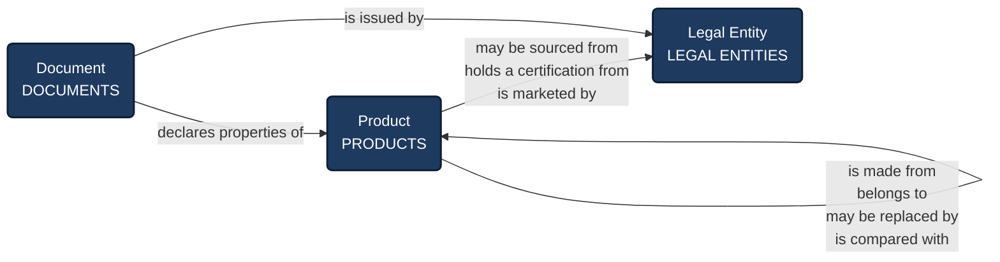
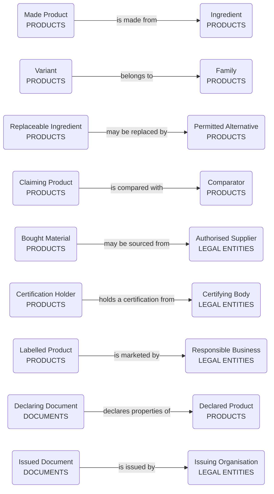
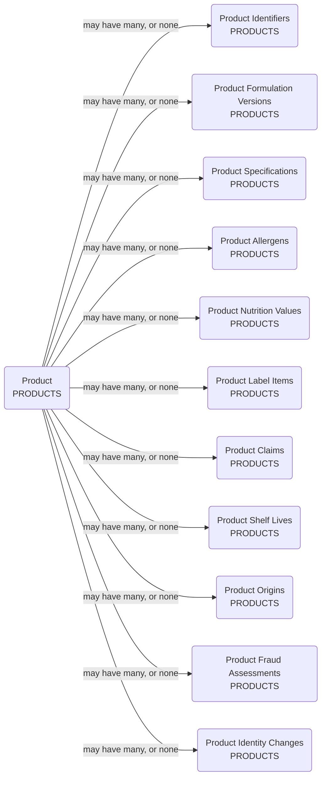
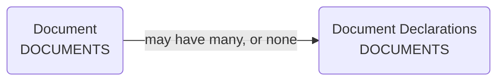
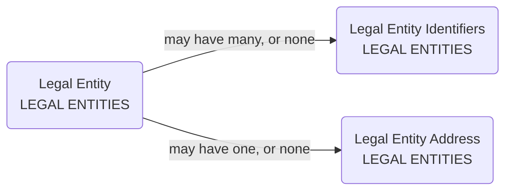

# CPG Food and Beverage — Product and Ingredient Data Model Design Document

###About This Document
This **Data Model Design Document** by **M&A Operating System** provides a single traceable review of one scoped area of a business: the business requirements that area works to, how those requirements translate into data requirements, and how those data requirements translate into a data model design. Every part of the design traces back to the requirement that made it necessary and to the source that evidences it, so that each statement can be followed in either direction. It is written in plain English for the business audience accountable for the area — the people best placed to say whether what it describes is true of their business, and who decide whether this design is recorded in a centralised Data Design Authority as the governed definition the organisation builds and reports on.

### Version

|  |  |
|---|---|
| Domain | CPG Food and Beverage — Product and Ingredient |
| Document date | 28 September 2026 |
| Package reference (the working files this document is produced from) | fnb-bdd |
| Method version | 31.5 |

**In brief.** This design covers what a food or beverage product is, what goes into it, what it must be, how long it lasts, who may supply its ingredients and what may be said about it on pack. The full summary, the questions it answers and the counts are in section 1.3. In this document, DDA means the Data Design Authority, the central register where the company's data model is kept.

## Table of Contents

- [1 Introduction](#1-introduction)
  - [1.1 About M&A Operating System](#11-about-ma-operating-system)
  - [1.2 About the MAOS Practical Data Modelling Approach](#12-about-the-maos-practical-data-modelling-approach)
  - [1.3 Summary of Findings](#13-summary-of-findings)
- [2 Scope](#2-scope)
  - [2.1 The business](#21-the-business)
  - [2.2 In scope](#22-in-scope)
  - [2.3 Out of scope](#23-out-of-scope)
  - [2.4 Shared with other models](#24-shared-with-other-models)
  - [2.5 Assumptions](#25-assumptions)
  - [2.6 Open questions](#26-open-questions)
- [3 Business Requirements](#3-business-requirements)
- [4 Data Requirements](#4-data-requirements)
- [5 Data Model](#5-data-model)
  - [5.1 Subject Domains](#51-subject-domains)
  - [5.2 Canonical Roles](#52-canonical-roles)
  - [5.3 Role–Verb–Role Relationships](#53-roleverbrole-relationships)
  - [5.4 Concepts](#54-concepts)
  - [5.5 Lookups and Values](#55-lookups-and-values)
  - [5.6 Diagrams](#56-diagrams)
- [6 Outstanding Decisions](#6-outstanding-decisions)
- [Appendix A — Sources](#appendix-a--sources)
- [Appendix B — Data Modelling Principles](#appendix-b--data-modelling-principles)
  - [Where the principles and the requirements could not be reconciled](#where-the-principles-and-the-requirements-could-not-be-reconciled)

## 1 Introduction

### 1.1 About M&A Operating System

#### M&A Operating System — AI & Data Advisory Practice

**M&A Operating System (MAOS) helps organizations turn data into measurable business outcomes.**

Our **AI & Data Advisory Practice** works with senior business, data, analytics, and technology leaders to improve how their organizations use information to grow revenue, understand customers, make better decisions, reduce operating cost, manage risk, and enable analytics and AI.

Most organizations do not lack data. They struggle to turn the data they already have into information the business can consistently trust and use. Customer information is fragmented, reports disagree, data is repeatedly copied and transformed, and business definitions vary across teams. Analytics and AI initiatives then inherit the same problems.

We start with the business outcome and work backwards to the information, architecture, governance, operating model, and technology changes required to achieve it. That may mean improving customer identity to support segmentation and personalization, creating more reliable management information, simplifying complex data flows, or establishing the trusted business context required for AI.

Our work typically includes:

- Improving customer identity, segmentation, personalization, and revenue-growth capabilities
- Solving complex data management and data content design issues for Legal Entity, Beneficial Owner, People, Securities, Product Definition and transactional data
- Creating more consistent, timely, and trusted information for reporting, analytics, forecasting, and decision-making
- Designing and maintaining business-aligned data models for operational, analytical, and AI needs
- Resolving data quality, reliability, and performance issues caused by complex data flows, fragmented connectivity, duplication, and uncontrolled data propagation
- Establishing trusted views of customers, legal entities, products, accounts, agreements, and other critical business subjects
- Simplifying data architectures and reducing unnecessary movement, duplication, and technology complexity
- Establishing practical data governance, ownership, and AI readiness aligned to business priorities

Our goal is not simply to modernize data technology. It is to make information work better for the business.

**The value of a data program should ultimately be measured by what the business can do better because of it.**

#### Find Out More

To learn more about how M&A Operating System can help your organization turn data into measurable business outcomes, visit [maoperatingsystem.com](https://www.maoperatingsystem.com).

For a direct conversation about your data, analytics, or AI priorities, contact [cdao-advisory@maoperatingsystem.com](mailto:cdao-advisory@maoperatingsystem.com).

### 1.2 About the MAOS Practical Data Modelling Approach

#### About the M&A Operating System Practical Data Modelling Approach

The **M&A Operating System Practical Data Modelling Approach** is our proprietary, business-led methodology for translating business outcomes and challenges into data requirements and approved logical data models.

We engage business stakeholders and data-consuming groups to understand what they expect data services to make possible. Their needs are captured as plain-English business requirements, then translated through a controlled, traceable sequence of analysis and design activities. The methodology deliberately avoids overly technical terminology and modelling techniques, presenting the information in a business-readable, plain-English form. The resulting data modelling document follows the same sequence, allowing business stakeholders and data practitioners to understand, challenge, and approve the design.

#### The Five-Step Process

##### Step 1 — Gather and Approve Business Requirements

We identify the outcomes stakeholders expect, the challenges they need to solve, and the business activities that data services must support. These are documented as plain-English requirements and approved as the scope and source of knowledge for the design.

##### Step 2 — Identify Actors, Objects, and Roles

Using **Subject-Based Data Modelling**, we identify the actors, roles, and objects in the business lifecycle and map them to domains representing the immutable subjects of the data. Domains describe the enduring people, organizations, things, places, and other subjects the business needs to understand—not the specific reason they appear in a single process.

Actors and objects are aligned to their underlying mastered subjects. Roles describe the capacity in which a subject participates in a relationship, process, or context. The same subject can perform several roles without being modelled repeatedly.

##### Step 3 — Identify Relationships

We identify the relationships between actors and objects and express them as clear business verbs—such as owns, manages, supplies, purchases, or is party to. This makes their meaning understandable and reviewable by business and data stakeholders.

##### Step 4 — Identify Lifecycle Events

We identify the events that actors, roles, and objects pass through as they live their natural lives and interact within business processes. These events include when an object is created, changed, activated, transferred, or retired; a subject assumes or ceases a role; or a relationship is established, modified, or ended. This determines what data must be captured at each stage.

##### Step 5 — Design Logical Data Models

The approved requirements, subjects, roles, relationships, and lifecycle events form the logical data model, documented through four connected components:

- **Data Domains** — governed groupings representing the immutable subjects of the data
- **Data Concepts** — the unique logical elements that make up the data known and recorded about each subject
- **Data Relationships** — the business connections between concepts, including the roles they perform
- **Data Attributes** — the individual data elements that describe each concept or relationship

Each component remains traceable to the requirement that established its need. The completed document provides the shared record business stakeholders and data practitioners use to review and approve the data requirements and model design.

### 1.3 Summary of Findings

This design covers what a food or beverage product is, what goes into it, what it must be, how long it lasts, who may supply its ingredients and what may be said about it on pack. The formulation, meaning the list of what goes into a product and how much, is at its heart. The order ingredients are listed in, the allergens, the nutrition values and the claims on a pack all follow from the formulation, so a change to it shows which labels and claims it reaches. Where an ingredient is bought in already made, the design relies on what the supplier declares is inside it, and records who declared it and whether it was checked.

The design has three stated limits. It cannot say what is inside a bought-in ingredient beyond what the supplier declares. It finds every product that uses a recalled ingredient but not which batches, which belongs to the manufacturing model. It keeps a shelf life for each product and does not work one out from the shelf lives of its ingredients, because none of the sources describe a rule for doing so.

**What the business can answer with this design**

- We reformulate to cut sugar by 30%. Which claims and labels does that reach?
- A supplier changes what is inside an ingredient. Which of our labels does that reach?
- Which allergens must this product declare, and which ingredient brings each one?
- Which suppliers may supply this ingredient today, and which could on a past date?
- Which of this ingredient's stated properties did we check, and which did we take on the supplier's word?

This design creates thirteen concepts, nine relationships and nine lists of values in DDA, adds three values to one existing list, and reuses three existing domains, four existing concepts and one existing list of values.

|  | Count |
|---|---|
| Business requirements | 33 |
| Data requirements | 18 |
| Areas of the business covered (domains) | 3 (3 already in DDA) |
| Roles, meaning the part something plays in a relationship | 18 |
| Relationships between roles | 9 |
| Concepts, meaning groups of related facts | 17 |
| Lists of allowed values | 11 |
| Sources | 29 |

## 2 Scope

### 2.1 The business

This design covers the product and ingredient information of a food and beverage manufacturer: what a product is, what it is made from, what it must be, who may supply its ingredients and what may be said about it on pack.

### 2.2 In scope

| ID | In scope |
|---|---|
| SCI001 | What a product is — how it is identified, and how its sizes, packs and versions relate |
| SCI002 | What a product is made from — its ingredients and packaging, and how much of each |
| SCI003 | What a product and its ingredients must be — specifications and their limits |
| SCI004 | What must be declared on pack — ingredients, allergens, nutrition, origin, date marks and claims |
| SCI005 | Which suppliers may supply each ingredient, and on what evidence |
| SCI006 | What a supplier states about what it supplies, and whether it was checked |
| SCI007 | How long a product lasts, and under what storage conditions |

### 2.3 Out of scope

What this design leaves out, and the model that is intended to own it.

| ID | Out of scope | Owned by another model |
|---|---|---|
| SCO001 | How a product is made — steps, settings and the instructions issued for a batch | Manufacturing operations model |
| SCO002 | Factories, lines and the machines in them | Manufacturing operations model |
| SCO003 | Batches made, what they used, yields and stoppages | Manufacturing operations model |
| SCO004 | Movements, storage, stock and despatch | Supply chain model |
| SCO005 | Batch-level traceability and recall scoping | Manufacturing operations model |
| SCO006 | Testing each delivery of an ingredient. Whether the organisation checked a supplier's document is in scope; testing each delivery is not. | Manufacturing operations model |
| SCO007 | Trade spending, pricing and retail execution | Commercial model |
| SCO008 | Marketing and campaigns | Digital marketing model |

### 2.4 Shared with other models

These are used as DDA already holds them.

| ID | Shared area | In DDA |
|---|---|---|
| SCS001 | Legal Entities | [DMD000000012](https://datadesign.maoperatingsystem.com/models/domains/DMD000000012) |
| SCS002 | Documents | [DMD000000016](https://datadesign.maoperatingsystem.com/models/domains/DMD000000016) |
| SCS003 | Products | [DMD000000032](https://datadesign.maoperatingsystem.com/models/domains/DMD000000032) |

### 2.5 Assumptions

| ID | Assumption |
|---|---|
| SCA001 | Material held by a supplier is the supplier's. This design is about definitions and declarations, not stock. |
| SCA002 | Something bought as an ingredient may be another company's finished product, and what is inside it may not be known here. |
| SCA003 | Where a declaration is worked out from what goes in, the design keeps the inputs and the declared value. It does not keep the calculation. |
| SCA004 | This design is built from published sources. No one inside the business has been interviewed, so the owner named for each requirement is a proposal for the business to confirm. |
| SCA005 | What changes over time is kept with dates: formulations, specifications, supplier authorisations, certifications and shelf lives. The design does not follow a product from launch to discontinuation as a single lifecycle. |
| SCA006 | The manufacturing, supply chain, commercial and digital marketing models named in section 2.3 are the intended owners of what this design leaves out. Whether each already exists has not been confirmed. |

### 2.6 Open questions

| ID | Question |
|---|---|
| SCQ001 | Which markets are the products sold in? The rules on what must appear on pack, the conditions for claims and the allergens to declare differ between markets. The design carries the allergens of the United States and the European Union, and a product declares those of the markets it is sold in. |
| SCQ002 | Are nutrition values worked out by testing the finished product, by calculating from its ingredients, or both? All three are allowed, and the design keeps how each value was arrived at. |

## 3 Business Requirements

Each requirement can be checked against the source beside it. Appendix A says which country or region each source applies to; which rules apply to a product depends on the market it is sold in (open question SCQ001).

| ID | Category | Business requirement | Proposed owner | Sources |
|---|---|---|---|---|
| REQ001 | Product | A product is either something the organisation sells, or an ingredient or packaging item it buys in order to make one. | Technical lead | [SRC002](https://www.gs1nz.org/assets/Resources/Services/GS1NZ_Fact-sheet-gtin-allocation-rules.-V2.pdf), [SRC015](https://www.bsigroup.com/globalassets/localfiles/vi-vn/news/CE%20Marking/bsi_supplier_management_food_assessment_a4_brochure_en_in_092019_web.pdf) |
| REQ002 | Product | A product is made from a defined set of ingredients and packaging items in defined quantities, and that definition changes over time. | Technical lead | [SRC002](https://www.gs1nz.org/assets/Resources/Services/GS1NZ_Fact-sheet-gtin-allocation-rules.-V2.pdf), [SRC004](https://library.regask.com/docs/4-labeling-requirements-78) |
| REQ003 | Product | An ingredient may itself be made from other ingredients. The parts of such an ingredient must still be declared on the pack of the product that uses it. | Regulatory lead | [SRC003](https://www.bromley.gov.uk/leaflet/323910/3/733/d) |
| REQ004 | Product | Ingredients are declared heaviest first, by the weight used. Ingredients under 2%, and spice mixes where no single spice stands out, may go last. | Regulatory lead | [SRC003](https://www.bromley.gov.uk/leaflet/323910/3/733/d), [SRC004](https://library.regask.com/docs/4-labeling-requirements-78), [SRC010](https://foodlabelmaker.com/gb/regulatory-hub/fda/food-labeling-packaging/) |
| REQ005 | Product | The same ingredient goes into many products, and a product may be sold as it is and also used inside another. | Technical lead | [SRC002](https://www.gs1nz.org/assets/Resources/Services/GS1NZ_Fact-sheet-gtin-allocation-rules.-V2.pdf), [SRC003](https://www.bromley.gov.uk/leaflet/323910/3/733/d) |
| REQ006 | Product | When an alternative ingredient is used in place of a specified one, the change must carry through the specification, the recipe, the product information and the label. | Technical lead | [SRC020](https://humanfocus.co.uk/blog/supplier-change-control-failures-during-food-substitutions/) |
| REQ007 | Product | Where an ingredient is itself a made product, what is inside it must still be known well enough to declare it, and where the organisation did not make it, that knowledge comes from the supplier. | Technical lead | [SRC003](https://www.bromley.gov.uk/leaflet/323910/3/733/d), [SRC019](https://www.cleverence.com/amp/articles/business-blogs/guide-batch-tracking-5829/) |
| REQ008 | Identity | The same product is sold in several sizes and pack formats, related to each other but identified and counted separately. | Commercial lead | [SRC001](https://www.gs1uk.org/sites/default/files/The_GTIN_management_handbook.pdf), [SRC002](https://www.gs1nz.org/assets/Resources/Services/GS1NZ_Fact-sheet-gtin-allocation-rules.-V2.pdf) |
| REQ009 | Identity | A change to the declared ingredients, the net quantity, a certification mark or the pack count makes a different product. Other changes do not. | Regulatory lead | [SRC001](https://www.gs1uk.org/sites/default/files/The_GTIN_management_handbook.pdf), [SRC002](https://www.gs1nz.org/assets/Resources/Services/GS1NZ_Fact-sheet-gtin-allocation-rules.-V2.pdf) |
| REQ010 | Identity | What goes into a product changes over time while it remains the same product. | Technical lead | [SRC001](https://www.gs1uk.org/sites/default/files/The_GTIN_management_handbook.pdf) |
| REQ011 | Identity | An identifier issued by an outside authority, such as a trade item number, is the strongest evidence of which product something is. | Data steward | [SRC001](https://www.gs1uk.org/sites/default/files/The_GTIN_management_handbook.pdf), [SRC002](https://www.gs1nz.org/assets/Resources/Services/GS1NZ_Fact-sheet-gtin-allocation-rules.-V2.pdf) |
| REQ022 | Specification | An ingredient or product must meet a stated specification, and what it must be changes over time. | Quality manager | [SRC026](https://ascfoodsafety.com/?p=39508), [SRC015](https://www.bsigroup.com/globalassets/localfiles/vi-vn/news/CE%20Marking/bsi_supplier_management_food_assessment_a4_brochure_en_in_092019_web.pdf) |
| REQ023 | Specification | What a supplier says an ingredient is must be comparable with what the organisation specified, including whether it is what it claims to be. | Quality manager | [SRC026](https://ascfoodsafety.com/?p=39508), [SRC016](https://www.nsf.org/za/en/training/series/brcgs-vulnerability-assessment-for-food-fraud) |
| REQ012 | Declaration | Every pre-packed product must carry a defined set of information: its name, its ingredients, the allergens among them, the quantity of certain ingredients, the net quantity, a date mark, storage and use conditions, the responsible business and its address, and the country of origin. | Regulatory lead | [SRC006](https://teagasc.ie/wp-content/uploads/media/website/rural-economy/rural-development/diversification/5-Pre-Packaged-Food-Labels.pdf), [SRC007](https://gimb.public.lu/en/gesond-iessen/bien-manger/etiquettage-nutritionnel.html) |
| REQ013 | Declaration | An allergen is declared by the food it comes from, including when it arrives inside another ingredient. | Quality manager | [SRC008](https://www.hoganlovells.com/en/publications/fda-releases-draft-compliance-policy-guide-for-major-food-allergen-labeling-and-cross-contact), [SRC009](https://www.fda.gov/regulatory-information/search-fda-guidance-documents/cpg-sec-555250-statement-policy-labeling-and-preventing-cross-contact-common-food-allergens), [SRC027](https://www.legislation.gov.uk/eur/2011/1169/annex/II), [SRC028](https://www.fda.gov/food/food-allergensgluten-free-guidance-documents-regulatory-information/frequently-asked-questions-food-allergen-labeling-guidance-industry) |
| REQ014 | Declaration | Nutrition must be declared, and the values may come from analysis of the product, from calculation from the ingredients used, or from accepted published data. | Regulatory lead | [SRC005](https://library.regask.com/docs/4-labeling-requirements-49), [SRC011](https://www.eurofir.org/wp-admin/wp-content/uploads/2015/12/EUROFIR-RECIPE-GUIDELINE_FINAL.pdf) |
| REQ015 | Declaration | Working nutrition out from the ingredients has to allow for the edible part of each, for weight change in preparation and for nutrients lost or gained. | Technical lead | [SRC012](https://www.cfs.gov.hk/english/food_leg/files/wsm4_indirect_nutrient_analysis_e.pdf), [SRC011](https://www.eurofir.org/wp-admin/wp-content/uploads/2015/12/EUROFIR-RECIPE-GUIDELINE_FINAL.pdf) |
| REQ016 | Declaration | Declared values are averages and are allowed to vary within stated tolerances. | Regulatory lead | [SRC011](https://www.eurofir.org/wp-admin/wp-content/uploads/2015/12/EUROFIR-RECIPE-GUIDELINE_FINAL.pdf) |
| REQ017 | Declaration | A claim about a product may only be made where stated conditions are met, and making it obliges the label to carry the figure behind it. | Regulatory lead | [SRC013](https://afgc.org.au/wp-content/uploads/2025/08/2025-Webinar-3-Food-Standards-Code-AFGC.pdf) |
| REQ018 | Declaration | A claim that compares a product with others requires a named comparator and a defined difference. | Regulatory lead | [SRC014](https://www.eeb.gov.hk/food/download/press_and_publications/otherinfo/050826_labelling/tech_meeting4_comparative.pdf) |
| REQ019 | Declaration | A product must not carry information that misleads the buyer or suggests it has medicinal properties. | Regulatory lead | [SRC007](https://gimb.public.lu/en/gesond-iessen/bien-manger/etiquettage-nutritionnel.html) |
| REQ020 | Declaration | Which rules a product must follow depends on the market it is sold in. | Regulatory lead | [SRC007](https://gimb.public.lu/en/gesond-iessen/bien-manger/etiquettage-nutritionnel.html), [SRC010](https://foodlabelmaker.com/gb/regulatory-hub/fda/food-labeling-packaging/), [SRC027](https://www.legislation.gov.uk/eur/2011/1169/annex/II), [SRC028](https://www.fda.gov/food/food-allergensgluten-free-guidance-documents-regulatory-information/frequently-asked-questions-food-allergen-labeling-guidance-industry) |
| REQ021 | Declaration | Where a country of origin is declared on pack, the organisation must be able to show where the ingredient or product comes from. | Regulatory lead | [SRC006](https://teagasc.ie/wp-content/uploads/media/website/rural-economy/rural-development/diversification/5-Pre-Packaged-Food-Labels.pdf) |
| REQ024 | Shelf life | How long a product lasts depends on how it is stored, and is limited by whichever is shorter of its safe life and its quality life. | Quality manager | [SRC023](https://efsa.europa.eu/en/efsajournal/pub/6306), [SRC025](https://cdnmedia.eurofins.com/european-west/media/jtgbfkxv/eurofins-determining-shelf-life-ftuki102.pdf) |
| REQ025 | Shelf life | A shelf life is set for ingredients and part-made goods as well as for finished products. | Quality manager | [SRC024](https://www.fdfscotland.org.uk/globalassets/resources/publications/guidance/shelf-life-guidance.pdf) |
| REQ026 | Shelf life | A product carries a date mark — use-by where the food could soon become unsafe, best-before where it only loses quality — and the business labelling it decides which. | Regulatory lead | [SRC022](https://www.fsai.ie/Business-Advice/Running-a-Food-Business/Food-Safety-and-Hygiene/Shelf-life/Shelf-life-Best-before-and-Use-by-Dates), [SRC006](https://teagasc.ie/wp-content/uploads/media/website/rural-economy/rural-development/diversification/5-Pre-Packaged-Food-Labels.pdf) |
| REQ027 | Sourcing | An ingredient may be bought from several authorised suppliers, and an authorisation may lapse or be suspended. | Procurement lead | [SRC015](https://www.bsigroup.com/globalassets/localfiles/vi-vn/news/CE%20Marking/bsi_supplier_management_food_assessment_a4_brochure_en_in_092019_web.pdf), [SRC018](https://www.salsafood.co.uk/news/add0d885-6016-4280-9ce9-820cc152bc39-354) |
| REQ028 | Sourcing | A documented programme of authorising suppliers must cover every ingredient and every packaging item that goes into a finished product. | Procurement lead | [SRC015](https://www.bsigroup.com/globalassets/localfiles/vi-vn/news/CE%20Marking/bsi_supplier_management_food_assessment_a4_brochure_en_in_092019_web.pdf) |
| REQ029 | Sourcing | Every ingredient must be assessed for how likely it is to be tampered with or swapped for something cheaper. | Quality manager | [SRC016](https://www.nsf.org/za/en/training/series/brcgs-vulnerability-assessment-for-food-fraud), [SRC017](https://www.highspeedtraining.co.uk/hub/food-vulnerability-assessment-checklist/) |
| REQ030 | Sourcing | Where an ingredient is found to be at particular risk, extra checks must be put in place for it. | Quality manager | [SRC017](https://www.highspeedtraining.co.uk/hub/food-vulnerability-assessment-checklist/), [SRC016](https://www.nsf.org/za/en/training/series/brcgs-vulnerability-assessment-for-food-fraud) |
| REQ031 | Sourcing | A supplier states what it has supplied, and the organisation may or may not check that statement. | Quality manager | [SRC019](https://www.cleverence.com/amp/articles/business-blogs/guide-batch-tracking-5829/), [SRC026](https://ascfoodsafety.com/?p=39508) |
| REQ032 | Sourcing | A supplier must tell the organisation of changes that could affect an ingredient's safety, quality, shelf life, declared contents, allergens or nutrition, and of any loss of a site's certification. | Procurement lead | [SRC021](https://www.ifsqn.com/forum/index.php/topic/50089-sqf-2324-supplier-notification-of-product-composition-changes/), [SRC020](https://humanfocus.co.uk/blog/supplier-change-control-failures-during-food-substitutions/) |
| REQ033 | Sourcing | A product's certification comes from a named body, is valid for a set period, and can be revoked. | Quality manager | [SRC001](https://www.gs1uk.org/sites/default/files/The_GTIN_management_handbook.pdf), [SRC015](https://www.bsigroup.com/globalassets/localfiles/vi-vn/news/CE%20Marking/bsi_supplier_management_food_assessment_a4_brochure_en_in_092019_web.pdf) |

## 4 Data Requirements

What the business must keep, the questions it must be able to answer, and the mistakes the design prevents. Each links back to the requirements it serves.

| ID | The business must keep | It must be able to answer | When | Mistakes it must prevent | How the design prevents them | Requirements |
|---|---|---|---|---|---|---|
| DRQ001 | Every line of a product's formulation: the product, the ingredient or packaging item, and how much of it is used Which version of the formulation each line belongs to | What goes into this product, and what is inside each of those ingredients? | Today and on any past date | A product that ends up containing itself, however many steps away A formulation put together from lines that belong to two different versions | A product cannot be listed as an ingredient of itself, directly or through other products. Every line of a formulation must say which version it belongs to. | [REQ001](#req001) · [REQ002](#req002) · [REQ003](#req003) · [REQ005](#req005) |
| DRQ002 | The same information, read starting from an ingredient | Which products contain this ingredient, by any route? | Today | — | — | [REQ005](#req005) |
| DRQ003 | How much of each ingredient is used, and whether it may go at the end of the list | In what order must this product's ingredients be declared, and which may go at the end? | On any past date | — | — | [REQ004](#req004) |
| DRQ004 | Which alternatives may stand in for an ingredient, the conditions for using each, and what using it changes on the label | Which alternatives are permitted for this ingredient, and what does using one change on the label? | On any past date | An alternative recorded without saying what it changes on the label | Every permitted alternative must state what using it changes on the label. | [REQ006](#req006) |
| DRQ005 | Where an ingredient is bought in already made, who supplies it and what the supplier says is inside it | Which of our products rest on an ingredient whose contents only the supplier can declare? | Today | — | — | [REQ007](#req007) |
| DRQ006 | Each size and pack as its own product, linked to its family, with what makes it differ Each change to a product, whether it made a different product or a new version, and why | Which packs of this product exist, and did this change make a different product? | On any past date | — | — | [REQ008](#req008) · [REQ009](#req009) · [REQ010](#req010) |
| DRQ007 | Every item that must appear on pack for a product in a market, and what it says The business named on the pack as answerable for the product | Is everything this market requires on this pack present, and what does each item say? | On any past date | A pack item recorded without the market whose rules require it | Every pack item must state the market whose rules require it. | [REQ012](#req012) · [REQ020](#req020) |
| DRQ008 | Each allergen an ingredient carries, named by the food it comes from and by the market whose list it belongs to | Which allergens must this product declare, and which ingredient brings each one? | Today and on any past date | A product declared free of an allergen one of its ingredients carries | A product's allergens are worked out from everything in its formulation, so an allergen that an ingredient carries cannot be left off. | [REQ013](#req013) |
| DRQ009 | Each nutrition value shown on pack, how it was arrived at, and how far it may vary For a calculated value, the allowance made for the edible part, for weight change in preparation and for nutrient loss | What are this product's nutrition values, how was each arrived at, and how far may each vary? | On any past date | A nutrition value shown without saying how it was arrived at | Every nutrition value must say how it was arrived at. | [REQ014](#req014) · [REQ015](#req015) · [REQ016](#req016) |
| DRQ010 | Each claim made, the market it is made in, the condition it rests on, and the product it is compared with where it compares | Which claims does this pack make, and does each still meet its condition? | On any past date | A claim kept after its condition stops being met | Whether a claim's condition is still met is worked out from the current values, so a claim cannot outlive its condition unnoticed. | [REQ017](#req017) · [REQ018](#req018) · [REQ019](#req019) |
| DRQ011 | Each version of what a product or ingredient must be, with its limits | What must this ingredient be, and what did it have to be on a past date? | On any past date | — | — | [REQ022](#req022) |
| DRQ012 | What a supplier's document says about what it supplied, who issued it and when, and whether the organisation checked it | Which of this ingredient's stated properties did we check, and which did we take on the supplier's word? Which supplier documents about an ingredient are newer than the formulation of a product that uses it? | On any past date | A supplier's statement shown as though the organisation had checked it | Every supplier statement must say whether the organisation checked it. | [REQ023](#req023) · [REQ031](#req031) · [REQ032](#req032) |
| DRQ013 | How long a product, ingredient or part-made good lasts under each storage condition, and which date mark it carries | How long does this last under each storage condition, and which date mark does it carry? | On any past date | — | — | [REQ024](#req024) · [REQ025](#req025) · [REQ026](#req026) |
| DRQ014 | Each supplier authorised for each ingredient or packaging item, under which programme, and for what period | Which suppliers may supply this ingredient today, and which could on a past date? Which ingredients and packaging items have no authorised supplier? | On any past date | An authorisation treated as current after it has lapsed | Every supplier authorisation has a start and an end date, so a lapsed authorisation is never treated as current. | [REQ027](#req027) · [REQ028](#req028) |
| DRQ015 | Each ingredient's fraud-risk assessment, what it found, and the extra checks it calls for | Which ingredients are most at risk of fraud, and what is in place for them? | On any past date | — | — | [REQ029](#req029) · [REQ030](#req030) |
| DRQ016 | Each certification a product holds, who granted it, and the period it is valid for | Which certifications does this product hold, from whom, and are they still valid? | Today and on any past date | A certification shown as current after it has lapsed | Every certification has a start and an end date, so a lapsed certification is never shown as current. | [REQ033](#req033) |
| DRQ017 | The identifiers a product carries, who issued each, and the period each was in use | Which product is this, whatever identifier the retailer or supplier used? | Today | — | — | [REQ011](#req011) |
| DRQ018 | Where a country of origin is declared, which country and what it rests on | Where does this ingredient or product come from, as declared? | On any past date | — | — | [REQ021](#req021) |

## 5 Data Model

**How to read this section.** A *domain* is an area of the business the design keeps information about. A *concept* is a group of related facts kept about something in a domain. A *role* is the part something plays, such as an organisation while it supplies goods. A *relationship* links two roles with a verb that reads naturally in both directions. A *list of values* is a fixed set of allowed answers. Names follow DDA's naming rules, so a concept called ProductAllergens is the group of facts about a product's allergens.

### 5.1 Subject Domains

| Domain | In DDA | Main concept | What it covers | Roles | Concepts |
|---|---|---|---|---|---|
| DOM001 **Products** | [DMD000000032](https://datadesign.maoperatingsystem.com/models/domains/DMD000000032) | Product | Everything an organisation makes, buys or sells, including ingredients, packaging, sizes and packs. This design uses it for what each product is, what it is made from, what it must be, how long it lasts and what its pack says. The domain has no concepts in DDA yet, so this design adds them. | [12](#52-canonical-roles) | [12](#54-concepts) |
| DOM003 **Documents** | [DMD000000016](https://datadesign.maoperatingsystem.com/models/domains/DMD000000016) | Document | Documents that give evidence for business processes. This design uses it for supplier certificates of analysis, change notices, certification documents and specification sheets. | [2](#52-canonical-roles) | [2](#54-concepts) |
| DOM002 **Legal Entities** | [DMD000000012](https://datadesign.maoperatingsystem.com/models/domains/DMD000000012) | Legal Entity | Organisations of every kind. This design uses it for suppliers, certifying bodies, the business named on a pack and the organisations that issue supplier documents. | [4](#52-canonical-roles) | [3](#54-concepts) |

### 5.2 Canonical Roles

A role describes what something is while it is in a relationship. The same product can play several roles at once.

| Area | Role | What it means | Requirements |
|---|---|---|---|
| Products | ROL001 **Made Product** | A product is a Made Product while it is made from other products. This is how the parts of a finished product are found. It is not a Variant, which is only another size or pack of the same product. | [REQ002](#req002) · [REQ003](#req003) |
| Products | ROL002 **Ingredient** | A product is an Ingredient while it goes into another product. This is how every product an ingredient ends up in is found. It is not a Bought Material, which says an item is bought in and nothing about where it goes. | [REQ002](#req002) · [REQ005](#req005) |
| Products | ROL003 **Variant** | A product is a Variant while it belongs to another product that groups related sizes and packs, such as the 200g pack of a biscuit. It is sold and counted on its own. It is not a Made Product, which is defined by what goes into it and not by the group it belongs to. | [REQ008](#req008) |
| Products | ROL004 **Family** | A product is a Family while it has other products as its sizes and packs. It lets the related packs be found together. It is not an Ingredient, which is defined by where a product goes and not by what it groups. | [REQ008](#req008) |
| Products | ROL005 **Replaceable Ingredient** | A product is a Replaceable Ingredient while it may be replaced by another product. It shows which ingredients have a cleared substitute, so the effect of a swap on the label can be looked up. It is not an Ingredient, which says only that an item goes into something. | [REQ006](#req006) |
| Products | ROL006 **Permitted Alternative** | A product is a Permitted Alternative while it may stand in for another product, under stated conditions. It is not a Bought Material, which is about who supplies an item and not about whether it may replace another. | [REQ006](#req006) |
| Products | ROL007 **Claiming Product** | A product is a Claiming Product while it is compared with another product in a claim on its pack, such as lower in sugar than another. It is not a Labelled Product, which is defined by naming a responsible business and not by making a comparison. | [REQ018](#req018) |
| Products | ROL008 **Comparator** | A product is a Comparator while it is used to compare another product in a claim on that product's pack. It is the reference the claim is measured against, whether a named product or an average of leading brands. It is not a Permitted Alternative, which stands in for an ingredient and is not measured against. | [REQ018](#req018) |
| Products | ROL009 **Bought Material** | A product is a Bought Material while it may be sourced from an outside organisation. It shows which ingredients rely on an outside organisation. It is not an Ingredient, which is about where an item goes and not where it comes from. | [REQ027](#req027) · [REQ028](#req028) · [REQ007](#req007) |
| Legal Entities | ROL010 **Authorised Supplier** | An organisation is an Authorised Supplier while it may supply a product, for a stated period. It is cleared to supply a particular ingredient or packaging item. It is not a Certifying Body, which grants certifications and does not supply anything. | [REQ027](#req027) · [REQ028](#req028) |
| Products | ROL011 **Certification Holder** | A product is a Certification Holder while it holds a certification from another party. The certification can be revoked. It is not a Labelled Product, which is about who is named as answerable on the pack and not about a certification held. | [REQ033](#req033) |
| Legal Entities | ROL012 **Certifying Body** | An organisation is a Certifying Body while it grants a certification to another party, for a stated period. It stands behind that certification. It is not an Authorised Supplier, which supplies goods and does not grant anything. | [REQ033](#req033) |
| Products | ROL013 **Labelled Product** | A product is a Labelled Product while it is marketed by another party named on its pack. The pack names who is answerable for it. It is not a Certification Holder, which holds a certification and does not name a party. | [REQ012](#req012) |
| Legal Entities | ROL014 **Responsible Business** | An organisation is a Responsible Business while it markets a product under its own name and address. It is the business the pack names as answerable. It is not an Authorised Supplier, which supplies an ingredient to a manufacturer and does not answer for a finished pack. | [REQ012](#req012) |
| Products | ROL015 **Declared Product** | A product is a Declared Product while another party declares properties of it, for example in a supplier's certificate of analysis. It shows which facts about a product come from outside. It is not a Bought Material, which is about where an item is sourced and not about what is said of it. | [REQ031](#req031) · [REQ023](#req023) |
| Documents | ROL016 **Declaring Document** | A document is a Declaring Document while it declares properties of something else. It is the evidence for what a supplier says it supplied. It is not an Issued Document, which is about who produced a document and not about what it states. | [REQ031](#req031) · [REQ023](#req023) |
| Documents | ROL017 **Issued Document** | A document is an Issued Document while it is issued by another party. It lets a statement be traced to whoever made it. It is not a Declaring Document, which is about what a document states about a product. | [REQ031](#req031) |
| Legal Entities | ROL018 **Issuing Organisation** | An organisation is an Issuing Organisation while it issues something to another party. It stands behind the statements in what it issues. It is not a Responsible Business, which answers for a finished pack and not for a document. | [REQ031](#req031) |

### 5.3 Role–Verb–Role Relationships

Each relationship reads as two sentences, one in each direction. *How many* says how many on one side can link to the other. *Dates kept* says whether each link records when it starts and stops.

| ID | How it reads | How many | Dates kept | Why it is needed | In DDA |
|---|---|---|---|---|---|
| REL001 | A [made product](#rol001) is made from [ingredients](#rol002). An [ingredient](#rol002) is used in [made products](#rol001). | Many to many | Yes | [DRQ001](#drq001) · [DRQ002](#drq002) · [DRQ003](#drq003) · [DRQ008](#drq008) · [DRQ009](#drq009) · [DRQ005](#drq005) | New |
| REL002 | A [variant](#rol003) belongs to a [family](#rol004). A [family](#rol004) groups [variants](#rol003). | Many to one | Yes | [DRQ006](#drq006) | New |
| REL003 | A [replaceable ingredient](#rol005) may be replaced by [permitted alternatives](#rol006). A [permitted alternative](#rol006) may stand in for [replaceable ingredients](#rol005). | Many to many | Yes | [DRQ004](#drq004) | New |
| REL004 | A [claiming product](#rol007) is compared with [comparators](#rol008). A [comparator](#rol008) is used to compare [claiming products](#rol007). | Many to many | Yes | [DRQ010](#drq010) | New |
| REL005 | A [bought material](#rol009) may be sourced from [authorised suppliers](#rol010). An [authorised supplier](#rol010) may supply [bought materials](#rol009). | Many to many | Yes | [DRQ014](#drq014) · [DRQ005](#drq005) | New |
| REL006 | A [certification holder](#rol011) holds a certification from [certifying bodies](#rol012). A [certifying body](#rol012) grants a certification to [certification holders](#rol011). | Many to many | Yes | [DRQ016](#drq016) | New |
| REL007 | A [labelled product](#rol013) is marketed by a [responsible business](#rol014). A [responsible business](#rol014) markets [labelled products](#rol013). | Many to one | Yes | [DRQ007](#drq007) | New |
| REL008 | A [declaring document](#rol016) declares properties of [declared products](#rol015). A [declared product](#rol015) is declared by [declaring documents](#rol016). | Many to many | No | [DRQ012](#drq012) | New |
| REL009 | An [issued document](#rol017) is issued by an [issuing organisation](#rol018). An [issuing organisation](#rol018) issues [issued documents](#rol017). | Many to one | No | [DRQ012](#drq012) | New |

### 5.4 Concepts

Every concept the design uses, whether DDA already has it or the design adds it. The code beneath each name is its DDA name.

| Area | Concept | In DDA | What it is | Sits under | How many | Why it is needed |
|---|---|---|---|---|---|---|
| Products | SBJ001 **Product** Product | New | There is one of these for each product the business sells, and for each ingredient or packaging item it buys to make one. Everything else about a product refers back to it: what it is made from, what it must be, how long it lasts and what its pack says are each kept in their own concept. It is not a batch, which is one production run of a product. | — | — | [DRQ001](#drq001) · [DRQ002](#drq002) · [DRQ005](#drq005) |
| Products | SBJ005 **Product Allergens** ProductAllergens | New | There is one of these for each allergen a product must declare in a market. The allergen is a value from the list for that market, so a product sold in two markets has an entry for each. You can rely on it to say which allergens are declared and whether each is known only because a supplier said so; for a product made from other products, the allergens they bring in are worked out from its formulation. It is not cross-contact in a factory, which is a manufacturing matter. | Product | Each product may have many, or none | [DRQ008](#drq008) |
| Products | SBJ008 **Product Claims** ProductClaims | New | There is one of these for each claim a pack makes in a market. You can rely on it for the wording, the condition the claim rests on, and whether the declared values still meet that condition. It is not the nutrition values a condition rests on, which are kept as nutrition values, and the product a claim compares with is named through the comparison relationship. | Product | Each product may have many, or none | [DRQ010](#drq010) |
| Products | SBJ003 **Product Formulation Versions** ProductFormulationVersions | New | There is one of these for each version of a product's formulation, with the date it applies from and the market it applies in. You can rely on it to say which version of what goes into a product is in force, so that every ingredient line belongs to exactly one version. It is not the ingredient lines themselves, which are the relationship between a product and what it is made from. | Product | Each product may have many, or none | [DRQ001](#drq001) · [DRQ006](#drq006) |
| Products | SBJ011 **Product Fraud Assessments** ProductFraudAssessments | New | There is one of these for each assessment of an ingredient's exposure to tampering or substitution. You can rely on it for how likely the ingredient is judged to be swapped for something cheaper, what that rested on, and what extra checks it calls for. It is not the checks made on a delivery, which are a manufacturing matter. | Product | Each product may have many, or none | [DRQ015](#drq015) |
| Products | SBJ002 **Product Identifiers** ProductIdentifiers | New | There is one of these for each identifier a product is known by, in each scheme, such as a trade item number or the organisation's own material number. You can rely on it to say which identifiers belong to which product and who issued each. It is not the name of the product, which belongs to the product itself, and it is not an identifier of an organisation, which belongs to the legal entity identifiers. | Product | Each product may have many, or none | [DRQ017](#drq017) |
| Products | SBJ012 **Product Identity Changes** ProductIdentityChanges | New | There is one of these for each change made to a product that affects what it is. You can rely on it to say whether the change made a different product or only a new version of what goes in, and why. It is not the new version itself, which is a formulation version, and a different product is a product of its own. | Product | Each product may have many, or none | [DRQ006](#drq006) |
| Products | SBJ007 **Product Label Items** ProductLabelItems | New | There is one of these for each item a pack must print in a market, such as the name of the food or the storage instructions. You can rely on it for what the pack actually prints, which can differ from what the formulation says it should print, so a pack that is out of step can be seen. It is not the allergen or nutrition facts, which are kept in their own concepts. | Product | Each product may have many, or none | [DRQ007](#drq007) |
| Products | SBJ006 **Product Nutrition Values** ProductNutritionValues | New | There is one of these for each nutrient value shown on a pack, for each way it was arrived at. You can rely on it for the value, how it was arrived at and how far it may vary. It is not the ingredient lines a calculated value rests on, which are the product's formulation, and it is not the claims made from a value, which are kept as claims. | Product | Each product may have many, or none | [DRQ009](#drq009) |
| Products | SBJ010 **Product Origins** ProductOrigins | New | There is one of these for each country of origin declared for a product or ingredient. You can rely on it for which country is declared and what the statement rests on. It is not the wording printed on the pack, which is a label item, and it is not who supplies the ingredient, which comes from its authorised suppliers. | Product | Each product may have many, or none | [DRQ018](#drq018) |
| Products | SBJ009 **Product Shelf Lives** ProductShelfLives | New | There is one of these for each storage condition under which a product, ingredient or part-made good has a stated shelf life. You can rely on it for how long the item lasts under that storage and which date mark it carries. It is not the date on a particular batch, which is a manufacturing matter. | Product | Each product may have many, or none | [DRQ013](#drq013) |
| Products | SBJ004 **Product Specifications** ProductSpecifications | New | There is one of these for each limit on one characteristic of a product or ingredient, in each version of its specification. You can rely on it for what a product or ingredient must be on any past date. It is not what a supplier says it delivered, which comes from the supplier's documents, and it is not the testing of a delivery, which belongs to the manufacturing model. | Product | Each product may have many, or none | [DRQ011](#drq011) · [DRQ012](#drq012) |
| Documents | SBJ016 **Document** Document | [DMC000000142](https://datadesign.maoperatingsystem.com/models/concepts/DMC000000142) | One document. This design uses it for supplier certificates of analysis, change notices, certification documents and specification sheets. | — | — | [DRQ012](#drq012) |
| Documents | SBJ017 **Document Declarations** DocumentDeclarations | New | There is one of these for each property a document states about a product or ingredient. You can rely on it for what the document says, one property at a time. It is not who issued the document or which product it is about, which come from the document's relationships, and it is not whether the organisation checked the statement, which is kept with the link to the product. | Document | Each document may have many, or none | [DRQ012](#drq012) |
| Legal Entities | SBJ013 **Legal Entity** LegalEntity | [DMC000000106](https://datadesign.maoperatingsystem.com/models/concepts/DMC000000106) | One organisation of any kind. This design uses it for suppliers, certifying bodies, the business named on a pack and the organisations that issue supplier documents. | — | — | [DRQ014](#drq014) · [DRQ017](#drq017) · [DRQ007](#drq007) |
| Legal Entities | SBJ015 **Legal Entity Address** LegalEntityAddress | [DMC000000108](https://datadesign.maoperatingsystem.com/models/concepts/DMC000000108) | An organisation's address. This design uses it for the address of the responsible business, which the pack must show. | Legal Entity | Each legal entity may have one, or none | [DRQ007](#drq007) |
| Legal Entities | SBJ014 **Legal Entity Identifiers** LegalEntityIdentifiers | [DMC000000023](https://datadesign.maoperatingsystem.com/models/concepts/DMC000000023) | The identifiers an organisation is known by. This design uses it to identify suppliers and other organisations. | Legal Entity | Each legal entity may have many, or none | [DRQ017](#drq017) |

### 5.5 Lookups and Values

Each list is a fixed set of allowed answers, so the same thing is always described the same way.

#### Kinds of document

The kinds of document that state facts about a product or an ingredient: a certificate of analysis, a change notice, a certification document or a specification sheet.

| List | In DDA | Used for |
|---|---|---|
| LKP008 DocumentTypes | New | Document |

| Value | Meaning |
|---|---|
| **Certificate of analysis** COA | A supplier's statement of what a delivery contains and how it was tested. |
| **Change notice** CHANGENOTICE | A supplier's notice of a change that could affect an ingredient. |
| **Certification document** CERTIFICATION | A certificate showing that a body has granted a certification. |
| **Specification sheet** SPECSHEET | A statement of what an ingredient or product must be. |

#### Kinds of claim

The two kinds of claim a pack can make, which decide the conditions it must meet: a claim about what the food contains, and a claim that compares it with another product.

| List | In DDA | Used for |
|---|---|---|
| LKP006 ProductClaimsTypes | New | Product Claims |

| Value | Meaning |
|---|---|
| **Nutrition content claim** CONTENT | Rests on a declared value meeting a fixed condition, such as a source of a vitamin. |
| **Comparative claim** COMPARATIVE | Rests on a stated difference against a named comparator. |

#### Allergens by market

The food allergens a product must declare, listed for each market that requires them. Every value carries its market as a prefix, US for the United States and EU for the European Union, so the same food appears once for each market. The United States list has nine allergens and the European Union list fourteen.

| List | In DDA | Used for |
|---|---|---|
| LKP001 ProductFoodBevAllergens | New | Product Allergens |

| Value | Meaning |
|---|---|
| **Milk (US)** US-MILK | United States. Declared as milk, including where it arrives as whey or casein. |
| **Egg (US)** US-EGG | United States. Declared as egg. |
| **Fish (US)** US-FISH | United States. Declared as fish. |
| **Crustacean shellfish (US)** US-CRUSTACEAN | United States. Declared as crustacean shellfish. |
| **Tree nuts (US)** US-TREENUT | United States. Declared by the nut. FDA's list of tree nuts does not include coconut. |
| **Peanuts (US)** US-PEANUT | United States. Declared as peanuts. |
| **Wheat (US)** US-WHEAT | United States. Declared as wheat. |
| **Soybeans (US)** US-SOY | United States. Declared as soy. |
| **Sesame (US)** US-SESAME | United States. Declared as sesame. Required since 1 January 2023. |
| **Cereals containing gluten (EU)** EU-GLUTEN | European Union. Wheat, including spelt and khorasan, rye, barley and oats, and their hybrids. |
| **Crustaceans (EU)** EU-CRUSTACEAN | European Union. Declared as crustaceans. |
| **Egg (EU)** EU-EGG | European Union. Declared as egg. |
| **Fish (EU)** EU-FISH | European Union. Declared as fish. |
| **Peanuts (EU)** EU-PEANUT | European Union. Declared as peanuts. |
| **Soybeans (EU)** EU-SOY | European Union. Declared as soybeans. |
| **Milk (EU)** EU-MILK | European Union. Declared as milk, including lactose. |
| **Nuts (EU)** EU-TREENUT | European Union. Almond, hazelnut, walnut, cashew, pecan, Brazil nut, pistachio and macadamia (Queensland nut). |
| **Celery (EU)** EU-CELERY | European Union. Declared as celery. |
| **Mustard (EU)** EU-MUSTARD | European Union. Declared as mustard. |
| **Sesame seeds (EU)** EU-SESAME | European Union. Declared as sesame seeds. |
| **Sulphur dioxide and sulphites (EU)** EU-SULPHITES | European Union. Declared when present at more than 10 mg/kg or 10 mg/L. |
| **Lupin (EU)** EU-LUPIN | European Union. Declared as lupin. |
| **Molluscs (EU)** EU-MOLLUSC | European Union. Declared as molluscs. |

#### Label items

The items that a pre-packed food label must show, such as the name of the food, its ingredients, allergens, net quantity, date mark and the business responsible for it.

| List | In DDA | Used for |
|---|---|---|
| LKP004 ProductLabelItemsTypes | New | Product Label Items |

| Value | Meaning |
|---|---|
| **Name of the food** NAME | The name the food is sold under. |
| **Ingredient list** INGREDIENTS | Every ingredient, heaviest first. |
| **Allergen information** ALLERGENS | Allergens, named by the food they come from. |
| **Quantity of certain ingredients** QUID | The amount of an ingredient that the name or pack stresses. |
| **Net quantity** NETQUANTITY | How much food is in the pack. |
| **Date mark** DATEMARK | The use-by or best-before date. |
| **Storage and use conditions** STORAGE | How to store and use the food. |
| **Responsible business** OPERATOR | The business answerable for the food, and its address. |
| **Country of origin** ORIGIN | Where the food, or its main ingredient, comes from. |
| **Nutrition declaration** NUTRITION | Energy and the main nutrients. |
| **Batch number** BATCH | Required in some markets only. |

#### How a nutrition value was arrived at

How a declared nutrition value was arrived at: by testing the finished food, by calculating from its ingredients, or from accepted published data. Every value must say which way it used.

| List | In DDA | Used for |
|---|---|---|
| LKP002 ProductNutritionValuesBasisTypes | New | Product Nutrition Values |

| Value | Meaning |
|---|---|
| **Analysis of the food** ANALYSIS | Measured in the finished product. |
| **Calculation from ingredients** CALCULATION | Worked out from the known values of the ingredients used, allowing for edible portion, yield and nutrient loss. |
| **Accepted published data** PUBLISHED | Taken from generally established and accepted data. |

#### Nutrients

The nutrients and energy that a nutrition declaration must show: energy, fat, saturates, carbohydrate, sugars, protein and salt. Others may be shown as well.

| List | In DDA | Used for |
|---|---|---|
| LKP003 ProductNutritionValuesNutrientTypes | New | Product Nutrition Values |

| Value | Meaning |
|---|---|
| **Energy** ENERGY | The energy value of the food. |
| **Fat** FAT | Total fat. |
| **Saturates** SATURATES | Saturated fat. |
| **Carbohydrate** CARBOHYDRATE | Total carbohydrate. |
| **Sugars** SUGARS | Sugars within the carbohydrate. |
| **Protein** PROTEIN | Total protein. |
| **Salt** SALT | Salt, or the sodium it is worked out from. |

#### Date marks

The two kinds of date mark a food can carry: use-by for foods that could soon become unsafe, and best-before for foods that only lose quality.

| List | In DDA | Used for |
|---|---|---|
| LKP005 ProductShelfLivesDateMarkTypes | New | Product Shelf Lives |

| Value | Meaning |
|---|---|
| **Use by** USEBY | For foods that could soon become unsafe. After the date the food cannot be sold. |
| **Best before** BESTBEFORE | For foods that only lose quality. Past the date the food may still be safe. |

#### Ways variants differ

The ways the members of a family of products can differ from one another: in size, in the kind of pack, or in how many units the pack holds.

| List | In DDA | Used for |
|---|---|---|
| LKP007 ProductVariantsAxisTypes | New | Product Variants |

| Value | Meaning |
|---|---|
| **Size** SIZE | Differs in how much food the pack holds. |
| **Format** FORMAT | Differs in the shape or kind of pack. |
| **Pack count** PACKCOUNT | Differs in how many units are in the pack. |

#### Identifier types

Adds three identifier types for products, the trade item number, the organisation's own material number and a supplier's part number, to the existing list of identifier types, which already covers identifiers of legal entities.

| List | In DDA | Used for |
|---|---|---|
| LKP011 MasterCrossRefTypes | [DLT000000064](https://datadesign.maoperatingsystem.com/models/lookup-types/DLT000000064) | Product Identifiers |

Values this design contributes to the existing list:

| Value | Meaning |
|---|---|
| **Trade item number** GTIN | The global trade item number allocated to a product under GS1 rules. |
| **Internal material number** MATERIALNUMBER | The organisation's own number for a product. |
| **Supplier part number** SUPPLIERPART | The supplier's own number for what it sells. |

#### Country codes

The ISO three-letter country codes already used in DDA.

| List | In DDA | Used for |
|---|---|---|
| LKP010 UniversalCountryCodes | [DLT000000071](https://datadesign.maoperatingsystem.com/models/lookup-types/DLT000000071) | Product Origins |

The values are kept in DDA and are not repeated here.

#### Units of measure

The units a quantity of food, ingredient or packaging is measured in, such as kilograms, litres or a count of items. It is used wherever a quantity is kept.

| List | In DDA | Used for |
|---|---|---|
| LKP009 UniversalUnitCodes | New | Product, Product Composition |

| Value | Meaning |
|---|---|
| **Kilogram** KG | Mass in kilograms. |
| **Gram** G | Mass in grams. |
| **Litre** L | Volume in litres. |
| **Millilitre** ML | Volume in millilitres. |
| **Each** EA | A count of items. |
| **Per cent** PCT | A share of the whole, in per cent. |

### 5.6 Diagrams

Every diagram is drawn the same way: a rounded box names the thing on its first line and gives its area on the second, and an arrow carries the verb.

#### 5.6.1 Domains Data Model

One box for each area of the business. Each arrow lists the verbs of the relationships that run from one area to another, and an arrow that returns to its own box is a relationship between two things of the same kind. Areas DDA already holds are solid.

#### 5.6.2 Roles Data Model

Every role once, joined by the verb of its relationship. Each role joins only the role at the other end of its own relationship, so the picture is nine separate pairs; the same product can play several of these roles at the same time.

#### 5.6.3 Concept Models by Domain

One diagram per area: its main concept and the concepts beneath it, each arrow saying how many of the lower concept the upper one may have. Only the concepts this design uses are shown.

**Products**

**Documents**

**Legal Entities**

## 6 Outstanding Decisions

Choices the business still has to make.

| ID | Decision | Options |
|---|---|---|
| DEC002 | When a supplier tells the organisation that what is inside its ingredient now differs from what was specified, should acting on that notice be part of this design? The design keeps the notice and what it says, and does not keep the action taken. | Keep the action in this design · Leave the action to supplier management |

## Appendix A — Sources

Every statement in this design rests on at least one of these. Each title links to the source.

| ID | Source | Organisation | Type | Where it applies | What it says | Why it is included | Supports |
|---|---|---|---|---|---|---|---|
| SRC001 | [The GTIN management handbook](https://www.gs1uk.org/sites/default/files/The_GTIN_management_handbook.pdf) | GS1 UK | Industry standard | Global GS1 rules, as applied in the United Kingdom | A change to the declared ingredients, the net content, a certification mark or the pack quantity needs a new product number at every packing level. Adding nuts, which brings in an allergen, is the example given. | The external rule for when a change makes a different product rather than a new version of the same one. | [REQ008](#req008) · [REQ009](#req009) · [REQ010](#req010) · [REQ011](#req011) · [REQ033](#req033) |
| SRC002 | [GTIN allocation rules](https://www.gs1nz.org/assets/Resources/Services/GS1NZ_Fact-sheet-gtin-allocation-rules.-V2.pdf) | GS1 New Zealand | Industry standard | Global GS1 rules, as applied in New Zealand | Formulation is the list of ingredients or components used to create a trade item, and any change to declared net content requires a new product number. | Defines formulation in the identity rules, tying what a product is made from to what it is. | [REQ001](#req001) · [REQ002](#req002) · [REQ005](#req005) · [REQ008](#req008) · [REQ009](#req009) · [REQ011](#req011) |
| SRC003 | [Labelling requirements for packaged food products: the ingredients list](https://www.bromley.gov.uk/leaflet/323910/3/733/d) | London Borough of Bromley Trading Standards | Regulator or law | United Kingdom | Ingredients are listed heaviest first, by the weight used. Ingredients under 2%, and spice mixes where none stands out, may go at the end. An ingredient made of other ingredients must show its own parts in brackets straight after it, also heaviest first. | The clearest statement that an ingredient made of other ingredients must still show what is inside it. It is the labelling rule that makes composition a structural requirement rather than a convenience. | [REQ003](#req003) · [REQ004](#req004) · [REQ005](#req005) · [REQ007](#req007) |
| SRC004 | [Labeling Requirements — ingredients](https://library.regask.com/docs/4-labeling-requirements-78) | Regask | Regulator or law | Not stated in the source | The ingredient list covers all ingredients in descending order of weight as recorded at the time of their use in manufacture, each designated by its specific name. | Fixes the basis of the order — weight at the time of use, not weight in the finished product. | [REQ002](#req002) · [REQ004](#req004) |
| SRC005 | [Labeling Requirements — nutrition declaration](https://library.regask.com/docs/4-labeling-requirements-49) | Regask | Regulator or law | Not stated in the source | A nutrition declaration must show energy, fat, saturates, carbohydrate, sugars, protein and salt, and may show more. The values are for the food as sold, or as prepared where preparation instructions are given. | Names exactly which values must be declared, and on what basis. | [REQ014](#req014) |
| SRC006 | [Pre-packaged food labels](https://teagasc.ie/wp-content/uploads/media/website/rural-economy/rural-development/diversification/5-Pre-Packaged-Food-Labels.pdf) | Teagasc | Regulator or law | European Union, as applied in Ireland | A pre-packed food label must show the name of the food, its ingredients and the allergens among them. It must show the quantity of certain ingredients, the net quantity and a date mark. It must also show storage and use conditions, the responsible business and its address, and the country of origin. | The full set of what must appear on pack, which is the set the model must be able to produce. | [REQ012](#req012) · [REQ021](#req021) · [REQ026](#req026) |
| SRC007 | [Food labelling](https://gimb.public.lu/en/gesond-iessen/bien-manger/etiquettage-nutritionnel.html) | Luxembourg Ministry of Health (GIMB) | Regulator or law | European Union | The same set of information applies across the European Union, with the batch number a national rule. A label must not mislead the buyer or suggest the food has medicinal properties. | Establishes that what may not be said is as governed as what must be, and that some requirements vary by market. | [REQ012](#req012) · [REQ019](#req019) · [REQ020](#req020) |
| SRC008 | [FDA Releases Draft Compliance Policy Guide for Major Food Allergen Labeling and Cross-contact](https://www.hoganlovells.com/en/publications/fda-releases-draft-compliance-policy-guide-for-major-food-allergen-labeling-and-cross-contact) | Hogan Lovells | Regulator or law | United States | Nine major food allergens must be declared by the food they come from — whey is declared as milk. | Establishes that an allergen is declared by its source food, including where it arrives inside another ingredient. | [REQ013](#req013) |
| SRC009 | [CPG Sec. 555.250 Labeling and Preventing Cross-contact of Common Food Allergens](https://www.fda.gov/regulatory-information/search-fda-guidance-documents/cpg-sec-555250-statement-policy-labeling-and-preventing-cross-contact-common-food-allergens) | US Food and Drug Administration | Regulator or law | United States | Allergens present in a food must be declared on its label. | The US regulator's own statement of the allergen declaration duty. | [REQ013](#req013) |
| SRC010 | [The Fundamentals of Food Product Labeling and Packaging](https://foodlabelmaker.com/gb/regulatory-hub/fda/food-labeling-packaging/) | Food Label Maker | Industry practice | United States | The FDA requires ingredients to be listed in descending order by weight, with the nutrition panel placed where it is visible and legible. | Confirms the same ordering rule applies in the United States, so the model's structure is not tied to one market. | [REQ004](#req004) · [REQ020](#req020) |
| SRC011 | [EuroFIR recipe calculation guideline](https://www.eurofir.org/wp-admin/wp-content/uploads/2015/12/EUROFIR-RECIPE-GUIDELINE_FINAL.pdf) | European Food Information Resource Association | Industry standard | European Union | Declared nutrition values are averages. They may come from testing the food, from calculating from the ingredients used, or from accepted published data. Calculation is a legally accepted alternative to testing, and values may vary within set tolerances. | The source for nutrition having three possible bases rather than one, and for declared values being averages within tolerance. | [REQ014](#req014) · [REQ015](#req015) · [REQ016](#req016) |
| SRC012 | [Indirect nutrient analysis](https://www.cfs.gov.hk/english/food_leg/files/wsm4_indirect_nutrient_analysis_e.pdf) | Centre for Food Safety, Hong Kong | Industry standard | Hong Kong | To calculate nutrition from a recipe, weigh each ingredient and allow for the edible part. Then allow for yield and nutrient loss in preparation, add the values up, and divide by what the recipe produced. | Sets out the steps, and therefore what the model must hold for the calculation to be repeatable. | [REQ015](#req015) |
| SRC013 | [Food Standards Code — nutrition content claims](https://afgc.org.au/wp-content/uploads/2025/08/2025-Webinar-3-Food-Standards-Code-AFGC.pdf) | Australian Food and Grocery Council | Regulator or law | Australia and New Zealand | A nutrition content claim may be made only where stated conditions are met. A source of a vitamin needs at least 10% of the reference daily intake in a serving, and a good source at least 25%. The claim obliges the label to carry the figure. | Shows a claim is conditional on a declared value, so claims cannot be held apart from the values they rest on. | [REQ017](#req017) |
| SRC014 | [Nutrient comparative claims](https://www.eeb.gov.hk/food/download/press_and_publications/otherinfo/050826_labelling/tech_meeting4_comparative.pdf) | Food and Environmental Hygiene Department, Hong Kong | Regulator or law | Hong Kong | A comparative claim requires a comparison against similar products. The difference must be at least 25% in energy or a macronutrient. The claim must name its comparator, such as the average of leading brands or a food composition database. | The only source establishing that a claim may depend on another product, which the model must be able to name. | [REQ018](#req018) |
| SRC015 | [Supplier management and food safety](https://www.bsigroup.com/globalassets/localfiles/vi-vn/news/CE%20Marking/bsi_supplier_management_food_assessment_a4_brochure_en_in_092019_web.pdf) | BSI | Industry standard | International (UK-based body) | Certification to a recognised food safety standard requires a documented supplier authorisation programme covering the raw materials and packaging that go into the finished product. | Establishes that supplier authorisation is per material rather than per supplier, and that packaging counts. | [REQ001](#req001) · [REQ022](#req022) · [REQ027](#req027) · [REQ028](#req028) · [REQ033](#req033) |
| SRC016 | [Vulnerability Assessment for Food Fraud](https://www.nsf.org/za/en/training/series/brcgs-vulnerability-assessment-for-food-fraud) | NSF | Industry standard | International (BRCGS) | A vulnerability assessment identifies the raw materials most vulnerable to adulteration or substitution in the supply chain, and is a requirement of the BRCGS Global Standards. | The obligation to assess each ingredient for fraud, which the model must hold per ingredient rather than per supplier. | [REQ023](#req023) · [REQ029](#req029) · [REQ030](#req030) |
| SRC017 | [Food Fraud: Vulnerability Assessment Checklist](https://www.highspeedtraining.co.uk/hub/food-vulnerability-assessment-checklist/) | High Speed Training | Industry practice | United Kingdom | Each ingredient is considered for its vulnerability to fraud, and the assessment sets the preventive actions needed to control it. | Confirms the assessment is per ingredient and produces controls, not just a score. | [REQ029](#req029) · [REQ030](#req030) |
| SRC018 | [Traceability for BRC and acceptance of SALSA (quoting BRCGS Issue 9, clause 3.5.1.2)](https://www.salsafood.co.uk/news/add0d885-6016-4280-9ce9-820cc152bc39-354) | SALSA (a UK food safety scheme) | Industry standard | International (BRCGS) | The BRCGS food safety standard requires a documented supplier authorisation procedure, so that every supplier of raw materials, including primary packaging, manages risks to quality and safety and runs effective traceability. Authorisation rests on certification, on supplier audits, or on both. | The food industry standard's own wording on authorising suppliers. It shows that authorisation covers packaging as well as ingredients and rests on evidence. | [REQ027](#req027) |
| SRC019 | [Guide to batch tracking](https://www.cleverence.com/amp/articles/business-blogs/guide-batch-tracking-5829/) | Cleverence | Industry practice | Not specific to a country | What arrives is captured with the supplier's lot, its expiry and the reference of its certificate of analysis. | Establishes that a supplier's statement about what it supplied is a document the organisation holds and can point to. | [REQ007](#req007) · [REQ031](#req031) |
| SRC020 | [Supplier Change Control Failures During Food Substitutions](https://humanfocus.co.uk/blog/supplier-change-control-failures-during-food-substitutions/) | Human Focus | Industry practice | United Kingdom | When an ingredient is substituted, the change has to carry through the specification, the recipe, the product data and the label. Most allergy alerts trace to mislabelling and weak version control inside the business rather than to the supplier. | Shows that a substitute ingredient is a change to several linked records at once, which is why the design keeps what an alternative changes on the label. | [REQ006](#req006) · [REQ032](#req032) |
| SRC021 | [SQF 2.3.2.4 supplier notification of product composition changes](https://www.ifsqn.com/forum/index.php/topic/50089-sqf-2324-supplier-notification-of-product-composition-changes/) | IFSQN (Institute of Food Safety and Quality Network) forum | Industry practice | International (SQF) | A supplier must tell the buyer in writing of changes that could affect safety, quality, shelf life, the ingredient statement, the allergen profile or nutrition labelling. Such changes include materials, formula, raw materials, production line, site or process. The supplier must also say if one of its sites loses its certification. | Quotes the supplier-notification clause of an audit standard. It is a forum post, so it carries less weight than the standard itself, which was not read. It is the only source found on what a supplier must tell the buyer. | [REQ032](#req032) |
| SRC022 | [Shelf life: best before and use by dates](https://www.fsai.ie/Business-Advice/Running-a-Food-Business/Food-Safety-and-Hygiene/Shelf-life/Shelf-life-Best-before-and-Use-by-Dates) | Food Safety Authority of Ireland | Regulator or law | Ireland and the European Union | A best-before date says until when a food keeps its quality. A use-by date replaces it for foods that could soon become unsafe, and after it the food cannot be sold. The business that puts its name on the label decides which is needed. | The regulator's own account of the two kinds of date mark and who chooses between them. | [REQ026](#req026) |
| SRC023 | [Guidance on date marking and related food information: part 1 (date marking)](https://efsa.europa.eu/en/efsajournal/pub/6306) | European Food Safety Authority | Regulator or law | European Union | The choice of date mark is made product by product, considering the hazards, the product's characteristics and how it is processed and stored. Storage conditions influence how long it lasts. | Establishes that a shelf life depends on storage conditions and is decided for each product. | [REQ024](#req024) |
| SRC024 | [Industry Guidance on Setting Product Shelf-Life](https://www.fdfscotland.org.uk/globalassets/resources/publications/guidance/shelf-life-guidance.pdf) | Food and Drink Federation Scotland | Industry practice | United Kingdom | A shelf life is assigned to ingredients and work in progress as well as to finished products. The kind of date mark has to be taken into account when it is set. | The only source saying a shelf life belongs to ingredients and part-made goods, not only to what is sold. | [REQ025](#req025) |
| SRC025 | [Determining shelf life](https://cdnmedia.eurofins.com/european-west/media/jtgbfkxv/eurofins-determining-shelf-life-ftuki102.pdf) | Eurofins Food Testing UK | Industry practice | United Kingdom | Both the safe life and the quality life of a food are considered, and its shelf life is limited by whichever is shorter. | States what limits a shelf life. It does not say that an ingredient's own life limits the product's, and the design does not assume it does. | [REQ024](#req024) |
| SRC026 | [BRCGS Issue 9 implementation guide: UK retail](https://ascfoodsafety.com/?p=39508) | ASC Food Safety | Industry practice | International (BRCGS) | A documented, risk-based supplier authorisation programme is required. Every supplier of raw materials and packaging must be authorised before use, with specifications, certificates of analysis and controls against food fraud in place. | The one source read that ties supplier authorisation to specifications, certificates of analysis and authenticity controls together. It is a consultancy's summary of the standard, not the standard itself. | [REQ022](#req022) · [REQ023](#req023) · [REQ031](#req031) |
| SRC027 | [Regulation (EU) No 1169/2011, Annex II: substances or products causing allergies or intolerances](https://www.legislation.gov.uk/eur/2011/1169/annex/II) | legislation.gov.uk (UK-published text of the EU Regulation) | Regulator or law | European Union (the UK's published text carries the same list) | Fourteen foods must always be declared when present: cereals containing gluten, crustaceans, eggs, fish, peanuts, soybeans, milk, nuts, celery, mustard, sesame seeds, sulphur dioxide and sulphites, lupin and molluscs. | The European allergen list, which the design carries beside the United States list. | [REQ013](#req013) · [REQ020](#req020) |
| SRC028 | [Frequently asked questions: food allergen labeling guidance for industry](https://www.fda.gov/food/food-allergensgluten-free-guidance-documents-regulatory-information/frequently-asked-questions-food-allergen-labeling-guidance-industry) | US Food and Drug Administration | Regulator or law | United States | In its January 2025 edition FDA removes coconut, chestnut, hickory and several other nuts from its list of tree nuts that count as major food allergens. | The current United States position on which tree nuts must be declared, which differs from the European list of nuts. | [REQ013](#req013) · [REQ020](#req020) |
| SRC029 | [The FASTER Act: sesame as a major food allergen](https://www.canr.msu.edu/news/the-faster-act-sesame-as-major-food-allergen) | Michigan State University Extension | Industry practice | United States | The FASTER Act makes sesame the ninth major food allergen in the United States, effective 1 January 2023, after peanuts, tree nuts, fish, crustacean shellfish, soy, milk, eggs and wheat. | Fixes the United States list at nine allergens and the date sesame joined it. |  |

## Appendix B — Data Modelling Principles

These are the design principles set by DDA in its standard [DMS000000169](https://datadesign.maoperatingsystem.com/models/standards/DMS000000169), reproduced as DDA states them. The last column says how this design meets each one, or why it does not apply.

| # | Principle | Outcome and impact | How this design meets it |
|---|---|---|---|
| 1 | Represent the enduring business subject once, and model the roles it performs separately. | Identity survives a change of role, system, or year, and a single view of a traveler stops being a reconciliation exercise. | A product is defined once, as the Product concept. What a product is to another party, such as an ingredient, a variant or a bought-in material, is a role that comes from a relationship, not a field on the product. Suppliers, certifying bodies and the business named on a pack are Legal Entities playing roles in the same way. One exception applies: some changes make a different product under an external identity rule (see below). |
| 2 | Understand and approve business meaning before selecting physical structures, tools, or pipelines. | Fewer clarification and rework cycles, and definitions that outlive the platform they were first built on. | The requirements in section 3 and the data requirements in section 4 set out the business meaning first, in business words, each with a source. No tool, pipeline or physical structure is chosen. The business has not confirmed the meaning, which is an exception (see below). |
| 3 | Understand what source data represents before integrating or distributing it. | Reconciliation is done once rather than by every consumer, and the line from source to business meaning stays visible. | The design starts from 29 published sources, each recorded with what it establishes and where it applies (Appendix A). It brings in no source data. A supplier's statements are kept with who made them and whether the organisation checked them. |
| 4 | Establish enterprise identity for the principal business subjects independently of any analytical product. | Identity survives source replacement, and analytics, operations, and AI all draw on the same answer. | A product is identified by the identifiers it carries, such as a trade item number, an internal material number or a supplier's part number, each with its issuer and dates. Suppliers and documents use the identity DDA already has. Nothing depends on a report or a data product. |
| 5 | Reports should consume governed business information, not become the place where enterprise information is defined. | Dashboards agree with one another, and the same definitions serve APIs, operations, and AI. | Does not apply. This design defines no reports. |
| 6 | Author reusable business information once, and publish it through several purpose-built products. | New products are quicker to build because the core design work has already been completed and can be reused. | Applies in part. The product definition is written once so that other models can refer to it (section 5.1). No data product is designed here. |
| 7 | Model, govern, and preserve relationships with the same care applied to the subjects they connect. | Cross-role questions, operational authorization, and AI context all become answerable rather than reconstructed. | There are nine relationships (section 5.3). Each has a verb that reads naturally in both directions, the role at each end, how many can link, and whether dates are kept. None is reduced to a field on either side. |
| 8 | Approved business metadata should generate or validate the implementation and its documentation. | Less manual schema work, design and implementation that stay in step, and lineage that is produced rather than written. | The list of changes to make in DDA is generated from the model (101 steps in dependency order), and this document is produced from the same working files. One exception applies: DDA's Products definition disagrees with a requirement (see below). |
| 9 | Use the language of the business consistently across definitions, governance, product contracts, and delivery. | Non-technical stakeholders can take part in design decisions, and ownership of a definition is unambiguous. | Definitions are written in the business's own words. Each concept shows a plain name beside its DDA name, and the requirements use the vocabulary of the field. |
| 10 | Business information exists independently of the applications, projects, reports, and AI initiatives that use it. | Institutional knowledge outlives the systems and projects that produced it. | No concept, list of values or relationship refers to an application, a report or a project. |
| 11 | Package governed information into products with defined consumers, ownership, quality, freshness, access, and lifecycle. | Consumers know what they are getting, and it can be changed without breaking them. | Does not apply. This design defines no data products. |
| 12 | Publish trusted information at the frequency the business decision actually requires. | Decisions use information at the frequency required without imposing real-time processing where it is unnecessary. | Does not apply. This design defines no publication of information. |
| 13 | Define privacy, security, quality, retention, provenance, and stewardship as part of information design. | Protection is consistent by construction, and correction, audit, and erasure are possible rather than aspirational. | Sensitivity is set on 35 of the facts the design keeps, where it applies, and 41 are marked critical because they support a legal or safety duty. Retention and provenance are looked after by the platform and are not modelled here. Owners are proposed job titles, not named people. Stewardship and retention are not defined, which is an exception (see below). |
| 14 | The information architecture should describe the same enduring subjects, capabilities, and relationships through which the business operates. | The business recognizes itself in the model, which is what makes ownership real rather than nominal. | The model uses the things the business itself talks about, products, ingredients, suppliers and certificates, and the arrangements between them, as the requirements describe them. |

A proposed design should state how it satisfies each principle that applies to it. Where one is not satisfied, the exception should name the consequence, the owner, and the route back, rather than being left as a gap for someone to find later. Where a principle does not apply, the table says so. Where one is not fully met, the section below names the consequence, who would resolve it, and how.

### Where the principles and the requirements could not be reconciled

Two principles conflicted with a requirement and could not be reconciled; in each, the design follows the requirement. Two more are not met. All other principles are met, or do not apply, as the table above says.

| ID | Principle | What could not be reconciled | Consequence | Owner and way back |
|---|---|---|---|---|
| EXC001 | **1** — Represent the enduring business subject once, and model the roles it performs separately. | **Conflict with a requirement.** An external identity rule makes a change to the declared ingredients, the net quantity, a certification mark or the pack count a different product (requirement REQ009). Principle 1 asks that identity survive changes over time. For these changes it does not. In this conflict the design follows the requirement. ([REQ009](#req009)) | A question about one product over time has to follow a link from the old product to the new one, and cannot rely on a single identity. Anyone counting products before and after such a change will count two. | **Owner:** Regulatory lead The business confirms that it wants to follow the external identity rule. If it would rather keep one identity and record such a change as a new version, requirement REQ009 is restated and the identity-changes concept is replaced by formulation versions. |
| EXC002 | **2** — Understand and approve business meaning before selecting physical structures, tools, or pipelines. | **Not met.** The requirements come from published sources only, and no one in the business was interviewed, so the business meaning has not been confirmed before the structure was designed. | The design may not match how the business describes its own products, suppliers and labels, and the proposed owners may not accept the requirements as written. | **Owner:** Data steward The proposed owners confirm or correct the requirements. The open questions and the outstanding decisions are answered at the same time. |
| EXC003 | **8** — Approved business metadata should generate or validate the implementation and its documentation. | **Conflict with a requirement.** DDA's Products definition says each product points up to one immediate parent product. Requirement REQ005 says the same ingredient goes into many products, so a product can have many parents and the composition relationship is many to many. In this conflict the design follows the requirement. ([REQ005](#req005)) | If the DDA definition is followed as written, an ingredient could be recorded under only one product. Until the definition is reworded, DDA's own text and this design disagree, and an implementation generated from the definition would not meet the requirement. | **Owner:** Data Design Authority owner Reword the Products definition in DDA so that a product may be used in more than one product, then record the composition relationship as designed. If the wording is kept, requirement REQ005 is restated and the design changes. |
| EXC004 | **13** — Define privacy, security, quality, retention, provenance, and stewardship as part of information design. | **Not met.** Principle 13 asks for stewardship, retention and provenance to be defined as part of the design. The design proposes an owner role for each requirement but names no steward for any concept, sets no retention period for the dated history it keeps, and leaves provenance to the platform. | Nobody is accountable for the definition of a concept, list of values or relationship, and nothing says how long formulation, specification or declaration history is kept. | **Owner:** Data steward The business names a steward for each domain and sets a retention period for the dated history. |
