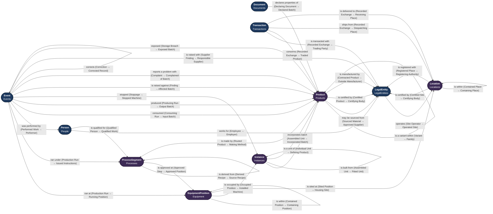
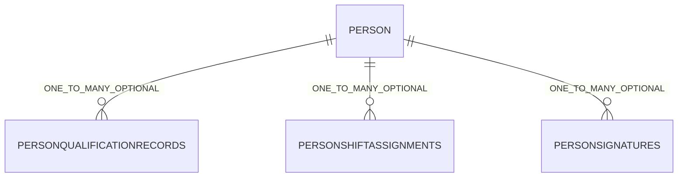
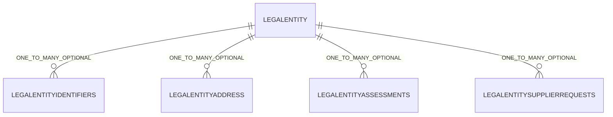
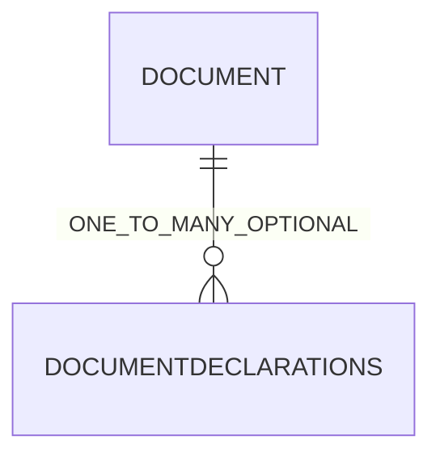
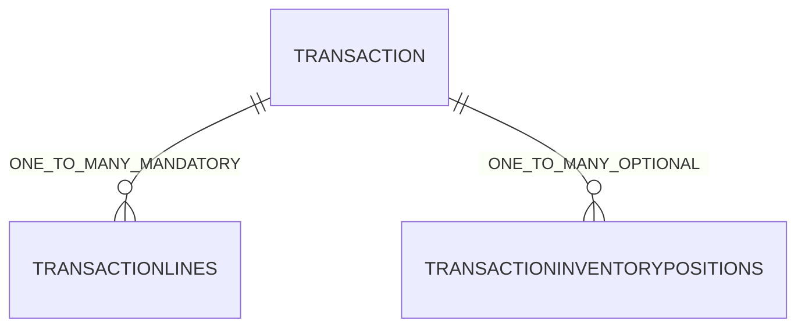
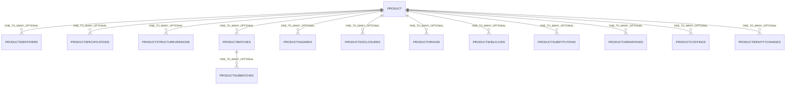
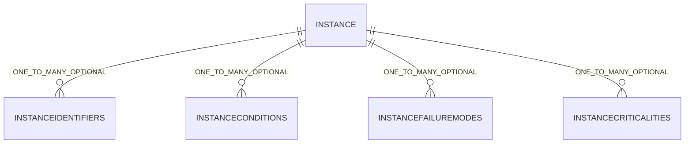
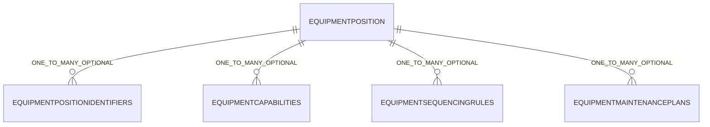
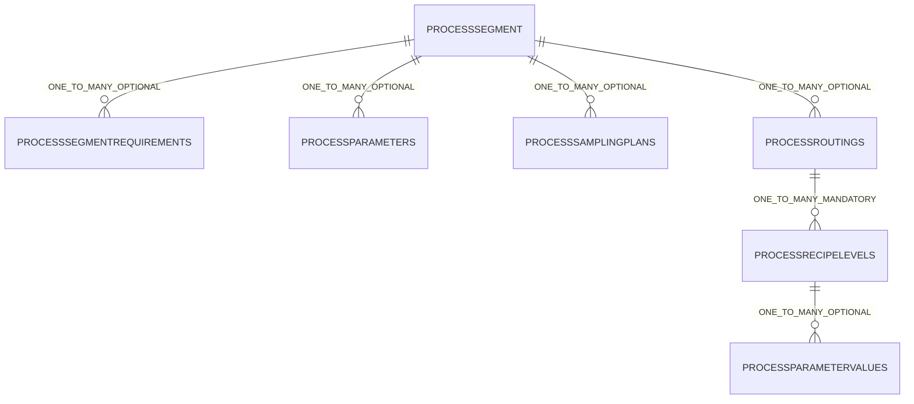
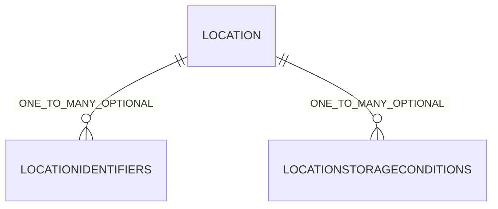

# CPG Manufacturing Operations — Data Design Document

## About This Document

_Supplied text. Held in `boilerplate.json`, which this run does not carry._

## Version

|  |  |
|---|---|
| Domain | CPG Manufacturing Operations |
| Document date | 22 September 2026 |
| Package reference | cpg-bdd |
| Method version | 1.0 |

## Table of Contents

- [1 Introduction](#1-introduction)
  - [1.1 About M&A Operating System](#11-about-ma-operating-system)
  - [1.2 About the MAOS Practical Data Modelling Approach](#12-about-the-maos-practical-data-modelling-approach)
  - [1.3 Summary of Findings](#13-summary-of-findings)
- [2 Scope](#2-scope)
  - [2.1 The business](#21-the-business)
  - [2.2 In scope](#22-in-scope)
  - [2.3 Out of scope](#23-out-of-scope)
  - [2.4 Shared with other models](#24-shared-with-other-models)
  - [2.5 Assumptions](#25-assumptions)
  - [2.6 Open questions](#26-open-questions)
- [3 Business Requirements](#3-business-requirements)
  - [3.1 Business Requirements](#31-business-requirements)
  - [3.2 Example Business Test Cases](#32-example-business-test-cases)
- [4 Data Requirements](#4-data-requirements)
- [5 Data Model](#5-data-model)
  - [5.1 Roles and their Alignment to Subject Domains](#51-roles-and-their-alignment-to-subject-domains)
    - [People — anchor Person · in DDA [DMD000000001](https://datadesign.maoperatingsystem.com/domains/DMD000000001)](#people--anchor-person--in-dda-dmd000000001httpsdatadesignmaoperatingsystemcomdomainsdmd000000001)
    - [LegalEntities — anchor LegalEntity · in DDA [DMD000000012](https://datadesign.maoperatingsystem.com/domains/DMD000000012)](#legalentities--anchor-legalentity--in-dda-dmd000000012httpsdatadesignmaoperatingsystemcomdomainsdmd000000012)
    - [Documents — anchor Document · in DDA [DMD000000016](https://datadesign.maoperatingsystem.com/domains/DMD000000016)](#documents--anchor-document--in-dda-dmd000000016httpsdatadesignmaoperatingsystemcomdomainsdmd000000016)
    - [Events — anchor Event · in DDA [DMD000000020](https://datadesign.maoperatingsystem.com/domains/DMD000000020)](#events--anchor-event--in-dda-dmd000000020httpsdatadesignmaoperatingsystemcomdomainsdmd000000020)
    - [Transactions — anchor Transaction · in DDA [DMD000000022](https://datadesign.maoperatingsystem.com/domains/DMD000000022)](#transactions--anchor-transaction--in-dda-dmd000000022httpsdatadesignmaoperatingsystemcomdomainsdmd000000022)
    - [Products — anchor Product · proposed, see Appendix D](#products--anchor-product--proposed-see-appendix-d)
    - [Instances — anchor Instance · proposed, see Appendix D](#instances--anchor-instance--proposed-see-appendix-d)
    - [Equipment — anchor EquipmentPosition · proposed, see Appendix D](#equipment--anchor-equipmentposition--proposed-see-appendix-d)
    - [Processes — anchor ProcessSegment · proposed, see Appendix D](#processes--anchor-processsegment--proposed-see-appendix-d)
    - [Locations — anchor Location · proposed, see Appendix D](#locations--anchor-location--proposed-see-appendix-d)
  - [5.2 Role–Verb–Role Relationships](#52-roleverbrole-relationships)
  - [5.3 Domain Concepts to Add](#53-domain-concepts-to-add)
    - [People](#people)
    - [LegalEntities](#legalentities)
    - [Documents](#documents)
    - [Events](#events)
    - [Transactions](#transactions)
    - [Products](#products)
    - [Instances](#instances)
    - [Equipment](#equipment)
    - [Processes](#processes)
    - [Locations](#locations)
  - [5.4 Lookups and Values](#54-lookups-and-values)
    - [LKP009 · UniversalUnitOfMeasure · universal](#lkp009--universalunitofmeasure--universal)
    - [LKP005 · EquipmentPositionLevelType · concept](#lkp005--equipmentpositionleveltype--concept)
    - [LKP007 · EventDispositionsDecisionType · concept](#lkp007--eventdispositionsdecisiontype--concept)
    - [LKP006 · EventStoppagesReasonType · concept](#lkp006--eventstoppagesreasontype--concept)
    - [LKP004 · ProcessRecipeLevelsType · concept](#lkp004--processrecipelevelstype--concept)
    - [LKP002 · ProductHazardType · concept](#lkp002--producthazardtype--concept)
    - [LKP003 · ProductIdentifiersType · concept](#lkp003--productidentifierstype--concept)
    - [LKP001 · ProductKindType · concept](#lkp001--productkindtype--concept)
    - [LKP008 · TransactionKindType · concept](#lkp008--transactionkindtype--concept)
  - [5.5 Diagrams](#55-diagrams)
- [6 Source Validation](#6-source-validation)
- [7 Existing Model Findings](#7-existing-model-findings)
- [8 Conformance to DDA Standards](#8-conformance-to-dda-standards)
- [9 Exceptions](#9-exceptions)
- [10 Outstanding Decisions](#10-outstanding-decisions)
- [11 Approval](#11-approval)
- [Appendix A — Sources](#appendix-a--sources)
- [Appendix B — DDA Domain Definitions](#appendix-b--dda-domain-definitions)
- [Appendix C — Standards](#appendix-c--standards)
- [Appendix D — Subject Domain Proposals](#appendix-d--subject-domain-proposals)
  - [Products · PRD](#products--prd)
  - [Instances · UNT](#instances--unt)
  - [Equipment · EQP](#equipment--eqp)
  - [Processes · PRC](#processes--prc)
  - [Locations · LOC](#locations--loc)
  - [Candidates that are not domains](#candidates-that-are-not-domains)

## 1 Introduction

### 1.1 About M&A Operating System

_Supplied text. Held in `boilerplate.json`, which this run does not carry._

### 1.2 About the MAOS Practical Data Modelling Approach

_Supplied text. Held in `boilerplate.json`, which this run does not carry._

### 1.3 Summary of Findings

The model covers the making of consumer packaged goods across five subgroups, in the organisation's own factories and at outside manufacturers. It reuses five DDA domains and proposes five more, and the chain of what goes into what stops at anything bought in, where the supplier's declaration takes over.

|  | Count |
|---|---|
| Business requirements | 69 |
| Data requirements | 36 |
| Subject domains | 5 in DDA · 5 proposed |
| Roles | 70 |
| Relationships | 38 |
| Concepts | 66 |
| Attributes | 120 |
| Lookups | 9 |
| Test cases | 38 pass · 3 with a limit or a gap |
| Sources | 40 |

Status: **published with accepted limits**, as a reference model.

## 2 Scope

### 2.1 The business

A manufacturer of consumer packaged goods. It buys materials, makes and tests product, and releases it for despatch, through its own factories and through outside manufacturers.

Subgroups covered, equally: Food and beverage, Household and cleaning products, Personal care and cosmetics, Pet care, Beauty.

### 2.2 In scope

| ID | In scope |
|---|---|
| SCI001 | Buying materials, and deciding which suppliers may supply them |
| SCI002 | Defining products — what they are made from and what they must be |
| SCI003 | Defining how products are made — the steps, the settings and the recipes |
| SCI004 | The layout of each factory and the machines in it |
| SCI005 | Making product, and what each batch actually used and produced |
| SCI006 | Testing, recording problems, putting them right, and releasing product |
| SCI007 | Tracing any batch back to its ingredients and forward to where it went |
| SCI008 | Stock held at the organisation's own sites |
| SCI009 | Product made or packed by outside manufacturers |

### 2.3 Out of scope

| ID | Out of scope | Belongs to |
|---|---|---|
| SCO001 | Trade spending, promotions and pricing with retailers | The commercial model |
| SCO002 | What happens on the shelf in store | The commercial model |
| SCO003 | Market share and sales data bought from research firms | The commercial model |
| SCO004 | Marketing, campaigns and advertising | The digital marketing model |
| SCO005 | Accounts, ledgers and statutory reporting | The finance model |
| SCO006 | Research and development before a product is formally defined | Not modelled |

### 2.4 Shared with other models

| ID | Object | In DDA |
|---|---|---|
| SCS001 | People | [DMD000000001](https://datadesign.maoperatingsystem.com/domains/DMD000000001) |
| SCS002 | Legal entities | [DMD000000012](https://datadesign.maoperatingsystem.com/domains/DMD000000012) |
| SCS003 | Documents | [DMD000000016](https://datadesign.maoperatingsystem.com/domains/DMD000000016) |
| SCS004 | Events | [DMD000000020](https://datadesign.maoperatingsystem.com/domains/DMD000000020) |
| SCS005 | Transactions | [DMD000000022](https://datadesign.maoperatingsystem.com/domains/DMD000000022) |

### 2.5 Assumptions

| ID | Assumption |
|---|---|
| SCA001 | The factory, laboratory, quality and maintenance systems already in place stay in place. This model holds what they record; it does not replace them. |
| SCA002 | Material held by a supplier or outside manufacturer is theirs. It becomes the organisation's on receipt, and the organisation holds no stock at any party it does not operate. |
| SCA003 | Something bought as an ingredient or part may be another company's finished product. What it is made from is theirs and may not be known here. |
| SCA004 | This is research-only work. No business owner has reviewed the requirements. |

### 2.6 Open questions

| ID | Question |
|---|---|
| SCQ001 | Is finished output identified individually, or only by batch? The model supports both; how much of Instances is used depends on the answer. |
| SCQ002 | What proportion of output is made by outside manufacturers? Where it is most of it, the organisation holds little production record of its own. |
| SCQ003 | State transitions could not be read from the platform, so the change package carries no preconditions. |

## 3 Business Requirements

### 3.1 Business Requirements

| ID | Category | Business requirement | Owner | Subgroup | Satisfied by | Certified | Sources |
|---|---|---|---|---|---|---|---|
| REQ070 | Cost | What a product costs to make is built up from what went into it and what was done to it, and expected and actual cost differ. | Finance lead |  | Model | No | [SRC014](https://www.fabrico.io/de/blog/non-conformance-report/) · [SRC018](https://oxmaint.com/industries/food-manufacturing/food-plant-production-uptime-cmms-guide-2026) |
| REQ033 | Equipment | A plant is organised into areas, lines and units, and work happens at each level. | Plant manager |  | Model | No | [SRC001](https://reference.opcfoundation.org/specs/OPC-10030/7) · [SRC004](https://www.fabrico.io/blog/isa-88/) |
| REQ034 | Equipment | A place on a line and the machine standing in it are different things, and machines are replaced. | Maintenance lead |  | Model | No | [SRC001](https://reference.opcfoundation.org/specs/OPC-10030/7) · [SRC004](https://www.fabrico.io/blog/isa-88/) |
| REQ035 | Equipment | A machine has a repair history, a record of how it fails and a working life that follow it wherever it goes. | Maintenance lead |  | Model | No | [SRC018](https://oxmaint.com/industries/food-manufacturing/food-plant-production-uptime-cmms-guide-2026) · [SRC016](https://oxmaint.com/industries/manufacturing-plant/manufacturing-execution-system-maintenance-integration-mes) |
| REQ036 | Equipment | Some equipment matters more than others — because it stops the line, costs more to repair, or its failure is a safety issue. | Maintenance lead |  | Model | No | [SRC018](https://oxmaint.com/industries/food-manufacturing/food-plant-production-uptime-cmms-guide-2026) |
| REQ037 | Equipment | A stoppage is recorded by production as lost output and by maintenance as work, and both must agree it was one stoppage. | Plant manager |  | Model | No | [SRC016](https://oxmaint.com/industries/manufacturing-plant/manufacturing-execution-system-maintenance-integration-mes) |
| REQ038 | Equipment | Why a line stopped matters as much as that it stopped, and the reasons must be recorded consistently. | Plant manager |  | Model | No | [SRC017](https://oxmaint.com/industries/steel-plant/oee-data-accuracy-best-practices) · [SRC018](https://oxmaint.com/industries/food-manufacturing/food-plant-production-uptime-cmms-guide-2026) |
| REQ039 | Equipment | Maintenance is planned, prompted by a condition, or done after a failure, and these are different kinds of work. | Maintenance lead |  | Model | No | [SRC016](https://oxmaint.com/industries/manufacturing-plant/manufacturing-execution-system-maintenance-integration-mes) · [SRC018](https://oxmaint.com/industries/food-manufacturing/food-plant-production-uptime-cmms-guide-2026) |
| REQ068 | Identity | Two records may turn out to describe the same material, supplier or place. | Data steward |  | Platform | No | [SRC005](https://sgsystemsglobal.com/?p=15659) |
| REQ069 | Identity | An identifier issued by an outside authority is the strongest evidence of what something is. | Data steward |  | Model | No | [SRC030](https://www.gs1uk.org/sites/default/files/The_GTIN_management_handbook.pdf) · [SRC011](https://support.famoussoftware.com/article/fsma-204-general-summary) |
| REQ001 | Material | Everything the organisation buys, makes or sells is something it holds, counts and can run out of — ingredients, packaging, part-made goods and finished goods. | Supply chain lead |  | Model | No | [SRC005](https://sgsystemsglobal.com/?p=15659) · [SRC039](https://www.cleverence.com/amp/articles/business-blogs/guide-batch-tracking-5829/) |
| REQ002 | Material | A product is made from a defined set of inputs in defined quantities, and that definition changes over time. | Technical lead |  | Model | No | [SRC002](https://en.wikipedia.org/wiki/ISA-88) · [SRC005](https://sgsystemsglobal.com/?p=15659) · [SRC008](https://www.ibm.com/topics/mes-system) |
| REQ003 | Material | An input may itself be made from other inputs, to any depth, before anything is finished. | Technical lead |  | Model | No | [SRC005](https://sgsystemsglobal.com/?p=15659) · [SRC006](https://gevernova.com/software/blog/mes-traceability-genealogy) |
| REQ004 | Material | Using an input means using all of it as it is defined. What goes into an input cannot be adjusted by whoever uses it; needing it different means needing a different input. | Technical lead |  | Model | No | [SRC005](https://sgsystemsglobal.com/?p=15659) · [SRC030](https://www.gs1uk.org/sites/default/files/The_GTIN_management_handbook.pdf) |
| REQ005 | Material | The same input goes into many different products, and a product may be sold as it is and also used inside another. | Technical lead |  | Model | No | [SRC005](https://sgsystemsglobal.com/?p=15659) · [SRC006](https://gevernova.com/software/blog/mes-traceability-genealogy) |
| REQ006 | Material | What a recipe says should go in and what a batch actually used differ, and the difference matters. | Plant manager |  | Model | No | [SRC005](https://sgsystemsglobal.com/?p=15659) · [SRC033](https://casrai.org/dictionary/term/electronic-batch-record-ebr) |
| REQ007 | Material | An approved alternative may be used in place of a specified input, and which one was used on a batch must be known. | Technical lead |  | Model | No | [SRC005](https://sgsystemsglobal.com/?p=15659) · [SRC033](https://casrai.org/dictionary/term/electronic-batch-record-ebr) |
| REQ008 | Material | A material may be bought from several approved suppliers, and approval may lapse or be suspended. | Procurement lead |  | Model | No | [SRC020](https://www.registrarcorp.com/iso-22716-raw-materials/) · [SRC029](https://ukpetfood.org/asset/14810E67%2DFA8C%2D48E8%2D924792E5213FFF43) |
| REQ009 | Material | A material arrives with the supplier's statement of what it is, and the organisation may or may not check it. | Quality manager |  | Model | No | [SRC020](https://www.registrarcorp.com/iso-22716-raw-materials/) · [SRC039](https://www.cleverence.com/amp/articles/business-blogs/guide-batch-tracking-5829/) |
| REQ010 | Material | Something bought as an ingredient or part may be another company's finished product, and what it is made from may not be known. | Technical lead |  | Model | No | [SRC023](https://prod.ryder.com/en-us/insights/blogs/logistics/turnkey-vs-tolling) · [SRC024](https://prod.ryder.com/en-us/logistics/co-packaging/contract-manufacturing) |
| REQ011 | Material | Properties of an input carry through to what is made from it — allergens and other hazards, certifications, origin, and the date by which it must be used. | Quality manager |  | Model | No | [SRC030](https://www.gs1uk.org/sites/default/files/The_GTIN_management_handbook.pdf) · [SRC035](https://www.hoganlovells.com/en/publications/fda-releases-draft-compliance-policy-guide-for-major-food-allergen-labeling-and-cross-contact) · [SRC007](https://www.cleverence.com/amp/articles/business-blogs/how-to-batch-tracking-for-manufacturing-7284/) |
| REQ012 | Material | Food allergens must be declared on a product by the food they come from, including those that arrive inside another ingredient. | Quality manager | Food and beverage | Model | No | [SRC034](https://www.fda.gov/regulatory-information/search-fda-guidance-documents/cpg-sec-555250-statement-policy-labeling-and-preventing-cross-contact-common-food-allergens) · [SRC035](https://www.hoganlovells.com/en/publications/fda-releases-draft-compliance-policy-guide-for-major-food-allergen-labeling-and-cross-contact) · [SRC008](https://www.ibm.com/topics/mes-system) |
| REQ013 | Material | Household cleaning products must disclose each ingredient and how much of it there is, and some may be withheld as confidential. | Regulatory lead | Household and cleaning products | Model | No | [SRC025](https://www.dwt.com/blogs/energy--environmental-law-blog/2019/11/california-cleaning-products-right-to-know-act) · [SRC026](https://extapps.dec.ny.gov/docs/materials_minerals_pdf/cpidbmps.pdf) |
| REQ014 | Material | The hazard rules a product must follow depend on what kind of product it is; food allergen rules do not apply to pet food, cosmetics or household cleaners. | Regulatory lead |  | Model | No | [SRC036](https://www.thefdalawblog.com/2022/12/fda-issues-two-guidance-documents-on-food-allergen-labeling-requirements/) · [SRC019](https://www.registrarcorp.com/blog/cosmetics/iso-22716/iso22716-batch-traceability/) · [SRC025](https://www.dwt.com/blogs/energy--environmental-law-blog/2019/11/california-cleaning-products-right-to-know-act) · [SRC028](https://www.foodengineeringmag.com/articles/99611-managing-pet-food-ingredients) |
| REQ015 | Material | The shortest-lived input limits how long the finished product lasts. | Quality manager |  | Model | No | [SRC007](https://www.cleverence.com/amp/articles/business-blogs/how-to-batch-tracking-for-manufacturing-7284/) · [SRC039](https://www.cleverence.com/amp/articles/business-blogs/guide-batch-tracking-5829/) |
| REQ016 | Material | A batch may be split or combined for handling, and every part stays traceable to where it came from. | Supply chain lead |  | Model | No | [SRC005](https://sgsystemsglobal.com/?p=15659) · [SRC007](https://www.cleverence.com/amp/articles/business-blogs/how-to-batch-tracking-for-manufacturing-7284/) |
| REQ017 | Material | Ingredients, part-made goods and finished goods are each held at places, and each is counted separately. | Supply chain lead |  | Model | No | [SRC039](https://www.cleverence.com/amp/articles/business-blogs/guide-batch-tracking-5829/) · [SRC005](https://sgsystemsglobal.com/?p=15659) |
| REQ018 | Material | Stock at one place may be available, on hold or rejected, and these are separate quantities rather than one quantity with a label. | Quality manager |  | Model | No | [SRC040](https://sgsystemsglobal.com/traceability/) · [SRC014](https://www.fabrico.io/de/blog/non-conformance-report/) |
| REQ060 | Outside manufacture | Product may be made or packed by an outside manufacturer, who buys the materials and delivers finished product to the organisation's specification. | Procurement lead |  | Model | No | [SRC023](https://prod.ryder.com/en-us/insights/blogs/logistics/turnkey-vs-tolling) · [SRC024](https://prod.ryder.com/en-us/logistics/co-packaging/contract-manufacturing) |
| REQ061 | Outside manufacture | What the organisation buys becomes its own when it arrives; what a supplier or outside manufacturer holds before then is theirs. | Finance lead |  | Model | No | [SRC023](https://prod.ryder.com/en-us/insights/blogs/logistics/turnkey-vs-tolling) · [SRC024](https://prod.ryder.com/en-us/logistics/co-packaging/contract-manufacturing) |
| REQ062 | Outside manufacture | Outside manufacturers are held to the same good practice as the organisation's own plants, and their records must be available when needed. | Quality manager |  | Model | No | [SRC022](https://sgsystemsglobal.com/?p=16831) |
| REQ063 | Outside manufacture | How far back a product can be traced depends on the supplier's own records once it is outside the organisation's sight. | Quality manager |  | Model | No | [SRC009](https://www.fda.gov/food/food-safety-modernization-act-fsma/fsma-proposed-rule-food-traceability) · [SRC011](https://support.famoussoftware.com/article/fsma-204-general-summary) |
| REQ064 | People | People are qualified to do particular work, and qualifications expire. | Plant manager |  | Model | No | [SRC001](https://reference.opcfoundation.org/specs/OPC-10030/7) · [SRC022](https://sgsystemsglobal.com/?p=16831) |
| REQ065 | Place | A site, a warehouse and a storage place are all places, and they sit inside one another. | Supply chain lead |  | Model | No | [SRC001](https://reference.opcfoundation.org/specs/OPC-10030/7) · [SRC039](https://www.cleverence.com/amp/articles/business-blogs/guide-batch-tracking-5829/) |
| REQ066 | Place | Where something is stored affects how long it lasts and whether it stays fit to use. | Quality manager |  | Model | No | [SRC020](https://www.registrarcorp.com/iso-22716-raw-materials/) |
| REQ067 | Place | A place may be identified differently by the organisation, a supplier and a regulator. | Data steward |  | Model | No | [SRC011](https://support.famoussoftware.com/article/fsma-204-general-summary) |
| REQ025 | Process | Making a product is a sequence of steps, and the order matters as much as the ingredients. | Technical lead |  | Model | No | [SRC002](https://en.wikipedia.org/wiki/ISA-88) · [SRC003](https://sgsystemsglobal.com/?p=16813) |
| REQ026 | Process | A step needs particular equipment, particular people and particular materials. | Plant manager |  | Model | No | [SRC002](https://en.wikipedia.org/wiki/ISA-88) · [SRC001](https://reference.opcfoundation.org/specs/OPC-10030/7) |
| REQ027 | Process | The same step is used in making many different products. | Technical lead |  | Model | No | [SRC003](https://sgsystemsglobal.com/?p=16813) · [SRC004](https://www.fabrico.io/blog/isa-88/) |
| REQ028 | Process | A step has settings — a temperature, a time, a speed — and the values differ by product and by line. | Technical lead |  | Model | No | [SRC003](https://sgsystemsglobal.com/?p=16813) · [SRC004](https://www.fabrico.io/blog/isa-88/) |
| REQ029 | Process | A formulation is written once and made at several sites on several lines, and what is carried out differs at each. | Technical lead |  | Model | No | [SRC002](https://en.wikipedia.org/wiki/ISA-88) · [SRC003](https://sgsystemsglobal.com/?p=16813) |
| REQ030 | Process | The instructions issued for one batch are a specific thing, separate from the formulation they came from. | Plant manager |  | Model | No | [SRC003](https://sgsystemsglobal.com/?p=16813) · [SRC033](https://casrai.org/dictionary/term/electronic-batch-record-ebr) |
| REQ031 | Process | The order in which products run on a line matters, because what ran before can contaminate what runs next. | Quality manager | Food and beverage | Model | No | [SRC034](https://www.fda.gov/regulatory-information/search-fda-guidance-documents/cpg-sec-555250-statement-policy-labeling-and-preventing-cross-contact-common-food-allergens) |
| REQ032 | Process | Changing a line from one product to another takes time and may need cleaning, and both are part of the cost of making. | Plant manager |  | Model | No | [SRC034](https://www.fda.gov/regulatory-information/search-fda-guidance-documents/cpg-sec-555250-statement-policy-labeling-and-preventing-cross-contact-common-food-allergens) · [SRC017](https://oxmaint.com/industries/steel-plant/oee-data-accuracy-best-practices) |
| REQ019 | Product identity | The same thing is sold in several sizes and pack formats, related to each other but made and counted separately. | Commercial lead |  | Model | No | [SRC030](https://www.gs1uk.org/sites/default/files/The_GTIN_management_handbook.pdf) · [SRC031](https://www.gs1nz.org/assets/Resources/Services/GS1NZ_Fact-sheet-gtin-allocation-rules.-V2.pdf) |
| REQ020 | Product identity | Some changes make a product a different thing — a change to its declared ingredients, net content, certification or pack count — and others do not. | Regulatory lead |  | Model | No | [SRC030](https://www.gs1uk.org/sites/default/files/The_GTIN_management_handbook.pdf) · [SRC031](https://www.gs1nz.org/assets/Resources/Services/GS1NZ_Fact-sheet-gtin-allocation-rules.-V2.pdf) |
| REQ021 | Product identity | What a product is made from changes over time while it remains the same product. | Technical lead |  | Model | No | [SRC030](https://www.gs1uk.org/sites/default/files/The_GTIN_management_handbook.pdf) · [SRC002](https://en.wikipedia.org/wiki/ISA-88) |
| REQ022 | Product identity | What was actually made is a fact about the batch; what should have been made is a fact about the definition. | Quality manager |  | Model | No | [SRC005](https://sgsystemsglobal.com/?p=15659) · [SRC033](https://casrai.org/dictionary/term/electronic-batch-record-ebr) |
| REQ023 | Product identity | Some things are identified individually and some only by the batch they came from, and one product may contain both. | Quality manager |  | Model | No | [SRC007](https://www.cleverence.com/amp/articles/business-blogs/how-to-batch-tracking-for-manufacturing-7284/) · [SRC037](https://www.linxglobal.com/en/solutions/coding-types/gs1/) |
| REQ024 | Product identity | A pack may carry its own serial number as well as its batch, and retailers increasingly expect to read it, though no law requires it. | Commercial lead |  | Model | No | [SRC037](https://www.linxglobal.com/en/solutions/coding-types/gs1/) · [SRC038](https://www.qrstuff.com/feeds/blog/gs1-sunrise-2027) |
| REQ040 | Production | Making something is instructed, carried out and recorded, and the three may differ. | Plant manager |  | Model | No | [SRC033](https://casrai.org/dictionary/term/electronic-batch-record-ebr) · [SRC005](https://sgsystemsglobal.com/?p=15659) · [SRC021](https://fda.gov/media/86366/download) · [SRC027](https://www.canr.msu.edu/news/fsma-legal-ramifications-of-cgmps-are-important-to-pet-food-safety) |
| REQ041 | Production | Who carried out each step of a batch, and whether they were qualified to, must be recoverable. | Plant manager |  | Model | No | [SRC006](https://gevernova.com/software/blog/mes-traceability-genealogy) · [SRC001](https://reference.opcfoundation.org/specs/OPC-10030/7) · [SRC033](https://casrai.org/dictionary/term/electronic-batch-record-ebr) |
| REQ042 | Production | Goods move between plants, warehouses and storage places, and each movement has a time and a place. | Supply chain lead |  | Model | No | [SRC009](https://www.fda.gov/food/food-safety-modernization-act-fsma/fsma-proposed-rule-food-traceability) · [SRC040](https://sgsystemsglobal.com/traceability/) |
| REQ044 | Quality | A material or product must meet a stated specification, and what it must be changes over time. | Quality manager |  | Model | No | [SRC020](https://www.registrarcorp.com/iso-22716-raw-materials/) · [SRC012](https://simplerqms.com/non-conformance/) |
| REQ045 | Quality | Meeting a specification is shown by testing, and a test has a method as well as a result. | Quality manager |  | Model | No | [SRC020](https://www.registrarcorp.com/iso-22716-raw-materials/) · [SRC022](https://sgsystemsglobal.com/?p=16831) |
| REQ046 | Quality | A departure from a procedure and a failure against a specification are different things, and both must be recorded. | Quality manager |  | Model | No | [SRC012](https://simplerqms.com/non-conformance/) · [SRC013](https://gmpinsiders.com/deviation-management-process/) |
| REQ047 | Quality | Material that fails must be held back, a decision made about it, and that decision made by someone with the authority to make it. | Quality manager |  | Model | No | [SRC014](https://www.fabrico.io/de/blog/non-conformance-report/) · [SRC013](https://gmpinsiders.com/deviation-management-process/) |
| REQ048 | Quality | Every departure from procedure must be investigated, with conclusions and follow-up recorded. | Quality manager |  | Model | No | [SRC015](https://www.pharmaceutical-technology.com/?p=1983) · [SRC013](https://gmpinsiders.com/deviation-management-process/) |
| REQ049 | Quality | A significant or recurring problem needs its cause found, action taken, and the action shown to have worked before it is closed. | Quality manager |  | Model | No | [SRC014](https://www.fabrico.io/de/blog/non-conformance-report/) · [SRC013](https://gmpinsiders.com/deviation-management-process/) |
| REQ050 | Quality | Output is not available to sell until someone releases it, and release is a decision someone makes. | Quality manager |  | Model | No | [SRC005](https://sgsystemsglobal.com/?p=15659) · [SRC003](https://sgsystemsglobal.com/?p=16813) |
| REQ051 | Quality | When a batch is implicated in a food safety issue, the records of what went into it and where it went must be produced within twenty-four hours. | Quality manager | Food and beverage | Model | No | [SRC009](https://www.fda.gov/food/food-safety-modernization-act-fsma/fsma-proposed-rule-food-traceability) · [SRC010](https://foodbusiness.ces.ncsu.edu/news/fda-fsma-204-food-traceability-rule/) |
| REQ052 | Quality | Traceability records must be kept for two years. | Quality manager | Food and beverage | Model | No | [SRC011](https://support.famoussoftware.com/article/fsma-204-general-summary) |
| REQ053 | Quality | A lot code is assigned when a product is first packed or transformed, and must be carried at every later movement. | Quality manager | Food and beverage | Model | No | [SRC011](https://support.famoussoftware.com/article/fsma-204-general-summary) · [SRC009](https://www.fda.gov/food/food-safety-modernization-act-fsma/fsma-proposed-rule-food-traceability) |
| REQ054 | Quality | A complaint may concern a specific batch, and that link is what connects experience of the product to how it was made. | Quality manager |  | Model | No | [SRC022](https://sgsystemsglobal.com/?p=16831) · [SRC005](https://sgsystemsglobal.com/?p=15659) |
| REQ055 | Quality | Some records must be signed, and a signature must show who signed, what, when and what the signature meant. | Compliance officer |  | Model | No | [SRC032](https://sgsystemsglobal.com/glossary/21-cfr-part-11-electronic-records-signatures/) · [SRC033](https://casrai.org/dictionary/term/electronic-batch-record-ebr) |
| REQ056 | Quality | Once recorded, an entry stays visible and unaltered; a correction is a new entry, not an edit. | Compliance officer |  | Model | No | [SRC032](https://sgsystemsglobal.com/glossary/21-cfr-part-11-electronic-records-signatures/) |
| REQ057 | Quality | Some steps must be checked by a second qualified person or by approved equipment. | Quality manager |  | Model | No | [SRC033](https://casrai.org/dictionary/term/electronic-batch-record-ebr) |
| REQ058 | Supplier | A supplier is assessed before being used and reassessed afterwards. | Procurement lead |  | Model | No | [SRC020](https://www.registrarcorp.com/iso-22716-raw-materials/) · [SRC029](https://ukpetfood.org/asset/14810E67%2DFA8C%2D48E8%2D924792E5213FFF43) |
| REQ059 | Supplier | A problem with a supplier is raised with them formally and their response followed up. | Procurement lead |  | Model | No | [SRC014](https://www.fabrico.io/de/blog/non-conformance-report/) · [SRC020](https://www.registrarcorp.com/iso-22716-raw-materials/) |

### 3.2 Example Business Test Cases

**[REQ070](#req070) — What a product costs to make is built up from what went into it and what was done to it, and expected and actual cost differ.**

| Case | Question | Kind | As at | Walked through | Result | Note |
|---|---|---|---|---|---|---|
| SCN036 | What did this batch cost against its standard, and why? | designed | as-at | ATR044 → SBJ024 → ATR045 | Pass | — |
| SCN039 | What did poor quality cost across the plant last year? | awkward | as-at | ATR044 → SBJ024 → ATR045 | **Gap** | Scrap, rework, stoppages and complaints are each held, but nothing brings them together as one measure, and adding them up is a different question. |

**[REQ033](#req033) — A plant is organised into areas, lines and units, and work happens at each level.**

| Case | Question | Kind | As at | Walked through | Result | Note |
|---|---|---|---|---|---|---|
| SCN020 | Which machine was in this place on the day this batch was made? | designed | as-at | REL011 → SBJ026 → SBJ031 → REL010 → REL012 → ATR009 | Pass | — |

**[REQ034](#req034) — A place on a line and the machine standing in it are different things, and machines are replaced.**

| Case | Question | Kind | As at | Walked through | Result | Note |
|---|---|---|---|---|---|---|
| SCN020 | Which machine was in this place on the day this batch was made? | designed | as-at | REL011 → SBJ026 → SBJ031 → REL010 → REL012 → ATR009 | Pass | — |

**[REQ035](#req035) — A machine has a repair history, a record of how it fails and a working life that follow it wherever it goes.**

| Case | Question | Kind | As at | Walked through | Result | Note |
|---|---|---|---|---|---|---|
| SCN021 | Which machines cause the most unplanned stoppage, and how do they fail? | designed | as-at | ATR013 → SBJ028 → SBJ029 → REL031 → ATR050 → ATR051 | Pass | — |

**[REQ036](#req036) — Some equipment matters more than others — because it stops the line, costs more to repair, or its failure is a safety issue.**

| Case | Question | Kind | As at | Walked through | Result | Note |
|---|---|---|---|---|---|---|
| SCN021 | Which machines cause the most unplanned stoppage, and how do they fail? | designed | as-at | ATR013 → SBJ028 → SBJ029 → REL031 → ATR050 → ATR051 | Pass | — |

**[REQ037](#req037) — A stoppage is recorded by production as lost output and by maintenance as work, and both must agree it was one stoppage.**

| Case | Question | Kind | As at | Walked through | Result | Note |
|---|---|---|---|---|---|---|
| SCN022 | How long did this line stop, why, and what did maintenance do about it? | designed | as-at | ATR013 → SBJ055 → SBJ056 → REL031 → ATR099 → ATR100 | Pass | — |

**[REQ038](#req038) — Why a line stopped matters as much as that it stopped, and the reasons must be recorded consistently.**

| Case | Question | Kind | As at | Walked through | Result | Note |
|---|---|---|---|---|---|---|
| SCN022 | How long did this line stop, why, and what did maintenance do about it? | designed | as-at | ATR013 → SBJ055 → SBJ056 → REL031 → ATR099 → ATR100 | Pass | — |

**[REQ039](#req039) — Maintenance is planned, prompted by a condition, or done after a failure, and these are different kinds of work.**

| Case | Question | Kind | As at | Walked through | Result | Note |
|---|---|---|---|---|---|---|
| SCN021 | Which machines cause the most unplanned stoppage, and how do they fail? | designed | as-at | ATR013 → SBJ028 → SBJ029 → REL031 → ATR050 → ATR051 | Pass | — |

**[REQ069](#req069) — An identifier issued by an outside authority is the strongest evidence of what something is.**

| Case | Question | Kind | As at | Walked through | Result | Note |
|---|---|---|---|---|---|---|
| SCN035 | Which place or product is this, whatever identifier the supplier or regulator used? | designed | current | SBJ006 → SBJ013 → REL018 → ATR019 → ATR020 | Pass | — |

**[REQ001](#req001) — Everything the organisation buys, makes or sells is something it holds, counts and can run out of — ingredients, packaging, part-made goods and finished goods.**

| Case | Question | Kind | As at | Walked through | Result | Note |
|---|---|---|---|---|---|---|
| SCN013 | How much of this material is available, on hold, or rejected at each site right now? | designed | as-at | ATR089 → SBJ012 → SBJ048 → ATR017 → ATR090 | Pass | — |

**[REQ002](#req002) — A product is made from a defined set of inputs in defined quantities, and that definition changes over time.**

| Case | Question | Kind | As at | Walked through | Result | Note |
|---|---|---|---|---|---|---|
| SCN001 | What goes into this product, and how much of each input ends up in one finished unit? | designed | as-at | REL001 → SBJ012 → SBJ015 → ATR001 → ATR002 | Pass | — |

**[REQ003](#req003) — An input may itself be made from other inputs, to any depth, before anything is finished.**

| Case | Question | Kind | As at | Walked through | Result | Note |
|---|---|---|---|---|---|---|
| SCN001 | What goes into this product, and how much of each input ends up in one finished unit? | designed | as-at | REL001 → SBJ012 → SBJ015 → ATR001 → ATR002 | Pass | — |
| SCN002 | Which finished products contain this ingredient, by any route? | designed | current | REL001 | Pass | — |

**[REQ004](#req004) — Using an input means using all of it as it is defined. What goes into an input cannot be adjusted by whoever uses it; needing it different means needing a different input.**

| Case | Question | Kind | As at | Walked through | Result | Note |
|---|---|---|---|---|---|---|
| SCN003 | Which products use this intermediate, and are any using a variant of it that should be its own product? | designed | current | REL001 | Pass | — |

**[REQ005](#req005) — The same input goes into many different products, and a product may be sold as it is and also used inside another.**

| Case | Question | Kind | As at | Walked through | Result | Note |
|---|---|---|---|---|---|---|
| SCN001 | What goes into this product, and how much of each input ends up in one finished unit? | designed | as-at | REL001 → SBJ012 → SBJ015 → ATR001 → ATR002 | Pass | — |
| SCN002 | Which finished products contain this ingredient, by any route? | designed | current | REL001 | Pass | — |

**[REQ006](#req006) — What a recipe says should go in and what a batch actually used differ, and the difference matters.**

| Case | Question | Kind | As at | Walked through | Result | Note |
|---|---|---|---|---|---|---|
| SCN004 | How much more or less of each input did this batch use than the recipe specified? | designed | as-at | ATR001 → SBJ051 → SBJ052 → REL029 → ATR011 → ATR012 | Pass | — |

**[REQ007](#req007) — An approved alternative may be used in place of a specified input, and which one was used on a batch must be known.**

| Case | Question | Kind | As at | Walked through | Result | Note |
|---|---|---|---|---|---|---|
| SCN005 | Which batches used an alternative input, and for which ingredient? | designed | as-at | ATR003 → SBJ022 → SBJ052 → ATR005 → ATR042 | Pass | — |

**[REQ008](#req008) — A material may be bought from several approved suppliers, and approval may lapse or be suspended.**

| Case | Question | Kind | As at | Walked through | Result | Note |
|---|---|---|---|---|---|---|
| SCN006 | Was this supplier approved for this material on the day it was received? | designed | as-at | REL003 → SBJ005 → SBJ007 → REL017 → ATR007 → ATR080 | Pass | — |

**[REQ009](#req009) — A material arrives with the supplier's statement of what it is, and the organisation may or may not check it.**

| Case | Question | Kind | As at | Walked through | Result | Note |
|---|---|---|---|---|---|---|
| SCN007 | Which of this batch's stated properties were tested here, and which were taken on the supplier's word? | designed | current | SBJ010 → SBJ011 → REL037 → ATR014 → ATR083 | Pass | — |

**[REQ010](#req010) — Something bought as an ingredient or part may be another company's finished product, and what it is made from may not be known.**

| Case | Question | Kind | As at | Walked through | Result | Note |
|---|---|---|---|---|---|---|
| SCN008 | Which products depend on a bought-in ingredient whose contents we rely on the supplier to declare? | designed | current | SBJ011 → ATR018 → ATR036 | Pass | — |
| SCN037 | What is inside the chocolate coating we buy in finished? | awkward | as-at | ATR036 → SBJ011 → ATR018 | **Accepted limit** | The chain of what goes into what stops at anything bought in. Only what the supplier has declared is known here, and that is recorded with who declared it and whether it was checked. |
| SCN038 | A supplier recalls a sugar batch used inside a coating they sold us. Which of our batches are affected? | awkward | as-at | ATR012 → SBJ016 → SBJ063 → REL029 → REL030 → ATR029 | **Accepted limit** | Our record reaches the coating batch we received. Whether that batch contains the recalled sugar is in the supplier's records, so the twenty-four-hour answer depends on them. |

**[REQ011](#req011) — Properties of an input carry through to what is made from it — allergens and other hazards, certifications, origin, and the date by which it must be used.**

| Case | Question | Kind | As at | Walked through | Result | Note |
|---|---|---|---|---|---|---|
| SCN009 | What allergens, hazards and certifications does this product carry, and from which inputs? | designed | as-at | REL004 → SBJ018 → SBJ020 → ATR034 → ATR035 | Pass | — |

**[REQ012](#req012) — Food allergens must be declared on a product by the food they come from, including those that arrive inside another ingredient.**

| Case | Question | Kind | As at | Walked through | Result | Note |
|---|---|---|---|---|---|---|
| SCN009 | What allergens, hazards and certifications does this product carry, and from which inputs? | designed | as-at | REL004 → SBJ018 → SBJ020 → ATR034 → ATR035 | Pass | — |

**[REQ013](#req013) — Household cleaning products must disclose each ingredient and how much of it there is, and some may be withheld as confidential.**

| Case | Question | Kind | As at | Walked through | Result | Note |
|---|---|---|---|---|---|---|
| SCN010 | What must be disclosed for this household product, and what is withheld? | designed | current | SBJ019 → ATR037 → ATR038 | Pass | — |

**[REQ014](#req014) — The hazard rules a product must follow depend on what kind of product it is; food allergen rules do not apply to pet food, cosmetics or household cleaners.**

| Case | Question | Kind | As at | Walked through | Result | Note |
|---|---|---|---|---|---|---|
| SCN009 | What allergens, hazards and certifications does this product carry, and from which inputs? | designed | as-at | REL004 → SBJ018 → SBJ020 → ATR034 → ATR035 | Pass | — |

**[REQ015](#req015) — The shortest-lived input limits how long the finished product lasts.**

| Case | Question | Kind | As at | Walked through | Result | Note |
|---|---|---|---|---|---|---|
| SCN011 | What is the latest date this finished batch can be used, given what went into it? | designed | current | SBJ021 → ATR031 → ATR041 | Pass | — |

**[REQ016](#req016) — A batch may be split or combined for handling, and every part stays traceable to where it came from.**

| Case | Question | Kind | As at | Walked through | Result | Note |
|---|---|---|---|---|---|---|
| SCN012 | Which batches came from this one, and which batches made up this combined one? | designed | current | SBJ016 → SBJ017 → ATR030 → ATR032 | Pass | — |

**[REQ017](#req017) — Ingredients, part-made goods and finished goods are each held at places, and each is counted separately.**

| Case | Question | Kind | As at | Walked through | Result | Note |
|---|---|---|---|---|---|---|
| SCN013 | How much of this material is available, on hold, or rejected at each site right now? | designed | as-at | ATR089 → SBJ012 → SBJ048 → ATR017 → ATR090 | Pass | — |

**[REQ018](#req018) — Stock at one place may be available, on hold or rejected, and these are separate quantities rather than one quantity with a label.**

| Case | Question | Kind | As at | Walked through | Result | Note |
|---|---|---|---|---|---|---|
| SCN013 | How much of this material is available, on hold, or rejected at each site right now? | designed | as-at | ATR089 → SBJ012 → SBJ048 → ATR017 → ATR090 | Pass | — |

**[REQ060](#req060) — Product may be made or packed by an outside manufacturer, who buys the materials and delivers finished product to the organisation's specification.**

| Case | Question | Kind | As at | Walked through | Result | Note |
|---|---|---|---|---|---|---|
| SCN033 | Which of our finished batches were made by an outside manufacturer, to which specification, and when did they become ours? | designed | as-at | REL005 → SBJ005 → SBJ046 → REL019 → REL022 → ATR008 | Pass | — |

**[REQ061](#req061) — What the organisation buys becomes its own when it arrives; what a supplier or outside manufacturer holds before then is theirs.**

| Case | Question | Kind | As at | Walked through | Result | Note |
|---|---|---|---|---|---|---|
| SCN033 | Which of our finished batches were made by an outside manufacturer, to which specification, and when did they become ours? | designed | as-at | REL005 → SBJ005 → SBJ046 → REL019 → REL022 → ATR008 | Pass | — |

**[REQ062](#req062) — Outside manufacturers are held to the same good practice as the organisation's own plants, and their records must be available when needed.**

| Case | Question | Kind | As at | Walked through | Result | Note |
|---|---|---|---|---|---|---|
| SCN033 | Which of our finished batches were made by an outside manufacturer, to which specification, and when did they become ours? | designed | as-at | REL005 → SBJ005 → SBJ046 → REL019 → REL022 → ATR008 | Pass | — |

**[REQ063](#req063) — How far back a product can be traced depends on the supplier's own records once it is outside the organisation's sight.**

| Case | Question | Kind | As at | Walked through | Result | Note |
|---|---|---|---|---|---|---|
| SCN008 | Which products depend on a bought-in ingredient whose contents we rely on the supplier to declare? | designed | current | SBJ011 → ATR018 → ATR036 | Pass | — |
| SCN037 | What is inside the chocolate coating we buy in finished? | awkward | as-at | ATR036 → SBJ011 → ATR018 | **Accepted limit** | The chain of what goes into what stops at anything bought in. Only what the supplier has declared is known here, and that is recorded with who declared it and whether it was checked. |
| SCN038 | A supplier recalls a sugar batch used inside a coating they sold us. Which of our batches are affected? | awkward | as-at | ATR012 → SBJ016 → SBJ063 → REL029 → REL030 → ATR029 | **Accepted limit** | Our record reaches the coating batch we received. Whether that batch contains the recalled sugar is in the supplier's records, so the twenty-four-hour answer depends on them. |

**[REQ064](#req064) — People are qualified to do particular work, and qualifications expire.**

| Case | Question | Kind | As at | Walked through | Result | Note |
|---|---|---|---|---|---|---|
| SCN023 | Who carried out each step of this batch, and were they qualified on that day? | designed | as-at | REL020 → SBJ001 → SBJ002 → REL021 → REL026 → ATR010 | Pass | — |
| SCN040 | Two products are recorded as running at the same moment on a line and on a unit inside it. Which was it? | awkward | as-at | REL020 → SBJ001 → SBJ002 → REL021 → REL026 → ATR010 | Pass | Both runs are held with their places and times, and the place hierarchy says one is inside the other. Whether they may overlap is a value-level rule, authored against the model in DDA. |
| SCN041 | An operator ran a step the day after their qualification expired. | awkward | as-at | REL020 → SBJ001 → SBJ002 → REL021 → REL026 → ATR010 | Pass | Recorded as it happened. The qualification's dates show it had expired, so the run is answerable rather than blocked after the event. |

**[REQ065](#req065) — A site, a warehouse and a storage place are all places, and they sit inside one another.**

| Case | Question | Kind | As at | Walked through | Result | Note |
|---|---|---|---|---|---|---|
| SCN024 | Where has this batch been, and where is it now? | designed | as-at | ATR085 → SBJ043 → SBJ046 → REL016 → REL023 → ATR069 | Pass | — |

**[REQ066](#req066) — Where something is stored affects how long it lasts and whether it stays fit to use.**

| Case | Question | Kind | As at | Walked through | Result | Note |
|---|---|---|---|---|---|---|
| SCN034 | Was this batch ever stored outside its permitted conditions? | designed | as-at | ATR015 → SBJ045 → SBJ066 → REL038 → ATR072 → ATR073 | Pass | — |

**[REQ067](#req067) — A place may be identified differently by the organisation, a supplier and a regulator.**

| Case | Question | Kind | As at | Walked through | Result | Note |
|---|---|---|---|---|---|---|
| SCN035 | Which place or product is this, whatever identifier the supplier or regulator used? | designed | current | SBJ006 → SBJ013 → REL018 → ATR019 → ATR020 | Pass | — |

**[REQ025](#req025) — Making a product is a sequence of steps, and the order matters as much as the ingredients.**

| Case | Question | Kind | As at | Walked through | Result | Note |
|---|---|---|---|---|---|---|
| SCN017 | What steps, equipment, qualifications and settings does making this product need on this line? | designed | current | SBJ033 → SBJ036 → REL006 → REL007 → ATR056 → ATR060 | Pass | — |

**[REQ026](#req026) — A step needs particular equipment, particular people and particular materials.**

| Case | Question | Kind | As at | Walked through | Result | Note |
|---|---|---|---|---|---|---|
| SCN017 | What steps, equipment, qualifications and settings does making this product need on this line? | designed | current | SBJ033 → SBJ036 → REL006 → REL007 → ATR056 → ATR060 | Pass | — |

**[REQ027](#req027) — The same step is used in making many different products.**

| Case | Question | Kind | As at | Walked through | Result | Note |
|---|---|---|---|---|---|---|
| SCN017 | What steps, equipment, qualifications and settings does making this product need on this line? | designed | current | SBJ033 → SBJ036 → REL006 → REL007 → ATR056 → ATR060 | Pass | — |

**[REQ028](#req028) — A step has settings — a temperature, a time, a speed — and the values differ by product and by line.**

| Case | Question | Kind | As at | Walked through | Result | Note |
|---|---|---|---|---|---|---|
| SCN017 | What steps, equipment, qualifications and settings does making this product need on this line? | designed | current | SBJ033 → SBJ036 → REL006 → REL007 → ATR056 → ATR060 | Pass | — |

**[REQ029](#req029) — A formulation is written once and made at several sites on several lines, and what is carried out differs at each.**

| Case | Question | Kind | As at | Walked through | Result | Note |
|---|---|---|---|---|---|---|
| SCN018 | Which instructions were issued for this batch, and which formulation did they come from? | designed | as-at | REL009 → SBJ041 → SBJ042 → REL027 → ATR064 → ATR065 | Pass | — |

**[REQ030](#req030) — The instructions issued for one batch are a specific thing, separate from the formulation they came from.**

| Case | Question | Kind | As at | Walked through | Result | Note |
|---|---|---|---|---|---|---|
| SCN018 | Which instructions were issued for this batch, and which formulation did they come from? | designed | as-at | REL009 → SBJ041 → SBJ042 → REL027 → ATR064 → ATR065 | Pass | — |

**[REQ031](#req031) — The order in which products run on a line matters, because what ran before can contaminate what runs next.**

| Case | Question | Kind | As at | Walked through | Result | Note |
|---|---|---|---|---|---|---|
| SCN019 | What ran on this line just before this batch, and was the line cleaned in between? | designed | as-at | ATR057 → SBJ034 → SBJ054 → ATR058 → ATR097 | Pass | — |

**[REQ032](#req032) — Changing a line from one product to another takes time and may need cleaning, and both are part of the cost of making.**

| Case | Question | Kind | As at | Walked through | Result | Note |
|---|---|---|---|---|---|---|
| SCN019 | What ran on this line just before this batch, and was the line cleaned in between? | designed | as-at | ATR057 → SBJ034 → SBJ054 → ATR058 → ATR097 | Pass | — |

**[REQ019](#req019) — The same thing is sold in several sizes and pack formats, related to each other but made and counted separately.**

| Case | Question | Kind | As at | Walked through | Result | Note |
|---|---|---|---|---|---|---|
| SCN014 | Which pack sizes of this product exist, and did this change create a new product or a new version? | designed | as-at | REL002 → SBJ013 → SBJ023 → ATR019 → ATR043 | Pass | — |

**[REQ020](#req020) — Some changes make a product a different thing — a change to its declared ingredients, net content, certification or pack count — and others do not.**

| Case | Question | Kind | As at | Walked through | Result | Note |
|---|---|---|---|---|---|---|
| SCN014 | Which pack sizes of this product exist, and did this change create a new product or a new version? | designed | as-at | REL002 → SBJ013 → SBJ023 → ATR019 → ATR043 | Pass | — |

**[REQ021](#req021) — What a product is made from changes over time while it remains the same product.**

| Case | Question | Kind | As at | Walked through | Result | Note |
|---|---|---|---|---|---|---|
| SCN015 | What recipe was this batch made to, and what was it meant to contain at the time? | designed | as-at | ATR004 → SBJ015 → ATR026 → ATR027 | Pass | — |

**[REQ022](#req022) — What was actually made is a fact about the batch; what should have been made is a fact about the definition.**

| Case | Question | Kind | As at | Walked through | Result | Note |
|---|---|---|---|---|---|---|
| SCN004 | How much more or less of each input did this batch use than the recipe specified? | designed | as-at | ATR001 → SBJ051 → SBJ052 → REL029 → ATR011 → ATR012 | Pass | — |
| SCN015 | What recipe was this batch made to, and what was it meant to contain at the time? | designed | as-at | ATR004 → SBJ015 → ATR026 → ATR027 | Pass | — |

**[REQ023](#req023) — Some things are identified individually and some only by the batch they came from, and one product may contain both.**

| Case | Question | Kind | As at | Walked through | Result | Note |
|---|---|---|---|---|---|---|
| SCN016 | What exactly is inside this individual unit, and which batch did each part come from? | designed | as-at | REL014 → SBJ026 → SBJ027 → REL013 → REL015 → ATR006 | Pass | — |

**[REQ024](#req024) — A pack may carry its own serial number as well as its batch, and retailers increasingly expect to read it, though no law requires it.**

| Case | Question | Kind | As at | Walked through | Result | Note |
|---|---|---|---|---|---|---|
| SCN016 | What exactly is inside this individual unit, and which batch did each part come from? | designed | as-at | REL014 → SBJ026 → SBJ027 → REL013 → REL015 → ATR006 | Pass | — |

**[REQ040](#req040) — Making something is instructed, carried out and recorded, and the three may differ.**

| Case | Question | Kind | As at | Walked through | Result | Note |
|---|---|---|---|---|---|---|
| SCN023 | Who carried out each step of this batch, and were they qualified on that day? | designed | as-at | REL020 → SBJ001 → SBJ002 → REL021 → REL026 → ATR010 | Pass | — |
| SCN040 | Two products are recorded as running at the same moment on a line and on a unit inside it. Which was it? | awkward | as-at | REL020 → SBJ001 → SBJ002 → REL021 → REL026 → ATR010 | Pass | Both runs are held with their places and times, and the place hierarchy says one is inside the other. Whether they may overlap is a value-level rule, authored against the model in DDA. |
| SCN041 | An operator ran a step the day after their qualification expired. | awkward | as-at | REL020 → SBJ001 → SBJ002 → REL021 → REL026 → ATR010 | Pass | Recorded as it happened. The qualification's dates show it had expired, so the run is answerable rather than blocked after the event. |

**[REQ041](#req041) — Who carried out each step of a batch, and whether they were qualified to, must be recoverable.**

| Case | Question | Kind | As at | Walked through | Result | Note |
|---|---|---|---|---|---|---|
| SCN023 | Who carried out each step of this batch, and were they qualified on that day? | designed | as-at | REL020 → SBJ001 → SBJ002 → REL021 → REL026 → ATR010 | Pass | — |
| SCN040 | Two products are recorded as running at the same moment on a line and on a unit inside it. Which was it? | awkward | as-at | REL020 → SBJ001 → SBJ002 → REL021 → REL026 → ATR010 | Pass | Both runs are held with their places and times, and the place hierarchy says one is inside the other. Whether they may overlap is a value-level rule, authored against the model in DDA. |
| SCN041 | An operator ran a step the day after their qualification expired. | awkward | as-at | REL020 → SBJ001 → SBJ002 → REL021 → REL026 → ATR010 | Pass | Recorded as it happened. The qualification's dates show it had expired, so the run is answerable rather than blocked after the event. |

**[REQ042](#req042) — Goods move between plants, warehouses and storage places, and each movement has a time and a place.**

| Case | Question | Kind | As at | Walked through | Result | Note |
|---|---|---|---|---|---|---|
| SCN024 | Where has this batch been, and where is it now? | designed | as-at | ATR085 → SBJ043 → SBJ046 → REL016 → REL023 → ATR069 | Pass | — |

**[REQ044](#req044) — A material or product must meet a stated specification, and what it must be changes over time.**

| Case | Question | Kind | As at | Walked through | Result | Note |
|---|---|---|---|---|---|---|
| SCN025 | Did this batch meet the specification in force when it was made, and by what test? | designed | as-at | ATR023 → SBJ014 → SBJ039 → ATR024 → ATR025 | Pass | — |

**[REQ045](#req045) — Meeting a specification is shown by testing, and a test has a method as well as a result.**

| Case | Question | Kind | As at | Walked through | Result | Note |
|---|---|---|---|---|---|---|
| SCN025 | Did this batch meet the specification in force when it was made, and by what test? | designed | as-at | ATR023 → SBJ014 → SBJ039 → ATR024 → ATR025 | Pass | — |

**[REQ046](#req046) — A departure from a procedure and a failure against a specification are different things, and both must be recorded.**

| Case | Question | Kind | As at | Walked through | Result | Note |
|---|---|---|---|---|---|---|
| SCN026 | What went wrong on this batch — a procedure not followed, the product out of specification, or both? | designed | current | SBJ058 → SBJ059 → REL032 → ATR106 → ATR107 | Pass | — |

**[REQ047](#req047) — Material that fails must be held back, a decision made about it, and that decision made by someone with the authority to make it.**

| Case | Question | Kind | As at | Walked through | Result | Note |
|---|---|---|---|---|---|---|
| SCN027 | What was decided about this failed material, why, and by whom? | designed | current | SBJ060 → REL028 → REL032 → ATR010 → ATR110 | Pass | — |

**[REQ048](#req048) — Every departure from procedure must be investigated, with conclusions and follow-up recorded.**

| Case | Question | Kind | As at | Walked through | Result | Note |
|---|---|---|---|---|---|---|
| SCN026 | What went wrong on this batch — a procedure not followed, the product out of specification, or both? | designed | current | SBJ058 → SBJ059 → REL032 → ATR106 → ATR107 | Pass | — |

**[REQ049](#req049) — A significant or recurring problem needs its cause found, action taken, and the action shown to have worked before it is closed.**

| Case | Question | Kind | As at | Walked through | Result | Note |
|---|---|---|---|---|---|---|
| SCN028 | Which corrective actions are open, and were any closed without checking they worked? | designed | current | SBJ009 → SBJ061 → REL034 → REL036 → ATR082 → ATR112 | Pass | — |

**[REQ050](#req050) — Output is not available to sell until someone releases it, and release is a decision someone makes.**

| Case | Question | Kind | As at | Walked through | Result | Note |
|---|---|---|---|---|---|---|
| SCN029 | Who released this batch, when, and on what basis? | designed | current | SBJ062 → REL028 → ATR010 → ATR115 | Pass | — |

**[REQ051](#req051) — When a batch is implicated in a food safety issue, the records of what went into it and where it went must be produced within twenty-four hours.**

| Case | Question | Kind | As at | Walked through | Result | Note |
|---|---|---|---|---|---|---|
| SCN030 | Every batch this ingredient batch went into, and everywhere those went — within twenty-four hours | designed | current | SBJ016 → SBJ063 → REL029 → REL030 → ATR012 → ATR029 | Pass | — |
| SCN038 | A supplier recalls a sugar batch used inside a coating they sold us. Which of our batches are affected? | awkward | as-at | ATR012 → SBJ016 → SBJ063 → REL029 → REL030 → ATR029 | **Accepted limit** | Our record reaches the coating batch we received. Whether that batch contains the recalled sugar is in the supplier's records, so the twenty-four-hour answer depends on them. |

**[REQ052](#req052) — Traceability records must be kept for two years.**

| Case | Question | Kind | As at | Walked through | Result | Note |
|---|---|---|---|---|---|---|
| SCN030 | Every batch this ingredient batch went into, and everywhere those went — within twenty-four hours | designed | current | SBJ016 → SBJ063 → REL029 → REL030 → ATR012 → ATR029 | Pass | — |
| SCN038 | A supplier recalls a sugar batch used inside a coating they sold us. Which of our batches are affected? | awkward | as-at | ATR012 → SBJ016 → SBJ063 → REL029 → REL030 → ATR029 | **Accepted limit** | Our record reaches the coating batch we received. Whether that batch contains the recalled sugar is in the supplier's records, so the twenty-four-hour answer depends on them. |

**[REQ053](#req053) — A lot code is assigned when a product is first packed or transformed, and must be carried at every later movement.**

| Case | Question | Kind | As at | Walked through | Result | Note |
|---|---|---|---|---|---|---|
| SCN030 | Every batch this ingredient batch went into, and everywhere those went — within twenty-four hours | designed | current | SBJ016 → SBJ063 → REL029 → REL030 → ATR012 → ATR029 | Pass | — |
| SCN038 | A supplier recalls a sugar batch used inside a coating they sold us. Which of our batches are affected? | awkward | as-at | ATR012 → SBJ016 → SBJ063 → REL029 → REL030 → ATR029 | **Accepted limit** | Our record reaches the coating batch we received. Whether that batch contains the recalled sugar is in the supplier's records, so the twenty-four-hour answer depends on them. |

**[REQ054](#req054) — A complaint may concern a specific batch, and that link is what connects experience of the product to how it was made.**

| Case | Question | Kind | As at | Walked through | Result | Note |
|---|---|---|---|---|---|---|
| SCN031 | Which complaints concern this batch, and what else was made from the same inputs? | designed | current | SBJ064 → REL033 → ATR118 | Pass | — |

**[REQ055](#req055) — Some records must be signed, and a signature must show who signed, what, when and what the signature meant.**

| Case | Question | Kind | As at | Walked through | Result | Note |
|---|---|---|---|---|---|---|
| SCN032 | Who signed this record, what did it mean, and has anything been corrected since? | designed | as-at | ATR077 → SBJ004 → SBJ065 → REL035 → ATR078 → ATR079 | Pass | — |

**[REQ056](#req056) — Once recorded, an entry stays visible and unaltered; a correction is a new entry, not an edit.**

| Case | Question | Kind | As at | Walked through | Result | Note |
|---|---|---|---|---|---|---|
| SCN032 | Who signed this record, what did it mean, and has anything been corrected since? | designed | as-at | ATR077 → SBJ004 → SBJ065 → REL035 → ATR078 → ATR079 | Pass | — |

**[REQ057](#req057) — Some steps must be checked by a second qualified person or by approved equipment.**

| Case | Question | Kind | As at | Walked through | Result | Note |
|---|---|---|---|---|---|---|
| SCN032 | Who signed this record, what did it mean, and has anything been corrected since? | designed | as-at | ATR077 → SBJ004 → SBJ065 → REL035 → ATR078 → ATR079 | Pass | — |

**[REQ058](#req058) — A supplier is assessed before being used and reassessed afterwards.**

| Case | Question | Kind | As at | Walked through | Result | Note |
|---|---|---|---|---|---|---|
| SCN006 | Was this supplier approved for this material on the day it was received? | designed | as-at | REL003 → SBJ005 → SBJ007 → REL017 → ATR007 → ATR080 | Pass | — |

**[REQ059](#req059) — A problem with a supplier is raised with them formally and their response followed up.**

| Case | Question | Kind | As at | Walked through | Result | Note |
|---|---|---|---|---|---|---|
| SCN028 | Which corrective actions are open, and were any closed without checking they worked? | designed | current | SBJ009 → SBJ061 → REL034 → REL036 → ATR082 → ATR112 | Pass | — |

## 4 Data Requirements

| ID | Must record | Must answer | As at | Must prevent | Business Requirements | Prevented by |
|---|---|---|---|---|---|---|
| DRQ001 | Every recipe line: the product made, the input, and how much of the input goes into one of the product The version of the recipe each line belongs to | What goes into this product, and how much of each input ends up in one finished unit? | both | A product that contains itself, however many steps away A recipe read from lines belonging to two different versions | [REQ002](#req002) · [REQ003](#req003) · [REQ005](#req005) | composition — REL001 parent-cardinality — SBJ015 |
| DRQ002 | The same recipe lines, read from the input upwards | Which finished products contain this ingredient, by any route? | current | — | [REQ003](#req003) · [REQ005](#req005) | — |
| DRQ003 | Use of an input as a whole, never of what lies inside it | Which products use this intermediate, and are any using a variant of it that should be its own product? | current | Adjusting what goes into an input from inside the product that uses it | [REQ004](#req004) | composition — REL001 |
| DRQ004 | The quantity the recipe specified for each input The quantity each batch actually used | How much more or less of each input did this batch use than the recipe specified? | as-at | — | [REQ006](#req006) · [REQ022](#req022) | — |
| DRQ005 | Which input actually filled each place in the recipe on each batch Approved alternatives and the conditions for using them | Which batches used an alternative input, and for which ingredient? | as-at | An alternative used without approval | [REQ007](#req007) | mandatory-attribute — ATR042 |
| DRQ006 | Each supplier's approval for each material, with the dates it held Each assessment of a supplier, its scope and how long it is valid | Was this supplier approved for this material on the day it was received? | as-at | An approval treated as current after it lapsed | [REQ008](#req008) · [REQ058](#req058) | dates — REL003 |
| DRQ007 | What a supplier's document states about a batch, who issued it, and whether the organisation checked it | Which of this batch's stated properties were tested here, and which were taken on the supplier's word? | current | A supplier's claim reported as though it were the organisation's own test | [REQ009](#req009) | mandatory-attribute — ATR014 |
| DRQ008 | Which inputs are bought in finished, with contents the organisation does not know | Which products depend on a bought-in ingredient whose contents we rely on the supplier to declare? | current | — | [REQ010](#req010) · [REQ063](#req063) | — |
| DRQ009 | The allergens, other hazards, certifications and origin of each input, and which rules apply to each kind of product | What allergens, hazards and certifications does this product carry, and from which inputs? | both | A product declared free of something one of its inputs contains | [REQ011](#req011) · [REQ012](#req012) · [REQ014](#req014) | composition — REL001 |
| DRQ010 | Each ingredient of a household product, how much of it there is, and whether it is withheld as confidential | What must be disclosed for this household product, and what is withheld? | current | — | [REQ013](#req013) | — |
| DRQ011 | The use-by date of each batch, and the inputs that set it | What is the latest date this finished batch can be used, given what went into it? | current | — | [REQ015](#req015) | — |
| DRQ012 | Every split and every combination of batches, with the quantities of each part | Which batches came from this one, and which batches made up this combined one? | current | A split that produces a quantity with no batch it came from | [REQ016](#req016) | relationship-cardinality — REL001 |
| DRQ013 | How much of each item is held, in what condition, at which place, at what time | How much of this material is available, on hold, or rejected at each site right now? | both | Stock on hold counted as available | [REQ001](#req001) · [REQ017](#req017) · [REQ018](#req018) | parent-cardinality — SBJ048 |
| DRQ014 | Each size and pack as its own product, related to its family Each change to a product, and whether it made a new product or a new version, and why | Which pack sizes of this product exist, and did this change create a new product or a new version? | as-at | — | [REQ019](#req019) · [REQ020](#req020) | — |
| DRQ015 | The versions of each recipe, when each took effect, and which version each batch was made to | What recipe was this batch made to, and what was it meant to contain at the time? | as-at | — | [REQ021](#req021) · [REQ022](#req022) | — |
| DRQ016 | Each individually identified unit, the product it is a unit of, and which unit or batch filled each part of it | What exactly is inside this individual unit, and which batch did each part come from? | as-at | A unit recorded with a part its definition does not call for | [REQ023](#req023) · [REQ024](#req024) | relationship-cardinality — REL015 |
| DRQ017 | The steps of each method in order, what each step needs, and its settings for each product on each line | What steps, equipment, qualifications and settings does making this product need on this line? | current | — | [REQ025](#req025) · [REQ026](#req026) · [REQ027](#req027) · [REQ028](#req028) | — |
| DRQ018 | The four levels of each recipe, and which level each came from | Which instructions were issued for this batch, and which formulation did they come from? | as-at | — | [REQ029](#req029) · [REQ030](#req030) | — |
| DRQ019 | The rules about what may run after what on each line, and why Each changeover and each clean, with how long it took | What ran on this line just before this batch, and was the line cleaned in between? | as-at | A product free of an allergen run straight after one containing it, with no clean between | [REQ031](#req031) · [REQ032](#req032) | mandatory-attribute — ATR058 |
| DRQ020 | Each place in the plant and what it sits within Which machine stood in each place, from when to when | Which machine was in this place on the day this batch was made? | as-at | — | [REQ033](#req033) · [REQ034](#req034) | — |
| DRQ021 | Each machine's failures and how it failed, its repairs, its readings, and how much it matters | Which machines cause the most unplanned stoppage, and how do they fail? | both | — | [REQ035](#req035) · [REQ036](#req036) · [REQ039](#req039) | — |
| DRQ022 | One record of each stoppage — start, end, and reason from a set list — with the lost output and the repair both tied to it | How long did this line stop, why, and what did maintenance do about it? | as-at | One stoppage recorded twice A stoppage with no reason | [REQ037](#req037) · [REQ038](#req038) | relationship-cardinality — REL031 lookup — LKP006 |
| DRQ023 | What each step of a batch was told to do, what it did, what resulted, who did it, and whether they were qualified at the time | Who carried out each step of this batch, and were they qualified on that day? | as-at | Work by someone not qualified going unnoticed | [REQ040](#req040) · [REQ041](#req041) · [REQ064](#req064) | dates — REL021 |
| DRQ024 | Each movement of goods — from where, to where, when, how much, which batch | Where has this batch been, and where is it now? | both | — | [REQ042](#req042) · [REQ065](#req065) | — |
| DRQ025 | Each version of a specification, and each test with its method, sample, sampling plan and result | Did this batch meet the specification in force when it was made, and by what test? | as-at | — | [REQ044](#req044) · [REQ045](#req045) | — |
| DRQ026 | Departures from procedure against the batch run, and failures against specification against the batch made — separately, each with how serious it is and how it was contained | What went wrong on this batch — a procedure not followed, the product out of specification, or both? | current | The two being recorded as one | [REQ046](#req046) · [REQ048](#req048) | platform capability |
| DRQ027 | Each hold, the decision taken, the reason, and who approved it | What was decided about this failed material, why, and by whom? | current | A decision with no named approver | [REQ047](#req047) | mandatory-attribute — ATR010 |
| DRQ028 | For each corrective action: the cause, what was done, the check that it worked, and when it was closed | Which corrective actions are open, and were any closed without checking they worked? | current | Closing an action before checking it worked | [REQ049](#req049) · [REQ059](#req059) | mandatory-attribute — ATR113 |
| DRQ029 | Each release — who released it, when, on what basis, and what it covered | Who released this batch, when, and on what basis? | current | Stock treated as available because a batch finished | [REQ050](#req050) | mandatory-attribute — ATR115 |
| DRQ030 | The lot code given at first packing or transformation, carried at every later movement, kept for two years | Every batch this ingredient batch went into, and everywhere those went — within twenty-four hours | current | A movement recorded without its lot code | [REQ051](#req051) · [REQ052](#req052) · [REQ053](#req053) | mandatory-attribute — ATR029 |
| DRQ031 | Each complaint, and the batch where the person can supply it | Which complaints concern this batch, and what else was made from the same inputs? | current | — | [REQ054](#req054) | — |
| DRQ032 | Each signature — who, what, when, and what it meant — each second check, and each correction as a new entry | Who signed this record, what did it mean, and has anything been corrected since? | as-at | An entry altered without a correction being recorded | [REQ055](#req055) · [REQ056](#req056) · [REQ057](#req057) | relationship-cardinality — REL035 |
| DRQ033 | Which party made or packed each batch, the specification they were given, and when the goods became the organisation's | Which of our finished batches were made by an outside manufacturer, to which specification, and when did they become ours? | as-at | — | [REQ060](#req060) · [REQ061](#req061) · [REQ062](#req062) | — |
| DRQ034 | The conditions each place must keep, and any breach against the stock held there | Was this batch ever stored outside its permitted conditions? | as-at | — | [REQ066](#req066) | — |
| DRQ035 | The identifiers each place and each product carries, and who issued each | Which place or product is this, whatever identifier the supplier or regulator used? | current | — | [REQ067](#req067) · [REQ069](#req069) | — |
| DRQ036 | The expected and actual cost of each product, by element | What did this batch cost against its standard, and why? | as-at | — | [REQ070](#req070) | — |

## 5 Data Model

### 5.1 Roles and their Alignment to Subject Domains

#### People — anchor Person · in DDA [DMD000000001](https://datadesign.maoperatingsystem.com/domains/DMD000000001)

| ID | Role | Counterpart | Counterpart domain | Definition | Established by | From |
|---|---|---|---|---|---|---|
| ROL037 | Employee (Employees) | Employer | LegalEntities | A person is an Employee while they work for an organisation, which is their Employer. | REL020 | REQ041 |
| ROL050 | Performer (Performers) | Performed Work | Events | A person is a Performer while they performed an occurrence, which is their Performed Work. | REL028 | REQ041 · REQ047 · REQ050 |
| ROL039 | Qualified Person (Qualified People) | Qualified Work | Processes | A person is a Qualified Person while they are qualified for a step of work, which is their Qualified Work. | REL021 | REQ064 · REQ041 |

#### LegalEntities — anchor LegalEntity · in DDA [DMD000000012](https://datadesign.maoperatingsystem.com/domains/DMD000000012)

| ID | Role | Counterpart | Counterpart domain | Definition | Established by | From |
|---|---|---|---|---|---|---|
| ROL006 | Approved Supplier (Approved Suppliers) | Sourced Material | Products | An organisation is an Approved Supplier while it may supply a product, which is its Sourced Material. | REL003 | REQ008 · REQ058 |
| ROL009 | Certifying Body (Certifying Bodies) | Certified Product · Certified Site | Locations · Products | An organisation is a Certifying Body while it certifies a product or a place, which is its Certified Product or Certified Site. | REL004 · REL017 | REQ011 |
| ROL038 | Employer (Employers) | Employee | People | An organisation is an Employer while a person works for it, who is its Employee. | REL020 | REQ041 |
| ROL011 | Outside Manufacturer (Outside Manufacturers) | Contracted Product | Products | An organisation is an Outside Manufacturer while it manufactures a product for this organisation, which is its Contracted Product. | REL005 | REQ060 · REQ062 |
| ROL036 | Registering Authority (Registering Authorities) | Registered Place | Locations | An organisation is a Registering Authority while it registers a place, which is its Registered Place. | REL018 | REQ067 |
| ROL066 | Responsible Supplier (Responsible Suppliers) | Supplier Finding | Events | An organisation is a Responsible Supplier while a finding is raised with it, which is its Supplier Finding. | REL036 | REQ059 |
| ROL033 | Site Operator (Site Operators) | Operated Site | Locations | An organisation is a Site Operator while it operates a place, which is its Operated Site. | REL019 | REQ060 · REQ062 |
| ROL042 | Trading Party (Trading Parties) | Recorded Exchange | Transactions | An organisation is a Trading Party while an exchange is transacted with it, which is its Recorded Exchange. | REL022 | REQ061 |

#### Documents — anchor Document · in DDA [DMD000000016](https://datadesign.maoperatingsystem.com/domains/DMD000000016)

| ID | Role | Counterpart | Counterpart domain | Definition | Established by | From |
|---|---|---|---|---|---|---|
| ROL067 | Declaring Document (Declaring Documents) | Declared Batch | Products | A document is a Declaring Document while it declares properties of a product batch, which is its Declared Batch. | REL037 | REQ009 · REQ010 |

#### Events — anchor Event · in DDA [DMD000000020](https://datadesign.maoperatingsystem.com/domains/DMD000000020)

| ID | Role | Counterpart | Counterpart domain | Definition | Established by | From |
|---|---|---|---|---|---|---|
| ROL059 | Complaint (Complaints) | Complained-of Batch | Products | An occurrence is a Complaint while it reports a problem with a product batch, which is its Complained-of Batch. | REL033 | REQ054 |
| ROL051 | Consuming Run (Consuming Runs) | Input Batch | Products | An occurrence is a Consuming Run while it consumed a product batch, which is its Input Batch. | REL029 | REQ006 · REQ022 |
| ROL064 | Corrected Record (Corrected Records) | Correction | Events | An occurrence is a Corrected Record while a correction corrects it, which is its Correction. | REL035 | REQ056 |
| ROL063 | Correction (Corrections) | Corrected Record | Events | An occurrence is a Correction while it corrects a record, which is its Corrected Record. | REL035 | REQ056 |
| ROL057 | Finding (Findings) | Affected Batch | Products | An occurrence is a Finding while it is raised against a product batch, which is its Affected Batch. | REL032 | REQ046 · REQ047 |
| ROL049 | Performed Work (Performed Works) | Performer | People | An occurrence is Performed Work while it was performed by a person, who is its Performer. | REL028 | REQ041 · REQ047 · REQ050 · REQ057 |
| ROL053 | Producing Run (Producing Runs) | Output Batch | Products | An occurrence is a Producing Run while it produced a product batch, which is its Output Batch. | REL030 | REQ022 |
| ROL046 | Production Run (Production Runs) | Running Position · Issued Instructions | Equipment · Processes | An occurrence is a Production Run while it ran at a place in the plant and under a recipe, which are its Running Position and Issued Instructions. | REL026 · REL027 | REQ040 |
| ROL061 | Response (Responses) | Trigger | Events | An occurrence is a Response while it responds to another occurrence, which is its Trigger. | REL034 | REQ049 |
| ROL055 | Stoppage (Stoppages) | Stopped Machine | Instances | An occurrence is a Stoppage while it stopped a machine, which is its Stopped Machine. | REL031 | REQ037 · REQ038 |
| ROL069 | Storage Breach (Storage Breaches) | Exposed Batch | Products | An occurrence is a Storage Breach while it exposed a product batch, which is its Exposed Batch. | REL038 | REQ066 |
| ROL065 | Supplier Finding (Supplier Findings) | Responsible Supplier | LegalEntities | An occurrence is a Supplier Finding while it is raised with an organisation, which is its Responsible Supplier. | REL036 | REQ059 |
| ROL062 | Trigger (Triggers) | Response | Events | An occurrence is a Trigger while it prompted another occurrence, which is its Response. | REL034 | REQ049 |

#### Transactions — anchor Transaction · in DDA [DMD000000022](https://datadesign.maoperatingsystem.com/domains/DMD000000022)

| ID | Role | Counterpart | Counterpart domain | Definition | Established by | From |
|---|---|---|---|---|---|---|
| ROL041 | Recorded Exchange (Recorded Exchanges) | Trading Party · Traded Product · Despatching Place · Receiving Place | LegalEntities · Locations · Products | An exchange is a Recorded Exchange while it is transacted with an organisation, in a place, or concerns a product — its Trading Party, Despatching or Receiving Place, and Traded Product. | REL022 · REL023 · REL024 · REL025 | REQ042 · REQ061 |

#### Products — anchor Product · proposed, see Appendix D

| ID | Role | Counterpart | Counterpart domain | Definition | Established by | From |
|---|---|---|---|---|---|---|
| ROL058 | Affected Batch (Affected Batches) | Finding | Events | A product batch is an Affected Batch while a finding is raised against it, which is its Finding. | REL032 | REQ046 |
| ROL007 | Certified Product (Certified Products) | Certifying Body | LegalEntities | A product is a Certified Product while it is certified by an organisation, which is its Certifying Body. | REL004 | REQ011 |
| ROL060 | Complained-of Batch (Complained-of Batches) | Complaint | Events | A product batch is a Complained-of Batch while a complaint reports a problem with it, which is its Complaint. | REL033 | REQ054 |
| ROL010 | Contracted Product (Contracted Products) | Outside Manufacturer | LegalEntities | A product is a Contracted Product while it is manufactured by an organisation, which is its Outside Manufacturer. | REL005 | REQ060 |
| ROL068 | Declared Batch (Declared Batches) | Declaring Document | Documents | A product batch is a Declared Batch while a document declares its properties, which is its Declaring Document. | REL037 | REQ009 |
| ROL027 | Defining Product (Defining Products) | Individual Unit | Instances | A product is a Defining Product while individually identified units are made to it, which are its Individual Units. | REL013 | REQ023 |
| ROL070 | Exposed Batch (Exposed Batches) | Storage Breach | Events | A product batch is an Exposed Batch while a storage breach exposed it, which is its Storage Breach. | REL038 | REQ066 |
| ROL004 | Family (Families) | Variant | Products | A product is a Family while it has variant products, which are its Variants. | REL002 | REQ019 |
| ROL030 | Incorporated Batch (Incorporated Batches) | Assembled Unit | Instances | A product batch is an Incorporated Batch while it is incorporated into a unit, which is its Assembled Unit. | REL015 | REQ023 |
| ROL052 | Input Batch (Input Batches) | Consuming Run | Events | A product batch is an Input Batch while a run consumed it, which is its Consuming Run. | REL029 | REQ022 · REQ051 |
| ROL001 | Input Material (Input Materials) | Output Product | Products | A product is an Input Material while it is used in another product, which is its Output Product. | REL001 | REQ002 · REQ003 · REQ005 |
| ROL054 | Output Batch (Output Batches) | Producing Run | Events | A product batch is an Output Batch while a run produced it, which is its Producing Run. | REL030 | REQ022 · REQ053 |
| ROL002 | Output Product (Output Products) | Input Material | Products | A product is an Output Product while it is made from another product, which is its Input Material. | REL001 | REQ002 · REQ004 |
| ROL012 | Routed Product (Routed Products) | Making Method | Processes | A product is a Routed Product while it is made by a method, which is its Making Method. | REL006 | REQ025 |
| ROL005 | Sourced Material (Sourced Materials) | Approved Supplier | LegalEntities | A product is a Sourced Material while it may be sourced from an organisation, which is its Approved Supplier. | REL003 | REQ008 |
| ROL043 | Traded Product (Traded Products) | Recorded Exchange | Transactions | A product is a Traded Product while an exchange concerns it, which is its Recorded Exchange. | REL023 | REQ042 |
| ROL003 | Variant (Variants) | Family | Products | A product is a Variant while it is a variant within a family product, which is its Family. | REL002 | REQ019 |

#### Instances — anchor Instance · proposed, see Appendix D

| ID | Role | Counterpart | Counterpart domain | Definition | Established by | From |
|---|---|---|---|---|---|---|
| ROL028 | Assembled Unit (Assembled Units) | Fitted Unit · Incorporated Batch | Instances · Products | A unit is an Assembled Unit while it is built from another unit or incorporates a batch, which are its Fitted Unit and Incorporated Batch. | REL014 · REL015 | REQ023 |
| ROL029 | Fitted Unit (Fitted Units) | Assembled Unit | Instances | A unit is a Fitted Unit while it is built into another unit, which is its Assembled Unit. | REL014 | REQ023 |
| ROL026 | Individual Unit (Individual Units) | Defining Product | Products | A unit is an Individual Unit while it is a unit of a product, which is its Defining Product. | REL013 | REQ023 · REQ024 |
| ROL023 | Installed Machine (Installed Machines) | Occupied Position | Equipment | A machine is an Installed Machine while it occupies a place in the plant, which is its Occupied Position. | REL011 | REQ034 · REQ035 |
| ROL056 | Stopped Machine (Stopped Machines) | Stoppage | Events | A machine is a Stopped Machine while a stoppage stopped it, which is its Stoppage. | REL031 | REQ035 · REQ037 |

#### Equipment — anchor EquipmentPosition · proposed, see Appendix D

| ID | Role | Counterpart | Counterpart domain | Definition | Established by | From |
|---|---|---|---|---|---|---|
| ROL017 | Approved Position (Approved Positions) | Approved Step | Processes | A place in the plant is an Approved Position while it is approved for a step, which is its Approved Step. | REL008 | REQ026 · REQ029 |
| ROL020 | Contained Position (Contained Positions) | Containing Position | Equipment | A place in the plant is a Contained Position while it is within another, which is its Containing Position. | REL010 | REQ033 |
| ROL021 | Containing Position (Containing Positions) | Contained Position | Equipment | A place in the plant is a Containing Position while it contains another, which is its Contained Position. | REL010 | REQ033 |
| ROL022 | Occupied Position (Occupied Positions) | Installed Machine | Instances | A place in the plant is an Occupied Position while it is occupied by a machine, which is its Installed Machine. | REL011 | REQ034 |
| ROL047 | Running Position (Running Positions) | Production Run | Events | A place in the plant is a Running Position while a run ran at it, which is its Production Run. | REL026 | REQ040 · REQ034 |
| ROL024 | Sited Position (Sited Positions) | Housing Site | Locations | A place in the plant is a Sited Position while it is sited at a place, which is its Housing Site. | REL012 | REQ033 · REQ065 |

#### Processes — anchor ProcessSegment · proposed, see Appendix D

| ID | Role | Counterpart | Counterpart domain | Definition | Established by | From |
|---|---|---|---|---|---|---|
| ROL016 | Approved Step (Approved Steps) | Approved Position | Equipment | A step is an Approved Step while it is approved at a place in the plant, which is its Approved Position. | REL008 | REQ026 · REQ029 |
| ROL018 | Derived Recipe (Derived Recipes) | Source Recipe | Processes | A recipe is a Derived Recipe while it is derived from another recipe, which is its Source Recipe. | REL009 | REQ029 · REQ030 |
| ROL015 | Earlier Step (Earlier Steps) | Later Step | Processes | A step is an Earlier Step while it precedes another step, which is its Later Step. | REL007 | REQ025 |
| ROL048 | Issued Instructions (Issued Instructions) | Production Run | Events | A recipe is Issued Instructions while a run ran under it, which is its Production Run. | REL027 | REQ030 |
| ROL014 | Later Step (Later Steps) | Earlier Step | Processes | A step is a Later Step while it follows another step, which is its Earlier Step. | REL007 | REQ025 |
| ROL013 | Making Method (Making Methods) | Routed Product | Products | A method is a Making Method while it makes a product, which is its Routed Product. | REL006 | REQ025 · REQ027 |
| ROL040 | Qualified Work (Qualified Works) | Qualified Person | People | A step is Qualified Work while it may be performed by a person, who is its Qualified Person. | REL021 | REQ064 |
| ROL019 | Source Recipe (Source Recipes) | Derived Recipe | Processes | A recipe is a Source Recipe while it is the source of another recipe, which is its Derived Recipe. | REL009 | REQ029 |

#### Locations — anchor Location · proposed, see Appendix D

| ID | Role | Counterpart | Counterpart domain | Definition | Established by | From |
|---|---|---|---|---|---|---|
| ROL008 | Certified Site (Certified Sites) | Certifying Body | LegalEntities | A place is a Certified Site while it is certified by an organisation, which is its Certifying Body. | REL017 | REQ011 |
| ROL031 | Contained Place (Contained Places) | Containing Place | Locations | A place is a Contained Place while it is within another place, which is its Containing Place. | REL016 | REQ065 |
| ROL032 | Containing Place (Containing Places) | Contained Place | Locations | A place is a Containing Place while it contains another place, which is its Contained Place. | REL016 | REQ065 |
| ROL044 | Despatching Place (Despatching Places) | Recorded Exchange | Transactions | A place is a Despatching Place while an exchange ships from it, which is its Recorded Exchange. | REL024 | REQ042 |
| ROL025 | Housing Site (Housing Sites) | Sited Position | Equipment | A place is a Housing Site while it houses a place in the plant, which is its Sited Position. | REL012 | REQ065 |
| ROL034 | Operated Site (Operated Sites) | Site Operator | LegalEntities | A place is an Operated Site while it is operated by an organisation, which is its Site Operator. | REL019 | REQ062 |
| ROL045 | Receiving Place (Receiving Places) | Recorded Exchange | Transactions | A place is a Receiving Place while an exchange is delivered to it, which is its Recorded Exchange. | REL025 | REQ042 |
| ROL035 | Registered Place (Registered Places) | Registering Authority | LegalEntities | A place is a Registered Place while it is registered with an organisation, which is its Registering Authority. | REL018 | REQ067 |

### 5.2 Role–Verb–Role Relationships

| ID | Source domain | Source role | Forward verb | Target role | Destination | Inverse verb | Forward view | Mirror view | Cardinality | Dates |
|---|---|---|---|---|---|---|---|---|---|---|
| REL020 | People | Employee | works for | Employer | LegalEntities | employs | PersonEmployers | LegalEntityEmployees | MANY_TO_MANY | yes |
| REL021 | People | Qualified Person | is qualified for | Qualified Work | Processes | may be performed by | PersonQualifiedWorks | ProcessSegmentQualifiedPeople | MANY_TO_MANY | yes |
| REL019 | LegalEntities | Site Operator | operates | Operated Site | Locations | is operated by | LegalEntityOperatedSites | LocationSiteOperators | MANY_TO_MANY | yes |
| REL037 | Documents | Declaring Document | declares properties of | Declared Batch | Products | is declared by | DocumentDeclaredBatches | ProductDeclaringDocuments | MANY_TO_MANY | no |
| REL026 | Events | Production Run | ran at | Running Position | Equipment | ran | EventRunningPositions | EquipmentPositionProductionRuns | MANY_TO_ONE | no |
| REL027 | Events | Production Run | ran under | Issued Instructions | Processes | governed | EventIssuedInstructions | ProcessSegmentProductionRuns | MANY_TO_ONE | no |
| REL028 | Events | Performed Work | was performed by | Performer | People | performed | EventPerformers | PersonPerformedWorks | MANY_TO_MANY | yes |
| REL029 | Events | Consuming Run | consumed | Input Batch | Products | was consumed by | EventInputBatches | ProductConsumingRuns | MANY_TO_MANY | no |
| REL030 | Events | Producing Run | produced | Output Batch | Products | was produced by | EventOutputBatches | ProductProducingRuns | MANY_TO_MANY | no |
| REL031 | Events | Stoppage | stopped | Stopped Machine | Instances | was stopped in | EventStoppedMachines | InstanceStoppages | MANY_TO_ONE | no |
| REL032 | Events | Finding | is raised against | Affected Batch | Products | is subject of | EventAffectedBatches | ProductFindings | MANY_TO_MANY | no |
| REL033 | Events | Complaint | reports a problem with | Complained-of Batch | Products | is complained about in | EventComplained-ofBatches | ProductComplaints | MANY_TO_ONE | no |
| REL034 | Events | Response | responds to | Trigger | Events | prompted | EventTriggers | EventResponses | MANY_TO_MANY | no |
| REL035 | Events | Correction | corrects | Corrected Record | Events | is corrected by | EventCorrectedRecords | EventCorrections | MANY_TO_ONE | no |
| REL036 | Events | Supplier Finding | is raised with | Responsible Supplier | LegalEntities | received | EventResponsibleSuppliers | LegalEntitySupplierFindings | MANY_TO_ONE | yes |
| REL038 | Events | Storage Breach | exposed | Exposed Batch | Products | was exposed in | EventExposedBatches | ProductStorageBreaches | MANY_TO_MANY | no |
| REL022 | Transactions | Recorded Exchange | is transacted with | Trading Party | LegalEntities | transacts | TransactionTradingParties | LegalEntityRecordedExchanges | MANY_TO_MANY | no |
| REL023 | Transactions | Recorded Exchange | concerns | Traded Product | Products | is traded in | TransactionTradedProducts | ProductRecordedExchanges | MANY_TO_MANY | no |
| REL024 | Transactions | Recorded Exchange | ships from | Despatching Place | Locations | despatches | TransactionDespatchingPlaces | LocationRecordedExchanges | MANY_TO_ONE | no |
| REL025 | Transactions | Recorded Exchange | is delivered to | Receiving Place | Locations | receives | TransactionReceivingPlaces | LocationRecordedExchanges | MANY_TO_ONE | no |
| REL001 | Products | Output Product | is made from | Input Material | Products | is used in | ProductInputMaterials | ProductOutputProducts | MANY_TO_MANY | yes |
| REL002 | Products | Variant | is a variant within | Family | Products | has variant | ProductFamilies | ProductVariants | MANY_TO_ONE | yes |
| REL003 | Products | Sourced Material | may be sourced from | Approved Supplier | LegalEntities | may supply | ProductApprovedSuppliers | LegalEntitySourcedMaterials | MANY_TO_MANY | yes |
| REL004 | Products | Certified Product | is certified by | Certifying Body | LegalEntities | certifies | ProductCertifyingBodies | LegalEntityCertifiedProducts | MANY_TO_MANY | yes |
| REL005 | Products | Contracted Product | is manufactured by | Outside Manufacturer | LegalEntities | manufactures | ProductOutsideManufacturers | LegalEntityContractedProducts | MANY_TO_MANY | yes |
| REL006 | Products | Routed Product | is made by | Making Method | Processes | makes | ProductMakingMethods | ProcessSegmentRoutedProducts | MANY_TO_ONE | yes |
| REL013 | Instances | Individual Unit | is a unit of | Defining Product | Products | is made as | InstanceDefiningProducts | ProductIndividualUnits | MANY_TO_ONE | no |
| REL014 | Instances | Assembled Unit | is built from | Fitted Unit | Instances | is built into | InstanceFittedUnits | InstanceAssembledUnits | MANY_TO_MANY | yes |
| REL015 | Instances | Assembled Unit | incorporates batch | Incorporated Batch | Products | is incorporated into | InstanceIncorporatedBatches | ProductAssembledUnits | MANY_TO_MANY | no |
| REL010 | Equipment | Contained Position | is within | Containing Position | Equipment | contains | EquipmentPositionContainingPositions | EquipmentPositionContainedPositions | MANY_TO_ONE | no |
| REL011 | Equipment | Occupied Position | is occupied by | Installed Machine | Instances | occupies | EquipmentPositionInstalledMachines | InstanceOccupiedPositions | MANY_TO_MANY | yes |
| REL012 | Equipment | Sited Position | is sited at | Housing Site | Locations | houses | EquipmentPositionHousingSites | LocationSitedPositions | MANY_TO_ONE | no |
| REL007 | Processes | Later Step | follows | Earlier Step | Processes | precedes | ProcessSegmentEarlierSteps | ProcessSegmentLaterSteps | MANY_TO_MANY | no |
| REL008 | Processes | Approved Step | is approved at | Approved Position | Equipment | is approved for | ProcessSegmentApprovedPositions | EquipmentPositionApprovedSteps | MANY_TO_MANY | yes |
| REL009 | Processes | Derived Recipe | is derived from | Source Recipe | Processes | is the source of | ProcessSegmentSourceRecipes | ProcessSegmentDerivedRecipes | MANY_TO_ONE | yes |
| REL016 | Locations | Contained Place | is within | Containing Place | Locations | contains | LocationContainingPlaces | LocationContainedPlaces | MANY_TO_ONE | no |
| REL017 | Locations | Certified Site | is certified by | Certifying Body | LegalEntities | certifies | LocationCertifyingBodies | LegalEntityCertifiedSites | MANY_TO_MANY | yes |
| REL018 | Locations | Registered Place | is registered with | Registering Authority | LegalEntities | registers | LocationRegisteringAuthorities | LegalEntityRegisteredPlaces | MANY_TO_MANY | yes |

**Relationship attributes.** Data belonging to neither party.

| ID | Relationship | Attribute | Definition | Type | As at | Mandatory |
|---|---|---|---|---|---|---|
| ATR001 | REL001 | ProductBillOfMaterialsSpecifiedQuantity | How much of the input goes into one of the output product. | FLOAT | as-at | yes |
| ATR002 | REL001 | ProductBillOfMaterialsUnitOfMeasure | The unit the specified quantity is expressed in. | LOOKUP | as-at | yes |
| ATR003 | REL001 | ProductBillOfMaterialsPosition | The place in the recipe this input fills. | TEXT | as-at | yes |
| ATR004 | REL001 | ProductBillOfMaterialsStructureVersion | The version of the recipe this line belongs to. | TEXT | as-at | yes |
| ATR005 | REL001 | ProductBillOfMaterialsIsSubstitutable | Whether an approved alternative may fill this place. | BOOLEAN | as-at | no |
| ATR006 | REL015 | InstanceBatchCompositionQuantity | How much of the batch was incorporated into the unit. | FLOAT | as-at | yes |
| ATR007 | REL003 | ProductApprovedSourcesApprovalState | Whether the approval is in force, suspended or lapsed. | TEXT | as-at | yes |
| ATR008 | REL005 | ProductContractManufactureScope | Whether the outside manufacturer makes the product, packs it, or both. | TEXT | as-at | yes |
| ATR009 | REL011 | EquipmentInstallationsInstalledBy | Who installed the machine at the place. | USER | as-at | no |
| ATR010 | REL028 | EventPerformersCapacity | In what capacity the person performed the work — operator, approver, releaser, second checker. | TEXT | as-at | yes |
| ATR011 | REL029 | EventBatchInputsQuantityUsed | How much of the input batch the run actually used. | FLOAT | as-at | yes |
| ATR012 | REL030 | EventBatchOutputsQuantityProduced | How much the run produced. | FLOAT | as-at | yes |
| ATR013 | REL031 | EventStoppageMachinesFailureMode | How the machine failed on this stoppage. | TEXT | as-at | no |
| ATR014 | REL037 | DocumentBatchDeclarationsVerified | Whether the organisation checked what the document states. | BOOLEAN | as-at | yes |
| ATR015 | REL038 | EventStorageExposuresDuration | How long the batch was exposed to conditions outside the limits. | FLOAT | as-at | yes |

### 5.3 Domain Concepts to Add

#### People

People (incl Family Units). The People Domain contains information about individuals.

| ID | Concept | Definition | Parent | Cardinality to parent | Grain | Kind | Mastery | From |
|---|---|---|---|---|---|---|---|---|
| SBJ002 | PersonQualificationRecords | One qualification a person holds to perform particular work, with the basis on which it was awarded. | Person | ONE_TO_MANY_OPTIONAL | One record per person per qualification per award | subject | ingested | DRQ023 |
| SBJ003 | PersonShiftAssignments | One period a person was assigned to work at a place. | Person | ONE_TO_MANY_OPTIONAL | One record per person per shift | subject | ingested | DRQ023 |
| SBJ004 | PersonSignatures | One signature a person applied to a record — what was signed, when, and what the signature meant. | Person | ONE_TO_MANY_OPTIONAL | One record per signature | occurrence | ingested | DRQ032 |

Attributes

| ID | Concept | Attribute | Definition | Type | Lookup | Nature | As at | Mandatory | Critical | Classification |
|---|---|---|---|---|---|---|---|---|---|---|
| ATR074 | PersonQualificationRecords | PersonQualificationRecordsAwardedOn | When the qualification was awarded. | DATE | — | observed | as-at | yes | yes | INTERNAL_PII |
| ATR075 | PersonQualificationRecords | PersonQualificationRecordsExpiresOn | When the qualification expires. | DATE | — | observed | as-at | yes | yes | INTERNAL_PII |
| ATR076 | PersonShiftAssignments | PersonShiftAssignmentsStartedAt | When the period of work began. | DATETIME | — | observed | as-at | yes | no | INTERNAL_PII |
| ATR077 | PersonSignatures | PersonSignaturesMeaning | What the signature meant — approved, reviewed, checked. | TEXT | — | observed | as-at | yes | yes | INTERNAL_PII |
| ATR078 | PersonSignatures | PersonSignaturesSignedAt | When the signature was applied. | DATETIME | — | observed | as-at | yes | yes | INTERNAL_PII |
| ATR079 | PersonSignatures | PersonSignaturesIsSecondCheck | Whether this signature is the second qualified check of the step. | BOOLEAN | — | observed | as-at | yes | yes | — |

#### LegalEntities

Legal Entities (incl. Relationships, Companies, Funds, Charities, Governments, Agencies etc.). The LegalEntities Domain defines the different entities involved in business transactions, services or other processes in any capacity.

| ID | Concept | Definition | Parent | Cardinality to parent | Grain | Kind | Mastery | From |
|---|---|---|---|---|---|---|---|---|
| SBJ008 | LegalEntityAssessments | One assessment of a supplier or outside manufacturer — its scope, its result, and how long it is valid. | LegalEntity | ONE_TO_MANY_OPTIONAL | One record per organisation per assessment | subject | mastered | DRQ006 |
| SBJ009 | LegalEntitySupplierRequests | One problem formally raised with a supplier, with their response and its closure. | LegalEntity | ONE_TO_MANY_OPTIONAL | One record per request | occurrence | mastered | DRQ028 |

Attributes

| ID | Concept | Attribute | Definition | Type | Lookup | Nature | As at | Mandatory | Critical | Classification |
|---|---|---|---|---|---|---|---|---|---|---|
| ATR080 | LegalEntityAssessments | LegalEntityAssessmentsScope | What the assessment covered. | LONGTEXT | — | observed | as-at | yes | no | — |
| ATR081 | LegalEntityAssessments | LegalEntityAssessmentsValidUntil | When the assessment ceases to be valid. | DATE | — | observed | as-at | yes | yes | — |
| ATR082 | LegalEntitySupplierRequests | LegalEntitySupplierRequestsResponse | What the supplier said in reply. | LONGTEXT | — | observed | as-at | no | no | — |

#### Documents

Documents (including Contracts, Agreements, Amendments, etc). The Documents Domain contains records that provide documentary evidence or support for business processes including Legal, Transactional, Regulatory, Identification and Commercial.

| ID | Concept | Definition | Parent | Cardinality to parent | Grain | Kind | Mastery | From |
|---|---|---|---|---|---|---|---|---|
| SBJ011 | DocumentDeclarations | One property a document states about a batch or product, and whether the organisation verified it. | Document | ONE_TO_MANY_OPTIONAL | One record per document per property | subject | ingested | DRQ007 · DRQ008 |

Attributes

| ID | Concept | Attribute | Definition | Type | Lookup | Nature | As at | Mandatory | Critical | Classification |
|---|---|---|---|---|---|---|---|---|---|---|
| ATR083 | DocumentDeclarations | DocumentDeclarationsProperty | The property the document states. | TEXT | — | observed | as-at | yes | yes | — |
| ATR084 | DocumentDeclarations | DocumentDeclarationsValue | The value the document states for it. | TEXT | — | observed | as-at | yes | yes | — |

#### Events

Events describe meaningful events in the lifecycle of various data assets including Mergers, Births, Deaths, Stock-Splits etc.

| ID | Concept | Definition | Parent | Cardinality to parent | Grain | Kind | Mastery | From |
|---|---|---|---|---|---|---|---|---|
| SBJ049 | Event | One thing that happened in the operation, at a time and a place. | — | — | One record per occurrence | occurrence | ingested | DRQ023 |
| SBJ050 | EventProductionOrders | One instruction to make a quantity of a product. | Event | ONE_TO_MANY_OPTIONAL | One record per order | occurrence | ingested | DRQ023 |
| SBJ051 | EventProductionRuns | One batch actually made — what was instructed, what was done, and what came out. | Event | ONE_TO_MANY_OPTIONAL | One record per batch run | occurrence | ingested | DRQ004 · DRQ023 |
| SBJ052 | EventMaterialConsumptions | One quantity of one input batch used in one run, filling one place in the recipe. | Event | ONE_TO_MANY_OPTIONAL | One record per run per input batch per recipe position | occurrence | ingested | DRQ004 · DRQ005 |
| SBJ053 | EventBatchSplits | One batch divided into parts, or several combined into one. | Event | ONE_TO_MANY_OPTIONAL | One record per split or combination | occurrence | ingested | DRQ012 |
| SBJ054 | EventChangeovers | One change of a place from one product to another, including any clean. | Event | ONE_TO_MANY_OPTIONAL | One record per changeover | occurrence | ingested | DRQ019 |
| SBJ055 | EventStoppages | One stop in production at one place — start, end, and why. | Event | ONE_TO_MANY_OPTIONAL | One record per stoppage | occurrence | ingested | DRQ022 |
| SBJ056 | EventMaintenanceWork | One piece of maintenance work — what prompted it, what was found, what was done. | Event | ONE_TO_MANY_OPTIONAL | One record per piece of work | occurrence | ingested | DRQ021 · DRQ022 |
| SBJ057 | EventTests | One test against a specification — its method, its sample and its result. | Event | ONE_TO_MANY_OPTIONAL | One record per test | occurrence | ingested | DRQ025 |
| SBJ058 | EventDeviations | One departure from a defined procedure during a run. | Event | ONE_TO_MANY_OPTIONAL | One record per departure | occurrence | mastered | DRQ026 |
| SBJ059 | EventNonConformances | One failure of a batch or material against its specification. | Event | ONE_TO_MANY_OPTIONAL | One record per failure | occurrence | mastered | DRQ026 |
| SBJ060 | EventDispositions | One decision about failed material, with its reason and its approver. | Event | ONE_TO_MANY_OPTIONAL | One record per decision | occurrence | mastered | DRQ027 |
| SBJ061 | EventCorrectiveActions | One response to a problem — its cause, what was done, the check that it worked, and its closure. | Event | ONE_TO_MANY_OPTIONAL | One record per corrective action | occurrence | mastered | DRQ028 |
| SBJ062 | EventReleases | One act of making output available, by one person, on a stated basis. | Event | ONE_TO_MANY_OPTIONAL | One record per release | occurrence | mastered | DRQ029 |
| SBJ063 | EventRecalls | One safety or quality incident, its scope and its resolution. | Event | ONE_TO_MANY_OPTIONAL | One record per incident | occurrence | mastered | DRQ030 |
| SBJ064 | EventComplaints | One report from outside the organisation about a product. | Event | ONE_TO_MANY_OPTIONAL | One record per complaint | occurrence | ingested | DRQ031 |
| SBJ065 | EventCorrections | One correction to something already recorded, replacing it without erasing it. | Event | ONE_TO_MANY_OPTIONAL | One record per correction | occurrence | mastered | DRQ032 |
| SBJ066 | EventStorageBreaches | One period a place failed to keep its required conditions. | Event | ONE_TO_MANY_OPTIONAL | One record per breach | occurrence | ingested | DRQ034 |

Attributes

| ID | Concept | Attribute | Definition | Type | Lookup | Nature | As at | Mandatory | Critical | Classification |
|---|---|---|---|---|---|---|---|---|---|---|
| ATR092 | Event | EventOccurredAt | When it happened. | DATETIME | — | observed | as-at | yes | yes | — |
| ATR093 | EventProductionRuns | EventProductionRunsStartedAt | When the run began. | DATETIME | — | observed | as-at | yes | yes | — |
| ATR094 | EventProductionRuns | EventProductionRunsEndedAt | When the run ended. | DATETIME | — | observed | as-at | yes | yes | — |
| ATR095 | EventMaterialConsumptions | EventMaterialConsumptionsYieldVariance | The difference between what the recipe specified and what was used. | FLOAT | — | derived | as-at | yes | yes | — |
| ATR096 | EventBatchSplits | EventBatchSplitsReason | Why the batch was split or combined. | TEXT | — | observed | as-at | yes | no | — |
| ATR097 | EventChangeovers | EventChangeoversDuration | How long the changeover took. | FLOAT | — | observed | as-at | yes | no | — |
| ATR098 | EventChangeovers | EventChangeoversIncludedClean | Whether the line was cleaned during the changeover. | BOOLEAN | — | observed | as-at | yes | yes | — |
| ATR099 | EventStoppages | EventStoppagesReason | Why production stopped. | LOOKUP | EventStoppagesReasonType | observed | as-at | yes | yes | — |
| ATR100 | EventStoppages | EventStoppagesStartedAt | When production stopped. | DATETIME | — | observed | as-at | yes | yes | — |
| ATR101 | EventStoppages | EventStoppagesEndedAt | When production resumed. | DATETIME | — | observed | as-at | yes | yes | — |
| ATR102 | EventMaintenanceWork | EventMaintenanceWorkStoppageReference | The stoppage this work responded to, so production loss and repair describe one event. | TEXT | — | observed | as-at | no | yes | — |
| ATR103 | EventTests | EventTestsMethod | The method the test was performed by. | TEXT | — | observed | as-at | yes | yes | — |
| ATR104 | EventTests | EventTestsResult | The result the test returned. | TEXT | — | observed | as-at | yes | yes | — |
| ATR105 | EventTests | EventTestsConformed | Whether the result met the specification in force. | BOOLEAN | — | derived | as-at | yes | yes | — |
| ATR106 | EventDeviations | EventDeviationsClassification | How serious the departure is. | TEXT | — | observed | as-at | yes | yes | — |
| ATR107 | EventDeviations | EventDeviationsContainedAt | When the affected material was held back. | DATETIME | — | observed | as-at | no | yes | — |
| ATR108 | EventNonConformances | EventNonConformancesClassification | How serious the failure is. | TEXT | — | observed | as-at | yes | yes | — |
| ATR109 | EventNonConformances | EventNonConformancesContainedAt | When the affected material was held back. | DATETIME | — | observed | as-at | yes | yes | — |
| ATR110 | EventDispositions | EventDispositionsDecision | What was decided about the failed material. | LOOKUP | EventDispositionsDecisionType | observed | as-at | yes | yes | — |
| ATR111 | EventDispositions | EventDispositionsJustification | Why that decision was taken. | LONGTEXT | — | observed | as-at | yes | yes | — |
| ATR112 | EventCorrectiveActions | EventCorrectiveActionsRootCause | The cause found by investigation. | LONGTEXT | — | observed | as-at | yes | yes | — |
| ATR113 | EventCorrectiveActions | EventCorrectiveActionsEffectivenessVerifiedAt | When the action was shown to have worked. | DATE | — | observed | as-at | no | yes | — |
| ATR114 | EventCorrectiveActions | EventCorrectiveActionsClosedAt | When the action was closed. | DATE | — | observed | as-at | no | yes | — |
| ATR115 | EventReleases | EventReleasesBasis | What the release was made on the strength of. | LONGTEXT | — | observed | as-at | yes | yes | — |
| ATR116 | EventReleases | EventReleasesReleasedAt | When the output was made available. | DATETIME | — | observed | as-at | yes | yes | — |
| ATR117 | EventRecalls | EventRecallsScope | What the incident covers. | LONGTEXT | — | observed | as-at | yes | yes | — |
| ATR118 | EventComplaints | EventComplaintsReport | What the person outside the organisation reported. | LONGTEXT | — | observed | as-at | yes | no | CUSTOMER |
| ATR119 | EventCorrections | EventCorrectionsReason | Why the record needed correcting. | LONGTEXT | — | observed | as-at | yes | yes | — |
| ATR120 | EventStorageBreaches | EventStorageBreachesStartedAt | When the conditions went outside their limits. | DATETIME | — | observed | as-at | yes | yes | — |

#### Transactions

Transactions are records of an individual trade/transaction which represents a transfer of ownership or investment usually in return for capital.

| ID | Concept | Definition | Parent | Cardinality to parent | Grain | Kind | Mastery | From |
|---|---|---|---|---|---|---|---|---|
| SBJ046 | Transaction | One exchange of goods of a stated kind — a purchase, a receipt, an issue to production, a transfer, a despatch. | — | — | One record per exchange | occurrence | ingested | DRQ024 · DRQ033 |
| SBJ047 | TransactionLines | One line of an exchange: one product, one quantity, one batch. | Transaction | ONE_TO_MANY_MANDATORY | One record per exchange per line | occurrence | ingested | DRQ024 |
| SBJ048 | TransactionInventoryPositions | One quantity of a product, in one condition, at one place, at one time. | Transaction | ONE_TO_MANY_OPTIONAL | One record per product per condition per place per count | subject | ingested | DRQ013 |

Attributes

| ID | Concept | Attribute | Definition | Type | Lookup | Nature | As at | Mandatory | Critical | Classification |
|---|---|---|---|---|---|---|---|---|---|---|
| ATR085 | Transaction | TransactionKind | What kind of exchange this is. | LOOKUP | TransactionKindType | observed | as-at | yes | yes | — |
| ATR086 | Transaction | TransactionOccurredAt | When the exchange happened. | DATETIME | — | observed | as-at | yes | yes | — |
| ATR087 | Transaction | TransactionTitlePassesOnReceipt | Whether title passes to the organisation when the goods arrive. | BOOLEAN | — | observed | as-at | yes | yes | — |
| ATR088 | TransactionLines | TransactionLinesQuantity | How much of the product the line concerns. | FLOAT | — | observed | as-at | yes | yes | — |
| ATR089 | TransactionInventoryPositions | TransactionInventoryPositionsCondition | Whether the stock is available, on hold or rejected. | TEXT | — | observed | as-at | yes | yes | — |
| ATR090 | TransactionInventoryPositions | TransactionInventoryPositionsQuantity | How much is held. | FLOAT | — | observed | as-at | yes | yes | — |
| ATR091 | TransactionInventoryPositions | TransactionInventoryPositionsCountedAt | When the quantity was established. | DATETIME | — | observed | as-at | yes | no | — |

#### Products

Products are the things an organisation buys, makes or sells, at every level of processing and packing — ingredients, packaging components, part-made goods, finished packs and cases — together with what each is defined to be and what it is made from. Includes the batches in which they are made or received. Excludes the individual serial-numbered units made to a product definition, which are Instances, and the financial instruments an organisation issues or trades, which are Instruments.

| ID | Concept | Definition | Parent | Cardinality to parent | Grain | Kind | Mastery | From |
|---|---|---|---|---|---|---|---|---|
| SBJ012 | Product | One thing the organisation buys, makes or sells, at one level of processing or packing. | — | — | One record per product | subject | mastered | DRQ001 · DRQ013 |
| SBJ013 | ProductIdentifiers | One identifier by which a product is known, in one scheme. | Product | ONE_TO_MANY_OPTIONAL | One record per product per scheme per identifier | subject | mastered | DRQ014 · DRQ035 |
| SBJ014 | ProductSpecifications | One version of what a product must be, with its limits and how conformance is checked. | Product | ONE_TO_MANY_OPTIONAL | One record per product per specification version | subject | mastered | DRQ025 |
| SBJ015 | ProductStructureVersions | One complete statement of what goes into a product, for a site, market or period. | Product | ONE_TO_MANY_OPTIONAL | One record per product per version | subject | mastered | DRQ001 · DRQ015 |
| SBJ016 | ProductBatches | One quantity made or received as one unit of traceability, with its lot code and date. | Product | ONE_TO_MANY_OPTIONAL | One record per product per lot code | subject | ingested | DRQ012 · DRQ030 |
| SBJ017 | ProductSubBatches | One part of a batch separated for handling, retaining its link to the batch. | ProductBatches | ONE_TO_MANY_OPTIONAL | One record per batch per part | subject | ingested | DRQ012 |
| SBJ018 | ProductHazards | One hazard a product carries — an allergen, an irritant, a classified chemical — with the basis of the declaration. | Product | ONE_TO_MANY_OPTIONAL | One record per product per hazard | subject | mastered | DRQ009 |
| SBJ019 | ProductDisclosures | One ingredient a product must disclose, how much of it there is, and whether it is withheld as confidential. | Product | ONE_TO_MANY_OPTIONAL | One record per product per disclosed ingredient | subject | mastered | DRQ010 |
| SBJ020 | ProductOrigins | One stated country or region of origin, with the basis of the statement. | Product | ONE_TO_MANY_OPTIONAL | One record per product per origin claim | subject | ingested | DRQ009 |
| SBJ021 | ProductShelfLives | How long a product lasts under one set of storage conditions. | Product | ONE_TO_MANY_OPTIONAL | One record per product per storage condition | subject | mastered | DRQ011 |
| SBJ022 | ProductSubstitutions | One approved alternative for an input, with the conditions for using it. | Product | ONE_TO_MANY_OPTIONAL | One record per product per approved alternative | subject | mastered | DRQ005 |
| SBJ023 | ProductVariantAxes | One way the members of a family differ — size, format, pack count — and the values allowed. | Product | ONE_TO_MANY_OPTIONAL | One record per family per axis | subject | mastered | DRQ014 |
| SBJ024 | ProductCostings | The expected or actual cost of a product, by element, for a period. | Product | ONE_TO_MANY_OPTIONAL | One record per product per cost element per period | subject | derived | DRQ036 |
| SBJ025 | ProductIdentityChanges | One change to a product, and whether it made a new product or a new version of what goes in. | Product | ONE_TO_MANY_OPTIONAL | One record per product per change | occurrence | mastered | DRQ014 |

Attributes

| ID | Concept | Attribute | Definition | Type | Lookup | Nature | As at | Mandatory | Critical | Classification |
|---|---|---|---|---|---|---|---|---|---|---|
| ATR016 | Product | ProductName | The name the product is known by. | TEXT | — | observed | current | yes | no | — |
| ATR017 | Product | ProductKind | What the product is to this organisation. | LOOKUP | ProductKindType | observed | current | yes | yes | — |
| ATR018 | Product | ProductIsPurchased | Whether the product is bought in, so that what it is made from is the supplier's to declare. | BOOLEAN | — | observed | current | yes | yes | — |
| ATR019 | ProductIdentifiers | ProductIdentifiersType | The scheme the identifier belongs to. | LOOKUP | ProductIdentifiersType | observed | as-at | yes | no | — |
| ATR020 | ProductIdentifiers | ProductIdentifiersValue | The identifier itself. | TEXT | — | observed | as-at | yes | yes | — |
| ATR021 | ProductIdentifiers | ProductIdentifiersStartDate | When the identifier came into use. | DATE | — | observed | as-at | yes | no | — |
| ATR022 | ProductIdentifiers | ProductIdentifiersExpiryDate | When the identifier ceased to be used. | DATE | — | observed | as-at | no | no | — |
| ATR023 | ProductSpecifications | ProductSpecificationsVersion | Which version of the specification this is. | TEXT | — | observed | as-at | yes | yes | — |
| ATR024 | ProductSpecifications | ProductSpecificationsEffectiveFrom | The date from which this version applies. | DATE | — | observed | as-at | yes | yes | — |
| ATR025 | ProductSpecifications | ProductSpecificationsLimit | The limit a characteristic must fall within. | TEXT | — | observed | as-at | yes | no | — |
| ATR026 | ProductStructureVersions | ProductStructureVersionsVersion | Which version of the recipe this is. | TEXT | — | observed | as-at | yes | yes | — |
| ATR027 | ProductStructureVersions | ProductStructureVersionsEffectiveFrom | The date from which this version of the recipe applies. | DATE | — | observed | as-at | yes | yes | — |
| ATR028 | ProductStructureVersions | ProductStructureVersionsScope | The site, market or period this version applies to. | TEXT | — | observed | as-at | yes | no | — |
| ATR029 | ProductBatches | ProductBatchesLotCode | The lot code assigned when the batch was first packed or transformed. | TEXT | — | observed | as-at | yes | yes | — |
| ATR030 | ProductBatches | ProductBatchesMadeOn | When the batch was made or received. | DATE | — | observed | as-at | yes | yes | — |
| ATR031 | ProductBatches | ProductBatchesUsableUntil | The latest date the batch may be used, taken from its inputs and its shelf life. | DATE | — | derived | as-at | yes | yes | — |
| ATR032 | ProductBatches | ProductBatchesQuantityMade | How much the batch contains. | FLOAT | — | observed | as-at | yes | no | — |
| ATR033 | ProductSubBatches | ProductSubBatchesQuantity | How much of the batch this part holds. | FLOAT | — | observed | as-at | yes | no | — |
| ATR034 | ProductHazards | ProductHazardsType | The kind of hazard, which decides the declaration regime. | LOOKUP | ProductHazardType | observed | as-at | yes | yes | — |
| ATR035 | ProductHazards | ProductHazardsSubstance | The substance the hazard concerns, named as it must be declared. | TEXT | — | observed | as-at | yes | yes | — |
| ATR036 | ProductHazards | ProductHazardsIsDeclaredBySupplier | Whether the hazard is known only because a supplier declared it. | BOOLEAN | — | observed | as-at | yes | yes | — |
| ATR037 | ProductDisclosures | ProductDisclosuresSubstance | The ingredient being disclosed. | TEXT | — | observed | as-at | yes | yes | — |
| ATR038 | ProductDisclosures | ProductDisclosuresWeightBand | How much of it there is, as the regime requires it to be stated. | TEXT | — | observed | as-at | yes | no | — |
| ATR039 | ProductDisclosures | ProductDisclosuresIsWithheld | Whether the identity is withheld as confidential business information. | BOOLEAN | — | observed | as-at | yes | no | — |
| ATR040 | ProductOrigins | ProductOriginsCountry | The country or region of origin stated. | TEXT | — | observed | as-at | yes | no | — |
| ATR041 | ProductShelfLives | ProductShelfLivesDays | How many days the product lasts under the stated conditions. | INTEGER | — | observed | as-at | yes | yes | — |
| ATR042 | ProductSubstitutions | ProductSubstitutionsConditions | The conditions under which the alternative may be used. | LONGTEXT | — | observed | as-at | yes | no | — |
| ATR043 | ProductVariantAxes | ProductVariantAxesAxis | The dimension along which the family's members differ. | TEXT | — | observed | as-at | yes | no | — |
| ATR044 | ProductCostings | ProductCostingsStandardCost | What the product was expected to cost, by element. | CURRENCY | — | observed | as-at | yes | yes | — |
| ATR045 | ProductCostings | ProductCostingsActualCost | What the product actually cost, built from what went into it and what was done to it. | CURRENCY | — | derived | as-at | yes | yes | — |
| ATR046 | ProductIdentityChanges | ProductIdentityChangesMadeNewProduct | Whether the change made a new product rather than a new version of what goes in. | BOOLEAN | — | observed | as-at | yes | yes | — |
| ATR047 | ProductIdentityChanges | ProductIdentityChangesReason | Why the change was made, and which rule decided it. | LONGTEXT | — | observed | as-at | yes | no | — |

#### Instances

Instances are individually identified physical things — a serial-numbered pack, a machine, a vessel, a tool — each made to a product definition and traceable as itself for its whole life. Includes what is fitted into each and what condition it is in. Excludes the product definition it is made to, which is a Product, and the batch it belongs to where it is not individually identified, which is a concept of Products.

| ID | Concept | Definition | Parent | Cardinality to parent | Grain | Kind | Mastery | From |
|---|---|---|---|---|---|---|---|---|
| SBJ026 | Instance | One individually identified physical thing — a serialised pack or a machine — made to a product definition. | — | — | One record per individually identified unit | subject | mastered | DRQ016 · DRQ020 |
| SBJ027 | InstanceIdentifiers | One identifier by which a unit is individually known, in one scheme. | Instance | ONE_TO_MANY_OPTIONAL | One record per unit per scheme per identifier | subject | mastered | DRQ016 |
| SBJ028 | InstanceConditions | One reading of a unit's state — hours run, cycles, wear, calibration result. | Instance | ONE_TO_MANY_OPTIONAL | One record per unit per reading | occurrence | ingested | DRQ021 |
| SBJ029 | InstanceFailureModes | One way a machine characteristically fails, and what that failure causes. | Instance | ONE_TO_MANY_OPTIONAL | One record per machine per failure mode | subject | mastered | DRQ021 |
| SBJ030 | InstanceCriticalities | One assessment of how much a machine matters — to output, to safety, and whether a spare exists. | Instance | ONE_TO_MANY_OPTIONAL | One record per machine per assessment | subject | mastered | DRQ021 |

Attributes

| ID | Concept | Attribute | Definition | Type | Lookup | Nature | As at | Mandatory | Critical | Classification |
|---|---|---|---|---|---|---|---|---|---|---|
| ATR048 | Instance | InstanceBuiltOn | When the unit was made. | DATE | — | observed | as-at | yes | no | — |
| ATR049 | InstanceIdentifiers | InstanceIdentifiersValue | The serial or asset number itself. | TEXT | — | observed | as-at | yes | yes | — |
| ATR050 | InstanceConditions | InstanceConditionsMeasure | What was measured — hours run, cycles, wear, calibration result. | TEXT | — | observed | as-at | yes | no | — |
| ATR051 | InstanceConditions | InstanceConditionsValue | The value measured. | FLOAT | — | observed | as-at | yes | no | — |
| ATR052 | InstanceFailureModes | InstanceFailureModesEffect | What the failure causes when it happens. | LONGTEXT | — | observed | as-at | yes | no | — |
| ATR053 | InstanceCriticalities | InstanceCriticalitiesScore | How much the machine matters, on the organisation's scale. | INTEGER | — | observed | as-at | yes | yes | — |

#### Equipment

Equipment covers the places in a plant where work is performed — site, area, work centre, work unit and equipment module — what each is able to do, and the rules that constrain what may run there. Includes the plant structure as ISA-95 defines it. Excludes the machines that stand in those places, which are Instances, and the geographic places goods are held at, which are Locations.

| ID | Concept | Definition | Parent | Cardinality to parent | Grain | Kind | Mastery | From |
|---|---|---|---|---|---|---|---|---|
| SBJ031 | EquipmentPosition | One place in a plant where work is performed — a site level, an area, a work centre, a work unit, an equipment module. | — | — | One record per place in the plant structure | subject | mastered | DRQ020 |
| SBJ032 | EquipmentPositionIdentifiers | One identifier by which a place is known, in one scheme. | EquipmentPosition | ONE_TO_MANY_OPTIONAL | One record per place per scheme per identifier | subject | mastered | DRQ020 |
| SBJ033 | EquipmentCapabilities | One thing a place is able to do, and how much of it. | EquipmentPosition | ONE_TO_MANY_OPTIONAL | One record per place per capability | subject | mastered | DRQ017 |
| SBJ034 | EquipmentSequencingRules | One constraint on what may run after what at a place, with the reason. | EquipmentPosition | ONE_TO_MANY_OPTIONAL | One record per place per constraint | subject | mastered | DRQ019 |
| SBJ035 | EquipmentMaintenancePlans | One planned maintenance regime for a place, and what triggers it. | EquipmentPosition | ONE_TO_MANY_OPTIONAL | One record per place per plan | subject | mastered | DRQ021 |

Attributes

| ID | Concept | Attribute | Definition | Type | Lookup | Nature | As at | Mandatory | Critical | Classification |
|---|---|---|---|---|---|---|---|---|---|---|
| ATR054 | EquipmentPosition | EquipmentPositionLevel | Which level of the plant structure the place sits at. | LOOKUP | EquipmentPositionLevelType | observed | current | yes | yes | — |
| ATR055 | EquipmentPosition | EquipmentPositionName | The name the place is known by on the floor. | TEXT | — | observed | current | yes | no | — |
| ATR056 | EquipmentCapabilities | EquipmentCapabilitiesCapacity | How much the place can handle, in its own unit. | FLOAT | — | observed | as-at | yes | no | — |
| ATR057 | EquipmentSequencingRules | EquipmentSequencingRulesReason | Why the constraint exists, and whether it is enforced or advisory. | LONGTEXT | — | observed | as-at | yes | yes | — |
| ATR058 | EquipmentSequencingRules | EquipmentSequencingRulesRequiresClean | Whether a clean is required between the two products. | BOOLEAN | — | observed | as-at | yes | yes | — |
| ATR059 | EquipmentMaintenancePlans | EquipmentMaintenancePlansTrigger | What prompts the work — a date, a count, a condition. | TEXT | — | observed | as-at | yes | no | — |

#### Processes

Processes are the defined steps of work by which products are made — mixing, pasteurising, filling, labelling — the order they run in, the settings they run at, and the recipes that state them at each level of specificity from formulation to the instructions issued for one batch. Includes what each step requires of equipment, people and materials. Excludes what a product is made from, which is Products, and the record of a step actually being performed, which is an Event.

| ID | Concept | Definition | Parent | Cardinality to parent | Grain | Kind | Mastery | From |
|---|---|---|---|---|---|---|---|---|
| SBJ036 | ProcessSegment | One step of work, defined independently of any product — mixing, pasteurising, filling. | — | — | One record per step | subject | mastered | DRQ017 |
| SBJ037 | ProcessSegmentRequirements | One thing a step needs to run — a capability, a qualification, a kind of material. | ProcessSegment | ONE_TO_MANY_OPTIONAL | One record per step per requirement | subject | mastered | DRQ017 |
| SBJ038 | ProcessParameters | One setting a step can be run at, with the range allowed. | ProcessSegment | ONE_TO_MANY_OPTIONAL | One record per step per setting | subject | mastered | DRQ017 |
| SBJ039 | ProcessSamplingPlans | One rule stating what is sampled at a step, when, how much, and against which specification. | ProcessSegment | ONE_TO_MANY_OPTIONAL | One record per step per sampling plan | subject | mastered | DRQ025 |
| SBJ040 | ProcessRoutings | The steps, in order, that turn a product's inputs into the product. | ProcessSegment | ONE_TO_MANY_OPTIONAL | One record per routing | subject | mastered | DRQ017 |
| SBJ041 | ProcessRecipeLevels | One statement of a routing at one level of specificity — general, site, master, or the instructions for one batch. | ProcessRoutings | ONE_TO_MANY_MANDATORY | One record per routing per level per scope | subject | mastered | DRQ018 |
| SBJ042 | ProcessParameterValues | One value set for a setting at one recipe level, for one product at one place. | ProcessRecipeLevels | ONE_TO_MANY_OPTIONAL | One record per recipe level per setting | subject | mastered | DRQ017 · DRQ018 |

Attributes

| ID | Concept | Attribute | Definition | Type | Lookup | Nature | As at | Mandatory | Critical | Classification |
|---|---|---|---|---|---|---|---|---|---|---|
| ATR060 | ProcessSegment | ProcessSegmentName | The name the step is known by. | TEXT | — | observed | current | yes | no | — |
| ATR061 | ProcessSegmentRequirements | ProcessSegmentRequirementsKind | What kind of thing the step needs — a capability, a qualification, a kind of material. | TEXT | — | observed | as-at | yes | no | — |
| ATR062 | ProcessParameters | ProcessParametersLowerLimit | The lowest value the setting may take. | FLOAT | — | observed | as-at | yes | yes | — |
| ATR063 | ProcessParameters | ProcessParametersUpperLimit | The highest value the setting may take. | FLOAT | — | observed | as-at | yes | yes | — |
| ATR064 | ProcessParameterValues | ProcessParameterValuesValue | The value the setting is run at for this product at this place. | FLOAT | — | observed | as-at | yes | yes | — |
| ATR065 | ProcessRecipeLevels | ProcessRecipeLevelsLevel | How specific this statement of the method is. | LOOKUP | ProcessRecipeLevelsType | observed | as-at | yes | yes | — |
| ATR066 | ProcessRecipeLevels | ProcessRecipeLevelsIssuedOn | When this statement of the method was issued. | DATE | — | observed | as-at | yes | no | — |
| ATR067 | ProcessSamplingPlans | ProcessSamplingPlansFrequency | How often a sample is taken at this step. | TEXT | — | observed | as-at | yes | no | — |
| ATR068 | ProcessRoutings | ProcessRoutingsName | The name the method is known by. | TEXT | — | observed | as-at | yes | no | — |

#### Locations

Locations are identifiable geographic places at which things are held or handled — a site, a plant, a warehouse, a storage position within one — the conditions each must keep, and the identifiers each is known by. Includes places operated by other organisations where goods are received from or delivered to. Excludes the production structure within a site, which is Equipment.

| ID | Concept | Definition | Parent | Cardinality to parent | Grain | Kind | Mastery | From |
|---|---|---|---|---|---|---|---|---|
| SBJ043 | Location | One identifiable place — a site, a plant, a warehouse, a storage position. | — | — | One record per place | subject | mastered | DRQ024 |
| SBJ044 | LocationIdentifiers | One identifier by which a place is known, and who issued it. | Location | ONE_TO_MANY_OPTIONAL | One record per place per scheme per identifier | subject | mastered | DRQ035 |
| SBJ045 | LocationStorageConditions | One condition a place must keep — temperature, humidity — with its limits. | Location | ONE_TO_MANY_OPTIONAL | One record per place per condition | subject | mastered | DRQ034 |

Attributes

| ID | Concept | Attribute | Definition | Type | Lookup | Nature | As at | Mandatory | Critical | Classification |
|---|---|---|---|---|---|---|---|---|---|---|
| ATR069 | Location | LocationName | The name the place is known by. | TEXT | — | observed | current | yes | no | — |
| ATR070 | LocationIdentifiers | LocationIdentifiersValue | The identifier itself. | TEXT | — | observed | as-at | yes | yes | — |
| ATR071 | LocationIdentifiers | LocationIdentifiersIssuer | Who issued the identifier. | TEXT | — | observed | as-at | yes | no | — |
| ATR072 | LocationStorageConditions | LocationStorageConditionsLowerLimit | The lowest value the condition may reach. | FLOAT | — | observed | as-at | yes | yes | — |
| ATR073 | LocationStorageConditions | LocationStorageConditionsUpperLimit | The highest value the condition may reach. | FLOAT | — | observed | as-at | yes | yes | — |

### 5.4 Lookups and Values

#### LKP009 · UniversalUnitOfMeasure · universal

The unit a quantity is expressed in. Used wherever a quantity is recorded.

Used by: ProductBillOfMaterialsUnitOfMeasure

| Code | Name | Definition |
|---|---|---|
| KG | Kilogram | Mass in kilograms. |
| G | Gram | Mass in grams. |
| L | Litre | Volume in litres. |
| ML | Millilitre | Volume in millilitres. |
| EA | Each | A count of units. |
| CASE | Case | A count of cases. |

#### LKP005 · EquipmentPositionLevelType · concept

The level of a place in the plant structure, following ISA-95.

Used by: EquipmentPositionLevel

| Code | Name | Definition |
|---|---|---|
| SITE | Site | One manufacturing location. |
| AREA | Area | A part of a site — processing, packing, storage. |
| PROCESSCELL | Process cell | A work centre for batch production. |
| PRODUCTIONLINE | Production line | A work centre for repetitive production. |
| STORAGEZONE | Storage zone | A work centre for holding material. |
| WORKUNIT | Work unit | One part of a work centre performing one function. |
| EQUIPMENTMODULE | Equipment module | One part of a unit performing one task. |

#### LKP007 · EventDispositionsDecisionType · concept

What is done with material that failed its specification.

Used by: EventDispositionsDecision

| Code | Name | Definition |
|---|---|---|
| USEASIS | Use as is | Accepted despite the failure, on a stated justification. |
| REWORK | Rework | Returned to production to be brought into specification. |
| REGRADE | Regrade | Accepted against a different specification. |
| SCRAP | Scrap | Destroyed or disposed of. |
| RETURN | Return to supplier | Sent back to the party that supplied it. |

#### LKP006 · EventStoppagesReasonType · concept

Why production stopped, from a governed list.

Used by: EventStoppagesReason

| Code | Name | Definition |
|---|---|---|
| CHANGEOVER | Changeover | Moving the line between products. |
| CLEANING | Cleaning | Scheduled cleaning or sanitation. |
| PLANNEDMAINT | Planned maintenance | Work scheduled against a plan. |
| BREAKDOWN | Breakdown | A machine ceased to perform its function. |
| MATERIALSHORT | Material shortage | An input was unavailable. |
| QUALITYHOLD | Quality hold | Stopped pending a quality decision. |
| UPSTREAM | Upstream blockage | Starved by a preceding place. |
| DOWNSTREAM | Downstream blockage | Blocked by a following place. |
| LABOUR | Labour unavailable | No qualified operator available. |
| UTILITY | Utility failure | Power, water, steam or air unavailable. |

#### LKP004 · ProcessRecipeLevelsType · concept

How specific a recipe is, following ISA-88.

Used by: ProcessRecipeLevelsLevel

| Code | Name | Definition |
|---|---|---|
| GENERAL | General recipe | The formulation and method, naming no factory. |
| SITE | Site recipe | Adapted to the materials and constraints of one site. |
| MASTER | Master recipe | Bound to one work centre, with its settings. |
| CONTROL | Control recipe | The instructions issued for one batch. This is what runs. |

#### LKP002 · ProductHazardType · concept

The kind of hazard a product carries, and therefore which declaration regime applies to it.

Used by: ProductHazardsType

| Code | Name | Definition |
|---|---|---|
| FOODALLERGEN | Food allergen | One of the major food allergens, declared by the food it comes from. |
| SENSITISER | Skin sensitiser | A substance that may cause a reaction on contact. |
| CLASSIFIEDCHEMICAL | Classified chemical | A substance carrying a hazard classification requiring disclosure. |
| PHYSICAL | Physical hazard | A foreign body or sharp-edge risk. |

#### LKP003 · ProductIdentifiersType · concept

The scheme an identifier belongs to.

Used by: ProductIdentifiersType

| Code | Name | Definition |
|---|---|---|
| GTIN | Trade item number | The global trade item number allocated under GS1 rules. |
| MATERIALNUMBER | Internal material number | The organisation's own number for the product. |
| SUPPLIERPART | Supplier part number | The supplier's number for what it sells. |

#### LKP001 · ProductKindType · concept

What a product is to this organisation, deciding whether it may be bought, made, used or sold. A product may be more than one kind at once.

Used by: ProductKind

| Code | Name | Definition |
|---|---|---|
| RAWMATERIAL | Raw material | An ingredient or substance that enters a formulation. |
| PACKCOMPONENT | Packaging component | A container, closure, label, case or divider. |
| INDIRECT | Indirect material | Used in production without entering the product. |
| INTERMEDIATE | Part-made good | Made and used internally; neither bought nor sold. |
| CONSUMERUNIT | Consumer unit | The unit a consumer buys. |
| CASE | Case | The unit a customer orders. |
| PALLET | Pallet | The unit that ships. |
| FAMILY | Family | Not a physical thing: the group a set of variants belongs to. |

#### LKP008 · TransactionKindType · concept

What kind of exchange a transaction is.

Used by: TransactionKind

| Code | Name | Definition |
|---|---|---|
| PURCHASE | Purchase | An order placed with a supplier. |
| RECEIPT | Receipt | Goods arriving and becoming the organisation's. |
| ISSUE | Issue to production | Material released to a run. |
| TRANSFER | Transfer | A move between the organisation's own places. |
| DESPATCH | Despatch | Goods leaving for a customer. |

### 5.5 Diagrams

**Across domains.** Each edge carries its forward verb and the roles it establishes.

**People**

**LegalEntities**

**Documents**

**Events**

**Transactions**

**Products**

**Instances**

**Equipment**

**Processes**

**Locations**

## 6 Source Validation

| Source | Establishes | Answered by |
|---|---|---|
| [SRC001](https://reference.opcfoundation.org/specs/OPC-10030/7) | ISA-95 sets out a role-based equipment hierarchy — enterprise, site, area, work centre, work unit, equipment module and control module — and records a person's qualifications alongside results. | REQ026 · REQ033 · REQ034 · REQ041 · REQ064 · REQ065 · SBJ001 · SBJ002 · SBJ031 · SBJ032 · SBJ033 · SBJ037 · REL010 · REL012 · REL021 · ATR054 · ATR055 · ATR074 · ATR075 · LKP005 · ROL020 · ROL021 · ROL022 · ROL024 · ROL025 · ROL039 · ROL040 |
| [SRC002](https://en.wikipedia.org/wiki/ISA-88) | A batch procedure is an ordered set of unit procedures, operations and phases; recipes are general, site, master or control, and carry a formula, equipment requirements and a procedure. | REQ002 · REQ021 · REQ025 · REQ026 · REQ029 · SBJ015 · SBJ036 · SBJ037 · SBJ040 · SBJ041 · REL006 · REL007 · REL009 · ATR004 · ATR026 · ATR027 · ATR028 · ATR060 · ATR061 · ATR065 · ATR068 · LKP004 · ROL012 · ROL013 · ROL014 · ROL015 · ROL018 · ROL019 |
| [SRC003](https://sgsystemsglobal.com/?p=16813) | S88 separates what is to be done from how equipment is driven, with parameter limits, recipe hierarchy, and batch records under electronic-record rules. | REQ025 · REQ027 · REQ028 · REQ029 · REQ030 · REQ050 · SBJ038 · SBJ040 · SBJ041 · SBJ042 · SBJ062 · REL008 · REL027 · ATR062 · ATR063 · ATR066 · ATR116 · LKP004 · ROL016 · ROL017 · ROL019 · ROL048 |
| [SRC004](https://www.fabrico.io/blog/isa-88/) | The equipment model says what the plant can do and the recipe says what to do; a recipe asks for 'heat to 80 for 20 minutes' and a new product variant becomes a new recipe, not new code. | REQ027 · REQ028 · REQ033 · REQ034 · SBJ033 · SBJ036 · SBJ038 · SBJ042 · REL011 · ATR056 · ATR064 · ROL013 · ROL017 · ROL023 |
| [SRC005](https://sgsystemsglobal.com/?p=15659) | Genealogy links every raw-material lot, intermediate, step, test, packaging operation and shipping unit; the bill of materials defines expected links and the batch record the links that actually occurred, including splits and merges. | REQ001 · REQ002 · REQ003 · REQ004 · REQ005 · REQ006 · REQ007 · REQ016 · REQ017 · REQ022 · REQ040 · REQ050 · REQ054 · REQ068 · SBJ012 · SBJ015 · SBJ016 · SBJ017 · SBJ022 · SBJ049 · SBJ051 · SBJ052 · SBJ053 · SBJ062 · REL001 · REL029 · REL030 · ATR001 · ATR002 · ATR003 · ATR005 · ATR011 · ATR012 · ATR017 · ATR032 · ATR033 · ATR042 · ATR095 · ATR096 · ATR115 · LKP001 · LKP009 · ROL001 · ROL002 · ROL051 · ROL052 · ROL053 |
| [SRC006](https://gevernova.com/software/blog/mes-traceability-genealogy) | Manufacturers need to answer which raw-material lots went into a batch, which finished products were affected, which operators and equipment were involved, and whether checks were completed. | REQ003 · REQ005 · REQ041 · ROL050 |
| [SRC007](https://www.cleverence.com/amp/articles/business-blogs/how-to-batch-tracking-for-manufacturing-7284/) | Many manufacturers track some parts by serial number and bulk materials by batch; a blend of two lots must record both; returned stock keeps its batch identity and remaining shelf life. | REQ011 · REQ015 · REQ016 · REQ023 · SBJ017 · SBJ021 · SBJ026 · SBJ053 · REL014 · REL015 · ATR006 · ATR031 · ATR041 · ATR048 · ROL026 · ROL028 · ROL029 · ROL030 |
| [SRC008](https://www.ibm.com/topics/mes-system) | Food and beverage production systems manage recipes, formulation, lot traceability and allergen control. | REQ002 · REQ012 |
| [SRC009](https://www.fda.gov/food/food-safety-modernization-act-fsma/fsma-proposed-rule-food-traceability) | Businesses handling listed foods must keep key data elements for critical tracking events and provide them to the FDA within 24 hours, and must share information with supply-chain partners. | REQ042 · REQ051 · REQ053 · REQ063 · SBJ063 · REL024 · REL025 · ATR086 · ATR117 · ROL044 · ROL045 · ROL052 |
| [SRC010](https://foodbusiness.ces.ncsu.edu/news/fda-fsma-204-food-traceability-rule/) | The FDA has proposed extending the FSMA 204 compliance date to 20 July 2028; critical tracking events include packing, shipping and receiving. | REQ051 · SBJ063 |
| [SRC011](https://support.famoussoftware.com/article/fsma-204-general-summary) | A traceability lot code is assigned at initial packing or transformation, linked at each tracking event, exchanged between trading partners, and kept for two years; its source may be identified by registration number, location number or web address. | REQ052 · REQ053 · REQ063 · REQ067 · REQ069 · SBJ006 · SBJ016 · SBJ043 · SBJ044 · REL018 · ATR029 · ATR030 · ATR070 · ATR071 · ROL035 · ROL036 · ROL054 |
| [SRC012](https://simplerqms.com/non-conformance/) | A deviation is a departure from an approved procedure; a nonconformance is a failure to meet a requirement; nonconformances are classified minor, major or critical. | REQ044 · REQ046 · SBJ014 · SBJ058 · SBJ059 · ATR106 · ATR108 · ROL057 |
| [SRC013](https://gmpinsiders.com/deviation-management-process/) | Deviations are recorded, risk-classified and investigated, lead to corrective action, and support decisions about what to do with the batch. | REQ046 · REQ047 · REQ048 · REQ049 · SBJ058 · SBJ061 · REL034 · ATR112 · ROL061 · ROL062 |
| [SRC014](https://www.fabrico.io/de/blog/non-conformance-report/) | Affected material is contained, a disposition decided — use as is, rework, repair, scrap or return to supplier — with approvals, root cause found for significant or repeat issues, and closure verified. | REQ018 · REQ047 · REQ049 · REQ059 · REQ070 · SBJ009 · SBJ024 · SBJ059 · SBJ060 · SBJ061 · REL032 · REL036 · ATR044 · ATR045 · ATR082 · ATR107 · ATR109 · ATR110 · ATR111 · ATR113 · ATR114 · LKP007 · ROL057 · ROL058 · ROL065 · ROL066 |
| [SRC015](https://www.pharmaceutical-technology.com/?p=1983) | US GMP rule 21 CFR 211.192 requires a thorough investigation of any deviation, with conclusions and follow-up recorded. | REQ048 |
| [SRC016](https://oxmaint.com/industries/manufacturing-plant/manufacturing-execution-system-maintenance-integration-mes) | The production system often knows a line stopped with a reason code while the maintenance system still shows the machine as available; connecting them makes one stoppage drive both. | REQ035 · REQ037 · REQ039 · SBJ035 · SBJ055 · SBJ056 · REL026 · REL031 · ATR009 · ATR100 · ATR101 · ATR102 · ROL047 · ROL055 · ROL056 |
| [SRC017](https://oxmaint.com/industries/steel-plant/oee-data-accuracy-best-practices) | Downtime reasons must be standardised into tiers; when operators pick from many vague reasons, a changeover is logged four different ways. | REQ032 · REQ038 · SBJ054 · SBJ055 · ATR097 · ATR099 · LKP006 |
| [SRC018](https://oxmaint.com/industries/food-manufacturing/food-plant-production-uptime-cmms-guide-2026) | Equipment effectiveness is availability times performance times quality; food plants start with structured failure codes on every stoppage and focus on their most critical machines. | REQ035 · REQ036 · REQ038 · REQ039 · REQ070 · SBJ028 · SBJ029 · SBJ030 · SBJ035 · SBJ056 · ATR013 · ATR050 · ATR051 · ATR052 · ATR053 · ATR059 · LKP006 · ROL023 · ROL056 |
| [SRC019](https://www.registrarcorp.com/blog/cosmetics/iso-22716/iso22716-batch-traceability/) | ISO 22716 requires documentation of every stage of cosmetic production from raw materials to distribution, and US cosmetics law now aligns with it on traceability. | REQ014 |
| [SRC020](https://www.registrarcorp.com/iso-22716-raw-materials/) | Raw materials require supplier qualification, testing against specification, documented receipt, controlled storage, and batch tracking with deviation management. | REQ008 · REQ009 · REQ044 · REQ045 · REQ058 · REQ059 · REQ066 · SBJ005 · SBJ007 · SBJ008 · SBJ009 · SBJ011 · SBJ014 · SBJ039 · SBJ045 · SBJ057 · SBJ066 · REL003 · REL038 · ATR007 · ATR014 · ATR015 · ATR023 · ATR024 · ATR025 · ATR067 · ATR072 · ATR073 · ATR080 · ATR081 · ATR103 · ATR104 · ATR105 · ATR120 · ROL005 · ROL006 · ROL066 · ROL068 · ROL069 · ROL070 |
| [SRC021](https://fda.gov/media/86366/download) | Documentation should capture every aspect of manufacturing so that problems can be traced and corrected. | REQ040 |
| [SRC022](https://sgsystemsglobal.com/?p=16831) | ISO 22716 covers personnel, premises, equipment and maintenance, materials, production, quality control, contract and outsourced activities, recalls and complaints, and expects any batch to be reconstructable. | REQ045 · REQ054 · REQ062 · REQ064 · SBJ002 · SBJ057 · SBJ064 · REL017 · REL019 · REL033 · ATR118 · ROL008 · ROL009 · ROL033 · ROL034 · ROL039 · ROL059 · ROL060 |
| [SRC023](https://prod.ryder.com/en-us/insights/blogs/logistics/turnkey-vs-tolling) | In tolling the brand supplies its own raw materials; in turnkey manufacturing the contract manufacturer provides them. | REQ010 · REQ060 · REQ061 · REL022 · ATR087 · ROL011 · ROL042 |
| [SRC024](https://prod.ryder.com/en-us/logistics/co-packaging/contract-manufacturing) | In turnkey contract manufacturing the manufacturer sources materials, makes, checks and packs the product; the client provides specifications and approvals. | REQ010 · REQ060 · REQ061 · REL005 · ATR008 · ATR018 · ATR036 · ROL010 · ROL011 |
| [SRC025](https://www.dwt.com/blogs/energy--environmental-law-blog/2019/11/california-cleaning-products-right-to-know-act) | Household cleaning manufacturers must disclose each ingredient, its CAS number, its function and a link to its safety data sheet; some may be withheld as confidential under a generic name. | REQ013 · REQ014 · SBJ019 · ATR037 · ATR039 · LKP002 |
| [SRC026](https://extapps.dec.ny.gov/docs/materials_minerals_pdf/cpidbmps.pdf) | Manufacturers of household cleansing products furnish each ingredient and its content by weight; confidential business information may be withheld. | REQ013 · SBJ019 · ATR038 |
| [SRC027](https://www.canr.msu.edu/news/fsma-legal-ramifications-of-cgmps-are-important-to-pet-food-safety) | Facilities making animal food, including pet food, must comply with good manufacturing practice under 21 CFR Part 507. | REQ040 |
| [SRC028](https://www.foodengineeringmag.com/articles/99611-managing-pet-food-ingredients) | Pet food uses more than 500 ingredients; manufacturers identify hazards and put preventive controls such as heat treatment in place; the FDA regulates both finished pet food and its ingredients. | REQ014 |
| [SRC029](https://ukpetfood.org/asset/14810E67%2DFA8C%2D48E8%2D924792E5213FFF43) | Responsible pet food makers run supplier approval, precise formulation, and batch records of finished product and where it went. | REQ008 · REQ058 · SBJ008 · ROL006 |
| [SRC030](https://www.gs1uk.org/sites/default/files/The_GTIN_management_handbook.pdf) | A change to declared formulation — such as adding nuts, which introduces an allergen — net content, a certification mark or pack quantity requires a new product number at every packing level. | REQ004 · REQ011 · REQ019 · REQ020 · REQ021 · REQ069 · SBJ012 · SBJ013 · SBJ020 · SBJ023 · SBJ025 · REL002 · REL004 · ATR016 · ATR019 · ATR020 · ATR021 · ATR022 · ATR040 · ATR043 · ATR046 · LKP001 · LKP003 · ROL003 · ROL007 · ROL009 |
| [SRC031](https://www.gs1nz.org/assets/Resources/Services/GS1NZ_Fact-sheet-gtin-allocation-rules.-V2.pdf) | Formulation is the list of ingredients or components used to create a trade item; any change to the declared net content requires a new product number. | REQ019 · REQ020 · SBJ013 · SBJ023 · SBJ025 · ATR047 · LKP003 · ROL004 |
| [SRC032](https://sgsystemsglobal.com/glossary/21-cfr-part-11-electronic-records-signatures/) | Part 11 sets when electronic records and signatures are acceptable — identity, authority, auditability and retention — across food, cosmetics and other regulated manufacturing. | REQ055 · REQ056 · SBJ004 · SBJ065 · REL035 · ATR077 · ATR078 · ATR119 · ROL063 · ROL064 |
| [SRC033](https://casrai.org/dictionary/term/electronic-batch-record-ebr) | A batch record documents each step — by whom or by which equipment, when, with what materials and quantities, and with what results — including checks by a second qualified person. | REQ006 · REQ007 · REQ022 · REQ030 · REQ040 · REQ041 · REQ055 · REQ057 · SBJ003 · SBJ004 · SBJ022 · SBJ050 · SBJ051 · SBJ052 · REL020 · REL028 · ATR010 · ATR076 · ATR079 · ATR092 · ATR093 · ATR094 · ROL037 · ROL038 · ROL046 · ROL049 · ROL050 |
| [SRC034](https://www.fda.gov/regulatory-information/search-fda-guidance-documents/cpg-sec-555250-statement-policy-labeling-and-preventing-cross-contact-common-food-allergens) | Allergens must be declared; cross-contact arises from rework, carry-over on shared equipment and production sequencing. | REQ012 · REQ031 · REQ032 · SBJ018 · SBJ034 · SBJ054 · ATR057 · ATR058 · ATR098 |
| [SRC035](https://www.hoganlovells.com/en/publications/fda-releases-draft-compliance-policy-guide-for-major-food-allergen-labeling-and-cross-contact) | Nine major food allergens must be declared by the food they come from — whey must be declared as milk. | REQ011 · REQ012 · SBJ018 · ATR034 · ATR035 · LKP002 |
| [SRC036](https://www.thefdalawblog.com/2022/12/fda-issues-two-guidance-documents-on-food-allergen-labeling-requirements/) | Food allergen labelling rules do not apply to pet foods, animal feeds, cosmetics, drugs or household cleaning products. | REQ014 |
| [SRC037](https://www.linxglobal.com/en/solutions/coding-types/gs1/) | A GS1 2D code carries the product number, batch, production date, expiry date and serial number; retailers are to accept 2D codes by the end of 2027. | REQ023 · REQ024 · SBJ026 · SBJ027 · REL013 · ATR049 · ROL026 · ROL027 |
| [SRC038](https://www.qrstuff.com/feeds/blog/gs1-sunrise-2027) | Sunrise 2027 is not a legal requirement, but major retailers are aligning to it, with packs carrying both codes during the transition. | REQ024 |
| [SRC039](https://www.cleverence.com/amp/articles/business-blogs/guide-batch-tracking-5829/) | At receipt, capture supplier lot, quantity, expiry and certificate reference; record exact storage locations; issue lot-tracked materials to production orders. | REQ001 · REQ009 · REQ015 · REQ017 · REQ065 · SBJ010 · SBJ011 · SBJ021 · SBJ043 · SBJ046 · SBJ047 · SBJ048 · REL016 · REL023 · REL037 · ATR069 · ATR083 · ATR084 · ATR088 · ATR090 · ATR091 · LKP008 · ROL031 · ROL032 · ROL043 · ROL067 |
| [SRC040](https://sgsystemsglobal.com/traceability/) | Traceability links identity (product number, lot, serial), status (quarantined, released) and events (receipt, consume, transform, pack, ship, return). | REQ018 · REQ042 · SBJ046 · SBJ048 · ATR085 · ATR089 · LKP008 · ROL041 |

Coverage of the scope.

| ID | In scope | Sources |
|---|---|---|
| SCI001 | Buying materials, and deciding which suppliers may supply them | 4 |
| SCI002 | Defining products — what they are made from and what they must be | 10 |
| SCI003 | Defining how products are made — the steps, the settings and the recipes | 3 |
| SCI004 | The layout of each factory and the machines in it | 5 |
| SCI005 | Making product, and what each batch actually used and produced | 9 |
| SCI006 | Testing, recording problems, putting them right, and releasing product | 8 |
| SCI007 | Tracing any batch back to its ingredients and forward to where it went | 11 |
| SCI008 | Stock held at the organisation's own sites | 3 |
| SCI009 | Product made or packed by outside manufacturers | 3 |

## 7 Existing Model Findings

| ID | DDA record | Check | Finding |
|---|---|---|---|
| PLF001 | [DMC000000011](https://datadesign.maoperatingsystem.com/concepts/DMC000000011) | M01 / DMS000000169 principle 1 | LegalEntityRoles stores roles — investor, vendor, client — on the organisation. Roles come from the relationships in force; this model derives supplier, outside manufacturer and certifying body instead. |
| PLF002 | [DMC000000024](https://datadesign.maoperatingsystem.com/concepts/DMC000000024) | M01, naming | PeopleRoles stores roles on the person, and uses the plural People where its siblings use the singular Person. |
| PLF003 | [DMC000000107](https://datadesign.maoperatingsystem.com/concepts/DMC000000107) | M10 | LegalEntityRelationships holds relationships as a concept. DDA now holds relationships as their own records; not reused here. |
| PLF004 | [DMD000000020](https://datadesign.maoperatingsystem.com/domains/DMD000000020) | DT-anchor | The Events domain holds no concepts, so it has no anchor. Its definition describes corporate and life events only, and does not cover operational occurrences. |
| PLF005 | [DMD000000022](https://datadesign.maoperatingsystem.com/domains/DMD000000022) | DT-anchor | The Transactions domain holds no concepts, so it has no anchor. Its definition is written for trades in securities and does not cover exchanges of goods. |
| PLF006 | [DMC000000142](https://datadesign.maoperatingsystem.com/concepts/DMC000000142) | naming | The Document concept's description calls it DocumentBase, which disagrees with its name. |
| PLF007 | [DMC000000147](https://datadesign.maoperatingsystem.com/concepts/DMC000000147) | naming | PersonCitizenship is singular where its siblings are plural. |
| PLF008 | [DMR000000001](https://datadesign.maoperatingsystem.com/relationships/DMR000000001) | R01 | The relationship reads Managed By forward and Invests In back. The inverse does not read the forward verb back, so the pair describes two arrangements under one name. |
| PLF009 | [DMR000000002](https://datadesign.maoperatingsystem.com/relationships/DMR000000002) | R01 | The forward verb is Investor, which is a noun. A role has been entered in the verb field. |
| PLF010 | [DMR000000001](https://datadesign.maoperatingsystem.com/relationships/DMR000000001) | R06 | The stored forward view is LegalEntityGP; the roles on the record derive LegalEntityGPs. A stored derived name has drifted from what it derives from. |

| Guide | Records | Finding |
|---|---|---|
| dda://guides/data-design-authority | list_model(stateTransitions) | The guide lists state transitions as readable; the call returns an internal error, so the change package carries no preconditions. |

## 8 Conformance to DDA Standards

| Standard | Name | Category | Applies | How satisfied |
|---|---|---|---|---|
| [DMS000000141](https://datadesign.maoperatingsystem.com/standards/DMS000000141) | Data is a shared, valuable enterprise asset | Data Principles | yes | Every domain in the model is an enterprise subject referenced by more than one operating model; section 5.1 records which. |
| [DMS000000142](https://datadesign.maoperatingsystem.com/standards/DMS000000142) | Everyone has a role in good data management | Data Principles | yes | Each requirement names an accountable owner, and each finding names who it belongs to. |
| [DMS000000143](https://datadesign.maoperatingsystem.com/standards/DMS000000143) | The Chief Data Officer owns and approves the Data Governance Policy | Policy Governance | no | Policy ownership. Nothing in this model changes who owns the policy. |
| [DMS000000144](https://datadesign.maoperatingsystem.com/standards/DMS000000144) | Data Governance Policy aligns with and defers to more specific policies | Policy Governance | no | Policy precedence. No conflict with a more specific policy arises in this model. |
| [DMS000000145](https://datadesign.maoperatingsystem.com/standards/DMS000000145) | Data Governance Policy applies to all critical business data | Policy Scope | no | Policy scope. The model does not decide which data the policy applies to. |
| [DMS000000146](https://datadesign.maoperatingsystem.com/standards/DMS000000146) | A Data Governance Committee must be established | Governance Structure | yes | Five domains are proposed to the Committee, each with its ten domain tests and the domains considered instead. |
| [DMS000000147](https://datadesign.maoperatingsystem.com/standards/DMS000000147) | Data domains must be defined based on the subject of the data | Data Domains | yes | Every domain is named for the subject its records are about. Eight activity- and role-shaped candidates were rejected and are recorded with the test each failed. |
| [DMS000000148](https://datadesign.maoperatingsystem.com/standards/DMS000000148) | Standard data governance roles must be defined | Roles and Responsibilities | yes | Each domain proposal names the obligations that would give it its own steward. |
| [DMS000000149](https://datadesign.maoperatingsystem.com/standards/DMS000000149) | Each data domain must have a single authoritative data model | Data Modeling | yes | Each subject sits in one domain only, and each domain has exactly one anchor concept. |
| [DMS000000150](https://datadesign.maoperatingsystem.com/standards/DMS000000150) | Each data domain must have an Authoritative Data Repository | Authoritative Sources | no | Authoritative repositories are named per domain by the Committee, not by a model design. |
| [DMS000000151](https://datadesign.maoperatingsystem.com/standards/DMS000000151) | Primary record identifiers must be established by domain | Data Identification | yes | Each proposed domain records the identifier scheme by which its records are uniquely known, under test DT7. |
| [DMS000000152](https://datadesign.maoperatingsystem.com/standards/DMS000000152) | Critical Data Elements must be identified and governed | Data Quality | yes | Attributes supporting regulatory, safety or financial obligations are marked critical. |
| [DMS000000153](https://datadesign.maoperatingsystem.com/standards/DMS000000153) | A Data Issues for Management Resolution program must be established | Issue Management | no | Issue management is a programme, not a model artefact. |
| [DMS000000154](https://datadesign.maoperatingsystem.com/standards/DMS000000154) | Changes to the Data Governance Policy must be formally controlled | Policy Lifecycle | yes | The package carries its method version, and changes to it are governed by the method rather than by this engagement. |
| [DMS000000168](https://datadesign.maoperatingsystem.com/standards/DMS000000168) | Data lineage must be defined and maintained for all critical data | Data Lineage | yes | Lineage is held by the platform and is not modelled; batch-to-batch lineage in the business sense is held as relationships between runs and batches. |
| [DMS000000169](https://datadesign.maoperatingsystem.com/standards/DMS000000169) | Data Model Design Principles | APPENDIX | yes | The design states how it meets each of the fourteen principles: subjects modelled once with roles derived from relationships (1, 7); business meaning approved before structure (2, 9, 14); sources understood before integration (3); enterprise identity established per domain (4); the model published rather than defined in reports (5, 6, 10); the model generating implementation through the change package (8); sensitivity, criticality and retention declared on attributes (13). Principles 11 and 12 concern data products and are met at product design rather than here. |
| [DMS000000156](https://datadesign.maoperatingsystem.com/standards/DMS000000156) | Definition of Data Domain | Glossary | yes | The glossary standards define domain, model, concept, attribute, producer, consumer, custodian, operational data store, master data management, warehouse, lake and critical data element. The model uses each term as defined. Covers: DMS000000157, DMS000000158, DMS000000159, DMS000000160, DMS000000161, DMS000000162, DMS000000163, DMS000000164, DMS000000165, DMS000000166, DMS000000167 |

## 9 Exceptions

| ID | Standard | Applies to | Justification | Consequence | Owner | Route back | Approved |
|---|---|---|---|---|---|---|---|
| EXC001 | M04 | SBJ012 | Product anchors physical things and also the family groupings that variants belong to, which are not physical. | A reader querying products by kind must exclude families, or count groupings as goods. | Technical lead | A separate grouping domain if families acquire obligations of their own. | **Not yet** |
| EXC002 | M15 | REL015 · REL029 · REL030 · REL032 · REL033 · REL037 · REL038 | These relationships point at a product batch, which sits beneath the Product anchor rather than being the anchor itself. Traceability is between batches, not between product definitions. | A relationship's destination must be read as a concept within the destination domain rather than its anchor. | Quality manager | A declared sub-anchor destination in the method, or Batches admitted as a domain. | **Not yet** |

## 10 Outstanding Decisions

| ID | Decision | Options |
|---|---|---|
| DEC001 | Approve EXC001 and EXC002, or route them back. | approve · route back |
| DEC002 | Certification of the requirement set cannot pass in research-only mode. Publish as a reference model, or appoint a business owner. | publish as reference model · appoint an owner |
| DEC003 | Five domains and two anchor concepts in existing domains need the Data Governance Committee. | approve · decline |
| DEC004 | Instances takes the prefix UNT because INS is held by Instruments. | confirm UNT · reassign |
| DEC005 | Is finished output identified individually, or only by batch? (SCQ001) | individually · batch only · both |
| DEC006 | The total cost of poor quality is asked for and no artefact answers it. Bring it into scope, or state it as out of scope. | in scope · out of scope |
| DEC007 | State transitions could not be read: list_model(stateTransitions) returned "An internal error occurred". The change package therefore carries no preconditions. | retry before applying · apply without preconditions |
| DEC008 | The Events and Transactions domain definitions in DDA are written for financial services. Propose broadening them. | propose update · leave as is |

## 11 Approval

| Block | Certifies | Status |
|---|---|---|
| Business requirements | The requirement set is complete and correct | Not certified — research-only, see DEC002 |
| Data requirements | Accepted for implementation | Awaiting the two exceptions in section 9 |
| Data Governance Committee | Five domains and two anchor concepts | Awaiting, see Appendix D and DEC003 |

The supplied sections — About This Document, 1.1 and 1.2 — and the practice's method rules in Appendix C come from `boilerplate.json`, which this run does not carry.

## Appendix A — Sources

| ID | Title | Organisation | Type | Why included | Establishes | Cited by |
|---|---|---|---|---|---|---|
| SRC001 | [OPC 10030 ISA-95 Common Object Model — ISA-95 Base Information Model](https://reference.opcfoundation.org/specs/OPC-10030/7) | OPC Foundation | standard | The formal standard for how a factory is structured. The only source defining the levels of the plant, and the basis for keeping a place on a line separate from the machine in it. | ISA-95 sets out a role-based equipment hierarchy — enterprise, site, area, work centre, work unit, equipment module and control module — and records a person's qualifications alongside results. | 27 |
| SRC002 | [ISA-88](https://en.wikipedia.org/wiki/ISA-88) | Wikipedia | reference-model | The standard for how batch recipes are structured. It establishes the four levels of a recipe and that a recipe names the equipment it needs. | A batch procedure is an ordered set of unit procedures, operations and phases; recipes are general, site, master or control, and carry a formula, equipment requirements and a procedure. | 28 |
| SRC003 | [ISA-88 (S88) Batch Control Standard](https://sgsystemsglobal.com/?p=16813) | SG Systems Global | practitioner | A practitioner reading of ISA-88. It confirms that recipes and equipment are held apart in practice and that parameters carry limits. | S88 separates what is to be done from how equipment is driven, with parameter limits, recipe hierarchy, and batch records under electronic-record rules. | 22 |
| SRC004 | [ISA-88](https://www.fabrico.io/blog/isa-88/) | Fabrico | practitioner | Shows the recipe and the method used across several products on one tank, and that the plant structure maps onto how maintenance records machines. | The equipment model says what the plant can do and the recipe says what to do; a recipe asks for 'heat to 80 for 20 minutes' and a new product variant becomes a new recipe, not new code. | 14 |
| SRC005 | [Batch Genealogy](https://sgsystemsglobal.com/?p=15659) | SG Systems Global | practitioner | The clearest source separating what a batch should have used from what it did use. Also the main source on splitting and merging lots. | Genealogy links every raw-material lot, intermediate, step, test, packaging operation and shipping unit; the bill of materials defines expected links and the batch record the links that actually occurred, including splits and merges. | 47 |
| SRC006 | [MES Traceability and Genealogy](https://gevernova.com/software/blog/mes-traceability-genealogy) | GE Vernova | practitioner | States the questions a plant is asked in plain terms. Several data requirements are those questions. | Manufacturers need to answer which raw-material lots went into a batch, which finished products were affected, which operators and equipment were involved, and whether checks were completed. | 4 |
| SRC007 | [How to do batch tracking for manufacturing](https://www.cleverence.com/amp/articles/business-blogs/how-to-batch-tracking-for-manufacturing-7284/) | Cleverence | practitioner | The only source stating that serial and batch tracking are mixed within one operation. | Many manufacturers track some parts by serial number and bulk materials by batch; a blend of two lots must record both; returned stock keeps its batch identity and remaining shelf life. | 18 |
| SRC008 | [What is a manufacturing execution system?](https://www.ibm.com/topics/mes-system) | IBM | reference-model | A general reference placing recipes, formulation and allergen control together in food manufacturing. | Food and beverage production systems manage recipes, formulation, lot traceability and allergen control. | 2 |
| SRC009 | [FSMA Final Rule on Requirements for Additional Traceability Records for Certain Foods](https://www.fda.gov/food/food-safety-modernization-act-fsma/fsma-proposed-rule-food-traceability) | US Food and Drug Administration | regulatory | The regulation setting the twenty-four-hour limit on traceability records. The primary legal source for recall. | Businesses handling listed foods must keep key data elements for critical tracking events and provide them to the FDA within 24 hours, and must share information with supply-chain partners. | 12 |
| SRC010 | [FDA FSMA 204 Food Traceability Rule](https://foodbusiness.ces.ncsu.edu/news/fda-fsma-204-food-traceability-rule/) | NC State Extension | regulatory | Gives the current compliance date, which the model must be ready for. | The FDA has proposed extending the FSMA 204 compliance date to 20 July 2028; critical tracking events include packing, shipping and receiving. | 2 |
| SRC011 | [FSMA 204 General Summary](https://support.famoussoftware.com/article/fsma-204-general-summary) | Famous Software | practitioner | States when lot codes are assigned, how long they are kept, and that places are identified by several authorities. | A traceability lot code is assigned at initial packing or transformation, linked at each tracking event, exchanged between trading partners, and kept for two years; its source may be identified by registration number, location number or web address. | 17 |
| SRC012 | [Nonconformance: Definition, Types, Causes, and Process](https://simplerqms.com/non-conformance/) | SimplerQMS | practitioner | Draws the line between a departure from procedure and a failure against specification. | A deviation is a departure from an approved procedure; a nonconformance is a failure to meet a requirement; nonconformances are classified minor, major or critical. | 8 |
| SRC013 | [Deviation Management Process in GMP](https://gmpinsiders.com/deviation-management-process/) | GMP Insiders | practitioner | Connects a departure from procedure to investigation, corrective action and the decision on the batch. | Deviations are recorded, risk-classified and investigated, lead to corrective action, and support decisions about what to do with the batch. | 10 |
| SRC014 | [Non-conformance report](https://www.fabrico.io/de/blog/non-conformance-report/) | Fabrico | practitioner | Sets out the disposition choices and that each needs approval. | Affected material is contained, a disposition decided — use as is, rework, repair, scrap or return to supplier — with approvals, root cause found for significant or repeat issues, and closure verified. | 26 |
| SRC015 | [Deviation management](https://www.pharmaceutical-technology.com/?p=1983) | Pharmaceutical Technology | practitioner | The regulatory basis for investigating every departure from procedure. | US GMP rule 21 CFR 211.192 requires a thorough investigation of any deviation, with conclusions and follow-up recorded. | 1 |
| SRC016 | [MES and CMMS integration](https://oxmaint.com/industries/manufacturing-plant/manufacturing-execution-system-maintenance-integration-mes) | OxMaint | practitioner | The source for recording a stoppage once, seen by production and maintenance alike. | The production system often knows a line stopped with a reason code while the maintenance system still shows the machine as available; connecting them makes one stoppage drive both. | 15 |
| SRC017 | [OEE data accuracy best practices](https://oxmaint.com/industries/steel-plant/oee-data-accuracy-best-practices) | OxMaint | practitioner | Establishes that stoppage reasons must come from a governed list. | Downtime reasons must be standardised into tiers; when operators pick from many vague reasons, a changeover is logged four different ways. | 7 |
| SRC018 | [Food plant production uptime](https://oxmaint.com/industries/food-manufacturing/food-plant-production-uptime-cmms-guide-2026) | OxMaint | practitioner | Food-specific evidence on critical machines and failure recording. | Equipment effectiveness is availability times performance times quality; food plants start with structured failure codes on every stoppage and focus on their most critical machines. | 19 |
| SRC019 | [ISO 22716 batch traceability](https://www.registrarcorp.com/blog/cosmetics/iso-22716/iso22716-batch-traceability/) | Registrar Corp | standard | Evidence that the traceability structures used in food also apply to cosmetics. | ISO 22716 requires documentation of every stage of cosmetic production from raw materials to distribution, and US cosmetics law now aligns with it on traceability. | 1 |
| SRC020 | [ISO 22716 and raw material management](https://www.registrarcorp.com/iso-22716-raw-materials/) | Registrar Corp | standard | The main source on qualifying suppliers and checking what arrives. | Raw materials require supplier qualification, testing against specification, documented receipt, controlled storage, and batch tracking with deviation management. | 40 |
| SRC021 | [Guidance for Industry: Cosmetic Good Manufacturing Practices](https://fda.gov/media/86366/download) | US Food and Drug Administration | regulatory | The US regulator's position on cosmetics records. | Documentation should capture every aspect of manufacturing so that problems can be traced and corrected. | 1 |
| SRC022 | [ISO 22716 — Cosmetics GMP](https://sgsystemsglobal.com/?p=16831) | SG Systems Global | standard | The only source putting outside manufacturers under the same good-practice rules as own plants. | ISO 22716 covers personnel, premises, equipment and maintenance, materials, production, quality control, contract and outsourced activities, recalls and complaints, and expects any batch to be reconstructable. | 18 |
| SRC023 | [Turnkey vs. Tolling — Which Makes Sense for Me?](https://prod.ryder.com/en-us/insights/blogs/logistics/turnkey-vs-tolling) | Ryder | practitioner | Defines the two arrangements. The scope settles on turnkey. | In tolling the brand supplies its own raw materials; in turnkey manufacturing the contract manufacturer provides them. | 7 |
| SRC024 | [Contract Manufacturing Solutions](https://prod.ryder.com/en-us/logistics/co-packaging/contract-manufacturing) | Ryder | practitioner | States who does what in turnkey manufacturing. | In turnkey contract manufacturing the manufacturer sources materials, makes, checks and packs the product; the client provides specifications and approvals. | 9 |
| SRC025 | [California Cleaning Products Right to Know Act](https://www.dwt.com/blogs/energy--environmental-law-blog/2019/11/california-cleaning-products-right-to-know-act) | Davis Wright Tremaine | regulatory | The household-products regime for ingredient disclosure — a subgroup otherwise unsourced. | Household cleaning manufacturers must disclose each ingredient, its CAS number, its function and a link to its safety data sheet; some may be withheld as confidential under a generic name. | 6 |
| SRC026 | [Cleansing Product Information Disclosure Program: Recommended Best Management Practices](https://extapps.dec.ny.gov/docs/materials_minerals_pdf/cpidbmps.pdf) | New York State Department of Environmental Conservation | regulatory | A second state regime confirming ingredient disclosure by weight for household products. | Manufacturers of household cleansing products furnish each ingredient and its content by weight; confidential business information may be withheld. | 3 |
| SRC027 | [FSMA: legal ramifications of cGMPs are important to pet food safety](https://www.canr.msu.edu/news/fsma-legal-ramifications-of-cgmps-are-important-to-pet-food-safety) | Michigan State University Extension | regulatory | The regulatory basis for pet food manufacturing — a subgroup otherwise unsourced. | Facilities making animal food, including pet food, must comply with good manufacturing practice under 21 CFR Part 507. | 1 |
| SRC028 | [Managing pet food ingredients](https://www.foodengineeringmag.com/articles/99611-managing-pet-food-ingredients) | Food Engineering | practitioner | Evidence that pet food carries the same ingredient and control structures as human food. | Pet food uses more than 500 ingredients; manufacturers identify hazards and put preventive controls such as heat treatment in place; the FDA regulates both finished pet food and its ingredients. | 1 |
| SRC029 | [Good pet food manufacturing practice](https://ukpetfood.org/asset/14810E67%2DFA8C%2D48E8%2D924792E5213FFF43) | UK Pet Food | practitioner | Industry-body evidence for supplier approval and batch records in pet food. | Responsible pet food makers run supplier approval, precise formulation, and batch records of finished product and where it went. | 4 |
| SRC030 | [The GTIN management handbook](https://www.gs1uk.org/sites/default/files/The_GTIN_management_handbook.pdf) | GS1 UK | standard | The external rule for when a change makes a new product rather than a new version. | A change to declared formulation — such as adding nuts, which introduces an allergen — net content, a certification mark or pack quantity requires a new product number at every packing level. | 26 |
| SRC031 | [GTIN allocation rules](https://www.gs1nz.org/assets/Resources/Services/GS1NZ_Fact-sheet-gtin-allocation-rules.-V2.pdf) | GS1 New Zealand | standard | Confirms the same rule and defines formulation. | Formulation is the list of ingredients or components used to create a trade item; any change to the declared net content requires a new product number. | 8 |
| SRC032 | [21 CFR Part 11](https://sgsystemsglobal.com/glossary/21-cfr-part-11-electronic-records-signatures/) | SG Systems Global | regulatory | The regulatory basis for signatures and for never altering a recorded entry. | Part 11 sets when electronic records and signatures are acceptable — identity, authority, auditability and retention — across food, cosmetics and other regulated manufacturing. | 10 |
| SRC033 | [Electronic Batch Record](https://casrai.org/dictionary/term/electronic-batch-record-ebr) | CASRAI | reference-model | Defines what a batch record must hold. | A batch record documents each step — by whom or by which equipment, when, with what materials and quantities, and with what results — including checks by a second qualified person. | 27 |
| SRC034 | [CPG Sec. 555.250 Statement of Policy for Labeling and Preventing Cross-contact of Common Food Allergens](https://www.fda.gov/regulatory-information/search-fda-guidance-documents/cpg-sec-555250-statement-policy-labeling-and-preventing-cross-contact-common-food-allergens) | US Food and Drug Administration | regulatory | The regulator's statement that the order products run in is a safety matter. | Allergens must be declared; cross-contact arises from rework, carry-over on shared equipment and production sequencing. | 9 |
| SRC035 | [FDA Releases Draft Compliance Policy Guide for Major Food Allergen Labeling and Cross-contact](https://www.hoganlovells.com/en/publications/fda-releases-draft-compliance-policy-guide-for-major-food-allergen-labeling-and-cross-contact) | Hogan Lovells | regulatory | Establishes that an allergen is declared by its source, including when it arrives inside another ingredient. | Nine major food allergens must be declared by the food they come from — whey must be declared as milk. | 6 |
| SRC036 | [FDA Issues Two Guidance Documents on Food Allergen Labeling Requirements](https://www.thefdalawblog.com/2022/12/fda-issues-two-guidance-documents-on-food-allergen-labeling-requirements/) | Hyman, Phelps & McNamara (FDA Law Blog) | regulatory | The only source stating that hazard declaration rules differ by subgroup. | Food allergen labelling rules do not apply to pet foods, animal feeds, cosmetics, drugs or household cleaning products. | 1 |
| SRC037 | [GS1 2D code printing](https://www.linxglobal.com/en/solutions/coding-types/gs1/) | Linx | standard | Evidence that individual serial numbers are becoming readable on consumer packs. | A GS1 2D code carries the product number, batch, production date, expiry date and serial number; retailers are to accept 2D codes by the end of 2027. | 8 |
| SRC038 | [GS1 Sunrise 2027](https://www.qrstuff.com/feeds/blog/gs1-sunrise-2027) | QRStuff | practitioner | Establishes that individual identification is expected commercially rather than required by law. | Sunrise 2027 is not a legal requirement, but major retailers are aligning to it, with packs carrying both codes during the transition. | 1 |
| SRC039 | [Guide to batch tracking](https://www.cleverence.com/amp/articles/business-blogs/guide-batch-tracking-5829/) | Cleverence | practitioner | The source for what is captured when material arrives and where it is kept. | At receipt, capture supplier lot, quantity, expiry and certificate reference; record exact storage locations; issue lot-tracked materials to production orders. | 26 |
| SRC040 | [Traceability — End-to-End Lot Genealogy](https://sgsystemsglobal.com/traceability/) | SG Systems Global | practitioner | Establishes that stock carries a status such as quarantined or released, separate from its identity. | Traceability links identity (product number, lot, serial), status (quarantined, released) and events (receipt, consume, transform, pack, ship, return). | 8 |

## Appendix B — DDA Domain Definitions

| Domain | DDA | Definition |
|---|---|---|
| People | [DMD000000001](https://datadesign.maoperatingsystem.com/domains/DMD000000001) | People (incl Family Units). The People Domain contains information about individuals. |
| LegalEntities | [DMD000000012](https://datadesign.maoperatingsystem.com/domains/DMD000000012) | Legal Entities (incl. Relationships, Companies, Funds, Charities, Governments, Agencies etc.). The LegalEntities Domain defines the different entities involved in business transactions, services or other processes in any capacity. |
| Documents | [DMD000000016](https://datadesign.maoperatingsystem.com/domains/DMD000000016) | Documents (including Contracts, Agreements, Amendments, etc). The Documents Domain contains records that provide documentary evidence or support for business processes including Legal, Transactional, Regulatory, Identification and Commercial. |
| Events | [DMD000000020](https://datadesign.maoperatingsystem.com/domains/DMD000000020) | Events describe meaningful events in the lifecycle of various data assets including Mergers, Births, Deaths, Stock-Splits etc. |
| Transactions | [DMD000000022](https://datadesign.maoperatingsystem.com/domains/DMD000000022) | Transactions are records of an individual trade/transaction which represents a transfer of ownership or investment usually in return for capital. |

## Appendix C — Standards

The standards as read from DDA on 22 September 2026. Each is cited by its record rather than copied, so the text a reader sees is the text the platform holds.

| Standard | Code | Name | Category |
|---|---|---|---|
| [DMS000000141](https://datadesign.maoperatingsystem.com/standards/DMS000000141) | DataSharedEnterpriseAsset | Data is a shared, valuable enterprise asset | Data Principles |
| [DMS000000142](https://datadesign.maoperatingsystem.com/standards/DMS000000142) | EveryoneResponsibleForData | Everyone has a role in good data management | Data Principles |
| [DMS000000143](https://datadesign.maoperatingsystem.com/standards/DMS000000143) | PolicyOwnedByCDO | The Chief Data Officer owns and approves the Data Governance Policy | Policy Governance |
| [DMS000000144](https://datadesign.maoperatingsystem.com/standards/DMS000000144) | PolicyAlignedWithOtherPolicies | Data Governance Policy aligns with and defers to more specific policies | Policy Governance |
| [DMS000000145](https://datadesign.maoperatingsystem.com/standards/DMS000000145) | PolicyAppliesToCriticalData | Data Governance Policy applies to all critical business data | Policy Scope |
| [DMS000000146](https://datadesign.maoperatingsystem.com/standards/DMS000000146) | GovernanceCommitteeEstablished | A Data Governance Committee must be established | Governance Structure |
| [DMS000000147](https://datadesign.maoperatingsystem.com/standards/DMS000000147) | SubjectBasedDataDomains | Data domains must be defined based on the subject of the data | Data Domains |
| [DMS000000148](https://datadesign.maoperatingsystem.com/standards/DMS000000148) | CommonDataRolesDefined | Standard data governance roles must be defined | Roles and Responsibilities |
| [DMS000000149](https://datadesign.maoperatingsystem.com/standards/DMS000000149) | SingleDataModelPerDomain | Each data domain must have a single authoritative data model | Data Modeling |
| [DMS000000150](https://datadesign.maoperatingsystem.com/standards/DMS000000150) | AuthoritativeRepositoryDefined | Each data domain must have an Authoritative Data Repository | Authoritative Sources |
| [DMS000000151](https://datadesign.maoperatingsystem.com/standards/DMS000000151) | PrimaryIdentifiersEstablished | Primary record identifiers must be established by domain | Data Identification |
| [DMS000000152](https://datadesign.maoperatingsystem.com/standards/DMS000000152) | CriticalDataElementsIdentified | Critical Data Elements must be identified and governed | Data Quality |
| [DMS000000153](https://datadesign.maoperatingsystem.com/standards/DMS000000153) | IssuesManagementProgram | A Data Issues for Management Resolution program must be established | Issue Management |
| [DMS000000154](https://datadesign.maoperatingsystem.com/standards/DMS000000154) | PolicyChangeControlled | Changes to the Data Governance Policy must be formally controlled | Policy Lifecycle |
| [DMS000000156](https://datadesign.maoperatingsystem.com/standards/DMS000000156) | DataDomainDefinition | Definition of Data Domain | Glossary |
| [DMS000000157](https://datadesign.maoperatingsystem.com/standards/DMS000000157) | DataModelDefinition | Definition of Data Model | Glossary |
| [DMS000000158](https://datadesign.maoperatingsystem.com/standards/DMS000000158) | DataConceptDefinition | Definition of Data Concept | Glossary |
| [DMS000000159](https://datadesign.maoperatingsystem.com/standards/DMS000000159) | DataAttributeDefinition | Definition of Data Attribute | Glossary |
| [DMS000000160](https://datadesign.maoperatingsystem.com/standards/DMS000000160) | DataProducerDefinition | Definition of Data Producer | Glossary |
| [DMS000000161](https://datadesign.maoperatingsystem.com/standards/DMS000000161) | DataConsumerDefinition | Definition of Data Consumer | Glossary |
| [DMS000000162](https://datadesign.maoperatingsystem.com/standards/DMS000000162) | DataCustodianDefinition | Definition of Data Custodian | Glossary |
| [DMS000000163](https://datadesign.maoperatingsystem.com/standards/DMS000000163) | OperationalDataStoreDefinition | Definition of Operational Data Store (ODS) | Glossary |
| [DMS000000164](https://datadesign.maoperatingsystem.com/standards/DMS000000164) | MasterDataManagementDefinition | Definition of Master Data Management (MDM) | Glossary |
| [DMS000000165](https://datadesign.maoperatingsystem.com/standards/DMS000000165) | DataWarehouseDefinition | Definition of Data Warehouse | Glossary |
| [DMS000000166](https://datadesign.maoperatingsystem.com/standards/DMS000000166) | DataLakeDefinition | Definition of Data Lake | Glossary |
| [DMS000000167](https://datadesign.maoperatingsystem.com/standards/DMS000000167) | CriticalDataElementDefinition | Definition of Critical Data Element (CDE) | Glossary |
| [DMS000000168](https://datadesign.maoperatingsystem.com/standards/DMS000000168) | DataLineageStandard | Data lineage must be defined and maintained for all critical data | Data Lineage |
| [DMS000000169](https://datadesign.maoperatingsystem.com/standards/DMS000000169) | DataModelDesignPrinciples | Data Model Design Principles | APPENDIX |

The practice's own method rules are held in `boilerplate.json`, which this run does not carry.

## Appendix D — Subject Domain Proposals

### Products · PRD

Products are the things an organisation buys, makes or sells, at every level of processing and packing — ingredients, packaging components, part-made goods, finished packs and cases — together with what each is defined to be and what it is made from. Includes the batches in which they are made or received. Excludes the individual serial-numbered units made to a product definition, which are Instances, and the financial instruments an organisation issues or trades, which are Instruments.

| Admission gate | Answer |
|---|---|
| Exists independently | A product definition exists whether or not this organisation makes anything; a supplier's finished product is this organisation's ingredient. |
| Survives its end | It survives discontinuation as the record of what was sold, what it contained and who it was sold to. |
| Named unprompted | Technical, quality, procurement and supply chain roles name products every day without being led. |

| Test | Answer | Evidence |
|---|---|---|
| DT1 | Products are things the business deals in. Making, testing and releasing are activities that act on them and are held as occurrences in Events. | SRC005 · SRC008 |
| DT2 | A product can be described without naming a second party — what it is made from, what it must be, how long it lasts. Supplier and customer are roles of the parties to it, not of it. | SRC031 · SRC020 |
| DT3 | A product is not a Legal Entity, a Person, a Document, a Transaction or an Event. Nothing in the current register has products as members. | SRC005 |
| DT4 | A product definition exists independently of this organisation: it is bought and sold between organisations, and a supplier's finished product is this organisation's input. | SRC023 · SRC024 |
| DT5 | After discontinuation the definition, its batches and their lineage remain producible, and are required to be for two years after the record is made. | SRC011 · SRC009 |
| DT6 | Technical, quality and procurement roles name products, ingredients and packs unprompted. | SRC020 · SRC029 |
| DT7 | Products carry their own identifier scheme — the trade item number, allocated by the organisation under GS1 rules, with internal material numbers as secondary keys. | SRC030 · SRC031 |
| DT8 | Products carry obligations no existing domain carries: declared formulation, ingredient disclosure, hazard declaration, shelf life and lot-level traceability, each with its own regulator and steward. | SRC034 · SRC025 · SRC009 |
| DT9 | Commercial, trade and marketing models all reference the same product records; a product is referenced far beyond manufacturing. | SRC008 · SRC030 |
| DT10 | No current domain's definition covers a thing that is bought, made and sold. Instruments covers financial instruments, which products are not. | SRC005 |

Domains considered instead

| Domain | Why it did not fit |
|---|---|
| — | Instruments covers financial instruments — what an organisation issues or trades — not physical goods it makes. |
| [DMD000000022](https://datadesign.maoperatingsystem.com/domains/DMD000000022) | Transactions covers exchanges of goods, not the goods themselves; a product exists between transactions. |
| [DMD000000016](https://datadesign.maoperatingsystem.com/domains/DMD000000016) | Documents covers documentary evidence about things, not the things. |

### Instances · UNT

Instances are individually identified physical things — a serial-numbered pack, a machine, a vessel, a tool — each made to a product definition and traceable as itself for its whole life. Includes what is fitted into each and what condition it is in. Excludes the product definition it is made to, which is a Product, and the batch it belongs to where it is not individually identified, which is a concept of Products.

| Admission gate | Answer |
|---|---|
| Exists independently | A machine or a serialised pack exists independently of the organisation that made or owns it, and is bought, sold and moved between organisations. |
| Survives its end | Its record survives disposal as the history of what it was fitted to, how it failed and which recalls reached it. |
| Named unprompted | Maintenance leads, service engineers and recall coordinators name individual machines and units every day. |

| Test | Answer | Evidence |
|---|---|---|
| DT1 | An individual unit is a thing, not an activity. Maintaining and calibrating are activities held as occurrences in Events. | SRC018 · SRC016 |
| DT2 | A machine can be described without naming a second party — its serial, its hours run, how it fails. | SRC018 |
| DT3 | Not every instance is a product definition: a product has no location, condition or service life, and one definition has many units. | SRC007 |
| DT4 | A serialised pack and a machine both exist independently of this organisation; the machine was made and identified by its own manufacturer. | SRC037 · SRC018 |
| DT5 | After disposal, the unit's fittings, failures and the recalls that reached it remain answerable. | SRC018 · SRC007 |
| DT6 | Maintenance and quality roles name individual machines and serialised units unprompted. | SRC018 · SRC016 |
| DT7 | Instances carry their own identifier scheme — serial number, asset number, or the serialised trade item number carried in a 2D code. | SRC037 |
| DT8 | An individual unit carries obligations no other domain carries: calibration, service life, failure history and unit-level recall. | SRC018 · SRC016 |
| DT9 | Maintenance, finance and safety processes all reference the same machine records. | SRC016 · SRC018 |
| DT10 | No current domain covers an individually identified physical thing. | SRC007 |

Domains considered instead

| Domain | Why it did not fit |
|---|---|
| — | Instruments covers financial instruments, not physical units. |
| — | Products was considered and rejected: a product is a definition, an instance is a physical thing with a place, a condition and a service life. |

### Equipment · EQP

Equipment covers the places in a plant where work is performed — site, area, work centre, work unit and equipment module — what each is able to do, and the rules that constrain what may run there. Includes the plant structure as ISA-95 defines it. Excludes the machines that stand in those places, which are Instances, and the geographic places goods are held at, which are Locations.

| Admission gate | Answer |
|---|---|
| Exists independently | A production line exists independently of the machine standing in it and of the organisation operating it; lines are bought, sold and relocated with a site. |
| Survives its end | It survives the replacement of every machine in it, and a past batch is still answerable against the place it ran at. |
| Named unprompted | Plant managers and production planners name lines, cells and units every day. |

| Test | Answer | Evidence |
|---|---|---|
| DT1 | A place in a plant is a thing, not an activity. Running and changing over are occurrences held in Events. | SRC001 · SRC004 |
| DT2 | A line can be described without naming a second party — what it can do, how fast, what it sits within. | SRC001 |
| DT3 | A place in a plant is not a Location: a location is a geographic place goods are held at, a work centre is a position in a production structure. One site holds many work centres. | SRC001 |
| DT4 | ISA-95 defines the equipment hierarchy as a role-based structure that exists independently of the machines filling it. | SRC001 · SRC004 |
| DT5 | After decommissioning, what ran at the place and what stood in it remain answerable. | SRC016 · SRC001 |
| DT6 | Plant managers name lines, cells and filling stations unprompted. | SRC018 · SRC016 |
| DT7 | Places in a plant carry their own identifier scheme, used by the control and execution systems. | SRC001 |
| DT8 | A place carries obligations no other domain carries: qualification to run a product, sequencing constraints, capacity and changeover. | SRC034 · SRC017 |
| DT9 | Production, maintenance, planning and quality all reference the same plant structure. | SRC016 · SRC004 |
| DT10 | No current domain covers the structure of a plant. | SRC001 |

Domains considered instead

| Domain | Why it did not fit |
|---|---|
| — | Instruments is financial and unrelated. |
| — | Locations was considered and rejected on DT3: a site is a geographic place; a work centre is a position within a production structure, and the two have different obligations. |

### Processes · PRC

Processes are the defined steps of work by which products are made — mixing, pasteurising, filling, labelling — the order they run in, the settings they run at, and the recipes that state them at each level of specificity from formulation to the instructions issued for one batch. Includes what each step requires of equipment, people and materials. Excludes what a product is made from, which is Products, and the record of a step actually being performed, which is an Event.

| Admission gate | Answer |
|---|---|
| Exists independently | A step of work is defined once, independently of any product using it, and of the organisation performing it; ISA-88 defines it as portable across equipment and sites. |
| Survives its end | It survives the discontinuation of every product that used it, and a past batch is still judged against the recipe it ran to. |
| Named unprompted | Technical and plant roles name steps — pasteurising, filling, capping — every day. |

| Test | Answer | Evidence |
|---|---|---|
| DT1 | A step is a defined thing that exists whether or not it is running; its running is an occurrence held in Events. The distinction is ISA-88's own. | SRC002 · SRC003 |
| DT2 | A step can be described without naming a second party — what it does, what it needs, what it is set to. | SRC002 |
| DT3 | A step is not a product, a place or an event. One step is used in making many products at many places. | SRC004 · SRC003 |
| DT4 | ISA-88 defines recipes and procedures as portable between equipment and organisations, separate from the plant that runs them. | SRC002 · SRC003 |
| DT5 | After a product is discontinued the recipe it was made to remains, and is required to judge batches already made. | SRC003 · SRC033 |
| DT6 | Technical and plant roles name steps and recipes unprompted. | SRC004 · SRC003 |
| DT7 | Recipes and steps carry their own identifier scheme in recipe management and execution systems. | SRC003 |
| DT8 | A recipe carries obligations no other domain carries: approval, version control, parameter limits and the instructions issued for one batch. | SRC003 · SRC033 |
| DT9 | Planning, production, quality and regulatory processes all reference the same recipes. | SRC003 · SRC021 |
| DT10 | No current domain covers a defined method of work. | SRC002 |

Domains considered instead

| Domain | Why it did not fit |
|---|---|
| — | Products was considered and rejected: the recipe says what goes in, the method says how — one step serves many products, so it cannot hang off any one of them. |
| [DMD000000020](https://datadesign.maoperatingsystem.com/domains/DMD000000020) | Events was considered and rejected: an event is a step being performed, which is not the step itself. |

### Locations · LOC

Locations are identifiable geographic places at which things are held or handled — a site, a plant, a warehouse, a storage position within one — the conditions each must keep, and the identifiers each is known by. Includes places operated by other organisations where goods are received from or delivered to. Excludes the production structure within a site, which is Equipment.

| Admission gate | Answer |
|---|---|
| Exists independently | A site or warehouse exists independently of this organisation; suppliers', customers' and regulators' places are all locations and each is identified by its own authority. |
| Survives its end | It survives closure as the place that past movements and past production refer to. |
| Named unprompted | Supply chain, quality and regulatory roles name sites, plants and warehouses every day. |

| Test | Answer | Evidence |
|---|---|---|
| DT1 | A place is a thing, not an activity. Storing and moving are occurrences held in Events and Transactions. | SRC039 · SRC040 |
| DT2 | A site can be described without naming a second party — where it is, what conditions it keeps. | SRC020 · SRC039 |
| DT3 | A place is not a Legal Entity: one organisation operates many places, and a place may change operator. | SRC011 |
| DT4 | Places are identified by outside authorities — a global location number, a regulator's facility registration — independently of this organisation. | SRC011 |
| DT5 | After a site closes, the movements and production that refer to it remain answerable, and lot codes carry their source place for two years. | SRC011 · SRC009 |
| DT6 | Supply chain and quality roles name sites and warehouses unprompted. | SRC039 · SRC029 |
| DT7 | Places carry their own identifier scheme — global location number, facility registration number, internal site code. | SRC011 |
| DT8 | A place carries obligations no other domain carries: storage conditions, site certification, and identification as a lot code source. | SRC020 · SRC011 |
| DT9 | Manufacturing, distribution, commercial and regulatory processes all reference the same places. | SRC011 · SRC040 |
| DT10 | No current domain covers a geographic place. | SRC011 |

Domains considered instead

| Domain | Why it did not fit |
|---|---|
| [DMD000000012](https://datadesign.maoperatingsystem.com/domains/DMD000000012) | LegalEntities was considered and rejected on DT3: an organisation is not a place, and one organisation operates many. |
| — | Equipment was considered and rejected: the plant structure within a site is a different subject with different obligations. |

### Candidates that are not domains

| Candidate | Fails | Why | Its subjects sit in |
|---|---|---|---|
| Quality | DT1 | Quality is what the organisation does to products, not a thing it deals in. Specifications belong to the product, tests and findings are occurrences, and the authority to decide is a role. | Products |
| Maintenance | DT1 | Maintenance is an activity. The machine is an Instance, the place is an Equipment position, and the work is an occurrence. | Instances |
| Production | DT1 | Production is an activity. What is made is a Product, where it is made is an Equipment position, and the making is an occurrence. | Events |
| Inventory | DT1 | Inventory is a position, not a subject: a quantity of a product, in a condition, at a place, at a time. | Transactions |
| Suppliers | DT2 | A supplier is what an organisation is to a buyer. It is a role, established by the relationship that approves it to supply a material. | LegalEntities |
| Materials | DT3 | Every material is a product — bought rather than sold, but the same shape. Separating them would break the chain from a finished case to a raw ingredient. | Products |
| Batches | DT3 | Every batch is a batch of a product and has no existence apart from it. | Products |
| Recipes | DT3 | A recipe is a method stated at a level of specificity, held in Processes with the steps it arranges. | Processes |
