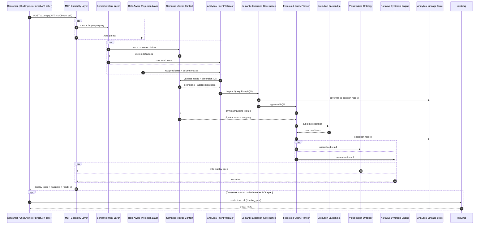
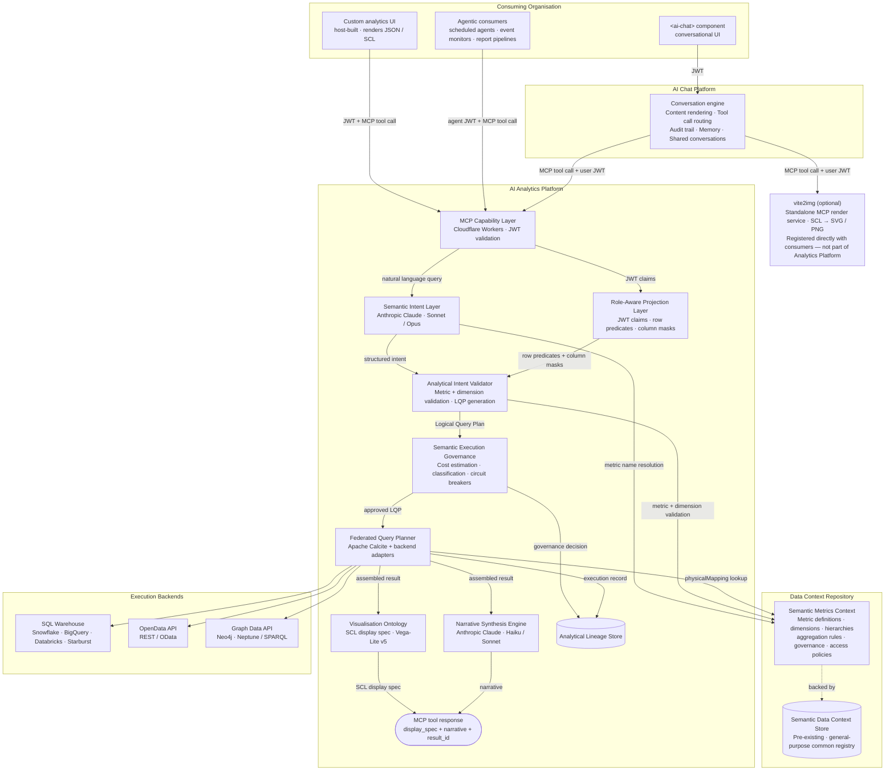

# 00 — Overview

## Vision

The **AI Analytics Platform** is a **deterministic semantic computation engine** — not a generative AI product. Given a structured analytical query — metric IDs, dimensions, time period, and filters resolved against the Semantic Metrics Registry — it always computes the same answer from the same data. No probability, no sampling, no generation. GenAI is a consumer of the platform: a conversational assistant uses the MCP Capability Layer as a tool, narrates computed results in prose, and never produces the numbers. The platform always produces the numbers, deterministically.

It is a shared analytical backend: a governed, role-aware computation layer over registered data sources, accessible to any MCP-compatible consumer — applications, AI agents, or automated pipelines — without each consumer building query governance independently.

### What the platform is and is not

| It is | It is not |
|-------|-----------|
| A **deterministic semantic computation engine** — same query, same data, same entitlements → same result; metric values computed from registered definitions, never generated | A generative AI product — GenAI narrates results, the engine computes them |
| A headless MCP API returning structured JSON result sets and SCL display specifications | A general-purpose SQL interface, BI tool replacement, or UI-rendering layer |
| A governed Semantic Metrics Registry — all AI-accessible metrics are registered, versioned, and owned | A system that allows LLMs to generate arbitrary SQL against physical schemas |
| A federated query planner routing governed plans to SQL warehouses, OpenData APIs, Graph Data APIs, and any registered backend | A single-engine analytics layer coupled to one database or query technology |
| A role-aware entitlement layer enforced at the semantic tier before query execution | A system that relies on database-level access controls as the primary AI security boundary |

---

## Scope

### In scope

- Headless MCP API (`POST /v1/mcp`) — sole entry point for all consumers; returns JSON result sets and SCL display specs; no rendering layer
- Semantic Metrics Registry (SMR) — governing catalogue of all resolvable metrics, dimensions, hierarchies, aggregation rules, ownership, and lineage metadata
- Analytical Intent Validator — validates MCP tool call parameters against the SMR, applies role projection, compiles engine-agnostic Logical Query Plans; MCP JSON format is the query interface
- Federated Query Planner — routes LQP fragments to registered execution backends; assembles results; manages caching
- Role-Aware Projection Layer — row restrictions, column masks, metric visibility applied at the semantic tier before plan compilation
- Semantic Execution Governance — circuit breakers, cost controls, complexity limits, compliance classification before any backend call
- Visualisation Ontology — governed chart contracts producing SCL display specs; the platform does not render charts
- MCP Capability Layer — bounded pre-defined analytical operations exposed to AI orchestrators via MCP
- Narrative synthesis — LLM prose anchored exclusively to execution result values; metric hallucination architecturally prohibited
- Analytical lineage trail — provenance from intent through SMR resolution, role projection, plan compilation, and backend execution
- Financial Services reference model — pre-built metric definitions for wealth management, banking, and regulatory reporting

### Out of scope

- Chart or table rendering — consumer responsibility in all cases
- Direct query execution against host data sources — all queries expressed as LQPs via registered backends
- Exposure of physical schemas, endpoints, or query languages to AI model context
- Ad hoc query generation against unregistered data sources
- Real-time streaming data ingestion (v1)
- Cross-tenant metric federation
- Unauthenticated analytical access

---

## Request flow

The following sequence diagram traces a single analytical request from consumer to response:



### Components

**Semantic Intent Layer** resolves natural language against the SMR and produces structured analytical intent — metrics, dimensions, filters, and hierarchy traversals.

**Semantic Metrics Registry (SMR)** is the governing catalogue of all resolvable analytical concepts. Metric definitions are stored in the Semantic Data Context Store (DCS) — a pre-existing external general-purpose registry — which the Analytics Platform extends to hold `analytical_metric` types. The SMR layer adds governance workflow, schema validation, and the Admin API authoring surface.

**Role-Aware Projection Layer** filters the metric set to what the authenticated user is permitted to see, injects row-level security predicates, and applies column masks — before any query plan is compiled.

**Analytical Intent Validator** validates MCP tool call parameters against the SMR, applies role-aware projection, validates semantic rules, and produces an engine-agnostic Logical Query Plan (DAG of analytical operations with no physical backend references).

**Semantic Execution Governance** validates the LQP against circuit breakers, cost estimates, and compliance classification before releasing it to the FQP.

**Federated Query Planner (FQP)** decomposes the LQP into backend-specific sub-plans, routes them to registered backends, and assembles results. Backends may be SQL warehouses, OpenData APIs, Graph Data APIs, semantic layers, OLAP engines, or any registered retrieval mechanism.

**Visualisation Ontology** selects a chart contract from the result schema and produces a **Semantic Charting Language (SCL)** `display_spec` returned to the consumer. The Analytics Platform does not render charts.

**Narrative Synthesis Engine** generates governed prose anchored exclusively to values present in the execution result.

**Analytical Lineage Store** persists the complete intent-to-result chain for every query.

---

## Headless by design

The platform has no rendering layer. Every analytical request returns:

| Field | Type | Description |
|-------|------|-------------|
| `result_id` | string | Links to the full lineage record |
| `display_spec` | JSON | SCL display spec — `type: "chart"` or `type: "table"` |
| `narrative` | string (optional) | Governed prose from the Narrative Synthesis Engine |

Both SCL types use a consistent JSON envelope:

```json
{ "type": "chart", "mark": "bar", "data": { "values": [ ... ] },
  "encoding": { "x": { "field": "portfolio", "type": "nominal" },
                "y": { "field": "tracking_error", "type": "quantitative" } } }
```

```json
{ "type": "table",
  "columns": [ { "field": "portfolio", "label": "Portfolio", "type": "string" },
               { "field": "tracking_error", "label": "Tracking Error", "type": "number", "format": ".2%" } ],
  "data": [ ... ] }
```

| Consumer | How they render |
|---------|----------------|
| Custom analytics UI | Chart library for `type: "chart"`; grid component for `type: "table"` |
| AI Chat Platform | Native rendering pipeline; calls **vite2img** for static image output (export, PDF) |
| Agentic consumers | Call **vite2img** directly, passing `display_spec`; receive SVG or PNG for embedding |

**vite2img** is a standalone MCP render service registered directly with consumers as a peer MCP server — not part of the Analytics Platform. It accepts a `display_spec` and returns SVG or PNG, with no interaction with the Analytics Platform's governance pipeline.

---

## Dependencies

| Dependency | Role |
|------------|------|
| **AI provider** | Provider-agnostic abstraction used by the Semantic Intent Layer and Narrative Synthesis Engine |
| **Platform storage** | Relational database (RLS) for lineage, governance, and config; object storage for cached results |
| **Platform edge function** | JWT handling, intent resolution, LQP compilation, governance, FQP orchestration, result assembly |
| **Consumer authentication** | Organisation's identity provider — issues JWTs with role claims consumed by the Role-Aware Projection Layer |
| **Host execution backends** | SQL warehouses, OpenData APIs, Graph Data APIs, semantic layers, OLAP engines, or any registered retrieval mechanism |
| **Semantic Data Context Store (DCS)** | Pre-existing external general-purpose registry; Analytics Platform stores `analytical_metric` definitions alongside existing data definitions |
| **AI Chat Platform** | Primary conversational consumer of the MCP Capability Layer |
| **vite2img** | Optional standalone MCP render service — registered with AI Chat Platform and agentic consumers as a peer server; not part of Analytics Platform |
| **Semantic Registry Service** | Pre-built metric definitions for financial services domains |
| **Regulatory Reference Service** | Regulatory metric definitions (Basel III/IV, IFRS 9, MiFID II) |
| **Benchmark Data Service** | Market benchmark and index data as dimensional reference data |

---

## Role in the AI-Enablement Product Ecosystem

The AI Analytics Platform and **AI Chat Platform** form a complementary two-layer offering:

| Layer | Product | Responsibility |
|-------|---------|---------------|
| **Conversational surface** | AI Chat Platform | Generative chat, conversation management, multi-modal rendering, tool call transparency, memory, audit. No built-in analytical capability. |
| **Analytical backend** | AI Analytics Platform | Governed semantic metric resolution, federated query, role-aware entitlements, SCL display spec generation, lineage-backed results. Headless — no rendering, no conversational surface. |

The Analytics Platform's MCP Capability Layer is designed for any AI orchestrator — the AI Chat Platform today, additional agentic consumers as the ecosystem grows. All consumers route through the same governance pipeline with identical metric definitions, entitlement enforcement, and lineage provenance.

The platform supports three consumption modes simultaneously:

| Mode | Consumer | When to use |
|------|---------|-------------|
| **Direct API** | Custom application calling `POST /v1/mcp` directly | Dedicated analytics views and dashboards where the app owns rendering |
| **Conversational backend** | AI Chat Platform via `mcpServers` config | Users asking quantitative questions in natural language |
| **Agentic** | Autonomous agents, scheduled pipelines, event-triggered workflows | Governed metric access without a human in the loop |

---

### Platform architecture

The following diagram shows all three consumption modes against the same Analytics Platform backend, with each component as a distinct node:



No consumer has a path to execution backends, physical schemas, or raw SQL. Every analytical request routes through the MCP Capability Layer and the full governance pipeline. The Analytical Lineage Store records every invocation regardless of consumer type.

---

### MCP registration

To connect the Analytics Platform to the AI Chat Platform, add to the `mcpServers` section of the AI Chat Platform config:

```json
{
  "id":          "analytics-platform",
  "name":        "Analytics Platform",
  "description": "Governed analytical query engine. Resolves quantitative questions against registered business metrics via the Semantic Metrics Registry. Use for portfolio performance, risk decomposition, performance attribution, issuer concentration, regulatory metrics, and any question requiring large-scale data analysis. Always specify metric IDs — do not attempt to construct SQL or use unregistered identifiers. Call list_metrics first if unsure which metrics are available.",
  "endpoint":    "https://api.analytics-platform.io/v1/mcp",
  "authType":    "bearer",
  "accessTier":  "always-on",
  "roles":       []
}
```

The `description` field is injected verbatim into the AI model's system prompt and is the primary routing signal. The text above is optimised for financial services deployments — customise to reflect your specific metric domains. Setting `accessTier: "always-on"` makes Analytics Platform capabilities available in every session without user action.

---

### Agentic consumers

The MCP Capability Layer serves any MCP-compatible AI orchestrator beyond the AI Chat Platform:

| Agent type | Example use case |
|-----------|-----------------|
| **Scheduled analytical agents** | Nightly portfolio risk summary; daily regulatory metric check before market open |
| **Event-triggered monitors** | Automatic `risk_breakdown` when a tracking error threshold is breached |
| **Report-generation pipelines** | Investment committee pack — `performance_attribution`, `compare_portfolios`, `regulatory_metric` composed into a governed narrative; SCL specs converted to static images via vite2img for PDF embedding |
| **Compliance review agents** | Periodic mandate compliance checks using `issuer_concentration` and `regulatory_metric` written to an audit log |
| **Research augmentation agents** | Web search combined with governed `analyse_metric` results anchored to verified portfolio data |

All agentic consumers must present a valid JWT with role claims. The Role-Aware Projection Layer enforces the same entitlement model as for human users — there is no elevated-privilege path for agents.
