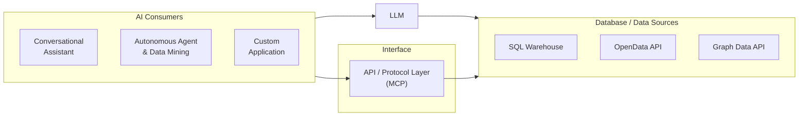
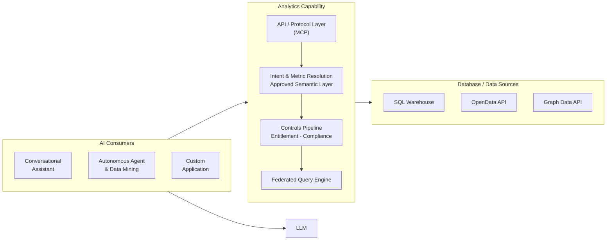

# Overview: Governed Large-Scale Analytics and Data Mining

## The Problem

### The challenge for large regulated organisations

Large organisations operating in regulated industries — financial services, healthcare, energy, pharmaceuticals, defence — share a common analytical problem. Their decisions depend on metrics that are not simple aggregations: they are versioned, regulated, formula-specific computations that must be calculated identically across every report, every system, and every user session. Any deviation is an error. In financial services this means portfolio return calculations, VaR models, and capital ratios. In healthcare it means clinical outcome metrics and safety indicators. In energy it means emissions calculations and grid reliability metrics. The domain changes; the structural problem does not.

The consequence is a structural bottleneck. Business users cannot access the data they need without going through a specialist intermediary. Developers translate business requirements into SQL. Data engineers maintain the pipelines. Analysts mediate between business questions and physical data. This is not a resourcing problem; it is an architectural one. Decision-making slows to the analysts' capacity. Strategic questions queue behind routine reporting. Insight arrives days or weeks after the moment it was needed.

The regulatory dimension sharpens this further. An analytical result in a regulated organisation is not just a number: it is an assertion. When a regulator asks how a figure was calculated, the answer must be reproducible, version-controlled, and complete. When the same metric appears in submissions across two jurisdictions, it must resolve to exactly the same formula. These are not quality aspirations. They are legal requirements. An organisation that cannot produce computation provenance for its regulatory submissions is not merely technically incomplete. It is legally exposed.

### The opportunity

AI assistants and agents today handle small-scale data access well: retrieving records, checking statuses, calling predefined calculations. The next step — large-scale analytics and data mining across governed, regulation-sensitive data — requires something more. A portfolio manager asking for returns versus benchmark across all equity strategies, a risk officer monitoring VaR breaches across multiple entities, a clinical analyst extracting a year of patient outcome data: these are not record lookups. They are governed analytical computations.

The natural starting point for organisations is Text-to-SQL: use an LLM to generate SQL queries and run them directly against production data. For ad hoc, low-stakes exploration this has merit. For governed large-scale analytics in regulated organisations it has three structural failures that no amount of tuning resolves:

- **No approved analytics and metrics definitions** — the AI infers what "Portfolio Return" means at query time; the same question can produce a different calculation in a different session
- **No reproducible calculation record** — SQL is generated fresh each time; two identical queries are not guaranteed to produce identical results
- **No guaranteed entitlement enforcement** — access controls depend on the reliability of AI-generated query predicates, not a guaranteed enforcement layer

Training LLMs on database schemas improves query accuracy in early trials but addresses the symptom — table knowledge — not the problem. The governance gap remains. The [Text-to-SQL appendix](./04-text-to-sql-antipattern.md) examines these failure modes in detail — and where Text-to-SQL does belong: as the exploration layer alongside the governed execution layer, with outputs promoted into the registry when they need to become reliable.

### The platform

The AI Analytics Platform is a governed computation engine that gives AI systems correct, auditable access to an organisation's regulated metrics and datasets — without exposing database schemas, without generating SQL, and without compromising entitlement enforcement. AI interacts exclusively with approved analytics and metrics definitions in the Semantic Metrics Repository: versioned metric definitions, governed dataset contracts, and enforced entitlements. The platform handles all deterministic computation, access control, and audit recording behind a single governed API.

A defining design objective is that the platform operates across any data warehouse, data source, or analytical tool within a large enterprise environment. It is not tied to a single application schema, a single data model, or localised AI model training on a specific database. Instead, it relies on **centrally governed analytics and data definitions** — registered once in the Semantic Metrics Repository and the Semantic Data Repository — that describe what metrics mean and how they are calculated in terms that are independent of any physical implementation. A metric defined once in the SMR is queryable across every registered data source, and its definition travels with it regardless of which backend holds the underlying data. This is the architectural property that makes cross-platform analytical consistency possible at enterprise scale: the governance layer, not the data layer, is the source of truth.

In practice: a portfolio manager asks "show me portfolio returns versus benchmark for my equity portfolios this quarter" in plain English and receives a governed, role-constrained, auditable result with the full computation record attached. A data science pipeline extracts millions of rows of position data under the same entitlement and audit controls. A treasury analyst produces an LCR figure for a regulatory submission and receives, automatically, a regulator-ready compliance artifact set alongside the result. The analyst bottleneck breaks. Regulatory requirements hold.

The platform addresses the following challenges that Text-to-SQL and MCP implementations that directly expose physical schemas and delegate query execution to AI models cannot:

| Enterprise analytical challenge | Platform response |
|---|---|
| Metric consistency across users, reports, and regulatory submissions | Every metric is registered once, approved, and version-controlled — "Portfolio Return" means the same thing everywhere |
| Complex regulated formulas (VaR, LCR, BHB attribution) computed at scale | Defined once in the SMR, computed identically every time — never re-inferred from raw data |
| Computation provenance for regulatory review | Full audit record for every result: intent → definitions → entitlements → plan → execution → result |
| Entitlement enforcement that AI cannot bypass | Enforced at the analytical layer before any database is contacted — not dependent on AI query generation reliability |
| Metric governance and change management | Every metric definition is version-controlled with an approval workflow and full change history |
| Multi-source analytical federation | A single governed interface routes queries across SQL warehouses, APIs, graph databases, and any registered data source — not tied to a single application schema, data model, or localised AI training |
| Cross-platform metric consistency | Analytics and data definitions are registered centrally and are independent of physical implementation — the same metric is queryable identically across every backend in the enterprise |
| Large dataset access for AI agents and data mining pipelines | Large datasets returned to agents and pipelines under the same entitlement and audit controls as analytical queries |

### Analytics engines: a well-established design pattern

This is not a new category. The industry has built governed semantic computation layers for decades across a broad range of platforms:

| Category | Examples |
|---|---|
| BI semantic layers | Business Objects Universe, MicroStrategy Semantic Layer, Cognos Framework Manager |
| OLAP engines | Essbase, SAP BW, Microsoft SSAS |
| Modern metrics layers | dbt Semantic Models, Cube, AtScale |
| Data virtualisation | Denodo, Starburst |
| Domain-specific engines | Risk engines, actuarial engines, pricing engines, fraud detection engines |

All share a common design pattern. Rather than searching tables and returning rows, a semantic computation layer interprets business concepts, applies approved calculations, enforces dimensional hierarchies and access controls, and returns governed analytical responses. When a CFO asks *"what was our adjusted EBITDA by region last quarter?"*, the analytical engine resolves the business concept, applies the approved formula, enforces access controls, and returns a governed result — not a set of database rows.

The dominant AI narrative has become: *natural language → LLM → SQL → database → answer*. This treats the database as the analytical system. It is not. The analytical system is the governed computation layer that sits above the database. The AI opportunity is to expose that layer through natural language and agentic interfaces — not to route around it. The AI Analytics Platform is that layer.


## Architectural Model

The **Analytics Engine** is the platform's computation core. Given a precisely specified question — which metrics, which dimensions, which time period, which filters — it always produces the same answer from the same data with the same access permissions in force. No probability, no AI generation, no inference affects the computed values.

A defining characteristic of this architecture is that **the Analytics Engine never uses AI to generate SQL or analytical queries**. Every query executed against a data source is constructed deterministically from pre-registered, governed analytics definitions in the Semantic Metrics Repository. An approved metric definition specifies exactly how a computation is performed; the platform reads that definition and constructs the physical query mechanically. The same metric, the same parameters, and the same permissions always produce the same query. AI cannot alter, extend, or influence query construction.

The Analytics Engine contains exactly two targeted uses of AI, both strictly bounded:

1. **Intent resolution** — the Intent Resolution Agent (IRA) is the first step in the pipeline and a contained, bounded AI component. It receives a natural language question, retrieves candidate operations from the SMR catalogue using embedding similarity (RAG), and uses a language model to rank them and bind the user's parameters — mapping the question to one or more registered analytics definitions in the SMR. The language model selects from the governed inventory; it does not construct queries or access data. As part of the same step, the IRA classifies whether the user's stated purpose is compliance-driven — the second signal of the two-signal compliance trigger — and asks the user to clarify when the purpose is ambiguous.

2. **Narrative synthesis** — after computation completes, the Narrative Synthesis Agent (NSA) makes a single, tightly-scoped language model call to produce a brief plain-language summary of the result, anchored strictly to the computed values. It is told what the data shows; it cannot introduce figures, comparisons, or interpretations not present in the result.

All computation between these two steps — validation, entitlement enforcement, controls, physical query construction, execution, and visualisation — is entirely deterministic and contains no AI.

| It is | It is not |
|-------|-----------|
| A governed computation platform — the same question, data, and access permissions always produce the same answer | An AI query generator — the Analytics Engine never uses AI to construct SQL or analytical queries |
| A governed analytics and data mining platform — metric queries, large dataset retrieval, and drilldown under a unified controls pipeline | A general-purpose SQL interface, BI tool replacement, or user interface |
| A platform with two tightly-bounded AI steps: intent resolution (selecting the right governed definition) and narrative synthesis (summarising the computed result) | A system where AI influences computation, query construction, or result values |
| A governed metric registry — every queryable metric is registered, approved, and version-controlled | A system that infers metric definitions at query time |
| An enterprise-wide platform — works across any data warehouse or source in the organisation, governed by central definitions not tied to any single application or schema | A single-application or single-warehouse analytics tool — not dependent on localised AI training or a specific data model |

All AI systems access the platform through a single channel — an API layer built on MCP (Model Context Protocol), an open standard for connecting AI systems to tools and data. Conversational assistants, autonomous agents, data mining pipelines, and custom applications all enter through this channel and traverse the same controls pipeline. There is no alternative path. Every AI-initiated request produces an audit record. This is the architectural guarantee that makes AI-driven analytics safe to operate in a regulated environment.


## Design Principles

Ten principles govern all design decisions. Where a proposed feature conflicts with a principle, the principle takes precedence.

| Principle | What it means |
|-----------|--------------|
| **P1 — Semantic abstraction** | The platform never exposes physical database schemas to AI models or end users. Unregistered concepts cannot be queried — schema leakage is impossible by design, not by policy. |
| **P2 — Controls before execution** | Every query passes through the full controls pipeline before any database is contacted. There is no fast path. |
| **P3 — Deterministic metric resolution** | A metric name resolves to exactly one approved definition at a given point in time. "Portfolio Return" means the same thing in every query, every report, and every regulatory submission under the same version. |
| **P4 — Complete analytical lineage** | Every result carries a complete, queryable record of how the analytics engine used individual data elements to produce it — every definition, every access decision, every sub-result. |
| **P5 — Role-aware by default** | Deny-by-default is an architectural property: an unauthenticated or unentitled request is always blocked before any analytical processing begins. Access restrictions are injected at the query level, not applied as a post-retrieval filter. |
| **P6 — Governed narrative** | Plain-language summaries are anchored exclusively to values in the computed result. Hallucinated financial metrics are a regulatory and reputational risk; the architecture makes them impossible, not merely unlikely. |
| **P7 — Deterministic visualisation** | Chart type selection is governed by a registered set of chart contracts. The AI does not select chart types — the same analytical pattern always produces the same chart across users, sessions, and time. |
| **P8 — Explainability at every layer** | Users and compliance functions can inspect what was queried, why, and with what results at every layer of the stack. An intent confirmation step shows resolved intent before execution; a lineage inspector exposes every step in human-readable form. |
| **P9 — Administrator sovereignty within governance bounds** | Platform administrators control data sources, metric definitions, access policies, and governance thresholds — but may not lower governance minimums below platform floors. There is no bypass mode. |
| **P10 — Deterministic computation, not generation** | Analytical results are computed from approved analytics and metrics definitions, never generated by an AI model. The same structured request, with the same access permissions and data, always returns the same result. |

Each principle creates natural tensions with product requirements — expressiveness, latency, and metric evolution — and each tension has a defined resolution. Full discussion is in [Chapter 1](./01-core-capabilities.md).

Two tensions are worth noting here. When a business concept cannot be queried, the resolution is to register it in the metric registry: a governed addition subject to approval and version control, not an ad hoc inference. That is a productive tension — it is how the platform's analytical vocabulary grows. The tension between administrator control and governance minimums is different: governance floors are architectural properties of the platform, not configurable thresholds. There is no bypass mode.


## The Architecture in Practice

In both approaches, AI clients and LLMs are present. The difference is what happens next. In Text-to-SQL, the AI generates queries directly against raw database schemas. In the AI-Enabled Analytics Platform, it submits structured requests to a governed semantic layer — and the platform handles all computation, governance, and execution.

**Text-to-SQL Approach**



**AI-Enabled Analytics Platform**



In the platform approach, every request routes through the API layer, traverses the invariant controls sequence, and produces an audit record. No path to execution backends, physical schemas, or raw data exists outside that pipeline.

>[!IMPORTANT]
>As a recap, we believe the Text-to-SQL approach is a valid solution for ad-hoc, unregulated style interactions.  We view the *Text-to-SQL* and the goverened *Analytics Engine* approachs as *two complementary capabilities* that work side by side, often both fronted by the same Conversational-AI experience - ie an end user can initiate a conversation about a specific data need, the AI-interactions can first attempt to find the solution via the goverened stack and if not available seamlessly turn to the ad-hoc stack for an ungoverened answer.   Keeping track of  nature and frequency of ah-hoc querries then becomes an input to expandin the list of availavle governanced analytic definitions.  Generative AI can also start to draft the goverened definitions for human approach.

### Query Space

The platform's scope spans two independent dimensions that together define the full range of governed analytical work.

**Output type — visualisation or dataset**
Some requests are best answered with a chart or summary: a portfolio manager wants to see returns versus benchmark, not a raw table of numbers. Others require a structured dataset: a data science pipeline needs millions of rows of position data for model retraining, and a chart is irrelevant. Both output types traverse the same controls pipeline. The difference is resolved by the Data Visualization Language (DVL) at query time — chart or table is determined by the intent and result shape, not by the user or the AI.

**Governance tier — business analytics or full-provenance**
Most queries require standard governance: approved analytics and metrics definitions, entitlement enforcement, and a compliance provenance record. Some queries require more: when a request involves a metric flagged as compliance-relevant and is made for a compliance-driven purpose — a regulatory submission, for example — the platform automatically escalates to the enhanced compliance artifact tier. Two independent signals trigger escalation: the metric's own compliance-relevant flag (set by the Metrics Modeller at registration) and the Intent Resolution Agent's classification of the query's stated purpose. When both signals are present, a regulatory trace record, export controls, and a regulator-ready artifact set are produced automatically. No user action or role claim is required.

These two dimensions define four possible result types. The platform handles all four under the same governed pipeline:

| | Standard governance | Full-provenance (compliance) |
|---|---|---|
| **Visualisation** | Business analytics chart — metric query with chart output | Compliance chart with regulatory trace and export controls |
| **Dataset** | Data mining table — governed large dataset retrieval | Compliance dataset with regulatory trace and export controls |

### End-to-End Examples

Four queries traced through every stage illustrate the query space in practice. The first is a routine business analytics question — metric query with visualisation output, standard governance. The second is a multi-source business question — metrics federated across two independent backends, assembled into a single governed result. The third is a data mining request from an autonomous agent — large dataset retrieval with table output, standard governance. The fourth is a regulatory submission request — the same controls pipeline with compliance artifact escalation triggered automatically by the two-signal model.


#### Example 1 — Portfolio performance (business analytics query)

**1 · Natural language request**
A portfolio manager asks: *"Show me portfolio returns versus benchmark for my equity portfolios this quarter."*

```
-- Request
"Show me portfolio returns versus benchmark for my equity portfolios this quarter"
```

**2 · Intent resolution**
The Intent Resolution Agent (IRA) inside the engine translates the question into a precise, structured request: compare portfolio return against benchmark return, for equity portfolios, current quarter, broken down by portfolio. It retrieves and ranks candidate operations from the metric registry and binds the parameters; no database query is generated at this stage.

```
-- Semantic Intent Resolution
operation:      compare_metric_to_benchmark
metrics:
  portfolio_return  (unresolved)
  benchmark_return  (unresolved)
filters:        asset_class = equity  |  period = current_quarter
dimensions:     portfolio_id
```

**3 · Metric and entitlement resolution**
The platform resolves both metrics against the Semantic Metrics Repository. Portfolio return resolves to an approved, version-controlled value-weighted return formula. Benchmark return resolves via each portfolio's registered default benchmark. The user's identity token is validated and access permissions are projected, restricting results to portfolios within their coverage scope.

```
-- Metric & Entitlement Resolution
portfolio_return  →  definition v2.1.0: (end_market_value - start_market_value + cash_flows) / start_market_value
benchmark_return  →  portfolio.registered_default_benchmark.period_return
entitlements:        user_scope → [authorised_portfolio_list]
```

**4 · Query planning, governance, and execution**
The Semantic Controls Layer validates the Logical Query Plan against its five checks. The Physical Query Planner compiles the approved plan into a physical execution plan — resolving the data source references and carrying the entitlement row scope through to the physical layer. The Federated Query Engine executes it against the registered data source. No raw database schemas have been exposed at any stage. The Analytics Engine assembles the response: computed values, a DVL display specification, an optional plain-language narrative summary anchored strictly to the result (produced by the Narrative Synthesis Agent), and a full audit record.

```sql
-- Physical execution (FQE output)
SELECT   p.portfolio_id,
         -- value-weighted aggregation of the precomputed definition v2.1.0 return measure
         SUM(p.total_return_net * p.market_value)
                / SUM(p.market_value)                      AS portfolio_return,
         b.period_return                                   AS benchmark_return
FROM     portfolio_fact        p
JOIN     benchmark_timeseries  b  ON p.default_benchmark_id = b.benchmark_id
WHERE    p.asset_class  = 'equity'
  AND    p.period       = current_quarter()
  AND    p.portfolio_id IN (/* authorised_portfolio_list */)
GROUP BY p.portfolio_id, b.period_return;

-- Execution Response
-- data:      [{ portfolio_id, portfolio_return, benchmark_return }, ...]
-- narrative: plain-language summary anchored to computed values only
-- audit:     lineage_id, resolved_metric_versions, entitlement_snapshot
```

**5 · Presentation decision**
The result schema — two numeric measures compared across a categorical dimension — is matched against the Data Visualization Language (DVL). DVL resolves a grouped bar chart as the governed display contract for this result shape and intent pattern. A complete DVL display specification is emitted alongside the data; the AI consumer renders it without making any independent display choice.

```json
{
  "mark": "bar",
  "encoding": {
    "x":      { "field": "portfolio_id", "type": "nominal",      "title": "Portfolio"  },
    "y":      { "field": "value",        "type": "quantitative", "title": "Return",
                "axis": { "format": ".1%" } },
    "color":  { "field": "measure",      "type": "nominal",
                "scale": { "domain": ["portfolio_return", "benchmark_return"],
                           "range":  ["#4C78A8", "#F58518"] } },
    "xOffset":{ "field": "measure",      "type": "nominal" }
  },
  "transform": [{ "fold": ["portfolio_return", "benchmark_return"],
                  "as":   ["measure", "value"] }],
  "title": "Portfolio Return vs Benchmark — Current Quarter"
}
```


#### Example 2 — VaR breach investigation (multi-source business analytics query)

**1 · Natural language request**
A risk officer asks: *"Which portfolios are breaching their VaR 95 limit today, and what is the dominant risk factor contribution for each?"*

```
-- Request
"Which portfolios are breaching their VaR 95 limit today, and what is the dominant risk factor contribution for each?"
```

**2 · Intent resolution**
The Intent Resolution Agent (IRA) identifies three metrics — `var_95`, `var_limit`, and `risk_factor_contribution` — and resolves this as a threshold-comparison pattern with a contributing-factor breakdown. `var_limit` is a per-portfolio governance parameter stored in the risk configuration domain; `risk_factor_contribution` carries `portfolio_id` and `factor_bucket` as required dimensions. All three are registered in the Semantic Metrics Repository and resolve cleanly against the metric registry.

```
-- Semantic Intent Resolution
operation:      compare_metric_to_threshold_with_breakdown
metrics:        [var_95, var_limit, risk_factor_contribution]
dimensions:     [portfolio_id, factor_bucket]
filters:        as_of = today
```

**3 · Metric and entitlement resolution**
`var_95` and `risk_factor_contribution` resolve to their approved registry definitions — VaR is a versioned, formula-specific computation that must be calculated identically across every report. The metrics carry different data affinities, so they are served by two independent backends: VaR metrics are registered against the risk engine execution backend; portfolio metadata and limits are registered against the primary data warehouse. The user's entitlement scope is projected, restricting results to portfolios within the risk officer's authorised coverage.

```
-- Metric & Entitlement Resolution
var_95                   →  definition v3.1: 95th-percentile 1-day historical simulation VaR
var_limit                →  portfolio governance parameter  (data warehouse domain)
risk_factor_contribution →  definition v2.0: factor decomposition of excess VaR
backend_routing:
  var_95, risk_factor_contribution  →  risk_engine_backend
  var_limit, portfolio_metadata     →  primary_data_warehouse
entitlements: user_scope → [authorised_portfolio_list]
```

**4 · Query planning, governance, and execution**
The Physical Query Planner compiles the Logical Query Plan into a physical execution plan referencing both data sources — the risk engine and the primary data warehouse — with the authorised portfolio scope applied at the physical layer. The Federated Query Engine executes the plan, handling the cross-source join and assembling the result — breach status and dominant contributing factor per portfolio — before passing it downstream. The execution is recorded in the lineage store, with the assembled result linked to both source queries.

```sql
-- Physical execution: cross-source join on portfolio_id
SELECT   r.portfolio_id,
         r.var_95_value,
         r.risk_factor_contribution,
         r.factor_bucket,
         l.var_limit_value,
         (r.var_95_value > l.var_limit_value)  AS breach,
         r.var_95_value / l.var_limit_value    AS breach_pct
FROM     risk_engine.var_daily_positions r
JOIN     dw_prod.portfolio_governance.var_limits l
  ON     r.portfolio_id = l.portfolio_id
WHERE    r.as_of_date   = current_date
  AND    r.portfolio_id IN (/* authorised_portfolio_list */)
ORDER BY r.var_95_value DESC;

-- Execution Response
-- data:      [{ portfolio_id, var_95_value, var_limit_value, breach, breach_pct, factor_bucket, risk_factor_contribution }, ...]
-- audit:     lineage_id, data_sources_used, entitlement_snapshot
```

**5 · Presentation decision**
The result — metric versus threshold across multiple portfolio entities with a contributing factor breakdown — is matched against the Data Visualization Language (DVL). DVL resolves a heatmap as the governed display contract for this threshold-comparison pattern. Breaching portfolios are visually distinguished; the dominant risk factor is available as a drilldown dimension.

```json
{
  "layer": [{
    "mark": "rect",
    "encoding": {
      "x":     { "field": "portfolio_id",            "type": "nominal",      "title": "Portfolio"          },
      "y":     { "field": "factor_bucket",            "type": "nominal",      "title": "Risk Factor"        },
      "color": { "field": "risk_factor_contribution", "type": "quantitative", "title": "Factor Contribution",
                 "scale": { "scheme": "orangered" } }
    }
  }, {
    "mark": { "type": "text", "fontSize": 9 },
    "encoding": {
      "x":    { "field": "portfolio_id", "type": "nominal" },
      "y":    { "field": "factor_bucket","type": "nominal" },
      "text": { "field": "breach_pct",  "type": "quantitative", "format": ".0%" },
      "color":{ "condition": { "test": "datum.breach_pct > 1.0", "value": "white" }, "value": "black" }
    }
  }],
  "title": "VaR 95 Breach — Factor Contribution by Portfolio"
}
```


#### Example 3 — Fixed income position extraction (data mining query)

**1 · Request**
A quantitative research pipeline submits: *"Extract daily position and PnL data for all fixed income portfolios over the past 12 months for factor model retraining."*

This request originates from an autonomous agent. The agent submits a structured data retrieval request directly — the natural language translation step is bypassed. All governance stages remain fully active.

```
-- Structured Request  (agent — no natural language step)
operation:      retrieve_dataset
dataset:        fixed_income_daily_positions
time_range:     trailing 12 months
pagination:     page_size = 10,000 rows
```

**2 · Dataset and entitlement resolution**
The dataset identifier resolves against an approved `analytical_dataset` contract in the Semantic Metrics Repository — only registered, approved datasets are retrievable. The contract declares the dataset's approved field set. The agent's access permissions are projected: results restricted to authorised portfolios, fields exceeding the agent's data classification ceiling excluded.

```
-- Dataset & Entitlement Resolution
approved_fields:
  portfolio_id  |  instrument_id  |  asset_class
  daily_pnl     |  market_value   |  duration  |  currency  |  position_date
entitlements:
  row_scope:     agent authorised portfolio list
  field_ceiling: agent data classification level applied
```

**3 · Query planning, governance, and execution**
The Semantic Controls Layer validates the retrieval plan against its five checks — data scale (estimated scan volume), complexity, classification, compliance, and concurrency — and all checks pass. The Physical Query Planner constructs a paginated retrieval plan across the approved field set, restricted to the agent's authorised portfolios; the Federated Query Engine then executes it page by page under the same controls, enforcing the entitlement scope and field ceiling on every page. An audit record is written for the full retrieval — recording exactly which data was returned to which agent under which access permissions.

```sql
-- Physical execution (FQE output)
SELECT   portfolio_id, instrument_id, asset_class,
         daily_pnl, market_value, duration, currency, position_date
FROM     positions_fact
WHERE    asset_class   = 'fixed_income'
  AND    position_date BETWEEN current_date - INTERVAL '12 months' AND current_date
  AND    portfolio_id  IN (/* agent_authorised_portfolio_list */)
ORDER BY portfolio_id, position_date
LIMIT    10000  OFFSET :page_offset;

-- Execution Response  (per page)
-- data:       [{ portfolio_id, instrument_id, daily_pnl, market_value, ... }, ...]
-- pagination: { page: n, total_pages: nnn, continuation_token: "..." }
-- audit:      lineage_id, field_set_version, entitlement_snapshot
```

**4 · Presentation decision**
Bulk data retrieval resolves to a structured paginated table — not a chart. The Data Visualization Language (DVL) emits a table specification defining the approved field set, column types, and formatting rules. The consuming agent receives a typed dataset with a continuation token for subsequent pages.

```json
{
  "view": { "type": "table" },
  "columns": [
    { "field": "portfolio_id",  "type": "nominal",      "title": "Portfolio"      },
    { "field": "instrument_id", "type": "nominal",      "title": "Instrument"     },
    { "field": "asset_class",   "type": "nominal",      "title": "Asset Class"    },
    { "field": "position_date", "type": "temporal",     "title": "Date",
      "format": "%Y-%m-%d" },
    { "field": "market_value",  "type": "quantitative", "title": "Market Value",
      "format": ",.2f" },
    { "field": "daily_pnl",     "type": "quantitative", "title": "Daily PnL",
      "format": ",.2f" },
    { "field": "duration",      "type": "quantitative", "title": "Duration"       },
    { "field": "currency",      "type": "nominal",      "title": "CCY"            }
  ],
  "pagination": { "page_size": 10000, "continuation_token": true }
}
```


#### Example 4 — Regulatory LCR submission (compliance analytics query)

**1 · Natural language request**
A treasury analyst asks: *"Prepare our LCR figures for the regulatory submission."*

```
-- Request
"Prepare our LCR figures for the regulatory submission"
```

**2 · Intent resolution and compliance classification**
The Intent Resolution Agent (IRA) resolves the operation and metric from the SMR catalogue and classifies the stated purpose: the phrase *"for the regulatory submission"* exceeds the configured compliance intent threshold. Compliance purpose is recorded and carried through the full pipeline.

```
-- Semantic Intent Resolution
operation:      retrieve_metric
metric:         lcr  (unresolved)
intent_classification:
  compliance_purpose_score: 0.94  |  threshold: 0.80
  compliance_purpose: true
```

**3 · Metric resolution and compliance escalation**
The liquidity coverage ratio metric resolves to its approved registry definition, which carries a compliance-relevant flag set by the Metrics Modeller at registration. Two independent signals are now both active — the metric is marked as compliance-relevant, and the IRA has classified the stated intent as compliance-driven. The governance layer escalates automatically to the enhanced compliance artifact tier. No role claim, no manual flag, no special user action is required: escalation is a runtime consequence of what the metric is and what the query is for.

```
-- Metric Resolution & Compliance Escalation
lcr  →  definition v1.1: SUM(hqla_value) / SUM(net_outflow_30d)
compliance_signals:
  metric.compliance_relevant: true   -- set by Metrics Modeller at registration
  intent.compliance_purpose:  true   -- classified by the IRA at query time
escalation: ENHANCED compliance artifact tier  -- both signals required
```

**4 · Query planning, governance, and execution**
Compliance-purpose queries are never served from cache — a fresh computation is required for every regulatory submission. The controls layer constructs the query with cache bypass enforced. On completion, it writes a regulatory trace record to the compliance-specific audit store (in addition to the standard compliance provenance record), enforces export controls until the complete compliance provenance record exists, and validates the result's data classification against the user's authorised ceiling. The treasury analyst receives both the governed LCR result and a complete, regulator-ready audit trail — automatically.

```sql
-- Physical execution (FQE output — cache bypass enforced, compliance_purpose = true)
SELECT   h.entity_id,
         SUM(h.hqla_value)       AS total_hqla,
         SUM(c.net_outflow_30d)  AS total_net_outflows,
         SUM(h.hqla_value) / NULLIF(SUM(c.net_outflow_30d), 0)  AS lcr
FROM     hqla_inventory         h
JOIN     net_cash_outflow_30d   c  ON h.entity_id = c.entity_id
WHERE    h.as_of_date  = :submission_date
  AND    h.entity_id   IN (/* authorised_scope */)
GROUP BY h.entity_id;

-- Execution Response
-- data:      [{ entity_id, total_hqla, total_net_outflows, lcr }, ...]
-- compliance:
--   regulatory_trace_id:  written to compliance audit store
--   artifact_set_version: "1.0"
--   triggered_by:         [lcr]
--   export_gate:          locked until complete compliance provenance record exists
-- audit:     lineage_id, metric_version, entitlement_snapshot
```

**5 · Presentation decision**
A small set of entity-level regulatory ratios resolves to a structured compliance table — not a chart. The Data Visualization Language (DVL) emits a table specification with conditional formatting to highlight ratios below the regulatory minimum. Because compliance artifact mode is active, the specification carries an export contract: output is locked until the complete compliance provenance record is confirmed.

```json
{
  "view": { "type": "table" },
  "columns": [
    { "field": "entity_id",          "type": "nominal",      "title": "Entity"           },
    { "field": "total_hqla",         "type": "quantitative", "title": "HQLA (m)",
      "format": ",.1f" },
    { "field": "total_net_outflows", "type": "quantitative", "title": "Net Outflows (m)",
      "format": ",.1f" },
    { "field": "lcr",                "type": "quantitative", "title": "LCR",
      "format": ".2%",
      "conditionalStyle": { "if": "datum.lcr < 1.0", "color": "red" } }
  ],
  "compliance": {
    "regulatory_trace_id": true,
    "export_gate":         "lineage_complete"
  }
}
```

**6 · Compliance provenance generation**
Once execution completes and the result is verified, the platform seals a compliance provenance record and writes it to the append-only compliance audit store. The record covers the full chain — what was asked, which metric definition and version was used, how the logical field specification mapped to physical tables, what SQL ran against which backend, and the exact entitlement state at execution time. The entire record is protected by a cryptographic-style hash signature, so any tampering with the record after sealing is detectable. Any party holding the platform's published verification key can independently confirm that no field has been altered since sealing — without any access to the platform itself. The export gate remains locked until this record is confirmed written; the presentation specification carries the gate status and will not release the output until provenance is complete.

```json
{
  "lineage_id":           "lin_9f3a2c81-4d7e-4b1a-bc3f-2e8d1f6a9c04",
  "regulatory_trace_id":  "reg_<framework_id>_lcr_20260603_ent_007",
  "artifact_set_version": "1.0",
  "export_gate":          "locked",

  "intent": {
    "raw_request":              "Prepare our LCR figures for the regulatory submission",
    "compliance_purpose_score": 0.94,
    "compliance_purpose":       true
  },

  "escalation_signals": [
    { "signal": "metric.compliance_relevant", "source": "metric_registry",      "value": true },
    { "signal": "intent.compliance_purpose",  "source": "ira_intent_classifier", "value": true }
  ],

  "metric": {
    "id":                  "lcr",
    "version":             "v1.1",
    "formula":             "SUM(hqla_value) / SUM(net_outflow_30d)",
    "compliance_relevant": true,
    "approved_by":         "Chief Data Officer",
    "approved_at":         "2025-11-14T09:00:00Z"
  },

  "logical_field_spec": {
    "grain":  "entity_id",
    "as_of":  "2026-06-03",
    "fields": [
      { "name": "hqla_value",      "logical_source": "hqla_inventory.hqla_value",           "role": "numerator"   },
      { "name": "net_outflow_30d", "logical_source": "net_cash_outflow_30d.net_outflow_30d", "role": "denominator" }
    ],
    "filters":      { "entity_id": ["ENT_007", "ENT_012"] },
    "cache_policy": "bypass"
  },

  "physical_execution": {
    "tables": [
      { "logical": "hqla_inventory",      "physical": "fds_prod.liquidity.hqla_daily_position",    "columns": ["entity_id", "as_of_date", "hqla_value"]      },
      { "logical": "net_cash_outflow_30d", "physical": "fds_prod.liquidity.ncof_30d_stressed_view", "columns": ["entity_id", "as_of_date", "net_outflow_30d"] }
    ],
    "executed_sql": "SELECT h.entity_id, SUM(h.hqla_value) AS total_hqla, SUM(c.net_outflow_30d) AS total_net_outflows, SUM(h.hqla_value) / NULLIF(SUM(c.net_outflow_30d), 0) AS lcr FROM fds_prod.liquidity.hqla_daily_position h JOIN fds_prod.liquidity.ncof_30d_stressed_view c ON h.entity_id = c.entity_id WHERE h.as_of_date = '2026-06-03' AND h.entity_id IN ('ENT_007', 'ENT_012') GROUP BY h.entity_id",
    "query_hash":   "sha256:a3f8c2d1e4b7f09c3a2e1d8b6f4c9a7e2d5b8f1c4a6e3d9b2f7c5a1e8d4b6f3",
    "backend":      "liquidity_warehouse_primary",
    "completed_at": "2026-06-03T08:14:29Z",
    "row_count":    2
  },

  "entitlement_snapshot": {
    "user_id":      "usr_treasury_jsmith",
    "roles":        ["treasury_analyst", "lcr_submitter"],
    "entity_scope": ["ENT_007", "ENT_012"],
    "evaluated_at": "2026-06-03T08:14:22Z"
  },

  "signature": {
    "key_id":        "analytics-platform-signing-key-2026-01",
    "signed_fields": ["intent", "escalation_signals", "metric", "logical_field_spec", "physical_execution", "entitlement_snapshot"],
    "value":         "MEYCIQDp3f8c2a1e9b4d7f6c5a3e2d1b8f4c9a7e2d5b8f1c4a6e3CIQD9b2f7c5a1e8d4b6f3c9a2e6d4b8f1c5a3e7d2b9f4c6a8e1d3",
    "sealed_at":     "2026-06-03T08:14:30Z"
  },

  "export_gate_released_at": null
}
```
