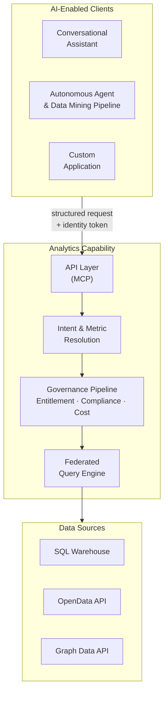

# Overview: Governed Large-Scale Analytics and Data Mining

## The Problem

### Analytics engines: a well-established design pattern

The governed semantic computation engine is not a new idea. The industry has developed and refined it for decades across a broad range of platforms and categories:

| Category | Examples |
|---|---|
| BI semantic layers | Business Objects Universe, MicroStrategy Semantic Layer, Cognos Framework Manager |
| OLAP engines | Essbase, SAP BW, Microsoft SSAS |
| Modern metrics layers | dbt Semantic Models, Cube, AtScale |
| Data virtualisation | Denodo, Starburst |
| Domain-specific engines | Risk engines, actuarial engines, pricing engines, fraud detection engines |

All share a common design pattern. Rather than searching tables and returning rows, a semantic computation layer interprets business concepts, applies approved calculations, enforces dimensional hierarchies and access controls, and returns governed analytical responses. When a CFO asks *"what was our adjusted EBITDA by region last quarter?"*, the analytical engine understands the business concept, applies the approved formula, enforces security, and produces a governed result — not a set of database rows.

The dominant AI narrative has become: *natural language → LLM → SQL → database → answer*. This treats the database as the analytical system. It is not. The analytical system is the governed computation layer that sits above the database. The AI opportunity is to build and expose that layer through natural language and agentic interfaces — not to route around it.

### Where AI analytics stands today

Conversational AI has matured to a point where AI assistants and agents can effectively handle small-scale data access: retrieving individual records, looking up reference data, and calling predefined calculations via MCP (Model Context Protocol) tool integrations. These capabilities are well established and deliver real value — an AI assistant that can pull a client record, check a position, or invoke a pre-built calculation is a meaningful productivity gain.

The natural next step is large-scale analytics and data mining: the portfolio manager who wants returns versus benchmark across all equity strategies, the risk officer who needs VaR exposures aggregated across multiple entities, the data science pipeline that requires 12 months of position data for model retraining. A common starting point is for organisations to explore Text-to-SQL, where they attempt to use LLM models to generate SQL queries against their data platform schemas that are then executed directly against production data. For exploratory, low-stakes, ad hoc work this is a legitimate starting point. For governed large-scale analytics in regulated financial services it is not sufficient or sustainable.

The structural problems are architectural, not incidental:

- **No approved metric definitions** — the AI infers what "Portfolio Return" means at query time, so the same metric can mean different things in different queries and reports
- **No reproducible calculation record** — SQL is generated fresh each time, so no two identical queries are guaranteed to produce identical results
- **No guaranteed entitlement enforcement** — access controls depend on the reliability of AI-generated query predicates rather than a guaranteed enforcement layer

Teams can invest significant effort in training or fine-tuning LLMs to better understand their specific schemas, and this can improve query accuracy in early trials. However, this approach addresses the symptom — the model's knowledge of table structures — rather than the underlying problem. No amount of schema training produces approved metric definitions, a reproducible calculation record, or a guaranteed entitlement enforcement layer. The governance gap remains, regardless of how well the model has learned the schema.

In a regulated environment, none of these properties is acceptable. The [Text-to-SQL appendix](./07-text-to-sql-antipattern.md) examines the failure modes in detail and describes the complementary architecture where both tools coexist.

### The financial services challenge

Large financial services organisations operate on analytically complex, regulation-sensitive data. Portfolio managers compare risk-adjusted returns across hundreds of strategies against regulated benchmarks. Risk officers monitor VaR breaches across multiple entities in real time. Compliance analysts prepare LCR and NSFR submissions under Basel III/IV, MiFID II, and SEC Regulation BI. All of these decisions depend on metrics that are not simple aggregations: they are versioned, regulated, formula-specific computations that must be calculated identically across every report, every system, and every user session. Any deviation is an error.

The consequence is a structural bottleneck. Business users cannot access the data they need without going through a specialist intermediary. Quantitative developers translate business requirements into SQL. Data engineers maintain the pipelines. Analysts mediate between business questions and physical data. This is not a resourcing problem; it is an architectural one. Decision-making slows to the analysts' capacity. Strategic questions queue behind routine reporting. Insight arrives days or weeks after the moment it was needed.

The regulatory dimension sharpens this further. An analytical result in a governed financial services organisation is not just a number: it is an assertion. When a regulator asks how a capital ratio was calculated, the answer must be reproducible, version-controlled, and complete. When the same metric appears in submissions to two regulators across two jurisdictions, it must resolve to exactly the same formula. These are not quality aspirations. They are legal requirements. An organisation that cannot produce computation provenance for its regulatory submissions is not merely technically incomplete. It is legally exposed.

### The platform

We propose an alternative to Text-to-SQL: a dedicated, governed AI-enabled analytics platform that allows AI to correctly execute well-governed, semantically described metrics and return well-defined, structured datasets at scale. Rather than generating SQL against raw schemas, AI interacts exclusively with an approved analytical vocabulary — versioned metric definitions, governed dataset contracts, and enforced entitlements — and the platform handles all deterministic computation, access control, and audit recording.

In practice: a portfolio manager can ask "show me portfolio returns versus benchmark for my equity portfolios this quarter" in plain English and receive a governed, role-constrained, auditable result with the full computation record attached. A data science pipeline can extract millions of rows of position data under the same entitlement and audit controls. A treasury analyst can produce an LCR figure for a Basel III submission and receive, automatically, a regulator-ready compliance artifact set alongside the result. The analyst bottleneck breaks. Regulatory requirements hold.

The platform addresses the following challenges that Text-to-SQL and small-scale MCP integrations cannot:

| Enterprise analytical challenge | Platform response |
|---|---|
| Metric consistency across users, reports, and regulatory submissions | Every metric is registered once, approved, and version-controlled — "Portfolio Return" means the same thing everywhere |
| Complex regulated formulas (VaR, LCR, BHB attribution) computed at scale | Defined once in the approved metric registry, computed identically every time — never re-inferred from raw data |
| Computation provenance for regulatory review | Full audit record for every result: intent → definitions → entitlements → plan → execution → result |
| Entitlement enforcement that AI cannot bypass | Enforced at the analytical layer before any database is contacted — not dependent on AI query generation reliability |
| Metric governance and change management | Every metric definition is version-controlled with an approval workflow and full change history |
| Query cost governance for enterprise warehouses | Query cost is estimated before execution; a circuit breaker blocks queries that exceed cost thresholds |
| Multi-source analytical federation | A single governed interface routes queries across SQL warehouses, APIs, graph databases, and any registered data source |
| Large dataset access for AI agents and data mining pipelines | Large datasets returned to agents and pipelines under the same entitlement, audit, and cost controls as analytical queries |

---

## Architectural Model

The **Analytics Engine** is the platform's computation core. Given a precisely specified question — which metrics, which dimensions, which time period, which filters — it always produces the same answer from the same data with the same access permissions in force. No probability, no AI generation, no inference affects the computed values. The computation pipeline contains no AI.

AI has two roles in the analytical pipeline. The first lives in the consuming AI client — the assistant, agent, or application that a user interacts with. It reads the approved metric catalogue, translates a natural-language question into a precise, structured request, and submits it to the Analytics Engine. The second lives inside the Analytics Engine itself: after computation completes, the Narrative Synthesis Engine makes a targeted call to a language model to summarise the structured result in plain text, anchored strictly to computed values. It cannot introduce figures, comparisons, or interpretations not present in the result.

The platform's API layer — built on MCP (Model Context Protocol), an open standard for connecting AI systems to tools and data — is the single, governed channel through which all AI systems access the organisation's regulated data and analytics. Conversational AI assistants, autonomous agents, data mining pipelines, and custom applications all enter through this channel and traverse the same governance pipeline. There is no alternative path. Every AI-initiated request produces an audit record. This is the architectural guarantee that makes AI-driven analytics safe to operate in a regulated environment.

| It is | It is not |
|-------|-----------|
| A governed computation platform — the same question, data, and access permissions always produce the same answer | An AI product — the Analytics Engine is deterministic; the optional plain-language summary is a constrained post-computation step, not a query generator |
| A governed analytics and data mining platform — metric queries, large dataset retrieval, and drilldown under a unified governance pipeline | A general-purpose SQL interface, BI tool replacement, or user interface |
| An API layer that AI systems call to retrieve governed analytical results and datasets | A system that accepts natural language directly or allows AI to generate arbitrary database queries |
| A governed metric registry — every queryable metric is registered, approved, and version-controlled | A system that infers metric definitions at query time |

---

## Design Principles

Ten principles govern all design decisions. Where a proposed feature conflicts with a principle, the principle takes precedence.

| Principle | What it means |
|-----------|--------------|
| **P1 — Semantic abstraction** | The platform never exposes physical database schemas to AI models or end users. Unregistered concepts cannot be queried — schema leakage is impossible by design, not by policy. |
| **P2 — Governance before execution** | Every query passes through the full governance pipeline before any database is contacted. There is no fast path. |
| **P3 — Deterministic metric resolution** | A metric name resolves to exactly one approved definition at a given point in time. "Portfolio Return" means the same thing in every query, every report, and every regulatory submission under the same version. |
| **P4 — Complete analytical lineage** | Every result carries a complete, queryable record of how the analytics engine used individual data elements to produce it — every definition, every access decision, every sub-result. |
| **P5 — Role-aware by default** | The recommended configuration is deny-by-default: an unauthenticated or unentitled request is blocked before any analytical processing begins. Access restrictions are injected at the query level, not applied as a post-retrieval filter. |
| **P6 — Governed narrative** | Plain-language summaries are anchored exclusively to values in the computed result. Hallucinated financial metrics are a regulatory and reputational risk; the architecture makes them impossible, not merely unlikely. |
| **P7 — Deterministic visualisation** | Chart type selection is governed by a registered set of chart contracts. The AI does not select chart types — the same analytical pattern always produces the same chart across users, sessions, and time. |
| **P8 — Explainability at every layer** | Users and compliance functions can inspect what was queried, why, and with what results at every layer of the stack. An intent confirmation step shows resolved intent before execution; a lineage inspector exposes every step in human-readable form. |
| **P9 — Administrator sovereignty within governance bounds** | Platform administrators control data sources, metric definitions, access policies, and governance thresholds — but may not lower governance minimums below platform floors. There is no bypass mode. |
| **P10 — Deterministic computation, not generation** | Analytical results are computed from approved metric definitions, never generated by an AI model. The same structured request, with the same access permissions and data, always returns the same result. |

Each principle creates natural tensions with product requirements — expressiveness, latency, metric evolution, storage cost — and each tension has a defined resolution. Full discussion is in [Chapter 3](./03-core-capabilities.md).

Two tensions are worth noting here. When a business concept cannot be queried, the resolution is to register it in the metric registry: a governed addition subject to approval and version control, not an ad hoc inference. That is a productive tension — it is how the platform's analytical vocabulary grows. The tension between administrator control and governance minimums is different: governance floors are architectural properties of the platform, not configurable thresholds. There is no bypass mode.

---

## The Architecture in Practice

Every consumer type routes through the API layer, traverses the invariant governance sequence, and produces an audit record. No path to execution backends, physical schemas, or raw data exists outside that pipeline.

### End-to-End Examples

Three queries traced through every stage illustrate what the architecture does in practice. The first is a routine business analytics question. The second is a data mining request from an autonomous agent — governed large dataset retrieval rather than metric computation. The third is a regulatory submission request — the same pipeline, with compliance artifact escalation triggered automatically.

---

#### Example 1 — Portfolio performance (business analytics query)

**1 · Natural language request**
A portfolio manager asks: *"Show me portfolio returns versus benchmark for my equity portfolios this quarter."*

**2 · Intent resolution**
The AI client reads the approved metric catalogue and translates the question into a precise, structured request: compare portfolio return against benchmark return, for equity portfolios, current quarter, broken down by portfolio. No database query is generated at this stage — the AI is resolving intent against the approved analytical vocabulary.

**3 · Metric and entitlement resolution**
The platform resolves both metrics against the Metric Registry. Portfolio return resolves to an approved, version-controlled value-weighted return formula. Benchmark return resolves via each portfolio's registered default benchmark. The user's identity token is validated and access permissions are projected, restricting results to portfolios within their coverage scope.

**4 · Query planning, governance, and execution**
The Query Planner constructs a backend-agnostic plan. Query cost is estimated before execution and confirmed within the user's governance threshold. The governance layer then constructs a precise, warehouse-neutral query: value-weighted portfolio return joined to each portfolio's registered benchmark, filtered to equity, with access predicates injected at the query level. No raw database schemas have been exposed at any stage. The query executes against the registered warehouse; the Analytics Engine assembles the response: computed values, a chart specification, an optional plain-language summary anchored strictly to the result, and a full audit record.

---

#### Example 2 — Fixed income position extraction (data mining query)

**1 · Request**
A quantitative research pipeline submits: *"Extract daily position and PnL data for all fixed income portfolios over the past 12 months for factor model retraining."*

This request originates from an autonomous agent. The agent submits a structured data retrieval request directly — the natural language translation step is bypassed. All governance stages remain fully active.

**2 · Dataset and entitlement resolution**
The dataset identifier resolves against the Metric Registry — only registered, approved datasets are retrievable. The registry resolves the dataset to its approved field set. The agent's access permissions are projected: results restricted to authorised portfolios, fields exceeding the agent's data classification ceiling excluded.

**3 · Query planning, governance, and execution**
The Query Planner constructs a paginated retrieval plan. Cost is estimated across the full result set and validated against the data extraction governance threshold before any execution begins. The governance layer constructs a paginated query across the approved field set, restricted to the agent's authorised portfolios. Each page executes under the same governance controls. An audit record is written for the full retrieval — recording exactly which data was returned to which agent under which access permissions.

---

#### Example 3 — Regulatory LCR submission (compliance analytics query)

**1 · Natural language request**
A treasury analyst asks: *"Prepare our LCR figures for the Basel III submission."*

**2 · Intent resolution and compliance classification**
The AI client resolves the operation and metric. The intent layer classifies the stated purpose: the phrase *"for the Basel III submission"* exceeds the configured compliance intent threshold. Compliance purpose is recorded and carried through the full pipeline.

**3 · Metric resolution and compliance escalation**
The liquidity coverage ratio metric resolves to its approved registry definition, which carries a compliance-relevant flag set by the metric owner at registration. Two independent signals are now both active — the metric is marked as compliance-relevant, and the AI has classified the stated intent as compliance-driven. The governance layer escalates automatically to the enhanced compliance artifact tier. No role claim, no manual flag, no special user action is required: escalation is a runtime consequence of what the metric is and what the query is for.

**4 · Query planning, governance, and execution**
Compliance-purpose queries are never served from cache — a fresh computation is required for every regulatory submission. The governance layer constructs the query with cache bypass enforced. On completion, it writes a regulatory trace record to the compliance-specific audit store (in addition to the standard lineage record), enforces export controls until the complete lineage record exists, and validates the result's data classification against the user's authorised ceiling. The response includes the standard result alongside a compliance block containing the trace identifier and the metrics that triggered escalation. The treasury analyst receives both the governed LCR result and a complete, regulator-ready audit trail — automatically.

---

- [Chapter 2](./02-personas-and-architecture.md) — User personas, use cases, and end-to-end query journeys
- [Chapter 3](./03-core-capabilities.md) — Detailed specifications for each platform component: metric registry, intent layer, entitlement enforcement, governance pipeline, query federation, visualisation, narrative synthesis, lineage store, and API layer
- [Chapter 4](./04-integration-and-deployment.md) — Integration patterns, deployment models, and platform administration
- [Chapter 5](./05-technical-implementation.md) — Reference implementation stack with technology rationale
- [Chapter 6](./06-success-metrics.md) — Platform and governance success metrics
