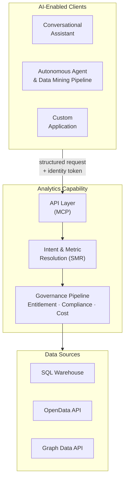

# Overview: Governed Large-Scale Analytics and Data Mining

## The Analytics Intelligence Problem

Large financial services organisations (asset managers, investment banks, insurance firms, regulatory reporting units) operate on analytically complex, regulation-sensitive data. Portfolio managers compare risk-adjusted returns across hundreds of strategies against regulated benchmarks. Risk officers monitor VaR breaches across multiple entities in real time. Compliance analysts prepare LCR and NSFR submissions under Basel III/IV, MiFID II, and SEC Regulation BI. All of these decisions depend on metrics that are not simple aggregations: they are versioned, regulated, formula-specific computations that must be calculated identically across every report, every system, and every user session. Any deviation is an error.

The consequence of this complexity is a structural bottleneck. Business users (portfolio managers, risk officers, compliance analysts) cannot access the data they need without going through a specialist intermediary. Quantitative developers translate business requirements into SQL. Data engineers maintain the pipelines. Analysts mediate between business questions and physical data. This is not a resourcing problem; it is an architectural one. The interface between business intent and governed data is so technically demanding that it requires dedicated expertise at every step. Decision-making slows to the analysts' capacity. Strategic questions queue behind routine reporting. Insight arrives days or weeks after the moment it was needed.

The regulatory dimension sharpens this. In a governed financial services organisation, an analytical result is not just a number: it is an assertion. When a regulator asks how a capital ratio was calculated, the answer must be reproducible, version-controlled, and complete. When a metric definition changes due to a regulatory update, every historical result produced under the prior definition must be identifiable and traceable. When the same metric appears in submissions to two regulators across two jurisdictions, it must resolve to exactly the same formula. These are not quality aspirations. They are legal requirements. An organisation that cannot produce computation provenance for its regulatory submissions is not merely technically incomplete. It is legally exposed.

Large language models make this translation feasible at scale. A portfolio manager can ask "show me portfolio returns versus benchmark for my equity portfolios this quarter" in plain English and receive a governed, role-constrained, auditable analytical result. The AI handles the translation from business intent to structured query. The platform handles everything that must be deterministic. The analyst bottleneck breaks. Regulatory requirements hold.

The most commonly observed first attempt at this capability — connecting an AI directly to a database schema and letting it write queries — works for ad hoc exploration but breaks down in regulated environments: there is no approved metric definition to audit, no reproducible calculation record, and no reliable entitlement enforcement. The [Text-to-SQL appendix](./07-text-to-sql-antipattern.md) examines the structural failure modes and describes the complementary architecture where both approaches coexist.

The AI Analytics Platform is purpose-built for governed large-scale analytics and data mining in regulated environments:

| Enterprise analytical challenge | Platform response |
|---|---|
| Metric consistency across users, reports, and regulatory submissions | Every metric is registered once, approved, and version-controlled — "Portfolio Return" means the same thing in every report, system, and regulatory submission |
| Computation provenance for regulatory review | Full audit record for every result: intent → definitions → entitlements → plan → execution → result |
| Entitlement enforcement for sensitive financial data | Enforced at the analytical layer before any database is contacted — access controls cannot be bypassed by AI query generation |
| Complex regulated formulas (VaR, LCR, BHB attribution) | Defined once in the approved metric registry, computed identically every time — never re-inferred from raw data |
| Metric governance and change management | Every metric definition is version-controlled with an approval workflow and full change history |
| Physical schema protection from AI models | Database schemas are never exposed to AI models — all queries run against approved metric definitions, not raw tables |
| Query cost governance for enterprise warehouses | Query cost is estimated before execution; a circuit breaker blocks queries that exceed cost thresholds |
| Multi-source analytical federation | A single governed interface routes queries across SQL warehouses, APIs, graph databases, and any registered data source |
| Large dataset return to AI agents and data mining pipelines | Large datasets returned to AI agents and pipelines under the same entitlement, audit, and cost controls as analytical queries |

---

## Architectural Model

The **Analytics Engine** is the platform's computation core. Given a precisely specified question — which metrics, which dimensions, which time period, which filters — it always produces the same answer from the same data with the same access permissions in force. No probability, no AI generation, no inference affects the computed values. The computation pipeline contains no AI.

AI has two roles in the analytical pipeline. The first lives in the consuming AI client — the assistant, agent, or application that a user interacts with. It reads the approved metric catalogue, translates a natural-language question into a precise, structured request, and submits it to the Analytics Engine. The second lives inside the Analytics Engine itself: after computation completes, the Narrative Synthesis Engine makes a targeted call to a language model to summarise the structured result in plain text, anchored strictly to computed values. It cannot introduce figures, comparisons, or interpretations not present in the result.

The platform covers three result types, all produced under the same governance pipeline:

- **Governed metric queries** — computed analytical values produced from approved, version-controlled metric definitions, with a display specification and optional plain-language summary
- **Governed data retrieval** — large datasets returned to AI agents and data mining pipelines under the same access controls and audit trail as metric queries
- **Governed drilldown** — hierarchical exploration of a result, preserving the full access and audit context of the originating query

This architecture supports three consumer types. Conversational AI assistants translate natural language to structured requests and call the Analytics Engine. Autonomous agents, scheduled pipelines, and data mining workflows submit structured requests directly — including large paginated dataset requests — with no natural language translation needed. Custom applications call the Analytics Engine directly. The governance pipeline is identical for all three; access controls, audit records, and semantic abstraction apply unconditionally.

The platform's API layer — built on MCP (Model Context Protocol), an open standard for connecting AI systems to tools and data — is the single, governed channel through which all AI systems access the organisation's regulated data and analytics. There is no alternative path. Every AI-initiated request, regardless of its origin or form, enters through this channel, traverses the full governance pipeline, and produces an audit record. This is the architectural guarantee that makes AI-driven analytics safe to operate in a regulated environment.

| It is | It is not |
|-------|-----------|
| A governed computation platform — the same question, data, and access permissions always produce the same answer | An AI product — the Analytics Engine is deterministic; the optional plain-language summary is a constrained post-computation step, not a query generator |
| A governed analytics and data mining platform — metric queries, large dataset retrieval, and drilldown under a unified governance pipeline | A general-purpose SQL interface, BI tool replacement, or user interface |
| An API layer that AI systems call to retrieve governed analytical results and datasets | A system that accepts natural language directly or allows AI to generate arbitrary database queries |
| A governed metric registry — every queryable metric is registered, approved, and version-controlled | A system that infers metric definitions at query time |
| A multi-source federation layer — a single governed interface across SQL warehouses, APIs, graph databases, and any registered data source | A single-database analytics layer |
| An entitlement layer that enforces data access permissions before any query reaches a database | A system where AI has direct access to databases, tables, or raw data |

---

## Design Principles

Ten non-negotiable principles govern all design decisions. Where a proposed feature conflicts with a principle, the principle takes precedence. Where two principles conflict, the resolution is documented in the Principle Interactions table below.

| Principle | What it means |
|-----------|--------------|
| **P1 — Semantic abstraction** | The platform never exposes physical database schemas, table names, or column names to AI models or end users. All AI interaction is mediated through the Metric Registry (SMR). There is no escape hatch to raw data. Unregistered concepts cannot be queried — schema leakage is impossible by design, not by policy. |
| **P2 — Governance before execution** | Every query passes through the full governance pipeline before any database is contacted. Governance is a pre-execution gate, not a post-processing filter. There is no fast path. The sequence — intent, metric resolution, access projection, validation, governance, query planning, execution — is invariant. |
| **P3 — Deterministic metric resolution** | A metric name resolves to exactly one approved definition at a given point in time. "Portfolio Return" means the same thing in every query, every report, and every regulatory submission under the same metric version. Any unintended variation under the same version is a bug; version upgrades are governed changes subject to approval. |
| **P4 — Complete analytical lineage** | This is computation provenance, not data lineage. ETL pipelines and source-to-warehouse flows are a separate concern. This is a complete, queryable record of exactly how the analytics engine used individual data elements to calculate a specific response — every definition, every access decision, every sub-result. |
| **P5 — Role-aware by default** | The platform enforces access controls without opt-in. The recommended configuration is deny-by-default: an unauthenticated or unentitled request is blocked before any analytical processing begins. Access restrictions are injected at the physical query level — they are not applied as a filter after data is retrieved. |
| **P6 — Governed narrative** | Plain-language summaries are anchored exclusively to values present in the computed result. The AI may not introduce figures, comparisons, or interpretations not directly present in the result. Hallucinated financial metrics are a regulatory and reputational risk; the architecture makes them impossible, not merely unlikely. |
| **P7 — Deterministic visualisation** | Chart type selection is governed by a registered set of chart contracts (the Visualisation Ontology) that maps result schemas and intent patterns to chart configurations. The AI does not select chart types. The same analytical pattern always produces the same chart type across users, sessions, and time. |
| **P8 — Explainability at every layer** | Users and compliance functions must be able to understand what was queried, why, and with what results at every layer of the analytical stack. An intent confirmation step shows resolved intent before execution; a lineage inspector exposes every step in human-readable form. Opacity is unacceptable in regulated financial analytics. |
| **P9 — Administrator sovereignty within governance bounds** | Platform administrators have authority over analytical configuration: data sources, metric definitions, access policies, and governance thresholds. Within those bounds, administrators are in control. They may raise thresholds above platform minimums but not below them. There is no bypass mode. |
| **P10 — Deterministic computation, not generation** | Analytical results are computed from approved metric definitions applied to data retrieved from execution backends. They are never generated by an AI model. When an application submits a structured request directly, the natural language translation step is bypassed; access enforcement, governance checks, query planning, and audit recording remain fully active. The same structured request, with the same access permissions and data, always returns the same result. |

### Principle Interactions

Several principles create natural tensions with product requirements. Each tension has a defined resolution.

| Principle | Most common tension | Resolution |
|-----------|--------------------|-----------| 
| P1 (semantic abstraction) vs query expressiveness | Users want to query a concept not yet in the metric registry | Register the concept: a governed addition subject to approval workflow and version control, not an ad hoc inference |
| P2 (governance before execution) vs query latency | Governance adds latency | Governance checks are engineered for sub-100ms latency; access decisions are cached within a session |
| P3 (deterministic resolution) vs metric evolution | Metric definitions change over time | Metric versions are locked at query time; every historical result records which version produced it |
| P4 (complete lineage) vs storage cost | Audit records consume storage | Retention windows are configurable; older records are stored in a compressed format |
| P6 (governed narrative) vs narrative quality | Strict anchoring may reduce fluency | Narrative quality improves with richer result sets; the constraint prevents AI from introducing figures not in the data |
| P7 (deterministic visualisation) vs user chart preferences | Users may prefer a different chart type | Senior analysts may override chart selection; every override is recorded in the audit trail |
| P8 (explainability) vs UX simplicity | Full audit detail may overwhelm casual users | The lineage inspector uses progressive disclosure — detail is available but not forced on every user |
| P9 (administrator sovereignty) vs P2 (governance before execution) | Administrators want to bypass governance for speed or testing | Governance minimums are absolute — there is no bypass mode |

The first tension is productive. When a business concept cannot be queried, the resolution is to register it in the metric registry: a governed addition subject to approval workflow and version control, not an ad hoc inference. That tension is how the platform's analytical vocabulary grows.

The last tension is different in kind. There is no path that bypasses the governance pipeline. Governance minimums are architectural properties of the platform, not configurable thresholds.

---

## The Architecture in Practice

Every consumer type routes through the API layer, traverses the invariant governance sequence, and produces an audit record. No path to execution backends, physical schemas, or raw data exists outside that pipeline. Subsequent chapters describe each component in detail; the principles established here are the reference frame throughout.

### End-to-End Examples

Three queries traced through every stage illustrate what the architecture does in practice. The first is a routine business analytics question. The second is a data mining request from an autonomous agent — showing governed large dataset retrieval rather than metric computation. The third is a regulatory submission request — the same pipeline, but with compliance artifact escalation triggered automatically.

---

#### Example 1 — Portfolio performance (business analytics query)

**1 · Natural language request**
A portfolio manager asks: *"Show me portfolio returns versus benchmark for my equity portfolios this quarter."*

**2 · Intent resolution**
The AI client reads the approved metric catalogue and translates the question into a precise, structured request: compare portfolio return against benchmark return, for equity portfolios, current quarter, broken down by portfolio. No database query is generated at this stage. The AI is resolving intent against the approved analytical vocabulary — not writing queries.

**3 · Metric and entitlement resolution**
The platform resolves both metric identifiers against the Metric Registry. Portfolio return resolves to an approved, version-controlled definition: a value-weighted return formula. Benchmark return resolves via each portfolio's registered default benchmark relationship. The user's identity token is validated and their access permissions are projected, restricting results to portfolios within their coverage scope.

**4 · Query planning and cost governance**
The Query Planner constructs a backend-agnostic plan: two datasets required (positions and benchmarks), joined on the portfolio-to-benchmark relationship. Query cost is estimated before any execution begins. The estimate falls within the user's governance threshold — execution is approved.

**5 · Governed query construction**
The governance layer validates the plan and constructs a precise, warehouse-neutral query: portfolio return calculated as a value-weighted average of daily PnL over the quarter, joined to each portfolio's registered default benchmark, filtered to equity asset class, with access predicates injected at the query level to enforce the user's portfolio scope. No raw database tables or schema details have been exposed at any prior stage.

**6 · Execution and response**
The query is routed to the registered SQL warehouse. The warehouse-specific query is generated internally by the platform adapter, executed, and the result set returned. The Analytics Engine assembles the response: computed values, a display specification for a grouped bar chart, an optional plain-language summary anchored strictly to the result, and a full audit record. The portfolio manager receives a governed, auditable result — not a generated one.

---

#### Example 2 — Fixed income position extraction (data mining query)

**1 · Request**
A quantitative research pipeline submits: *"Extract daily position and PnL data for all fixed income portfolios over the past 12 months for factor model retraining."*

This request originates from an autonomous agent, not a conversational user. The agent submits a structured data retrieval request directly — the natural language translation step is bypassed. All subsequent governance stages remain fully active.

**2 · Dataset resolution**
The agent specifies the registered dataset identifier and retrieval parameters: trailing 12 months, paginated in batches of 10,000 rows. The dataset identifier resolves against the Metric Registry — only registered, approved datasets are retrievable. There is no mechanism for an agent to request an arbitrary database table or raw schema object.

**3 · Field and entitlement resolution**
The registry resolves the dataset to its approved field set: portfolio and instrument identifiers, asset class, daily PnL, market value, duration, and currency. Fields not in the registered set are not returned. The agent's access permissions are projected: results are restricted to portfolios within the agent's authorised scope, and fields exceeding the agent's authorised data classification ceiling are excluded.

**4 · Query planning and cost governance**
The Query Planner constructs a paginated retrieval plan. Cost is estimated across the full result set — not just the first page — and validated against the data extraction governance threshold before any execution begins.

**5 · Governed query construction**
The governance layer constructs a paginated retrieval query: all approved fields from the registered dataset, filtered to fixed income, restricted to the agent's authorised portfolios, ordered for consistent pagination across pages. The query is parameterised for batch execution — each page runs under the same governance controls as the first.

**6 · Execution and response**
The adapter executes each page of the query against the warehouse. Each page is returned to the agent with a continuation token for the next page. An audit record is written for the retrieval, recording exactly which data was returned to which agent under which access permissions. The full extraction — potentially millions of rows across hundreds of pages — completes under continuous governance, with a complete provenance record.

---

#### Example 3 — Regulatory LCR submission (compliance analytics query)

**1 · Natural language request**
A treasury analyst asks: *"Prepare our LCR figures for the Basel III submission."*

**2 · Intent resolution and compliance classification**
The AI client resolves the operation and metric. The platform's intent layer also classifies the stated purpose: the phrase *"for the Basel III submission"* scores highly on the compliance intent classifier, exceeding the configured threshold. Compliance purpose is recorded in the resolved intent and carried through the full pipeline.

**3 · Metric resolution and compliance escalation**
The liquidity coverage ratio metric resolves to its approved registry definition, which carries a compliance-relevant flag set by the metric owner at registration. Both compliance signals are now active — the metric is flagged as compliance-relevant, and the stated intent is classified as compliance-driven. The governance layer escalates automatically to the enhanced compliance artifact tier. No role claim, no manual flag, no special user action is required: the escalation is a runtime consequence of what the metric is and what the query is for.

**4 · Query planning — with cache bypass**
Required datasets: high-quality liquid assets inventory and projected 30-day net cash outflows. Compliance-purpose queries are never served from cache — a fresh computation is required for every regulatory submission. The plan is marked accordingly before any execution begins.

**5 · Governed query construction**
The governance layer constructs a fresh query: liquidity coverage ratio calculated as total high-quality liquid assets divided by projected 30-day net cash outflows, by legal entity, as of the submission date, restricted to the user's authorised entities. Cache bypass is enforced at construction time — this result cannot be retrieved from a prior run.

**6 · Execution and compliance artifacts**
The query executes against the warehouse. On completion, the governance layer writes a regulatory trace record to the compliance-specific audit store — in addition to the standard lineage record — enforces export controls (the result cannot be exported until the complete lineage record exists), and validates the result's data classification against the user's authorised ceiling. The response includes the standard analytical result alongside a compliance block containing the regulatory trace identifier, the artifact set version, and the metric identifiers that triggered escalation. The treasury analyst receives both the governed LCR result and a complete, regulator-ready audit trail — automatically, without any additional steps.

---

- [Chapter 2](./02-personas-and-architecture.md) — Consumer personas and illustrative query journeys
- [Chapter 3](./03-core-capabilities.md) — Component specifications: SMR, SIL, RAPL, SEG, FQP, Visualisation Ontology, NSE, Lineage Store, MCP Capability Layer
- [Chapter 4](./04-integration-and-deployment.md) — Integration, deployment, and platform administration
- [Chapter 5](./05-technical-implementation.md) — Reference implementation stack
- [Chapter 6](./06-success-metrics.md) — Platform and governance success metrics
