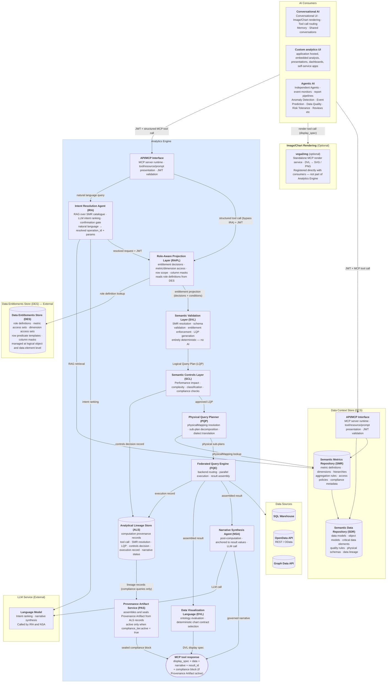
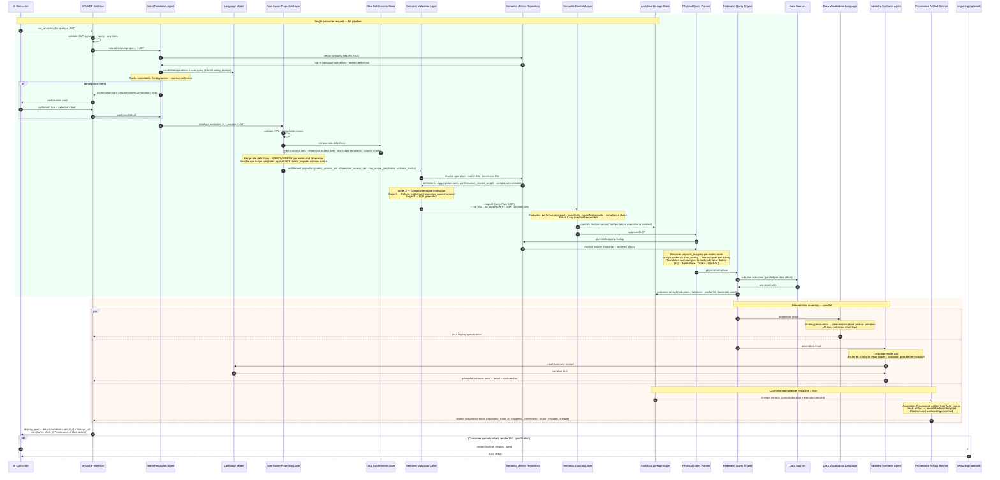
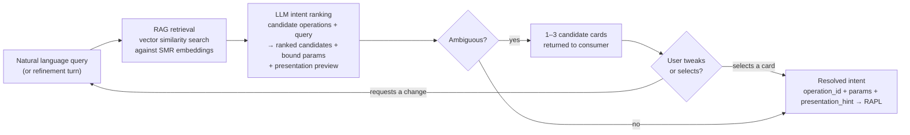
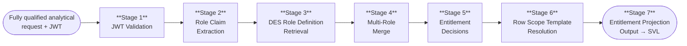
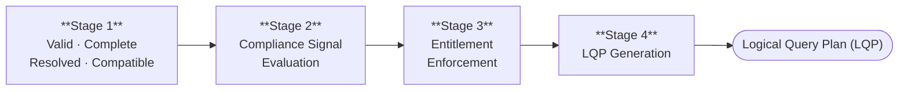
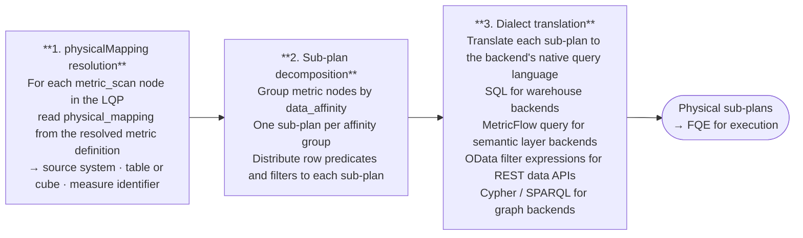
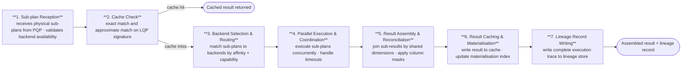

# 1. Core Platform Capabilities

This chapter defines the target logical architecture for the AI Analytics Platform. It covers twelve pipeline components in the order a query will encounter them, using a single portfolio manager query as a running example throughout. Each section describes what a component will do, its controls contract, and its position in the pipeline — with no references to specific technology products or vendor implementations.

Platform roles — who will interact with each component and how — are defined before the component descriptions.


## Platform Roles

The platform will operate across three distinct planes: an **analytical plane** (querying, exploring, and exporting governed data), a **controls plane** (defining, approving, and administering the semantic layer and its access controls), and an **infrastructure plane** (platform deployment, health, and technical configuration).

| Role | Plane | Definition |
|------|-------|------------|
| **Analytical End User** | Analytical | Ask governed analytical questions via natural language; receive role-constrained results without knowledge of data structures or metric identifiers |
| **Power Analyst** | Analytical | Multi-dimensional exploration, governed drilldown, lineage inspection, result export |
| **Data Modeller** | Controls | Will own semantic data definitions in the SDR: logical data elements, object models, business definitions, critical data elements, and physical schema mappings. Will ensure the organisation's data assets are accurately described and structured — the foundational layer on which metric definitions are built |
| **Metrics Modeller** | Controls | Will own semantic metrics and analytics definitions in the SMR: key performance metrics, analytics operations, trend analysis constructs, and insight definitions. Must combine domain knowledge — what does this metric mean in this business context — with modelling precision: how it is calculated, from which sources, under which dimensional hierarchies, and with which access policies |
| **Entitlements Manager** | Controls | Responsible for defining and maintaining the organisation's data entitlement policies: who may perform which actions on which data elements, analytics definitions, and business process metrics. Will configure the metric access sets, dimension access sets, row predicates, and column masks that RAPL enforces at query time |
| **Analytics Governance** | Controls | Overall accountability for the governance, integrity, and outcomes of the analytics platform. Will own SMR registry health, approve semantic definition changes from Metrics Modellers, oversee entitlement policy governance, and be accountable for the quality, accuracy, and completeness of analytical outputs across the organisation. The final authority on what is defined, who can access it, and whether the platform is delivering the right outcomes. Must be in place before go-live — without this role the registry has no approval authority and the platform cannot serve any query |
| **Integration Engineer** | Controls | Will register execution backends, maintain connection configuration, and declare the physical mappings that the Federated Query Engine resolves at execution time. Operates through configuration interfaces only — not the query path |
| **Platform Admin** | Infrastructure | Will be responsible for platform health, deployment, infrastructure-level governance, and technical platform configuration including controls settings, feature flags, and deployment configuration. Will implement the technical policies and settings determined by Analytics Governance. Has no query interface into analytical data |

**Roles are not mutually exclusive.** A single individual may hold multiple roles; the platform will evaluate entitlements from the combined JWT claims present at query time.

The **Data Modeller** and **Metrics Modeller** are the critical pre-conditions for everything downstream. No analytical query can be served against a metric that has not been modelled, registered, and approved. The Data Modeller will establish the foundational data definitions in the SDR — without accurate data structure definitions, metric definitions cannot be built. The Metrics Modeller will build on that foundation to define the analytical layer in the SMR — without registered, approved metric definitions, the controls pipeline, the entitlement layer, the lineage store, and the Data Visualization Language (DVL) have nothing to operate on. Analytics Governance will hold final approval authority over both layers.

### Role × Feature Access

| Feature | End User | Power Analyst | Data Modeller | Metrics Modeller | Entitlements Mgr | Analytics Governance | Integration Eng | Platform Admin |
|---------|:--------:|:-------------:|:-------------:|:----------------:|:----------------:|:--------------------:|:---------------:|:--------------:|
| Natural language query | ✓ | ✓ | | ✓ | | ✓ | | |
| Role-aware results | ✓ | ✓ | | ✓ | | ✓ | | |
| Governed drilldown | | ✓ | | ✓ | | ✓ | | |
| Lineage inspector | | ✓ | ✓ | ✓ | | ✓ | | |
| Result export | | ✓ | | ✓ | | ✓ | | |
| Provenance artifacts | ✓ | ✓ | | ✓ | | ✓ | | |
| SMR browsing | | ✓ | ✓ | ✓ | ✓ | ✓ | | |
| SDR management | | | ✓ | | | | | |
| Metric definition authoring | | | | ✓ | | | | |
| Metric definition approval | | | | | | ✓ | | |
| Dimension & hierarchy management | | | | ✓ | | ✓ | | |
| Entitlement policy management | | | | | ✓ | ✓ | | |
| Backend registration | | | | | | | ✓ | |
| Controls configuration | | | | | | | | ✓ |
| Audit trail | | | | | ✓ | ✓ | ✓ | ✓ |
| Platform infrastructure | | | | | | | | ✓ |


## Architecture and Request Flow

The platform will expose its capability through three consumption modes: direct API access (a host-built custom analytics UI calling the MCP Capability Layer with a structured tool invocation); conversational backend access (the AI Chat Platform calling the Analytics Platform as a tool provider); and agentic access (scheduled agents, event monitors, and automated report pipelines calling the MCP Capability Layer with machine-issued JWTs). All three modes will share a single entry point and a single controls pipeline; consumption mode will affect only the caller's interaction pattern, not the trust model applied.

### Architecture Diagram



The Analytics Engine will be a single MCP server exposing three analytical tools (`run_analytics`, `list_operations`, `drilldown`) through a single MCP Capability Layer endpoint. It will contain exactly two bounded AI steps: the Intent Resolution Agent (IRA), which will identify the right governed operation from the user's natural language query, and the Narrative Synthesis Agent (NSA), which will summarise the computed result in plain text after execution. All stages between them — SVL, RAPL, SCL, PQP, and FQE — will be entirely deterministic. The same resolved intent, access permissions, and data will always produce the same query plan, the same execution, and the same result.

For conversational consumers, the user's natural language query will be forwarded directly to the Analytics Engine. Intent resolution — selecting the right governed operation and binding parameters — will happen inside the engine's IRA. The Analytics Engine will return the display specification, structured data, and governed narrative; the AI Chat Platform will render the result. Structured API consumers (agents, custom UIs) may call `run_analytics` with an explicit `operation_id` and `params`, bypassing the IRA entirely.

The `vega2img` service will sit outside the Analytics Platform boundary as an optional, independently registered MCP render service. Consumers that cannot natively render the DVL display specification will register `vega2img` directly and call it as a separate tool invocation, passing the `display_spec` from the `run_analytics` response.


### Request Flow



The computation pipeline (SVL → RAPL → SCL → PQP → FQE) will be entirely deterministic and will contain no AI. The Analytical Lineage Store will receive two writes per query — a controls decision record before the PQP is invoked and a full execution record after — ensuring the audit trail is complete regardless of whether execution succeeds.


**Running example:** This query is traced through every component below — each section's Example shows the same request at the next stage of the pipeline.

```
"Show me portfolio returns versus benchmark for my equity portfolios this quarter."
```


## AI Consumers

The Analytics Engine will be accessed by three consumer types: a conversational AI platform (which will mediate between a user and the governed query pipeline), autonomous agents and pipelines (which will call the MCP layer directly with structured requests), and custom applications (which will call the MCP layer with host-issued tokens). Intent resolution — identifying which governed operation and parameters match the user's question — will be performed inside the Analytics Engine by the IRA, not by the consumer.

**Natural language path.** When a user asks an analytical question, the consumer will forward the natural language query and the user's JWT to the Analytics Engine. The engine's IRA will handle operation selection, parameter binding, and — if intent is ambiguous — will return a confirmation card before proceeding to execution.

**Structured path.** Consumers that construct explicit `operation_id` + `params` payloads (agentic pipelines, custom analytics UIs, integration tests) will call `run_analytics` with structured arguments directly. The `list_operations` tool will return the entitled operation catalogue for consumers that build their own operation selection UI. Structured calls will bypass the IRA and route directly to the RAPL.

**Response assembly.** The conversation engine will render the DVL display specification inline. The `narrative` object in the response will contain the governed summary produced by the NSA. The `result_id` will be retained for any follow-up `drilldown` call or lineage inspection.

### Example

The user's question will be relayed by the conversational AI directly to the Analytics Engine with the user's JWT. The consumer will not interpret, translate, or structure the query — it will forward it as-is.

```json
POST /v1/mcp
Authorization: Bearer <host-issued-jwt>

{
  "jsonrpc": "2.0",
  "id":      "req-8a3f2c",
  "method":  "tools/call",
  "params": {
    "name": "run_analytics",
    "arguments": {
      "query": "Show me portfolio returns versus benchmark for my equity portfolios this quarter."
    }
  }
}
```

The Analytics Engine will process the request end-to-end and return a structured result. The conversation engine will render the grouped bar chart from the DVL display specification and surface the governed narrative as the assistant's reply.


## MCP Capability Layer (MCP)

> **Governing principles:** [P2 — Controls before execution](./00-overview.md#design-principles) · [P5 — Role-aware by default](./00-overview.md#design-principles)

The MCP Capability Layer will expose the platform's governed analytical operations to AI orchestrators via MCP Streamable HTTP transport. Each capability will be a bounded, named operation with a typed input schema, a governed execution path — at minimum through role-aware projection and the federated query engine, and through the full pipeline (RAPL → SVL → SCL → FQE) for metric and analytical operations — and a typed output contract. AI agents will interact with capabilities, not databases. There will be no privileged API path — AI agents will receive the same controls-validated results as human users.

### Tool Catalogue

The Analytics Engine will expose three tools. All analytical operations will be SMR-catalogue driven — the code will be the execution engine, not the operation registry. The SMR will own every operation definition: what parameters it needs, what metrics and dimensions it supports, and how deeply it runs through the pipeline via its `execution_profile`.

**`run_analytics(operation_id: str, params: dict, jwt: str)`** — Executes any SMR-registered operation. The operation's `execution_profile` in the SMR will determine which pipeline stages run.

**`list_operations(domain: str | None, jwt: str)`** — Returns the SMR operation catalogue with operation IDs, display names, required parameters, supported metrics/dimensions, and execution profiles. Only operations the authenticated user is entitled to execute will be returned.

**`drilldown(result_id: str, hierarchy: str, selected_value: str | None, jwt: str)`** — Navigates into a dimension hierarchy from a prior result. All filters, role predicates, and entitlement context from the original result will be preserved.

### Execution Profiles

Each SMR operation will carry an `execution_profile` defined in its `analytical_operation` entry in the SMR catalogue. This will tell the pipeline executor which stages to invoke. No execution depth will be hardcoded in the MCP layer — it will always be determined by the SMR catalogue.

| Profile | Pipeline stages |
|---|---|
| `data_retrieval` | Auth → IRA → RAPL → FQE → Lineage |
| `metric_query` | Auth → IRA → RAPL → SVL → SCL → FQE → Lineage |
| `full_analytical` | Auth → IRA → RAPL → SVL → SCL → PQP → FQE → DVL + NSA + PAS → Lineage |

### Intent Confirmation Cards

When intent is ambiguous, or when `requiresIntentConfirmation: true` is set on the operation, the IRA will return candidate cards before executing any query. The cards will be returned as the MCP response body in place of the analytical result. The consumer will render all candidates simultaneously; the user selects one, optionally refines it through the chat experience, then confirms to proceed.

Each card will include the resolved operation and parameters alongside a **presentation preview** — the anticipated chart type and axis structure — so the user can verify both what will be queried and how the result will be presented before execution commits.

The response payload will use a `candidates[]` array. A single-candidate response (governance override) will use the same structure with one entry:

```json
{
  "intent_session_id": "ira-sess-20260605-wk4n",
  "candidates": [
    {
      "rank": 1,
      "confidence": 0.91,
      "operation_id":    "compare_portfolios",
      "operation_label": "Compare Portfolios",
      "resolved_metrics":    ["portfolio_return", "benchmark_return"],
      "resolved_dimensions": ["portfolio_id", "asset_class"],
      "time_period":    "quarter_to_date",
      "filters":        [{ "field": "asset_class", "operator": "eq", "value": "EQUITY" }],
      "estimated_performance_impact": 620,
      "classification": "INTERNAL",
      "presentation_hint": {
        "chart_type":        "bar",
        "primary_dimension": "portfolio_id",
        "measures":          ["portfolio_return", "benchmark_return"],
        "series_by":         "metric"
      }
    },
    {
      "rank": 2,
      "confidence": 0.67,
      "operation_id":    "portfolio_summary",
      "operation_label": "Portfolio Summary",
      "resolved_metrics":    ["portfolio_return", "portfolio_nav"],
      "resolved_dimensions": ["portfolio_id"],
      "time_period":    "quarter_to_date",
      "filters":        [],
      "estimated_performance_impact": 280,
      "classification": "INTERNAL",
      "presentation_hint": {
        "chart_type":        "table",
        "primary_dimension": "portfolio_id",
        "measures":          ["portfolio_return", "portfolio_nav"],
        "series_by":         null
      }
    }
  ],
  "action": "select or refine — re-submit with selected_candidate: <index> or a refinement message"
}
```

**Selecting a candidate:** re-submit `run_analytics` with `"selected_candidate": 0` (0-based index) to confirm the chosen interpretation and proceed to execution.

**Refining through chat:** send a natural language adjustment — the IRA will update the leading candidate's parameters and return a revised card set. Refinement turns will be bounded by `intentRefinementMaxTurns` (default 5) and recorded in the lineage record's `intent_session` field.

### Capability Governance

Every capability invocation will pass through the full controls pipeline: input schema validation → capability availability check (feature flags and role entitlements) → Role-Aware Projection → Semantic Validation Layer → Semantic Controls Layer → FQE → result assembly → lineage record write. A capability not enabled by a feature flag or accessible to the user's role will appear as `available: false` with a reason.

### Example

A structured `run_analytics` tool call will arrive from the AI Chat Platform. The MCP Capability Layer will validate the JWT signature, confirm the token has not expired, and extract the claims. For a natural language query it will route to the Intent Resolution Agent; for a structured call it will route directly to the Role-Aware Projection Layer. The MCP Capability Layer will not interpret the parameters or make any analytical decisions; it will validate, route, and wait.


## Intent Resolution Agent (IRA)

> **Governing principles:** [P2 — Controls before execution](./00-overview.md#design-principles) · [P10 — Deterministic computation, not generation](./00-overview.md#design-principles)

The Intent Resolution Agent will be the AI component responsible for translating a natural language query into a structured, validated operation request. It will be the only AI step in the pre-computation pipeline. Its output — a resolved `operation_id` and bound `params` — will be handed, with the caller's JWT, to the Role-Aware Projection Layer for entitlement decisions before the Semantic Validation Layer compiles the plan.

The IRA will not interpret data, make recommendations, or produce output visible to the end user. Its sole function will be operation selection and parameter binding. Once it has resolved intent, it will hand off a deterministic structured request and play no further role in the pipeline.

### Intent Resolution Pipeline



### RAG Retrieval

At registration time, each `analytical_operation` and `analytical_metric` definition in the SMR will be embedded: the operation name, description, example phrasings, required parameters, and associated metric descriptions will be concatenated and encoded as a dense vector stored alongside the definition.

When a query arrives, the IRA will encode the natural language input and perform a vector similarity search against the SMR operation embeddings. The top-K candidate operations and their associated metric definitions will be retrieved. Only these candidates — not the full catalogue — will be injected into the LLM ranking prompt.

### LLM Intent Ranking

The LLM will receive the top-K candidates and the user's query. It will rank candidates, bind parameters, and score confidence for each. It will also derive a `presentation_hint` for each candidate — the likely chart type and primary axes — based on the operation's result shape and the SMR operation definition. This preview will be included in every candidate card returned to the consumer.

If the top candidate's confidence score exceeds `intentConfidenceThreshold` (configurable, default 0.75) and leads the second candidate by more than `intentConfidenceBand` (configurable, default 0.1), the IRA will proceed directly to the RAPL with no card shown. Otherwise, up to three ranked candidate cards will be returned for the user to select or refine.

The LLM call will be constrained: the prompt will contain only the candidate operation definitions and the user's query. The LLM will have no access to result data, SMR governance metadata, or user entitlements — those will be enforced downstream by SVL and RAPL.

### Multi-Candidate Selection

When intent is ambiguous, the IRA will return up to three ranked candidate cards in a single `candidates[]` array. The number of candidates returned will be determined by confidence clustering:

| Situation | Cards shown |
|---|---|
| Top candidate above threshold, clear leader | 0 — proceeds directly to RAPL |
| Top candidate below threshold, or top two within confidence band | 2 candidates |
| Top three candidates within confidence band | 3 candidates |
| `requiresIntentConfirmation: true` on the operation (governance override) | 1 candidate — approval required regardless of confidence |

The consumer will re-submit with `"selected_candidate": <index>` (0-based) to indicate which card the user chose. The IRA will then forward the selected candidate's resolved intent to the RAPL.

### Conversational Refinement

After candidate cards are presented, the user may respond with a natural language adjustment rather than selecting a card. The IRA will treat the refinement as a constrained update: it will re-run the LLM with the selected or leading candidate as context and apply the requested changes to that candidate's parameters. An updated card set will be returned.

The loop will be bounded: a maximum number of refinement turns is configurable (`intentRefinementMaxTurns`, default 5). After the limit, the IRA will require the user to select from the current candidate set or start a new query. No data will be accessed and no query will be executed during the refinement loop — it will be entirely within the IRA's pre-execution scope. Each refinement turn will be recorded in the session context and included in the lineage record's `intent_session` field.

### Presentation Preview

Each candidate card will include a `presentation_hint` block derived from the operation's result shape and the SMR operation definition.

| Field | Description |
|---|---|
| `chart_type` | Predicted chart type — `bar`, `line`, `heatmap`, `scatter`, `table` |
| `primary_dimension` | The field that will appear on the X axis or as the primary grouping |
| `measures` | Metric fields that will appear as Y axis values or colour encoding |
| `series_by` | Dimension used to create series or colour bands (if applicable) |

The `presentation_hint` will be a pre-execution estimate. The DVL will produce the authoritative display specification after execution, based on the actual result shape. The hint is informational only.

### Structured API Path

Consumers that construct explicit `operation_id` + `params` (agentic pipelines, custom analytics UIs, integration tests) will call `run_analytics` with a structured payload directly. MCP will route these calls directly to the RAPL, bypassing the IRA. The `list_operations` tool will return the full entitled operation catalogue for consumers that build their own operation selection UI.

### Example

Running example — portfolio manager asks:

> "Show me portfolio returns versus benchmark for my equity portfolios this quarter."

The IRA will encode this query and retrieve the top-3 candidate operations from the SMR: `compare_portfolios` (score 0.91), `portfolio_summary` (score 0.67), `benchmark_attribution` (score 0.61). The top candidate exceeds the confidence threshold and leads by more than 0.1. The LLM will bind the resolved intent and derive a presentation preview:

<table><tr><td>

```json
{
  "operation_id": "compare_portfolios",
  "params": {
    "portfolio_ids":  ["GLOB_EQ_OPP", "UK_CORE_INC"],
    "metrics":        ["portfolio_return", "benchmark_return"],
    "time_period":    "quarter_to_date",
    "filters": [{ "dimension": "asset_class", "operator": "eq", "value": "EQUITY" }]
  },
  "presentation_hint": {
    "chart_type":        "bar",
    "primary_dimension": "portfolio_id",
    "measures":          ["portfolio_return", "benchmark_return"],
    "series_by":         "metric"
  }
}
```

</td><td>


</td></tr></table>

Confidence is 0.91 — above threshold, no candidate cards shown. Resolved intent will be forwarded to the RAPL.


## Semantic Metrics Repository (SMR)

> **Governing principles:** [P1 — Semantic abstraction](./00-overview.md#design-principles) · [P3 — Deterministic metric resolution](./00-overview.md#design-principles) · [P9 — Administrator sovereignty](./00-overview.md#design-principles)

The Semantic Metrics Repository (SMR) will be the governing catalogue of every analytical concept resolvable on the platform. Before any query can be planned or executed, every identifier in that query (metrics, dimensions, hierarchies) must be registered in the SMR. This will be an architectural constraint, not a policy: the Semantic Validation Layer will reject any identifier not present in the SMR, and nothing will be queryable that is not registered.

### Concept Types

The SMR will hold three types of JSON metadata definition:

| Definition type | Description |
|---|---|
| **`analytical_metric`** | Governed metric definition — formula, aggregation, `data_affinity`, `physical_mapping`, `required_dimensions`, `performance_impact_weight`, `classification_level`, `compliance_relevant`, `regulatory_framework` |
| **`analytical_dimension`** | Governed dimension definition — `data_affinity`, `physical_mapping`, enumerated values or `hierarchical` flag, `hierarchy_levels` |
| **`analytical_operation`** | Governed operation definition — `execution_profile`, `required_params`, `supported_metrics`, `supported_dimensions`, `default_visualization` |

### Metric Definition Schema

Every metric in the SMR will conform to the following schema. This is the authoritative reference for metric registration and validation:

```json
{
  "id":          "portfolio_return",
  "version":     "2.1.0",
  "label":       "Portfolio Return",
  "description": "Total return of a portfolio over the specified period, net of fees, expressed as a percentage.",
  "formula":     "(end_market_value - start_market_value + cash_flows) / start_market_value",
  "compliance_relevant": false,
  "regulatory_framework": [],
  "unit":        "percentage",
  "aggregation": {
    "default":     "value_weighted_average",
    "allowed":     ["value_weighted_average", "equal_weighted_average", "sum"],
    "granularity": ["daily", "monthly", "quarterly", "annual", "since_inception"]
  },
  "dimensions": {
    "required": ["portfolio", "date"],
    "optional": ["asset_class", "currency", "benchmark"]
  },
  "data": {
    "domain":          "portfolio",
    "sub_domain":      "performance",
    "source_tables":   ["fact_portfolio_daily", "dim_portfolio"],
    "refresh_cadence": "daily",
    "latency_sla":     "T+1"
  },
  "governance": {
    "owner":          "head_of_performance_analytics",
    "steward":        "performance_analytics_team",
    "classification": "INTERNAL",
    "approved":       true,
    "approved_by":    "cdo_office",
    "approved_at":    "2025-11-15T09:00:00Z",
    "effective_from": "2025-11-15",
    "deprecated":     false
  },
  "lineage": {
    "upstream_metrics":   [],
    "upstream_sources":   ["positions_service", "pricing_service", "cash_flow_service"],
    "downstream_metrics": ["active_return", "information_ratio"]
  },
  "access": {
    "roles":  ["portfolio_manager", "risk_officer", "analytics_governance"],
    "public": false
  },
  "display": {
    "format":               "percentage",
    "decimals":             2,
    "sign_convention":      "positive_is_gain",
    "benchmark_comparison": true
  }
}
```

All metric definitions will pass through a governance review and approval process before they are resolvable on the platform. A metric authored by a Metrics Modeller will not be queryable until it has been reviewed and approved by Analytics Governance.

### Formula Language

The SMR formula language will express metric computation logic in terms of other registered metrics or canonical data source identifiers — never physical column names. This will decouple metric definitions from backend schema changes: renaming a physical table or column will require only a mapping update, not a metric definition change. The formula language will support arithmetic composition, conditional expressions, safe division with null protection, time-windowed aggregations, and filtered sub-aggregations.

### SMR Authoring and Discovery

The SMR and SDR will be independent stores, both housed within the Data Context Store (DCS). The SMR will be a separate store for metric definitions; it will reference the SDR's data definitions but will not extend or depend on it structurally. The DCS will be the external container that holds both.

Metric authoring will use the DCS's native versioning and approval workflow. Metrics Modellers will author `analytical_metric`, `analytical_dimension`, and `analytical_operation` JSON metadata definitions through the DCS authoring interface; Analytics Governance will approve them before they become resolvable.

**Discovery** — AI models and agents will discover available operations by calling the `list_operations` MCP tool. `list_operations` will return operation IDs, display names, required parameters, supported metrics, supported dimensions, and execution profiles for all approved operations within the caller's entitlement scope. There will be no `smr://` MCP resource URIs and no separate `list_metrics`, `get_metric_definition`, `propose_metric`, or `approve_metric` MCP tools.

The Analytics Engine will query the SMR directly at request time — the SVL will resolve metric and operation definitions, and the FQE will resolve physical mappings. The DCS will also expose its own external API and MCP interface through which consumers and tooling can independently browse, inspect, and discover SMR metric definitions and SDR data definitions without going through the Analytics Engine.

### Example

When the request reaches the SVL, the SMR will be the catalogue every identifier is resolved against. The SVL will ask the SMR to resolve the `compare_portfolios` operation, then resolve `portfolio_return` and `benchmark_return` as `analytical_metric` documents. The SMR will confirm both are approved for the `portfolio_manager` role and return their definitions, including `data_affinity` (`portfolio`), `required_dimensions` (`portfolio_id`, `time_period`), and `aggregation` (`value_weighted_average`). `asset_class` will resolve as an approved `analytical_dimension` document with an approved filter operator (`eq`). If either metric document were absent or not in `"status": "approved"` state, the SVL would return `METRIC_NOT_FOUND` and the pipeline would stop.


## Role-Aware Projection Layer (RAPL)

> **Governing principles:** [P5 — Role-aware by default](./00-overview.md#design-principles) · [P1 — Semantic abstraction](./00-overview.md#design-principles)

The platform's scope covers both analytical querying and data mining. The Role-Aware Projection Layer will be the single point where every request is assessed against five entitlement dimensions — data access, metrics access, dimension access, row scope access, and result set column masking — before any query plan is compiled. Entitlement will be conferred by role membership against governed concepts in the DES, not by database permissions.

Entitlement policies will be managed in the **Data Entitlements Store (DES)** — an independent external component. Policies will be defined at the **logical object and data element level**: granting or restricting access to named metrics, dimensions, and data elements as governed concepts, never to physical tables, schemas, or column names. This will keep entitlements stable as the underlying physical implementation changes and comprehensible to governance teams with no visibility into the data platform's internals.

Projection will not be optional and will not be bypassable. Every request will pass through RAPL, sitting between the IRA and the SVL. The resulting entitlement projection will be passed to the SVL, which will enforce it before any query plan is compiled or any backend is contacted.

### Restriction Types

RAPL will make five categories of entitlement decision. Every decision will be made inside RAPL (Stage 5 of the projection lifecycle); the resulting conditions will be carried in the entitlement projection and enforced downstream — data and metric/dimension removals by the SVL during plan generation, row scope and column restrictions by the FQE at execution and result assembly.

| Restriction type | Decided in RAPL | Enforced at |
|---|---|---|
| **Data access** | Stage 5 — data domain or classification ceiling not within the user's entitled scope is **DENIED** | SVL Stage 3 — request rejected before plan generation |
| **Metrics access** | Stage 5 — requested metric not in the entitled access set is **DENIED** | SVL Stage 3 — denied metric removed from plan; request rejected if a required metric is lost |
| **Dimension access** | Stage 5 — requested dimension not in the entitled access set is **DENIED** | SVL Stage 3 — denied dimension removed from plan |
| **Row scope access** | Stage 5–6 — population scope decided and resolved against JWT claims | FQE physical query generation — injected as a scope node |
| **Result set column masking** | Stage 5 — masked columns and masking mode registered | FQE result assembly — value replaced, redacted, or excluded |

### Projection Lifecycle



**Stage 1 — JWT Validation.** Validate the inbound JWT: signature, expiry, and org claim. **DENY** — request rejected immediately if any check fails. No further processing occurs on an invalid token.

**Stage 2 — Role Claim Extraction.** Extract the user's analytical role claims from the validated JWT using the configured `roleClaimField`. **DENY** — if no valid analytical role claims are present the request is rejected.

**Stage 3 — DES Role Definition Retrieval.** Look up the full role definition for each extracted role from the Data Entitlements Store (DES). Each definition declares the data access scope, metric access set, dimension access set, row scope templates, column masks, and classification ceiling for that role. **DENY** — if no valid role definitions are retrieved the request is rejected.

**Stage 4 — Multi-Role Merge.** Merge all retrieved role definitions into a single entitlement profile. Data, metric, and dimension access: union. Row scope: intersection (most restrictive wins). Column masks: union (masked by any role = masked for the user). No APPROVE/DENY decision is made here — this stage produces the profile against which all decisions are made in Stage 5.

**Stage 5 — Entitlement Decisions.** Five classes of decision will be made against the merged entitlement profile:

- **Data access** — the requested data domain and classification level will be checked against the user's entitled data access scope and classification ceiling. If either check fails the request will be **DENIED** (`DATA_NOT_ENTITLED`) before metric evaluation begins.
- **Metrics access** — each requested metric will be **APPROVED** or **DENIED** (`METRIC_NOT_ENTITLED`). Approval may be with or without dimensional constraints. If any required metric is denied the request will be rejected.
- **Dimension access** — each requested dimension will be **APPROVED** or **DENIED** (`DIMENSION_NOT_ENTITLED`). Entitlement will be evaluated per metric-dimension combination.
- **Row scope access** — each approved metric will carry an **APPROVED with population scope** decision: the row scope that defines which population of data the user is permitted to see.
- **Result set column masking** — each approved metric will carry an **APPROVED with column restrictions** decision where applicable.

No approved metric will reach the output without its full set of data access clearance, population scope, and column visibility conditions attached.

**Stage 6 — Row Scope Resolution.** Resolve the row scope templates from Stage 5 against the user's JWT claims. `{{user.claim_name}}` syntax will be expanded to concrete values at query time. **DENY** — if a required JWT claim for scope resolution is missing the request will be rejected.

**Stage 7 — Entitlement Projection Output.** Produce the completed entitlement projection: approved `data_access_scope`, approved `metric_access_set` (each with permitted aggregations and dimensional constraints), approved `dimension_access_set`, resolved `row_scope[]`, registered `column_masks[]`, and `classification_ceiling`. Write the full projection record to the ALS. Pass to SVL for Stage 3 enforcement.

### Multi-Role Merge Strategy

| Entitlement type | Merge strategy | Rationale |
|---|---|---|
| Data access | Union | Entitlement via any role is sufficient |
| Metrics access | Union | Entitlement via any role is sufficient |
| Dimension access | Union | Entitlement via any role is sufficient |
| Row scope access | Intersection (AND) | All scope conditions must be satisfied — most restrictive wins |
| Result set column masking | Union | A column masked by any role is masked for the user |

### Column Masking Modes

| Mode | Column representation in result |
|---|---|
| `null_replacement` | Column value replaced with `null` |
| `redacted_label` | Column value replaced with `"[REDACTED]"` |
| `excluded` | Column omitted entirely from the result schema |

### Entitlement Audit

Every entitlement decision — data access clearance, approved and denied metrics, approved dimensions, row scope applied, and column masking registered — will be recorded in the Analytical Lineage Store (ALS) as part of the projection record. The record will capture the roles active at query time, each decision's APPROVE or DENY outcome and the basis for it, the resolved row scope for each approved metric, and the column restrictions in force.

### Example

The RAPL will read the `portfolio_scope` claim from the JWT and resolve it against the `portfolio_manager` role's row scope template (`portfolio_id IN ({{user.portfolio_scope}})`):

```json
{
  "data_access_scope":      "domain:portfolio · classification:INTERNAL",
  "row_scope": [
    { "dimension": "portfolio_id", "operator": "in",
      "values": ["GLOB_EQ_OPP", "UK_CORE_INC", "ASIA_PAC_GRW", "EUR_BAL_INC"] }
  ],
  "column_masks":           [],
  "classification_ceiling": "INTERNAL",
  "projection_basis":       "jwt_claim:portfolio_scope"
}
```

No column masks will apply — the `portfolio_manager` role has no masking rules for performance metrics. The row scope will be injected into the LQP as node `n3`. Any portfolio outside the four listed IDs will be excluded at the physical query level. The entitlement projection will be handed to the SVL.


## Semantic Validation Layer (SVL)

> **Governing principles:** [P2 — Controls before execution](./00-overview.md#design-principles) · [P10 — Deterministic computation, not generation](./00-overview.md#design-principles)

The Semantic Validation Layer will receive the entitlement projection from the Role-Aware Projection Layer together with the fully qualified analytical request — either from a structured API caller or as the resolved output of the Intent Resolution Agent — and will produce a validated, platform-agnostic Logical Query Plan (LQP). It will be entirely deterministic: no AI model will run inside it. Its purpose will be to: (1) resolve the operation from the SMR catalogue, (2) validate `params` against the operation's `required_params` schema, (3) resolve metric IDs within `params` against `analytical_metric` metadata definitions, (4) enforce the entitlement projection computed by RAPL — including metric and dimension scope, row scope nodes, and column masking directives, (5) build the LQP. The LQP will carry all entitlement decisions — including column masking directives — as first-class plan elements, so the Physical Query Planner can pass them through to the FQE for enforcement during result assembly. The output will contain no backend references, no SQL, and no physical schema identifiers: only analytical operations and entitlement directives expressed against SMR-registered concepts.

### Four-Stage Validation Pipeline



**Stage 1 — Valid, Complete, Resolved & Compatible.** The request must be well-formed, fully populated, and resolvable against the SMR before any further processing occurs. Required fields must be present and correctly typed. The `operation_id` must resolve to an approved `analytical_operation` metadata definition. Every metric ID must resolve to an approved `analytical_metric` metadata definition and every dimension ID to an approved `analytical_dimension` metadata definition. Params must conform to the operation's `required_params` schema. Cross-entity compatibility will be validated in the same pass. Anything unregistered, unapproved, missing, or incompatible will be rejected here — the pipeline will not proceed.

**Stage 2 — Compliance Signal Evaluation.** The SVL will combine two independent signals to determine the compliance disposition of the request. Signal 1 will be the IRA's compliance intent score — derived from the user's natural language query and forwarded as part of the resolved request. Signal 2 will be the `compliance_relevant` flag on each resolved `analytical_metric` metadata definition. If both signals are active the request will be escalated to the full compliance tier and the Provenance Artifact Service will be invoked. If the user's stated intent is compliance-driven but the requested metrics are not registered as compliance-relevant, the SVL will reject the request.

**Stage 3 — Entitlement Enforcement.** The SVL will apply the entitlement projection computed by the Role-Aware Projection Layer. Metrics and dimensions will be filtered to the caller's entitled scope. Row scope resolved by RAPL will be injected as scope filter nodes in the plan. Column masking directives from RAPL will be embedded in the LQP as a top-level `column_masks` array — carrying field name, masking mode, and the basis role for each masked column — so the Physical Query Planner can include them in every physical sub-plan it passes to the FQE. Any metric or dimension RAPL did not approve will be removed; if removal leaves the request without its required metrics the request will be rejected with an entitlement error rather than returning a partial result.

**Stage 4 — LQP Generation.** The validated, projected, and compliance-classified request will be compiled into a platform-agnostic Logical Query Plan — a directed acyclic graph of analytical operations expressed entirely in SMR-registered concepts. No SQL, no backend references, and no physical schema identifiers will appear in the LQP. Data affinity hints will be assigned per metric node to guide the Physical Query Planner's sub-plan decomposition. Column masking directives from Stage 3 will be included as a top-level `column_masks` array on the plan. Result cardinality and execution performance impact will be estimated and attached to the plan for the Semantic Controls Layer to evaluate before execution is authorised.

### Example

The SVL will receive the fully qualified analytical request together with RAPL's entitlement projection and pass them through all four stages. The output will be the Logical Query Plan passed to the Semantic Controls Layer:

```json
{
  "lqp_id":    "lqp-20260518-093243-r9xq",
  "intent_id": "int-20260518-093241-pk7m",
  "org_id": "acme-wealth",
  "nodes": [
    { "id": "n1", "type": "metric_scan",
      "metrics": ["portfolio_return", "benchmark_return"],
      "dimensions": ["portfolio_id"],
      "time_period": { "granularity": "quarterly", "anchor": "current" } },
    { "id": "n2", "type": "filter", "input": "n1",
      "predicate": { "field": "asset_class", "operator": "eq", "value": "EQUITY" } },
    { "id": "n3", "type": "row_scope", "input": "n2",
      "scope": { "field": "portfolio_id", "operator": "in",
                 "values": ["GLOB_EQ_OPP", "UK_CORE_INC", "ASIA_PAC_GRW", "EUR_BAL_INC"] } },
    { "id": "n4", "type": "sort", "input": "n3",
      "field": "portfolio_return", "direction": "desc" }
  ],
  "output_node":             "n4",
  "column_masks":            [],
  "estimated_performance_impact": 620,
  "classification_required":      "INTERNAL"
}
```

Node `n3` is the RAPL row scope — a first-class plan node, not a post-execution filter. `column_masks` is empty here because the `portfolio_manager` role carries no masking rules for performance metrics; for roles that do, the array would contain entries of the form `{ "field": "counterparty_id", "mode": "redacted_label", "basis_role": "risk_viewer" }`.


## Semantic Controls Layer (SCL)

> **Governing principles:** [P2 — Controls before execution](./00-overview.md#design-principles) · [P8 — Explainability at every layer](./00-overview.md#design-principles) · [P9 — Administrator sovereignty](./00-overview.md#design-principles)

The Semantic Controls Layer (SCL) will apply a suite of performance impact thresholds, complexity limits, and compliance classification checks to every query before it is released to the Federated Query Engine. It will be the final gate before physical execution. Controls will apply to every query without exception. There will be no privileged user, trusted agent, or internal path that bypasses SCL checks.

### Controls Pipeline

```mermaid
flowchart LR
    START(["Validated LQP\npost role-aware projection"])
    S1["**1. Performance impact assessment**\nEstimate execution performance impact units from LQP metadata\ncardinality estimate × engine performance tier × complexity factor"]
    S2["**2. Performance impact threshold check**\nCompare estimated performance impact to maxPerformanceImpact\nBLOCK if exceeded → user prompted to narrow scope"]
    S3["**3. Complexity limit check**\nEvaluate LQP node count, join depth, sub-plan count\nBLOCK if exceeds complexity threshold"]
    S4["**4. Classification gate**\nRetrieve data.classification from SMR per metric\nBLOCK if any metric classification is in blocked list"]
    S5["**5. Compliance check**\nIf any resolved metric has compliance_relevant: true:\nevaluate two-signal Provenance Artifact trigger\napply framework-specific validation rules from metric regulatory_framework tags"]
    S6["**6. Concurrency limit check**\nCount active queries for this user\nBLOCK with wait if exceeds maxConcurrentQueries"]
    S7["**7. Timeout budget assignment**\nAssign queryTimeoutSeconds to FQE execution context"]
    S8(["**8. Controls approval record written**\nControls event written before FQE is invoked\n→ Release to FQE"])

    START --> S1 --> S2 --> S3 --> S4 --> S5 --> S6 --> S7 --> S8
```



### Performance Impact Assessment Model

Performance impact units will be estimated from LQP metadata before any backend is contacted:

| Factor | Contribution |
|---|---|
| Number of metrics | `metric_count × 50` base units |
| Engine performance tier per sub-plan | `minimal: 10`, `low: 50`, `standard: 100`, `high: 300`, `unrestricted: 0` |
| Dimension cardinality | `low: ×1.0`, `medium: ×1.5`, `high: ×3.0`, `unbounded: ×5.0` |
| Time period scope | `single_day: ×1.0`, `quarter: ×2.0`, `year: ×4.0`, `since_inception: ×8.0` |
| Number of sub-plans (federation) | `+100 per additional sub-plan` |
| Materialised view match | `−800` (pre-computed result) |
| Cache hit (estimated) | `−900` (full cache hit expected) |

**Worked example — `portfolio_return, tracking_error BY portfolio, asset_class FOR YEAR_TO_DATE`:**

```
portfolio_return:        50 (metric base)
tracking_error:          50 (metric base)
SQL warehouse backend:  100 (standard performance tier)
semantic layer backend:  50 (low performance tier)
asset_class:            1.5× cardinality multiplier (medium)
YEAR_TO_DATE:           4.0× period multiplier
2 sub-plans:            100 (federation overhead)
—————————————————————————————
Base: (50+50) × 1.5 × 4.0 = 600
Engines: 100+50 = 150
Federation: 100
Total estimate: 850 performance impact units
```

Against a `maxPerformanceImpact: 1000` limit, this query is approved. Against a `500` limit, it is blocked and the user receives structured suggestions to narrow scope (reduce time period, reduce metric count, or add a filter).

### Compliance

A request will be classified as a compliance-type request when two independent signals are both active at evaluation time. When classified, the platform will invoke the Provenance Artifact Service, apply framework-specific validation rules, and block result export until the artifact is sealed. Compliance relevance is declared on each metric at registration by the Metrics Modeller — the platform makes no compliance determination on a request without that declaration.

**Platform compliance configuration**

Compliance features will be enabled or disabled by a single platform configuration flag, set by the Platform Admin:

```json
"features": {
  "complianceMode": true
}
```

When `complianceMode` is `false`, all compliance checks and Provenance Artifact generation will be disabled. When `true`, the two-signal trigger below will apply to every query.

**Provenance Artifact trigger — two signals, both required (AND logic)**

| Signal | Source | True when |
|---|---|---|
| **Signal 1 — metric metadata** | `compliance_relevant` field on `analytical_metric` SMR definition | At least one resolved metric has `compliance_relevant: true`. Set by the Metrics Modeller at registration. |
| **Signal 2 — AI intent classification** | SVL Stage 2 — Compliance Signal Evaluation | `compliance_purpose_score` ≥ `compliance_intent_threshold` (default 0.8, configurable). The SVL will classify the query's analytical intent — derived from the operation ID, resolved metric descriptions, and parameter values — and set `compliance_purpose: true` if the score meets the threshold. |

**Combined decision:**

| `compliance_relevant` (any metric) | `compliance_purpose` (SVL classification) | SCL decision |
|---|---|---|
| `true` | `true` | **Enhanced** — full Provenance Artifact active; framework-specific validation rules applied |
| `true` | `false` | Standard controls output |
| `false` | `true` | Standard controls output |
| `false` | `false` | Standard controls output |

**Export gate**

When the Provenance Artifact is active, export of the result will be blocked until the artifact is confirmed written and sealed to the ALS. The `export_requires_lineage: true` flag in the response will signal this state to the consumer. The consumer will not present export affordances until the platform confirms sealing.

**Framework-specific validation rules**

Framework-specific validation rules — additional parameter requirements, data constraints, lineage record types, and NSA output constraints — are declared exclusively on the metric definition in the SMR via the metric's `regulatory_framework` attribute, set by the Metrics Modeller at registration. The SCL will read and apply these rules directly from the resolved metric definitions at query time. No regulatory framework logic is hardcoded in the SCL.

### Timeout and Partial Result Handling

| Scenario | Behaviour |
|---|---|
| All sub-plans complete within timeout | Normal result assembly and return |
| One sub-plan times out, others complete | Partial result assembly — missing metrics represented as null with `timeout` provenance marker; user notified |
| All sub-plans time out | Query failed — error returned to user; controls event written with `timeout` status |
| Engine cancellation on timeout | FQE sends cancellation signal to timed-out engine (if engine supports cancellation) |

### Example

SCL will evaluate the LQP against the `acme-wealth` controls config:

| Check | Value | Limit | Result |
|---|---|---|---|
| Estimated performance impact | 620 | 1,000 | Pass |
| Metrics per query | 2 | 10 | Pass |
| Dimensions | 1 | 5 | Pass |
| Data classification | INTERNAL | INTERNAL ceiling | Pass |
| Compliance | none required | — | Pass |

All checks will pass. SCL will write a controls decision record to the ALS before the FQE is invoked:

```json
{
  "lqp_id":    "lqp-20260518-093243-r9xq",
  "decision":  "approved",
  "timestamp": "2026-05-18T09:32:44Z",
  "checks":    ["performance_impact_ceiling", "metric_count", "dimension_count", "classification_gate", "compliance_check"],
  "result":    "all_passed"
}
```


## Physical Query Planner (PQP)

> **Governing principles:** [P1 — Semantic abstraction](./00-overview.md#design-principles) · [P10 — Deterministic computation, not generation](./00-overview.md#design-principles)

The Physical Query Planner (PQP) will be the translation boundary between the logical and physical layers of the pipeline. It will receive the controls-approved Logical Query Plan from the SCL and produce backend-specific physical query fragments — one per data affinity — that the Federated Query Engine can route directly to execution backends.

Nothing above the PQP will have knowledge of physical schemas, table names, or backend query languages. Nothing below it will operate on logical concepts. The PQP will be the single point where semantic intent becomes executable instruction.

### Responsibilities

The PQP will perform three operations in sequence:



The PQP will have no execution capability. It will not connect to backends, manage timeouts, or assemble results. Its output will be a set of ready-to-execute physical query fragments; the FQE will own everything from that point forward.

### Translation is deterministic

The same LQP will always produce the same physical sub-plans. Given identical metric definitions, filter predicates, and time expressions, the PQP's output will be fully reproducible. This property is required for lineage: the physical sub-plans written to the lineage record must faithfully represent what was executed, with no runtime variation.

### physicalMapping resolution

The `physical_mapping` field on each `analytical_metric` SMR definition will declare where the metric lives physically:

| Metric field | Resolved to |
|---|---|
| `physical_mapping.source` | Registered backend ID — matched against the FQE backend registry |
| `physical_mapping.table` | Physical table or view name in the target backend |
| `physical_mapping.measure` | Column or pre-computed measure identifier |
| `physical_mapping.cube` | Cube name for semantic layer backends |

These fields will already be attached to the metric nodes in the LQP by the SVL at resolution time. The PQP will read them directly — no additional SMR call will be required.

### Example

The PQP will receive the approved LQP for the portfolio manager query. Both `portfolio_return` and `benchmark_return` carry `data_affinity: "portfolio"` and `physical_mapping.source: "primary-warehouse"`, so the PQP will produce a single sub-plan. It will read the physical table and measure references from the metric nodes, apply the RAPL row predicate and asset class filter, expand `quarter_to_date` to the concrete date range `2026-04-01 → 2026-06-30`, and translate the result into SQL for the FQE to execute.

If the query also included a risk metric with `data_affinity: "risk_metrics"`, the PQP would produce a second sub-plan — translated to the semantic layer's MetricFlow query format — and hand both to the FQE for parallel execution.


## Federated Query Engine (FQE)

> **Governing principles:** [P1 — Semantic abstraction](./00-overview.md#design-principles) · [P4 — Complete analytical lineage](./00-overview.md#design-principles) · [P10 — Deterministic computation, not generation](./00-overview.md#design-principles)

The Federated Query Engine (FQE) will be the only component in the platform with knowledge of execution backend connection details — endpoints, credentials, and availability. It will receive physical sub-plans from the Physical Query Planner, route them to the registered execution backends in parallel, assemble the results, and write a complete execution record to the lineage store. Sub-plan decomposition and dialect translation will be the PQP's responsibility; the FQE will own everything from routing onward.

### Nine-Step FQE Pipeline



### Backend Routing

The FQE will receive physical sub-plans from the PQP — already decomposed by data affinity and translated to the backend's native dialect. It will match each sub-plan to a registered execution backend by affinity and capability, then execute all sub-plans concurrently. Shared dimensions across sub-plans will become the join keys for result assembly.

For a query producing two sub-plans — `portfolio_return` (affinity: `portfolio`, SQL) and `var_95` (affinity: `risk_metrics`, MetricFlow) — the FQE will route each to its registered backend, execute them concurrently, and join the results in memory on `portfolio_id` and `date`.

### Backend Adapter Table

| Backend type | Protocol | Typical use |
|---|---|---|
| SQL warehouse | database connector protocol, SQL dialect | Primary performance and position data |
| Semantic layer | REST/JSON query API | Pre-modelled metrics via semantic layer backend |
| OpenData API | REST data API | Reference data and third-party feeds |
| Graph Data API | graph query API | Relationship and counterparty data |
| OLAP engine | REST/JSON cube query | Pre-aggregated dimensional data |
| Custom adapter | Platform adapter SDK | Proprietary or specialised data sources |

When multiple engines are registered for the same data affinity, the FQE will select the highest-priority available engine. If the highest-priority engine is unavailable or its p95 latency exceeds twice its baseline over a rolling one-hour window, the FQE will automatically route to the next registered engine for that affinity.

### Caching

The FQE will maintain a result cache keyed by the LQP signature — a deterministic SHA-256 hash of the metric IDs and versions, dimension IDs, filter predicates, time expression, entitlement hash, and org ID.

| Cache property | Specification |
|---|---|
| Cache key | SHA-256 of (metric IDs + versions, dimension IDs, filter predicates, time expression, entitlement hash, org ID). **Entitlement hash** is a SHA-256 of the fully resolved `row_predicates` and `column_masks` from the RAPL projection record for the request, computed after role merging. Two users with different effective predicates will always produce different entitlement hashes and will never be served each other's cached results. |
| Cache TTL | Configurable per `data.refresh_cadence` in the metric definition. Default: 3600 seconds. |
| Cache invalidation | On metric definition version change; on execution backend data refresh signal; on explicit cache clear via Admin API |
| Cache scope | Platform-scoped. All results are isolated to the single deployed organisation. |
| Cache storage | Platform-managed result cache. Results over 10 MB will bypass the cache and be streamed directly. |
| Cache hit disclosure | Cache hits will be disclosed in the lineage record and optionally surfaced to the user as a "Result from cache (data as of [timestamp])" indicator. |
| Cache bypass | Queries with `compliance_purpose: true` will bypass the cache. Compliance artifacts must be freshly generated for each compliance-purpose execution. |

### Adaptive Planning

The FQE will adapt routing decisions based on observed execution performance. It will track p50/p95 latency per engine per data affinity over a rolling one-hour window, automatically fall back to the next available engine if performance degrades, and calibrate performance impact estimates based on observed execution data from completed queries. If a sub-plan engine returns a partial result due to timeout, the FQE will log this in the lineage record and surface a warning to the user alongside the partial result.

### Example

Both `portfolio_return` and `benchmark_return` have `data_affinity: "portfolio"`, so the FQE will route a single sub-plan to the primary SQL warehouse:

```sql
-- Physical execution (FQE output)
SELECT
    p.portfolio_id,
    SUM(f.portfolio_return * f.market_value) / SUM(f.market_value) AS portfolio_return,
    SUM(f.benchmark_return * f.market_value) / SUM(f.market_value) AS benchmark_return
FROM fact_portfolio_daily f
JOIN dim_portfolio p ON f.portfolio_id = p.portfolio_id
WHERE p.asset_class  = 'EQUITY'
  AND f.portfolio_id IN ('GLOB_EQ_OPP', 'UK_CORE_INC', 'ASIA_PAC_GRW', 'EUR_BAL_INC')
  AND f.date         BETWEEN '2026-04-01' AND '2026-06-30'
GROUP BY p.portfolio_id
ORDER BY portfolio_return DESC
```

Assembled result:

```json
{
  "result_id":      "res-20260518-093247-wk4n",
  "latency_ms":    1187,
  "backends_used": ["primary-warehouse"],
  "rows": [
    { "portfolio_id": "GLOB_EQ_OPP",  "portfolio_return": 4.21, "benchmark_return": 3.85 },
    { "portfolio_id": "ASIA_PAC_GRW", "portfolio_return": 3.67, "benchmark_return": 3.90 },
    { "portfolio_id": "UK_CORE_INC",  "portfolio_return": 2.87, "benchmark_return": 2.54 },
    { "portfolio_id": "EUR_BAL_INC",  "portfolio_return": 1.93, "benchmark_return": 2.31 }
  ]
}
```

The FQE will write an execution record to the Analytical Lineage Store (ALS) and pass the assembled result in parallel to the DVL and NSA.


## Data Visualization Language (DVL)

> **Governing principles:** [P7 — Deterministic visualisation](./00-overview.md#design-principles)

The Data Visualization Language (DVL) will be the governing schema that maps result characteristics and analytical intent patterns to specific, parameterised chart contracts. It will make chart selection deterministic: the same analytical pattern will produce the same chart type across all users, sessions, and AI model versions, regardless of how the question was phrased. The AI model will not select chart types. Intent signals from the query will be treated as inputs to the ontology evaluation algorithm, but DVL will make the final binding decision.

### Intent Pattern Taxonomy

Every analytical result will be classified into one of seven intent patterns:

| Intent pattern | Description | Typical trigger phrases |
|---|---|---|
| `COMPARISON` | Comparing a metric across discrete categories | "compare", "by", "across", "ranked by", "top N" |
| `TREND` | Showing how a metric changes over time | "over time", "trend", "history", "30-day", "since" |
| `DISTRIBUTION` | Showing the spread or concentration of a metric | "distribution", "breakdown", "composition", "concentration" |
| `THRESHOLD` | Comparing a metric against a limit or benchmark | "exceeding", "within limit", "versus benchmark", "breach" |
| `ATTRIBUTION` | Decomposing a metric into contributing factors | "attribution", "contribution", "drivers", "breakdown by" |
| `RELATIONSHIP` | Showing correlation or dependency between metrics | "versus", "correlation", "scatter", "risk-return" |
| `COMPOSITION` | Showing part-to-whole relationships | "proportion", "weight", "allocation", "share" |

### Chart Contract Table

| Contract name | Intent patterns matched | Chart type | Key axis assignments | Interaction semantics |
|---|---|---|---|---|
| `BAR_MULTI_SERIES_COMPARISON` | `COMPARISON` | Bar | X: primary categorical dimension (sorted by primary metric DESC); Y: metric value; Colour: metric series or secondary dimension | Click: drilldown; Hover: tooltip; Selection: multi-point |
| `LINE_TIME_SERIES_TREND` | `TREND` | Line | X: temporal dimension; Y: metric value; Colour: metric series; Reference line: injected if `compare_to` present | Hover: crosshair tooltip; Click data point: surface lineage; Brush: zoom X-axis |
| `HEATMAP_THRESHOLD_MATRIX` | `THRESHOLD` | Heatmap | X: first categorical dimension; Y: second categorical dimension; Colour: metric as % of threshold (diverging scale, midpoint at 100% of limit) | Click cell: drilldown into dimension intersection |
| `TREEMAP_COMPOSITION` | `COMPOSITION`, `DISTRIBUTION` | Treemap | Area: proportional to metric value; Colour: secondary metric (diverging scale); Label: dimension value + metric value | Click tile: drilldown to next hierarchy level; Hover: tooltip with all metrics |
| `WATERFALL_ATTRIBUTION` | `ATTRIBUTION` | Waterfall | X: contribution dimension; Y: contribution value (positive/negative); Colour: positive (green), negative (red), total (grey) | Hover: contribution value and percentage |
| `SCATTER_RISK_RETURN` | `RELATIONSHIP` | Scatter | X: first metric (conventionally risk); Y: second metric (conventionally return); Colour: categorical dimension; Size: optional third metric | Hover: all metric values; Reference lines: quadrant boundaries from benchmark values if present |
| `TABLE_GOVERNED` | Fallback (any) | Table | All result columns; column labels from SMR; inline sparklines for temporal metrics | Column sorting; column filtering; export to CSV and JSON |

### Priority-Ordered Evaluation

The ontology evaluator will receive the LQP, intent pattern classification, and result schema. It will evaluate contracts in order of specificity and return the highest-scoring match. The `TABLE_GOVERNED` contract will be the unconditional fallback — always eligible and always matching — ensuring that every query receives a valid `display_spec` regardless of result shape.

### Override Mechanism

Power Analysts will be able to override the ontology's chart selection for a single result by expressing an explicit chart type preference in their query. Overrides will be subject to the requested chart type being in the platform's configured `allowedChartTypes` list and the result schema being compatible with the requested chart type. Incompatible overrides will be rejected with an explanation. All overrides will be logged in the lineage record as analyst-requested deviations from the governing ontology.

### Example

The ontology evaluator will classify the result: two metrics across four named entities, with a natural comparison relationship between return and benchmark. This will match the `COMPARISON` pattern. The highest-scoring contract will be `BAR_MULTI_SERIES_COMPARISON`:

```json
{
  "type": "chart",
  "mark": "bar",
  "data": { "name": "result" },
  "transform": [
    { "fold": ["portfolio_return", "benchmark_return"], "as": ["metric", "value"] }
  ],
  "encoding": {
    "x":       { "field": "portfolio_id", "type": "nominal",      "title": "Portfolio"   },
    "y":       { "field": "value",        "type": "quantitative", "title": "Return (%)", "axis": { "format": ".2f" } },
    "color":   { "field": "metric",       "type": "nominal",      "title": "Metric",
                 "scale": { "domain": ["portfolio_return", "benchmark_return"],
                            "range":  ["#0057B8", "#A8C8F0"] } },
    "xOffset": { "field": "metric", "type": "nominal" }
  },
  "title": "Portfolio Return vs Benchmark — Q2 2026"
}
```


## Narrative Synthesis Agent (NSA)

> **Governing principles:** [P6 — Governed narrative](./00-overview.md#design-principles) · [P10 — Deterministic computation, not generation](./00-overview.md#design-principles)

The Narrative Synthesis Agent (NSA) will be a secondary AI component inside the Analytics Engine. It will run after the computation pipeline completes — after the FQE has assembled the result, in parallel with the DVL — making a single, tightly-scoped call to a language model with one purpose: summarise the structured result in plain language, anchored strictly to the computed values.

The NSA will not be a general-purpose AI model with access to the query, the user's intent, or the SMR. Its prompt will be constructed entirely from the assembled result: metric labels, row values, units, and dimension names. It will be told what the data shows; it will not be told what the user asked. This constraint will prevent the narrative from interpreting, recommending, or inferring beyond what was computed.

### Anchoring and Validation

The NSA will produce two output fields:

| Field | Description |
|---|---|
| `narrative.lead` | A single sentence summarising the top-level finding |
| `narrative.detail` | Two to four sentences covering the most significant data points, one per dimension value or notable comparison |
| `narrative.anchoredTo` | An array of dimension value identifiers from the result that the narrative references — used for post-generation validation |

After generation, the NSA will run a validation pass: every numeric value in the narrative must be present in the result set. If any value cannot be matched to a result row, the narrative will be rejected and a single regeneration will be attempted. If the second attempt also fails validation, the `narrative` field will be omitted from the response and the failure will be recorded in the lineage record.

### Model Selection

| Query type | Model | Rationale |
|---|---|---|
| Standard queries (≤ 5 metrics, ≤ 3 dimensions) | Standard language model | Low latency; sufficient for concise, anchored summaries |
| Complex queries (attribution, multi-portfolio, regulatory) | Extended language model | Richer result structure requires more precise prose |

The model used will be recorded in `narrative_status` in the lineage record.

### Feature Flag

Narrative synthesis will be controlled by the `features.narrativeSynthesis` platform configuration flag. When disabled, the NSA will not be invoked and no `narrative` field will be included in the response. The default is enabled. Disabling narrative synthesis will have no effect on computation, lineage, or display spec generation.

### Example

The NSA will receive the assembled result and produce:

```json
{
  "narrative": {
    "lead":       "2 of your 4 equity portfolios outperformed their benchmark this quarter.",
    "detail":     "Global Equity Opportunities returned 4.21% against a benchmark of 3.85%. UK Core Income returned 2.87% against its benchmark of 2.54%. Asia Pacific Growth and EUR Balanced Income underperformed, returning 3.67% and 1.93% respectively against benchmarks of 3.90% and 2.31%.",
    "anchoredTo": ["GLOB_EQ_OPP", "UK_CORE_INC", "ASIA_PAC_GRW", "EUR_BAL_INC"]
  }
}
```

Post-generation validation will confirm every verbatim numeric value cited in the narrative is present in the assembled result rows. Residual hallucination risk applies to non-literal claims such as proportional expressions.


## Analytical Lineage Store (ALS)

> **Governing principles:** [P4 — Complete analytical lineage](./00-overview.md#design-principles) · [P8 — Explainability at every layer](./00-overview.md#design-principles)

The Analytical Lineage Store will provide computation provenance: a complete, queryable record of how every result was calculated. Analytical lineage, as defined on this platform, will be distinct from data lineage. Data lineage tracks how data moves between systems. Analytical lineage will record how the analytics engine used specific metric definitions, entitlement rules, and execution backends to compute a specific result. The lineage record will not be a log — it will be a first-class data structure. A regulator, auditor, or internal reviewer will be able to reconstruct exactly how a specific number was calculated, by whom, under what entitlements, from which backends, and with what result — without re-running the query.

### Storage Design

Lineage records will be stored in an object store — one JSON document per query at key `lineage/{org_id}/{yyyy}/{mm}/{dd}/{result_id}.json`. Records will be write-once and never mutated. Post-hoc compliance annotations will be written as sibling documents (`{result_id}_amendment_{n}.json`) referencing the original `result_id`.

A thin relational database search index will hold only scalar fields required for filtered search queries. The full record will always be fetched from the object store; the index will never be the source of truth for record content.

### Per-Query Stored Elements

| Element | Storage | Content |
|---|---|---|
| Lineage record | Object store — `lineage/{org_id}/{yyyy}/{mm}/{dd}/{result_id}.json` | Complete chain: tool call parameters → SMR resolution → projection record → LQP → controls decision → FQE execution record → result schema → visualisation contract → narrative synthesis status |
| SMR snapshot | Embedded in lineage record (`resolved_metrics`) | For each metric in the query: metric ID, SMR definition version at query time |
| Projection record | Embedded in lineage record | Roles, requested metrics, projected metrics, blocked metrics, row predicates, column masks |
| FQE execution record | Embedded in lineage record (`sub_plans`) | Sub-plan details, engine IDs, latencies, performance impact units, cache hit status |
| Controls decision | Embedded in lineage record (`controls_decision`) | Threshold decisions, classification gates, performance impact limit checks — including blocked queries |
| Search index row | Relational database `analytics.lineage_index` | Scalar fields for filtered search — `result_id`, `org_id`, `user_sub`, `regulatory_frameworks`, `error_code`, `cache_hit`, `created_at`, `expires_at` |
| Result artefact | Object storage | CSV result set, chart SVG, narrative text — stored per query |

### Search Index DDL: `analytics.lineage_index`

```sql
CREATE TABLE analytics.lineage_index (
  result_id       TEXT        PRIMARY KEY,
  org_id          TEXT        NOT NULL,
  user_sub        TEXT        NOT NULL,
  regulatory_frameworks TEXT,
  error_code      TEXT,
  cache_hit       BOOLEAN     NOT NULL,
  created_at      TIMESTAMPTZ NOT NULL,
  expires_at      TIMESTAMPTZ NOT NULL
);
```

### Data Isolation

Every lineage document will be stored under an `org_id`-prefixed key in the object store, and every row in the `analytics.lineage_index` table will carry an `org_id` column. Row-Level Security (RLS) in the relational database will enforce access isolation on the index table. Object store access will be gated by the platform's API, which will validate the JWT `org_id` claim before resolving any object key.

### Retention

| Rule | Specification |
|---|---|
| Query records | Platform default: **2,555 days (7 years)**. Configurable. |
| Lineage records | Retained at least as long as the corresponding query record. Cannot be deleted independently. |
| SMR metric versions | Retained indefinitely — metric version history must be preserved for lineage reconstruction. |
| Controls events | Retained at least as long as query records. |
| Result artefacts (object storage) | Default: 365 days. Configurable. Lineage record references are preserved even after object storage expiry. |
| Blocked queries | Retained in full — queries that fail governance checks are as important to retain as successful ones. |

### Immutability

Lineage records will never be modified after writing. There will be no update or delete path available to any user — including Platform Admin. Corrections to erroneous records will produce new records that reference the original via a `supersedes` relationship. This constraint will be enforced at the database layer, not only by application logic.

### Regulatory Audit Export

```
GET /v1/audit/queries
    ?user_id={user_id}
    &from={ISO8601}
    &to={ISO8601}
    &metric_ids[]={metric_id}
    &include_lineage=true
    → Returns all queries matching the filter with full lineage records
```

Audit export packages will include query records with timestamps and user identifiers, lineage records with metric definition versions, controls decisions, role-aware projection records showing entitlements in force at query time, and result artefacts within the retention period. All export packages will be digitally signed by the platform using the platform signing key registered at deployment.

### Example

Two lineage writes will occur for each query — one before execution (the controls decision record) and one after (the full execution record):

```json
{
  "result_id":         "res-20260518-093247-wk4n",
  "org_id":            "acme-wealth",
  "user_sub":          "idp|user_xyz",
  "lqp_id":            "lqp-20260518-093243-r9xq",
  "cache_hit":         false,
  "controls_decision": {
    "approved": true,
    "checks_passed": ["performance_impact_ceiling", "metric_count", "dimension_count", "classification_gate", "compliance_check"]
  },
  "sub_plans": [
    {
      "backend":    "primary-warehouse",
      "dialect":    "sql",
      "latency_ms": 1187,
      "row_count":  4,
      "cache_hit":  false
    }
  ],
  "resolved_metrics": [
    { "metric_id": "portfolio_return", "version": "2.1.0" },
    { "metric_id": "benchmark_return", "version": "1.4.2" }
  ],
  "projection_record": {
    "roles":          ["portfolio_manager"],
    "row_predicates": ["portfolio_id IN ('GLOB_EQ_OPP','UK_CORE_INC','ASIA_PAC_GRW','EUR_BAL_INC')"],
    "column_masks":   []
  },
  "visualisation":    { "contract": "BAR_MULTI_SERIES_COMPARISON" },
  "narrative_status": { "generated": true, "validation": "passed" },
  "created_at":       "2026-05-18T09:32:47Z",
  "expires_at":       "2033-05-18T09:32:47Z"
}
```

The document will be immutable from the moment of writing. The full chain — original query, controls decision, metric definition versions, entitlements, physical backend call, and chart contract — will be retrievable from the object store under `result_id`.


## Provenance Artifact Service (PAS)

> **Governing principles:** [P4 — Complete analytical lineage](./00-overview.md#design-principles) · [P2 — Controls before execution](./00-overview.md#design-principles) · [P9 — Administrator sovereignty](./00-overview.md#design-principles)

The Provenance Artifact Service (PAS) will assemble the Provenance Artifact and return the sealed compliance block to the MCP tool response. It will be invoked in parallel with DVL and NSA, but only when the Semantic Controls Layer has determined that the two-signal compliance trigger is active (`compliance_tier.active: true`). For all other queries the PAS will not be invoked and no compliance block will appear in the response.

### Purpose

The Provenance Artifact will be a sealed, tamper-evident record that satisfies regulatory requirements for demonstrable audit trail on compliance-purpose queries. It will be distinct from the standard lineage record that every query produces. The lineage record will be the full computation trace. The Provenance Artifact will be the governed, signed output of that trace — structured for regulatory consumption, explicitly linked to the frameworks that triggered it, and sealed before the result is returned to the consumer.

### Assembly and Sealing

The PAS will read the controls decision record and execution record that the ALS has written for the current query. It will assemble them into a Provenance Artifact document — adding regulatory trace identifiers, framework tags, and the compliance intent score — and seal it by writing the sealed artifact back to the ALS as a sibling document (`{result_id}_provenance.json`). The artifact will be immutable from the moment of sealing. No further write or amendment will be permitted without creating a new amendment document referencing the original.

### Export Gate

Until sealing is confirmed, export of the query result will be blocked. The PAS will set `export_requires_lineage: true` in the compliance block it returns to the MCP layer. The consumer will not present export affordances until the platform confirms sealing is complete.

### Compliance Block Structure

| Field | Description |
|---|---|
| `compliance_purpose` | `true` — confirms the two-signal trigger was active for this query |
| `intent_score` | The `compliance_purpose_score` from SVL |
| `triggered_by_metrics` | Metric IDs whose `compliance_relevant: true` flag contributed Signal 1 |
| `triggered_by_frameworks` | Regulatory framework identifiers from the triggered metrics' SMR definitions |
| `regulatory_trace_id` | The trace record identifier written to the ALS regulatory partition for the triggered framework(s) |
| `artifact_set_version` | Artifact schema version — used by regulatory consumers to validate the structure |
| `export_requires_lineage` | `true` — consumer must not present export until sealing is confirmed |
| `classification_ceiling_applied` | `true` if a Basel III stress scenario metric triggered the RESTRICTED classification ceiling |

### Example

For a regulatory query where the resolved metrics carry `compliance_relevant: true` and regulatory framework attributes in their SMR definitions, and the SVL's compliance intent score is `0.94`, both signals will be active. The PAS will assemble the Provenance Artifact, seal it in the ALS, and return:

```json
{
  "compliance_purpose":             true,
  "intent_score":                   0.94,
  "triggered_by_metrics":           ["<metric_id_a>", "<metric_id_b>"],
  "triggered_by_frameworks":        ["<framework_id>"],
  "regulatory_trace_id":            "trace-20260518-093247-<framework_id>",
  "artifact_set_version":           "1.0",
  "export_requires_lineage":        true,
  "classification_ceiling_applied": true
}
```

This block will be included in the MCP tool response under the `compliance` key. The consumer will render an appropriate disclosure to the user and withhold export affordances until the platform signals sealing is complete.


## MCP Response Format

The Analytics Engine will be headless: it will produce no rendered output. Every successful analytical request will return a structured MCP tool response. The response will contain a DVL display specification, structured result data, an optional governed narrative, a lineage reference, and — when the compliance trigger is active — a sealed compliance block.

### DVL Specification Format

DVL will use a discriminated JSON envelope with two types:

**Chart specification** (`type: "chart"`) — produced when a chart contract matches:

```json
{
  "type":   "chart",
  "mark":   "bar",
  "data":   { "values": [ { "portfolio": "Global Equity", "tracking_error": 0.042 }, ... ] },
  "encoding": {
    "x": { "field": "portfolio",      "type": "nominal",      "title": "Portfolio"      },
    "y": { "field": "tracking_error", "type": "quantitative", "title": "Tracking Error" }
  },
  "colorScheme": ["#003f5c", "#58508d", "#bc5090"],
  "formatHints": {
    "tracking_error": { "format": ".2%", "unit": "%" }
  }
}
```

**Table specification** (`type: "table"`) — produced when no chart contract matches:

```json
{
  "type": "table",
  "columns": [
    { "field": "portfolio",      "label": "Portfolio",      "type": "string"                   },
    { "field": "tracking_error", "label": "Tracking Error", "type": "number", "format": ".2%" },
    { "field": "limit",          "label": "Limit",          "type": "number", "format": ".2%" },
    { "field": "breached",       "label": "Breached",       "type": "boolean"                  }
  ],
  "data": [ ... ],
  "thresholds": [
    { "field": "tracking_error", "operator": "gt", "reference": "limit", "severity": "warning" }
  ]
}
```

Column labels in table specifications will come from SMR metric and dimension `display.label` values — never from physical field names.


## External Components

The following components will appear in the architecture diagram and interact with the Analytics Engine but will sit outside its boundary. They will not be built or owned by the Analytics Engine; they will be pre-existing or independently deployed services that the platform integrates with.


### Conversational AI — Chat Front End

The AI Chat Platform will be the conversational consumer of the Analytics Engine. It will relay natural language questions from users to the Analytics Engine and render the structured results it receives. Intent resolution — identifying which governed operation matches the user's question and binding its parameters — will be performed inside the Analytics Engine by the IRA. The AI Chat Platform will perform no NL translation and will have no dependency on the SMR operation catalogue.

The AI Chat Platform will forward the user's natural language query and JWT to the Analytics Engine via `run_analytics`. If the Analytics Engine returns a confirmation card, the AI Chat Platform will render it to the user and re-submit with `confirmed: true` when the user approves. It will render the DVL `display_spec` inline, surface the governed `narrative` as the assistant's reply, and retain the `result_id` for follow-up `drilldown` calls.

The AI Chat Platform will have no access to physical schemas, execution backends, or metric definitions. Entitlement enforcement, intent resolution, query planning, and execution will be entirely the Analytics Engine's responsibility.


### Semantic Data Repository (SDR)

The Semantic Data Repository will be a pre-existing organisational component — the governed store of JSON-based data metadata definitions that describe the organisation's information assets. It will exist independently of the Analytics Platform and will not be built or owned by it. For most organisations it will already exist before the Analytics Platform is deployed.

The SDR will contain the organisation's foundational data context: data models, object models, critical data elements, quality rules, physical schemas, and data lineage records — *what data exists and how it is structured*. The SMR will be a separate store for metric metadata definitions — *what the data means analytically* and how it should be calculated, aggregated, and governed. Both will be independent stores housed within the Data Context Store (DCS).

The `physical_mapping` fields in SMR metric definitions will resolve against SDR schema metadata to identify the physical tables and columns that back each metric. The DCS search index (spanning both SMR and SDR) will support the `list_operations` tool and the IRA's vector similarity search over SMR operation and metric embeddings.


### Data Entitlements Store (DES)

The Data Entitlements Store (DES) will be an independent external component that holds the organisation's data and analytics entitlement policies. It will be managed separately from the Analytics Engine and from the data platform — a dedicated governance control point.

Entitlement policies will be declared at the **logical object and data element level**. A policy will grant or restrict access to a named metric, a named dimension, or a named data element as governed concepts. Policies will not reference physical tables, schemas, column names, or connection strings. This separation will ensure entitlements remain stable as the underlying physical implementation evolves, and remain comprehensible to business data owners, compliance teams, and governance teams who have no visibility into the data platform's internal structure.

RAPL will read role definitions from the DES at query time, keyed on the role claims extracted from the caller's JWT. Changes to entitlement policies will not require changes to metric definitions, platform configuration, or backend schemas.


### vega2img

`vega2img` will be an optional, independently deployed MCP render service. It will convert the Analytics Engine's DVL display specification into a static image — SVG or PNG — for consumers that cannot natively render a DVL specification inline.

`vega2img` will be deployed and registered independently of the Analytics Engine, registered directly with the AI consumer as a peer MCP server. The consumer will call it as a separate tool invocation, passing the `display_spec` returned by the `run_analytics` response. It will be stateless — it will have no access to the Analytics Engine, the SMR, or any execution backend. It will receive a self-contained DVL specification and return an image.

`vega2img` will not be required for consumers that can natively render DVL specifications. Agentic pipelines that produce static report output will be the primary use case.


*AI Analytics Platform — Product Design & Technical Specification · Confidential*
