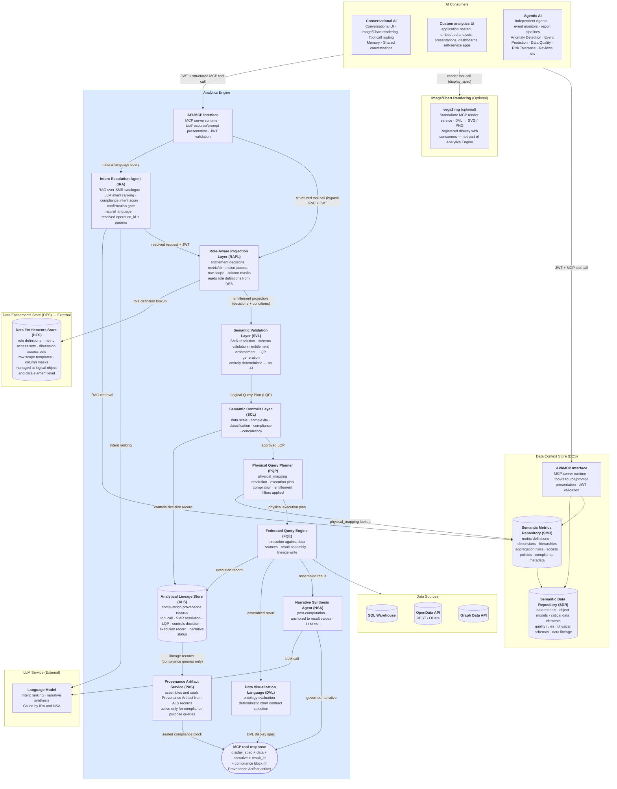
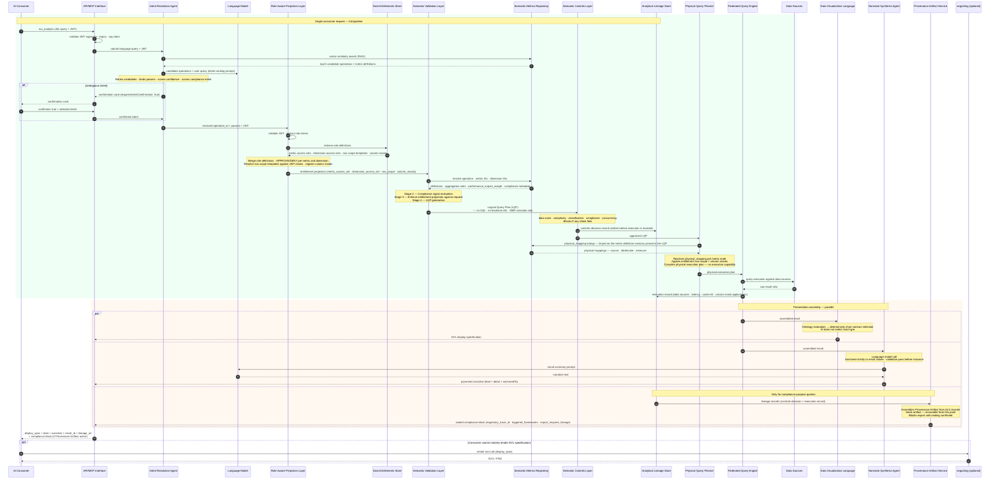
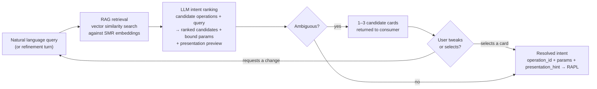
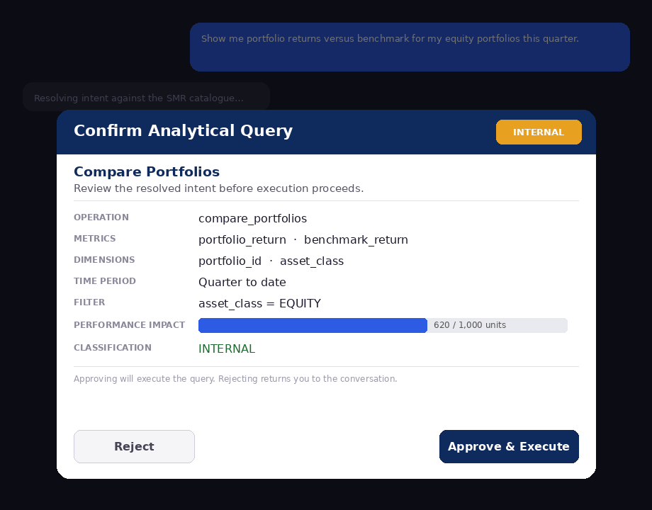
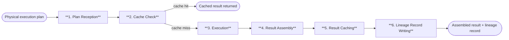

# 1. Core Platform Capabilities

This chapter defines the target logical architecture for the AI Analytics Platform. It covers thirteen pipeline components in the order a query will encounter them, using a single portfolio manager query as a running example throughout. Each section describes what a component will do, its controls contract, and its position in the pipeline — with no references to specific technology products or vendor implementations.

Platform roles — who will interact with each component and how — are defined before the component descriptions.


## Platform Roles

The platform will operate across three distinct planes: an **analytical plane** (querying, exploring, and exporting governed data), a **controls plane** (defining, approving, and administering the semantic layer and its access controls), and an **infrastructure plane** (platform deployment, health, and technical configuration).

| Role | Plane | Definition |
|------|-------|------------|
| **Analytical End User** | Analytical | Ask governed analytical questions via natural language; receive role-constrained results without knowledge of data structures or metric identifiers |
| **Power Analyst** | Analytical | Multi-dimensional exploration, governed drilldown, lineage inspection, result export |
| **Data Modeller** | Controls | Will own semantic data definitions in the SDR: logical data elements, object models, business definitions, critical data elements, and physical schema mappings. Will ensure the organisation's data assets are accurately described and structured — the foundational layer on which metric definitions are built |
| **Metrics Modeller** | Controls | Will own semantic metrics and analytics definitions in the SMR: key performance metrics, analytics operations, trend analysis constructs, and insight definitions. Must combine domain knowledge — what does this metric mean in this business context — with modelling precision: how it is calculated, from which sources, under which dimensional hierarchies, and with which access policies |
| **Entitlements Manager** | Controls | Responsible for defining and maintaining the organisation's data entitlement policies: who may perform which actions on which data elements, analytics definitions, and business process metrics. Will configure the metric access sets, dimension access sets, row scope, and column masks that RAPL enforces at query time |
| **Analytics Governance** | Controls | Overall accountability for the governance, integrity, and outcomes of the analytics platform. Will own SMR registry health, approve semantic definition changes from Metrics Modellers, oversee entitlement policy governance, and be accountable for the quality, accuracy, and completeness of analytical outputs across the organisation. The final authority on what is defined, who can access it, and whether the platform is delivering the right outcomes. Must be in place before go-live — without this role the registry has no approval authority and the platform cannot serve any query |
| **Integration Engineer** | Controls | Will register execution backends, maintain connection configuration, and declare the physical mappings that the Federated Query Engine resolves at execution time. Operates through configuration interfaces only — not the query path |
| **Platform Admin** | Infrastructure | Will be responsible for platform health, deployment, infrastructure-level governance, and technical platform configuration including controls settings, feature flags, and deployment configuration. Will implement the technical policies and settings determined by Analytics Governance. Has no query interface into analytical data |

**Roles are not mutually exclusive.** A single individual may hold multiple roles; the platform will evaluate entitlements from the combined JWT claims present at query time.

The **Data Modeller** and **Metrics Modeller** are the critical pre-conditions for everything downstream. No analytical query can be served against a metric that has not been modelled, registered, and approved. The Data Modeller will establish the foundational data definitions in the SDR — without accurate data structure definitions, metric definitions cannot be built. The Metrics Modeller will build on that foundation to define the analytical layer in the SMR — without registered, approved metric definitions, the controls pipeline, the entitlement layer, the lineage store, and the Data Visualization Language (DVL) have nothing to operate on. Analytics Governance will hold final approval authority over both layers.

### Role × Feature Access

| Feature | End User | Power Analyst | Data Modeller | Metrics Modeller | Entitlements Mgr | Analytics Governance | Integration Eng | Platform Admin |
|---------|:--------:|:-------------:|:-------------:|:----------------:|:----------------:|:--------------------:|:---------------:|:--------------:|
| Natural language query | ✓ | ✓ | | ✓ | | ✓ | | |
| Role-aware results | ✓ | ✓ | | ✓ | | ✓ | | |
| Governed drilldown | | ✓ | | ✓ | | ✓ | | |
| Lineage inspector | | ✓ | ✓ | ✓ | | ✓ | | |
| Result export | | ✓ | | ✓ | | ✓ | | |
| Provenance artifacts | ✓ | ✓ | | ✓ | | ✓ | | |
| SMR browsing | | ✓ | ✓ | ✓ | ✓ | ✓ | | |
| SDR management | | | ✓ | | | | | |
| Metric definition authoring | | | | ✓ | | | | |
| Metric definition approval | | | | | | ✓ | | |
| Dimension & hierarchy management | | | | ✓ | | ✓ | | |
| Entitlement policy management | | | | | ✓ | ✓ | | |
| Backend registration | | | | | | | ✓ | |
| Controls configuration | | | | | | | | ✓ |
| Audit trail | | | | | ✓ | ✓ | ✓ | ✓ |
| Platform infrastructure | | | | | | | | ✓ |


## Architecture and Request Flow

The platform will expose its capability through three consumption modes: direct API access (a host-built custom analytics UI calling the MCP Capability Layer with a structured tool invocation); conversational backend access (the AI Chat Platform calling the Analytics Platform as a tool provider); and agentic access (scheduled agents, event monitors, and automated report pipelines calling the MCP Capability Layer with machine-issued JWTs). All three modes will share a single entry point and a single controls pipeline; consumption mode will affect only the caller's interaction pattern, not the trust model applied.

### Architecture Diagram



The Analytics Engine will be a single MCP server exposing three analytical tools (`run_analytics`, `list_operations`, `drilldown`) through a single MCP Capability Layer endpoint. It will contain exactly two bounded AI steps: the Intent Resolution Agent (IRA), which will identify the right governed operation from the user's natural language query, and the Narrative Synthesis Agent (NSA), which will summarise the computed result in plain text after execution. All stages between them — RAPL, SVL, SCL, PQP, and FQE — will be entirely deterministic. The same resolved intent, access permissions, and data will always produce the same query plan, the same execution, and the same result.

For conversational consumers, the user's natural language query will be forwarded directly to the Analytics Engine. Intent resolution — selecting the right governed operation and binding parameters — will happen inside the engine's IRA. The Analytics Engine will return the display specification, structured data, and governed narrative; the AI Chat Platform will render the result. Structured API consumers (agents, custom UIs) may call `run_analytics` with an explicit `operation_id` and `params`, bypassing the IRA entirely.

The `vega2img` service will sit outside the Analytics Platform boundary as an optional, independently registered MCP render service. Consumers that cannot natively render the DVL display specification will register `vega2img` directly and call it as a separate tool invocation, passing the `display_spec` from the `run_analytics` response.

### Component Summary

| # | Component | Summary |
|---|-----------|---------|
| 1 | **AI Consumers** | The AI Consumers layer is responsible for providing the external access points through which governed analytical requests reach the platform. It encompasses three consumer types: conversational AI platforms that mediate natural language queries, autonomous agents and scheduled pipelines that submit structured requests, and custom applications that call the platform via host-issued tokens. All three consumer types share a single governed entry point and a single controls pipeline; consumption mode affects only the caller's interaction pattern, not the trust model applied. For natural language queries, the consumer forwards the query and the caller's JWT to the Analytics Engine, which handles intent resolution internally. For structured requests, consumers supply an explicit operation identifier and parameters, bypassing intent resolution and routing directly to the entitlement layer. In all cases, the consumer receives a structured MCP tool response containing a display specification, result data, a governed narrative, and a lineage reference. |
| 2 | **MCP Capability Layer (MCP)** | The MCP Capability Layer (MCP) is responsible for providing the single governed entry point through which all AI consumers access the platform's analytical capabilities. It receives tool call requests over MCP Streamable HTTP transport, validates the inbound JWT, and routes the request to either the Intent Resolution Agent for natural language queries or directly to the Role-Aware Projection Layer for structured calls. Each exposed tool represents a bounded, named operation with a typed input schema and a governed execution path. There is no privileged or alternative execution path; all consumers receive the same controls-validated results regardless of how they access the platform. The MCP layer assembles and returns a structured tool response containing the DVL display specification, result data, governed narrative, lineage reference, and, where applicable, a sealed compliance block. |
| 3 | **Intent Resolution Agent (IRA)** | The Intent Resolution Agent (IRA) is responsible for translating a natural language query into a structured, validated operation request. It receives the natural language query and the caller's JWT from the MCP Capability Layer and retrieves candidate operations from the SMR catalogue using embedding similarity search. A language model ranks the candidates, binds parameters to the leading operation, and derives a presentation preview indicating the anticipated chart type and axis structure. When the top candidate exceeds the confidence threshold, the resolved intent is forwarded directly to the Role-Aware Projection Layer. When intent is ambiguous, ranked candidate cards are returned to the consumer for selection or conversational refinement before execution proceeds. The IRA also classifies whether the query's stated purpose is compliance-driven, producing the compliance intent score that forms Signal 2 of the two-signal compliance trigger; when the purpose is ambiguous, it clarifies through the same confirmation card flow. The IRA is the only AI step in the pre-computation pipeline and produces no output visible to the end user once intent is resolved. |
| 4 | **Semantic Metrics Repository (SMR)** | The Semantic Metrics Repository (SMR) is responsible for governing every analytical concept resolvable on the platform. It stores versioned, approved metadata definitions for metrics, dimensions, hierarchies, and analytical operations, and exposes them to the pipeline for resolution at query time. Every identifier in a request must be registered and approved in the SMR before it can be queried; the Semantic Validation Layer enforces this as an architectural constraint, not a configurable policy. Metric definitions declare formula, aggregation rules, data affinity, physical mappings, classification level, compliance relevance, and regulatory framework attributes. Operation and metric definitions are stored with embeddings to support the Intent Resolution Agent's retrieval. Authoring and approval flow through the Data Context Store's versioning and governance workflow, with Analytics Governance holding final approval authority over all definitions. |
| 5 | **Role-Aware Projection Layer (RAPL)** | The Role-Aware Projection Layer (RAPL) is responsible for computing the entitlement projection for every request before any query plan is compiled. It receives the resolved request and caller's JWT, retrieves role definitions from the Data Entitlements Store, and merges all active roles into a single entitlement profile. Against that profile it makes five categories of decision: data access clearance, metric access, dimension access, row scope, and result set column masking. Entitlement is conferred by role membership against governed logical concepts, not by database permissions, keeping policies stable as the underlying physical implementation changes. The completed entitlement projection, covering approved metrics and dimensions, resolved row scope conditions, and registered column masks, is passed to the Semantic Validation Layer for enforcement. Every entitlement decision is written to the Analytical Lineage Store as an audit record at query time. |
| 6 | **Semantic Validation Layer (SVL)** | The Semantic Validation Layer (SVL) is responsible for validating the analytical request and compiling it into a platform-agnostic Logical Query Plan. It receives the entitlement projection from the Role-Aware Projection Layer together with the fully qualified analytical request and passes them through four sequential stages: well-formedness and SMR resolution, compliance signal evaluation, entitlement enforcement, and LQP generation. Every identifier is resolved against approved SMR definitions; any unregistered or unapproved identifier causes the pipeline to stop before a plan is compiled. Row scope filter nodes are injected and column masking directives are embedded as a top-level array in the plan, ensuring entitlement enforcement carries through to physical execution. The output is a Logical Query Plan expressed entirely in SMR-registered concepts, carrying no backend references, no SQL, and no physical schema identifiers. The SVL is entirely deterministic; no AI model runs inside it. |
| 7 | **Semantic Controls Layer (SCL)** | The Semantic Controls Layer (SCL) is responsible for applying five sequential checks to every query before releasing it to the Physical Query Planner. It receives the Logical Query Plan from the Semantic Validation Layer and evaluates it against the platform controls configuration. The five checks are: data scale (estimated scan volume against the configured row limit using SDR profiling statistics), complexity (LQP node count and join depth), classification gate (metric classification ceiling), compliance check (two-signal trigger for compliance-purpose queries), and concurrency (active query count against the platform limit). Every check must pass; there is no user, agent, or internal path that bypasses SCL evaluation. When all checks pass, the SCL assigns a timeout budget, writes a signed controls decision record to the Analytical Lineage Store, and releases the approved LQP to the Physical Query Planner. |
| 8 | **Physical Query Planner (PQP)** | The Physical Query Planner (PQP) is responsible for translating the controls-approved Logical Query Plan into backend-specific physical query fragments ready for execution. It receives the approved LQP from the Semantic Controls Layer and performs three operations in sequence: resolving the physical mapping for each metric node from the SMR, keyed on the metric definition version pinned in the plan, grouping metric nodes by data affinity to produce one sub-plan per affinity group, and translating each sub-plan into the native query language of its target backend. Row scope filters, dimension filters, and column masking directives from the LQP are distributed to each sub-plan so that entitlement enforcement carries through to the physical layer. The output is a physical execution plan — an envelope carrying the plan identifier, column masks, and timeout budget, with a sub-plans array containing one entry per data affinity group, each carrying the backend identifier and dialect. The PQP has no execution capability; it passes the physical execution plan to the Federated Query Engine. |
| 9 | **Federated Query Engine (FQE)** | The Federated Query Engine (FQE) is responsible for executing physical sub-plans against registered backends and assembling the results. It is the only component in the platform with knowledge of execution backend connection details, including endpoints, credentials, and availability. It receives the physical execution plan from the Physical Query Planner, checks the result cache using the LQP signature, and on a cache miss routes each of the plan's sub-plans to its registered backend by data affinity and capability. All sub-plans are executed concurrently and the FQE enforces the timeout budget assigned by the Semantic Controls Layer, handling partial results where one sub-plan times out while others complete. Sub-results from multiple backends are joined on shared dimensions and column masks are applied to the assembled result. The FQE writes a complete execution record to the Analytical Lineage Store and passes the assembled result to the Data Visualization Language and Narrative Synthesis Agent for presentation assembly. |
| 10 | **Data Visualization Language (DVL)** | The Data Visualization Language (DVL) is responsible for producing a deterministic display specification for every analytical result. It receives the assembled result from the Federated Query Engine and classifies it against a taxonomy of registered intent patterns. The ontology evaluator matches the result shape and intent classification against registered chart contracts in order of specificity, returning the highest-scoring match as the display specification. The AI model does not select chart types; the DVL makes the final binding decision, ensuring the same analytical pattern produces the same chart type across all users, sessions, and model versions. The TABLE_GOVERNED contract serves as an unconditional fallback, ensuring every query receives a valid display specification regardless of result shape. The intent pattern taxonomy and chart contract registry are initial sets, expected to be extended as the platform's visualisation vocabulary grows over time. |
| 11 | **Narrative Synthesis Agent (NSA)** | The Narrative Synthesis Agent (NSA) is responsible for producing a governed plain-language summary of each computed result. It runs in parallel with the Data Visualization Language after the Federated Query Engine has assembled the result, making a single tightly-scoped language model call anchored strictly to the computed values. Its prompt is constructed from the assembled result only: metric labels, row values, units, and dimension names; it is not given the user's original query or SMR governance context, preventing the narrative from interpreting or inferring beyond what was computed. Every numeric value in the narrative must be present in the result set, and a post-generation validation pass rejects the output if any value cannot be matched, with one regeneration attempt permitted. The NSA is optional and can be disabled via a platform configuration flag with no effect on computation, lineage, or display specification generation. |
| 12 | **Analytical Lineage Store (ALS)** | The Analytical Lineage Store (ALS) is responsible for providing a complete, immutable record of how every analytical result was produced. It receives two writes per query: a controls decision record written by the Semantic Controls Layer before execution begins, and a full execution record written by the Federated Query Engine after execution completes. Each lineage record captures the original request, the SMR metric definition versions resolved, the entitlement projection in force, the controls decisions applied, the physical sub-plans executed, and the visualisation contract and narrative status. Records are written once and never mutated; corrections are made via new amendment documents that reference the original record. The store supports regulatory audit export via a filtered query API, with digitally signed export packages available for compliance review. Retention periods are configurable, with a platform default of seven years for query records. |
| 13 | **Provenance Artifact Service (PAS)** | The Provenance Artifact Service (PAS) is responsible for assembling and sealing a tamper-evident compliance record for queries that trigger the two-signal compliance classification. It is invoked in parallel with the Data Visualization Language and Narrative Synthesis Agent, but only when the Semantic Controls Layer determines that both the metric compliance flag and the IRA intent classification signal are active. It reads the controls decision record and execution record from the Analytical Lineage Store for the current query, assembles them into a Provenance Artifact document, and seals it by writing the artifact back to the ALS as an immutable sibling record. Export of the query result is blocked until sealing is confirmed, ensuring compliance-purpose results cannot leave the platform without an associated auditable record. The sealed compliance block is included in the MCP tool response and any party holding the platform's public key can independently verify the artifact has not been altered since sealing. |

### Request Flow



The computation pipeline (RAPL → SVL → SCL → PQP → FQE) will be entirely deterministic and will contain no AI. The Analytical Lineage Store will receive two writes per query — a controls decision record before the PQP is invoked and a full execution record after — ensuring the audit trail is complete regardless of whether execution succeeds.


**Running example:** This query is traced through every component below — each section's Example shows the same request at the next stage of the pipeline.

```
"Show me portfolio returns versus benchmark for my equity portfolios this quarter."
```


## AI Consumers

The AI Consumers layer is responsible for providing the external access points through which governed analytical requests reach the platform. It encompasses three consumer types: conversational AI platforms that mediate natural language queries, autonomous agents and scheduled pipelines that submit structured requests, and custom applications that call the platform via host-issued tokens. All three consumer types share a single governed entry point and a single controls pipeline; consumption mode affects only the caller's interaction pattern, not the trust model applied. For natural language queries, the consumer forwards the query and the caller's JWT to the Analytics Engine, which handles intent resolution internally. For structured requests, consumers supply an explicit operation identifier and parameters, bypassing intent resolution and routing directly to the entitlement layer. In all cases, the consumer receives a structured MCP tool response containing a display specification, result data, a governed narrative, and a lineage reference.

**Natural language path.** When a user asks an analytical question, the consumer will forward the natural language query and the user's JWT to the Analytics Engine. The engine's IRA will handle operation selection, parameter binding, and if intent is ambiguous will return a confirmation card before proceeding to execution.

**Structured path.** Consumers that construct explicit `operation_id` + `params` payloads (agentic pipelines, custom analytics UIs, integration tests) will call `run_analytics` with structured arguments directly. The `list_operations` tool will return the entitled operation catalogue for consumers that build their own operation selection UI. Structured calls will bypass the IRA and route directly to the RAPL.

**Response assembly.** The conversation engine will render the DVL display specification inline. The `narrative` object in the response will contain the governed summary produced by the NSA. The `result_id` will be retained for any follow-up `drilldown` call or lineage inspection.

### Example

The user's question will be relayed by the conversational AI directly to the Analytics Engine with the user's JWT. The consumer will not interpret, translate, or structure the query — it will forward it as-is.

```json
POST /v1/mcp
Authorization: Bearer <host-issued-jwt>

{
  "jsonrpc": "2.0",
  "id":      "req-8a3f2c",
  "method":  "tools/call",
  "params": {
    "name": "run_analytics",
    "arguments": {
      "query": "Show me portfolio returns versus benchmark for my equity portfolios this quarter."
    }
  }
}
```

The Analytics Engine will process the request end-to-end and return a structured result. The conversation engine will render the grouped bar chart from the DVL display specification and surface the governed narrative as the assistant's reply.


## MCP Capability Layer (MCP)

> **Governing principles:** [P2 — Controls before execution](./00-overview.md#design-principles) · [P5 — Role-aware by default](./00-overview.md#design-principles)

The MCP Capability Layer (MCP) is responsible for providing the single governed entry point through which all AI consumers access the platform's analytical capabilities. It receives tool call requests over MCP Streamable HTTP transport, validates the inbound JWT, and routes the request to either the Intent Resolution Agent for natural language queries or directly to the Role-Aware Projection Layer for structured calls. Each exposed tool represents a bounded, named operation with a typed input schema and a governed execution path. There is no privileged or alternative execution path; all consumers receive the same controls-validated results regardless of how they access the platform. The MCP layer assembles and returns a structured tool response containing the DVL display specification, result data, governed narrative, lineage reference, and, where applicable, a sealed compliance block.

### Tool Catalogue

The Analytics Engine will expose three tools. All analytical operations will be SMR-catalogue driven — the code will be the execution engine, not the operation registry. The SMR will own every operation definition: what parameters it needs, what metrics and dimensions it supports, and which presentation stages it invokes via its `execution_profile`.

**`run_analytics(operation_id: str, params: dict, jwt: str)`** — Executes any SMR-registered operation. The operation's `execution_profile` in the SMR will determine which presentation stages run after the full controls pipeline completes.

**`list_operations(domain: str | None, jwt: str)`** — Returns the SMR operation catalogue with operation IDs, display names, required parameters, supported metrics/dimensions, and execution profiles. Only operations the authenticated user is entitled to execute will be returned.

**`drilldown(result_id: str, hierarchy: str, selected_value: str | None, jwt: str)`** — Navigates into a dimension hierarchy from a prior result. The parent result's analytical context — operation, filters, and hierarchy position — will be inherited; governance will not. The derived query will re-run the full pipeline (fresh RAPL projection, SVL enforcement, SCL checks) and write its own lineage record linked to the parent `result_id`.

### Execution Profiles

Each SMR operation will carry an `execution_profile` defined in its `analytical_operation` entry in the SMR catalogue. This will tell the pipeline executor which presentation stages to invoke after execution. No presentation depth will be hardcoded in the MCP layer — it will always be determined by the SMR catalogue.

The deterministic pipeline — Auth → IRA (natural-language queries only) → RAPL → SVL → SCL → PQP → FQE → Lineage — runs in full for every profile, without exception ([P2](./00-overview.md#design-principles): there is no fast path). Profiles vary only what happens after the FQE assembles the result:

| Profile | Controls pipeline | Presentation stages |
|---|---|---|
| `data_retrieval` | Full — never skipped | None — typed dataset with pagination; no chart, no narrative |
| `metric_query` | Full — never skipped | DVL display specification |
| `full_analytical` | Full — never skipped | DVL display specification + NSA narrative + PAS (when the compliance trigger is active) |

### Intent Confirmation Cards

When intent is ambiguous, or when `requiresIntentConfirmation: true` is set on the operation, the IRA will return candidate cards before executing any query. The cards will be returned as the MCP response body in place of the analytical result. The consumer will render all candidates simultaneously; the user selects one, optionally refines it through the chat experience, then confirms to proceed.

Each card will include the resolved operation and parameters alongside a **presentation preview** — the anticipated chart type and axis structure — so the user can verify both what will be queried and how the result will be presented before execution commits.

The response payload will use a `candidates[]` array. A single-candidate response (governance override) will use the same structure with one entry:

```json
{
  "intent_session_id": "ira-sess-20260605-wk4n",
  "candidates": [
    {
      "rank": 1,
      "confidence": 0.91,
      "operation_id":    "compare_portfolios",
      "operation_label": "Compare Portfolios",
      "resolved_metrics":    ["portfolio_return", "benchmark_return"],
      "resolved_dimensions": ["portfolio_id", "asset_class"],
      "time_period":    "quarter_to_date",
      "filters":        [{ "field": "asset_class", "operator": "eq", "value": "EQUITY" }],
      "preliminary_impact_estimate": 620,
      "classification": "INTERNAL",
      "presentation_hint": {
        "chart_type":        "bar",
        "primary_dimension": "portfolio_id",
        "measures":          ["portfolio_return", "benchmark_return"],
        "series_by":         "metric"
      }
    },
    {
      "rank": 2,
      "confidence": 0.67,
      "operation_id":    "portfolio_summary",
      "operation_label": "Portfolio Summary",
      "resolved_metrics":    ["portfolio_return", "portfolio_nav"],
      "resolved_dimensions": ["portfolio_id"],
      "time_period":    "quarter_to_date",
      "filters":        [],
      "preliminary_impact_estimate": 280,
      "classification": "INTERNAL",
      "presentation_hint": {
        "chart_type":        "table",
        "primary_dimension": "portfolio_id",
        "measures":          ["portfolio_return", "portfolio_nav"],
        "series_by":         null
      }
    }
  ],
  "action": "select or refine — re-submit with selected_candidate: <index> or a refinement message"
}
```

**Selecting a candidate:** re-submit `run_analytics` with `"selected_candidate": 0` (0-based index) to confirm the chosen interpretation and proceed to execution.

**Refining through chat:** send a natural language adjustment — the IRA will update the leading candidate's parameters and return a revised card set. Refinement turns will be bounded by `intentRefinementMaxTurns` (default 5) and recorded in the lineage record's `intent_session` field.

### Capability Governance

Every capability invocation will pass through the full controls pipeline: input schema validation → capability availability check (feature flags and role entitlements) → Role-Aware Projection → Semantic Validation Layer → Semantic Controls Layer → Physical Query Planner → FQE → result assembly → lineage record write. A capability not enabled by a feature flag or accessible to the user's role will appear as `available: false` with a reason.

### Example

A structured `run_analytics` tool call will arrive from the AI Chat Platform. The MCP Capability Layer will validate the JWT signature, confirm the token has not expired, and extract the claims. For a natural language query it will route to the Intent Resolution Agent; for a structured call it will route directly to the Role-Aware Projection Layer. The MCP Capability Layer will not interpret the parameters or make any analytical decisions; it will validate, route, and wait.


## Intent Resolution Agent (IRA)

> **Governing principles:** [P2 — Controls before execution](./00-overview.md#design-principles) · [P10 — Deterministic computation, not generation](./00-overview.md#design-principles)

The Intent Resolution Agent (IRA) is responsible for translating a natural language query into a structured, validated operation request. It receives the natural language query and the caller's JWT from the MCP Capability Layer and retrieves candidate operations from the SMR catalogue using embedding similarity search. A language model ranks the candidates, binds parameters to the leading operation, and derives a presentation preview indicating the anticipated chart type and axis structure. When the top candidate exceeds the confidence threshold, the resolved intent is forwarded directly to the Role-Aware Projection Layer. When intent is ambiguous, ranked candidate cards are returned to the consumer for selection or conversational refinement before execution proceeds. The IRA also classifies whether the query's stated purpose is compliance-driven, producing the compliance intent score that forms Signal 2 of the two-signal compliance trigger; when the purpose is ambiguous, it clarifies through the same confirmation card flow. The IRA is the only AI step in the pre-computation pipeline and produces no output visible to the end user once intent is resolved.

### Intent Resolution Pipeline



### RAG Retrieval

At registration time, each `analytical_operation` and `analytical_metric` definition in the SMR will be embedded: the operation name, description, example phrasings, required parameters, and associated metric descriptions will be concatenated and encoded as a dense vector stored alongside the definition.

When a query arrives, the IRA will encode the natural language input and perform a vector similarity search against the SMR operation embeddings. The top-K candidate operations and their associated metric definitions will be retrieved. Only these candidates — not the full catalogue — will be injected into the LLM ranking prompt.

### LLM Intent Ranking

The LLM will receive the top-K candidates and the user's query. It will rank candidates, bind parameters, and score confidence for each. It will also derive a `presentation_hint` for each candidate — the likely chart type and primary axes — based on the operation's result shape and the SMR operation definition. This preview will be included in every candidate card returned to the consumer.

If the top candidate's confidence score exceeds `intentConfidenceThreshold` (configurable, default 0.75) and leads the second candidate by more than `intentConfidenceBand` (configurable, default 0.1), the IRA will proceed directly to the RAPL with no card shown. Otherwise, up to three ranked candidate cards will be returned for the user to select or refine.

The LLM call will be constrained: the prompt will contain only the candidate operation definitions and the user's query. The LLM will have no access to result data, SMR governance metadata, or user entitlements — those will be enforced downstream by SVL and RAPL.

### Multi-Candidate Selection

When intent is ambiguous, the IRA will return up to three ranked candidate cards in a single `candidates[]` array. The number of candidates returned will be determined by confidence clustering:

| Situation | Cards shown |
|---|---|
| Top candidate above threshold, clear leader | 0 — proceeds directly to RAPL |
| Top candidate below threshold, or top two within confidence band | 2 candidates |
| Top three candidates within confidence band | 3 candidates |
| `requiresIntentConfirmation: true` on the operation (governance override) | 1 candidate — approval required regardless of confidence |

The consumer will re-submit with `"selected_candidate": <index>` (0-based) to indicate which card the user chose. The IRA will then forward the selected candidate's resolved intent to the RAPL.

### Conversational Refinement

After candidate cards are presented, the user may respond with a natural language adjustment rather than selecting a card. The IRA will treat the refinement as a constrained update: it will re-run the LLM with the selected or leading candidate as context and apply the requested changes to that candidate's parameters. An updated card set will be returned.

The loop will be bounded: a maximum number of refinement turns is configurable (`intentRefinementMaxTurns`, default 5). After the limit, the IRA will require the user to select from the current candidate set or start a new query. No data will be accessed and no query will be executed during the refinement loop — it will be entirely within the IRA's pre-execution scope. Each refinement turn will be recorded in the session context and included in the lineage record's `intent_session` field.

### Compliance Intent Classification

As part of intent ranking, the IRA will classify whether the user's stated purpose is compliance-driven and attach a `compliance_purpose_score` (0.0–1.0) to the resolved request. The score will be derived from the natural language query — phrases such as *"for the regulatory submission"* — and forwarded unchanged through the RAPL to the SVL, where it is evaluated against `compliance_intent_threshold` as Signal 2 of the two-signal compliance trigger ([SCL Check 4](#semantic-controls-layer-scl)).

The IRA will never make the compliance determination alone. Signal 1 — the `compliance_relevant` flag on the resolved metric definitions — is declared in the SMR by the Metrics Modeller and evaluated downstream; both signals must be active for escalation. When the compliance purpose of a query is ambiguous, the IRA will ask the user to clarify through the same confirmation card flow used for ambiguous intent, rather than guessing. Structured API calls bypass the IRA; structured callers declare compliance purpose explicitly via a `compliance_purpose` parameter.

### Presentation Preview

Each candidate card will include a `presentation_hint` block derived from the operation's result shape and the SMR operation definition.

| Field | Description |
|---|---|
| `chart_type` | Predicted chart type — `bar`, `line`, `heatmap`, `scatter`, `table` |
| `primary_dimension` | The field that will appear on the X axis or as the primary grouping |
| `measures` | Metric fields that will appear as Y axis values or colour encoding |
| `series_by` | Dimension used to create series or colour bands (if applicable) |

The `presentation_hint` will be a pre-execution estimate. The DVL will produce the authoritative display specification after execution, based on the actual result shape. The hint is informational only.

### Structured API Path

Consumers that construct explicit `operation_id` + `params` (agentic pipelines, custom analytics UIs, integration tests) will call `run_analytics` with a structured payload directly. MCP will route these calls directly to the RAPL, bypassing the IRA. The `list_operations` tool will return the full entitled operation catalogue for consumers that build their own operation selection UI.

### Example

Running example — portfolio manager asks:

> "Show me portfolio returns versus benchmark for my equity portfolios this quarter."

The IRA will encode this query and retrieve the top-3 candidate operations from the SMR: `compare_portfolios` (score 0.91), `portfolio_summary` (score 0.67), `benchmark_attribution` (score 0.61). The top candidate exceeds the confidence threshold and leads by more than 0.1. The LLM will bind the resolved intent and derive a presentation preview:

<table><tr><td>

```json
{
  "operation_id": "compare_portfolios",
  "params": {
    "portfolio_ids":  ["GLOB_EQ_OPP", "UK_CORE_INC", "ASIA_PAC_GRW", "EUR_BAL_INC"],
    "metrics":        ["portfolio_return", "benchmark_return"],
    "time_period":    "quarter_to_date",
    "filters": [{ "dimension": "asset_class", "operator": "eq", "value": "EQUITY" }]
  },
  "presentation_hint": {
    "chart_type":        "bar",
    "primary_dimension": "portfolio_id",
    "measures":          ["portfolio_return", "benchmark_return"],
    "series_by":         "metric"
  }
}
```

</td><td>



</td></tr></table>

Confidence is 0.91 — above threshold, no candidate cards shown. Resolved intent will be forwarded to the RAPL.


## Semantic Metrics Repository (SMR)

> **Governing principles:** [P1 — Semantic abstraction](./00-overview.md#design-principles) · [P3 — Deterministic metric resolution](./00-overview.md#design-principles) · [P9 — Administrator sovereignty](./00-overview.md#design-principles)

The Semantic Metrics Repository (SMR) is responsible for governing every analytical concept resolvable on the platform. It stores versioned, approved metadata definitions for metrics, dimensions, hierarchies, and analytical operations, and exposes them to the pipeline for resolution at query time. Every identifier in a request must be registered and approved in the SMR before it can be queried; the Semantic Validation Layer enforces this as an architectural constraint, not a configurable policy. Metric definitions declare formula, aggregation rules, data affinity, physical mappings, classification level, compliance relevance, and regulatory framework attributes. Operation and metric definitions are stored with embeddings to support the Intent Resolution Agent's retrieval. Authoring and approval flow through the Data Context Store's versioning and governance workflow, with Analytics Governance holding final approval authority over all definitions.

### Concept Types

The SMR will hold at least the following three types of JSON metadata definition. The SMR is expected to be extensible in nature to accommodate other analytical concept types beyond those envisaged in this target state design:

| Definition type | Description |
|---|---|
| **`analytical_metric`** | Governed metric definition — formula, aggregation, `data_affinity`, `physical_mapping`, `required_dimensions`, `performance_impact_weight`, `classification_level`, `compliance_relevant`, `regulatory_framework` |
| **`analytical_dimension`** | Governed dimension definition — `data_affinity`, `physical_mapping`, enumerated values or `hierarchical` flag, `hierarchy_levels` |
| **`analytical_operation`** | Governed operation definition — `execution_profile`, `required_params`, `supported_metrics`, `supported_dimensions`, `default_visualization` |

### Metric Definition Schema

Every metric in the SMR will conform to the following schema. This is the authoritative reference for metric registration and validation:

```json
{
  "id":          "portfolio_return",
  "version":     "2.1.0",
  "label":       "Portfolio Return",
  "description": "Total return of a portfolio over the specified period, net of fees, expressed as a percentage.",
  "formula":     "(end_market_value - start_market_value + cash_flows) / start_market_value",
  "compliance_relevant": false,
  "regulatory_framework": [],
  "unit":        "percentage",
  "aggregation": {
    "default":     "value_weighted_average",
    "allowed":     ["value_weighted_average", "equal_weighted_average", "sum"],
    "granularity": ["daily", "monthly", "quarterly", "annual", "since_inception"]
  },
  "dimensions": {
    "required": ["portfolio", "date"],
    "optional": ["asset_class", "currency", "benchmark"]
  },
  "data": {
    "domain":          "portfolio",
    "sub_domain":      "performance",
    "source_tables":   ["fact_portfolio_daily", "dim_portfolio"],
    "refresh_cadence": "daily",
    "latency_sla":     "T+1"
  },
  "governance": {
    "owner":          "head_of_performance_analytics",
    "steward":        "performance_analytics_team",
    "classification": "INTERNAL",
    "approved":       true,
    "approved_by":    "cdo_office",
    "approved_at":    "2025-11-15T09:00:00Z",
    "effective_from": "2025-11-15",
    "deprecated":     false
  },
  "lineage": {
    "upstream_metrics":   [],
    "upstream_sources":   ["positions_service", "pricing_service", "cash_flow_service"],
    "downstream_metrics": ["active_return", "information_ratio"]
  },
  "access": {
    "roles":  ["portfolio_manager", "risk_officer", "analytics_governance"],
    "public": false
  },
  "display": {
    "format":               "percentage",
    "decimals":             2,
    "sign_convention":      "positive_is_gain",
    "benchmark_comparison": true
  }
}
```

All metric definitions will pass through a governance review and approval process before they are resolvable on the platform. A metric authored by a Metrics Modeller will not be queryable until it has been reviewed and approved by Analytics Governance.

### Formula Language

The SMR formula language will express metric computation logic in terms of other registered metrics or canonical data source identifiers — never physical column names. This will decouple metric definitions from backend schema changes: renaming a physical table or column will require only a mapping update, not a metric definition change. The formula language will support arithmetic composition, conditional expressions, safe division with null protection, time-windowed aggregations, and filtered sub-aggregations.

### SMR Authoring and Discovery

The SMR and SDR will be independent stores, both housed within the Data Context Store (DCS). The SMR will be a separate store for metric definitions; it will reference the SDR's data definitions but will not extend or depend on it structurally. The DCS will be the external container that holds both.

Metric authoring will use the DCS's native versioning and approval workflow. Metrics Modellers will author `analytical_metric`, `analytical_dimension`, and `analytical_operation` JSON metadata definitions through the DCS authoring interface; Analytics Governance will approve them before they become resolvable.

**Discovery** — AI models and agents will discover available operations by calling the `list_operations` MCP tool. `list_operations` will return operation IDs, display names, required parameters, supported metrics, supported dimensions, and execution profiles for all approved operations within the caller's entitlement scope. There will be no `smr://` MCP resource URIs and no separate `list_metrics`, `get_metric_definition`, `propose_metric`, or `approve_metric` MCP tools.

The Analytics Engine will query the SMR directly at request time — the SVL will resolve metric and operation definitions, and the PQP will resolve physical mappings. The DCS will also expose its own external API and MCP interface through which consumers and tooling can independently browse, inspect, and discover SMR metric definitions and SDR data definitions without going through the Analytics Engine.

### Example

When the request reaches the SVL, the SMR will be the catalogue every identifier is resolved against. The SVL will ask the SMR to resolve the `compare_portfolios` operation, then resolve `portfolio_return` and `benchmark_return` as `analytical_metric` documents. The SMR will confirm both are approved for the `portfolio_manager` role and return their definitions, including `data_affinity` (`portfolio`), `required_dimensions` (`portfolio_id`, `time_period`), and `aggregation` (`value_weighted_average`). `asset_class` will resolve as an approved `analytical_dimension` document with an approved filter operator (`eq`). If either metric document were absent or not in `"status": "approved"` state, the SVL would return `METRIC_NOT_FOUND` and the pipeline would stop.


## Role-Aware Projection Layer (RAPL)

> **Governing principles:** [P5 — Role-aware by default](./00-overview.md#design-principles) · [P1 — Semantic abstraction](./00-overview.md#design-principles)

The Role-Aware Projection Layer (RAPL) is responsible for computing the entitlement projection for every request before any query plan is compiled. It receives the resolved request and caller's JWT, retrieves role definitions from the Data Entitlements Store, and merges all active roles into a single entitlement profile. Against that profile it makes five categories of decision: data access clearance, metric access, dimension access, row scope, and result set column masking. Entitlement is conferred by role membership against governed logical concepts, not by database permissions, keeping policies stable as the underlying physical implementation changes. The completed entitlement projection, covering approved metrics and dimensions, resolved row scope conditions, and registered column masks, is passed to the Semantic Validation Layer for enforcement. Every entitlement decision is written to the Analytical Lineage Store as an audit record at query time.

Entitlement policies will be managed in the **Data Entitlements Store (DES)** — an independent external component. Policies will be defined at the **logical object and data element level**: granting or restricting access to named metrics, dimensions, and data elements as governed concepts, never to physical tables, schemas, or column names. Projection will not be optional and will not be bypassable; every request will pass through RAPL, sitting between the IRA and the SVL.

### Restriction Types

RAPL will make five categories of entitlement decision. Every decision will be made inside RAPL (Stage 5 of the projection lifecycle); the resulting conditions will be carried in the entitlement projection and enforced downstream — data and metric/dimension removals by the SVL during plan generation, row scope and column restrictions by the FQE at execution and result assembly.

| Restriction type | Decided in RAPL | Enforced at |
|---|---|---|
| **Data access** | Stage 5 — data domain or classification ceiling not within the user's entitled scope is **DENIED** | SVL Stage 3 — request rejected before plan generation |
| **Metrics access** | Stage 5 — requested metric not in the entitled access set is **DENIED** | SVL Stage 3 — denied metric removed from plan; request rejected if a required metric is lost |
| **Dimension access** | Stage 5 — requested dimension not in the entitled access set is **DENIED** | SVL Stage 3 — denied dimension removed from plan |
| **Row scope access** | Stage 5–6 — population scope decided and resolved against JWT claims | PQP sub-plan generation — row scope filter injected into each sub-plan; enforced by FQE at execution |
| **Result set column masking** | Stage 5 — masked columns and masking mode registered | FQE result assembly — value replaced, redacted, or excluded |

### Projection Lifecycle


**Stage 1 — JWT Validation.** Validate the inbound JWT: signature, expiry, and org claim. **DENY** — request rejected immediately if any check fails. No further processing occurs on an invalid token.

**Stage 2 — Role Claim Extraction.** Extract the user's analytical role claims from the validated JWT using the configured `roleClaimField`. **DENY** — if no valid analytical role claims are present the request is rejected.

**Stage 3 — DES Role Definition Retrieval.** Look up the full role definition for each extracted role from the Data Entitlements Store (DES). Each definition declares the data access scope, metric access set, dimension access set, row scope templates, column masks, and classification ceiling for that role. **DENY** — if no valid role definitions are retrieved the request is rejected.

**Stage 4 — Multi-Role Merge.** Merge all retrieved role definitions into a single entitlement profile. Data, metric, and dimension access: union. Row scope: strict intersection (AND) — every condition from every role applies; where two roles constrain the same dimension, their value sets intersect. Most restrictive wins, independent of role order. Column masks: union (masked by any role = masked for the user). No APPROVE/DENY decision is made here — this stage produces the profile against which all decisions are made in Stage 5.

**Stage 5 — Entitlement Decisions.** Five classes of decision will be made against the merged entitlement profile:

- **Data access** — the requested data domain and classification level will be checked against the user's entitled data access scope and classification ceiling. If either check fails the request will be **DENIED** (`DATA_NOT_ENTITLED`) before metric evaluation begins.
- **Metrics access** — each requested metric will be **APPROVED** or **DENIED** (`METRIC_NOT_ENTITLED`). Approval may be with or without dimensional constraints. If any required metric is denied the request will be rejected.
- **Dimension access** — each requested dimension will be **APPROVED** or **DENIED** (`DIMENSION_NOT_ENTITLED`). Entitlement will be evaluated per metric-dimension combination.
- **Row scope access** — each approved metric will carry an **APPROVED with population scope** decision: the row scope that defines which population of data the user is permitted to see.
- **Result set column masking** — each approved metric will carry an **APPROVED with column restrictions** decision where applicable.

No approved metric will reach the output without its full set of data access clearance, population scope, and column visibility conditions attached.

**Stage 6 — Row Scope Resolution.** Resolve the row scope templates from Stage 5 against the user's JWT claims. `{{user.claim_name}}` syntax will be expanded to concrete values at query time. **DENY** — if a required JWT claim for scope resolution is missing the request will be rejected.

**Stage 7 — Entitlement Projection Output.** Produce the completed entitlement projection: approved `data_access_scope`, approved `metric_access_set` (each with permitted aggregations and dimensional constraints), approved `dimension_access_set`, resolved `row_scope[]`, registered `column_masks[]`, and `classification_ceiling`. Write the full projection record to the ALS. Pass to SVL for Stage 3 enforcement.

### Multi-Role Merge Strategy

| Entitlement type | Merge strategy | Rationale |
|---|---|---|
| Data access | Union | Entitlement via any role is sufficient |
| Metrics access | Union | Entitlement via any role is sufficient |
| Dimension access | Union | Entitlement via any role is sufficient |
| Row scope access | Strict intersection (AND) | Every condition from every role must be satisfied; value sets on the same dimension intersect — most restrictive wins, independent of role order |
| Result set column masking | Union | A column masked by any role is masked for the user |

### Column Masking Modes

RAPL will support at least the following column masking modes. The platform is expected to be extensible in nature to facilitate other masking models beyond those envisaged in this target state design:

| Mode | Column representation in result |
|---|---|
| `null_replacement` | Column value replaced with `null` |
| `redacted_label` | Column value replaced with `"[REDACTED]"` |
| `excluded` | Column omitted entirely from the result schema |

### Entitlement Audit

Every entitlement decision — data access clearance, approved and denied metrics, approved dimensions, row scope applied, and column masking registered — will be recorded in the Analytical Lineage Store (ALS) as part of the projection record. The record will capture the roles active at query time, each decision's APPROVE or DENY outcome and the basis for it, the resolved row scope for each approved metric, and the column restrictions in force.

### Example

The RAPL will read the `portfolio_scope` claim from the JWT and resolve it against the `portfolio_manager` role's row scope template (`portfolio_id IN ({{user.portfolio_scope}})`):

```json
{
  "data_access_scope":      "domain:portfolio · classification:INTERNAL",
  "row_scope": [
    { "dimension": "portfolio_id", "operator": "in",
      "values": ["GLOB_EQ_OPP", "UK_CORE_INC", "ASIA_PAC_GRW", "EUR_BAL_INC"] }
  ],
  "column_masks":           [],
  "classification_ceiling": "INTERNAL",
  "projection_basis":       "jwt_claim:portfolio_scope"
}
```

No column masks will apply — the `portfolio_manager` role has no masking rules for performance metrics. The row scope will be injected into the LQP as node `n3`. Any portfolio outside the four listed IDs will be excluded at the physical query level. The entitlement projection will be handed to the SVL.


## Semantic Validation Layer (SVL)

> **Governing principles:** [P2 — Controls before execution](./00-overview.md#design-principles) · [P10 — Deterministic computation, not generation](./00-overview.md#design-principles)

The Semantic Validation Layer (SVL) is responsible for validating the analytical request and compiling it into a platform-agnostic Logical Query Plan. It receives the entitlement projection from the Role-Aware Projection Layer together with the fully qualified analytical request and passes them through four sequential stages: well-formedness and SMR resolution, compliance signal evaluation, entitlement enforcement, and LQP generation. Every identifier is resolved against approved SMR definitions; any unregistered or unapproved identifier causes the pipeline to stop before a plan is compiled. Row scope filter nodes are injected and column masking directives are embedded as a top-level array in the plan, ensuring entitlement enforcement carries through to physical execution. The output is a Logical Query Plan expressed entirely in SMR-registered concepts, carrying no backend references, no SQL, and no physical schema identifiers. The SVL is entirely deterministic; no AI model runs inside it.

### Four-Stage Validation Pipeline


**Stage 1 — Valid, Complete, Resolved & Compatible.** The request must be well-formed, fully populated, and resolvable against the SMR before any further processing occurs. Required fields must be present and correctly typed. The `operation_id` must resolve to an approved `analytical_operation` metadata definition. Every metric ID must resolve to an approved `analytical_metric` metadata definition and every dimension ID to an approved `analytical_dimension` metadata definition. Params must conform to the operation's `required_params` schema. Cross-entity compatibility will be validated in the same pass. Anything unregistered, unapproved, missing, or incompatible will be rejected here — the pipeline will not proceed.

**Stage 2 — Compliance Signal Evaluation.** The SVL will combine two independent signals to determine the compliance disposition of the request. Signal 1 will be the `compliance_relevant` flag on each resolved `analytical_metric` metadata definition, declared by the Metrics Modeller at registration. Signal 2 will be the IRA's compliance intent score (`compliance_purpose_score`) — classified from the user's natural language query at intent resolution and forwarded unchanged with the resolved request; structured calls, which bypass the IRA, declare compliance purpose explicitly via a `compliance_purpose` parameter. The SVL performs no classification of its own — it deterministically evaluates the forwarded score against `compliance_intent_threshold`. If both signals are active the request will be escalated to the full compliance tier and the Provenance Artifact Service will be invoked. Either signal alone is insufficient: the request proceeds on the standard governance path, and the state of both signals is recorded in the lineage record.

**Stage 3 — Entitlement Enforcement.** The SVL will apply the entitlement projection computed by the Role-Aware Projection Layer. Metrics and dimensions will be filtered to the caller's entitled scope. Row scope resolved by RAPL will be injected as scope filter nodes in the plan. Column masking directives from RAPL will be embedded in the LQP as a top-level `column_masks` array — carrying field name, masking mode, and the basis role for each masked column — so the Physical Query Planner can carry them through to the FQE for application to the assembled result. Any metric or dimension RAPL did not approve will be removed; if removal leaves the request without its required metrics the request will be rejected with an entitlement error rather than returning a partial result.

**Stage 4 — LQP Generation.** The validated, projected, and compliance-classified request will be compiled into a platform-agnostic Logical Query Plan — a directed acyclic graph of analytical operations expressed entirely in SMR-registered concepts. No SQL, no backend references, and no physical schema identifiers will appear in the LQP. Data affinity hints will be assigned per metric node to guide the Physical Query Planner's execution plan compilation. Column masking directives from Stage 3 will be included as a top-level `column_masks` array on the plan. A preliminary impact estimate (`preliminary_impact_estimate`) will be computed by summing the `performance_impact_weight` values of all resolved metric definitions and attached to the LQP. This is a Tier 1 coarse indicator of query weight available before row scope is fully known; the SCL will replace it with a precise scan-volume estimate at Check 1 time using SDR data profiling statistics.

### Example

The SVL will receive the fully qualified analytical request together with RAPL's entitlement projection and pass them through all four stages. The output will be the Logical Query Plan passed to the Semantic Controls Layer:

```json
{
  "lqp_id":    "lqp-20260518-093243-r9xq",
  "intent_id": "int-20260518-093241-pk7m",
  "org_id": "acme-wealth",
  "nodes": [
    { "id": "n1", "type": "metric_scan",
      "metrics": ["portfolio_return", "benchmark_return"],
      "dimensions": ["portfolio_id"],
      "time_period": { "granularity": "quarterly", "anchor": "current" } },
    { "id": "n2", "type": "filter", "input": "n1",
      "predicate": { "field": "asset_class", "operator": "eq", "value": "EQUITY" } },
    { "id": "n3", "type": "row_scope", "input": "n2",
      "scope": { "field": "portfolio_id", "operator": "in",
                 "values": ["GLOB_EQ_OPP", "UK_CORE_INC", "ASIA_PAC_GRW", "EUR_BAL_INC"] } },
    { "id": "n4", "type": "sort", "input": "n3",
      "field": "portfolio_return", "direction": "desc" }
  ],
  "output_node":                "n4",
  "column_masks":               [],
  "preliminary_impact_estimate": 620,
  "classification_required":     "INTERNAL"
}
```

Node `n3` is the RAPL row scope — a first-class plan node, not a post-execution filter. `column_masks` is empty here because the `portfolio_manager` role carries no masking rules for performance metrics; for roles that do, the array would contain entries of the form `{ "field": "counterparty_id", "mode": "redacted_label", "basis_role": "risk_viewer" }`.


## Semantic Controls Layer (SCL)

> **Governing principles:** [P2 — Controls before execution](./00-overview.md#design-principles) · [P8 — Explainability at every layer](./00-overview.md#design-principles) · [P9 — Administrator sovereignty](./00-overview.md#design-principles)

The Semantic Controls Layer (SCL) is responsible for applying five sequential checks to every query before releasing it to the Physical Query Planner. It receives the Logical Query Plan from the Semantic Validation Layer and evaluates it against the platform controls configuration. The five checks are: data scale (estimated scan volume against the configured row limit using SDR profiling statistics), complexity (LQP node count and join depth), classification gate (metric classification ceiling), compliance check (two-signal trigger for compliance-purpose queries), and concurrency (active query count against the platform limit). Every check must pass; there is no user, agent, or internal path that bypasses SCL evaluation. When all checks pass, the SCL assigns a timeout budget, writes a signed controls decision record to the Analytical Lineage Store, and releases the approved LQP to the Physical Query Planner.

### Controls Pipeline


**Check 1 — Data Scale Check.** Using row counts, partition sizes, and time-series volume distributions held in the Semantic Data Repository, the SCL will compute a precise `estimated_scan_rows` value across all data sources in scope. This is the Tier 2 estimate — the final, authoritative scan-volume calculation — replacing the `preliminary_impact_estimate` carried in the LQP. It is the first point in the pipeline where full information is available: the LQP carries fully resolved row scope, and the SDR holds current data distribution statistics. The `estimated_scan_rows` value is compared against the `maxScanRows` limit in the controls configuration. A simple query spanning a large, unpartitioned fact table may exceed the limit and be blocked; a structurally complex query operating over a narrow time-window partition may pass comfortably. When blocked, the user will receive structured suggestions to narrow scope — reduce the time period, add a filter, or reduce the number of metrics.

**Check 2 — Complexity Check.** The SCL will evaluate the structural complexity of the LQP independently of data scale: total node count, join depth, and number of distinct data sources involved. Complexity limits protect the Physical Query Planner and the FQE from pathologically complex plans that could degrade execution performance regardless of underlying data volume. A query blocked by the complexity ceiling will receive an error identifying which dimension of complexity was exceeded.

**Check 3 — Classification Gate.** Every resolved metric carries a `data.classification` value set by the Metrics Modeller at registration. The SCL will identify the highest classification level across all metrics in the LQP and compare it against the permitted classification ceiling in the controls configuration. If any metric's classification exceeds the ceiling the query will be blocked. This check operates independently of entitlement enforcement — RAPL will have already confirmed the caller's access to each metric; the classification gate confirms the overall query's classification envelope is within the platform's operational boundary.

**Check 4 — Compliance Check.** A request will be classified as a compliance-type request when two independent signals are both active at evaluation time. When classified, the platform will invoke the Provenance Artifact Service, apply framework-specific validation rules, and block result export until the artifact is sealed. Compliance relevance is declared on each metric at registration by the Metrics Modeller — the platform makes no compliance determination on a request without that declaration.

**Provenance Artifact trigger — two signals, both required (AND logic)**

| Signal | Source | True when |
|---|---|---|
| **Signal 1 — metric metadata** | `compliance_relevant` field on `analytical_metric` SMR definition | At least one resolved metric has `compliance_relevant: true`. Set by the Metrics Modeller at registration. |
| **Signal 2 — AI intent classification** | IRA intent resolution — score evaluated deterministically at SVL Stage 2 | `compliance_purpose_score` ≥ `compliance_intent_threshold` (default 0.8, configurable). The IRA will classify the query's stated purpose from the natural language query at intent resolution and forward the score with the resolved request; the SVL will evaluate it against the threshold and set `compliance_purpose: true` if it is met. Structured calls declare compliance purpose explicitly. |

When the Provenance Artifact is active, export of the result will be blocked until the artifact is confirmed written and sealed to the ALS. The `export_requires_lineage: true` flag in the response will signal this state to the consumer. The consumer will not present export affordances until the platform confirms sealing.

Framework-specific validation rules — additional parameter requirements, data constraints, lineage record types, and NSA output constraints — are declared exclusively on the metric definition in the SMR via the metric's `regulatory_framework` attribute, set by the Metrics Modeller at registration. The SCL will read and apply these rules directly from the resolved metric definitions at query time. No regulatory framework logic is hardcoded in the SCL.

**Check 5 — Concurrency Check.** The SCL will count the number of active queries currently in execution and compare it against the `maxConcurrentQueries` limit in the controls configuration. If the platform is at capacity, the query will be blocked with a `concurrency_limit_reached` response, and the caller will be advised to retry. This limit protects FQE coordination resources and ensures that no single burst of requests degrades response times across all active queries.

**Step 6 — Timeout Budget Assignment.** Once all five checks pass, the SCL will assign a `queryTimeoutSeconds` value to the query. This is not a blocking check — it is a budget allocation. The timeout is derived from the estimated scan volume and the configured per-engine timeout settings in the controls configuration. It will be attached to the controls output and forwarded with the LQP to the Physical Query Planner, which will pass it to the FQE for enforcement during execution.

**Step 7 — Controls Record and Release.** The SCL will write a signed controls decision record to the Analytical Lineage Store before forwarding the LQP to the Physical Query Planner. The record will capture the LQP identifier, the outcome of every check, the assigned timeout budget, and the compliance classification. Only after this record is confirmed written will the SCL release the query to the PQP. The lineage record is the authoritative confirmation that every control was applied.

### Example

SCL will evaluate the LQP against the `acme-wealth` controls config:

| Check | Value | Limit | Result |
|---|---|---|---|
| Data scale (estimated scan volume) | 620M rows | 1B rows | Pass |
| Complexity (node count) | 4 nodes | 50 nodes | Pass |
| Classification | INTERNAL | INTERNAL ceiling | Pass |
| Compliance | none triggered | — | Pass |
| Concurrency (active queries) | 3 | 20 | Pass |

All checks will pass. SCL will write a controls decision record to the ALS before releasing to the PQP:

```json
{
  "lqp_id":    "lqp-20260518-093243-r9xq",
  "decision":  "approved",
  "timestamp": "2026-05-18T09:32:44Z",
  "checks":    ["data_scale_check", "complexity_check", "classification_gate", "compliance_check", "concurrency_check"],
  "result":    "all_passed"
}
```


## Physical Query Planner (PQP)

> **Governing principles:** [P1 — Semantic abstraction](./00-overview.md#design-principles) · [P10 — Deterministic computation, not generation](./00-overview.md#design-principles)

The Physical Query Planner (PQP) will be the translation boundary between the logical and physical layers of the pipeline. It will receive the controls-approved Logical Query Plan from the SCL and produce a physical execution plan that the Federated Query Engine can execute against the data sources. Nothing above the PQP will have knowledge of physical schemas, table names, or backend-specific query representations. Nothing below it will operate on logical concepts. The same LQP will always produce the same physical execution plan: given identical metric definitions, filters, and time expressions, the PQP's output will be fully reproducible — a property required for lineage integrity.

### Compilation Pipeline


**Step 1 — physical_mapping Resolution.** For each `metric_scan` node in the LQP, the PQP will query the SMR for the `physical_mapping` of the metric definition version pinned in the node. This field declares the registered data source identifier (`source`), the physical table or view (`table`), and the column or pre-computed measure (`measure`). Resolving the mapping at plan time — keyed on the exact metric version recorded in the LQP — keeps the LQP purely logical (no backend references or physical schema identifiers appear in the plan) while guaranteeing the executed mapping corresponds to the validated definition version in the lineage record.

**Step 2 — Entitlement Filter Application.** Row scope filters and dimension filters from the LQP will be applied to each data source scope so that entitlement enforcement carries through to the physical layer. Column masking directives from the LQP's `column_masks` array will be carried forward in the execution plan for the FQE to apply to the assembled result.

**Step 3 — Execution Plan Compilation.** The PQP will group metric nodes by data affinity and compile the resolved metric nodes, filters, time range expansion, and sort/limit expressions into a physical execution plan — an envelope containing one backend-specific sub-plan per data affinity group — ready for the FQE. The PQP will have no execution capability — it will not connect to data sources, manage timeouts, or assemble results. The FQE will own everything from that point forward.

### Example

The PQP will receive the approved LQP for the portfolio manager query. Both `portfolio_return` and `benchmark_return` carry `data_affinity: "portfolio"`, and their physical mappings resolve to `source: "primary-warehouse"`. The PQP will resolve the physical table and measure references from the SMR — keyed on the metric definition versions pinned in the LQP — apply the RAPL row scope and asset class filter, expand `quarter_to_date` to the concrete date range `2026-04-01 → 2026-06-30`, and compile the physical execution plan for the FQE.

```json
{
  "plan_id":               "plan-20260518-093244-m2kp",
  "lqp_id":                "lqp-20260518-093243-r9xq",
  "sub_plans": [
    {
      "backend": "primary-warehouse",
      "dialect": "sql",
      "metrics": ["portfolio_return", "benchmark_return"],
      "filters": ["row_scope", "asset_class", "date_range"]
    }
  ],
  "column_masks":          [],
  "query_timeout_seconds": 30
}
```

The physical execution plan will reference the resolved measure columns from `primary-warehouse`, the entitlement row scope filter, and the expanded date range. The FQE will execute this plan against the data source and return the assembled result. If the query also included a metric from a second data source, the PQP would emit a second sub-plan for that source's data affinity group and the FQE would join the sub-results on their shared dimensions.


## Federated Query Engine (FQE)

> **Governing principles:** [P1 — Semantic abstraction](./00-overview.md#design-principles) · [P4 — Complete analytical lineage](./00-overview.md#design-principles) · [P10 — Deterministic computation, not generation](./00-overview.md#design-principles)

The Federated Query Engine (FQE) will be the only component in the platform with knowledge of execution backend connection details — endpoints, credentials, and availability. It will receive the physical execution plan from the Physical Query Planner, execute it against the data sources, assemble the results, and write a complete execution record to the lineage store. Execution plan compilation is the PQP's responsibility; the FQE will own everything from execution onward.

### Execution Pipeline



**Step 1 — Plan Reception.** The FQE will receive the physical execution plan from the PQP and validate that every required data source is registered and available before proceeding.

**Step 2 — Cache Check.** The FQE will check the result cache using the canonical LQP signature as the cache key — a SHA-256 over the serialised plan. Because the plan embeds the resolved row scope filter nodes and the `column_masks` array, entitlement isolation is structural: two users with different effective entitlements produce different plans and therefore different keys, while users with identical entitlements and identical queries share cache entries. On a cache hit, the cached result is returned directly — steps 3–6 are skipped. Compliance-purpose queries bypass the cache and are always freshly executed.

**Step 3 — Execution.** The FQE will execute the plan's sub-plans concurrently, each against its registered data source, enforcing the `queryTimeoutSeconds` budget assigned by the SCL. The FQE will support connectivity to data sources of at least the following types:

| Data source type | Typical use |
|---|---|
| SQL warehouse or lakehouse | Primary performance, position, and risk data |
| Semantic layer | Pre-modelled governed metrics |
| REST / OpenData API | Reference data and third-party feeds |
| Graph data store | Relationship and counterparty data |
| OLAP engine | Pre-aggregated dimensional data |

If a source times out while others complete, the FQE will assemble a partial result — representing missing metrics as null with a `timeout` provenance marker — and notify the user. If all sources time out, the query will fail and an execution record will be written with `timeout` status.

**Step 4 — Result Assembly.** Results from multiple data sources will be joined on shared dimensions. Column masks from the LQP's `column_masks` array will be applied to the assembled result before it is passed downstream.

**Step 5 — Result Caching.** The assembled result will be written to the result cache keyed by LQP signature. Results over 10 MB will bypass the cache and be streamed directly.

**Step 6 — Lineage Record Writing.** The FQE will write a complete execution record to the Analytical Lineage Store before returning the result — capturing data sources used, latency, cache status, any timeout events, and column mask applications.

### Example

Both `portfolio_return` and `benchmark_return` have `data_affinity: "portfolio"`, so the plan contains a single sub-plan, which the FQE will execute against the primary data source:

```sql
-- PQP physical execution plan received by FQE
SELECT
    p.portfolio_id,
    SUM(f.portfolio_return * f.market_value) / SUM(f.market_value) AS portfolio_return,
    SUM(f.benchmark_return * f.market_value) / SUM(f.market_value) AS benchmark_return
FROM fact_portfolio_daily f
JOIN dim_portfolio p ON f.portfolio_id = p.portfolio_id
WHERE p.asset_class  = 'EQUITY'
  AND f.portfolio_id IN ('GLOB_EQ_OPP', 'UK_CORE_INC', 'ASIA_PAC_GRW', 'EUR_BAL_INC')
  AND f.date         BETWEEN '2026-04-01' AND '2026-06-30'
GROUP BY p.portfolio_id
ORDER BY portfolio_return DESC
```

Assembled result:

```json
{
  "result_id":      "res-20260518-093247-wk4n",
  "latency_ms":    1187,
  "backends_used": ["primary-warehouse"],
  "rows": [
    { "portfolio_id": "GLOB_EQ_OPP",  "portfolio_return": 4.21, "benchmark_return": 3.85 },
    { "portfolio_id": "ASIA_PAC_GRW", "portfolio_return": 3.67, "benchmark_return": 3.90 },
    { "portfolio_id": "UK_CORE_INC",  "portfolio_return": 2.87, "benchmark_return": 2.54 },
    { "portfolio_id": "EUR_BAL_INC",  "portfolio_return": 1.93, "benchmark_return": 2.31 }
  ]
}
```

The FQE will write an execution record to the Analytical Lineage Store (ALS) and pass the assembled result in parallel to the DVL and NSA.


## Data Visualization Language (DVL)

> **Governing principles:** [P7 — Deterministic visualisation](./00-overview.md#design-principles)

The Data Visualization Language (DVL) is responsible for producing a deterministic display specification for every analytical result. It receives the assembled result from the Federated Query Engine and classifies it against a taxonomy of registered intent patterns. The ontology evaluator matches the result shape and intent classification against registered chart contracts in order of specificity, returning the highest-scoring match as the display specification. The AI model does not select chart types; the DVL makes the final binding decision, ensuring the same analytical pattern produces the same chart type across all users, sessions, and model versions. The TABLE_GOVERNED contract serves as an unconditional fallback, ensuring every query receives a valid display specification regardless of result shape. The intent pattern taxonomy and chart contract registry are initial sets, expected to be extended as the platform's visualisation vocabulary grows over time.

### Intent Pattern Taxonomy

Intent patterns are registered classifications in the DVL. The initial set is defined below; new patterns will be added as the platform's analytical vocabulary grows.

| Intent pattern | Description | Typical trigger phrases |
|---|---|---|
| `COMPARISON` | Comparing a metric across discrete categories | "compare", "by", "across", "ranked by", "top N" |
| `TREND` | Showing how a metric changes over time | "over time", "trend", "history", "30-day", "since" |
| `DISTRIBUTION` | Showing the spread or concentration of a metric | "distribution", "breakdown", "composition", "concentration" |
| `THRESHOLD` | Comparing a metric against a limit or benchmark | "exceeding", "within limit", "versus benchmark", "breach" |
| `ATTRIBUTION` | Decomposing a metric into contributing factors | "attribution", "contribution", "drivers", "breakdown by" |
| `RELATIONSHIP` | Showing correlation or dependency between metrics | "versus", "correlation", "scatter", "risk-return" |
| `COMPOSITION` | Showing part-to-whole relationships | "proportion", "weight", "allocation", "share" |

### Chart Contract Table

Chart contracts are registered specifications in the DVL, each binding an intent pattern to a chart type, axis assignments, and interaction semantics. The initial set is defined below; new contracts will be registered as the platform's visualisation vocabulary is extended.

| Contract name | Intent patterns matched | Chart type | Key axis assignments | Interaction semantics |
|---|---|---|---|---|
| `BAR_MULTI_SERIES_COMPARISON` | `COMPARISON` | Bar | X: primary categorical dimension (sorted by primary metric DESC); Y: metric value; Colour: metric series or secondary dimension | Click: drilldown; Hover: tooltip; Selection: multi-point |
| `LINE_TIME_SERIES_TREND` | `TREND` | Line | X: temporal dimension; Y: metric value; Colour: metric series; Reference line: injected if `compare_to` present | Hover: crosshair tooltip; Click data point: surface lineage; Brush: zoom X-axis |
| `HEATMAP_THRESHOLD_MATRIX` | `THRESHOLD` | Heatmap | X: first categorical dimension; Y: second categorical dimension; Colour: metric as % of threshold (diverging scale, midpoint at 100% of limit) | Click cell: drilldown into dimension intersection |
| `TREEMAP_COMPOSITION` | `COMPOSITION`, `DISTRIBUTION` | Treemap | Area: proportional to metric value; Colour: secondary metric (diverging scale); Label: dimension value + metric value | Click tile: drilldown to next hierarchy level; Hover: tooltip with all metrics |
| `WATERFALL_ATTRIBUTION` | `ATTRIBUTION` | Waterfall | X: contribution dimension; Y: contribution value (positive/negative); Colour: positive (green), negative (red), total (grey) | Hover: contribution value and percentage |
| `SCATTER_RISK_RETURN` | `RELATIONSHIP` | Scatter | X: first metric (conventionally risk); Y: second metric (conventionally return); Colour: categorical dimension; Size: optional third metric | Hover: all metric values; Reference lines: quadrant boundaries from benchmark values if present |
| `TABLE_GOVERNED` | Fallback (any) | Table | All result columns; column labels from SMR; inline sparklines for temporal metrics | Column sorting; column filtering; export to CSV and JSON |

### Override Mechanism

Power Analysts will be able to override the ontology's chart selection for a single result by expressing an explicit chart type preference in their query. Overrides will be subject to the requested chart type being in the platform's configured `allowedChartTypes` list and the result schema being compatible with the requested chart type. Incompatible overrides will be rejected with an explanation. All overrides will be logged in the lineage record as analyst-requested deviations from the governing ontology.

### Example

The ontology evaluator will classify the result: two metrics across four named entities, with a natural comparison relationship between return and benchmark. This will match the `COMPARISON` pattern. The highest-scoring contract will be `BAR_MULTI_SERIES_COMPARISON`:

```json
{
  "display_spec_id": "dsp-20260518-093248-f3xp",
  "contract":        "BAR_MULTI_SERIES_COMPARISON",
  "intent_pattern":  "COMPARISON",
  "chart_type":      "bar",
  "encoding": {
    "x":       { "field": "portfolio_id", "type": "nominal"      },
    "y":       { "field": "value",        "type": "quantitative" },
    "color":   { "field": "metric",       "type": "nominal"      },
    "xOffset": { "field": "metric",       "type": "nominal"      }
  },
  "title": "Portfolio Return vs Benchmark — Q2 2026"
}
```


## Narrative Synthesis Agent (NSA)

> **Governing principles:** [P6 — Governed narrative](./00-overview.md#design-principles) · [P10 — Deterministic computation, not generation](./00-overview.md#design-principles)

The Narrative Synthesis Agent (NSA) is responsible for producing a governed plain-language summary of each computed result. It runs in parallel with the Data Visualization Language after the Federated Query Engine has assembled the result, making a single tightly-scoped language model call anchored strictly to the computed values. Its prompt is constructed from the assembled result only: metric labels, row values, units, and dimension names; it is not given the user's original query or SMR governance context, preventing the narrative from interpreting or inferring beyond what was computed. Every numeric value in the narrative must be present in the result set, and a post-generation validation pass rejects the output if any value cannot be matched, with one regeneration attempt permitted. The NSA is optional and can be disabled via a platform configuration flag with no effect on computation, lineage, or display specification generation.

### Anchoring and Validation

The NSA will produce three output fields:

| Field | Description |
|---|---|
| `narrative.lead` | A single sentence summarising the top-level finding |
| `narrative.detail` | Two to four sentences covering the most significant data points, one per dimension value or notable comparison |
| `narrative.anchoredTo` | An array of dimension value identifiers from the result that the narrative references — used for post-generation validation |

After generation, the NSA will run a validation pass: every numeric value in the narrative must be present in the result set. If any value cannot be matched to a result row, the narrative will be rejected and a single regeneration will be attempted. If the second attempt also fails validation, the `narrative` field will be omitted from the response and the failure will be recorded in the lineage record.

### Model Selection

| Query type | Model | Rationale |
|---|---|---|
| Standard queries (≤ 5 metrics, ≤ 3 dimensions) | Standard language model | Low latency; sufficient for concise, anchored summaries |
| Complex queries (attribution, multi-portfolio, regulatory) | Extended language model | Richer result structure requires more precise prose |

The model used will be recorded in `narrative_status` in the lineage record.

### Feature Flag

Narrative synthesis will be controlled by the `features.narrativeSynthesis` platform configuration flag. When disabled, the NSA will not be invoked and no `narrative` field will be included in the response. The default is enabled. Disabling narrative synthesis will have no effect on computation, lineage, or display spec generation.

### Example

The NSA will receive the assembled result and produce:

```json
{
  "narrative": {
    "lead":       "2 of your 4 equity portfolios outperformed their benchmark this quarter.",
    "detail":     "Global Equity Opportunities returned 4.21% against a benchmark of 3.85%. UK Core Income returned 2.87% against its benchmark of 2.54%. Asia Pacific Growth and EUR Balanced Income underperformed, returning 3.67% and 1.93% respectively against benchmarks of 3.90% and 2.31%.",
    "anchoredTo": ["GLOB_EQ_OPP", "UK_CORE_INC", "ASIA_PAC_GRW", "EUR_BAL_INC"]
  }
}
```

Post-generation validation will confirm every verbatim numeric value cited in the narrative is present in the assembled result rows. Residual hallucination risk applies to non-literal claims such as proportional expressions.


## Analytical Lineage Store (ALS)

> **Governing principles:** [P4 — Complete analytical lineage](./00-overview.md#design-principles) · [P8 — Explainability at every layer](./00-overview.md#design-principles)

The Analytical Lineage Store (ALS) is responsible for providing a complete, immutable record of how every analytical result was produced. It receives two writes per query: a controls decision record written by the Semantic Controls Layer before execution begins, and a full execution record written by the Federated Query Engine after execution completes. Each lineage record captures the original request, the SMR metric definition versions resolved, the entitlement projection in force, the controls decisions applied, the physical sub-plans executed, and the visualisation contract and narrative status. Records are written once and never mutated; corrections are made via new amendment documents that reference the original record. The store supports regulatory audit export via a filtered query API, with digitally signed export packages available for compliance review. Retention periods are configurable, with a platform default of seven years for query records.

### Storage Design

Lineage records will be stored in an object store — one JSON document per query at key `lineage/{org_id}/{yyyy}/{mm}/{dd}/{result_id}.json`. Records will be write-once and never mutated. Post-hoc compliance annotations will be written as sibling documents (`{result_id}_amendment_{n}.json`) referencing the original `result_id`.

A thin relational database search index will hold only scalar fields required for filtered search queries. The full record will always be fetched from the object store; the index will never be the source of truth for record content.

### Per-Query Stored Elements

| Element | Storage | Content |
|---|---|---|
| Lineage record | Object store — `lineage/{org_id}/{yyyy}/{mm}/{dd}/{result_id}.json` | Complete chain: tool call parameters → SMR resolution → projection record → LQP → controls decision → FQE execution record → result schema → visualisation contract → narrative synthesis status |
| SMR snapshot | Embedded in lineage record (`resolved_metrics`) | For each metric in the query: metric ID, SMR definition version at query time |
| Projection record | Embedded in lineage record | Roles, requested metrics, projected metrics, blocked metrics, row scope, column masks |
| FQE execution record | Embedded in lineage record (`execution`) | Data sources used, queries executed, latencies, scan volume, cache hit status |
| Controls decision | Embedded in lineage record (`controls_decision`) | Threshold decisions — data scale, complexity, classification, compliance, concurrency — including blocked queries |
| Search index row | Relational database `analytics.lineage_index` | Scalar fields for filtered search — `result_id`, `org_id`, `user_sub`, `regulatory_frameworks`, `error_code`, `cache_hit`, `created_at`, `expires_at` |
| Result artefact | Object storage | CSV result set, chart SVG, narrative text — stored per query |

### Search Index DDL: `analytics.lineage_index`

```sql
CREATE TABLE analytics.lineage_index (
  result_id       TEXT        PRIMARY KEY,
  org_id          TEXT        NOT NULL,
  user_sub        TEXT        NOT NULL,
  regulatory_frameworks TEXT,
  error_code      TEXT,
  cache_hit       BOOLEAN     NOT NULL,
  created_at      TIMESTAMPTZ NOT NULL,
  expires_at      TIMESTAMPTZ NOT NULL
);
```

### Data Isolation

Every lineage document will be stored under an `org_id`-prefixed key in the object store, and every row in the `analytics.lineage_index` table will carry an `org_id` column. Row-Level Security (RLS) in the relational database will enforce access isolation on the index table. Object store access will be gated by the platform's API, which will validate the JWT `org_id` claim before resolving any object key.

### Retention

| Rule | Specification |
|---|---|
| Query records | Platform default: **2,555 days (7 years)**. Configurable. |
| Lineage records | Retained at least as long as the corresponding query record. Cannot be deleted independently. |
| SMR metric versions | Retained indefinitely — metric version history must be preserved for lineage reconstruction. |
| Controls events | Retained at least as long as query records. |
| Result artefacts (object storage) | Default: 365 days. Configurable. Lineage record references are preserved even after object storage expiry. |
| Blocked queries | Retained in full — queries that fail governance checks are as important to retain as successful ones. |

### Immutability

Lineage records will never be modified after writing. There will be no update or delete path available to any user — including Platform Admin. Corrections to erroneous records will produce new records that reference the original via a `supersedes` relationship. This constraint will be enforced at the database layer, not only by application logic.

### Regulatory Audit Export

```
GET /v1/audit/queries
    ?user_id={user_id}
    &from={ISO8601}
    &to={ISO8601}
    &metric_ids[]={metric_id}
    &include_lineage=true
    → Returns all queries matching the filter with full lineage records
```

Audit export packages will include query records with timestamps and user identifiers, lineage records with metric definition versions, controls decisions, role-aware projection records showing entitlements in force at query time, and result artefacts within the retention period. All export packages will be digitally signed by the platform using the platform signing key registered at deployment.

### Example

Two lineage writes will occur for each query — one before execution (the controls decision record) and one after (the full execution record):

```json
{
  "result_id":         "res-20260518-093247-wk4n",
  "org_id":            "acme-wealth",
  "user_sub":          "idp|user_xyz",
  "lqp_id":            "lqp-20260518-093243-r9xq",
  "cache_hit":         false,
  "controls_decision": {
    "approved": true,
    "checks_passed": ["data_scale_check", "complexity_check", "classification_gate", "compliance_check", "concurrency_check"]
  },
  "sub_plans": [
    {
      "backend":    "primary-warehouse",
      "dialect":    "sql",
      "latency_ms": 1187,
      "row_count":  4,
      "cache_hit":  false
    }
  ],
  "resolved_metrics": [
    { "metric_id": "portfolio_return", "version": "2.1.0" },
    { "metric_id": "benchmark_return", "version": "1.4.2" }
  ],
  "projection_record": {
    "roles":        ["portfolio_manager"],
    "row_scope":    [{ "field": "portfolio_id", "operator": "in",
                       "values": ["GLOB_EQ_OPP","UK_CORE_INC","ASIA_PAC_GRW","EUR_BAL_INC"] }],
    "column_masks": []
  },
  "visualisation":    { "contract": "BAR_MULTI_SERIES_COMPARISON" },
  "narrative_status": { "generated": true, "validation": "passed" },
  "created_at":       "2026-05-18T09:32:47Z",
  "expires_at":       "2033-05-18T09:32:47Z"
}
```

The document will be immutable from the moment of writing. The full chain — original query, controls decision, metric definition versions, entitlements, physical backend call, and chart contract — will be retrievable from the object store under `result_id`.


## Provenance Artifact Service (PAS)

> **Governing principles:** [P4 — Complete analytical lineage](./00-overview.md#design-principles) · [P2 — Controls before execution](./00-overview.md#design-principles) · [P9 — Administrator sovereignty](./00-overview.md#design-principles)

The Provenance Artifact Service (PAS) is responsible for assembling and sealing a tamper-evident compliance record for queries that trigger the two-signal compliance classification. It is invoked in parallel with the Data Visualization Language and Narrative Synthesis Agent, but only when the Semantic Controls Layer determines that both the metric compliance flag and the IRA intent classification signal are active. It reads the controls decision record and execution record from the Analytical Lineage Store for the current query, assembles them into a Provenance Artifact document, and seals it by writing the artifact back to the ALS as an immutable sibling record. Export of the query result is blocked until sealing is confirmed, ensuring compliance-purpose results cannot leave the platform without an associated auditable record. The sealed compliance block is included in the MCP tool response and any party holding the platform's public key can independently verify the artifact has not been altered since sealing.

### Purpose

The Provenance Artifact will be a sealed, tamper-evident record that satisfies regulatory requirements for demonstrable audit trail on compliance-purpose queries. It will be distinct from the standard lineage record that every query produces. The lineage record will be the full computation trace. The Provenance Artifact will be the governed, signed output of that trace — structured for regulatory consumption, explicitly linked to the frameworks that triggered it, and sealed before the result is returned to the consumer.

### Assembly and Sealing

The PAS will read the controls decision record and execution record that the ALS has written for the current query. It will assemble them into a Provenance Artifact document — adding regulatory trace identifiers, framework tags, and the compliance intent score — and seal it by writing the sealed artifact back to the ALS as a sibling document (`{result_id}_provenance.json`). The artifact will be immutable from the moment of sealing. No further write or amendment will be permitted without creating a new amendment document referencing the original.

### Export Gate

Until sealing is confirmed, export of the query result will be blocked. The PAS will set `export_requires_lineage: true` in the compliance block it returns to the MCP layer. The consumer will not present export affordances until the platform confirms sealing is complete.

### Compliance Block Structure

| Field | Description |
|---|---|
| `compliance_purpose` | `true` — confirms the two-signal trigger was active for this query |
| `intent_score` | The `compliance_purpose_score` from SVL |
| `triggered_by_metrics` | Metric IDs whose `compliance_relevant: true` flag contributed Signal 1 |
| `triggered_by_frameworks` | Regulatory framework identifiers from the triggered metrics' SMR definitions |
| `regulatory_trace_id` | The trace record identifier written to the ALS regulatory partition for the triggered framework(s) |
| `artifact_set_version` | Artifact schema version — used by regulatory consumers to validate the structure |
| `export_requires_lineage` | `true` — consumer must not present export until sealing is confirmed |
| `classification_ceiling_applied` | `true` if a resolved metric triggered the RESTRICTED classification ceiling |

### Example

For a regulatory query where the resolved metrics carry `compliance_relevant: true` and regulatory framework attributes in their SMR definitions, and the SVL's compliance intent score is `0.94`, both signals will be active. The PAS will assemble the Provenance Artifact, seal it in the ALS, and return:

```json
{
  "compliance_purpose":             true,
  "intent_score":                   0.94,
  "triggered_by_metrics":           ["<metric_id_a>", "<metric_id_b>"],
  "triggered_by_frameworks":        ["<framework_id>"],
  "regulatory_trace_id":            "trace-20260518-093247-<framework_id>",
  "artifact_set_version":           "1.0",
  "export_requires_lineage":        true,
  "classification_ceiling_applied": true
}
```

This block will be included in the MCP tool response under the `compliance` key. The consumer will render an appropriate disclosure to the user and withhold export affordances until the platform signals sealing is complete.


## MCP Response Format

The Analytics Engine will be headless: it will produce no rendered output. Every successful analytical request will return a structured MCP tool response. The response will contain a DVL display specification, structured result data, an optional governed narrative, a lineage reference, and — when the compliance trigger is active — a sealed compliance block.

### DVL Specification Format

DVL will use a discriminated JSON envelope with two types:

**Chart specification** (`type: "chart"`) — produced when a chart contract matches:

```json
{
  "type":   "chart",
  "mark":   "bar",
  "data":   { "values": [ { "portfolio": "Global Equity", "tracking_error": 0.042 }, ... ] },
  "encoding": {
    "x": { "field": "portfolio",      "type": "nominal",      "title": "Portfolio"      },
    "y": { "field": "tracking_error", "type": "quantitative", "title": "Tracking Error" }
  },
  "colorScheme": ["#003f5c", "#58508d", "#bc5090"],
  "formatHints": {
    "tracking_error": { "format": ".2%", "unit": "%" }
  }
}
```

**Table specification** (`type: "table"`) — produced when no chart contract matches:

```json
{
  "type": "table",
  "columns": [
    { "field": "portfolio",      "label": "Portfolio",      "type": "string"                   },
    { "field": "tracking_error", "label": "Tracking Error", "type": "number", "format": ".2%" },
    { "field": "limit",          "label": "Limit",          "type": "number", "format": ".2%" },
    { "field": "breached",       "label": "Breached",       "type": "boolean"                  }
  ],
  "data": [ ... ],
  "thresholds": [
    { "field": "tracking_error", "operator": "gt", "reference": "limit", "severity": "warning" }
  ]
}
```

Column labels in table specifications will come from SMR metric and dimension `display.label` values — never from physical field names.


## External Components

The following components will appear in the architecture diagram and interact with the Analytics Engine but will sit outside its boundary. They will not be built or owned by the Analytics Engine; they will be pre-existing or independently deployed services that the platform integrates with.


### Conversational AI — Chat Front End

The AI Chat Platform will be the conversational consumer of the Analytics Engine. It will relay natural language questions from users to the Analytics Engine and render the structured results it receives. Intent resolution — identifying which governed operation matches the user's question and binding its parameters — will be performed inside the Analytics Engine by the IRA. The AI Chat Platform will perform no NL translation and will have no dependency on the SMR operation catalogue.

The AI Chat Platform will forward the user's natural language query and JWT to the Analytics Engine via `run_analytics`. If the Analytics Engine returns a confirmation card, the AI Chat Platform will render it to the user and re-submit with `confirmed: true` when the user approves. It will render the DVL `display_spec` inline, surface the governed `narrative` as the assistant's reply, and retain the `result_id` for follow-up `drilldown` calls.

The AI Chat Platform will have no access to physical schemas, execution backends, or metric definitions. Entitlement enforcement, intent resolution, query planning, and execution will be entirely the Analytics Engine's responsibility.


### Semantic Data Repository (SDR)

The Semantic Data Repository will be a pre-existing organisational component — the governed store of JSON-based data metadata definitions that describe the organisation's information assets. It will exist independently of the Analytics Platform and will not be built or owned by it. For most organisations it will already exist before the Analytics Platform is deployed.

The SDR will contain the organisation's foundational data context: data models, object models, critical data elements, quality rules, physical schemas, and data lineage records — *what data exists and how it is structured*. The SMR will be a separate store for metric metadata definitions — *what the data means analytically* and how it should be calculated, aggregated, and governed. Both will be independent stores housed within the Data Context Store (DCS).

The `physical_mapping` fields in SMR metric definitions will resolve against SDR schema metadata to identify the physical tables and columns that back each metric. The DCS search index (spanning both SMR and SDR) will support the `list_operations` tool and the IRA's vector similarity search over SMR operation and metric embeddings.


### Data Entitlements Store (DES)

The Data Entitlements Store (DES) will be an independent external component that holds the organisation's data and analytics entitlement policies. It will be managed separately from the Analytics Engine and from the data platform — a dedicated governance control point.

Entitlement policies will be declared at the **logical object and data element level**. A policy will grant or restrict access to a named metric, a named dimension, or a named data element as governed concepts. Policies will not reference physical tables, schemas, column names, or connection strings. This separation will ensure entitlements remain stable as the underlying physical implementation evolves, and remain comprehensible to business data owners, compliance teams, and governance teams who have no visibility into the data platform's internal structure.

RAPL will read role definitions from the DES at query time, keyed on the role claims extracted from the caller's JWT. Changes to entitlement policies will not require changes to metric definitions, platform configuration, or backend schemas.


### vega2img

`vega2img` will be an optional, independently deployed MCP render service. It will convert the Analytics Engine's DVL display specification into a static image — SVG or PNG — for consumers that cannot natively render a DVL specification inline.

`vega2img` will be deployed and registered independently of the Analytics Engine, registered directly with the AI consumer as a peer MCP server. The consumer will call it as a separate tool invocation, passing the `display_spec` returned by the `run_analytics` response. It will be stateless — it will have no access to the Analytics Engine, the SMR, or any execution backend. It will receive a self-contained DVL specification and return an image.

`vega2img` will not be required for consumers that can natively render DVL specifications. Agentic pipelines that produce static report output will be the primary use case.


*AI Analytics Platform — Product Design & Technical Specification · Confidential*
