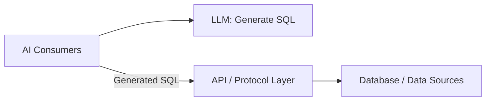
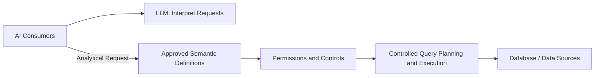

# 1. Executive Overview: Governed AI-Enabled Analytics and Data Mining

**Technical White Paper:** Governed AI-Enabled Analytics and Data Mining

**Status:** Proposed architecture for evaluation

**Document Version:** 2.1 (draft)

**Date:** 2026-09-17

**Author:** Andrew Bush / M&A Operating System

## Introduction

### About This Document

This technical white paper proposes an alternative approach to AI-enabled analytics and data mining in highly regulated and governed environments, where accuracy, traceability, and repeatability are critical. It is written for executives, architects, analytics leaders, and governance teams evaluating how to extend AI access to enterprise data.

The proposal combines AI interpretation with approved semantic definitions, controlled computation, and recorded evidence. The remaining sections explain the architecture, illustrate a technology stack, propose evaluation measures, examine Text-to-SQL risks, and discuss possible extensions. Examples are illustrative; this paper does not report deployment results or establish regulatory compliance.

## Table of Contents

- [The Proposed Approach](#the-proposed-approach)
- [Accuracy, Traceability, and Repeatability](#accuracy-traceability-and-repeatability)
- [Why Text-to-SQL Is Not the Long-Term Foundation](#why-text-to-sql-is-not-the-long-term-foundation)
- [How the Platform Works](#how-the-platform-works)
- [What Users Can Do](#what-users-can-do)
- [What the Organization Must Provide](#what-the-organization-must-provide)
- [Design Principles](#design-principles)
- [Implementation, Success, and Development](#implementation-success-and-development)
- [The Executive Decision](#the-executive-decision)

## The Proposed Approach

> **We propose a governed semantic execution layer that gives people and AI applications access to approved calculations and datasets.**

Business users need answers expressed in business terms: portfolio performance, risk exposure, liquidity, or operating outcomes. Those answers depend on agreed definitions, reliable source data, and permission to use it. When teams reconstruct those decisions for each report or request, they repeat work and risk producing different answers to the same business question.

The paper uses the name AI Analytics Platform for this proposed architecture. It makes approved analytical definitions reusable across conversations, applications, and automated analysis. A user asks a question through an existing interface. The platform identifies the approved calculation, checks access, executes it against registered sources, and returns the result with an explanation of how it was produced.

The platform sits above existing warehouses, data services, and specialist analytical engines. It requires supported connections and accurate mappings to those sources. Organizations can retain their existing investments while making governed analytics available to more consumers.

The proposed scope includes metric queries, drilldown, and bulk dataset retrieval. Responses include results, governed chart or table specifications, optional narrative summaries, and audit evidence. Consumer applications provide the user experience.

## Accuracy, Traceability, and Repeatability

The proposal addresses three distinct requirements. Each needs its own evidence before adoption.

| Requirement | Meaning and Proposed Basis |
|---|---|
| Accuracy | A result answers the intended question using the correct business definition and suitable source data. Approved formulas, request validation, and comparison with independently verified results support this requirement. Consistent execution alone does not establish correctness. |
| Traceability | An authorized reviewer can follow a result back to the request, definition versions, permissions, source references, and execution decisions. The proposed lineage record preserves those links under an agreed retention policy. |
| Repeatability | An authorized rerun using the same request, data snapshot, definitions, permissions, and calculation settings produces the same result within a declared numerical tolerance. Version and snapshot preservation make this test possible. |

For data mining, these requirements apply to the extracted dataset as well as to calculated metrics: which records and fields were supplied, under which selection rules, and from which source state. Subsequent model training or analysis requires its own validation.

## Why Text-to-SQL Is Not the Long-Term Foundation

> **We do not believe Text-to-SQL alone is a sustainable long-term foundation for AI-enabled analytics in a highly regulated organization.**

Text-to-SQL uses a large language model (LLM) to turn a question into a database query. These implementations are easy to stand up and quick to demonstrate: a model receives database schemas, generates a query, and returns an answer through a conversational interface. This makes them an attractive starting point for AI-enabled analytics and exploration.

The challenge is moving from a successful demonstration to recurring business metrics, data-mining workflows, automated decision inputs, and regulatory submissions. A convincing answer in a demonstration does not show that the calculation is correct, that a reviewer can trace it, or that an authorized rerun can repeat it. This paper proposes governed semantic execution as the alternative foundation for those workloads.

A generated query does not, by itself, establish which business definition was approved, which version applied, or whether the result can be reproduced. Database permissions and query validation can restrict execution, but they do not decide what a regulated metric means. Organizations still need accountable owners, approved formulas, controlled changes, and evidence linking each result to those decisions.

The proposed platform makes those requirements part of the execution process. AI selects from approved analytical definitions; deterministic software constructs and executes the calculation. This reduces reliance on the model inferring business meaning from physical schemas on each request.

### Two Approaches to AI-Enabled Analytics

Both approaches serve the same AI consumers: conversational assistants, autonomous agents, and custom applications. The difference is how a request becomes an executable calculation. These simplified diagrams show the request path, not response flows or deployment boundaries.

**Text-to-SQL Approach**

The consumer asks the LLM to generate SQL and submits that SQL through the interface for execution. The LLM has no direct connection to the database in this illustration.

**Governed Analytics Approach**

The governed path resolves the request against approved definitions, applies permissions and controls, and constructs the executable query in software. Each stage contributes to the analytical record. AI assists interpretation; it does not define the calculation at execution time.

The [Text-to-SQL appendix](./05-text-to-sql-antipattern.md) provides the detailed rationale for this position, including governance, reproducibility, security, and maintenance risks.

Text-to-SQL remains useful alongside the platform for controlled exploration and discovering new analytical needs. A shared conversational interface can support both paths, provided users can distinguish exploratory output from governed results. Useful exploratory calculations can become candidates for review and registration. AI may help draft those definitions; accountable people approve them before governed use.

## How the Platform Works

In a governed AI-enabled analytics situation, the Semantic Metrics Repository (SMR) provides a catalog of approved metrics, dimensions, operations, and dataset contracts. Each definition states what the analysis means, how it is calculated, and which data it uses. Versioning preserves the definition associated with a historical result.

A request follows a common sequence:

1. **Understand the question.** AI matches a natural-language request to registered operations and asks for clarification when needed. Applications that already know the required operation can submit it directly.
2. **Check permission and controls.** The platform checks identity, permitted metrics and data, query size, complexity, and compliance purpose before execution.
3. **Calculate the result.** The platform builds a query from approved definitions and executes it across supported sources. AI does not write the executable query or calculate the returned values.
4. **Present and record the answer.** The platform returns data with a governed presentation specification and an optional AI summary. It records the definitions, access decisions, and execution details needed to explain the result.

AI consumers connect through the Model Context Protocol (MCP), a standard interface for tools and data. The same controls apply to people using conversational assistants and to autonomous applications.

For a compliance-relevant metric requested for a compliance purpose, the design adds a signed evidence package and an export gate. Export remains blocked until the required evidence is sealed. This supports review; it does not replace the organization's approval process or establish regulatory compliance by itself.

Reproducibility depends on preserving the relevant data snapshot, definition versions, access policies, and calculation settings. A consistent formula cannot produce an identical historical result from changed source data.

## What Users Can Do

| User Need | Platform Response |
|---|---|
| A portfolio manager compares returns with a benchmark. | The platform applies the approved return definitions to authorized portfolios and returns a comparison with its calculation record. |
| A risk officer investigates a limit breach. | The platform combines registered risk and limit data, identifies breaches, and supports further investigation within the officer's permitted scope. |
| A research application retrieves historical positions. | The platform supplies an approved dataset, limits fields and rows to the application's permissions, and records the retrieval. |
| A treasury analyst prepares liquidity figures for a submission. | The platform calculates the approved liquidity coverage ratio and produces the additional evidence required by its compliance-purpose controls. |

These scenarios use the same governed service. Their differences are the approved operation, the caller's permissions, the requested output, and the evidence required.

## What the Organization Must Provide

> **The platform depends on accountable ownership of definitions, permissions, and source data.**

Data modelers describe the source data and its business meaning. Metrics modelers define calculations and dataset contracts. Analytics Governance approves definitions and oversees analytical quality. The Entitlements Manager maintains access policies, integration engineers connect sources, and platform administrators operate the service.

This work determines what the platform can answer. An unregistered business concept requires a reviewed definition before it becomes available through the governed path. Catalog coverage therefore grows through a maintained approval process.

The platform cannot correct an unsuitable formula or poor source data merely by executing consistently. Owners must establish data quality, freshness, retention, and acceptable uses. Security and compliance teams must validate the controls for the intended deployment.

## Design Principles

The following principles retain the identifiers used throughout the specification.

| Principle | Executive Meaning |
|---|---|
| **P1 - Semantic abstraction** | Users work with approved business concepts. Access to physical execution details is separately controlled. |
| **P2 - Controls before execution** | Requests must pass the required checks before data-source execution begins. |
| **P3 - Deterministic metric resolution** | Each metric resolves to an approved, versioned definition. |
| **P4 - Complete analytical lineage** | Accepted requests produce evidence of the definitions, decisions, and execution or failure involved. |
| **P5 - Role-aware by default** | Access requires explicit permission and is restricted to the caller's authorized data. |
| **P6 - Governed narrative** | AI summaries are checked against computed results and withheld when validation fails. |
| **P7 - Deterministic visualization** | Registered rules select the chart or table format for the result. |
| **P8 - Explainability at every layer** | Authorized users can inspect the interpretation, calculation, and supporting evidence. |
| **P9 - Administrator sovereignty within governance bounds** | Administrators configure the service within mandatory governance constraints. |
| **P10 - Deterministic computation, not generation** | Approved software computes values from registered definitions; AI interprets requests and summarizes results. |

## Implementation, Success, and Development

The architecture separates required behavior from technology choices. The proposed reference stack uses Python services, Starburst for federated query execution, PostgreSQL and object storage for policies and evidence, Redis for caching and concurrency, and language models for interpretation and summaries. These choices require validation against the organization's sources, scale, and operating requirements.

Success means that users obtain the analysis they need with approved definitions, appropriate access, and usable evidence. The organization should measure adoption, definition coverage, data freshness, response time, failures, cost, and the integrity of the audit record. Proposed targets require workload testing and a baseline; they are not demonstrated results.

The proposed roadmap extends the governed core with capabilities such as scheduled monitoring, alerts, saved queries, and collaboration. These are development proposals rather than commitments about current availability or delivery dates.

| Supporting Section | What It Adds |
|---|---|
| [2. Proposed Architecture and Capabilities](./02-core-capabilities.md) | Defines roles, component responsibilities, interfaces, and controls. |
| [3. Illustrative Reference Implementation](./03-technical-implementation.md) | Maps the capabilities to a proposed technology stack and illustrative implementation. |
| [4. Evaluation Framework](./04-success-metrics.md) | Defines tests for accuracy, traceability, and repeatability, together with proposed operating measures. |
| [5. Text-to-SQL Appendix](./05-text-to-sql-antipattern.md) | Examines why Text-to-SQL alone is insufficient for sustained governed analytics. |
| [6. Possible Extensions](./06-roadmap.md) | Describes candidate development beyond the governed core. |
| [7. Glossary](./07-glossary.md) | Defines the named components and technical terms. |

## The Executive Decision

> **Adoption requires commitment to a governed analytical service and the people who maintain its definitions and controls.**

A bounded evaluation should establish whether the proposed platform can serve a meaningful set of business questions across the required sources, enforce existing permissions, and produce evidence that reviewers can use. Leadership should name the accountable owners and agree the measures of success before that evaluation begins.

The decision to expand should follow evidence that users can obtain reliable analysis with less repeated definition and reconciliation work, while the organization retains control over access, calculation changes, and audit records.
