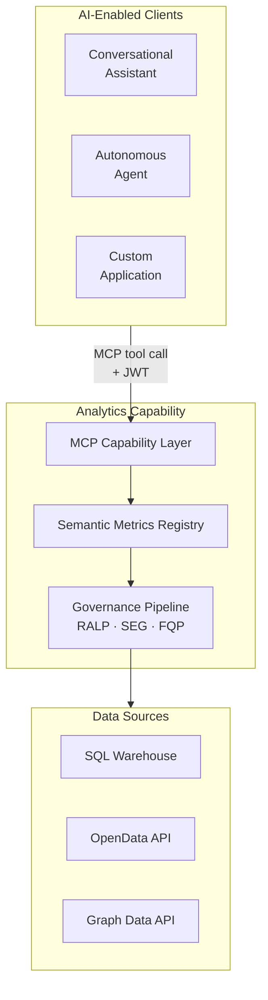

# 1. The Platform

## The Analytics Intelligence Problem

Regulated analytics has always depended on human experts — analysts, compliance officers, quant developers — to bridge business questions and raw data. Generative AI changes that. But the most common approach for applying it to analytics, Text-to-SQL, has structural flaws that get worse as the use cases become more demanding.

The Text-to-SQL pattern — feeding a natural language question and a physical database schema to a language model, then executing the generated SQL — is the default first step most organisations take. A working demonstration is achievable in hours on a well-structured schema. Simple aggregations are handled reliably. For exploratory data work, internal tooling, and low-stakes analytical sandboxes, the pattern is a legitimate option and can accelerate genuine productivity.

The problem is that the structural defects of Text-to-SQL are largely invisible at the demonstration stage and tolerable in early deployments. They surface when the system is asked to do what regulated analytics actually requires.

When a regulator asks how a specific number was calculated, "the AI wrote some SQL and this number came back" is not an answer. When a metric definition changes due to a regulatory update, there is no versioned definition to update, no approval workflow, and no audit trail of which formula version produced which historical result. When the same metric is queried by two analysts through two different session contexts, the question of whether they received definitions consistent with one another has no reliable answer. When a user's entitlements restrict them to a subset of portfolios, the restriction's reliability is bounded by the language model's ability to generate the correct WHERE clause — a constraint that can be circumvented by sufficiently crafted input and cannot be architecturally guaranteed.

The following table maps each structural concern to its Text-to-SQL disposition and to the disposition the AI Analytics Platform is designed to provide:

| Concern | Text-to-SQL | AI Analytics Platform |
|---------|------------|------------------------------|
| Metric consistency | ✗ — definitions inferred per query | ✓ — every metric resolves to exactly one versioned SMR definition |
| Schema security | ✗ — physical schema exposed to AI model | ✓ — physical schema never visible to AI model |
| Audit trail | ✗ — no reproducible calculation record | ✓ — full computation provenance for every result |
| Entitlement enforcement | ✗ — boundary is the database credential | ✓ — enforced at the semantic tier before any backend is contacted |
| Complex query accuracy | ✗ — degrades for regulated formulas, window functions | ✓ — complex metric formulas defined once in SMR, applied deterministically |
| Metric change management | ✗ — no versioned definitions | ✓ — SMR version-controls every definition with approval workflow |
| Scope control | ✗ — attempts to answer any question | ✓ — queries with unregistered metric IDs are rejected with structured error |
| Query cost governance | ✗ — LLM-generated SQL is unpredictable in cost | ✓ — cost estimated from LQP before execution; circuit breaker blocks excess |
| Multi-source federation | ✗ — limited to single SQL target | ✓ — FQP routes to SQL warehouses, OpenData APIs, Graph Data APIs, and more |

These are not quality tradeoffs resolvable through prompt engineering, guardrails, or SQL validation layers. They are structural properties of an architecture in which a language model is both the query interface and the query generator — an architecture in which the same channel carries user intent, data access logic, and physical schema exposure simultaneously. Patching these properties incrementally typically produces a brittle, prompt-dependent approximation of a semantic layer at substantially higher ongoing cost than building the semantic layer correctly from the start.

The AI Analytics Platform is the alternative architecture: one that constrains generative AI to the narrow tasks it performs reliably, and delegates everything that must be deterministic — metric definition, entitlement enforcement, query execution, lineage recording — to deterministic components.

---

## Platform Vision

The AI Analytics Platform is a **deterministic semantic computation engine**. Given a structured analytical query — metric identifiers, dimensions, time period, and filters resolved against the Semantic Metrics Registry — it always computes the same answer from the same data with the same entitlements in force. No probability, no sampling, no generation.

Generative AI has exactly two bounded roles. On the input side, the Semantic Intent Layer translates a natural-language question into a structured set of MCP tool call parameters — metric identifiers, dimension identifiers, time period, and filters — and outputs a validated JSON object. No metric values are produced at this step. On the output side, the Narrative Synthesis Engine writes a prose description of a computed result, constrained strictly to values present in the execution result. Every number in the response is the product of computation, not generation.

This architecture supports three consumer types, all served by the same governance pipeline. Conversational AI assistants reach the analytics engine via the MCP Capability Layer when a user asks a quantitative question in natural language. Autonomous agents and scheduled pipelines submit structured MCP tool calls directly, bypassing the natural-language translation layer and running pure deterministic code from first contact. Custom applications call the headless `POST /v1/mcp` endpoint directly, owning their own rendering and embedding governed results in purpose-built interfaces. The distinction between consumer types is irrelevant to the governance pipeline; entitlements, lineage, and semantic abstraction apply equally to all three.

The following table defines the platform's scope and nature precisely:

| It is | It is not |
|-------|-----------|
| A deterministic semantic computation engine — same query + data + entitlements → same result | A generative AI product — AI narrates results, the engine computes them |
| A headless MCP API returning structured JSON result sets and SCL display specifications | A general-purpose SQL interface, BI tool replacement, or rendering layer |
| A governed Semantic Metrics Registry — all AI-accessible metrics are registered, versioned, and owned | A system that allows LLMs to generate arbitrary SQL against physical schemas |
| A federated query planner routing governed plans to SQL warehouses, OpenData APIs, Graph APIs, and any registered backend | A single-engine analytics layer |
| A role-aware entitlement layer enforced at the semantic tier before execution | A system relying on database-level access controls as the primary AI security boundary |

The platform's architecture is explicitly headless. Every analytical request returns a structured JSON result set, an SCL display specification, and optionally a governed narrative. Rendering is a consumer responsibility. This design reflects a deliberate judgment: rendering is best done close to the user interface, where the consuming application controls layout, branding, accessibility, and interaction model. The governance pipeline ends at the API boundary; what follows is the consumer's domain.

---

## Design Principles

Ten non-negotiable principles govern all design decisions for the AI Analytics Platform. Where a proposed feature conflicts with a principle, the principle takes precedence over the feature. Where two principles appear to conflict with one another, the resolution mechanism is specified in each case. These principles are not aspirational — they are architectural constraints that shape every component and every interface.

| Principle | What it means | Key consequence |
|-----------|--------------|-----------------|
| **P1 — Semantic abstraction** | The platform never exposes physical schemas, table names, or column names to AI models or end users. All AI interaction is mediated through the Semantic Metrics Registry. There is no escape hatch to raw SQL. | Unregistered concepts cannot be queried. Schema leakage is impossible by design, not by policy. |
| **P2 — Governance before execution** | Every analytical query passes through the full governance pipeline before any physical execution begins. Governance is a pre-execution gate, not a post-processing filter. There is no fast path. | The execution sequence — Intent → SMR Resolution → Role Projection → Validation → Governance → FQP → Execution — is invariant. Governance decisions are logged before any backend is contacted. |
| **P3 — Deterministic metric resolution** | A metric name resolves to exactly one governed definition for a given tenant at a given point in time. There are no context-dependent interpretations of metric semantics. "Portfolio Return" means the same thing in every query, every report, and every regulatory submission — or it is a bug. | Metric definitions are version-controlled in the SMR. Unregistered metrics return a resolution error, never an inferred definition. |
| **P4 — Complete analytical lineage** | This is not data lineage — ETL pipelines and source-to-warehouse flows are a separate concern. This is computation provenance: a complete, queryable record of exactly how the analytics engine used individual data elements to calculate a specific response. | Every result carries a full lineage chain — intent, resolved definitions, role projection, query plans, raw responses, governance decisions, and display specification. Lineage is written atomically with the result. |
| **P5 — Role-aware by default** | The platform applies entitlements without opt-in. `defaultDenyAll: true` is the platform-recommended configuration. An unauthenticated or unentitled query is blocked before any resolution occurs. | JWT validation and role claim extraction happen before any analytical processing begins. Row predicates are injected at the physical query level, not applied as a post-processing filter. |
| **P6 — Governed narrative** | Narrative synthesis is anchored exclusively to values present in the execution result. The LLM may not introduce metric values, comparisons, or interpretations not directly derivable from the result set. Hallucinated financial metrics are a regulatory and reputational risk. | The narrative prompt is constructed from the execution result only. Post-generation validation checks every numeric value against the result set and triggers regeneration if any are absent. |
| **P7 — Deterministic visualisation** | Chart type selection is governed by the Visualisation Ontology — a registered set of chart contracts that map result schemas and intent patterns to chart configurations. The LLM does not select chart types. | The same analytical pattern always produces the same chart type across users, sessions, and time. LLM chart preferences are treated as intent signals only; the Visualisation Ontology decides. |
| **P8 — Explainability at every layer** | Users and compliance functions must be able to understand what was queried, why, and with what results at every layer of the analytical stack. Opacity is unacceptable in regulated financial analytics. | The intent confirmation card shows resolved intent before execution; the lineage inspector exposes every step in human-readable form. Metric definitions are accessible to any authenticated user within their entitlement scope. |
| **P9 — Administrator sovereignty within governance bounds** | Platform administrators have authority over analytical configuration — data sources, SMR content, entitlements, and governance thresholds. Within those bounds, administrators are in control. | Administrators may raise governance thresholds above platform minimums but not below them. There is no bypass mode. |
| **P10 — Deterministic computation, not generation** | Analytical results are computed from registered metric definitions applied to data retrieved from execution backends. They are never generated by an AI model. If a consumer submits a structured MCP tool call directly — explicit metric identifiers, dimensions, and filters with no natural language — the Semantic Intent Layer is bypassed entirely, and the pipeline is pure deterministic code from first contact. | The same structured query, with the same entitlements and data, always returns the same result. If a result is wrong, the lineage record identifies the cause — incorrect data, an incorrect SMR definition, or an incorrect intent translation. |

### Principle Interactions

Several of these principles create natural tensions with product requirements that arise in practice. Each tension has a defined resolution; the table below documents the most common cases.

| Principle | Most common tension | Resolution |
|-----------|--------------------|-----------| 
| P1 (semantic abstraction) vs query expressiveness | Users want logic not in the SMR | Add the concept to the SMR — a governance task, not a platform limitation |
| P2 (governance before execution) vs query latency | Governance adds latency | Governance checks optimised for sub-100ms; entitlement projections cached per session |
| P3 (deterministic resolution) vs metric evolution | Metric definitions change | SMR version-controls definitions; lineage records preserve definition version at query time |
| P4 (complete lineage) vs storage cost | Lineage records consume storage | Retention is tenant-configurable; compressed format for long-term storage |
| P6 (governed narrative) vs narrative quality | Strict anchoring may reduce fluency | Quality improves with richer result sets; constraint prevents hallucination |
| P7 (deterministic visualisation) vs user chart preferences | Users prefer different chart types | Override mechanism for Power Analysts — overrides logged in lineage |
| P8 (explainability) vs UX simplicity | Full lineage may overwhelm casual users | Lineage inspector is progressive disclosure — collapsed by default |
| P9 (administrator sovereignty) vs P2 (governance before execution) | Admins want to bypass governance | Governance minimums are absolute — no bypass mode |

The first and last entries are the most consequential. When a business concept cannot be queried, the resolution is to register it in the SMR — a governed addition subject to approval workflow and version control, not an ad hoc inference. That tension is productive: it is how the platform's analytical vocabulary grows.

The tension between P9 and P2 is different in kind. There is no internal tooling path that bypasses the governance pipeline. Governance minimums are architectural properties of the platform, not configurable thresholds.

---

## The Architecture in Practice

Every consumer type routes through the MCP Capability Layer, traverses the invariant governance sequence, and produces a lineage record. No path to execution backends, physical schemas, or raw SQL exists outside that pipeline. Subsequent chapters describe each component in detail; the principles established here are the reference frame throughout.
