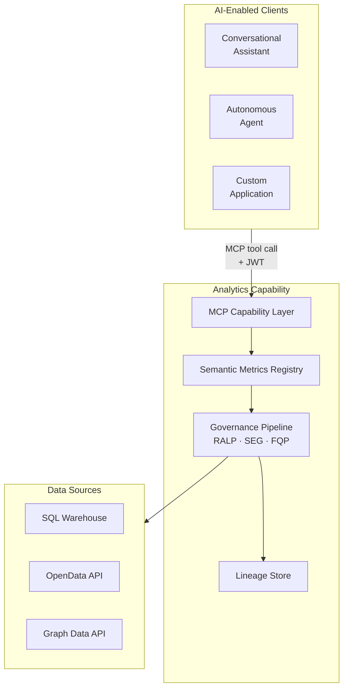

# 1. The Platform

## The Analytics Intelligence Problem

Enterprise analytics in regulated environments has long operated under a tacit compact: business logic lives in code, data lives in databases, and humans — analysts, compliance officers, quant developers — bridge the two. Generative AI breaks that compact in a way that creates genuine efficiency, but the most obvious mechanism for applying it to analytics introduces structural defects that compound with precisely the use cases that matter most.

The Text-to-SQL pattern — feeding a natural language question and a physical database schema to a language model, then executing the generated SQL — is the default first step most organisations take. A working demonstration is achievable in hours on a well-structured schema. Simple aggregations are handled reliably. For exploratory data work, internal tooling, and low-stakes analytical sandboxes, the pattern is a legitimate option and can accelerate genuine productivity.

The problem is that the structural defects of Text-to-SQL are largely invisible at the demonstration stage and tolerable in early deployments. They surface when the system is asked to do what regulated analytics actually requires.

When a regulator asks how a specific number was calculated, "the AI wrote some SQL and this number came back" is not an answer. When a metric definition changes due to a regulatory update, there is no versioned definition to update, no approval workflow, and no audit trail of which formula version produced which historical result. When the same metric is queried by two analysts through two different session contexts, the question of whether they received definitions consistent with one another has no reliable answer. When a user's entitlements restrict them to a subset of portfolios, the restriction's reliability is bounded by the language model's ability to generate the correct WHERE clause — a constraint that can be circumvented by sufficiently crafted input and cannot be architecturally guaranteed.

The following table maps each structural concern to its Text-to-SQL disposition and to the disposition the AI Analytics Platform is designed to provide:

| Concern | Text-to-SQL | AI Analytics Platform |
|---------|------------|------------------------------|
| Metric consistency | ✗ — definitions inferred per query | ✓ — every metric resolves to exactly one versioned SMR definition |
| Schema security | ✗ — physical schema exposed to AI model | ✓ — physical schema never visible to AI model |
| Audit trail | ✗ — no reproducible calculation record | ✓ — full computation provenance for every result |
| Entitlement enforcement | ✗ — boundary is the database credential | ✓ — enforced at the semantic tier before any backend is contacted |
| Complex query accuracy | ✗ — degrades for regulated formulas, window functions | ✓ — complex metric formulas defined once in SMR, applied deterministically |
| Metric change management | ✗ — no versioned definitions | ✓ — SMR version-controls every definition with approval workflow |
| Scope control | ✗ — attempts to answer any question | ✓ — queries with unregistered metric IDs are rejected with structured error |
| Query cost governance | ✗ — LLM-generated SQL is unpredictable in cost | ✓ — cost estimated from LQP before execution; circuit breaker blocks excess |
| Multi-source federation | ✗ — limited to single SQL target | ✓ — FQP routes to SQL warehouses, OpenData APIs, Graph Data APIs, and more |

These are not quality tradeoffs resolvable through prompt engineering, guardrails, or SQL validation layers. They are structural properties of an architecture in which a language model is both the query interface and the query generator — an architecture in which the same channel carries user intent, data access logic, and physical schema exposure simultaneously. Patching these properties incrementally typically produces a brittle, prompt-dependent approximation of a semantic layer at substantially higher ongoing cost than building the semantic layer correctly from the start.

The AI Analytics Platform is the alternative architecture: one that constrains generative AI to the narrow tasks it performs reliably, and delegates everything that must be deterministic — metric definition, entitlement enforcement, query execution, lineage recording — to deterministic components.

---

## Platform Vision

The AI Analytics Platform is a **deterministic semantic computation engine**. Given a structured analytical query — metric identifiers, dimensions, time period, and filters resolved against the Semantic Metrics Registry — it always computes the same answer from the same data with the same entitlements in force. No probability, no sampling, no generation. The same query, submitted at the same point in time with the same underlying data and the same role claims, returns the same result. This property is not incidental; it is the primary design goal, and every architectural decision subordinates itself to preserving it.

Generative AI has exactly two bounded roles in this architecture. On the input side, the Semantic Intent Layer uses a language model to translate a natural-language question into a structured set of MCP tool call parameters — metric identifiers, dimension identifiers, time period, and filters. The output of this step is a validated JSON object; no metric values are produced. On the output side, the Narrative Synthesis Engine uses a language model to write a prose description of a computed result, strictly constrained to values present in the execution result. Every number in every analytical result is the product of computation. No number is the product of generation.

This architecture supports three consumer types simultaneously, and the same governance pipeline serves all three identically. Conversational AI assistants — such as the AI Chat Platform — reach the analytics engine via the MCP Capability Layer when a user asks a quantitative question in natural language. Autonomous agents and scheduled pipelines submit structured MCP tool calls directly, bypassing the natural-language translation layer entirely and operating on pure deterministic code from first contact. Custom applications call the headless `POST /v1/mcp` endpoint directly, owning their own rendering and embedding governed analytical results within purpose-built interfaces. The distinction between consumer types is irrelevant to the governance pipeline; entitlements, lineage, and semantic abstraction apply equally to all three.

The following table defines the platform's scope and nature precisely:

| It is | It is not |
|-------|-----------|
| A deterministic semantic computation engine — same query + data + entitlements → same result | A generative AI product — AI narrates results, the engine computes them |
| A headless MCP API returning structured JSON result sets and SCL display specifications | A general-purpose SQL interface, BI tool replacement, or rendering layer |
| A governed Semantic Metrics Registry — all AI-accessible metrics are registered, versioned, and owned | A system that allows LLMs to generate arbitrary SQL against physical schemas |
| A federated query planner routing governed plans to SQL warehouses, OpenData APIs, Graph APIs, and any registered backend | A single-engine analytics layer |
| A role-aware entitlement layer enforced at the semantic tier before execution | A system relying on database-level access controls as the primary AI security boundary |

The platform's architecture is explicitly headless. Every analytical request returns a structured JSON result set, an SCL display specification, and optionally a governed narrative. Rendering is a consumer responsibility. This design reflects a deliberate judgment: rendering is best done close to the user interface, where the consuming application controls layout, branding, accessibility, and interaction model. The governance pipeline ends at the API boundary; what follows is the consumer's domain.

---

## Design Principles

Ten non-negotiable principles govern all design decisions for the AI Analytics Platform. Where a proposed feature conflicts with a principle, the principle takes precedence over the feature. Where two principles appear to conflict with one another, the resolution mechanism is specified in each case. These principles are not aspirational — they are architectural constraints that shape every component and every interface.

| Principle | What it means | Key consequence |
|-----------|--------------|-----------------|
| **P1 — Semantic abstraction** | The platform never exposes physical schemas, table names, or column names to AI models or end users. All AI interaction is mediated through the Semantic Metrics Registry. There is no escape hatch to raw SQL. | If a business concept is not registered in the SMR, it is not queryable. Physical query generation is entirely the responsibility of the Federated Query Planner. The LLM has no access to or knowledge of physical schemas. Schema leakage — even partial — is a security and governance violation, made impossible by architecture rather than by policy enforcement alone. |
| **P2 — Governance before execution** | Every analytical query passes through the full governance pipeline before any physical execution begins. Governance is a pre-execution gate, not a post-processing filter. There is no fast path. | The execution sequence is invariant: Intent → SMR Resolution → Role Projection → Validation → Governance → FQP → Execution. No step may be skipped. Governance decisions are logged before the query reaches an execution backend. Governance configuration changes take effect on the next query; there is no cache of pre-governance query plans. |
| **P3 — Deterministic metric resolution** | A metric name resolves to exactly one governed definition for a given tenant at a given point in time. There are no context-dependent interpretations of metric semantics. "Portfolio Return" means the same thing in every query, every report, and every regulatory submission — or it is a bug. | Metric definitions in the SMR are version-controlled. The LLM may not infer metric definitions from context. If a metric is not in the SMR, the platform returns a resolution error — not an inferred or approximated definition. |
| **P4 — Complete analytical lineage** | This is not data lineage — ETL pipelines and source-to-warehouse flows are a separate concern. This is computation provenance: a complete, queryable record of exactly how the analytics engine used individual data elements to calculate a specific response. | Every result has a complete lineage chain as a first-class artefact: the original intent, resolved metric and dimension definitions at their SMR version, role projection record, Logical Query Plan, per-backend sub-plans and raw responses, assembled result, governance decisions, and SCL display specification. Lineage records are written atomically with the result; a result with no lineage record is a platform defect. |
| **P5 — Role-aware by default** | The platform applies entitlements without opt-in. `defaultDenyAll: true` is the platform-recommended configuration. An unauthenticated or unentitled query is blocked before any resolution occurs. | JWT validation and role claim extraction occur before any analytical processing begins. Row predicates are injected at the physical query level — not as a post-processing filter that could leak data via error messages. If a user's role changes mid-session, new entitlements apply to subsequent queries immediately. |
| **P6 — Governed narrative** | Narrative synthesis is anchored exclusively to values present in the execution result. The LLM may not introduce metric values, comparisons, or interpretations not directly derivable from the result set. Hallucinated financial metrics are a regulatory and reputational risk. | The narrative synthesis prompt is constructed from the execution result, not a free-form query context. A system constraint prohibits the introduction of external figures from training data. Post-generation validation checks for numeric values in the narrative that do not appear in the result set; any such values trigger regeneration. |
| **P7 — Deterministic visualisation** | Chart type selection is governed by the Visualisation Ontology — a registered set of chart contracts that map result schemas and intent patterns to chart configurations. The LLM does not select chart types. | The same analytical pattern always produces the same chart type across users, sessions, and time. Chart contract parameters are derived algorithmically from the result schema, not inferred by the LLM. The LLM may express an intent that suggests a chart preference; the Visualisation Ontology makes the final selection, treating the LLM suggestion as an intent signal rather than a rendering instruction. |
| **P8 — Explainability at every layer** | Users and compliance functions must be able to understand what was queried, why, and with what results at every layer of the analytical stack. Opacity is unacceptable in regulated financial analytics. | The intent confirmation card shows the user the resolved analytical intent before execution. The lineage inspector exposes every step of the execution chain in a structured, human-readable format. Governance decisions are explained in plain language. SMR metric definitions are accessible to any authenticated user within their entitlement scope. |
| **P9 — Administrator sovereignty within governance bounds** | Platform administrators have authority over analytical configuration — data sources, SMR content, entitlements, and governance thresholds. Within those bounds, administrators are in control. | Platform-managed governance — no raw query passthrough, mandatory lineage, role-aware projection, semantic abstraction — is non-overridable. Administrators may raise governance thresholds above platform minimums but may not lower them below those minimums. There is no governance bypass mode. |
| **P10 — Deterministic computation, not generation** | Analytical results are computed from registered metric definitions applied to data retrieved from execution backends. They are never generated by an AI model. If a consumer submits a structured MCP tool call directly — explicit metric identifiers, dimensions, and filters with no natural language — the Semantic Intent Layer is bypassed entirely, and the pipeline is pure deterministic code from first contact. | The same structured query, submitted at the same point in time with the same entitlements and the same underlying data, always returns the same result. The computation layer has zero non-determinism. If a result is wrong, the cause is incorrect data in the execution backend, an incorrect metric definition in the SMR, or an incorrect intent translation — all of which are diagnosable from the lineage record. None are hallucination. |

### Principle Interactions

Several of these principles create natural tensions with product requirements that arise in practice. Each tension has a defined resolution; the table below documents the most common cases.

| Principle | Most common tension | Resolution |
|-----------|--------------------|-----------| 
| P1 (semantic abstraction) vs query expressiveness | Users want logic not in the SMR | Add the concept to the SMR — a governance task, not a platform limitation |
| P2 (governance before execution) vs query latency | Governance adds latency | Governance checks optimised for sub-100ms; entitlement projections cached per session |
| P3 (deterministic resolution) vs metric evolution | Metric definitions change | SMR version-controls definitions; lineage records preserve definition version at query time |
| P4 (complete lineage) vs storage cost | Lineage records consume storage | Retention is tenant-configurable; compressed format for long-term storage |
| P6 (governed narrative) vs narrative quality | Strict anchoring may reduce fluency | Quality improves with richer result sets; constraint prevents hallucination |
| P7 (deterministic visualisation) vs user chart preferences | Users prefer different chart types | Override mechanism for Power Analysts — overrides logged in lineage |
| P8 (explainability) vs UX simplicity | Full lineage may overwhelm casual users | Lineage inspector is progressive disclosure — collapsed by default |
| P9 (administrator sovereignty) vs P2 (governance before execution) | Admins want to bypass governance | Governance minimums are absolute — no bypass mode |

The first and last entries in this table are the most consequential. The tension between semantic abstraction and query expressiveness is not a limitation of the platform; it is the mechanism by which the SMR accumulates governed definitions over time. Every business concept that cannot yet be queried is a candidate for SMR registration — a governed addition to the platform's analytical vocabulary, subject to approval workflow and version control, rather than an ad hoc inference at query time. The tension between administrator sovereignty and the governance-before-execution principle reflects the most common pressure point in regulated deployments: the desire for an internal tooling path that bypasses the governance pipeline. That path does not exist. The governance minimums are not configurable thresholds; they are architectural properties of the platform.

---

## The Architecture in Practice

These principles converge on a single architectural outcome: no consumer — conversational assistant, autonomous agent, or custom application — has a path to execution backends, physical schemas, or raw SQL that bypasses the governance pipeline. Every analytical request routes through the MCP Capability Layer and traverses the invariant sequence described in P2. The Analytical Lineage Store records every invocation regardless of consumer type, consumer identity, or whether the request originated in natural language or as a pre-structured tool call.

The ten principles described in this chapter are not independent. P1 (semantic abstraction) and P10 (deterministic computation) jointly define the boundary between what generative AI does and what the computation engine does. P2 (governance before execution) and P5 (role-aware by default) jointly define when and how entitlements are enforced. P3 (deterministic metric resolution) and P4 (complete analytical lineage) jointly define the auditability guarantee — consistent definitions across queries, and a complete record of which definition at which version produced each result. P6 (governed narrative) and P7 (deterministic visualisation) jointly define how the output side of the pipeline constrains generative AI to roles where it cannot introduce non-determinism into results.

Subsequent chapters describe each component of the execution pipeline in detail: the Semantic Metrics Registry and its governance model, the Analytical Intent Validator and the Logical Query Plan format, the Federated Query Planner and its backend adapter model, the Visualisation Ontology and Semantic Charting Language, the Role-Aware Projection Layer, the Narrative Synthesis Engine, and the Analytical Lineage Store. Throughout those chapters, the principles established here serve as the reference frame: when a design decision is explained by appeal to a principle, the consequence described in this chapter is the architectural justification.
