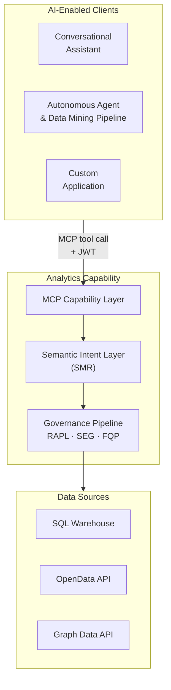

# 1. The Platform

## The Analytics Intelligence Problem

Large financial services organisations (asset managers, investment banks, insurance firms, regulatory reporting units) operate on analytically complex, regulation-sensitive data. Portfolio managers compare risk-adjusted returns across hundreds of strategies against regulated benchmarks. Risk officers monitor VaR breaches across multiple entities in real time. Compliance analysts prepare LCR and NSFR submissions under Basel III/IV, MiFID II, and SEC Regulation BI. All of these decisions depend on metrics that are not simple aggregations: they are versioned, regulated, formula-specific computations that must be calculated identically across every report, every system, and every user session. Any deviation is an error.

The consequence of this complexity is a structural bottleneck. Business users (portfolio managers, risk officers, compliance analysts) cannot access the data they need without going through a specialist intermediary. Quantitative developers translate business requirements into SQL. Data engineers maintain the pipelines. Analysts mediate between business questions and physical data. This is not a resourcing problem; it is an architectural one. The interface between business intent and governed data is so technically demanding that it requires dedicated expertise at every step. Decision-making slows to the analysts' capacity. Strategic questions queue behind routine reporting. Insight arrives days or weeks after the moment it was needed.

The regulatory dimension sharpens this. In a governed financial services organisation, an analytical result is not just a number: it is an assertion. When a regulator asks how a capital ratio was calculated, the answer must be reproducible, version-controlled, and complete. When a metric definition changes due to a regulatory update, every historical result produced under the prior definition must be identifiable and traceable. When the same metric appears in submissions to two regulators across two jurisdictions, it must resolve to exactly the same formula. These are not quality aspirations. They are legal requirements. An organisation that cannot produce computation provenance for its regulatory submissions is not merely technically incomplete. It is legally exposed.

Large language models make this translation feasible at scale. A portfolio manager can ask "show me portfolio returns versus benchmark for my equity portfolios this quarter" in plain English and receive a governed, role-constrained, auditable analytical result. The AI handles the translation from business intent to structured query. The platform handles everything that must be deterministic. The analyst bottleneck breaks. Regulatory requirements hold.

The most commonly observed first attempt at this capability is the Text-to-SQL pattern: a language model receives a natural language question alongside a physical database schema and generates SQL directly. For exploratory, low-stakes, and ad hoc work it is a legitimate starting point. For governed large-scale analytics in regulated financial services it is the wrong execution foundation: there is no versioned metric definition to audit, no reproducible calculation record, and no architectural guarantee on entitlement enforcement. The [Text-to-SQL appendix](./07-text-to-sql-antipattern.md) examines the structural failure modes and describes the complementary architecture where both tools coexist.

The AI Analytics Platform is a different architecture, purpose-built for governed large-scale analytics and data mining in regulated environments:

| Enterprise analytical challenge | Platform response |
|---|---|
| Metric consistency across users, reports, and regulatory submissions | Every metric resolves to exactly one versioned SMR definition — "Portfolio Return" means the same thing in every context |
| Computation provenance for regulatory review | Full lineage record for every result: intent → definitions → entitlements → plan → execution → result |
| Entitlement enforcement for sensitive financial data | Enforced at the semantic tier before any backend is contacted — not bounded by SQL generation reliability |
| Complex regulated formulas (VaR, LCR, BHB attribution) | Defined once in the SMR, computed deterministically — not re-inferred per query |
| Metric governance and change management | SMR version-controls every definition with approval workflow and audit trail |
| Physical schema protection from AI models | Schema never exposed — all AI interaction mediated through the Semantic Metrics Registry |
| Query cost governance for enterprise warehouses | Cost estimated from Logical Query Plan before execution; circuit breaker blocks excess spend |
| Multi-source analytical federation | Federated Query Planner routes governed plans to SQL warehouses, OpenData APIs, Graph Data APIs, and any registered backend |
| Large dataset return to AI agents and data mining pipelines | Governed paginated dataset retrieval under the same entitlement, lineage, and cost governance as metric queries |

---

## Architectural Model

The **Analytics Engine** is a deterministic semantic computation engine: given explicit metric identifiers, dimensions, time period, and filters resolved against the Semantic Metrics Registry, it always computes the same answer from the same data with the same entitlements in force. No probability, no sampling, no generation affects the computed values. The computation pipeline — metric resolution, entitlement projection, query planning, execution — contains no AI.

AI has two roles in the analytical pipeline. The primary role lives in the consuming AI client: it reads the metric and operation catalogue from the Analytics Engine's SMR resources, translates a natural-language question into explicit, structured MCP tool call parameters, and submits those to the Analytics Engine. The secondary role lives inside the Analytics Engine itself: after computation completes, the Narrative Synthesis Engine makes a targeted call to a language model to summarise the structured result in plain text, anchored strictly to computed values. The NSE cannot introduce metric values, comparisons, or interpretations not present in the result set.

The platform scope covers three result types, all produced under the same governance pipeline:

- **Governed metric queries** — computed metric values, aggregated according to versioned SMR definitions, with SCL display specification and optional narrative
- **Governed data retrieval** — raw, paginated, role-filtered datasets returned to AI agents and data mining pipelines; full lineage and entitlement enforcement apply identically
- **Governed drilldown** — hierarchical traversal of an analytical result, preserving the full entitlement and lineage context of the originating query

This architecture supports three consumer types. Conversational AI assistants load the metric catalogue, translate natural language to structured parameters, and call the Analytics Engine. Autonomous agents, scheduled pipelines, and data mining workflows submit structured tool calls directly — including large paginated dataset requests — with no natural language translation needed. Custom applications call the Analytics Engine directly. The governance pipeline is identical for all three; entitlements, lineage, and semantic abstraction apply unconditionally.

The following table defines the Analytics Engine's scope precisely:

| It is | It is not |
|-------|-----------|
| A deterministic semantic computation engine — same query + data + entitlements → same computed result | An AI product — computation is always deterministic; the Narrative Synthesis Engine is a constrained post-computation summariser, not a query generator |
| A governed large-scale analytics and data mining platform — metric queries, large dataset retrieval, and drilldown under a unified governance pipeline | A general-purpose SQL interface, BI tool replacement, or rendering layer |
| A headless MCP server returning structured result sets, SCL display specifications, and governed large dataset payloads to AI agents | A system that accepts natural language or allows LLMs to generate arbitrary SQL |
| A governed Semantic Metrics Registry — all queryable metrics are registered, versioned, and owned | A system that infers metric definitions at query time |
| A federated query planner routing governed plans to SQL warehouses, OpenData APIs, Graph APIs, and any registered backend | A single-engine analytics layer |
| A role-aware entitlement layer enforced at the semantic tier before execution | A system where database-level ACLs are the primary AI security boundary |

---

## Design Principles

Ten non-negotiable principles govern all design decisions. Where a proposed feature conflicts with a principle, the principle takes precedence. Where two principles conflict, the resolution is documented in the Principle Interactions table below.

| Principle | What it means | Key consequence |
|-----------|--------------|-----------------|
| **P1 — Semantic abstraction** | The platform never exposes physical schemas, table names, or column names to AI models or end users. All AI interaction is mediated through the Semantic Metrics Registry. There is no escape hatch to raw SQL. | Unregistered concepts cannot be queried. Schema leakage is impossible by design, not by policy. |
| **P2 — Governance before execution** | Every query passes through the full governance pipeline before any physical execution begins. Governance is a pre-execution gate, not a post-processing filter. There is no fast path. | The execution sequence — Intent → SMR Resolution → Role Projection → Validation → Governance → FQP → Execution — is invariant. Governance decisions are logged before any backend is contacted. |
| **P3 — Deterministic metric resolution** | A metric name resolves to exactly one governed definition for a given tenant at a given point in time. There are no context-dependent interpretations of metric semantics. "Portfolio Return" means the same thing in every query, every report, and every regulatory submission under the same metric version. Any unintended variation under the same version is a bug; version upgrades are governed changes. | Metric definitions are version-controlled in the SMR. Unregistered metrics return a resolution error, never an inferred definition. |
| **P4 — Complete analytical lineage** | This is not data lineage. ETL pipelines and source-to-warehouse flows are a separate concern. This is computation provenance: a complete, queryable record of exactly how the analytics engine used individual data elements to calculate a specific response. | Every result carries a full lineage chain: intent, resolved definitions, role projection, query plans, raw responses, governance decisions, and display specification. Lineage is written atomically with the result. |
| **P5 — Role-aware by default** | The platform applies entitlements without opt-in. `defaultDenyAll: true` is the platform-recommended configuration. An unauthenticated or unentitled request is blocked before any resolution occurs. | JWT validation and role claim extraction happen before any analytical processing begins. Row predicates are injected at the physical query level, not applied as a post-processing filter. |
| **P6 — Governed narrative** | Narrative synthesis is anchored exclusively to values present in the execution result. The LLM may not introduce metric values, comparisons, or interpretations not directly derivable from the result set. Hallucinated financial metrics are a regulatory and reputational risk. | The narrative prompt is constructed from the execution result only. Post-generation validation checks verbatim numeric literals in the narrative against the result set and triggers regeneration if any are absent. |
| **P7 — Deterministic visualisation** | Chart type selection is governed by the Visualisation Ontology: a registered set of chart contracts that map result schemas and intent patterns to chart configurations. The LLM does not select chart types. | The same analytical pattern always produces the same chart type across users, sessions, and time. LLM chart preferences are treated as intent signals only; the Visualisation Ontology decides. |
| **P8 — Explainability at every layer** | Users and compliance functions must be able to understand what was queried, why, and with what results at every layer of the analytical stack. Opacity is unacceptable in regulated financial analytics. | The intent confirmation card shows resolved intent before execution; the lineage inspector exposes every step in human-readable form. Metric definitions are accessible to any authenticated user within their entitlement scope. |
| **P9 — Administrator sovereignty within governance bounds** | Platform administrators have authority over analytical configuration: data sources, SMR content, entitlements, and governance thresholds. Within those bounds, administrators are in control. | Administrators may raise governance thresholds above platform minimums but not below them. There is no bypass mode. |
| **P10 — Deterministic computation, not generation** | Analytical results are computed from registered metric definitions applied to data retrieved from execution backends. They are never generated by an AI model. If a consumer submits a structured MCP tool call directly, the NL translation step in the Semantic Intent Layer is bypassed; RAPL, SEG, FQP, and lineage remain fully active. | The same structured query, with the same entitlements and data, always returns the same result. If a result is wrong, the lineage record identifies the cause: incorrect data, an incorrect SMR definition, or an incorrect intent translation. |

### Principle Interactions

Several principles create natural tensions with product requirements. Each tension has a defined resolution.

| Principle | Most common tension | Resolution |
|-----------|--------------------|-----------| 
| P1 (semantic abstraction) vs query expressiveness | Users want logic not in the SMR | Add the concept to the SMR: a governance task, not a platform limitation |
| P2 (governance before execution) vs query latency | Governance adds latency | Governance tier checks (RAPL + SEG) target sub-100ms; entitlement projections cached per session |
| P3 (deterministic resolution) vs metric evolution | Metric definitions change | SMR version-controls definitions; lineage records preserve definition version at query time |
| P4 (complete lineage) vs storage cost | Lineage records consume storage | Retention is tenant-configurable; compressed format for long-term storage |
| P6 (governed narrative) vs narrative quality | Strict anchoring may reduce fluency | Quality improves with richer result sets; constraint prevents hallucination |
| P7 (deterministic visualisation) vs user chart preferences | Users prefer different chart types | Override mechanism for Power Analysts; overrides logged in lineage |
| P8 (explainability) vs UX simplicity | Full lineage may overwhelm casual users | Lineage inspector uses progressive disclosure — collapsed by default |
| P9 (administrator sovereignty) vs P2 (governance before execution) | Admins want to bypass governance | Governance minimums are absolute — no bypass mode |

The first and last entries are the most consequential. When a business concept cannot be queried, the resolution is to register it in the SMR: a governed addition subject to approval workflow and version control, not an ad hoc inference. That tension is productive; it is how the platform's analytical vocabulary grows.

The tension between P9 and P2 is different in kind. There is no internal tooling path that bypasses the governance pipeline. Governance minimums are architectural properties of the platform, not configurable thresholds.

---

## The Architecture in Practice

Every consumer type routes through the MCP Capability Layer, traverses the invariant governance sequence, and produces a lineage record. No path to execution backends, physical schemas, or raw SQL exists outside that pipeline. Subsequent chapters describe each component in detail; the principles established here are the reference frame throughout.

- [Chapter 2](./02-personas-and-architecture.md) — Consumer personas and illustrative query journeys
- [Chapter 3](./03-core-capabilities.md) — Component specifications: SMR, SIL, RAPL, SEG, FQP, Visualisation Ontology, NSE, Lineage Store, MCP Capability Layer
- [Chapter 4](./04-integration-and-deployment.md) — Integration, deployment, and platform administration
- [Chapter 5](./05-technical-implementation.md) — Reference implementation stack
- [Chapter 6](./06-success-metrics.md) — Platform and governance success metrics
