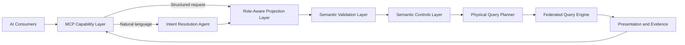

# 2. Proposed Architecture and Capabilities

## Purpose and Boundaries

This section defines the proposed logical architecture for governed AI-enabled analytics and data mining. It explains each component's responsibility and the contracts between components. [Section 3](./03-technical-implementation.md) maps these responsibilities to an illustrative technology stack and provides detailed schemas, interfaces, and configuration examples.

The design separates AI-assisted interpretation from governed computation. A language model may match a question to an approved operation and summarize a completed result. Registered definitions, deterministic software, and controlled data services perform the calculation. A structured caller may bypass natural-language interpretation, but it may not bypass entitlements, validation, controls, execution evidence, or other mandatory stages.

Component names identify logical responsibilities. They do not require one independently deployed service per component. Required behaviors describe the proposal, not verified features of a released product.

## Platform Roles

The operating model separates analytical use, definition ownership, access policy, governance, integration, and platform operation. One person may hold several roles, but the organization must review combinations that create conflicts of interest.

| Role | Primary Responsibility |
|---|---|
| Analytical End User | Requests governed analysis and views results within assigned permissions. |
| Power Analyst | Performs deeper exploration, drilldown, and authorized evidence export. |
| Data Modeller | Maintains business and physical data metadata in the Semantic Data Repository (SDR). |
| Metrics Modeller | Authors metric, dimension, operation, and dataset definitions for review. |
| Entitlements Manager | Maintains analytical access, row-scope, and masking policies. |
| Analytics Governance | Approves definitions and oversees analytical quality and catalog integrity. |
| Integration Engineer | Registers supported source connections and physical mappings. |
| Platform Admin | Operates the service within governance policy. This role does not confer analytical data access. |

Production access must come from approved entitlement policy, not from an authoring or administrative role alone.

## Architecture and Request Flow

The governed path applies the same controls to conversational users, autonomous agents, and custom applications.

The request follows nine steps:

1. The MCP Capability Layer authenticates the request and selects the natural-language or structured route.
2. The Intent Resolution Agent (IRA), when used, matches the question to approved operations and asks for clarification when confidence or purpose is ambiguous.
3. The Role-Aware Projection Layer (RAPL) resolves the caller's effective permissions.
4. The Semantic Validation Layer (SVL) validates the request against approved definitions and creates a Logical Query Plan (LQP).
5. The Semantic Controls Layer (SCL) applies mandatory execution controls.
6. The Physical Query Planner (PQP) translates the approved logical plan into source-specific sub-plans.
7. The Federated Query Engine (FQE) executes those sub-plans and assembles the result.
8. The DVL and NSA prepare presentation output, the ALS completes the correlated evidence, and PAS adds a signed artifact when required.
9. The MCP Capability Layer returns a structured response.

A result is repeatable only when the request, source snapshot, definition versions, effective permissions, configuration, and execution software are preserved. Deterministic planning does not compensate for changed data or definitions.

### Component Summary

| Component | Responsibility |
|---|---|
| AI Consumers | Submit requests and render structured responses. |
| MCP Capability Layer | Provides the governed entry point, tool contract, and response envelope. |
| Intent Resolution Agent (IRA) | Maps natural language to an approved operation and typed parameters. |
| Semantic Metrics Repository (SMR) | Stores approved, versioned analytical definitions and dataset contracts. |
| Role-Aware Projection Layer (RAPL) | Resolves metric, dimension, row, classification, and masking permissions. |
| Semantic Validation Layer (SVL) | Validates the request and compiles a backend-independent LQP. |
| Semantic Controls Layer (SCL) | Applies scale, complexity, classification, compliance, concurrency, and timeout controls. |
| Physical Query Planner (PQP) | Resolves approved mappings and compiles source-specific sub-plans. |
| Federated Query Engine (FQE) | Executes sub-plans and assembles controlled results. |
| Data Visualization Language (DVL) | Selects a governed chart or table specification. |
| Narrative Synthesis Agent (NSA) | Produces an optional result-grounded summary. |
| Analytical Lineage Store (ALS) | Preserves correlated records of requests, decisions, execution, and terminal outcomes. |
| Provenance Artifact Service (PAS) | Signs additional evidence for compliance-purpose results. |

## AI Consumers

AI consumers include conversational assistants, autonomous agents, data-mining workflows, and custom applications. They provide the user experience; they do not own analytical definitions, permissions, query planning, or execution.

A consumer may submit natural language or an approved operation identifier with typed parameters. It passes the caller's authenticated context, preserves the returned result identifier for follow-up actions, and distinguishes governed results from exploratory output produced outside this platform.

## MCP Capability Layer (MCP)

> **Governing principles:** [P1 - Semantic abstraction](./01-overview.md#design-principles), [P2 - Controls before execution](./01-overview.md#design-principles), and [P5 - Role-aware by default](./01-overview.md#design-principles)

The MCP Capability Layer is the single governed analytical entry point. The transport authenticates the caller before tool routing and passes identity through trusted request context. Bearer tokens are not analytical tool arguments.

### Tool Catalog

| Tool | Purpose |
|---|---|
| run_analytics | Runs a natural-language request or an approved operation with typed parameters. |
| list_operations | Lists operations and parameters available to the caller. |
| drilldown | Creates a governed follow-up request from a prior result and hierarchy selection. |

A drilldown inherits analytical context but receives a new request identifier and passes the current entitlement and controls pipeline again. Prior approval never authorizes a later request automatically.

### Execution Profiles

| Profile | Result |
|---|---|
| data_retrieval | Returns a typed, paginated dataset governed by an approved dataset contract. |
| metric_query | Returns calculated data and a DVL display specification. |
| full_analytical | Adds an optional governed narrative to the metric response. |

Execution profiles control optional response assembly, not governance. Every profile uses the complete entitlement, validation, controls, planning, execution, and lineage path. PAS invocation is compliance-driven and independent of presentation profile.

### Intent Confirmation

When the IRA cannot select one operation confidently, the MCP layer returns ranked confirmation cards containing the proposed operation, bound parameters, material filters, and presentation preview. Refinement does not execute a backend query. The selected request still passes all downstream controls.

Confidence thresholds, candidate counts, and refinement limits require evaluation. They are not accuracy guarantees.

## Intent Resolution Agent (IRA)

> **Governing principles:** [P1 - Semantic abstraction](./01-overview.md#design-principles) and [P10 - Deterministic computation, not generation](./01-overview.md#design-principles)

The IRA is the only AI step before computation. It retrieves candidate operations from the SMR, ranks them against the user's request, binds parameters, and returns either a resolved request or a confirmation choice. It does not receive credentials, execute queries, or generate executable SQL.

The IRA uses registered descriptions rather than physical schemas. Caller-dependent phrases such as "my portfolios" remain unresolved until RAPL evaluates the authenticated identity. The output contains an approved operation identifier, typed parameters, candidate evidence, model details, and a confidence score.

The IRA also estimates whether the stated purpose is compliance-related. Ambiguous purpose requires clarification. The score is an input to a deterministic control; the model does not make the final control decision. Structured callers bypass the IRA and declare purpose through a validated field.

## Semantic Metrics Repository (SMR)

> **Governing principles:** [P1 - Semantic abstraction](./01-overview.md#design-principles), [P3 - Deterministic metric resolution](./01-overview.md#design-principles), and [P10 - Deterministic computation, not generation](./01-overview.md#design-principles)

In a governed AI-enabled analytics situation, the Semantic Metrics Repository (SMR) provides a catalog of approved metrics, dimensions, operations, and dataset contracts. It is the authoritative source for concepts that the governed path can resolve.

| Definition Type | Required Content |
|---|---|
| Metric | Formula or governed measure, aggregation, units, dimensions, classification, source affinity, owner, version, and approval state. |
| Dimension | Business meaning, hierarchy, compatible metrics, and mapping information. |
| Operation | Parameter contract, supported metrics and dimensions, execution profile, and confirmation requirements. |
| Dataset | Approved fields, classifications, selection rules, mapping, refresh expectations, and pagination policy. |

Only approved versions are resolvable for new governed requests. Historical versions remain available to authorized reviewers for lineage reconstruction.

The SMR and Semantic Data Repository (SDR) are separate stores within the Data Context Store (DCS). The SMR defines analytical meaning; the SDR describes organizational data and its physical structure. Approved mappings link the two without exposing physical schema details through the normal AI interface.

### Formula Language

The formula language expresses metric logic using registered metric identifiers, logical fields, arithmetic, conditions, safe division, time windows, filtered aggregation, and other explicitly supported operations. It does not accept arbitrary SQL or backend-specific expressions.

A formula is human-readable and audit-visible, but registration does not prove correctness. Approval requires accountable ownership, test cases, source validation, and comparison with independently verified results.

### Authoring and Discovery

Metrics Modellers submit definitions through an authenticated workflow. Analytics Governance reviews and approves them. Consumers discover only approved operations available under their entitlements. Search indexes and embeddings may improve discovery; they do not change approval state or access rights.

## Role-Aware Projection Layer (RAPL)

> **Governing principle:** [P5 - Role-aware by default](./01-overview.md#design-principles)

RAPL converts authenticated identity claims and policies from the Data Entitlements Store (DES) into an effective entitlement projection. It validates identity context, retrieves role definitions, merges them according to policy, resolves claim-based row scopes, and records the decision.

| Restriction | Proposed Treatment |
|---|---|
| Data and metric access | Deny any required domain, classification, or metric outside the effective access set. |
| Dimension access | Reject a required unauthorized dimension; do not silently change the question. |
| Row scope | Resolve typed predicates from trusted claims and attach them to the plan. |
| Column masking | Carry each required mask and its policy basis into planning and execution. |
| Classification ceiling | Preserve the effective ceiling for validation and controls. |

The proposed multi-role rule uses union for granted data, metrics, and dimensions; strict intersection for row scopes; and union for masks, so any applicable mask remains in force. Explicit-deny and missing-claim behavior must be defined consistently in DES policy and tested independently of role order.

Row scopes are typed predicates, not interpolated query fragments. Masks are enforced before protected values leave the controlled execution boundary. Each projection records the roles, policy versions, resolved scopes, masks, and decision basis in the ALS.

## Semantic Validation Layer (SVL)

> **Governing principles:** [P2 - Controls before execution](./01-overview.md#design-principles) and [P10 - Deterministic computation, not generation](./01-overview.md#design-principles)

The SVL validates a fully qualified request and compiles it into a platform-independent LQP. No AI model runs in this component.

The SVL validates structure and parameter types; resolves operations, metrics, dimensions, and datasets to approved versions; checks semantic compatibility; applies the RAPL projection; attaches validated compliance inputs; and creates a directed plan containing logical concepts rather than SQL, connection details, or physical identifiers.

Unknown, unapproved, incompatible, or unauthorized required concepts cause a structured rejection. The SVL does not return a partial calculation that changes the requested meaning. Its validation shows conformity to registered definitions; it does not establish that the definitions or source data are correct.

## Semantic Controls Layer (SCL)

> **Governing principles:** [P2 - Controls before execution](./01-overview.md#design-principles), [P8 - Explainability at every layer](./01-overview.md#design-principles), and [P9 - Administrator sovereignty within governance bounds](./01-overview.md#design-principles)

The SCL is the mandatory release gate between logical validation and physical planning. It evaluates every LQP against versioned controls and records the decision before execution.

| Control | Decision |
|---|---|
| Data scale | Compare an evidence-based scan estimate with the configured limit. |
| Complexity | Check plan nodes, join depth, source count, and other bounded measures. |
| Classification | Compare the highest required classification with the permitted ceiling. |
| Compliance | Evaluate approved metric metadata and declared or classified purpose. |
| Concurrency | Check active work against the operating limit. |
| Timeout | Assign a bounded execution budget after blocking checks pass. |

Estimates are not exact measurements. The record identifies the source and freshness of the statistics used. Rejections return structured reasons and safe ways to narrow the request.

The proposed compliance trigger requires both a compliance-relevant metric and a compliance purpose. For natural-language requests, the SCL evaluates the IRA score against a configured threshold; structured requests declare purpose explicitly. The SCL records both signals and invokes PAS when both are active. Whether this rule is sufficient for a jurisdiction or activity remains a deployment-specific compliance decision.

## Physical Query Planner (PQP)

> **Governing principles:** [P1 - Semantic abstraction](./01-overview.md#design-principles) and [P10 - Deterministic computation, not generation](./01-overview.md#design-principles)

The PQP is the boundary between logical concepts and physical execution. It resolves the approved physical mapping associated with each pinned definition version, expands logical time expressions, groups work by source affinity, and compiles source-specific sub-plans.

The PQP applies row predicates and masking requirements to each relevant sub-plan. Where a source can enforce masking, the generated query performs it before values leave that source. Otherwise, an approved controlled execution stage applies the mask before returning data outside the FQE boundary.

A repeatable physical plan requires the same LQP, definition and mapping versions, planner version, configuration, and source capabilities. The PQP records those dependencies. It does not hold source credentials or execute plans.

## Federated Query Engine (FQE)

> **Governing principles:** [P1 - Semantic abstraction](./01-overview.md#design-principles), [P4 - Complete analytical lineage](./01-overview.md#design-principles), and [P10 - Deterministic computation, not generation](./01-overview.md#design-principles)

The FQE is the only logical component with access to registered backend connections. It validates source availability, executes approved sub-plans within the assigned timeout, joins compatible results on governed dimensions, enforces any remaining masks within its controlled boundary, and records execution outcomes.

Caching uses a canonical key that includes the effective plan, tenant, entitlement projection, definition versions, and relevant configuration. A cache hit still passes current authorization and produces a new lineage event. Compliance-purpose queries bypass the cache unless approved policy provides equivalent evidence and freshness guarantees.

Source failure is visible. The response identifies incomplete sources and affected metrics. A partial result may be returned only when the approved operation contract permits partial semantics; otherwise, the request fails rather than representing missing values as a complete answer.

The FQE records source identifiers, plan hashes, timing, row counts, cache status, errors, and mask application. It does not expose credentials or unrestricted physical schema details to consumers or language models.

## Data Visualization Language (DVL)

> **Governing principle:** [P7 - Deterministic visualization](./01-overview.md#design-principles)

The DVL produces a structured chart or table specification from the approved intent and result schema. A registry maps comparison, trend, distribution, threshold, attribution, relationship, and composition patterns to compatible presentation contracts. A governed table is the fallback.

Contract selection is deterministic for the same intent, result schema, registry version, and configuration. Labels and units come from approved definitions, not physical fields. An authorized analyst may request an allowed compatible override; the platform rejects incompatible choices and records accepted overrides.

The DVL returns a specification, not a rendered image. Consumer applications render it directly or pass it to an independently governed rendering service.

## Narrative Synthesis Agent (NSA)

> **Governing principles:** [P6 - Governed narrative](./01-overview.md#design-principles) and [P10 - Deterministic computation, not generation](./01-overview.md#design-principles)

The NSA optionally produces a concise plain-language summary after computation. Its input is limited to approved result labels, values, units, and dimensions. It does not calculate metrics or change the result.

A validator checks every stated number against the returned data or an independently recomputed permitted derivation. If validation fails, the service may retry once and then omits the narrative while recording the failure. Quantitative matching reduces unsupported claims but does not prove that wording, emphasis, or causal interpretation is correct. Evaluation therefore includes semantic review, not numeric matching alone.

Disabling the NSA has no effect on calculation, display specification, lineage, or compliance evidence.

## Analytical Lineage Store (ALS)

> **Governing principles:** [P4 - Complete analytical lineage](./01-overview.md#design-principles) and [P8 - Explainability at every layer](./01-overview.md#design-principles)

The ALS preserves correlated events for every accepted request, including entitlement decisions, controls decisions, execution, presentation, and terminal failure. Records use a common request identifier so an authorized reviewer can reconstruct the sequence without treating one final payload as the complete history.

By default, lineage stores hashes, definition and policy versions, bounded summaries, source references, plan identifiers, decisions, and timing rather than full raw requests or results. An approved policy may require additional content. The design minimizes sensitive data while preserving evidence for its intended review.

Claims of immutability depend on storage enforcement. Write-once retention, versioning, signatures, encryption, tenant-scoped authorization, key management, reconciliation, and tested recovery provide the required integrity properties. Application convention alone is insufficient. Corrections create linked amendment records rather than altering prior evidence.

Retention varies by record class, jurisdiction, and business purpose. Definition versions and references needed to interpret retained results remain available for at least the corresponding evidence period.

## Provenance Artifact Service (PAS)

> **Governing principles:** [P2 - Controls before execution](./01-overview.md#design-principles), [P4 - Complete analytical lineage](./01-overview.md#design-principles), and [P9 - Administrator sovereignty within governance bounds](./01-overview.md#design-principles)

PAS assembles additional evidence for a request whose two compliance signals are active. It reads the relevant ALS events, adds the metric, framework, intent, policy, plan, execution, and result references required by the approved artifact schema, and signs the canonical artifact bytes.

The platform enforces the export gate. A compliance-purpose result cannot be exported until PAS confirms that the artifact is complete and sealed. The response identifies the artifact, schema version, signing key, algorithm, and verification status.

A valid signature shows that the signed bytes have not changed since sealing. It does not prove that the calculation is correct or that the artifact satisfies a legal requirement. The organization validates the schema, retention, signing controls, and approval process for each intended framework.

## MCP Response Format

The platform is headless. It returns a structured response that lets different consumers present the same governed result without reinterpreting its meaning.

| Response Element | Purpose |
|---|---|
| request_id and result_id | Correlate the response, follow-up actions, and evidence. |
| status | Distinguishes complete, incomplete, rejected, failed, and timed-out outcomes. |
| data | Contains typed, paginated rows or an approved dataset extract. |
| display_spec | Contains the DVL chart or table contract when required. |
| narrative | Contains the optional validated NSA summary. |
| lineage | References the authorized analytical evidence. |
| compliance | Reports artifact and export-gate state when applicable. |
| warnings and errors | Identify limitations, affected sources, and remediation. |

### DVL Specification Format

A DVL specification is a discriminated chart or table envelope. It contains approved labels, units, formatting hints, encodings or columns, interaction rules, and the contract version. It may contain result data or a controlled reference, depending on response size and consumer capability. It never substitutes physical field names for governed labels.

## External Components

External components remain outside the Analytics Engine boundary and retain their own ownership and controls.

### Conversational AI - Chat Front End

The chat front end submits requests, renders confirmation choices, presents structured responses, and retains result identifiers for drilldown. It does not resolve definitions, enforce entitlements, plan queries, or gain access to backend credentials and schemas.

### Semantic Data Repository (SDR)

The SDR contains organizational data metadata such as models, critical data elements, quality rules, physical schemas, and data-lineage references. The proposal does not assume that every organization already has a suitable SDR. Readiness assessment establishes its coverage, ownership, freshness, and mapping quality.

### Data Entitlements Store (DES)

The DES stores independently governed policies for metrics, dimensions, row scopes, masks, and classification ceilings. Policies reference logical concepts rather than physical table and column names. RAPL reads versioned policies at request time or from an equivalently controlled snapshot.

### vega2img

vega2img is an optional peer rendering service for consumers that need static SVG or PNG output. It receives a self-contained display specification and has no access to analytical definitions, source credentials, or execution backends.

## Design Decisions Requiring Evaluation

The proposal leaves several choices for implementation and governance teams to validate:

- role combinations and separation of duties;
- interaction between explicit denies and multi-role grants;
- operation contracts that may return partial results;
- evidence and freshness rules for caching;
- source snapshot retention and reconstruction;
- supported formula operations and backend dialects;
- confidence and compliance-purpose thresholds;
- storage controls for evidence integrity and retention; and
- artifact schemas and approval processes for each intended regulatory use.

These are evaluation questions, not hidden implementation details. Section 4 defines measures for testing the architecture before broader adoption.

---

*Governed AI-Enabled Analytics and Data Mining - Technical White Paper - Draft*
