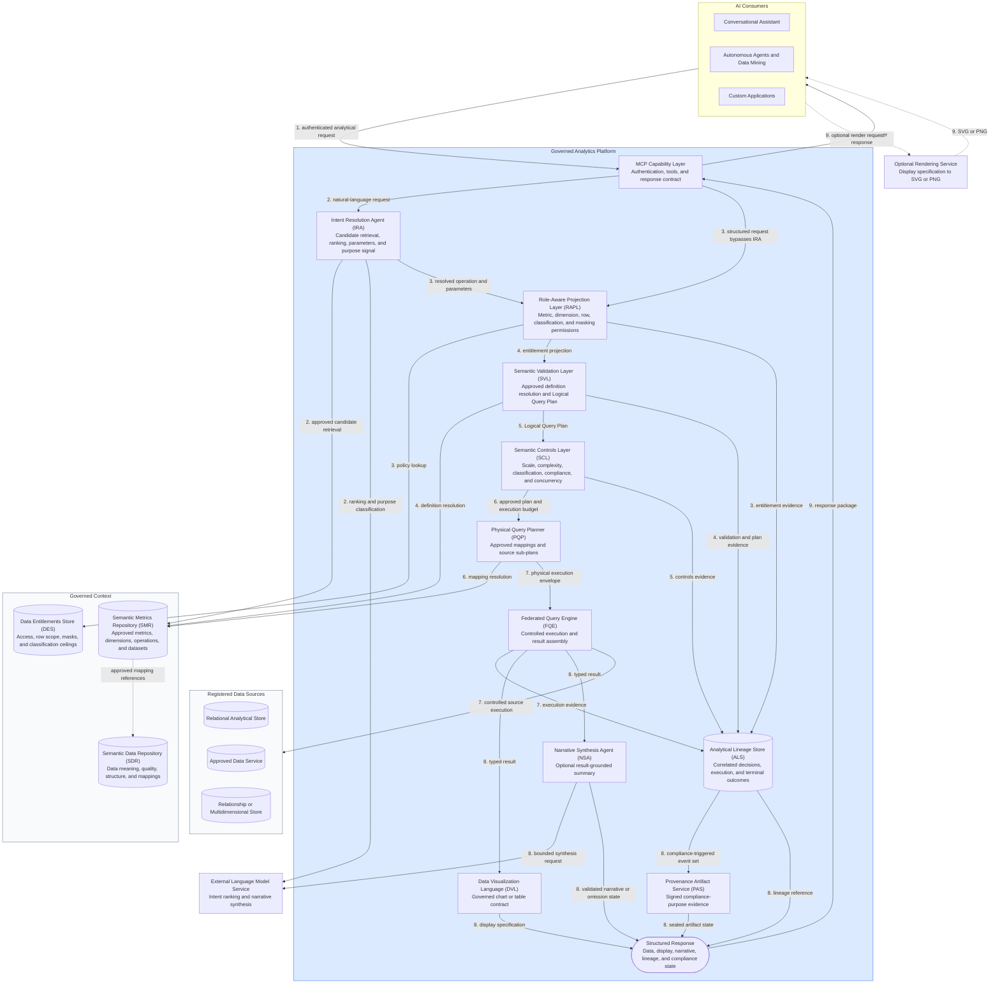

# 2. Proposed Architecture and Capabilities

## Purpose and Boundaries

This section defines the proposed logical architecture for governed AI-enabled analytics and data mining. It explains each component's responsibility and the contracts between components. It is implementation-neutral: it names required behavior, inputs, outputs, and evidence without selecting products, programming languages, frameworks, storage services, or deployment patterns. [Section 3](./03-technical-implementation.md) maps these responsibilities to an illustrative technology stack.

The design separates AI-assisted interpretation from governed computation. A language model may match a question to an approved operation and summarize a completed result. Registered definitions, deterministic software, and controlled data services perform the calculation. A structured caller may bypass natural-language interpretation, but it may not bypass entitlements, validation, controls, execution evidence, or other mandatory stages.

Component names identify logical responsibilities. They do not require one independently deployed service per component. Required behaviors describe the proposal, not verified features of a released product.

## Platform Roles

The operating model separates analytical use, definition ownership, access policy, governance, integration, and platform operation. One person may hold several roles, but the organization must review combinations that create conflicts of interest.

| Role | Primary Responsibility |
|---|---|
| Analytical End User | Requests governed analysis and views results within assigned permissions. |
| Power Analyst | Performs deeper exploration, drilldown, and authorized evidence export. |
| Data Modeller | Maintains business and physical data metadata in the Semantic Data Repository (SDR). |
| Metrics Modeller | Authors metric, dimension, operation, and dataset definitions for review. |
| Entitlements Manager | Maintains analytical access, row-scope, and masking policies. |
| Analytics Governance | Approves definitions and oversees analytical quality and catalog integrity. |
| Integration Engineer | Registers supported source connections and physical mappings. |
| Platform Admin | Operates the service within governance policy. This role does not confer analytical data access. |

Production access must come from approved entitlement policy, not from an authoring or administrative role alone.

### Role and Capability Boundaries

| Activity | Accountable Role | Required Separation |
|---|---|---|
| Use approved analytics | Analytical End User or Power Analyst | Access remains limited by DES policy. |
| Author data metadata and mappings | Data Modeller | Production approval remains with the designated governance process. |
| Author metrics and operations | Metrics Modeller | The author cannot make a definition available merely by submitting it. |
| Approve analytical definitions | Analytics Governance | Approval is recorded against a versioned definition. |
| Maintain entitlement policy | Entitlements Manager | Platform administration does not imply authority to grant data access. |
| Register source connections | Integration Engineer | Credentials remain inside the controlled execution boundary. |
| Operate platform services | Platform Admin | Administrative access does not imply permission to run analytical queries. |

The implementation must record who proposed, reviewed, approved, deprecated, and used each governed definition. Organizations may assign these responsibilities differently, but they must preserve accountable approval and prevent infrastructure privileges from becoming analytical entitlements.

## Architecture and Request Flow

The governed path applies the same controls to conversational users, autonomous agents, and custom applications.



### Request Steps

| Step | Description | Input | Output |
|---|---|---|---|
| 1. Capability entry - MCP Capability Layer | Authenticate the caller, create the request correlation context, and route a natural-language or structured request. | Authenticated consumer request | Correlated analytical request routed either to IRA or directly to RAPL |
| 2. Intent resolution - IRA when required | Retrieve approved candidates from the SMR, rank them, bind typed parameters, classify stated purpose, and request clarification when the result is ambiguous. Structured requests skip this step. | Natural-language request and discoverable approved definitions | Approved operation identifier, typed parameters, confidence evidence, and purpose signal |
| 3. Entitlement projection - RAPL | Resolve policies from the DES against the authenticated identity and record the effective access decision in the ALS. | Resolved operation and parameters plus authenticated identity context | Approved metrics and dimensions, row scope, masks, classification ceiling, and entitlement evidence |
| 4. Semantic validation - SVL | Resolve approved definition versions from the SMR, validate semantic compatibility, apply the entitlement projection, and record validation evidence in the ALS. | Resolved request and entitlement projection | Backend-independent Logical Query Plan or structured rejection |
| 5. Controls - SCL | Evaluate scale, complexity, classification, compliance, and concurrency; record the controls decision in the ALS; and assign an execution budget when approved. | Logical Query Plan, versioned controls, and operating state | Approved plan with execution budget or structured rejection |
| 6. Physical planning - PQP | Resolve approved mappings through the SMR and SDR context and compile one or more bounded source sub-plans. | Approved Logical Query Plan, execution budget, and registered mappings | Physical execution envelope containing source sub-plans, protection directives, and integrity evidence |
| 7. Federated execution - FQE | Execute the approved sub-plans against registered sources, assemble the result, enforce remaining protections, and record execution evidence in the ALS. | Approved physical execution envelope | Typed result or explicit incomplete, failed, or timed-out outcome |
| 8. Presentation and evidence - DVL, NSA, ALS, and PAS | Create the governed display contract, optionally create and validate a narrative, complete the correlated lineage evidence, and seal a compliance artifact when the trigger is active. | Typed result, resolved intent, plan references, and accumulated evidence | Display specification, optional narrative, lineage reference, and optional sealed compliance artifact |
| 9. Capability response - MCP Capability Layer | Assemble the governed response and return it to the requesting consumer. A consumer may send the display specification to the optional rendering service. | Result, presentation outputs, evidence references, warnings, and terminal status | Structured consumer response and, when separately requested, rendered SVG or PNG |

The worked example uses one request throughout. Each subsection names the stage input in prose and shows the stage output as technology-neutral JSON. Identifiers and values are illustrative, not implementation defaults.

A result is repeatable only when the request, source snapshot, definition versions, effective permissions, configuration, and execution software are preserved. Deterministic planning does not compensate for changed data or definitions.

### Component Summary

| Component | Responsibility |
|---|---|
| AI Consumers | Submit requests and render structured responses. |
| MCP Capability Layer | Provides the governed entry point, tool contract, and response envelope. |
| Intent Resolution Agent (IRA) | Maps natural language to an approved operation and typed parameters. |
| Semantic Metrics Repository (SMR) | Stores approved, versioned analytical definitions and dataset contracts. |
| Role-Aware Projection Layer (RAPL) | Resolves metric, dimension, row, classification, and masking permissions. |
| Semantic Validation Layer (SVL) | Validates the request and compiles a backend-independent LQP. |
| Semantic Controls Layer (SCL) | Applies scale, complexity, classification, compliance, concurrency, and timeout controls. |
| Physical Query Planner (PQP) | Resolves approved mappings and compiles source-specific sub-plans. |
| Federated Query Engine (FQE) | Executes sub-plans and assembles controlled results. |
| Data Visualization Language (DVL) | Selects a governed chart or table specification. |
| Narrative Synthesis Agent (NSA) | Produces an optional result-grounded summary. |
| Analytical Lineage Store (ALS) | Preserves correlated records of requests, decisions, execution, and terminal outcomes. |
| Provenance Artifact Service (PAS) | Signs additional evidence for compliance-purpose results. |

## AI Consumers

AI consumers include conversational assistants, autonomous agents, data-mining workflows, and custom applications. They provide the user experience; they do not own analytical definitions, permissions, query planning, or execution.

A consumer may submit natural language or an approved operation identifier with typed parameters. It passes the caller's authenticated context, preserves the returned result identifier for follow-up actions, and distinguishes governed results from exploratory output produced outside this platform.

### Worked Example

The running example asks the platform to compare the caller's equity portfolios with their benchmarks for the current quarter:

```json
{
  "question": "Compare my equity portfolios with their benchmarks this quarter",
  "response_profile": "full_analytical"
}
```

The authentication and identity context travels through the trusted transport. It is not embedded in the analytical request body.

## MCP Capability Layer (MCP)

> **Governing principles:** [P1 - Semantic abstraction](./01-overview.md#design-principles), [P2 - Controls before execution](./01-overview.md#design-principles), and [P5 - Role-aware by default](./01-overview.md#design-principles)

The MCP Capability Layer is the single governed analytical entry point. The transport authenticates the caller before tool routing and passes identity through trusted request context. Bearer tokens are not analytical tool arguments.

### Tool Catalog

| Tool | Purpose |
|---|---|
| run_analytics | Runs a natural-language request or an approved operation with typed parameters. |
| list_operations | Lists operations and parameters available to the caller. |
| drilldown | Creates a governed follow-up request from a prior result and hierarchy selection. |

A drilldown inherits analytical context but receives a new request identifier and passes the current entitlement and controls pipeline again. Prior approval never authorizes a later request automatically.

### Execution Profiles

| Profile | Result |
|---|---|
| data_retrieval | Returns a typed, paginated dataset governed by an approved dataset contract. |
| metric_query | Returns calculated data and a DVL display specification. |
| full_analytical | Adds an optional governed narrative to the metric response. |

Execution profiles control optional response assembly, not governance. Every profile uses the complete entitlement, validation, controls, planning, execution, and lineage path. PAS invocation is compliance-driven and independent of presentation profile.

### Intent Confirmation

When the IRA cannot select one operation confidently, the MCP layer returns ranked confirmation cards containing the proposed operation, bound parameters, material filters, and presentation preview. Refinement does not execute a backend query. The selected request still passes all downstream controls.

Confidence thresholds, candidate counts, and refinement limits require evaluation. They are not accuracy guarantees.

A confirmation card contains the candidate operation, resolved parameter values, time period, material filters, confidence, and a presentation preview. It must not expose physical schemas or executable queries. The session binds the candidate set to the authenticated caller and expires after a short configured interval.

The consumer may select a candidate, refine the question, or cancel. Selection resumes the original governed request; refinement produces a new ranked candidate set without querying a backend. Operations marked as requiring confirmation always present a card, regardless of confidence.

### Capability Governance

The capability layer exposes only registered tools and approved operation metadata. Tool discovery is entitlement-aware. Request limits, session limits, and allowed response sizes are versioned platform controls. Changes to tool contracts follow the same review and compatibility process as other public interfaces.

### Worked Example

The MCP layer accepts the natural-language request and creates a correlation identifier before routing it to the IRA:

```json
{
  "request_id": "req-20260518-093241",
  "tool": "run_analytics",
  "input": {
    "question": "Compare my equity portfolios with their benchmarks this quarter",
    "response_profile": "full_analytical"
  }
}
```

## Intent Resolution Agent (IRA)

> **Governing principles:** [P1 - Semantic abstraction](./01-overview.md#design-principles) and [P10 - Deterministic computation, not generation](./01-overview.md#design-principles)

The IRA is the only AI step before computation. It retrieves candidate operations from the SMR, ranks them against the user's request, binds parameters, and returns either a resolved request or a confirmation choice. It does not receive credentials, execute queries, or generate executable SQL.

The IRA uses registered descriptions rather than physical schemas. Caller-dependent phrases such as "my portfolios" remain unresolved until RAPL evaluates the authenticated identity. The output contains an approved operation identifier, typed parameters, candidate evidence, model details, and a confidence score.

The IRA also estimates whether the stated purpose is compliance-related. Ambiguous purpose requires clarification. The score is an input to a deterministic control; the model does not make the final control decision. Structured callers bypass the IRA and declare purpose through a validated field.

### Resolution Pipeline

| Stage | Required Behavior | Evidence Retained |
|---|---|---|
| Candidate retrieval | Search approved SMR operation and metric descriptions within the caller's discoverable scope. | Query embedding version, retrieved identifiers, and retrieval scores. |
| Candidate ranking | Rank candidates and bind parameters using the natural-language request and registered descriptions. | Model and prompt-template versions, ranked identifiers, confidence, and bound parameters. |
| Ambiguity check | Compare the leading candidates and apply operation-specific confirmation rules. | Thresholds, score difference, and confirmation decision. |
| Purpose classification | Estimate whether the stated purpose is compliance-related. | Purpose score and any clarification outcome. |
| Output validation | Validate the selected operation identifier and typed parameters against the SMR contract. | Validation result and rejection reason when applicable. |

Retrieval narrows the model's choice set; it does not approve a definition or establish that the chosen intent is correct. Evaluation must measure top-candidate accuracy, correct-candidate coverage, clarification quality, and false certainty across representative language and user roles.

### Worked Example

The IRA resolves the question to an approved comparison operation. The symbolic caller-dependent scope remains unresolved:

```json
{
  "request_id": "req-20260518-093241",
  "operation_id": "compare_portfolio_to_benchmark",
  "parameters": {
    "portfolio_scope": "caller_authorized_portfolios",
    "asset_class": "EQUITY",
    "time_period": "current_quarter"
  },
  "confidence": 0.93,
  "compliance_purpose_score": 0.08,
  "confirmation_required": false
}
```

## Semantic Metrics Repository (SMR)

> **Governing principles:** [P1 - Semantic abstraction](./01-overview.md#design-principles), [P3 - Deterministic metric resolution](./01-overview.md#design-principles), and [P10 - Deterministic computation, not generation](./01-overview.md#design-principles)

In a governed AI-enabled analytics situation, the Semantic Metrics Repository (SMR) provides a catalog of approved metrics, dimensions, operations, and dataset contracts. It is the authoritative source for concepts that the governed path can resolve.

| Definition Type | Required Content |
|---|---|
| Metric | Formula or governed measure, aggregation, units, dimensions, classification, source affinity, owner, version, and approval state. |
| Dimension | Business meaning, hierarchy, compatible metrics, and mapping information. |
| Operation | Parameter contract, supported metrics and dimensions, execution profile, and confirmation requirements. |
| Dataset | Approved fields, classifications, selection rules, mapping, refresh expectations, and pagination policy. |

Only approved versions are resolvable for new governed requests. Historical versions remain available to authorized reviewers for lineage reconstruction.

### Definition Lifecycle and Versioning

| State | Meaning |
|---|---|
| Proposed | An author has submitted a draft that cannot be used for governed execution. |
| In Review | Named reviewers are assessing meaning, sources, tests, ownership, and access implications. |
| Approved | The exact version may be resolved by governed requests. |
| Deprecated | Existing evidence remains interpretable, but new use is discouraged or blocked according to policy. |
| Retired | The version is unavailable for new execution and retained only for authorized historical reconstruction. |

Approving a new version does not rewrite earlier lineage. Each request pins the versions it resolved. Compatibility rules determine whether consumers must change when parameters, dimensions, units, formulas, mappings, or classifications change.

### Minimum Definition Contract

Every definition carries a stable identifier, semantic version, owner, approval state, effective period, classification, and change history. Metrics additionally declare their formula or governed measure, aggregation behavior, units, compatible dimensions, source affinity, physical mapping reference, and tests. Operations declare typed parameters, output expectations, execution profile, permitted drilldowns, and whether confirmation is mandatory. Dataset contracts declare approved fields, classifications, selection rules, ordering, pagination, and freshness expectations.

The SMR and Semantic Data Repository (SDR) are separate stores within the Data Context Store (DCS). The SMR defines analytical meaning; the SDR describes organizational data and its physical structure. Approved mappings link the two without exposing physical schema details through the normal AI interface.

### Formula Language

The formula language expresses metric logic using registered metric identifiers, logical fields, arithmetic, conditions, safe division, time windows, filtered aggregation, and other explicitly supported operations. It does not accept arbitrary SQL or backend-specific expressions.

A formula is human-readable and audit-visible, but registration does not prove correctness. Approval requires accountable ownership, test cases, source validation, and comparison with independently verified results.

### Authoring and Discovery

Metrics Modellers submit definitions through an authenticated workflow. Analytics Governance reviews and approves them. Consumers discover only approved operations available under their entitlements. Search indexes and embeddings may improve discovery; they do not change approval state or access rights.

### Worked Example

The resolved operation references two approved metrics without exposing their physical implementation:

```json
{
  "operation_id": "compare_portfolio_to_benchmark",
  "version": "1.3.0",
  "status": "approved",
  "metrics": [
    { "metric_id": "portfolio_return", "version": "2.1.0" },
    { "metric_id": "benchmark_return", "version": "1.4.2" }
  ],
  "dimensions": ["portfolio"],
  "required_parameters": ["portfolio_scope", "asset_class", "time_period"],
  "execution_profile": "full_analytical"
}
```

## Role-Aware Projection Layer (RAPL)

> **Governing principle:** [P5 - Role-aware by default](./01-overview.md#design-principles)

RAPL converts authenticated identity claims and policies from the Data Entitlements Store (DES) into an effective entitlement projection. It validates identity context, retrieves role definitions, merges them according to policy, resolves claim-based row scopes, and records the decision.

| Restriction | Proposed Treatment |
|---|---|
| Data and metric access | Deny any required domain, classification, or metric outside the effective access set. |
| Dimension access | Reject a required unauthorized dimension; do not silently change the question. |
| Row scope | Resolve typed predicates from trusted claims and attach them to the plan. |
| Column masking | Carry each required mask and its policy basis into planning and execution. |
| Classification ceiling | Preserve the effective ceiling for validation and controls. |

The proposed multi-role rule uses union for granted data, metrics, and dimensions; strict intersection for row scopes; and union for masks, so any applicable mask remains in force. Explicit-deny and missing-claim behavior must be defined consistently in DES policy and tested independently of role order.

Row scopes are typed predicates, not interpolated query fragments. Masks are enforced before protected values leave the controlled execution boundary. Each projection records the roles, policy versions, resolved scopes, masks, and decision basis in the ALS.

### Multi-Role Merge and Deny Behavior

| Entitlement | Proposed Merge Rule |
|---|---|
| Data domains, metrics, and dimensions | Union of grants, subject to explicit-deny policy and classification ceiling. |
| Row scopes | Strict intersection. Every applicable population restriction remains in force. |
| Column masks | Union. A mask required by any applicable role remains active. |
| Classification ceiling | Most restrictive applicable ceiling unless policy explicitly defines another reviewed rule. |

The merge must be independent of role order and must fail closed when a required role definition or claim cannot be resolved. The design decision about whether an explicit deny overrides every grant must be uniform across DES, RAPL, tests, and audit explanations.

### Column Masking Modes

| Mode | Result Treatment |
|---|---|
| null replacement | Replace the protected value with null while preserving the field. |
| redacted label | Replace the value with a fixed approved label. |
| excluded | Remove the field from the returned schema. |
| hash replacement | Replace the value with a deterministic one-way representation when approved grouping behavior is required. |

Masking changes what downstream consumers can observe. The selected mode, protected field, policy version, and enforcement location therefore form part of the analytical evidence.

### Worked Example

RAPL resolves the symbolic portfolio scope from the authenticated caller's policy and claims:

```json
{
  "request_id": "req-20260518-093241",
  "policy_version": "portfolio-access-7.2",
  "approved_metrics": ["portfolio_return", "benchmark_return"],
  "approved_dimensions": ["portfolio"],
  "row_scope": {
    "field": "portfolio_id",
    "operator": "in",
    "values": ["GLOB_EQ_OPP", "UK_CORE_INC", "ASIA_PAC_GRW", "EUR_BAL_INC"]
  },
  "column_masks": [],
  "classification_ceiling": "INTERNAL",
  "decision": "approved"
}
```

## Semantic Validation Layer (SVL)

> **Governing principles:** [P2 - Controls before execution](./01-overview.md#design-principles) and [P10 - Deterministic computation, not generation](./01-overview.md#design-principles)

The SVL validates a fully qualified request and compiles it into a platform-independent LQP. No AI model runs in this component.

The SVL validates structure and parameter types; resolves operations, metrics, dimensions, and datasets to approved versions; checks semantic compatibility; applies the RAPL projection; attaches validated compliance inputs; and creates a directed plan containing logical concepts rather than SQL, connection details, or physical identifiers.

Unknown, unapproved, incompatible, or unauthorized required concepts cause a structured rejection. The SVL does not return a partial calculation that changes the requested meaning. Its validation shows conformity to registered definitions; it does not establish that the definitions or source data are correct.

### Validation Stages

| Stage | Checks | Output |
|---|---|---|
| Request validation | Required fields, types, parameter ranges, and operation contract. | A well-formed request or structured rejection. |
| Semantic resolution | Approval state, pinned versions, metric-dimension compatibility, and dataset contract. | Fully resolved logical identifiers. |
| Entitlement application | Permitted concepts, row predicates, masks, and classification ceiling. | An entitlement-constrained request. |
| Plan generation | Logical scans, filters, calculations, joins, sorts, limits, and output shape. | A backend-independent LQP. |

The LQP also carries definition versions, data-affinity hints, mask directives, compliance inputs, and a preliminary impact indicator. It contains no credentials, connection endpoints, physical table names, or executable SQL.

### Worked Example

The SVL converts the qualified request into a backend-independent plan:

```json
{
  "lqp_id": "lqp-20260518-093243",
  "operation_id": "compare_portfolio_to_benchmark",
  "metric_versions": {
    "portfolio_return": "2.1.0",
    "benchmark_return": "1.4.2"
  },
  "steps": [
    { "type": "metric_scan", "metrics": ["portfolio_return", "benchmark_return"] },
    { "type": "filter", "field": "asset_class", "operator": "eq", "value": "EQUITY" },
    { "type": "row_scope", "field": "portfolio_id", "operator": "in", "value_ref": "authorized_portfolios" },
    { "type": "sort", "field": "portfolio_return", "direction": "descending" }
  ],
  "time_period": { "type": "relative", "value": "current_quarter" },
  "column_masks": []
}
```

## Semantic Controls Layer (SCL)

> **Governing principles:** [P2 - Controls before execution](./01-overview.md#design-principles), [P8 - Explainability at every layer](./01-overview.md#design-principles), and [P9 - Administrator sovereignty within governance bounds](./01-overview.md#design-principles)

The SCL is the mandatory release gate between logical validation and physical planning. It evaluates every LQP against versioned controls and records the decision before execution.

| Control | Decision |
|---|---|
| Data scale | Compare an evidence-based scan estimate with the configured limit. |
| Complexity | Check plan nodes, join depth, source count, and other bounded measures. |
| Classification | Compare the highest required classification with the permitted ceiling. |
| Compliance | Evaluate approved metric metadata and declared or classified purpose. |
| Concurrency | Check active work against the operating limit. |
| Timeout | Assign a bounded execution budget after blocking checks pass. |

Estimates are not exact measurements. The record identifies the source and freshness of the statistics used. Rejections return structured reasons and safe ways to narrow the request.

The proposed compliance trigger requires both a compliance-relevant metric and a compliance purpose. For natural-language requests, the SCL evaluates the IRA score against a configured threshold; structured requests declare purpose explicitly. The SCL records both signals and invokes PAS when both are active. Whether this rule is sufficient for a jurisdiction or activity remains a deployment-specific compliance decision.

### Control Decision Contract

Each control records its configured limit, observed or estimated value, data source, evaluation version, outcome, and reason. The SCL evaluates all controls needed for a useful explanation, even when one failure is sufficient to block execution. Sensitive platform state, such as other tenants' workload details, is not returned to the caller.

The data-scale estimate uses current SDR profiling statistics and the resolved row scope. The complexity control considers structural cost separately from volume. The classification control applies both platform boundaries and the caller's effective ceiling. The concurrency control protects shared execution resources without weakening tenant isolation. After all blocking controls pass, the SCL assigns a timeout and writes the signed or integrity-protected decision record before releasing the plan.

No interactive user, automated agent, administrator, cache path, or internal retry bypasses this release decision. A retried or modified request receives its own decision record.

### Worked Example

The SCL records each decision and assigns the execution budget:

```json
{
  "lqp_id": "lqp-20260518-093243",
  "decision": "approved",
  "checks": {
    "data_scale": { "estimate": 412000, "limit": 50000000, "result": "pass" },
    "complexity": { "score": 4, "limit": 50, "result": "pass" },
    "classification": { "required": "INTERNAL", "ceiling": "INTERNAL", "result": "pass" },
    "compliance": { "metric_signal": false, "purpose_signal": false, "result": "standard" },
    "concurrency": { "active": 3, "limit": 20, "result": "pass" }
  },
  "timeout_seconds": 30
}
```

## Physical Query Planner (PQP)

> **Governing principles:** [P1 - Semantic abstraction](./01-overview.md#design-principles) and [P10 - Deterministic computation, not generation](./01-overview.md#design-principles)

The PQP is the boundary between logical concepts and physical execution. It resolves the approved physical mapping associated with each pinned definition version, expands logical time expressions, groups work by source affinity, and compiles source-specific sub-plans.

The PQP applies row predicates and masking requirements to each relevant sub-plan. Where a source can enforce masking, the generated query performs it before values leave that source. Otherwise, an approved controlled execution stage applies the mask before returning data outside the FQE boundary.

A repeatable physical plan requires the same LQP, definition and mapping versions, planner version, configuration, and source capabilities. The PQP records those dependencies. It does not hold source credentials or execute plans.

### Compilation Stages

| Stage | Responsibility |
|---|---|
| Mapping resolution | Resolve each logical scan and measure against the mapping pinned to the approved definition version. |
| Predicate binding | Bind typed dimension filters and RAPL row scopes using backend-safe parameters. |
| Time resolution | Expand relative periods against the recorded evaluation timestamp and calendar. |
| Source grouping | Group compatible work by data affinity and identify required cross-source assembly. |
| Source instruction compilation | Produce a bounded sub-plan in the registered instruction format for each source group. |
| Plan sealing | Create an integrity digest and record planner, instruction-format, mapping, and configuration versions. |

An implementation may delegate federation to one execution service or create several source sub-plans with an explicit assembly contract. Both approaches implement the same logical responsibility; Section 3 proposes a specific choice.

### Worked Example

The PQP resolves the approved mappings and creates a technology-neutral execution envelope:

```json
{
  "plan_id": "plan-20260518-093244",
  "lqp_id": "lqp-20260518-093243",
  "mapping_versions": ["portfolio-mapping-4.6"],
  "sub_plans": [
    {
      "source_id": "portfolio-performance-source",
      "metrics": ["portfolio_return", "benchmark_return"],
      "filters": ["asset_class", "authorized_portfolios", "resolved_date_range"]
    }
  ],
  "resolved_date_range": { "from": "2026-04-01", "to": "2026-05-18" },
  "column_masks": [],
  "timeout_seconds": 30
}
```

## Federated Query Engine (FQE)

> **Governing principles:** [P1 - Semantic abstraction](./01-overview.md#design-principles), [P4 - Complete analytical lineage](./01-overview.md#design-principles), and [P10 - Deterministic computation, not generation](./01-overview.md#design-principles)

The FQE is the only logical component with access to registered backend connections. It validates source availability, executes approved sub-plans within the assigned timeout, joins compatible results on governed dimensions, enforces any remaining masks within its controlled boundary, and records execution outcomes.

Caching uses a canonical key that includes the effective plan, tenant, entitlement projection, definition versions, and relevant configuration. A cache hit still passes current authorization and produces a new lineage event. Compliance-purpose queries bypass the cache unless approved policy provides equivalent evidence and freshness guarantees.

Source failure is visible. The response identifies incomplete sources and affected metrics. A partial result may be returned only when the approved operation contract permits partial semantics; otherwise, the request fails rather than representing missing values as a complete answer.

The FQE records source identifiers, plan hashes, timing, row counts, cache status, errors, and mask application. It does not expose credentials or unrestricted physical schema details to consumers or language models.

### Execution Pipeline

| Stage | Required Behavior |
|---|---|
| Plan admission | Verify plan integrity, source registration, timeout, tenant, and control approval. |
| Cache evaluation | Check an entitlement-safe canonical key and current policy before reuse. |
| Source execution | Run sub-plans within their time and resource budgets. |
| Assembly | Join or combine results only on approved compatible dimensions. |
| Final protection | Apply any remaining masks and verify the returned schema before release. |
| Evidence write | Record the outcome before returning the result or terminal failure. |

Supported source categories may include relational analytical stores, governed semantic services, approved data APIs, relationship stores, and multidimensional analytical engines. Technical connectivity does not make a source usable automatically. Each connection requires approved mappings, credentials, classifications, timeout behavior, and failure semantics.

Result-size limits determine whether the engine returns inline data, paginates an approved dataset, streams within a controlled protocol, or rejects the request. These choices are part of the operation contract and response evidence.

### Worked Example

The FQE executes the approved plan and returns typed result rows:

```json
{
  "result_id": "res-20260518-093247",
  "status": "complete",
  "sources_used": ["portfolio-performance-source"],
  "cache_status": "miss",
  "rows": [
    { "portfolio_id": "GLOB_EQ_OPP", "portfolio": "Global Equity Opportunities", "portfolio_return": 0.0421, "benchmark_return": 0.0385 },
    { "portfolio_id": "ASIA_PAC_GRW", "portfolio": "Asia Pacific Growth", "portfolio_return": 0.0367, "benchmark_return": 0.0390 },
    { "portfolio_id": "UK_CORE_INC", "portfolio": "UK Core Income", "portfolio_return": 0.0287, "benchmark_return": 0.0254 },
    { "portfolio_id": "EUR_BAL_INC", "portfolio": "EUR Balanced Income", "portfolio_return": 0.0193, "benchmark_return": 0.0231 }
  ]
}
```

## Data Visualization Language (DVL)

> **Governing principle:** [P7 - Deterministic visualization](./01-overview.md#design-principles)

The DVL produces a structured chart or table specification from the approved intent and result schema. A registry maps comparison, trend, distribution, threshold, attribution, relationship, and composition patterns to compatible presentation contracts. A governed table is the fallback.

Contract selection is deterministic for the same intent, result schema, registry version, and configuration. Labels and units come from approved definitions, not physical fields. An authorized analyst may request an allowed compatible override; the platform rejects incompatible choices and records accepted overrides.

The DVL returns a specification, not a rendered image. Consumer applications render it directly or pass it to an independently governed rendering service.

### Intent Pattern Taxonomy

| Pattern | Purpose | Typical Contract |
|---|---|---|
| Comparison | Compare measures across discrete categories. | Grouped bar chart or governed table. |
| Trend | Show change over an ordered time dimension. | Line chart. |
| Distribution | Show spread, frequency, or concentration. | Histogram or governed table. |
| Threshold | Compare observations with a limit or benchmark. | Threshold matrix, bar chart, or table. |
| Attribution | Decompose a total into contributing factors. | Waterfall chart. |
| Relationship | Show association between two measures. | Scatter plot. |
| Composition | Show part-to-whole structure. | Treemap or governed table. |

### Chart Contract Selection

Each registered contract declares compatible patterns, required field types, cardinality limits, axis or column bindings, sorting, interaction behavior, accessibility requirements, and fallback behavior. The selector evaluates the most specific compatible contract first. If none matches, it returns the governed table contract rather than asking a language model to invent a display.

Themes may change approved colors and typography without changing the analytical contract. Threshold colors, units, labels, ordering, and benchmark semantics come from governed metadata and must remain interpretable in accessible and monochrome presentations.

### Worked Example

The DVL selects the registered comparison contract from the intent and result shape:

```json
{
  "type": "chart",
  "contract": "multi_series_comparison",
  "contract_version": "2.0",
  "mark": "bar",
  "category": { "field": "portfolio", "label": "Portfolio" },
  "measures": [
    { "field": "portfolio_return", "label": "Portfolio Return", "format": "percentage" },
    { "field": "benchmark_return", "label": "Benchmark Return", "format": "percentage" }
  ],
  "sort": { "field": "portfolio_return", "direction": "descending" }
}
```

## Narrative Synthesis Agent (NSA)

> **Governing principles:** [P6 - Governed narrative](./01-overview.md#design-principles) and [P10 - Deterministic computation, not generation](./01-overview.md#design-principles)

The NSA optionally produces a concise plain-language summary after computation. Its input is limited to approved result labels, values, units, and dimensions. It does not calculate metrics or change the result.

A validator checks every stated number against the returned data or an independently recomputed permitted derivation. If validation fails, the service may retry once and then omits the narrative while recording the failure. Quantitative matching reduces unsupported claims but does not prove that wording, emphasis, or causal interpretation is correct. Evaluation therefore includes semantic review, not numeric matching alone.

Disabling the NSA has no effect on calculation, display specification, lineage, or compliance evidence.

### Anchoring and Validation

The narrative contract separates a short lead statement, supporting detail, and the result identifiers to which each claim is anchored. Validation covers numbers, units, dimension labels, comparison direction, and permitted derived counts. It rejects invented causes, recommendations, forecasts, or significance claims unless the approved operation explicitly provides those outputs.

The lineage record captures the model, prompt-template version, validation outcome, retry count, and omission reason. Model selection may vary by result complexity, but changing models must not alter computed data or the DVL contract.

### Worked Example

The NSA summarizes only statements supported by the result rows:

```json
{
  "narrative": {
    "lead": "Two of four equity portfolios outperformed their benchmarks this quarter.",
    "detail": "Global Equity Opportunities returned 4.21% compared with 3.85% for its benchmark. UK Core Income returned 2.87% compared with 2.54%.",
    "anchored_to": ["GLOB_EQ_OPP", "UK_CORE_INC", "ASIA_PAC_GRW", "EUR_BAL_INC"]
  },
  "validation": {
    "numbers": "passed",
    "units": "passed",
    "dimension_labels": "passed"
  }
}
```

## Analytical Lineage Store (ALS)

> **Governing principles:** [P4 - Complete analytical lineage](./01-overview.md#design-principles) and [P8 - Explainability at every layer](./01-overview.md#design-principles)

The ALS preserves correlated events for every accepted request, including entitlement decisions, controls decisions, execution, presentation, and terminal failure. Records use a common request identifier so an authorized reviewer can reconstruct the sequence without treating one final payload as the complete history.

By default, lineage stores hashes, definition and policy versions, bounded summaries, source references, plan identifiers, decisions, and timing rather than full raw requests or results. An approved policy may require additional content. The design minimizes sensitive data while preserving evidence for its intended review.

Claims of immutability depend on storage enforcement. Write-once retention, versioning, signatures, encryption, tenant-scoped authorization, key management, reconciliation, and tested recovery provide the required integrity properties. Application convention alone is insufficient. Corrections create linked amendment records rather than altering prior evidence.

Retention varies by record class, jurisdiction, and business purpose. Definition versions and references needed to interpret retained results remain available for at least the corresponding evidence period.

### Stored Event Types

| Event | Minimum Evidence |
|---|---|
| Request accepted | Tenant, caller reference, tool, operation, parameters or bounded request representation, and timestamp. |
| Intent resolved | Candidate set, selected operation, model evidence, confidence, and confirmation history. |
| Entitlement projected | Policy versions, active roles, resolved row scopes, masks, ceiling, and decision. |
| Controls evaluated | Each control input, limit, outcome, reason, and assigned timeout. |
| Plan compiled | Logical and physical plan digests plus definition, mapping, planner, and instruction-format versions. |
| Execution completed | Sources, timings, row counts, cache status, failures, and result digest. |
| Presentation assembled | DVL contract, narrative validation, artifact state, and response status. |
| Request terminated | Rejection, cancellation, timeout, or failure stage and structured reason. |

### Isolation, Retention, and Audit Export

Every index entry and object key is tenant-scoped. Authorization applies to both search metadata and stored objects. Audit export is a separately authorized capability; possession of a result identifier does not grant access to its evidence.

Retention policy defines periods for request events, controls decisions, execution evidence, result artifacts, blocked requests, and definition versions. A shorter result-data period may be appropriate, but retained evidence must state when source data or result payloads are no longer available for exact reconstruction. Legal hold, deletion, amendment, and key-rotation behavior require explicit design and testing.

An audit export includes the selected event chain, referenced definition and policy versions, verification material, export scope, and exporter's identity. The platform signs the export package and records the export as a new auditable event.

### Worked Example

The ALS correlates stage records without storing the full result by default:

```json
{
  "request_id": "req-20260518-093241",
  "result_id": "res-20260518-093247",
  "events": [
    { "type": "intent_resolved", "record_id": "evt-intent-001" },
    { "type": "entitlement_projected", "record_id": "evt-access-001" },
    { "type": "controls_approved", "record_id": "evt-controls-001" },
    { "type": "plan_compiled", "record_id": "evt-plan-001" },
    { "type": "execution_completed", "record_id": "evt-execution-001" },
    { "type": "presentation_assembled", "record_id": "evt-presentation-001" }
  ],
  "result_digest": "digest:<illustrative-value>",
  "retention_policy": "analytical-evidence-standard"
}
```

## Provenance Artifact Service (PAS)

> **Governing principles:** [P2 - Controls before execution](./01-overview.md#design-principles), [P4 - Complete analytical lineage](./01-overview.md#design-principles), and [P9 - Administrator sovereignty within governance bounds](./01-overview.md#design-principles)

PAS assembles additional evidence for a request whose two compliance signals are active. It reads the relevant ALS events, adds the metric, framework, intent, policy, plan, execution, and result references required by the approved artifact schema, and signs the canonical artifact bytes.

The platform enforces the export gate. A compliance-purpose result cannot be exported until PAS confirms that the artifact is complete and sealed. The response identifies the artifact, schema version, signing key, algorithm, and verification status.

A valid signature shows that the signed bytes have not changed since sealing. It does not prove that the calculation is correct or that the artifact satisfies a legal requirement. The organization validates the schema, retention, signing controls, and approval process for each intended framework.

### Compliance Artifact Contract

| Field | Purpose |
|---|---|
| compliance purpose and intent score | Records the purpose input and threshold decision. |
| triggered metrics and frameworks | Identifies the approved metadata that activated the additional evidence path. |
| regulatory trace identifier | Correlates the artifact with the retained event chain. |
| artifact schema version | Identifies the structure used by reviewers and verification software. |
| definition, policy, plan, and result references | Binds the artifact to the governed computation. |
| signing key, algorithm, and signature | Supports independent integrity verification. |
| export status | Shows whether sealing completed and export is permitted. |

If assembly or signing fails, the result remains non-exportable and the ALS records the terminal artifact state. Amendments create a new signed artifact that references the original; they do not replace sealed evidence.

### Worked Example

The portfolio comparison does not activate PAS because neither compliance signal is active. A compliance-purpose operation would return an artifact state such as:

```json
{
  "compliance_purpose": true,
  "triggered_by_metrics": ["liquidity_coverage_ratio"],
  "triggered_by_frameworks": ["approved-liquidity-framework"],
  "artifact_id": "artifact-20260518-104512",
  "artifact_schema_version": "1.0",
  "signature": {
    "key_id": "platform-signing-key-2026-01",
    "algorithm": "approved-digital-signature",
    "verification_status": "verified"
  },
  "export_status": "permitted"
}
```

## MCP Response Format

The platform is headless. It returns a structured response that lets different consumers present the same governed result without reinterpreting its meaning.

| Response Element | Purpose |
|---|---|
| request_id and result_id | Correlate the response, follow-up actions, and evidence. |
| status | Distinguishes complete, incomplete, rejected, failed, and timed-out outcomes. |
| data | Contains typed, paginated rows or an approved dataset extract. |
| display_spec | Contains the DVL chart or table contract when required. |
| narrative | Contains the optional validated NSA summary. |
| lineage | References the authorized analytical evidence. |
| compliance | Reports artifact and export-gate state when applicable. |
| warnings and errors | Identify limitations, affected sources, and remediation. |

### DVL Specification Format

A DVL specification is a discriminated chart or table envelope. It contains approved labels, units, formatting hints, encodings or columns, interaction rules, and the contract version. It may contain result data or a controlled reference, depending on response size and consumer capability. It never substitutes physical field names for governed labels.

### Response Status and Failure Semantics

Complete, incomplete, rejected, failed, and timed-out are distinct states. An incomplete response identifies missing sources or metrics and appears only when the operation contract permits partial semantics. A rejection means a governance or validation rule prevented execution. A failure or timeout means approved execution did not complete. Consumers must present these states explicitly and must not render an incomplete or failed response as a complete governed answer.

### Worked Example

The final response combines the computed result with its governed presentation and evidence references:

```json
{
  "request_id": "req-20260518-093241",
  "result_id": "res-20260518-093247",
  "status": "complete",
  "data_ref": "result:res-20260518-093247",
  "display_spec_ref": "display:res-20260518-093247",
  "narrative_ref": "narrative:res-20260518-093247",
  "lineage": {
    "record_ref": "lineage:req-20260518-093241",
    "available_to_caller": true
  },
  "compliance": {
    "triggered": false,
    "export_status": "permitted"
  },
  "warnings": [],
  "errors": []
}
```

## External Components

External components remain outside the Analytics Engine boundary and retain their own ownership and controls.

### Conversational AI - Chat Front End

The chat front end submits requests, renders confirmation choices, presents structured responses, and retains result identifiers for drilldown. It does not resolve definitions, enforce entitlements, plan queries, or gain access to backend credentials and schemas.

### Semantic Data Repository (SDR)

The SDR contains organizational data metadata such as models, critical data elements, quality rules, physical schemas, and data-lineage references. The proposal does not assume that every organization already has a suitable SDR. Readiness assessment establishes its coverage, ownership, freshness, and mapping quality.

### Data Entitlements Store (DES)

The DES stores independently governed policies for metrics, dimensions, row scopes, masks, and classification ceilings. Policies reference logical concepts rather than physical table and column names. RAPL reads versioned policies at request time or from an equivalently controlled snapshot.

### Optional Rendering Service

An optional peer rendering service can convert a self-contained display specification into SVG or PNG for consumers that cannot render it directly. The service has no access to analytical definitions, source credentials, or execution backends. Section 3 identifies an illustrative product and implementation for this role.

## Design Decisions Requiring Evaluation

The proposal leaves several choices for implementation and governance teams to validate:

- role combinations and separation of duties;
- interaction between explicit denies and multi-role grants;
- operation contracts that may return partial results;
- evidence and freshness rules for caching;
- source snapshot retention and reconstruction;
- supported formula operations and source instruction formats;
- confidence and compliance-purpose thresholds;
- storage controls for evidence integrity and retention; and
- artifact schemas and approval processes for each intended regulatory use.

These are evaluation questions, not hidden implementation details. Section 4 defines measures for testing the architecture before broader adoption.

---

*Governed AI-Enabled Analytics and Data Mining - Technical White Paper - Draft*
