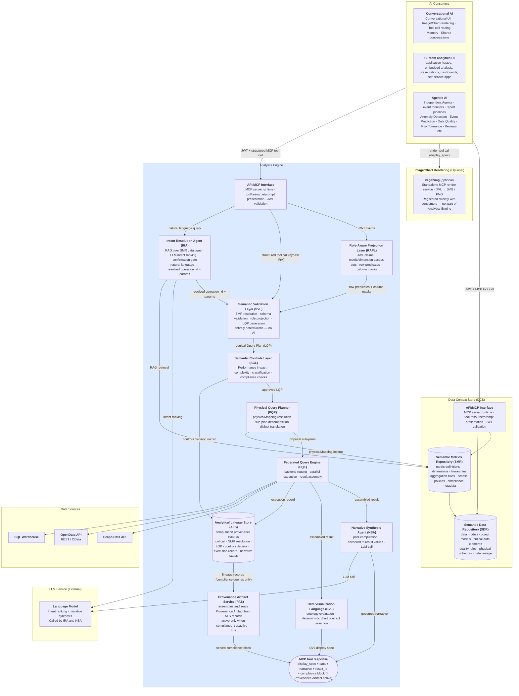
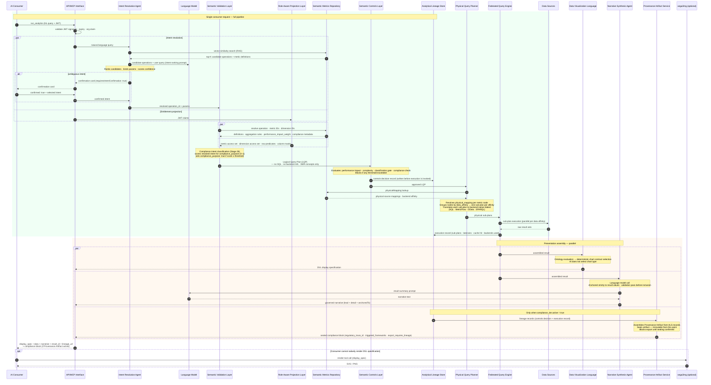
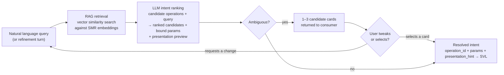
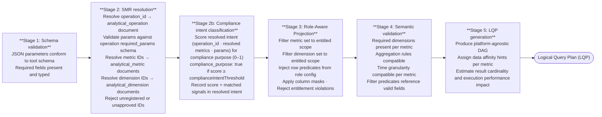
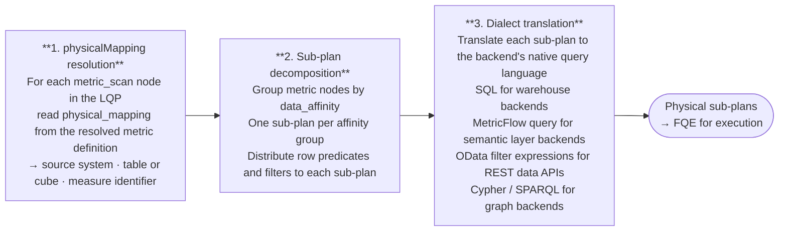
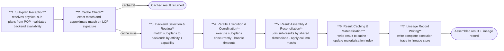

# 2. Core Platform Capabilities

This chapter is the logical architecture reference for the AI Analytics Platform. It covers nine pipeline components in the order a query encounters them, using a single portfolio manager query as a running example throughout. Each section describes what a component does, its controls contract, and where in the pipeline it sits — with no references to specific technology products or vendor implementations.

The pipeline processes every request in this sequence: the **MCP Capability Layer** is the entry point — the governed API through which all consumers access the platform. The **Semantic Metrics Repository** is the governing catalogue — every queryable metric, dimension, and operation must be registered here before it is resolvable. The **Intent Resolution Agent** receives natural language queries, retrieves candidate operations from the SMR via RAG, and uses a language model to rank and resolve the user's intent into a structured operation and parameters. The **Semantic Validation Layer** validates the resolved structured request and produces a platform-agnostic query plan. The **Role-Aware Projection Layer** enforces entitlements before any query reaches a backend. The **Semantic Controls Layer** applies thresholds and compliance classification before releasing the plan for execution. The **Physical Query Planner** translates the approved logical plan into backend-specific physical query fragments. The **Federated Query Engine** routes those fragments to registered backends, executes in parallel, and assembles the result. The **Data Visualization Language (DVL)** selects the presentation contract. The **Narrative Synthesis Agent** produces a governed plain-language summary via a tightly-scoped language model call. The **Analytical Lineage Store** records the complete computation provenance. The **Provenance Artifact Service** assembles and seals the compliance artifact when a query meets the two-signal compliance trigger.

Platform roles — who interacts with each component and how — are defined before the component descriptions.


## Platform Roles

The platform operates across three distinct planes: an **analytical plane** (querying, exploring, and exporting governed data), a **controls plane** (defining, approving, and administering the semantic layer and its access controls), and an **infrastructure plane** (platform deployment, health, and technical configuration).

| Role | Plane | Definition |
|------|-------|------------|
| **Analytical End User** | Analytical | Ask governed analytical questions via natural language; receive role-constrained results without knowledge of data structures or metric identifiers |
| **Power Analyst** | Analytical | Multi-dimensional exploration, governed drilldown, lineage inspection, result export |
| **Data Modeller** | Controls | Owns semantic data definitions in the SDR: logical data elements, object models, business definitions, critical data elements, and physical schema mappings. Ensures the organisation's data assets are accurately described and structured — the foundational layer on which metric definitions are built |
| **Metrics Modeller** | Controls | Owns semantic metrics and analytics definitions in the SMR: key performance metrics, analytics operations, trend analysis constructs, and insight definitions. Must combine domain knowledge — what does this metric mean in this business context — with modelling precision: how it is calculated, from which sources, under which dimensional hierarchies, and with which access policies |
| **Entitlements Manager** | Controls | Responsible for defining and maintaining the organisation's data entitlement policies: who may perform which actions (create, read, update, delete) on which data elements, analytics definitions, and business process metrics. Configures the metric access sets, dimension access sets, row predicates, and column masks that RAPL enforces at query time |
| **Analytics Governance** | Controls | Overall accountability for the governance, integrity, and outcomes of the analytics platform. Owns SMR registry health, approves semantic definition changes from Metrics Modellers, oversees entitlement policy governance, and is accountable for the quality, accuracy, and completeness of analytical outputs across the organisation. Reviews platform success metrics and controls health indicators. The final authority on what is defined, who can access it, and whether the platform is delivering the right outcomes. Must be in place before go-live — without this role, the registry has no approval authority and the platform cannot serve any query |
| **Integration Engineer** | Controls | Registers execution backends, maintains connection configuration, and declares the physical mappings that the Federated Query Engine resolves at execution time. Operates through configuration interfaces only — not the query path |
| **Platform Admin** | Infrastructure | Infrastructure and operations team. Responsible for platform health, deployment, infrastructure-level governance, and technical platform configuration including controls settings, feature flags, and deployment configuration. Implements the technical policies and settings determined by Analytics Governance. Has no query interface into analytical data |

**Roles are not mutually exclusive.** A single individual may hold multiple roles; the platform evaluates entitlements from the combined JWT claims present at query time.

The **Data Modeller** and **Metrics Modeller** are the critical pre-conditions for everything downstream. No analytical query can be served against a metric that has not been modelled, registered, and approved. The Data Modeller establishes the foundational data definitions in the SDR — without accurate data structure definitions, metric definitions cannot be built. The Metrics Modeller builds on that foundation to define the analytical layer in the SMR — without registered, approved metric definitions, the controls pipeline, the entitlement layer, the lineage store, and the Data Visualization Language (DVL) have nothing to operate on. Analytics Governance holds final approval authority over both layers.

### Role × Feature Access

| Feature | End User | Power Analyst | Data Modeller | Metrics Modeller | Entitlements Mgr | Analytics Governance | Integration Eng | Platform Admin |
|---------|:--------:|:-------------:|:-------------:|:----------------:|:----------------:|:--------------------:|:---------------:|:--------------:|
| Natural language query | ✓ | ✓ | | ✓ | | ✓ | | |
| Role-aware results | ✓ | ✓ | | ✓ | | ✓ | | |
| Governed drilldown | | ✓ | | ✓ | | ✓ | | |
| Lineage inspector | | ✓ | ✓ | ✓ | | ✓ | | |
| Result export | | ✓ | | ✓ | | ✓ | | |
| Provenance artifacts | ✓ | ✓ | | ✓ | | ✓ | | |
| SMR browsing | | ✓ | ✓ | ✓ | ✓ | ✓ | | |
| SDR management | | | ✓ | | | | | |
| Metric definition authoring | | | | ✓ | | | | |
| Metric definition approval | | | | | | ✓ | | |
| Dimension & hierarchy management | | | | ✓ | | ✓ | | |
| Entitlement policy management | | | | | ✓ | ✓ | | |
| Backend registration | | | | | | | ✓ | |
| Controls configuration | | | | | | | | ✓ |
| Audit trail | | | | | ✓ | ✓ | ✓ | ✓ |
| Platform infrastructure | | | | | | | | ✓ |


## Architecture and Request Flow

The platform exposes its capability through three consumption modes. The first is direct API access, where a host-built custom analytics UI calls the MCP Capability Layer directly with a structured tool invocation, supplying a JWT for entitlement resolution and receiving a structured response containing a display specification and narrative. The second is conversational backend access, where the AI Chat Platform's conversation engine calls the Analytics Platform as a tool provider, mediating between a conversational UI component and the controls pipeline. The third is agentic access, where scheduled agents, event monitors, and automated report pipelines call the MCP Capability Layer with machine-issued JWTs to perform periodic or event-driven analytical tasks without human-in-the-loop interaction. These three modes share a single entry point and a single controls pipeline; the consumption mode affects only the caller's interaction pattern, not the trust model applied.

### Architecture Diagram



The Analytics Engine is a single MCP server. It exposes three analytical tools (`run_analytics`, `list_operations`, `drilldown`) through a single MCP Capability Layer endpoint. The engine contains exactly two bounded AI steps: the Intent Resolution Agent (IRA), which identifies the right governed operation from the user's natural language query, and the Narrative Synthesis Agent (NSA), which summarises the computed result in plain text after execution. All stages between them — SVL, RAPL, SCL, PQP, and FQE — are entirely deterministic. The same resolved intent, access permissions, and data always produce the same query plan, the same execution, and the same result.

For conversational consumers, the user's natural language query is forwarded directly to the Analytics Engine. Intent resolution — selecting the right governed operation and binding parameters — happens inside the engine's Intent Resolution Agent. The Analytics Engine returns the display specification, structured data, and governed narrative; the AI Chat Platform renders the result. Structured API consumers (agents, custom UIs) may call `run_analytics` with an explicit `operation_id` and `params`, bypassing the IRA entirely.

The `vega2img` service is shown separately from the Analytics Platform boundary because it is an optional, independently registered MCP render service. Consumers that cannot natively render the DVL display specification (for example, an agentic pipeline that requires static image output) register `vega2img` directly and call it as a separate tool invocation, passing the `display_spec` from the `run_analytics` response. It is not part of the core analytics pipeline.


### Request Flow



The Analytics Engine receives natural language or structured parameters and returns structured results. The computation pipeline (SVL → RAPL → SCL → PQP → FQE) is entirely deterministic and contains no AI. The only AI steps are: intent resolution (in the IRA, using RAG over the SMR catalogue and a language model call) and narrative synthesis (in the NSA, post-computation, constrained to the assembled result). The Analytical Lineage Store receives two writes per query — a controls decision record before the PQP is invoked and a full execution record after — ensuring the audit trail is complete regardless of whether execution succeeds.


**Running example:** This query is traced through every component below — each section's Example shows the same request at the next stage of the pipeline.

```
"Show me portfolio returns versus benchmark for my equity portfolios this quarter."
```


## AI Consumers

The Analytics Engine is accessed by three consumer types: a conversational AI platform (which mediates between a user and the governed query pipeline), autonomous agents and pipelines (which call the MCP layer directly with structured requests), and custom applications (which call the MCP layer with host-issued tokens). The AI Chat Platform is the conversational layer through which users interact with the Analytics Engine. Its role is to relay the user's natural language query to the Analytics Engine and render the structured result it receives back. Intent resolution — identifying which governed operation and parameters match the user's question — is performed inside the Analytics Engine by the Intent Resolution Agent, not by the consumer.

**Natural language path.** When a user asks an analytical question, the consumer forwards the natural language query and the user's JWT to the Analytics Engine. The engine's IRA handles operation selection, parameter binding, and — if intent is ambiguous — returns a confirmation card before proceeding to execution. The consumer does not need to know the SMR catalogue or construct structured parameters.

**Structured path.** Consumers that construct explicit `operation_id` + `params` payloads (agentic pipelines, custom analytics UIs, integration tests) call `run_analytics` with structured arguments directly. The `list_operations` tool returns the entitled operation catalogue for consumers that build their own operation selection UI. Structured calls bypass the IRA and route directly to the SVL.

**Analytics Engine call.** The tool call is submitted to the Analytics Engine with the user's JWT forwarded unmodified. The Analytics Engine validates, plans, executes, and returns a structured result and DVL display specification. Entitlement enforcement, query planning, and execution are entirely the Analytics Engine's responsibility.

**Response assembly.** The conversation engine renders the DVL display specification inline. When narrative synthesis is enabled, the `narrative` object in the response contains the governed summary produced by the Analytics Engine's NSA. The conversation engine surfaces this directly. The `result_id` is retained for any follow-up `drilldown` call or lineage inspection.

### Example

```
"Show me portfolio returns versus benchmark for my equity portfolios this quarter."
```

**↳ Step 0 — Natural language query forwarded.** The user's question is relayed by the conversational AI directly to the Analytics Engine with the user's JWT. The consumer does not interpret, translate, or structure the query — it forwards it as-is.

```json
POST /v1/mcp
Authorization: Bearer <host-issued-jwt>

{
  "jsonrpc": "2.0",
  "id":      "req-8a3f2c",
  "method":  "tools/call",
  "params": {
    "name": "run_analytics",
    "arguments": {
      "query": "Show me portfolio returns versus benchmark for my equity portfolios this quarter."
    }
  }
}
```

The Analytics Engine processes the request end-to-end and returns a structured result. The conversation engine renders the grouped bar chart from the DVL display specification and surfaces the governed narrative as the assistant's reply.


## MCP Capability Layer (MCP)

> **Governing principles:** [P2 — Controls before execution](./00-overview.md#design-principles) · [P5 — Role-aware by default](./00-overview.md#design-principles)

The MCP Capability Layer exposes the platform's governed analytical operations to AI orchestrators via MCP Streamable HTTP transport. Each capability is a bounded, named operation with a typed input schema, a governed execution path — at minimum through role-aware projection and the federated query engine, and through the full pipeline (SVL → RAPL → SCL → FQE) for metric and analytical operations, and a typed output contract. AI agents interact with capabilities, not databases. There is no privileged API path — AI agents receive the same controls-validated results as human users.

### Tool Catalogue

The Analytics Engine exposes three tools. All analytical operations are SMR-catalogue driven — the code is the execution engine, not the operation registry. The SMR owns every operation definition: what parameters it needs, what metrics and dimensions it supports, and how deeply it runs through the pipeline via its `execution_profile`.

**`run_analytics(operation_id: str, params: dict, jwt: str)`** — Executes any SMR-registered operation. The operation's `execution_profile` in the SMR determines which pipeline stages run.

**`list_operations(domain: str | None, jwt: str)`** — Returns the SMR operation catalogue with operation IDs, display names, required parameters, supported metrics/dimensions, and execution profiles. Only operations the authenticated user is entitled to execute are returned.

**`drilldown(result_id: str, hierarchy: str, selected_value: str | None, jwt: str)`** — Navigates into a dimension hierarchy from a prior result. All filters, role predicates, and entitlement context from the original result are preserved.

### Execution Profiles

Each SMR operation carries an `execution_profile` defined in its `analytical_operation` entry in the SMR catalogue. This tells the pipeline executor which stages to invoke. No execution depth is hardcoded in the MCP layer — it is always determined by the SMR catalogue.

| Profile | Pipeline stages |
|---|---|
| `data_retrieval` | Auth → IRA → RAPL → FQE → Lineage |
| `metric_query` | Auth → IRA → RAPL → SVL → SCL → FQE → Lineage |
| `full_analytical` | Auth → IRA → RAPL → SVL → SCL → PQP → FQE → DVL + NSA + PAS → Lineage |

### Intent Confirmation Cards

When intent is ambiguous, or when `requiresIntentConfirmation: true` is set on the operation, the IRA returns candidate cards before executing any query. The cards are returned as the MCP response body in place of the analytical result. The consumer renders all candidates simultaneously; the user selects one, optionally refines it through the chat experience, then confirms to proceed.

Each card includes the resolved operation and parameters alongside a **presentation preview** — the anticipated chart type and axis structure — so the user can verify both what will be queried and how the result will be presented before execution commits.

The response payload uses a `candidates[]` array. A single-candidate response (governance override) uses the same structure with one entry:

```json
{
  "intent_session_id": "ira-sess-20260605-wk4n",
  "candidates": [
    {
      "rank": 1,
      "confidence": 0.91,
      "operation_id":    "compare_portfolios",
      "operation_label": "Compare Portfolios",
      "resolved_metrics":    ["portfolio_return", "benchmark_return"],
      "resolved_dimensions": ["portfolio_id", "asset_class"],
      "time_period":    "quarter_to_date",
      "filters":        [{ "field": "asset_class", "operator": "eq", "value": "EQUITY" }],
      "estimated_performance_impact": 620,
      "classification": "INTERNAL",
      "presentation_hint": {
        "chart_type":        "bar",
        "primary_dimension": "portfolio_id",
        "measures":          ["portfolio_return", "benchmark_return"],
        "series_by":         "metric"
      }
    },
    {
      "rank": 2,
      "confidence": 0.67,
      "operation_id":    "portfolio_summary",
      "operation_label": "Portfolio Summary",
      "resolved_metrics":    ["portfolio_return", "portfolio_nav"],
      "resolved_dimensions": ["portfolio_id"],
      "time_period":    "quarter_to_date",
      "filters":        [],
      "estimated_performance_impact": 280,
      "classification": "INTERNAL",
      "presentation_hint": {
        "chart_type":        "table",
        "primary_dimension": "portfolio_id",
        "measures":          ["portfolio_return", "portfolio_nav"],
        "series_by":         null
      }
    }
  ],
  "action": "select or refine — re-submit with selected_candidate: <index> or a refinement message"
}
```

**Selecting a candidate:** re-submit `run_analytics` with `"selected_candidate": 0` (0-based index) to confirm the chosen interpretation and proceed to execution.

**Refining through chat:** send a natural language adjustment ("make it monthly, not quarterly") — the IRA updates the leading candidate's parameters and returns a revised card set. Refinement turns are bounded by `intentRefinementMaxTurns` (default 5) and recorded in the lineage record's `intent_session` field.

This is appropriate for any query where silent intent misresolution is unacceptable — including high-stakes, compliance-sensitive, or inherently ambiguous requests.

### Capability Governance

Every capability invocation passes through the full controls pipeline: input schema validation → capability availability check (feature flags and role entitlements) → Semantic Validation Layer → Role-Aware Projection → Semantic Controls Layer → FQE → result assembly → lineage record write. Capability availability is declared in the MCP manifest; a capability not enabled by a feature flag or accessible to the user's role appears as `available: false` with a reason.

### Example

A structured tool call arrives from AI consumers.

A structured `run_analytics` tool call arrives from the AI Chat Platform. The MCP Capability Layer validates the JWT signature, confirms the token has not expired, and extracts the claims. It dispatches two parallel operations: the structured parameters to the Semantic Validation Layer, and the JWT claims to the Role-Aware Projection Layer. The MCP Capability Layer does not interpret the parameters or make any analytical decisions; it validates, routes, and waits.


## Semantic Metrics Repository (SMR)

> **Governing principles:** [P1 — Semantic abstraction](./00-overview.md#design-principles) · [P3 — Deterministic metric resolution](./00-overview.md#design-principles) · [P9 — Administrator sovereignty](./00-overview.md#design-principles)

The Semantic Metrics Repository (SMR) is the governing catalogue of every analytical concept resolvable on the platform. Before any query can be planned or executed, every identifier in that query (metrics, dimensions, hierarchies) must be registered in the SMR. This is an architectural constraint, not a policy: the Semantic Validation Layer rejects any identifier not present in the SMR, and nothing is queryable that is not registered.

### Concept Types

The SMR is composed of three SDR document types:

| SDR document type | Description |
|---|---|
| **`analytical_metric`** | Metric definition — formula, aggregation, `data_affinity`, `physical_mapping`, `required_dimensions`, `performance_impact_weight`, `classification_level`, `compliance_relevant`, `regulatory_framework` |
| **`analytical_dimension`** | Dimension definition — `data_affinity`, `physical_mapping`, enumerated values or `hierarchical` flag, `hierarchy_levels` |
| **`analytical_operation`** | Operation catalogue entry — `execution_profile`, `required_params`, `supported_metrics`, `supported_dimensions`, `default_visualization` |

### Metric Definition Schema

Every metric in the SMR conforms to the following schema. This is the authoritative reference for metric registration and validation:

```json
{
  "id":          "portfolio_return",
  "version":     "2.1.0",
  "label":       "Portfolio Return",
  "description": "Total return of a portfolio over the specified period, net of fees, expressed as a percentage.",
  "formula":     "(end_market_value - start_market_value + cash_flows) / start_market_value",
  "compliance_relevant": false,
  "regulatory_framework": [],
  "unit":        "percentage",
  "aggregation": {
    "default":     "value_weighted_average",
    "allowed":     ["value_weighted_average", "equal_weighted_average", "sum"],
    "granularity": ["daily", "monthly", "quarterly", "annual", "since_inception"]
  },
  "dimensions": {
    "required": ["portfolio", "date"],
    "optional": ["asset_class", "currency", "benchmark"]
  },
  "data": {
    "domain":          "portfolio",
    "sub_domain":      "performance",
    "source_tables":   ["fact_portfolio_daily", "dim_portfolio"],
    "refresh_cadence": "daily",
    "latency_sla":     "T+1"
  },
  "governance": {
    "owner":          "head_of_performance_analytics",
    "steward":        "performance_analytics_team",
    "classification": "INTERNAL",
    "approved":       true,
    "approved_by":    "cdo_office",
    "approved_at":    "2025-11-15T09:00:00Z",
    "effective_from": "2025-11-15",
    "deprecated":     false
  },
  "lineage": {
    "upstream_metrics":   [],
    "upstream_sources":   ["positions_service", "pricing_service", "cash_flow_service"],
    "downstream_metrics": ["active_return", "information_ratio"]
  },
  "access": {
    "roles":  ["portfolio_manager", "risk_officer", "analytics_governance"],
    "public": false
  },
  "display": {
    "format":               "percentage",
    "decimals":             2,
    "sign_convention":      "positive_is_gain",
    "benchmark_comparison": true
  }
}
```

All metric definitions must pass through a governance review and approval process before they are resolvable on the platform. A metric authored by a Metrics Modeller is not queryable until it has been reviewed and approved by Analytics Governance.

### Formula Language

The SMR formula language expresses metric computation logic in terms of other registered metrics or canonical data source identifiers — never physical column names. This decouples metric definitions from backend schema changes: renaming a physical table or column requires only a mapping update, not a metric definition change. The formula language supports arithmetic composition, conditional expressions, safe division with null protection, time-windowed aggregations, and filtered sub-aggregations.

### SMR Authoring and Discovery

The SMR is backed by the SDR, which handles document creation, versioning, and the approval workflow natively. There are no custom MCP tools for metric authoring. Metrics Modellers author `analytical_metric`, `analytical_dimension`, and `analytical_operation` documents using the SDR's existing authoring capabilities; Analytics Governance approves them.

**Discovery** — AI models and agents discover available operations by calling the `list_operations` MCP tool (defined in the MCP Capability Layer). `list_operations` returns operation IDs, display names, required parameters, supported metrics, supported dimensions, and execution profiles for all approved operations within the caller's entitlement scope. There are no `smr://` MCP resource URIs and no separate `list_metrics`, `get_metric_definition`, `propose_metric`, or `approve_metric` MCP tools.

The internal resolution calls made by the Semantic Validation Layer and Federated Query Engine query the SDR directly. There is no separate internal API.

### Example

Continuing the portfolio manager query — the SVL now asks the SMR to resolve the requested metrics and operation.

The SVL asks the SMR to resolve the `compare_portfolios` operation, then resolves `portfolio_return` and `benchmark_return` as `analytical_metric` documents. The SMR confirms both are approved for the `portfolio_manager` role and returns their definitions, including `data_affinity` (`portfolio`), `required_dimensions` (`portfolio_id`, `time_period`), and `aggregation` (`value_weighted_average`). `asset_class` resolves as an approved `analytical_dimension` document with an approved filter operator (`eq`). If either metric document were absent or not in `"status": "approved"` state, the SVL would return `METRIC_NOT_FOUND` and the pipeline would stop here.


## Intent Resolution Agent (IRA)

> **Governing principles:** [P2 — Controls before execution](./00-overview.md#design-principles) · [P10 — Deterministic computation, not generation](./00-overview.md#design-principles)

The Intent Resolution Agent is the AI component responsible for translating a natural language query into a structured, validated operation request. It is the only AI step in the pre-computation pipeline. Its output — a resolved `operation_id` and bound `params` — is the input to the Semantic Validation Layer.

The IRA does not interpret data, make recommendations, or produce output visible to the end user. Its sole function is operation selection and parameter binding. Once it has resolved intent, it hands off a deterministic structured request and plays no further role in the pipeline.

### Intent Resolution Pipeline



### RAG Retrieval

At registration time, each `analytical_operation` and `analytical_metric` definition in the SMR is embedded: the operation name, description, example phrasings, required parameters, and associated metric descriptions are concatenated and encoded as a dense vector stored alongside the definition.

When a query arrives, the IRA encodes the natural language input and performs a vector similarity search against the SMR operation embeddings. The top-K candidate operations (and their associated metric definitions) are retrieved. Only these candidates — not the full catalogue — are injected into the LLM ranking prompt.

### LLM Intent Ranking

The LLM receives the top-K candidates and the user's query. It ranks candidates, binds parameters, and scores confidence for each. It also derives a `presentation_hint` for each candidate — the likely chart type and primary axes — based on the operation's result shape and the SMR operation definition. This preview is included in every candidate card returned to the consumer.

If the top candidate's confidence score exceeds `intentConfidenceThreshold` (configurable, default 0.75) and leads the second candidate by more than `intentConfidenceBand` (configurable, default 0.1), the IRA proceeds directly to the SVL with no card shown. Otherwise, up to three ranked candidate cards are returned for the user to select or refine.

The LLM call is constrained: the prompt contains only the candidate operation definitions and the user's query. The LLM has no access to result data, SMR governance metadata, or user entitlements — those are enforced downstream by SVL and RAPL.

### Multi-Candidate Selection

When intent is ambiguous, the IRA returns up to three ranked candidate cards in a single `candidates[]` array. Each card represents one plausible interpretation of the user's query, ordered by confidence. The consumer renders all candidates simultaneously, allowing the user to select the one that matches their intent rather than guessing from a single interpretation.

The number of candidates returned is determined by confidence clustering:

| Situation | Cards shown |
|---|---|
| Top candidate above threshold, clear leader | 0 — proceeds directly to SVL |
| Top candidate below threshold, or top two within confidence band | 2 candidates |
| Top three candidates within confidence band | 3 candidates |
| `requiresIntentConfirmation: true` on the operation (governance override) | 1 candidate — approval required regardless of confidence |

The consumer re-submits with `"selected_candidate": <index>` (0-based) to indicate which card the user chose. The IRA then forwards the selected candidate's resolved intent to the SVL.

### Conversational Refinement

After candidate cards are presented, the user may respond with a natural language adjustment rather than selecting a card — "actually make it monthly, not quarterly" or "add tracking error as a metric." The consumer forwards the refinement turn to the IRA alongside the current candidate state. The IRA treats the refinement as a constrained update: it re-runs the LLM with the selected or leading candidate as context and applies the requested changes to that candidate's parameters. An updated card set is returned.

This creates a pre-execution dialogue loop between the user and the IRA:

1. User sends a query → IRA returns candidate cards
2. User refines ("weekly not quarterly") → IRA updates and returns revised cards
3. User selects a card → IRA forwards resolved intent to SVL → execution proceeds

The loop is bounded: a maximum number of refinement turns is configurable (`intentRefinementMaxTurns`, default 5). After the limit, the IRA requires the user to select from the current candidate set or start a new query. No data is accessed and no query is executed during the refinement loop — it is entirely within the IRA's pre-execution scope.

Each refinement turn is recorded in the session context and included in the lineage record's `intent_session` field, providing a complete audit trail of how the final resolved intent was reached.

### Presentation Preview

Each candidate card includes a `presentation_hint` block derived from the operation's result shape and the SMR operation definition. This gives the user a preview of how the result will be presented before committing to execution — surfacing whether the result will be a grouped bar chart, a line chart, a heatmap, or a table, and which fields will appear on each axis.

The `presentation_hint` is a pre-execution estimate. The DVL produces the authoritative display specification after execution, based on the actual result shape. If the result shape differs from the estimate (for example, because entitlement projection reduces the metric set), the DVL governs. The hint is informational only.

| Field | Description |
|---|---|
| `chart_type` | Predicted chart type — `bar`, `line`, `heatmap`, `scatter`, `table` |
| `primary_dimension` | The field that will appear on the X axis or as the primary grouping |
| `measures` | Metric fields that will appear as Y axis values or colour encoding |
| `series_by` | Dimension used to create series or colour bands (if applicable) |

### Structured API Path

Consumers that construct explicit `operation_id` + `params` (agentic pipelines, custom analytics UIs, integration tests) can call `run_analytics` with a structured payload directly. MCP routes these calls directly to the SVL, bypassing the IRA. The `list_operations` tool returns the full entitled operation catalogue for consumers that build their own operation selection UI or inject the catalogue into their own model context.

### Example

Running example — portfolio manager asks:

> "Show me portfolio returns versus benchmark for my equity portfolios this quarter."

The IRA encodes this query and retrieves the top-3 candidate operations from the SMR: `compare_portfolios` (score 0.91), `portfolio_summary` (score 0.67), `benchmark_attribution` (score 0.61). The top candidate exceeds the confidence threshold and leads by more than 0.1. The LLM binds the resolved intent and derives a presentation preview:

```json
{
  "operation_id": "compare_portfolios",
  "params": {
    "portfolio_ids":  ["GLOB_EQ_OPP", "UK_CORE_INC"],
    "metrics":        ["portfolio_return", "benchmark_return"],
    "time_period":    "quarter_to_date",
    "filters": [{ "dimension": "asset_class", "operator": "eq", "value": "EQUITY" }]
  },
  "presentation_hint": {
    "chart_type":        "bar",
    "primary_dimension": "portfolio_id",
    "measures":          ["portfolio_return", "benchmark_return"],
    "series_by":         "metric"
  }
}
```

Confidence is 0.91 — above threshold, no candidate cards shown. Resolved intent is forwarded to the SVL.

**↳ Step 1 — Intent resolved.** The IRA has translated the natural language query into a structured, bound operation request with a presentation preview. The SVL now validates and plans.


## Semantic Validation Layer (SVL)

> **Governing principles:** [P2 — Controls before execution](./00-overview.md#design-principles) · [P10 — Deterministic computation, not generation](./00-overview.md#design-principles)

The Semantic Validation Layer receives a structured MCP tool call (an `operation_id` and a `params` dict) and produces a validated, platform-agnostic Logical Query Plan (LQP). It is entirely deterministic: no AI model runs inside it. Its purpose is to: (1) resolve the operation from the SMR catalogue, (2) validate `params` against the operation's `required_params` schema, (3) resolve metric IDs within `params` against `analytical_metric` documents, (4) apply role predicates from RAPL, (5) build the LQP. The output (the LQP) contains no backend references, no SQL, and no physical schema identifiers: only analytical operations expressed against SMR-registered concepts.

### Five-Stage Validation Pipeline

Every MCP tool call passes through five sequential validation stages:



### Intent Parameter Schema

All `run_analytics` calls use the same outer envelope — `operation_id` (SMR operation ID) and `params` (operation-specific dict). The valid keys for `params` are defined by the `required_params` and `optional_params` fields on the `analytical_operation` document in the SMR catalogue.

**Example `params` for the `risk_breakdown` operation:**

```json
{
  "operation_id": "risk_breakdown",
  "params": {
    "portfolio_id":   "GLOB_EQ_OPP",
    "metrics":        ["var_95", "tracking_error"],
    "attribution_by": "asset_class",
    "as_of_date":     "2026-05-14"
  }
}
```

The SVL validates that `portfolio_id`, `metrics`, `attribution_by`, and `as_of_date` are all present (per the operation's `required_params`), resolves each metric ID in `params.metrics` against `analytical_metric` documents, and rejects any unregistered or unapproved ID before LQP generation.

### MCP Input to Resolved Intent: Example

Raw MCP tool call parameters are transformed through SMR resolution and role projection into the enriched input that enters the LQP generator:

```json
// MCP tool call input (what the AI produces)
{
  "operation_id": "compare_portfolios",
  "params": {
    "portfolio_ids": ["GLOB_EQ_OPP", "UK_CORE_INC"],
    "metrics":       ["portfolio_return", "tracking_error"],
    "time_period":   "quarter_to_date",
    "filters": [
      { "dimension": "asset_class", "operator": "eq", "value": "EQUITY" }
    ]
  }
}
```

```json
// After SMR resolution and role projection — input to LQP generator
{
  "resolved_metrics": [
    {
      "id":            "portfolio_return",
      "version":       "2.1.0",
      "aggregation":   "value_weighted_average",
      "data_affinity": "portfolio",
      "required_dims": ["portfolio"]
    },
    {
      "id":            "tracking_error",
      "version":       "1.3.0",
      "aggregation":   "value_weighted_average",
      "data_affinity": "risk_metrics",
      "required_dims": ["portfolio"]
    }
  ],
  "dimensions": [
    { "id": "portfolio",   "entitled": true },
    { "id": "asset_class", "entitled": true }
  ],
  "row_predicates": [
    "portfolio_id IN ('GLOB_EQ_OPP', 'UK_CORE_INC', 'ASIA_PAC_GRW', 'EUR_BAL_INC')"
  ],
  "filters": [
    { "dimension": "asset_class", "operator": "eq", "value": "EQUITY" }
  ],
  "time": { "type": "period", "period": "quarter_to_date", "as_of_date": "2026-05-14" },
  "order_by": { "field": "tracking_error", "direction": "DESC" }
}
```

The resolved form carries metric versions, aggregation rules, and entitlement-derived row predicates. These are embedded in the LQP, which is then stored verbatim in the lineage record, linking the original tool call to the physical execution result.

### Example

The structured tool call from AI consumers is now in the SVL.

The MCP Capability Layer forwards the structured tool call to the SVL. The SVL receives the `operation_id` and `params` from the `run_analytics` invocation:

```json
{
  "operation_id": "compare_portfolios",
  "params": {
    "portfolio_ids": ["GLOB_EQ_OPP", "UK_CORE_INC", "ASIA_PAC_GRW", "EUR_BAL_INC"],
    "metrics":       ["portfolio_return", "benchmark_return"],
    "time_period":   "quarter_to_date",
    "filters": [
      { "field": "asset_class", "operator": "eq", "value": "EQUITY" }
    ]
  }
}
```

The SVL resolves the `compare_portfolios` operation from the SMR catalogue, validates the `params` against the operation's `required_params` schema, resolves each metric ID against `analytical_metric` documents, and applies role predicates from RAPL. After SMR resolution and role projection (Stage 3), the SVL produces the Logical Query Plan:

```json
{
  "lqp_id":    "lqp-20260518-093243-r9xq",
  "intent_id": "int-20260518-093241-pk7m",
  "org_id": "acme-wealth",
  "nodes": [
    { "id": "n1", "type": "metric_scan",
      "metrics": ["portfolio_return", "benchmark_return"],
      "dimensions": ["portfolio_id"],
      "time_period": { "granularity": "quarterly", "anchor": "current" } },
    { "id": "n2", "type": "filter", "input": "n1",
      "predicate": { "field": "asset_class", "operator": "eq", "value": "EQUITY" } },
    { "id": "n3", "type": "filter", "input": "n2",
      "predicate": { "field": "portfolio_id", "operator": "in",
                     "values": ["GLOB_EQ_OPP", "UK_CORE_INC", "ASIA_PAC_GRW", "EUR_BAL_INC"] } },
    { "id": "n4", "type": "sort", "input": "n3",
      "field": "portfolio_return", "direction": "desc" }
  ],
  "output_node":             "n4",
  "estimated_performance_impact": 620,
  "classification_required":      "INTERNAL"
}
```

Node `n3` is the RAPL row predicate — part of the plan, not a post-execution filter.

**↳ Step 2 — Intent resolution complete.** The natural language question has been resolved against the SMR into a validated, platform-agnostic Logical Query Plan. Every metric and dimension identifier is confirmed as registered and approved. No backend has been contacted.


## Role-Aware Projection Layer (RAPL)

> **Governing principles:** [P5 — Role-aware by default](./00-overview.md#design-principles) · [P1 — Semantic abstraction](./00-overview.md#design-principles)

The Role-Aware Projection Layer applies the authenticated user's entitlement model to the resolved analytical intent before any query plan is compiled. It is the semantic-layer enforcement of data access controls, operating above physical execution before any query reaches a backend. Projection is not optional and not bypassable: every request, whether from a human user or an AI orchestrator, passes through it.

### Restriction Types

The Role-Aware Projection Layer (RAPL) applies four categories of restriction:

| Restriction type | Description | Applied at |
|---|---|---|
| **Metric access filter** | Removes metrics from the resolved intent that the user's role is not entitled to query | Intent validation — Stage 3 |
| **Dimension access filter** | Removes dimensions the user is not entitled to slice by | Intent validation — Stage 3 |
| **Row predicate injection** | Injects SQL-like predicates that restrict which data rows the user can access | FQE physical query generation |
| **Column mask application** | Replaces or nullifies column values the user is not permitted to see in the assembled result | FQE result assembly |

### Projection Lifecycle

```mermaid
flowchart LR
    START(["Authenticated request arrives with JWT"])
    S1["**1. JWT validation**\nsignature · expiry · org claim"]
    S2["**2. Role claim extraction**\nroleClaimField: 'analytics_roles'\nextracted roles: ['portfolio_manager']"]
    S3["**3. Entitlement profile construction**\nMerge all role definitions for the user's roles\nProduce: metric_access_set, dimension_access_set,\nrow_predicates[], column_masks[]"]
    S4["**4. Metric access filter**\nIntersect requested metrics with metric_access_set\nUnentitled metrics → METRIC_NOT_ENTITLED error"]
    S5["**5. Dimension access filter**\nIntersect requested dimensions with dimension_access_set\nUnentitled dimensions → DIMENSION_NOT_ENTITLED error"]
    S6["**6. Row predicate construction**\nResolve predicate templates: user.managed_portfolios\nPredicates stored in LQP for FQE injection at execution time"]
    S7["**7. Column mask registration**\nRegister masked columns in LQP metadata\nFQE applies masks during result assembly"]
    S8(["**8. Projected LQP produced**\n→ proceeds to controls validation"])

    START --> S1 --> S2 --> S3 --> S4 --> S5 --> S6 --> S7 --> S8
```



### Multi-Role Merging

Users may hold multiple roles simultaneously. RAPL merges role entitlements using union semantics for metric and dimension access. A user entitled to a metric via any role may query it. Row predicates and column masks use the inverse strategy: all predicates must be satisfied (most restrictive wins), and a column masked by any role is masked for the user.

| Entitlement type | Merge strategy | Rationale |
|---|---|---|
| Metric access | Union | A user entitled to a metric via any role may query it |
| Dimension access | Union | A user entitled to a dimension via any role may use it |
| Row predicates | Intersection (AND) | All predicates must be satisfied — most restrictive wins |
| Column masks | Union | A column masked by any role is masked for the user |

### Row Predicate Template Resolution

Row predicate templates reference JWT claim values using `{{user.claim_name}}` syntax, resolved at query time from the authenticated user's current JWT:

**Predicate template (in entitlement config):**
```
portfolio_id IN ({{user.managed_portfolios}})
```

**JWT claim:**
```json
{ "managed_portfolios": ["GLOB_EQ_OPP", "UK_CORE_INC", "STRAT_BAL"] }
```

**Resolved predicate (injected into FQE physical queries):**
```sql
portfolio_id IN ('GLOB_EQ_OPP', 'UK_CORE_INC', 'STRAT_BAL')
```

### Column Masking

Column masks are applied during FQE result assembly, after sub-results return from execution backends but before the result leaves the platform. Three masking modes are supported:

| Mode | Masked column representation |
|---|---|
| `null_replacement` | Column value replaced with `null` |
| `redacted_label` | Column value replaced with the string `"[REDACTED]"` |
| `excluded` | Column omitted entirely from the result schema |

**Before masking (compliance analyst role with `column_masks: ["client_name", "account_number"]`):**
```json
[{ "portfolio_id": "GLOB_EQ_OPP", "client_name": "Blackwood Family Trust", "account_number": "WM-00412", "lcr": 1.24 }]
```

**After masking (`redacted_label` mode):**
```json
[{ "portfolio_id": "GLOB_EQ_OPP", "client_name": "[REDACTED]", "account_number": "[REDACTED]", "lcr": 1.24 }]
```

### Entitlement Audit

Every projection decision (including blocked metrics, applied row predicates, and active column masks) is recorded in the Analytical Lineage Store (ALS) as part of the execution record. The projection record captures the roles active at query time, which metrics were requested, which were projected through, which were blocked and why, and which predicates were injected. This record provides the evidentiary chain required for regulatory entitlement audits.

### Example

With the operation and metrics resolved, RAPL constructs the entitlement projection.

The RAPL reads the `portfolio_scope` claim from the JWT and resolves it against the `portfolio_manager` role's predicate template (`portfolio_id IN ({{user.portfolio_scope}})`):

```json
{
  "row_predicates": [
    { "dimension": "portfolio_id", "operator": "in",
      "values": ["GLOB_EQ_OPP", "UK_CORE_INC", "ASIA_PAC_GRW", "EUR_BAL_INC"] }
  ],
  "column_masks":           [],
  "classification_ceiling": "INTERNAL",
  "projection_basis":       "jwt_claim:portfolio_scope"
}
```

No column masks apply — the `portfolio_manager` role has no masking rules for performance metrics. The row predicate is injected into the LQP as node `n3` (see section 3.2 example). Any portfolio outside the four listed IDs is excluded at the physical query level.

**↳ Step 3 — Metric and entitlement resolution complete.** Both metrics are confirmed against their approved SMR definitions. The user's access scope is locked — row predicates injected, entitled portfolio set established. No backend has been contacted.


## Semantic Controls Layer (SCL)

> **Governing principles:** [P2 — Controls before execution](./00-overview.md#design-principles) · [P8 — Explainability at every layer](./00-overview.md#design-principles) · [P9 — Administrator sovereignty](./00-overview.md#design-principles)

The Semantic Controls Layer (SCL) applies a suite of performance impact thresholds, complexity limits, and compliance classification checks to every query before it is released to the Federated Query Engine. It is the final gate before physical execution. Controls apply to every query without exception. There is no privileged user, trusted agent, or internal path that bypasses SCL checks.

### Controls Pipeline

```mermaid
flowchart LR
    START(["Validated LQP\npost role-aware projection"])
    S1["**1. Performance impact assessment**\nEstimate execution performance impact units from LQP metadata\ncardinality estimate × engine performance tier × complexity factor"]
    S2["**2. Performance impact threshold check**\nCompare estimated performance impact to maxPerformanceImpact\nBLOCK if exceeded → user prompted to narrow scope"]
    S3["**3. Complexity limit check**\nEvaluate LQP node count, join depth, sub-plan count\nBLOCK if exceeds complexity threshold"]
    S4["**4. Classification gate**\nRetrieve data.classification from SMR per metric\nBLOCK if any metric classification is in blocked list"]
    S5["**5. Compliance check**\nIf any resolved metric has compliance_relevant: true:\nevaluate two-signal Provenance Artifact trigger\napply framework-specific validation rules from metric regulatory_framework tags"]
    S6["**6. Concurrency limit check**\nCount active queries for this user\nBLOCK with wait if exceeds maxConcurrentQueries"]
    S7["**7. Timeout budget assignment**\nAssign queryTimeoutSeconds to FQE execution context"]
    S8(["**8. Controls approval record written**\nControls event written before FQE is invoked\n→ Release to FQE"])

    START --> S1 --> S2 --> S3 --> S4 --> S5 --> S6 --> S7 --> S8
```



### Performance Impact Assessment Model

Performance impact units are estimated from LQP metadata before any backend is contacted:

| Factor | Contribution |
|---|---|
| Number of metrics | `metric_count × 50` base units |
| Engine performance tier per sub-plan | `minimal: 10`, `low: 50`, `standard: 100`, `high: 300`, `unrestricted: 0` |
| Dimension cardinality | `low: ×1.0`, `medium: ×1.5`, `high: ×3.0`, `unbounded: ×5.0` |
| Time period scope | `single_day: ×1.0`, `quarter: ×2.0`, `year: ×4.0`, `since_inception: ×8.0` |
| Number of sub-plans (federation) | `+100 per additional sub-plan` |
| Materialised view match | `−800` (pre-computed result) |
| Cache hit (estimated) | `−900` (full cache hit expected) |

**Worked example — `portfolio_return, tracking_error BY portfolio, asset_class FOR YEAR_TO_DATE`:**

```
portfolio_return:        50 (metric base)
tracking_error:          50 (metric base)
SQL warehouse backend:  100 (standard performance tier)
semantic layer backend:  50 (low performance tier)
asset_class:            1.5× cardinality multiplier (medium)
YEAR_TO_DATE:           4.0× period multiplier
2 sub-plans:            100 (federation overhead)
—————————————————————————————
Base: (50+50) × 1.5 × 4.0 = 600
Engines: 100+50 = 150
Federation: 100
Total estimate: 850 performance impact units
```

Against a `maxPerformanceImpact: 1000` limit, this query is approved. Against a `500` limit, it is blocked and the user receives structured suggestions to narrow scope (reduce time period, reduce metric count, or add a filter).

### Compliance

The platform's compliance behaviour is driven entirely by the metrics being queried and the intent of the query. There is no tenant-level compliance mode switch. The regulatory framework is declared on each metric at registration time by the Metrics Modeller.

**Feature flag**

Compliance features are enabled or disabled at the tenant level with a single binary flag, set by the Platform Admin:

```json
"features": {
  "complianceMode": true
}
```

When `complianceMode` is `false`, all compliance checks and Provenance Artifact generation are disabled. When `true`, the two-signal trigger below applies to every query.

**Provenance Artifact trigger — two signals, both required (AND logic)**

The platform escalates to the enhanced Provenance Artifact only when both of the following signals are true at runtime:

| Signal | Source | True when |
|---|---|---|
| **Signal 1 — metric metadata** | `compliance_relevant` field on `analytical_metric` SMR definition | At least one resolved metric has `compliance_relevant: true`. Set by the Metrics Modeller at registration. |
| **Signal 2 — AI intent classification** | Semantic Validation Layer compliance intent classification (Stage 2b) | `compliance_purpose_score` ≥ the platform-level `compliance_intent_threshold` (default 0.8, configurable). The SVL classifies the query's analytical intent — derived from the operation ID, resolved metric descriptions, and parameter values — and sets `compliance_purpose: true` if the score meets the threshold. |

**Combined decision:**

| `compliance_relevant` (any metric) | `compliance_purpose` (SVL classification) | SCL decision |
|---|---|---|
| `true` | `true` | **Enhanced** — full Provenance Artifact active; framework-specific validation rules applied |
| `true` | `false` | Standard controls output |
| `false` | `true` | Standard controls output |
| `false` | `false` | Standard controls output |

**Export gate**

When the Provenance Artifact is active, export of the result is blocked until the artifact is confirmed written and sealed to the ALS. The `export_requires_lineage: true` flag in the response signals this state to the consumer. The consumer must not present export affordances until the platform confirms sealing.

**Framework-specific validation rules**

Each `regulatory_framework` tag on a metric carries validation rules that the SCL applies when the Provenance Artifact is active for that metric. These rules are declared at metric registration and enforced at query time — they are properties of the metric, not tenant configuration.

| Framework | Additional validation rule | Effect |
|---|---|---|
| `mifid2` | Queries on client-identifiable metrics require business justification | User is prompted for justification before execution; justification recorded in Provenance Artifact |
| `mifid2` | Best-execution metrics require explicit timeframe | Validation error if `date` dimension not specified |
| `mifid2` | Transaction reporting metrics generate a regulatory trace record | Additional trace written to the ALS regulatory trace partition |
| `basel3` | Capital ratio metrics require entity identifier | Validation error if `entity` dimension not specified |
| `basel3` | LCR/NSFR metrics generate a daily snapshot record | Snapshot written to the ALS regulatory snapshots partition |
| `basel3` | Stress scenario metrics are subject to RESTRICTED classification ceiling | Classification ceiling applied regardless of user role |
| `sec_reg_bi` | Client advisory metrics: narrative synthesis constrained to factual summary only | Forward-looking statements, yield projections, and investment recommendations are rejected from NSA output before inclusion in the response |
| `sec_reg_bi` | Advisory queries require suitability record reference | `suitability_record_id` parameter required before execution |

Trace target routing to the correct ALS partition is determined automatically from the `regulatory_framework` tags on the resolved metrics.

### Timeout and Partial Result Handling

| Scenario | Behaviour |
|---|---|
| All sub-plans complete within timeout | Normal result assembly and return |
| One sub-plan times out, others complete | Partial result assembly — missing metrics represented as null with `timeout` provenance marker; user notified |
| All sub-plans time out | Query failed — error returned to user; controls event written with `timeout` status |
| Engine cancellation on timeout | FQE sends cancellation signal to timed-out engine (if engine supports cancellation) |

### Example

The projected LQP reaches the SCL for controls validation.

SCL evaluates the LQP (`lqp-20260518-093243-r9xq`) against the `acme-wealth` controls config:

| Check | Value | Limit | Result |
|---|---|---|---|
| Estimated performance impact | 620 | 1,000 | Pass |
| Metrics per query | 2 | 10 | Pass |
| Dimensions | 1 | 5 | Pass |
| Data classification | INTERNAL | INTERNAL ceiling | Pass |
| Compliance | none required | — | Pass |

All checks pass. SCL writes a controls decision record to the Analytical Lineage Store (ALS) — before the FQE is invoked — and releases the LQP to the FQE:

```json
{
  "lqp_id":    "lqp-20260518-093243-r9xq",
  "decision":  "approved",
  "timestamp": "2026-05-18T09:32:44Z",
  "checks":    ["performance_impact_ceiling", "metric_count", "dimension_count", "classification_gate", "compliance_check"],
  "result":    "all_passed"
}
```


## Physical Query Planner (PQP)

> **Governing principles:** [P1 — Semantic abstraction](./00-overview.md#design-principles) · [P10 — Deterministic computation, not generation](./00-overview.md#design-principles)

The Physical Query Planner (PQP) is the translation boundary between the logical and physical layers of the pipeline. It receives the controls-approved Logical Query Plan from the SCL and produces backend-specific physical query fragments — one per data affinity — that the Federated Query Engine can route directly to execution backends.

Nothing above the PQP has knowledge of physical schemas, table names, or backend query languages. Nothing below it operates on logical concepts. The PQP is the single point where semantic intent becomes executable instruction.

### Responsibilities

The PQP performs three operations in sequence:



The PQP has no execution capability. It does not connect to backends, manage timeouts, or assemble results. Its output is a set of ready-to-execute physical query fragments; the FQE owns everything from that point forward.

### Translation is deterministic

The same LQP always produces the same physical sub-plans. Given identical metric definitions, filter predicates, and time expressions, the PQP's output is fully reproducible. This property is required for lineage: the physical sub-plans written to the lineage record must faithfully represent what was executed, with no runtime variation.

### physicalMapping resolution

The `physical_mapping` field on each `analytical_metric` SMR definition declares where the metric lives physically:

| Metric field | Resolved to |
|---|---|
| `physical_mapping.source` | Registered backend ID — matched against the FQE backend registry |
| `physical_mapping.table` | Physical table or view name in the target backend |
| `physical_mapping.measure` | Column or pre-computed measure identifier |
| `physical_mapping.cube` | Cube name for semantic layer backends |

These fields are already attached to the metric nodes in the LQP by the SVL at resolution time. The PQP reads them directly — no additional SMR call is required.

### Example

The SCL has approved the LQP for the portfolio manager query. The PQP receives it and begins translation.

Both `portfolio_return` and `benchmark_return` carry `data_affinity: "portfolio"` and `physical_mapping.source: "primary-warehouse"`, so the PQP produces a single sub-plan. It reads the physical table and measure references from the metric nodes, applies the RAPL row predicate and asset class filter, expands `quarter_to_date` to the concrete date range `2026-04-01 → 2026-06-30`, and translates the result into SQL:

```sql
-- Physical sub-plan: affinity=portfolio · backend=primary-warehouse
SELECT
    p.portfolio_id,
    SUM(f.portfolio_return  * f.market_value) / SUM(f.market_value) AS portfolio_return,
    SUM(f.benchmark_return  * f.market_value) / SUM(f.market_value) AS benchmark_return
FROM fact_portfolio_daily f
JOIN dim_portfolio p ON f.portfolio_id = p.portfolio_id
WHERE p.asset_class  = 'EQUITY'
  AND f.portfolio_id IN ('GLOB_EQ_OPP', 'UK_CORE_INC', 'ASIA_PAC_GRW', 'EUR_BAL_INC')
  AND f.date         BETWEEN '2026-04-01' AND '2026-06-30'
GROUP BY p.portfolio_id
ORDER BY portfolio_return DESC
```

If the query also included a risk metric with `data_affinity: "risk_metrics"`, the PQP would produce a second sub-plan — translated to the semantic layer's MetricFlow query format — and hand both to the FQE for parallel execution.

**↳ Step 4a — Physical query planning complete.** The approved LQP has been resolved against physical mappings and translated into one executable SQL sub-plan. The FQE will route it to the registered backend. No backend has been contacted yet.


## Federated Query Engine (FQE)

> **Governing principles:** [P1 — Semantic abstraction](./00-overview.md#design-principles) · [P4 — Complete analytical lineage](./00-overview.md#design-principles) · [P10 — Deterministic computation, not generation](./00-overview.md#design-principles)

The Federated Query Engine (FQE) is the only component in the platform with knowledge of execution backend connection details — endpoints, credentials, and availability. It receives physical sub-plans from the Physical Query Planner, routes them to the registered execution backends in parallel, assembles the results, and writes a complete execution record to the lineage store. Sub-plan decomposition and dialect translation are the PQP's responsibility; the FQE owns everything from routing onward.

### Nine-Step FQE Pipeline



### Backend Routing

The FQE receives physical sub-plans from the PQP — already decomposed by data affinity and translated to the backend's native dialect. It matches each sub-plan to a registered execution backend by affinity and capability, then executes all sub-plans concurrently. Shared dimensions across sub-plans become the join keys for result assembly.

For a query producing two sub-plans — `portfolio_return` (affinity: `portfolio`, SQL) and `var_95` (affinity: `risk_metrics`, MetricFlow) — the FQE routes each to its registered backend, executes them concurrently, and joins the results in memory on `portfolio_id` and `date`.

### Backend Adapter Table

| Backend type | Protocol | Typical use |
|---|---|---|
| SQL warehouse | database connector protocol, SQL dialect | Primary performance and position data |
| Semantic layer | REST/JSON query API | Pre-modelled metrics via semantic layer backend |
| OpenData API | REST data API | Reference data and third-party feeds |
| Graph Data API | graph query API | Relationship and counterparty data |
| OLAP engine | REST/JSON cube query | Pre-aggregated dimensional data |
| Custom adapter | Platform adapter SDK | Proprietary or specialised data sources |

When multiple engines are registered for the same data affinity, the FQE selects the highest-priority available engine. If the highest-priority engine is unavailable or its p95 latency exceeds twice its baseline over a rolling one-hour window, the FQE automatically routes to the next registered engine for that affinity.

### Caching

The FQE maintains a result cache keyed by the LQP signature — a deterministic SHA-256 hash of the metric IDs and versions, dimension IDs, filter predicates, time expression, entitlement hash, and org ID.

| Cache property | Specification |
|---|---|
| Cache key | SHA-256 of (metric IDs + versions, dimension IDs, filter predicates, time expression, entitlement hash, org ID). **Entitlement hash** is a SHA-256 of the fully resolved `row_predicates` and `column_masks` from the RAPL projection record for the request, computed after role merging. Two users with different effective predicates always produce different entitlement hashes and are never served each other's cached results. |
| Cache TTL | Configurable per `data.refresh_cadence` in the metric definition. Default: 3600 seconds. |
| Cache invalidation | On metric definition version change; on execution backend data refresh signal; on explicit cache clear via Admin API |
| Cache scope | Platform-scoped. All results are isolated to the single deployed organisation. |
| Cache storage | Platform-managed result cache. Results over 10 MB bypass the cache and are streamed directly. |
| Cache hit disclosure | Cache hits are disclosed in the lineage record and optionally surfaced to the user as a "Result from cache (data as of [timestamp])" indicator. |
| Cache bypass | Queries with `compliance_purpose: true` bypass the cache. Compliance artifacts must be freshly generated for each compliance-purpose execution; cached results cannot retroactively produce regulatory trace records. |

### Adaptive Planning

The FQE adapts routing decisions based on observed execution performance. It tracks p50/p95 latency per engine per data affinity over a rolling one-hour window, automatically falls back to the next available engine if performance degrades, and calibrates performance impact estimates based on observed execution data from completed queries. If a sub-plan engine returns a partial result due to timeout, the FQE logs this in the lineage record and surfaces a warning to the user alongside the partial result.

### Example

The approved LQP is released to the FQE for physical execution.

Both `portfolio_return` and `benchmark_return` have `data_affinity: "portfolio"`, so the FQE routes a single sub-plan to the primary SQL warehouse:

```sql
-- Physical execution (FQE output)
SELECT
    p.portfolio_id,
    SUM(f.portfolio_return * f.market_value) / SUM(f.market_value) AS portfolio_return,
    SUM(f.benchmark_return * f.market_value) / SUM(f.market_value) AS benchmark_return
FROM fact_portfolio_daily f
JOIN dim_portfolio p ON f.portfolio_id = p.portfolio_id
WHERE p.asset_class  = 'EQUITY'
  AND f.portfolio_id IN ('GLOB_EQ_OPP', 'UK_CORE_INC', 'ASIA_PAC_GRW', 'EUR_BAL_INC')
  AND f.date         BETWEEN '2026-04-01' AND '2026-06-30'
GROUP BY p.portfolio_id
ORDER BY portfolio_return DESC
```

Assembled result:

```json
{
  "result_id":      "res-20260518-093247-wk4n",
  "latency_ms":    1187,
  "backends_used": ["primary-warehouse"],
  "rows": [
    { "portfolio_id": "GLOB_EQ_OPP",  "portfolio_return": 4.21, "benchmark_return": 3.85 },
    { "portfolio_id": "ASIA_PAC_GRW", "portfolio_return": 3.67, "benchmark_return": 3.90 },
    { "portfolio_id": "UK_CORE_INC",  "portfolio_return": 2.87, "benchmark_return": 2.54 },
    { "portfolio_id": "EUR_BAL_INC",  "portfolio_return": 1.93, "benchmark_return": 2.31 }
  ]
}
```

The FQE writes an execution record to the Analytical Lineage Store (ALS) and passes the assembled result in parallel to the Data Visualization Language (DVL) and Narrative Synthesis Agent.

**↳ Step 4b — Execution complete.** The physical sub-plans were routed to the registered warehouse, executed, and the result assembled. The full audit record is written. No physical schema was exposed at any stage.


## Data Visualization Language (DVL)

> **Governing principles:** [P7 — Deterministic visualisation](./00-overview.md#design-principles)

The Data Visualization Language (DVL) is the governing schema that maps result characteristics and analytical intent patterns to specific, parameterised chart contracts. It exists to make chart selection deterministic: the same analytical pattern produces the same chart type across all users, sessions, and AI model versions, regardless of how the question was phrased. The AI model does not select chart types. Intent signals from the query are treated as inputs to the ontology evaluation algorithm, but DVL makes the final binding decision.

### Intent Pattern Taxonomy

Every analytical result is classified into one of seven intent patterns:

| Intent pattern | Description | Typical trigger phrases |
|---|---|---|
| `COMPARISON` | Comparing a metric across discrete categories | "compare", "by", "across", "ranked by", "top N" |
| `TREND` | Showing how a metric changes over time | "over time", "trend", "history", "30-day", "since" |
| `DISTRIBUTION` | Showing the spread or concentration of a metric | "distribution", "breakdown", "composition", "concentration" |
| `THRESHOLD` | Comparing a metric against a limit or benchmark | "exceeding", "within limit", "versus benchmark", "breach" |
| `ATTRIBUTION` | Decomposing a metric into contributing factors | "attribution", "contribution", "drivers", "breakdown by" |
| `RELATIONSHIP` | Showing correlation or dependency between metrics | "versus", "correlation", "scatter", "risk-return" |
| `COMPOSITION` | Showing part-to-whole relationships | "proportion", "weight", "allocation", "share" |

### Chart Contract Table

| Contract name | Intent patterns matched | Chart type | Key axis assignments | Interaction semantics |
|---|---|---|---|---|
| `BAR_MULTI_SERIES_COMPARISON` | `COMPARISON` | Bar | X: primary categorical dimension (sorted by primary metric DESC); Y: metric value; Colour: metric series or secondary dimension | Click: drilldown; Hover: tooltip; Selection: multi-point |
| `LINE_TIME_SERIES_TREND` | `TREND` | Line | X: temporal dimension; Y: metric value; Colour: metric series; Reference line: injected if `compare_to` present | Hover: crosshair tooltip; Click data point: surface lineage; Brush: zoom X-axis |
| `HEATMAP_THRESHOLD_MATRIX` | `THRESHOLD` | Heatmap | X: first categorical dimension; Y: second categorical dimension; Colour: metric as % of threshold (diverging scale, midpoint at 100% of limit) | Click cell: drilldown into dimension intersection |
| `TREEMAP_COMPOSITION` | `COMPOSITION`, `DISTRIBUTION` | Treemap | Area: proportional to metric value; Colour: secondary metric (diverging scale); Label: dimension value + metric value | Click tile: drilldown to next hierarchy level; Hover: tooltip with all metrics |
| `WATERFALL_ATTRIBUTION` | `ATTRIBUTION` | Waterfall | X: contribution dimension; Y: contribution value (positive/negative); Colour: positive (green), negative (red), total (grey) | Hover: contribution value and percentage |
| `SCATTER_RISK_RETURN` | `RELATIONSHIP` | Scatter | X: first metric (conventionally risk); Y: second metric (conventionally return); Colour: categorical dimension; Size: optional third metric | Hover: all metric values; Reference lines: quadrant boundaries from benchmark values if present |
| `TABLE_GOVERNED` | Fallback (any) | Table | All result columns; column labels from SMR; inline sparklines for temporal metrics | Column sorting; column filtering; export to CSV and JSON |

### Priority-Ordered Evaluation Algorithm

The ontology evaluator receives the LQP, intent pattern classification, and result schema. It evaluates contracts in order of specificity and returns the highest-scoring match:

```python
def evaluate_ontology(lqp, intent_pattern, result_schema, allowed_charts):
    candidates = []
    for contract in ONTOLOGY_CONTRACTS:
        if not all(c in allowed_charts for c in [contract.chart_type]):
            continue
        score = contract.match_score(lqp, intent_pattern, result_schema)
        if score > 0:
            candidates.append((score, contract))
    candidates.sort(key=lambda x: x[0], reverse=True)
    if candidates:
        return candidates[0][1]
    else:
        return TABLE_GOVERNED  # deterministic fallback
```

The `TABLE_GOVERNED` contract is the unconditional fallback. It is always eligible and always matches — ensuring that every query, regardless of result shape, receives a valid `display_spec`.

### Override Mechanism

Power Analysts may override the ontology's chart selection for a single result by expressing an explicit chart type preference in their query. Overrides are subject to the requested chart type being in the platform's configured `allowedChartTypes` list and the result schema being compatible with the requested chart type. Incompatible overrides are rejected with an explanation. All overrides are logged in the lineage record as analyst-requested deviations from the governing ontology.

### Example

With the assembled result available, the Data Visualization Language (DVL) selects the presentation contract.

The ontology evaluator classifies the result: two metrics across four named entities, with a natural comparison relationship between return and benchmark. This matches the `COMPARISON` pattern. The highest-scoring contract is `BAR_MULTI_SERIES_COMPARISON` — a grouped bar chart with portfolios on the X axis and return values on Y, coloured by metric series.

The ontology produces the following DVL display specification:

```json
{
  "type": "chart",
  "mark": "bar",
  "data": { "name": "result" },
  "transform": [
    { "fold": ["portfolio_return", "benchmark_return"], "as": ["metric", "value"] }
  ],
  "encoding": {
    "x":       { "field": "portfolio_id", "type": "nominal",      "title": "Portfolio"   },
    "y":       { "field": "value",        "type": "quantitative", "title": "Return (%)", "axis": { "format": ".2f" } },
    "color":   { "field": "metric",       "type": "nominal",      "title": "Metric",
                 "scale": { "domain": ["portfolio_return", "benchmark_return"],
                            "range":  ["#0057B8", "#A8C8F0"] } },
    "xOffset": { "field": "metric", "type": "nominal" }
  },
  "title": "Portfolio Return vs Benchmark — Q2 2026"
}
```


## Narrative Synthesis Agent (NSA)

> **Governing principles:** [P6 — Governed narrative](./00-overview.md#design-principles) · [P10 — Deterministic computation, not generation](./00-overview.md#design-principles)

The Narrative Synthesis Agent (NSA) is a secondary AI component inside the Analytics Engine. It runs after the computation pipeline completes — after the FQE has assembled the result, in parallel with the Data Visualization Language (DVL), — making a single, tightly-scoped call to a language model with one purpose: summarise the structured result in plain language, anchored strictly to the computed values.

The NSA is not a general-purpose AI model with access to the query, the user's intent, or the SMR. Its prompt is constructed entirely from the assembled result: metric labels, row values, units, and dimension names. It is told what the data shows; it is not told what the user asked. This constraint is intentional — it prevents the narrative from interpreting, recommending, or inferring beyond what was computed.

### Anchoring and Validation

The NSA produces two output fields:

| Field | Description |
|---|---|
| `narrative.lead` | A single sentence summarising the top-level finding (e.g. "3 of your 4 equity portfolios outperformed their benchmark this quarter.") |
| `narrative.detail` | Two to four sentences covering the most significant data points, one per dimension value or notable comparison |
| `narrative.anchoredTo` | An array of dimension value identifiers from the result that the narrative references — used for post-generation validation |

After generation, the NSA runs a validation pass: every numeric value in the narrative must be present in the result set. If any value in the narrative cannot be matched to a result row, the narrative is rejected and a single regeneration is attempted. If the second attempt also fails validation, the `narrative` field is omitted from the response and the failure is recorded in the lineage record. This constraint enforces P6 (governed narrative) at the component level.

### Model Selection

| Query type | Model | Rationale |
|---|---|---|
| Standard queries (≤ 5 metrics, ≤ 3 dimensions) | Standard language model | Low latency; sufficient for concise, anchored summaries |
| Complex queries (attribution, multi-portfolio, regulatory) | Extended language model | Richer result structure requires more precise prose |

The model used is recorded in `narrative_status` in the lineage record.

### Feature Flag

Narrative synthesis is controlled by the `features.narrativeSynthesis` platform configuration flag. When disabled, the NSA is not invoked and no `narrative` field is included in the response. The default is enabled. Disabling narrative synthesis has no effect on computation, lineage, or display spec generation.

### Example

In parallel with the Data Visualization Language (DVL), the NSA receives the assembled result.

The portfolio manager's query returns four rows. The NSA receives the assembled result and produces:

```json
{
  "narrative": {
    "lead":       "2 of your 4 equity portfolios outperformed their benchmark this quarter.",
    "detail":     "Global Equity Opportunities returned 4.21% against a benchmark of 3.85%. UK Core Income returned 2.87% against its benchmark of 2.54%. Asia Pacific Growth and EUR Balanced Income underperformed, returning 3.67% and 1.93% respectively against benchmarks of 3.90% and 2.31%.",
    "anchoredTo": ["GLOB_EQ_OPP", "UK_CORE_INC", "ASIA_PAC_GRW", "EUR_BAL_INC"]
  }
}
```

Post-generation validation confirms every verbatim numeric value cited in the narrative (4.21, 3.85, 2.87, 2.54, 3.67, 3.90, 1.93, 2.31) is present in the assembled result rows. Validation matches on exact numeric literals extracted from the narrative text — rounding differences or proportional expressions (e.g. "roughly 4.2%") may not be caught; residual hallucination risk applies to non-literal claims. Validation passes. The narrative is included in the MCP response alongside `display_spec` and `data`.

**↳ Step 5 — Presentation decision complete.** The DVL has selected the governed display contract for this result shape and intent pattern. The NSA has produced a plain-language summary anchored strictly to the computed values. The response is ready to return to the AI consumer.


## Analytical Lineage Store (ALS)

> **Governing principles:** [P4 — Complete analytical lineage](./00-overview.md#design-principles) · [P8 — Explainability at every layer](./00-overview.md#design-principles)

The Analytical Lineage Store provides computation provenance: a complete, queryable record of how every result was calculated. Analytical lineage, as defined on this platform, is distinct from data lineage. Data lineage tracks how data moves between systems. Analytical lineage records how the analytics engine used specific metric definitions, entitlement rules, and execution backends to compute a specific result. The lineage record is not a log — it is a first-class data structure. A regulator, auditor, or internal reviewer must be able to reconstruct exactly how a specific number was calculated, by whom, under what entitlements, from which backends, and with what result — without re-running the query.

### Storage Design

Lineage records are stored in an object store — one JSON document per query at key `lineage/{org_id}/{yyyy}/{mm}/{dd}/{result_id}.json`. Records are write-once and never mutated. Post-hoc compliance annotations are written as sibling documents (`{result_id}_amendment_{n}.json`) referencing the original `result_id`.

A thin relational database search index holds only scalar fields required for filtered search queries. The full record is always fetched from the object store; the index is never the source of truth for record content.

### Per-Query Stored Elements

| Element | Storage | Content |
|---|---|---|
| Lineage record | Object store — `lineage/{org_id}/{yyyy}/{mm}/{dd}/{result_id}.json` | Complete chain: tool call parameters → SMR resolution → projection record → LQP → controls decision → FQE execution record → result schema → visualisation contract → narrative synthesis status |
| SMR snapshot | Embedded in lineage record (`resolved_metrics`) | For each metric in the query: metric ID, SMR definition version at query time |
| Projection record | Embedded in lineage record | Roles, requested metrics, projected metrics, blocked metrics, row predicates, column masks |
| FQE execution record | Embedded in lineage record (`sub_plans`) | Sub-plan details, engine IDs, latencies, performance impact units, cache hit status |
| Controls decision | Embedded in lineage record (`controls_decision`) | Threshold decisions, classification gates, performance impact limit checks — including blocked queries |
| Search index row | Relational database `analytics.lineage_index` | Scalar fields for filtered search — `result_id`, `org_id`, `user_sub`, `regulatory_frameworks`, `error_code`, `cache_hit`, `created_at`, `expires_at` |
| Result artefact | Object storage | CSV result set, chart SVG, narrative text — stored per query |

### Search Index DDL: `analytics.lineage_index`

```sql
CREATE TABLE analytics.lineage_index (
  result_id       TEXT        PRIMARY KEY,
  org_id          TEXT        NOT NULL,
  user_sub        TEXT        NOT NULL,
  regulatory_frameworks TEXT,
  error_code      TEXT,
  cache_hit       BOOLEAN     NOT NULL,
  created_at      TIMESTAMPTZ NOT NULL,
  expires_at      TIMESTAMPTZ NOT NULL
);
```

The index is used only for search and filter queries (finding all records for a user, within a time window, by regulatory framework, etc.). Filtered search results are resolved to full records by fetching each document from the object store using its `result_id`.

### Data Isolation

Every lineage document is stored under an `org_id`-prefixed key in the object store (`lineage/{org_id}/...`), and every row in the `analytics.lineage_index` table carries an `org_id` column. Row-Level Security (RLS) in the relational database enforces access isolation on the index table. Object store access is gated by the platform's API, which validates the JWT `org_id` claim before resolving any object key.

### Retention

| Rule | Specification |
|---|---|
| Query records | Platform default: **2,555 days (7 years)** — covering most regulatory audit look-back periods. Configurable. |
| Lineage records | Retained at least as long as the corresponding query record. Cannot be deleted independently. |
| SMR metric versions | Retained indefinitely — metric version history must be preserved for lineage reconstruction. |
| Controls events | Retained at least as long as query records. |
| Result artefacts (object storage) | Default: 365 days. Configurable. Lineage record references are preserved even after object storage expiry. |
| Blocked queries | Retained in full — queries that fail governance checks are as important to retain as successful ones. |

### Immutability

Lineage records are never modified after writing. There is no update or delete path available to any user — including Platform Admin. Corrections to erroneous records produce new records that reference the original via a `supersedes` relationship. This constraint is enforced at the database layer, not only by application logic.

### Regulatory Audit Export

```
GET /v1/audit/queries
    ?user_id={user_id}
    &from={ISO8601}
    &to={ISO8601}
    &metric_ids[]={metric_id}
    &include_lineage=true
    → Returns all queries matching the filter with full lineage records
```

Audit export packages include query records with timestamps and user identifiers, lineage records with metric definition versions, controls decisions, role-aware projection records showing entitlements in force at query time, and result artefacts within the retention period. All export packages are digitally signed by the platform using the platform signing key registered at deployment.

### Example

Two lineage writes occur for this query — one before execution, one after.

The first is written by SCL before the FQE is invoked — capturing the controls decision regardless of whether execution succeeds. The second is written by the FQE after execution, producing the full lineage document at `lineage/acme-wealth/2026/05/18/res-20260518-093247-wk4n.json`.

**Controls decision record (written to object store before FQE execution):**
```json
{
  "result_id":  "res-20260518-093247-wk4n",
  "org_id":  "acme-wealth",
  "lqp_id":     "lqp-20260518-093243-r9xq",
  "event":      "controls_approved",
  "timestamp":  "2026-05-18T09:32:44Z",
  "checks":     ["performance_impact_ceiling", "metric_count", "dimension_count", "classification_gate", "compliance_check"],
  "result":     "all_passed"
}
```

**Full lineage document (written to object store after FQE completes, at `lineage/acme-wealth/2026/05/18/res-20260518-093247-wk4n.json`):**
```json
{
  "result_id":         "res-20260518-093247-wk4n",
  "org_id":         "acme-wealth",
  "user_sub":          "idp|user_xyz",
  "lqp_id":            "lqp-20260518-093243-r9xq",
  "cache_hit":         false,
  "controls_decision": {
    "approved": true,
    "checks_passed": ["performance_impact_ceiling", "metric_count", "dimension_count", "classification_gate", "compliance_check"]
  },
  "sub_plans": [
    {
      "backend":    "primary-warehouse",
      "dialect":    "sql",
      "latency_ms": 1187,
      "row_count":  4,
      "cache_hit":  false
    }
  ],
  "resolved_metrics": [
    { "metric_id": "portfolio_return", "version": "2.1.0" },
    { "metric_id": "benchmark_return", "version": "1.4.2" }
  ],
  "projection_record": {
    "roles":          ["portfolio_manager"],
    "row_predicates": ["portfolio_id IN ('GLOB_EQ_OPP','UK_CORE_INC','ASIA_PAC_GRW','EUR_BAL_INC')"],
    "column_masks":   []
  },
  "visualisation":    { "contract": "BAR_MULTI_SERIES_COMPARISON" },
  "narrative_status": { "generated": true, "validation": "passed" },
  "created_at":       "2026-05-18T09:32:47Z",
  "expires_at":       "2033-05-18T09:32:47Z"
}
```

The document is immutable from the moment of writing. A corresponding row is inserted into `analytics.lineage_index` for search access. The full chain — original query, controls decision, metric definition versions, entitlements, physical backend call, and chart contract — is retrievable from the object store under `result_id: res-20260518-093247-wk4n`.


## Provenance Artifact Service (PAS)

> **Governing principles:** [P4 — Complete analytical lineage](./00-overview.md#design-principles) · [P2 — Controls before execution](./00-overview.md#design-principles) · [P9 — Administrator sovereignty](./00-overview.md#design-principles)

The Provenance Artifact Service (PAS) assembles the Provenance Artifact and returns the sealed compliance block to the MCP tool response. It is invoked in parallel with DVL and NSA, but only when the Semantic Controls Layer has determined that the two-signal compliance trigger is active (`compliance_tier.active: true`). For all other queries the PAS is not invoked and no compliance block appears in the response.

### Purpose

The Provenance Artifact is a sealed, tamper-evident record that satisfies regulatory requirements for demonstrable audit trail on compliance-purpose queries. It is distinct from the standard lineage record that every query produces. The lineage record is the full computation trace. The Provenance Artifact is the governed, signed output of that trace — structured for regulatory consumption, explicitly linked to the frameworks that triggered it, and sealed before the result is returned to the consumer.

### Assembly and sealing

The PAS reads the controls decision record and execution record that the ALS has written for the current query. It assembles them into a Provenance Artifact document — adding regulatory trace identifiers, framework tags, and the compliance intent score — and seals it by writing the sealed artifact back to the ALS as a sibling document (`{result_id}_provenance.json`). The artifact is immutable from the moment of sealing. No further write or amendment is permitted without creating a new amendment document referencing the original.

### Export gate

Until sealing is confirmed, export of the query result is blocked. The PAS sets `export_requires_lineage: true` in the compliance block it returns to the MCP layer. The MCP layer includes this flag in the tool response; the consumer must not present export affordances until the platform confirms sealing is complete.

### Compliance block structure

The PAS returns a structured compliance block to the MCP layer for inclusion in the tool response:

| Field | Description |
|---|---|
| `compliance_purpose` | `true` — confirms the two-signal trigger was active for this query |
| `intent_score` | The `compliance_purpose_score` from SVL — the signal that crossed the `compliance_intent_threshold` |
| `triggered_by_metrics` | Metric IDs whose `compliance_relevant: true` flag contributed Signal 1 |
| `triggered_by_frameworks` | Regulatory framework tags from the triggered metrics — e.g. `["mifid2"]`, `["basel3"]` |
| `regulatory_trace_id` | The trace record identifier written to the ALS regulatory partition for the triggered framework(s) |
| `artifact_set_version` | Artifact schema version — used by regulatory consumers to validate the structure |
| `export_requires_lineage` | `true` — consumer must not present export until sealing is confirmed |
| `classification_ceiling_applied` | `true` if a Basel III stress scenario metric triggered the RESTRICTED classification ceiling |

### Example

The portfolio manager query carries no compliance-relevant metrics — the PAS is not invoked and no compliance block appears in the response.

For a regulatory query against `lcr` and `nsfr` (both `compliance_relevant: true`, `regulatory_framework: ["basel3"]`) where the SVL's compliance intent score is `0.94`, both signals are active. The PAS assembles the Provenance Artifact, seals it in the ALS, and returns:

```json
{
  "compliance_purpose":             true,
  "intent_score":                   0.94,
  "triggered_by_metrics":           ["lcr", "nsfr"],
  "triggered_by_frameworks":        ["basel3"],
  "regulatory_trace_id":            "trace-20260518-093247-lcr-b3",
  "artifact_set_version":           "1.0",
  "export_requires_lineage":        true,
  "classification_ceiling_applied": true
}
```

This block is included in the MCP tool response under the `compliance` key. The consumer renders an appropriate disclosure to the user and withholds export affordances until the platform signals sealing is complete.


## Analytical Output Format

The Analytics Engine is headless: it produces no rendered output. Every successful analytical request returns a structured MCP tool response. When narrative synthesis is enabled (`features.narrativeSynthesis: true`), the response contains four elements; when disabled, three.

### Output Elements

| Element | Field | Always present | Description |
|---|---|---|---|
| Display specification | `display_spec` | Yes | A Data Visualization Language (DVL) JSON object — either a chart or table specification. Consumers render from this. |
| Structured result | `data` | Yes | The computed rows and schema — metric values, dimension values, and units. |
| Governed narrative | `narrative` | No (feature-flag controlled) | A governed summary produced by the NSA — `lead` (one sentence), `detail` (2–4 sentences), `anchoredTo` (result row references). Present when `features.narrativeSynthesis` is enabled. |
| Lineage reference | `result_id` + `lineage_url` | Yes | A unique result identifier and the URL of the full lineage record |
| Compliance artifacts | `compliance` | No (compliance tier only) | Present when both `compliance_relevant` metrics are queried AND the SVL classifies query intent as compliance-purpose. Contains regulatory trace ID, triggered metrics, triggered frameworks, intent classification score, `export_requires_lineage` flag (signals export is blocked until artifact is sealed), and `classification_ceiling_applied` flag (set when a `basel3` stress scenario metric triggered RESTRICTED classification ceiling). |

### Full MCP Response Structure

```json
{
  "result_id":   "res_20260514_093247_a1b2c3",
  "lineage_url": "https://api.analytics-platform.io/v1/lineage/res_20260514_093247_a1b2c3",
  "display_spec": {
    "type": "chart",
    "mark": "bar",
    ...
  },
  "data": {
    "schema": [ ... ],
    "rows":   [ ... ]
  },
  "narrative": {
    "lead":       "2 of your 4 equity portfolios outperformed their benchmark this quarter.",
    "detail":     "Global Equity Opportunities returned 4.21% against a benchmark of 3.85%. UK Core Income returned 2.87% against its benchmark of 2.54%. Asia Pacific Growth and EUR Balanced Income underperformed, returning 3.67% and 1.93% respectively against benchmarks of 3.90% and 2.31%.",
    "anchoredTo": ["GLOB_EQ_OPP", "UK_CORE_INC", "ASIA_PAC_GRW", "EUR_BAL_INC"]
  },
  "compliance": {
    "compliance_purpose":              true,
    "intent_score":                    0.94,
    "triggered_by_metrics":            ["lcr_ratio", "nsfr_ratio"],
    "triggered_by_frameworks":         ["basel3"],
    "regulatory_trace_id":             "trace_20260518_093247_lcr",
    "artifact_set_version":            "1.0",
    "export_requires_lineage":         true,
    "classification_ceiling_applied":  true
  },
  "meta": {
    "latencyMs":    1285,
    "cacheHit":     false,
    "rowCount":     4,
    "backendsUsed": ["primary-warehouse"],
    "performanceImpactUnits": 620
  }
}
```

The `compliance` block is absent for standard queries. Its presence indicates the full Provenance Artifact was active for this response.

### Data Visualization Language (DVL)

DVL is the JSON specification language used for the `display_spec` field. Two types share a consistent discriminated envelope.

**Chart specification** (`type: "chart"`) — produced when a chart contract matches:

```json
{
  "type":   "chart",
  "mark":   "bar",
  "data":   { "values": [ { "portfolio": "Global Equity", "tracking_error": 0.042 }, ... ] },
  "encoding": {
    "x": { "field": "portfolio",      "type": "nominal",      "title": "Portfolio"      },
    "y": { "field": "tracking_error", "type": "quantitative", "title": "Tracking Error" }
  },
  "colorScheme": ["#003f5c", "#58508d", "#bc5090"],
  "formatHints": {
    "tracking_error": { "format": ".2%", "unit": "%" }
  }
}
```

**Table specification** (`type: "table"`) — produced when no chart contract matches:

```json
{
  "type": "table",
  "columns": [
    { "field": "portfolio",      "label": "Portfolio",      "type": "string"                   },
    { "field": "tracking_error", "label": "Tracking Error", "type": "number", "format": ".2%" },
    { "field": "limit",          "label": "Limit",          "type": "number", "format": ".2%" },
    { "field": "breached",       "label": "Breached",       "type": "boolean"                  }
  ],
  "data": [ ... ],
  "thresholds": [
    { "field": "tracking_error", "operator": "gt", "reference": "limit", "severity": "warning" }
  ]
}
```

Column labels in table specifications come from SMR metric and dimension `display.label` values — never from physical field names.

### Example

The MCP Capability Layer assembles the DVL display specification and the NSA narrative into the final tool response:

```json
{
  "jsonrpc": "2.0",
  "id":      "req-8a3f2c",
  "result": {
    "content": [
      {
        "type": "text",
        "text": "Across your 4 equity portfolios this quarter, 2 outperformed their benchmark. Global Equity Opportunities led at 4.21% vs 3.85% (+36bps). UK Core Income also outperformed at 2.87% vs 2.54% (+33bps). Asia Pacific Growth and European Balanced Income underperformed, with Asia Pacific Growth the furthest behind at -23bps."
      },
      {
        "type": "resource",
        "resource": {
          "uri":      "analytics://result/res-20260518-093247-wk4n",
          "mimeType": "application/vnd.analytics.dvl+json",
          "text":     "{ ... DVL grouped bar chart specification ... }"
        }
      }
    ],
    "result_id":   "res-20260518-093247-wk4n",
    "lineage_url": "https://api.analytics-platform.io/v1/lineage/res-20260518-093247-wk4n",
    "meta": {
      "latencyMs":    1243,
      "cacheHit":     false,
      "rowCount":     4,
      "backendsUsed": ["primary-warehouse"],
      "performanceImpactUnits": 620
    }
  }
}
```

The chat engine renders the grouped bar chart inline and displays the narrative as the assistant's reply. The `result_id` is retained for any follow-up drilldown.


## External Components

The following components appear in the architecture diagram and interact with the Analytics Engine but sit outside its boundary. They are not built or owned by the Analytics Engine; they are pre-existing or independently deployed services that the platform integrates with.


### Conversational AI — Chat Front End

The AI Chat Platform is the conversational consumer of the Analytics Engine. It relays natural language questions from users to the Analytics Engine and renders the structured results it receives. Intent resolution — identifying which governed operation matches the user's question and binding its parameters — is performed inside the Analytics Engine by the Intent Resolution Agent. The AI Chat Platform performs no NL translation and has no dependency on the SMR operation catalogue.

**Responsibilities:**

| Responsibility | Detail |
|---|---|
| Query relay | Forwards the user's natural language query and JWT to the Analytics Engine via `run_analytics`. The query is sent as-is — no structured `operation_id` or `params` is constructed by the consumer. |
| JWT forwarding | Passes the host-issued JWT unmodified with every `run_analytics` call. The Analytics Engine performs its own JWT validation; the AI Chat Platform does not pre-authorise or modify token claims. |
| Confirmation card handling | If the Analytics Engine returns a confirmation card (`requiresIntentConfirmation: true`), the AI Chat Platform renders it to the user and re-submits with `confirmed: true` when the user approves. |
| Result rendering | Renders the DVL `display_spec` returned by the Analytics Engine. Surfaces the governed `narrative` as the assistant's reply. Retains the `result_id` for follow-up `drilldown` calls. |

The AI Chat Platform has no access to physical schemas, execution backends, or metric definitions. Entitlement enforcement, intent resolution, query planning, and execution are entirely the Analytics Engine's responsibility.


### Semantic Data Repository (SDR)

The Semantic Data Repository is a pre-existing organisational component — the governed store of data definitions that describe the organisation's information assets. It exists independently of the Analytics Platform and is not built or owned by it. Together with the Semantic Metrics Repository (SMR), it forms one of the two datasets within the Data Context Store (DCS).

The SDR contains the organisation's foundational data context: data models, object models, critical data elements, quality rules, physical schemas, and data lineage records. This is the layer that describes *what data exists and how it is structured*. The SMR is built on top of the SDR to add metric context and semantic definitions — the layer that describes *what the data means analytically* and how it should be calculated, aggregated, and governed.

**Role in the platform:**

| Function | Detail |
|---|---|
| Foundational data context | Provides the data model and schema definitions that SMR metric `physical_mapping` fields reference. The SMR does not duplicate this — it builds upon it. |
| Persistence and versioning | Hosts the `analytical_metric`, `analytical_dimension`, `analytical_operation`, and `controls_config` document types registered by the Analytics Platform alongside the SDR's existing data definition documents. |
| Approval workflow | The SMR lifecycle (Draft → Proposed → In Review → Approved → Deprecated → Retired) runs on the SDR's native authoring and approval capabilities. No custom workflow tooling is required. |
| Runtime resolution | The Semantic Validation Layer and Federated Query Engine query the SDR directly at request time to resolve metric definitions, operation schemas, and physical mappings. |
| Search and RAG | The SDR's search index supports both the `list_operations` tool (structured API consumers) and the IRA's vector similarity search over operation and metric embeddings for NL intent resolution. |

The SDR and SMR are both contained within the Data Context Store (DCS). The DCS is the outer persistence container for all governed context — the SDR providing the data definition layer and the SMR providing the metric semantic layer above it.


### vega2img

`vega2img` is an optional, independently deployed MCP render service. It converts the Analytics Engine's DVL display specification into a static image — SVG or PNG — for consumers that cannot natively render a DVL specification inline.

**Integration model:**

| Property | Detail |
|---|---|
| Deployment | Standalone service, deployed and registered independently of the Analytics Engine. |
| Registration | Registered directly with the AI consumer (AI Chat Platform, agent, or custom application) as a peer MCP server — not as part of the Analytics Engine. |
| Invocation | The consumer calls `vega2img` as a separate tool invocation, passing the `display_spec` returned by the Analytics Engine's `run_analytics` response. |
| Scope | Stateless render only. `vega2img` has no access to the Analytics Engine, the SMR, or any execution backend. It receives a self-contained DVL specification and returns an image. |

`vega2img` is not required for consumers that can natively render DVL specifications (most AI chat platforms and modern front-end frameworks). It is included in the architecture diagram for completeness — agentic pipelines that produce static report output are the primary use case.
