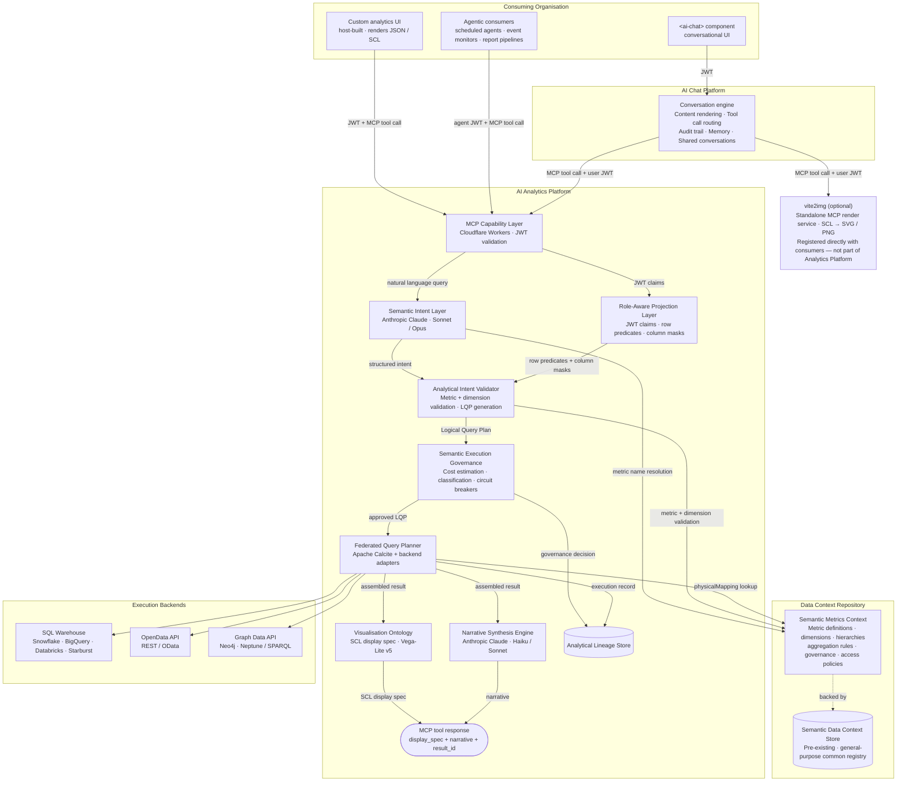
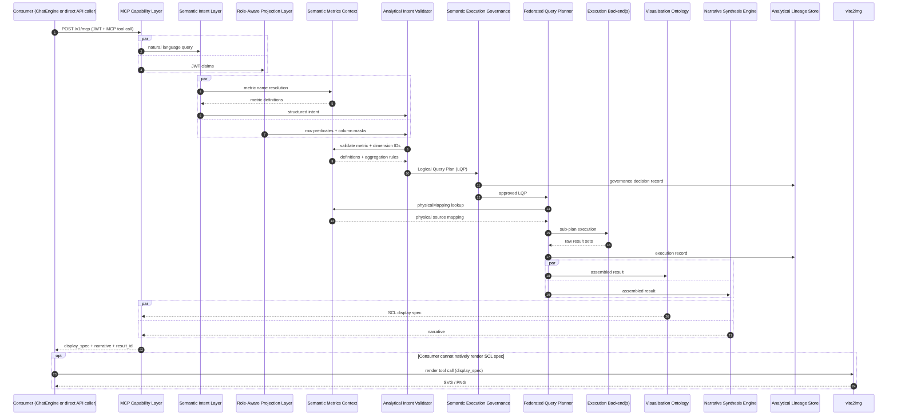

# 2. Consumer Personas and Platform Architecture

## Consumer Personas

The platform is designed to serve a heterogeneous population of users whose needs range from conversational analytics access to deep governance administration. Identifying these personas precisely is prerequisite to reasoning about access control, feature scope, and the trust model that governs each interaction. The six primary personas below represent distinct relationships with the platform, each carrying different entitlement profiles and interaction patterns.

| Persona | Role | Primary need |
|---------|------|--------------|
| **Analytical End User** | Authenticated user accessing analytics as their primary data interface | Ask governed analytical questions and receive reliable, role-appropriate results without knowledge of data structures |
| **Power Analyst** | Experienced user composing multi-dimensional requests and navigating drilldowns | Multi-dimensional exploration, governed drilldown, lineage inspection, result export |
| **Application Admin** | Privileged tenant user responsible for SMR, entitlement policies, governance config | Manage metric definitions, approve registry changes, maintain entitlement policies, review audit trail |
| **Metric Owner** | Subject-matter expert assigned ownership of SMR metric definitions | Review proposed changes to owned metrics, approve aggregation rule changes, maintain documentation |
| **Integration Engineer** | Engineer responsible for data source registration and platform configuration | Register execution backends, maintain config, integrate entitlement model |
| **Platform Admin** | Cross-tenant platform team member | Platform health, tenant onboarding, infrastructure, governance audit |

The distinctions between these personas are not merely organisational — they directly inform the platform's trust boundaries. The Analytical End User interacts exclusively through natural language and receives rendered, role-constrained results; they are deliberately shielded from physical schema details, metric identifiers, and backend routing. The Power Analyst extends this interface with drilldown navigation, lineage inspection, and export capability, but remains within the same governed query pipeline. The Compliance Analyst, while not a separate row in this taxonomy, is a specialised instantiation of the Power Analyst role with additional governance constraints applied at both column masking and export lineage levels.

The Application Admin occupies a structurally distinct position. This role is the platform equivalent of a Chief Data Officer within the tenant. It must exist before go-live and is responsible for SMR integrity — what can be queried, how metrics are defined, and who can access what. Without a configured Application Admin, the Semantic Metrics Registry contains no governed metric definitions, entitlement policies cannot be established, and the platform cannot serve any analytical query. The Application Admin owns the lifecycle of metric definitions, approves registry changes, and maintains the entitlement policies that the Role-Aware Projection Layer enforces at query time.

The Metric Owner is a delegation mechanism within that governance model: the Application Admin assigns ownership of individual metrics to subject-matter experts who then serve as the authoritative reviewers for definition changes, aggregation rule modifications, and documentation accuracy. This separation ensures that governance responsibility is distributed appropriately across domain expertise boundaries without concentrating all approval authority in a single administrator.

The Integration Engineer operates at the infrastructure boundary. Their concern is backend registration, connection configuration, and the physical mapping declarations that the Federated Query Planner resolves at execution time. They interact primarily through configuration interfaces rather than the conversational query path. The Platform Admin sits above the tenant boundary entirely, responsible for infrastructure health, tenant onboarding, and cross-tenant governance audit — this persona has no ordinary query interface into tenant data.

These personas are not mutually exclusive in practice. A single individual may hold both the Power Analyst and Metric Owner roles within a given tenant; the platform evaluates entitlements based on the combined claims present in the JWT at query time. However, the conceptual separation is maintained throughout the design to ensure that feature scope, permission model, and audit trail are reasoned about with precision.

## Illustrative Use Cases

The following journeys demonstrate how the platform's architectural components compose to serve substantively different analytical needs. Each journey has been selected to highlight a different cluster of platform features and to illustrate the governance guarantees that apply uniformly across all query types.

### Journey A: Wealth Management — Portfolio Morning Briefing

A portfolio manager begins their morning with a natural language query: "Show me portfolio returns versus benchmark across all my portfolios for the current quarter, sorted by tracking error."

The Semantic Intent Layer resolves the natural language request to three metric identifiers — `portfolio_return`, `benchmark_return`, and `tracking_error` — against the Semantic Metrics Registry. The Role-Aware Projection Layer simultaneously extracts the manager's portfolio scope from the JWT claims and constructs a row-level predicate that restricts result sets to portfolios within the manager's authorised coverage. This predicate is injected into the Logical Query Plan before any execution backend is contacted; it is not a post-hoc filter applied to a full dataset.

The Visualisation Ontology examines the assembled result pattern — multiple metrics across multiple portfolio entities, sorted by a continuous measure — and selects a multi-series bar chart as the appropriate display specification. The Narrative Synthesis Engine produces: "Across 14 portfolios, 9 outperformed their benchmark. Global Equity Opportunities has the highest tracking error at 3.2%..." This narrative is returned alongside the display specification as a single structured MCP tool response.

The manager clicks a segment of the chart. The governed drilldown mechanism traverses the `asset_class_hierarchy` dimension as defined in the SMR, applying the same role-aware projection constraints to the more granular result set. At no point does the manager's interaction surface raw SQL, physical table names, or backend routing details.

Features exercised: natural language intent resolution, role-aware row projection, multi-metric query, Visualisation Ontology chart selection, Narrative Synthesis Engine, governed drilldown.

### Journey B: Risk Management — VaR Breach Investigation

A risk officer asks: "Which portfolios are breaching their VaR 95 limit today, and what is the dominant risk factor contribution for each?"

The Semantic Intent Layer resolves three metrics — `var_95`, `var_limit`, and `risk_factor_contribution` — and identifies that this is a threshold-comparison pattern with a contributing-factor breakdown. The Federated Query Planner, informed by the physical mappings registered in the SMR, routes VaR metrics to the risk engine execution backend and portfolio metadata to the primary data warehouse. These sub-plans execute in parallel; the planner assembles the joined result set before passing it downstream.

The Visualisation Ontology recognises the metric-versus-threshold pattern across multiple entities and selects a heatmap as the display specification. The Narrative Synthesis Engine produces: "3 portfolios are breaching VaR 95 today. Emerging Markets High Yield has the most severe breach at 142% of limit. Dominant risk factor: credit spread widening in BBB-rated corporate bonds (64–71% of excess VaR)."

The risk officer opens the lineage inspector. The inspector surfaces the exact backend identifiers, row predicates, column masks, metric definition versions, and governance decisions that produced this result — all drawn from the Analytical Lineage Store, which recorded each component of the query execution as it progressed through the pipeline. The lineage record is cryptographically associated with the `result_id` returned in the original MCP response.

Features exercised: multi-engine federation, VaR metric domain, heatmap rendering, Narrative Synthesis Engine, lineage inspector.

### Journey C: Compliance — Regulatory Reporting Preparation

A compliance analyst asks for LCR and NSFR ratios for all regulated entities with a 30-day trend.

Before any metric resolution occurs, the Semantic Execution Governance component validates that the `regulatory_reporting` feature flag is active for the tenant and that the requesting user's JWT contains the `compliance_analyst` role claim. Both conditions must be satisfied; failure of either terminates the request with a structured governance rejection — not a silent empty result.

Once governance approval is issued, the Role-Aware Projection Layer applies column masks to client name and account number fields, consistent with the entitlement policy associated with this metric domain. A classification gate validates that the data classification level of the assembled result is within the analyst's authorised classification ceiling before the result is assembled. The Visualisation Ontology produces a 30-day trend line chart and a summary table of ratios versus regulatory minima. An export-ready table is prepared with the lineage record attached, required by the `requireLineageForExport: true` governance configuration on this metric domain — the export cannot be issued without it.

Features exercised: regulatory metric domain, role claim validation, column masking, data classification gating, lineage-gated export, compliance mode governance enforcement.

## Persona × Feature Matrix

The matrix below maps each major platform feature to the personas for whom it is available. Blank cells indicate that the feature is outside the operational scope of that persona, either because it is not needed or because its use would represent a governance violation.

| Feature | End User | Power Analyst | Compliance Analyst | App Admin | Metric Owner | Integration Eng |
|---------|:--------:|:-------------:|:-----------------:|:---------:|:------------:|:--------------:|
| Natural language query | ✓ | ✓ | ✓ | ✓ | | |
| Role-aware results | ✓ | ✓ | ✓ | ✓ | | |
| Governed drilldown | | ✓ | ✓ | ✓ | | |
| Lineage inspector | | ✓ | ✓ | ✓ | ✓ | |
| Narrative synthesis | ✓ | ✓ | ✓ | ✓ | | |
| Result export | ✓ | ✓ | ✓ | ✓ | | |
| SMR browsing | | ✓ | ✓ | ✓ | ✓ | |
| SMR metric management | | | | ✓ | ✓ | |
| Entitlement management | | | | ✓ | | |
| Backend registration | | | | | | ✓ |
| Governance audit trail | | | ✓ | ✓ | | ✓ |

The matrix reveals two distinct operational planes. The analytical plane — natural language query through result export — is accessible to all query-facing personas and is the interface through which business value is delivered. The governance plane — SMR management, entitlement policy, backend registration, and audit trail — is restricted to the personas whose responsibilities require it. These planes are not independently accessible: the governance plane is what makes the analytical plane safe to operate at enterprise scale.

## Platform Architecture

The platform exposes its capability through three consumption modes. The first is direct API access, where a host-built custom analytics UI calls the MCP Capability Layer directly with a structured tool invocation, supplying a JWT for entitlement resolution and receiving a structured response containing a display specification and narrative. The second is conversational backend access, where the AI Chat Platform's conversation engine calls the Analytics Platform as a tool provider, mediating between a conversational UI component and the governed query pipeline. The third is agentic access, where scheduled agents, event monitors, and automated report pipelines call the MCP Capability Layer with machine-issued JWTs to perform periodic or event-driven analytical tasks without human-in-the-loop interaction. These three modes share a single entry point and a single governance pipeline; the consumption mode affects only the caller's interaction pattern, not the trust model applied.

The architecture enforces a strict separation between the governance pipeline and the execution backends. No consumer — whether conversational, direct API, or agentic — has a path to execution backends, physical schemas, or raw SQL. Every request, without exception, enters through the MCP Capability Layer and traverses the full governance pipeline: Semantic Intent Layer, Role-Aware Projection Layer, Analytical Intent Validator, Semantic Execution Governance, and Federated Query Planner, in that order. There is no mechanism to bypass or short-circuit this pipeline. The governance guarantees described throughout this specification are structural properties of the architecture, not policy configurations that could be disabled at runtime.

The `vite2img` service is shown separately from the Analytics Platform boundary because it is an optional, independently registered MCP render service. Consumers that cannot natively render the SCL display specification — for example, an agentic pipeline that requires static image output — register `vite2img` directly and call it as a separate tool invocation using the `result_id` returned by the Analytics Platform. It is not part of the core analytics pipeline.

## Request Flow

The following sequence diagram traces a single analytical query from initial consumer invocation through to the structured response, illustrating the precise ordering and parallelism of component interactions. Steps 2–3 and 4–5 are intentionally parallel: JWT claim extraction and natural language processing proceed simultaneously, as do metric resolution and projection constraint computation. This parallelism is architecturally significant because it means that governance constraints — derived from the JWT — are computed in parallel with intent resolution rather than applied as a sequential post-processing step.

The sequence diagram makes several governance properties explicit that are not visible from the architecture diagram alone. First, the Analytical Lineage Store receives two distinct writes per query: a governance decision record at step 12 — before execution — and an execution record at step 17 — after the Federated Query Planner has received results from the backends. This two-phase lineage recording ensures that the audit trail captures both the governance outcome and the precise execution details, irrespective of whether the query ultimately succeeds. Second, display specification and narrative synthesis are produced in parallel from the same assembled result set; neither depends on the other, and both are assembled into the single MCP tool response. Third, the `vite2img` render path is explicitly optional and occurs entirely outside the Analytics Platform boundary — the `result_id` in the MCP response is what enables the consumer to request rendering without re-executing the query.

The combined effect of this architecture is a platform in which analytical access is comprehensively mediated, every result is traceable to its governance decisions and physical sources, and the separation between the semantic layer and the execution layer is maintained by design rather than by convention.
