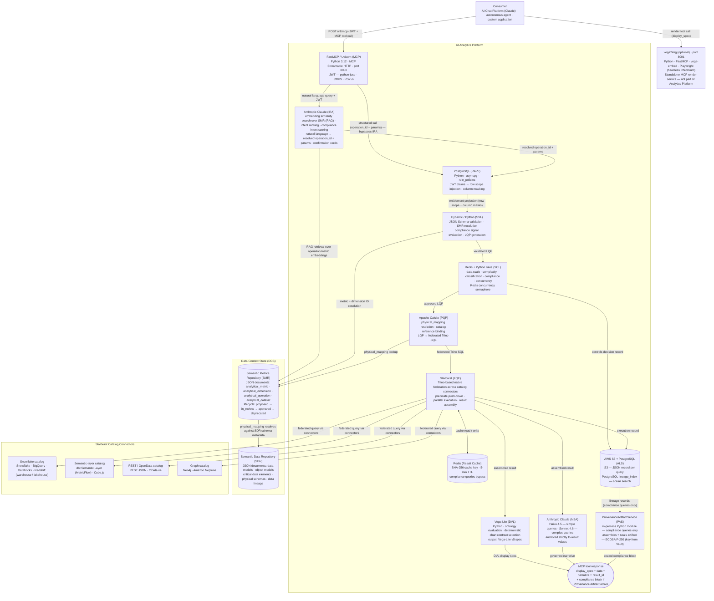

# 2. Reference Implementation

This chapter describes one reference implementation of the AI Analytics Platform. Stack choices are concrete but not prescriptive. The product specification is intentionally stack-agnostic. Any conformant implementation that satisfies the specified behaviours, governance guarantees, and interface contracts is valid. Technology substitutions at any layer require no changes to the product specification.

The product specification (component behaviours, interface contracts, governance requirements) is in [Chapter 1 -- Core Platform Capabilities](./01-core-capabilities.md). The design principles governing every decision are in [Platform Overview — Design Principles](./00-overview.md#design-principles).


## 2.1 Reference Architecture Summary

This chapter presents **one reference implementation**. It is intended as a concrete starting point — a worked example of how the capabilities defined in Chapter 1 can be realised using a specific technology stack. It is not a prescriptive design. Teams should treat each layer-level technology choice as a recommendation, not a constraint. A conformant implementation may substitute any component provided it honours the interface contracts and governance guarantees specified in Chapter 1.

The table below maps each Chapter 1 capability to its reference implementation name and the key technology it uses in this architecture. The components are listed in pipeline order.

| Capability (Ch01) | Abbr | Reference Implementation | Key Technology |
|---|---|---|---|
| MCP Capability Layer | MCP | `build_mcp_app()` + FastMCP router | Python 3.12 · FastMCP 2.x · Uvicorn · port 8000 · JWT via python-jose (RS256) |
| Intent Resolution Agent | IRA | `IntentResolutionAgent` | Python · embedding similarity search over SMR · Anthropic Claude (intent ranking + compliance intent scoring) · confirmation cards |
| Semantic Metrics Repository | SMR | `SemanticMetricsRepository` | DCS API — JSON documents: `analytical_metric`, `analytical_dimension`, `analytical_operation`, `analytical_dataset` |
| Role-Aware Projection Layer | RAPL | `RoleAwareProjectionLayer` | Python · asyncpg · PostgreSQL `role_policies` |
| Semantic Validation Layer | SVL | `SemanticValidationLayer` + `LQPGenerator` | Python · Pydantic v2 · JSON Schema validation |
| Semantic Controls Layer | SCL | `SemanticControlsLayer` | Python · Redis (concurrency semaphore) · rules engine |
| Physical Query Planner | PQP | `PhysicalQueryPlanner` | Apache Calcite · physical_mapping → catalog reference binding · LQP → federated Trino SQL |
| Federated Query Engine | FQE | `FederatedQueryEngine` (Starburst client) | Starburst (Trino) · native federation across catalog connectors — Snowflake · lakehouse · dbt Semantic Layer · Neo4j · REST/OData |
| Data Visualization Language | DVL | `DataVisualizationLanguage` | Python · priority-ordered chart contract evaluation · output: Vega-Lite v5 spec |
| Narrative Synthesis Agent | NSA | `NarrativeSynthesisAgent` | Claude Haiku 4.5 (simple queries) · Claude Sonnet 4.6 (complex queries) |
| Provenance Artifact Service | PAS | `ProvenanceArtifactService` | In-process Python module · ECDSA P-256 signing (key from Vault) · S3 sibling document `{result_id}_provenance.json` |
| Analytical Lineage Store | ALS | `AnalyticalLineageStore` | AWS S3 (JSON records per query) · PostgreSQL `lineage_index` (scalar search) |
| Result Cache | — | `ResultCache` | Redis · SHA-256 cache key · 5-min TTL · compliance queries bypass cache |

The two embedded AI components are the **Intent Resolution Agent (IRA)** and the **Narrative Synthesis Agent (NSA)**. Every stage between them — RAPL, SVL, SCL, PQP, and FQE — is deterministic.


## 2.2 Architecture Overview



The Semantic Metrics Repository (SMR) and the Semantic Data Repository (SDR) are two independent stores housed within the Data Context Store (DCS). The SDR is a pre-existing organisational component holding the foundational data definitions — data models, physical schemas, and data lineage. The SMR is a separate store holding the four analytical document types (`analytical_metric`, `analytical_dimension`, `analytical_operation`, `analytical_dataset`); both stores are built on the DCS's shared versioned storage, search index, and scoped access control, and both are reached through the DCS API. The `physical_mapping` fields in SMR metric definitions resolve against SDR schema metadata to locate the physical tables and columns behind each metric.


## 2.3 Layer-by-Layer Stack Decisions

### MCP Capability Layer

> **Specification:** [§MCP Capability Layer](./01-core-capabilities.md#mcp-capability-layer-mcp)

| Decision | Choice | Rationale |
|----------|--------|-----------|
| **Runtime** | Python · FastMCP + Uvicorn | Lightweight ASGI service; minimal dependencies; deploys as a Kubernetes pod or serverless container |
| **Protocol** | MCP Streamable HTTP | Standard MCP interoperability; supports request/response and streaming |
| **Auth** | JWT validation at request ingress | Stateless; validated before any platform computation begins |
| **Tools** | Three tools: `run_analytics` (SMR-driven execution), `list_operations` (discovery), `drilldown` (result navigation) | SMR owns all operation definitions; code is the execution engine |
| **Resources** | Knowledge artifacts only — guides, skills definitions, compliance reference | Static; no user data; embedded in AI consumer context before analytical tasks; no controls pipeline |
| **Prompts** | Pre-built analytical and regulatory assistant templates | Inject available metrics and governance constraints at session start |

FastMCP (`pip install fastmcp`) provides the `@mcp.tool()`, `@mcp.resource()`, and `@mcp.prompt()` decorators and handles MCP Streamable HTTP transport. Each analytical capability is a decorated Python function; the framework serialises schemas and routes calls automatically.

The separation of tools and resources is intentional. All analytical execution goes through `run_analytics`, a single tool that delegates to the SMR for every operation definition. Resources expose static knowledge artifacts from the Knowledge Store; they contain no user data and require no governance evaluation. The SMR owns what operations exist, what parameters they require, and which presentation stages they invoke. The code owns only the execution engine.

#### Tools

Three tools cover the entire analytical surface. The SMR owns every operation definition: what parameters it needs, what metrics and dimensions it supports, and which presentation stages it invokes. No operation type is hardcoded in the execution layer.

```python
from fastmcp import FastMCP
from pydantic import BaseModel

mcp = FastMCP(
    name="Analytics Platform",
    instructions=(
        "Governed analytical execution engine. All operations are defined in the Semantic Metrics Repository. "
        "Call list_operations to discover available operations and their required parameters before "
        "calling run_analytics."
    ),
)

# ── Tool input models ─────────────────────────────────────────────────────────

class RunAnalyticsInput(BaseModel):
    operation_id: str   # SMR operation ID — discover via list_operations
    params:       dict  # operation parameters; validated against SMR operation schema by SVL

class ListOperationsInput(BaseModel):
    domain: str | None = None  # optional filter by analytical domain

class DrilldownInput(BaseModel):
    result_id:      str
    hierarchy:      str
    selected_value: str | None = None

# ── Tools ─────────────────────────────────────────────────────────────────────

@mcp.tool()
async def run_analytics(input: RunAnalyticsInput, jwt: str) -> dict:
    """Execute an SMR-registered analytical operation.
    Call list_operations first to discover valid operation_id values and their required params.
    The presentation depth — raw dataset, display specification, or full analytical response — is
    determined by the operation's execution_profile in the SMR, not by this tool; the full controls
    pipeline runs for every operation."""
    # 1. Validate JWT → claims
    # 2. Resolve operation from SMR — rejects unknown/unapproved operation IDs
    # 3. Delegate to pipeline_executor.run — returns result shaped by execution_profile
    ...

@mcp.tool()
async def list_operations(input: ListOperationsInput, jwt: str) -> dict:
    """List all SMR-registered operations available to the current user's role.
    Returns operation IDs, display names, required parameters, supported metrics,
    supported dimensions, and execution profiles."""
    # 1. Validate JWT → claims
    # 2. Query SMR for approved operations scoped to claims["org_id"], filtered by domain if supplied
    ...

@mcp.tool()
async def drilldown(input: DrilldownInput, jwt: str) -> dict:
    """Navigate into a dimension hierarchy from a prior result.
    The parent result's analytical context (operation, filters, hierarchy position) is inherited;
    entitlements and controls are re-evaluated in full for the derived query."""
    # 1. Validate JWT → claims
    # 2. Delegate to drilldown_service.execute — inherits analytical context, never approvals
    ...
```

#### JWT Validation

Library: `python-jose[cryptography]`. The JWKS endpoint is fetched once at startup and cached with a 1-hour TTL. Required claims: `sub`, `org_id`. Optional but consumed claims: `analytics_roles`, `managed_portfolios`.

```python
from jose import jwt, JWTError

JWKS_URI     = config["auth"]["jwks_uri"]       # e.g. https://auth.example.com/.well-known/jwks.json
JWT_AUDIENCE = config["auth"]["audience"]
JWT_ISSUER   = config["auth"]["issuer"]

jwks_cache = {}  # { "keys": [...], "fetched_at": timestamp }

async def validate_jwt(token: str) -> dict:
    # Input:  raw Bearer token from MCP request header
    # Output: verified claims dict — { sub, org_id, analytics_roles, managed_portfolios, ... }

    # 1. Refresh JWKS key cache if stale (>1 hour) — avoids a key fetch on every request
    # 2. Decode and verify JWT using RS256 + cached public keys — raises AuthenticationError on failure
    # 3. Assert required claims (sub, org_id) are present — missing claims are rejected immediately
    ...
```

#### Request Routing

The MCP layer validates the JWT, then routes by call type. A **natural language** query is sent to the Intent Resolution Agent (IRA), which resolves it to an `operation_id` + `params` before the deterministic pipeline begins. A **structured** call (an explicit `operation_id` + `params`) bypasses the IRA and enters the deterministic pipeline directly. From that point the order is the same in both cases: `RAPL → SVL → SCL → PQP → FQE`.

#### Pipeline Executor

The deterministic pipeline runs in a fixed order: RAPL computes the entitlement projection first, the SVL then validates the request and compiles the Logical Query Plan with that projection enforced, the SCL applies its controls checks, the PQP translates the approved plan into federated Trino SQL, and the FQE submits it to Starburst for execution.

```python
class PipelineExecutor:
    def __init__(self, ira, rapl, svl, scl, pqp, fqe, dvl, nsa, als):
        self.ira  = ira   # IntentResolutionAgent — natural language only
        self.rapl = rapl  # RoleAwareProjectionLayer
        self.svl  = svl   # SemanticValidationLayer
        self.scl  = scl   # SemanticControlsLayer
        self.pqp  = pqp   # PhysicalQueryPlanner
        self.fqe  = fqe   # FederatedQueryEngine
        self.dvl  = dvl   # DataVisualizationLanguage
        self.nsa  = nsa   # NarrativeSynthesisAgent
        self.als  = als   # AnalyticalLineageStore

    async def run(self, operation: dict, params: dict, claims: dict) -> dict:
        # Input:  SMR operation definition + resolved call params + verified JWT claims
        #         (params already resolved by the IRA for natural-language requests)
        # Output: result dict — shape varies by execution_profile (see below)

        # 1. RAPL computes the entitlement projection (row scope + column masks) from the caller's roles
        # 2. SVL validates the request, resolves metrics from the SMR, enforces the projection,
        #    and compiles the Logical Query Plan (LQP)
        # 3. SCL approval (five checks — never skipped) → ALS controls write → PQP → FQE
        # 4. Branch on execution_profile — presentation stages only; the controls pipeline above
        #    is identical for every profile:
        #    data_retrieval  — { result_id, rows, schema, pagination }
        #    metric_query    — + DVL display_spec
        #    full_analytical — + DVL + NSA in parallel (PAS when the compliance trigger is active)
        #                    → { result_id, rows, schema, display_spec, narrative, export_requires_lineage }
        # Note: DVL is CPU-bound; asyncio.to_thread prevents it blocking the NSA API call
        ...
```

#### Drilldown Service

```python
class DrilldownService:
    def __init__(self, als, rapl, svl, scl, pqp, fqe, dvl, smr):
        self.als  = als   # AnalyticalLineageStore — fetch original lineage records
        self.rapl = rapl  # RoleAwareProjectionLayer — fresh entitlement projection at drilldown time
        self.svl  = svl   # SemanticValidationLayer — re-enforce the projection on the derived LQP
        self.scl  = scl   # SemanticControlsLayer — re-run the five checks on the derived query
        self.pqp  = pqp   # PhysicalQueryPlanner — re-plan the refined sub-queries
        self.fqe  = fqe   # FederatedQueryEngine — execute the refined federated query via Starburst
        self.dvl  = dvl   # DataVisualizationLanguage — generate updated display_spec
        self.smr  = smr   # SemanticMetricsRepository — resolve drill-target metric definitions

    async def execute(self, input: DrilldownInput, claims: dict) -> dict:
        # Input:  drilldown request — parent result_id + hierarchy dimension + selected value
        # Output: { result_id, parent_id, rows, display_spec }

        # 1. Fetch original lineage record — recovers the parent LQP and analytical context
        # 2. Clone the parent LQP and append a filter node for the selected hierarchy value
        # 3. Re-run the full pipeline on the derived query: fresh RAPL projection → SVL enforcement
        #    → SCL five checks (hierarchy descent can grow scan volume) → PQP → FQE
        # 4. DVL produces the updated display spec; lineage record written with parent_id linkage
        ...
```

#### Execution profiles

Each SMR operation carries an `execution_profile` that tells the pipeline executor which presentation stages to invoke after the full deterministic pipeline has run. Profile definitions are in [§MCP Capability Layer](./01-core-capabilities.md#mcp-capability-layer-mcp).

#### Resources

Resources are used for **knowledge artifacts** — static reference material, skills definitions, and workflow guides that AI consumers embed in their context to understand how to use the platform effectively. Dynamic data lookups (metric definitions, lineage records, dimension catalogues) are handled by tools, not resources.

```python
@mcp.resource("guide://analytics/platform-overview")
async def guide_platform_overview() -> str:
    """What the Analytics Platform does, how it governs queries, and when to use
    each analytical capability. Load this before helping a user with any analytical task."""
    return knowledge_store.get("guide/platform-overview")

@mcp.resource("guide://analytics/analytical-domains")
async def guide_analytical_domains() -> str:
    """Reference guide to the six analytical domains (portfolio, performance, risk,
    regulatory, counterparty, benchmarks) — what each covers, which metrics belong
    to it, and the governance constraints that apply."""
    return knowledge_store.get("guide/analytical-domains")

@mcp.resource("guide://analytics/query-patterns")
async def guide_query_patterns() -> str:
    """Common analytical query patterns with worked examples: time-period comparisons,
    benchmark-relative performance, risk attribution, regulatory ratio queries.
    Use this to choose the right tool and parameter structure for a given user request."""
    return knowledge_store.get("guide/query-patterns")

@mcp.resource("skills://analytics/portfolio-performance-review")
async def skills_portfolio_performance() -> str:
    """Step-by-step skills definition for conducting a portfolio performance review:
    which metrics to query, which dimensions to apply, how to interpret the results,
    and when to drilldown. Designed for AI assistants supporting portfolio managers."""
    return knowledge_store.get("skills/portfolio-performance-review")

@mcp.resource("skills://analytics/risk-analysis")
async def skills_risk_analysis() -> str:
    """Skills definition for risk metric analysis: VaR, tracking error, expected
    shortfall, issuer concentration. Covers query construction, result interpretation,
    threshold context, and escalation patterns."""
    return knowledge_store.get("skills/risk-analysis")

@mcp.resource("skills://analytics/regulatory-reporting")
async def skills_regulatory_reporting() -> str:
    """Skills definition for regulatory metric queries: required dimensions,
    compliance provenance requirements, business justification requirements,
    and how to surface lineage references in regulatory responses. The specific
    regulatory frameworks in force are carried as attributes on the metric
    definitions, not hard-coded into the platform."""
    return knowledge_store.get("skills/regulatory-reporting")

@mcp.resource("guide://compliance/regulatory-overview")
async def guide_regulatory_overview() -> str:
    """Compliance provenance reference: which query types require a business
    justification, what the provenance artifact captures, how the two-signal
    compliance trigger works, and how to explain compliance constraints to users.
    Framework-specific requirements derive from the metric definitions' regulatory
    attributes in the SMR."""
    return knowledge_store.get("guide/compliance-regulatory-overview")
```

Knowledge artifacts are stored in a versioned content store (`knowledge_store`) managed via the Admin API. Administrators can extend or override the default guides and skills definitions. Resources do not require JWT authentication (they contain no user data), but are scoped to the platform's public knowledge surface.

#### Prompts

Prompts provide pre-built instruction templates that AI consumers can load to anchor their analytical behaviour before making tool calls.

```python
@mcp.prompt()
async def analytical_assistant(jwt: str) -> str:
    """System prompt for an AI assistant using the Analytics Platform.
    Injects the organisation's available metrics and governance constraints."""
    # 1. Validate JWT → claims
    # 2. Fetch slim metric summary from SMR (id + label + description only — prompt size matters)
    # 3. Return system prompt string — instructs the assistant to use tool results only, never estimate
    ...

@mcp.prompt()
async def regulatory_reporting_assistant(jwt: str) -> str:
    """System prompt for a compliance-focused assistant operating on regulatory metrics.
    Adds regulatory framing and prohibits investment recommendations. The frameworks in
    force are derived from the regulatory attributes on the queried metric definitions."""
    # 1. Validate JWT → claims
    # 2. Fetch regulatory-domain metric summary from SMR
    # 3. Return system prompt — extends analytical_assistant rules with compliance constraints:
    #    no investment recommendations, cite result_id in every response, explain compliance errors
    ...

if __name__ == "__main__":
    mcp.run(transport="streamable-http", host="0.0.0.0", port=8000)
```

#### Error Handling

All tool call failures return a structured error envelope. The MCP framework serialises Python exceptions as tool error responses; the platform maps exception classes to stable error codes before they leave the service boundary.

```python
class AnalyticsError(Exception):
    code:    str   # stable string identifier consumed by AI clients
    message: str   # human-readable; safe to surface to end users

class AuthenticationError(AnalyticsError):        code = "AUTH_FAILED"
class AccessDeniedError(AnalyticsError):          code = "ACCESS_DENIED"
class OperationNotAvailableError(AnalyticsError): code = "OPERATION_NOT_FOUND"
class MetricNotFoundError(AnalyticsError):        code = "METRIC_NOT_FOUND"
class ControlsCeilingExceeded(AnalyticsError):    code = "CONTROLS_REJECTED"   # data scale or complexity ceiling
class ConcurrentQueryLimitExceeded(AnalyticsError): code = "CAPACITY_LIMIT"
class NarrativeValidationError(AnalyticsError):   code = "NARRATIVE_FAILED"
class ClassificationGateError(AnalyticsError):    code = "CLASSIFICATION_BLOCKED"

def handle_tool_error(exc: Exception) -> dict:
    # Input:  any exception raised inside a tool handler
    # Output: { error: { code, message } } — safe to return to the AI consumer

    # Known AnalyticsError subclasses map to stable error codes (see table above)
    # All other exceptions collapse to INTERNAL_ERROR — detail is never leaked to the consumer
    ...
```

Error code reference table:

| Code | Raised by | Consumer action |
|------|-----------|-----------------|
| `AUTH_FAILED` | JWT validation | Re-authenticate; do not retry with same token |
| `ACCESS_DENIED` | RAPL | Inform user; do not retry |
| `OPERATION_NOT_FOUND` | SMR | Call `list_operations` to discover valid operation IDs |
| `METRIC_NOT_FOUND` | SMR | Call `list_operations` to check available metrics |
| `CONTROLS_REJECTED` | SCL | Reduce metric count, scan scope, or time range; inform user |
| `CAPACITY_LIMIT` | SCL | Retry with exponential back-off |
| `NARRATIVE_FAILED` | NSA | Return result without narrative; log for operator review |
| `CLASSIFICATION_BLOCKED` | SCL | Inform user the requested metric requires elevated access |
| `INTERNAL_ERROR` | Any | Log `result_id` if available; operator investigation required |


### Intent Resolution Agent

> **Specification:** [§Intent Resolution Agent](./01-core-capabilities.md#intent-resolution-agent-ira)

| Decision | Choice | Rationale |
|----------|--------|-----------|
| **Candidate retrieval** | Embedding similarity search over SMR operation/metric embeddings | RAG retrieval narrows the full catalogue to a handful of candidates before the model ranks them |
| **Intent ranking** | Anthropic Claude | Ranks candidate operations and binds parameters from the natural-language query |
| **Confirmation** | Candidate cards when intent is ambiguous | The user selects or refines before any query executes |
| **Compliance intent** | `compliance_purpose_score` produced within the same ranking call | Signal 2 of the SCL's two-signal compliance gate; an ambiguous purpose triggers a clarification card rather than a guess |
| **Scope** | Natural-language requests only | Structured `operation_id` + `params` calls bypass the IRA entirely and declare compliance purpose explicitly |

The Intent Resolution Agent (IRA) is the only AI step in the pre-computation pipeline. It receives a natural-language query and the caller's JWT from the MCP layer, retrieves candidate operations from the SMR catalogue using embedding similarity search, ranks them with a language model, binds parameters to the leading candidate, and derives a presentation preview. Within the same ranking call it scores whether the stated purpose of the query is compliance-driven — the `compliance_purpose_score` forwarded with the resolved intent and consumed by the SCL's two-signal compliance gate — and clarifies with the user through the confirmation card flow when the purpose is ambiguous. When the top candidate is confident and unambiguous, the resolved intent is forwarded directly to the RAPL; when it is ambiguous, ranked candidate cards are returned to the consumer for selection or conversational refinement. The IRA produces no output visible to the end user once intent is resolved, and makes no governance or execution decisions — those belong to the deterministic pipeline that follows.

```python
import anthropic

class IntentResolutionAgent:
    def __init__(self, smr: "SemanticMetricsRepository", client: anthropic.AsyncAnthropic):
        self.smr    = smr
        self.client = client

    RANKING_MODEL = "claude-sonnet-4-6"

    async def resolve(self, query: str, claims: dict) -> dict:
        # Input:  natural-language query + verified JWT claims
        # Output: resolved intent — { operation_id, params, presentation_hint, compliance_purpose_score }
        #         or a candidate-card set when intent or compliance purpose is ambiguous

        # 1. Embed the query and retrieve top-k candidate operations from the SMR by vector similarity
        # 2. Rank candidates with the language model; bind params to the leading operation;
        #    score compliance intent of the stated purpose in the same call
        # 3. If the top candidate is confident and clear of the runner-up, return the resolved intent → RAPL
        # 4. Otherwise return ranked candidate cards for the consumer to select or refine
        ...

    async def _retrieve_candidates(self, query: str, claims: dict) -> list[dict]:
        # Input:  query string + claims (for org scoping)
        # Output: top-k approved operations from the SMR catalogue by embedding similarity
        ...

    def _rank_and_bind(self, query: str, candidates: list[dict]) -> dict:
        # Input:  query + candidate operations
        # Output: ranked candidates with bound params + confidence scores
        # The model only ranks and binds; it never selects chart types or makes governance decisions
        ...

    def _score_compliance_intent(self, query: str, ranked: dict) -> float:
        # Input:  natural-language query + ranked leading candidate
        # Output: float 0.0–1.0 — compliance purpose probability (Signal 2 of the two-signal gate)
        # Scored by the language model within the same ranking call — no separate API call
        # A score near compliance_intent_threshold triggers a clarification card instead of a guess
        ...
```

Structured API consumers that already know the `operation_id` skip the IRA entirely: the MCP layer routes their call straight into the deterministic pipeline at the RAPL.


### Semantic Validation Layer

> **Specification:** [§Semantic Validation Layer](./01-core-capabilities.md#semantic-validation-layer-svl)

| Decision | Choice | Rationale |
|----------|--------|-----------|
| **Parameter validation** | JSON Schema + Pydantic | Strict schema enforcement against MCP tool input models; structured error responses |
| **SMR resolution** | Direct SMR service call | Synchronous lookup against the metric registry; rejects unregistered IDs before LQP generation |
| **LQP generation** | Custom Python | Backend-agnostic DAG construction from validated parameters; deterministic for any given input |

`SemanticValidationLayer` runs after the RAPL. It receives the entitlement projection (row scope and column masks) from the RAPL together with the resolved request, validates params, resolves metrics from the SMR, enforces the projection, attaches the IRA's compliance intent score, and delegates DAG construction to `LQPGenerator`. The SVL performs no compliance classification of its own — the `compliance_purpose_score` is produced by the IRA at intent resolution (structured calls, which bypass the IRA, declare compliance purpose explicitly via a `compliance_purpose` parameter); the SVL attaches it to the LQP so the SCL can apply its two-signal gate. The SVL also attaches a Tier-1 `preliminary_impact_estimate` — the sum of the resolved metrics' `performance_impact_weight` values — as a coarse indicator of query weight; the SCL replaces this with a precise `estimated_scan_rows` figure at its data-scale check.

```python
class SemanticValidationLayer:
    def __init__(self, smr: "SemanticMetricsRepository"):
        self.smr = smr

    async def resolve(self, operation: dict, params: dict, projection: dict, claims: dict) -> dict:
        # Input:  SMR operation definition + resolved call params + RAPL entitlement projection + JWT claims
        # Output: LQP with compliance_purpose_score, resolved_metrics, and preliminary_impact_estimate attached

        # 1. Validate params against operation's required_params — fail fast before any SMR calls
        # 2. Resolve each metric ID from SMR — rejects unknown or non-approved metrics
        # 3. Enforce the RAPL projection — inject row scope filter nodes; embed column masks on the LQP
        # 4. Delegate DAG construction to LQPGenerator (see §Semantic Validation Layer — LQP examples)
        # 5. Attach compliance_purpose_score from the resolved request — scored by the IRA for
        #    natural-language queries; explicit compliance_purpose param for structured calls
        # 6. Attach preliminary_impact_estimate (Σ performance_impact_weight) — Tier-1 coarse estimate
        # 7. Retain resolved_metrics on LQP — SCL needs them for classification and compliance checks
        ...

    def _validate_params(self, params: dict, required: list[str]) -> None:
        # Input:  raw params dict + required field list from SMR operation definition
        # Raises: ValueError listing all missing keys — fast rejection before SMR resolution
        ...
```


### Narrative Synthesis Agent

> **Specification:** [§Narrative Synthesis Agent](./01-core-capabilities.md#narrative-synthesis-agent-nsa)

| Decision | Choice | Rationale |
|----------|--------|-----------|
| **Provider** | Anthropic Claude | Reliable instruction-following for constrained summarisation tasks |
| **Standard queries** | Claude Haiku | Sub-200ms narrative generation for simple metric summaries |
| **Complex queries** | Claude Sonnet | Attribution decompositions and multi-portfolio results require richer prose |
| **Prompt construction** | Result-only context | Metric labels + row values + units injected; no user query, no physical schema |
| **Post-generation validation** | Custom Python | Every numeric value in narrative matched against result set; reject and retry once on failure |
| **Feature flag** | `features.narrativeSynthesis` | Platform-level on/off; disabled means NSA is never invoked |

```python
import anthropic

class NarrativeSynthesisAgent:
    def __init__(self, client: anthropic.AsyncAnthropic):
        self.client = client

    # Update model IDs on deprecation — or read from platform config models.narrativeSynthesisModel
    FAST_MODEL     = "claude-haiku-4-5-20251001"
    STANDARD_MODEL = "claude-sonnet-4-6"

    async def synthesise(self, result: dict, operation: dict) -> str:
        # Input:  assembled FQE result + SMR operation definition
        # Output: governed narrative string — all numeric values verified against result rows

        # 1. Select model — Haiku for simple results (≤5 metrics, ≤3 dimensions); Sonnet otherwise
        # 2. Build prompt — injects metric labels, row values, and units; never includes user query or schema
        # 3. Call Anthropic API and extract narrative text
        # 4. Validate numbers in narrative against result rows — retry once on failure
        # 5. Raise NarrativeValidationError if validation fails on both attempts
        ...

    def _is_simple(self, result: dict) -> bool:
        # Input:  assembled result with schema field list
        # Output: True if ≤5 metrics and ≤3 dimensions — routes to Haiku
        #         Attribution, multi-portfolio, and regulatory queries always route to Sonnet regardless of count
        ...

    def _build_prompt(self, result: dict, operation: dict) -> str:
        # Input:  result rows + operation display_name
        # Output: prompt string — metric labels + values injected; no user query, no physical schema
        # Keeping the prompt free of schema details prevents the model from leaking internal structure
        ...

    def _validate_numbers(self, narrative: str, rows: list[dict]) -> None:
        # Input:  generated narrative + result rows
        # Raises: NarrativeValidationError if any numeric value in the narrative is not present
        #         verbatim in the result rows — every cited figure must match a result value exactly
        # Purpose: prevents hallucinated figures reaching the consumer
        ...
```


### Provenance Artifact Service (PAS)

> **Specification:** [§Provenance Artifact Service](./01-core-capabilities.md#provenance-artifact-service-pas)

| Decision | Choice | Rationale |
|----------|--------|-----------|
| **Deployment** | In-process module within the `analytics-mcp` service | Invoked only for compliance-purpose queries — low volume; shares the S3 lineage bucket the service already writes to; no extra deployable |
| **Signing** | ECDSA P-256 (SHA-256) via the `cryptography` library | Matches the artifact signature block in Chapter 0; any holder of the published public key can verify independently |
| **Key management** | Private key injected from Vault / Kubernetes Secrets; public key published | Key never baked into container images; rotation via `key_id` |
| **Sealing** | Artifact written to S3 as the `{result_id}_provenance.json` sibling document | Immutable from the moment of writing — same write-once semantics as lineage records |
| **Export gate** | `export_requires_lineage: true` until the S3 write is confirmed | Consumer withholds export affordances until sealing is confirmed |

The PAS runs in the parallel presentation-assembly step alongside the DVL and NSA, but only when the SCL's two-signal compliance check is active. It reads the projection, controls decision, and execution records for the current query from the ALS, assembles the Provenance Artifact document, signs it, writes it back to the ALS as an immutable sibling record, and returns the sealed compliance block for inclusion in the MCP tool response.

> **Hardening note:** in this reference implementation the signing key is held in the `analytics-mcp` process. High-assurance deployments can isolate it by splitting the PAS into its own service, or by delegating signing to a cloud KMS/HSM so the private key is never exportable — the interface contract is unchanged either way.

```python
class ProvenanceArtifactService:
    def __init__(self, als: "AnalyticalLineageStore", signing_key, key_id: str):
        self.als         = als          # reads lineage records; writes the sealed sibling document
        self.signing_key = signing_key  # ECDSA P-256 private key — injected from Vault, never logged
        self.key_id      = key_id       # published with the artifact for verification and rotation

    async def seal(self, result_id: str, lqp: dict, compliance: dict) -> dict:
        # Input:  result_id + approved LQP + compliance context (signals, intent score, frameworks)
        # Output: sealed compliance block — { compliance_purpose, intent_score, triggered_by_metrics,
        #         triggered_by_frameworks, regulatory_trace_id, artifact_set_version,
        #         export_requires_lineage, classification_ceiling_applied }

        # 1. Fetch the projection, controls decision, and execution records from the ALS
        # 2. Assemble the Provenance Artifact — intent, escalation signals, metric versions,
        #    logical field spec, physical execution detail, entitlement snapshot
        # 3. Sign the canonical serialised artifact — ECDSA-P256-SHA256, signed_fields listed
        # 4. Write {result_id}_provenance.json to the ALS bucket — immutable sibling record
        # 5. Return the compliance block; the export gate stays locked until the write is confirmed
        ...

    def _sign(self, artifact: dict) -> dict:
        # Input:  assembled artifact dict
        # Output: signature block — { algorithm, key_id, signed_fields, value, sealed_at }
        ...
```


### Semantic Metrics Repository (SMR)

> **Specification:** [§Semantic Metrics Repository](./01-core-capabilities.md#semantic-metrics-repository-smr)

| Decision | Choice | Rationale |
|----------|--------|-----------|
| **Definition storage** | DCS store, sibling to the SDR | Metric and operation definitions held in the SMR — a separate store from the SDR, both within the Data Context Store; no duplicate semantic infrastructure |
| **Authoring and approval** | DCS native capabilities | Document creation, versioning, and approval workflow are handled by the existing DCS tooling shared with the SDR — no new write layer needed |
| **Runtime reads** | Direct DCS API query by Semantic Validation Layer | Definitions read from the authoritative source at resolution time |
| **Search** | DCS native search index | `list_operations` queries the DCS index directly — no separate search infrastructure |

The SMR and the SDR are two independent stores within the Data Context Store (DCS). The SMR holds four document types — `analytical_metric`, `analytical_dimension`, `analytical_operation`, and `analytical_dataset` — while the SDR holds the foundational data definitions. The DCS manages the full document lifecycle (draft → in review → approved → deprecated) for all four SMR types using the same versioned storage, search, and approval capabilities the SDR relies on.

#### SMR document type: `analytical_metric`

The core metric definition. One document per approved metric version. The `status` field follows the DCS approval lifecycle; the Semantic Validation Layer only resolves documents with `"status": "approved"`.

```json
{
  "type":                 "analytical_metric",
  "org_id":            "acme-wealth",
  "metric_id":            "var_95",
  "version":              2,
  "status":               "approved",
  "source":               "platform",
  "display_name":         "Value at Risk (95%)",
  "description":          "Maximum expected portfolio loss over a 1-day horizon at 95% confidence.",
  "domain":               "risk",
  "category":             "market_risk",
  "unit":                 "percentage",
  "decimals":             2,
  "aggregation":          "value_weighted_average",
  "weight_metric_id":     "market_value",
  "performance_impact_weight":          3,
  "classification_level": "internal",
  "data_affinity":        "risk_metrics",
  "physical_mapping": {
    "source":  "risk-semantic-layer",
    "cube":    "risk_cube",
    "measure": "var_95_daily"
  },
  "formula":              "MAX(losses) WHERE confidence_level = 0.95",
  "compliance_relevant":  false,
  "regulatory_framework": [],
  "required_dimensions":  ["portfolio_id", "as_of_date"],
  "optional_dimensions":  ["asset_class", "geography", "sector", "currency"],
  "approved_by":          "cdo@acme.com",
  "approved_at":          "2026-05-14T09:00:00Z",
  "created_at":           "2026-05-13T14:32:00Z"
}
```

`status` is one of `"proposed"` | `"in_review"` | `"approved"` | `"deprecated"` | `"retired"`. The DCS enforces a uniqueness constraint: at most one document per `(org_id, metric_id)` may carry `"status": "approved"` at any point in time. All prior versions are retained as `"deprecated"` for lineage reconstruction. `source` is `"platform"` for Financial Services Reference Model entries and `"custom"` for organisation-customised definitions.

`weight_metric_id` is required when `aggregation` is `"value_weighted_average"` (or any other weighted aggregation variant) and must reference the `metric_id` of an approved `analytical_metric` in the SMR. The SVL resolves and validates this reference at query time. If the weight metric is missing or unapproved, the query is rejected. The field is absent for non-weighted aggregations (`"sum"`, `"last"`, `"count"`, `"min"`, `"max"`, `"mean"`). The LQP generator emits a `weight_metric_id` key on the `metric_scan` node so that the execution backend can fetch the weighting values alongside the primary metric.

`formula` stores the business-logic expression defined in the [SMR formula language](./01-core-capabilities.md#formula-language). It is the human-readable and audit-visible definition of what the metric computes. At query time the FQE resolves the formula against the `physical_mapping` to generate the backend-specific query; the formula itself is never executed directly. Metrics backed entirely by a pre-computed measure in a semantic layer (e.g. a Cube.js measure) may leave `formula` as an empty string and rely solely on `physical_mapping`.

#### SMR document type: `analytical_dimension`

Dimension definitions are the third SMR document type. They define the valid slicing axes referenced in `supported_dimensions` and `required_dimensions` on metrics and operations. The SVL validates dimension IDs against this catalogue at resolution time.

```json
{
  "type":             "analytical_dimension",
  "org_id":        "acme-wealth",
  "dimension_id":     "asset_class",
  "version":          1,
  "status":           "approved",
  "source":           "platform",
  "display_name":     "Asset Class",
  "description":      "Top-level asset class classification applied to holdings.",
  "data_affinity":    "portfolio",
  "physical_mapping": { "source": "primary-warehouse", "table": "dim_asset_classification", "column": "asset_class" },
  "values":           ["EQUITY", "FIXED_INCOME", "ALTERNATIVES", "CASH", "DERIVATIVES"],
  "hierarchical":     false,
  "parent_dimension": null
}
```

#### SMR document type: `analytical_operation`

The operation catalogue. One document per approved operation. The `execution_profile` field tells the pipeline executor which stages to invoke. The `supported_metrics` and `supported_dimensions` lists are enforced by the Semantic Validation Layer. A `run_analytics` call referencing an out-of-catalogue value is rejected before LQP generation.

```json
{
  "type":              "analytical_operation",
  "org_id":         "acme-wealth",
  "operation_id":        "get_positions",
  "version":             1,
  "status":              "approved",
  "source":              "platform",
  "display_name":        "Portfolio Positions",
  "description":         "Fetch current or historical position data for a portfolio.",
  "execution_profile":   "data_retrieval",
  "required_params":     ["portfolio_id"],
  "optional_params":     ["as_of_date", "asset_class"],
  "supported_metrics":   [],
  "supported_dimensions": ["portfolio_id", "asset_class", "currency", "instrument_id", "as_of_date"]
}
```

#### SMR document type: `analytical_dataset`

The governed dataset contract for bulk retrieval. The `approved_fields` set — with per-field classification — defines exactly which columns a `data_retrieval` operation may return for this dataset; fields above the caller's classification ceiling are excluded at projection time.

```json
{
  "type":             "analytical_dataset",
  "org_id":           "acme-wealth",
  "dataset_id":       "fixed_income_daily_positions",
  "version":          1,
  "status":           "approved",
  "source":           "platform",
  "display_name":     "Fixed Income Daily Positions",
  "description":      "Daily position and PnL records for fixed income portfolios.",
  "domain":           "portfolio",
  "data_affinity":    "portfolio",
  "physical_mapping": { "source": "primary-warehouse", "table": "positions_fact" },
  "approved_fields": [
    { "field": "portfolio_id",  "classification_level": "internal" },
    { "field": "instrument_id", "classification_level": "internal" },
    { "field": "asset_class",   "classification_level": "internal" },
    { "field": "daily_pnl",     "classification_level": "internal" },
    { "field": "market_value",  "classification_level": "internal" },
    { "field": "duration",      "classification_level": "internal" },
    { "field": "currency",      "classification_level": "internal" },
    { "field": "position_date", "classification_level": "internal" }
  ],
  "required_dimensions": ["portfolio_id", "position_date"],
  "pagination":       { "default_page_size": 10000, "max_page_size": 50000 },
  "refresh_cadence":  "daily",
  "approved_by":      "cdo@acme.com",
  "approved_at":      "2026-05-14T09:00:00Z",
  "created_at":       "2026-05-13T14:32:00Z"
}
```

```python
class SemanticMetricsRepository:
    def __init__(self, sdr_client):
        self.sdr = sdr_client

    async def get_operation(self, operation_id: str, claims: dict) -> dict:
        # Input:  operation_id string + JWT claims (for org_id scoping)
        # Output: approved analytical_operation document from SDR
        # Raises: OperationNotAvailableError if not found or status != "approved"
        ...

    async def list_operations(self, claims: dict, domain: str | None = None) -> list[dict]:
        # Input:  JWT claims + optional domain filter
        # Output: list of approved analytical_operation documents for the caller's org
        ...

    async def get_metric(self, metric_id: str, claims: dict) -> dict:
        # Input:  metric_id string + JWT claims
        # Output: approved analytical_metric document — includes physical_mapping and compliance fields
        # Raises: MetricNotFoundError if not found or not approved
        ...

    async def list_metrics(self, claims: dict, **filters) -> list[dict]:
        # Input:  JWT claims + arbitrary SDR filter kwargs (status, domain, etc.)
        # Output: list of matching analytical_metric documents for the caller's org
        ...

    async def list_approved_summary(self, claims: dict, domain: str | None = None) -> list[dict]:
        # Input:  JWT claims + optional domain filter
        # Output: slim list — [{ id, label, description }] — injected into prompt context
        # Intentionally minimal: prompt context size matters; full definitions are available via get_metric
        ...
```


### Semantic Validation Layer — LQP examples

The MCP tool call JSON (metric IDs, dimension IDs, time period, filters) is the analytical intent representation. The SVL validates these parameters, resolves metrics from the SMR, applies the RAPL entitlement projection, and constructs the LQP DAG.

#### MCP input example

```json
{
  "tool": "run_analytics",
  "input": {
    "operation_id": "compare_portfolios",
    "params": {
      "portfolio_ids": ["GLOB_EQ_OPP", "UK_CORE_INC"],
      "metrics":       ["portfolio_return", "tracking_error"],
      "time_period":   "quarter_to_date"
    }
  }
}
```

The Semantic Validation Layer resolves metric IDs against the SMR, enforces the RAPL entitlement projection, and emits a platform-agnostic LQP. The LQP carries pinned metric definition versions, expanded time ranges, row scope filters, and a Tier-1 `preliminary_impact_estimate` for governance validation; physical mappings are resolved later by the PQP from the SMR, keyed on the pinned versions.

#### LQP output example

```json
{
  "lqp_id": "lqp-20260514-093241-xyz",
  "org_id": "acme-wealth",
  "nodes": [
    {
      "id": "node-1",
      "op": "metric_scan",
      "metric_id": "portfolio_return",
      "metric_version": "2.1.0",
      "aggregation": "value_weighted_average",
      "data_affinity": "portfolio"
    },
    {
      "id": "node-2",
      "op": "metric_scan",
      "metric_id": "tracking_error",
      "metric_version": "1.3.0",
      "aggregation": "value_weighted_average",
      "data_affinity": "risk_metrics"
    },
    {
      "id": "node-3",
      "op": "join",
      "inputs": ["node-1", "node-2"],
      "join_keys": ["portfolio_id", "date"]
    },
    {
      "id": "node-4",
      "op": "filter",
      "input": "node-3",
      "predicates": [
        "portfolio_id IN ('GLOB_EQ_OPP', 'UK_CORE_INC')",
        "asset_class = 'EQUITY'"
      ]
    },
    {
      "id": "node-5",
      "op": "time_expand",
      "input": "node-4",
      "period": "quarter_to_date",
      "as_of_date": "2026-05-14",
      "resolved_range": { "from": "2026-04-01", "to": "2026-05-14" }
    },
    {
      "id": "node-6",
      "op": "sort",
      "input": "node-5",
      "by": [{ "field": "portfolio_return", "direction": "desc" }]
    }
  ],
  "preliminary_impact_estimate": 850,
  "column_masks": [],
  "row_scope_applied": true
}
```

```python
from datetime import date, timedelta

class LQPGenerator:
    def build(self, operation: dict, params: dict, metrics: list[dict], claims: dict) -> dict:
        # Input:  SMR operation + validated params + resolved metric documents + JWT claims
        # Output: LQP dict — { lqp_id, org_id, nodes: [...], output: terminal_node_id }

        # 1. Emit one metric_scan node per resolved metric — carries metric version, data affinity, and aggregation
        # 2. If metrics span >1 node, emit a join node — join keys inferred from shared required_dimensions
        # 3. Emit filter node from params["filters"] if present
        # 4. Emit time_expand node if time_period or as_of_date in params — resolves symbolic period to date range
        # 5. Emit sort node from params["sort"] or operation["default_sort"] if present
        # Note: "output" points to the terminal node — PQP reads this to find the plan entry point
        ...

    def _infer_join_keys(self, metrics: list[dict]) -> list[str]:
        # Input:  list of resolved metric documents
        # Output: intersection of required_dimensions across all metrics — safe shared join keys
        # Raises: ValueError if no shared dimensions exist — co-queried metrics must share at least one
        ...

    def _render_predicate(self, f: dict) -> str:
        # Input:  filter dict — { dimension, operator, value }
        # Output: SQL predicate string — e.g. "asset_class IN ('EQUITY', 'FIXED_INCOME')"
        ...

    def _resolve_time(self, params: dict) -> dict:
        # Input:  params with time_period and/or as_of_date
        # Output: { from: ISO date, to: ISO date } — concrete range for time_expand node
        # Handles: month_to_date, quarter_to_date, year_to_date, trailing_12m; defaults to point-in-time
        ...
```


### Role-Aware Projection Layer

> **Specification:** [§Role-Aware Projection Layer](./01-core-capabilities.md#role-aware-projection-layer-rapl)

| Decision | Choice | Rationale |
|----------|--------|-----------|
| **Implementation** | Custom middleware (Python) | Thin, stateless; computes the entitlement projection before the LQP is compiled |
| **Role resolution** | JWT claim extraction + PostgreSQL role config | Role claim field name is configurable |
| **Row scope** | `{{user.claim_name}}` template interpolation at projection time | Resolved from JWT claims; passed to the SVL, which injects the row scope filter nodes |
| **Column masking** | Registered in the projection; applied post-assembly in the FQE result assembler | Post-assembly supports cross-backend result sets |
| **Default policy** | `defaultDenyAll: true` | No access unless a matching role is found |

#### Role policies schema

Role policy documents are stored in the PostgreSQL `role_policies` table. Each document maps directly to the following JSON shape:

```json
{
  "role_id":        "regional_analyst",
  "org_id":         "acme-wealth",
  "allowed_metrics": null,
  "denied_metrics":  ["var_99", "expected_shortfall"],
  "row_scope": {
    "portfolio": "portfolio_id IN ({{user.managed_portfolios}})"
  },
  "column_masks": {
    "aum": {
      "condition":   "{{user.roles}} NOT CONTAINS 'senior_analyst'",
      "action":      "suppress",
      "replacement": null
    }
  },
  "created_at": "2026-05-14T09:00:00Z",
  "updated_at": "2026-05-14T09:00:00Z"
}
```

Field reference:

| Field | Type | Description |
|-------|------|-------------|
| `role_id` | string | Matches the role name in the JWT `analytics_roles` claim |
| `org_id` | string | Organisation scope — one policy per org per role |
| `allowed_metrics` | array \| null | Null = all metrics permitted; array = explicit allowlist |
| `denied_metrics` | array | Metric IDs denied regardless of `allowed_metrics` |
| `row_scope` | object | Key = dimension name; value = `{{user.claim}}` template string |
| `column_masks` | object | Key = field name; value = mask rule with `action: "suppress"` or `"hash"` |

```python
class RoleAwareProjectionLayer:
    def __init__(self, pg_pool, config: dict = None):
        self.pg     = pg_pool
        self.config = config or {}   # platform config — used for roleClaimField lookup

    async def project(self, request: dict, claims: dict) -> dict:
        # Input:  resolved request (operation + params) + JWT claims
        # Output: entitlement projection — { metric_access, dimension_access, row_scope, column_masks }
        #         consumed by the SVL, which enforces it while compiling the LQP

        # 1. Extract analytics_roles from claims — roleClaimField is configurable
        # 2. Load a role policy for each role — raises AccessDeniedError if none found (defaultDenyAll)
        # 3. Merge policies — row scope intersected; column masks unioned
        # 4. Resolve row scope templates against the JWT claims into concrete conditions
        # 5. Return the projection — the SVL injects the row scope nodes and embeds the column masks
        ...

    def _merge_policies(self, policies: list[dict]) -> dict:
        # Input:  list of role policy documents for all of the user's roles
        # Output: merged policy — { row_scope, column_masks }

        # Row scope: strict AND — every condition from every role is applied; where two roles
        #   constrain the same dimension, their value sets intersect (most restrictive wins,
        #   independent of role order)
        # Column masks: union — masked by any role means masked for the user
        ...

    def _resolve_row_scope(self, policy: dict, claims: dict) -> list[dict]:
        # Input:  merged policy + claims (for template interpolation)
        # Output: list of resolved row scope conditions for the SVL to inject as filter nodes
        ...

    def _interpolate(self, template: str, claims: dict) -> str:
        # Input:  predicate template string — e.g. "portfolio_id IN ({{user.managed_portfolios}})"
        # Output: resolved predicate string with {{user.claim_name}} tokens replaced by JWT claim values
        # List claims are expanded to comma-separated quoted values; unknown tokens collapse to empty string
        ...

    async def _load_policy(self, org_id: str, role: str) -> dict | None:
        # Input:  org_id + role name
        # Output: role_policies row as dict, or None if no policy exists for this role
        ...
```


### Semantic Controls Layer

> **Specification:** [§Semantic Controls Layer](./01-core-capabilities.md#semantic-controls-layer-scl)

| Decision | Choice | Rationale |
|----------|--------|-----------|
| **Implementation** | Custom rules engine (Python) | Deterministic; config-driven; no ML inference |
| **Five checks** | Data scale · complexity · classification gate · compliance · concurrency | Every query passes all five before release to the PQP |
| **Data-scale estimation** | Tier-2 `estimated_scan_rows` from SDR profiling statistics | Precise scan volume computed from row counts, partition sizes, and time-series distributions; replaces the SVL's Tier-1 `preliminary_impact_estimate` |
| **Config store** | DCS document store — `controls_config` document type | Platform-level thresholds stored as a JSON document alongside SMR documents |

Concurrent query enforcement uses a Redis-backed semaphore rather than an in-process counter, ensuring the limit applies across all running pods.

The platform has one controls config document. The Semantic Controls Layer reads it at startup and refreshes it on change events from the DCS:

```json
{
  "type":                       "controls_config",
  "org_id":                     "acme-wealth",
  "max_scan_rows":              50000000,
  "max_metrics_per_query":      10,
  "max_dimensions":             5,
  "max_join_depth":             4,
  "classification_gate":        true,
  "blocked_classifications":    ["TOP_SECRET", "RESTRICTED"],
  "max_concurrent_queries":     20,
  "query_timeout_seconds":      60,
  "require_lineage_for_export": true,
  "audit_all_queries":          true,
  "compliance_intent_threshold": 0.8
}
```

Compliance is always active and evaluated per request — there is no platform on/off switch. The `compliance_intent_threshold` only tunes the sensitivity of the second signal.

```python
class SemanticControlsLayer:
    def __init__(self, sdr_client, pg_pool, redis_client):
        self.sdr   = sdr_client   # DCS/SDR client — reads profiling statistics for the data-scale check
        self.pg    = pg_pool
        self.redis = redis_client

    async def _acquire_query_slot(self, org_id: str, config: dict) -> None:
        # Input:  org_id + controls config (for max_concurrent_queries and timeout)
        # Raises: ConcurrentQueryLimitExceeded if the org is at its concurrent query ceiling
        # Uses Redis INCR as a cross-pod atomic counter — safe under horizontal scaling
        ...

    async def _release_query_slot(self, org_id: str) -> None:
        # Decrements the Redis counter — called in the except block of approve() to release on failure
        ...

    async def approve(self, lqp: dict, claims: dict) -> dict:
        # Input:  SVL-validated LQP (carries preliminary_impact_estimate) + JWT claims
        # Output: LQP with controls_approved: true and estimated_scan_rows attached
        # Raises: one of ControlsCeilingExceeded, ClassificationGateError, ConcurrentQueryLimitExceeded

        # The five sequential checks:
        # 1. Load controls config for the org
        # 2. Concurrency  — acquire Redis query slot; ConcurrentQueryLimitExceeded if at ceiling
        # 3. Data scale   — compute estimated_scan_rows from SDR profiling; ControlsCeilingExceeded if > max_scan_rows
        # 4. Complexity   — node count and join depth vs limits; ControlsCeilingExceeded if exceeded
        # 5. Classification gate — ClassificationGateError if any metric is in blocked_classifications
        # 6. Compliance   — two-signal trigger; escalates to Provenance Artifact if both signals active
        # Note: all checks are inside try/except so the semaphore slot is always released on failure
        ...

    def _estimate_scan_rows(self, lqp: dict, config: dict) -> int:
        # Input:  LQP with resolved_metrics and nodes
        # Output: Tier-2 estimated_scan_rows — compared against config["max_scan_rows"]

        # Computed from SDR profiling statistics rather than a static weight:
        #   - base table row counts for each metric_scan node's physical_mapping
        #   - partition sizes and the resolved time range from the time_expand node
        #   - time-series volume distributions for the requested period
        # This precise figure replaces the SVL's Tier-1 preliminary_impact_estimate on the LQP.
        ...

    def _check_complexity(self, lqp: dict, config: dict) -> None:
        # Input:  LQP nodes + controls config
        # Raises: ControlsCeilingExceeded if node count, join depth, or number of federated catalogs exceeds limits
        ...

    def _check_classification(self, lqp: dict, config: dict) -> None:
        # Input:  LQP with resolved_metrics + controls config with blocked_classifications list
        # Raises: ClassificationGateError if any metric's classification_level is in blocked_classifications
        ...

    def _check_compliance(self, lqp: dict, claims: dict, config: dict) -> dict:
        # Input:  LQP (with compliance_purpose_score — scored by the IRA, attached by the SVL) + controls config
        # Output: LQP with a compliance block attached

        # Two-signal gate (always evaluated — no platform on/off switch):
        #   Signal 1 — any resolved metric has compliance_relevant: true
        #   Signal 2 — compliance_purpose_score >= compliance_intent_threshold (default 0.8)
        # Both signals active → compliance_purpose = true: Provenance Artifact required,
        #   triggered_by_frameworks derived from metric regulatory_framework tags,
        #   cache bypassed, export gated until lineage sealed
        # Either signal absent → compliance_purpose = false (normal query path)
        ...

    async def _load_config(self, org_id: str) -> dict:
        # Input:  org_id
        # Output: controls_config document from the DCS — thresholds, classification gate, compliance threshold
        ...
```


### Physical Query Planner (PQP)

> **Specification:** [§Physical Query Planner](./01-core-capabilities.md#physical-query-planner-pqp)

| Decision | Choice | Rationale |
|----------|--------|-----------|
| **Implementation** | Apache Calcite (Python-hosted) | Builds a relational tree from the LQP and emits SQL; battle-tested, dialect-aware |
| **Catalog binding** | SMR `physical_mapping` lookup → Starburst catalog name | The PQP resolves each node's `physical_mapping` from the SMR, keyed on the pinned metric version, then binds `source` → catalog |
| **Output** | A single **federated Trino SQL** statement | Starburst performs the cross-source join natively; no per-backend decomposition needed |
| **Execution** | None | The PQP has no backend connectivity; it hands the federated SQL to the FQE (Starburst) |

The Physical Query Planner receives the controls-approved LQP from the SCL and translates it into a single **federated Trino SQL** statement ready for Starburst to execute. For each `metric_scan` node it queries the SMR for the `physical_mapping` of the pinned metric definition version and binds it to a Starburst **catalog** reference (`catalog.schema.table`). It builds a Calcite relational tree from the LQP nodes — scans, joins, filters, time expansion, and sort — distributes the row scope filters, dimension filters, and column-mask directives into the statement, and emits Trino-dialect SQL. Because Starburst federates across catalogs natively, the PQP no longer decomposes the plan into per-backend sub-plans; the single statement references every catalog the query touches, and Starburst plans the cross-source join itself. This realises Chapter 1's PQP sub-plan/FQE execution contract inside Starburst — the per-source split happens in the engine rather than in application code. The PQP has no execution capability — it passes the federated SQL to the FQE.

#### PQP input — approved LQP

The PQP resolves each metric node's `physical_mapping` from the SMR (keyed on the pinned metric version) and binds its `source` to a Starburst catalog:

```json
{
  "lqp_id": "lqp-20260514-093241-xyz",
  "org_id": "acme-wealth",
  "nodes": [
    {
      "id": "node-1", "op": "metric_scan",
      "metric_id": "portfolio_return", "metric_version": "2.1.0",
      "aggregation": "value_weighted_average", "weight_metric_id": "market_value",
      "data_affinity": "portfolio"
    },
    {
      "id": "node-2", "op": "metric_scan",
      "metric_id": "tracking_error", "metric_version": "1.3.0",
      "aggregation": "value_weighted_average", "weight_metric_id": "market_value",
      "data_affinity": "risk_metrics"
    },
    { "id": "node-3", "op": "join",   "inputs": ["node-1", "node-2"], "join_keys": ["portfolio_id", "date"] },
    { "id": "node-4", "op": "filter", "input": "node-3",
      "predicates": ["portfolio_id IN ('GLOB_EQ_OPP', 'UK_CORE_INC')", "asset_class = 'EQUITY'"] },
    { "id": "node-5", "op": "time_expand", "input": "node-4",
      "period": "quarter_to_date", "resolved_range": { "from": "2026-04-01", "to": "2026-05-14" } },
    { "id": "node-6", "op": "sort", "input": "node-5",
      "by": [{ "field": "portfolio_return", "direction": "desc" }] }
  ],
  "estimated_scan_rows": 412000,
  "governance_approved": true,
  "row_scope_applied": true,
  "column_masks": []
}
```

The two metrics resolve to different sources — `portfolio_return`'s `primary-warehouse` source maps to the `snowflake` catalog, `tracking_error`'s `risk-semantic-layer` source maps to the `risk` catalog (the `physical_mapping.source` → catalog map is configured at deployment) — so the emitted statement references both catalogs and lets Starburst perform the join.

```python
class PhysicalQueryPlanner:
    def __init__(self, smr: "SemanticMetricsRepository", catalog_map: dict):
        self.smr         = smr
        self.catalog_map = catalog_map   # physical_mapping.source → Starburst catalog name

    def plan(self, lqp: dict) -> dict:
        # Input:  SCL-approved LQP
        # Output: federated Trino query — { federated_sql, catalogs_referenced, column_masks, query_timeout_seconds }

        # 1. Resolve each metric_scan node's physical_mapping from the SMR (pinned metric version),
        #    then map physical_mapping.source → Starburst catalog
        # 2. Build a Calcite relational tree from the LQP nodes (scan, join, filter, time_expand, sort)
        # 3. Bind each scan to its catalog.schema.table reference; inject row scope + dimension filters
        # 4. Emit one Trino-dialect SQL statement — Starburst performs the cross-catalog join
        ...

    def _catalog_for(self, physical_mapping: dict) -> str:
        # Maps physical_mapping.source → configured Starburst catalog name
        ...

    def _emit_trino_sql(self, rel) -> str:
        # Calcite RelNode tree → Trino-dialect SQL with catalog-qualified table references
        ...
```

#### PQP output — federated Trino SQL

```json
{
  "lqp_id":               "lqp-20260514-093241-xyz",
  "engine":               "starburst",
  "catalogs_referenced":  ["snowflake", "risk"],
  "column_masks":         [],
  "query_timeout_seconds": 60,
  "federated_sql": "SELECT p.portfolio_id, p.portfolio_return, r.tracking_error FROM snowflake.analytics.fact_portfolio_daily p JOIN risk.metricflow.tracking_error r ON p.portfolio_id = r.portfolio_id AND p.date = r.date WHERE p.portfolio_id IN ('GLOB_EQ_OPP','UK_CORE_INC') AND p.asset_class = 'EQUITY' AND p.date BETWEEN DATE '2026-04-01' AND DATE '2026-05-14' GROUP BY p.portfolio_id ORDER BY p.portfolio_return DESC"
}
```

The PQP passes the federated Trino SQL to the FQE.


### Federated Query Engine (FQE)

> **Specification:** [§Federated Query Engine](./01-core-capabilities.md#federated-query-engine-fqe)

| Decision | Choice | Rationale |
|----------|--------|-----------|
| **Engine** | Starburst (Trino) | A mature federation engine with an ANSI-SQL surface and native connectors; performs cross-source joins and predicate/aggregate push-down without bespoke code |
| **Federation** | One federated Trino SQL statement over multiple catalogs | Starburst plans and executes the cross-source join — no application-level fan-out or per-backend adapters to maintain |
| **Client** | Python Trino client | Submits the PQP's federated SQL to the Starburst coordinator and streams typed rows |
| **Result handling** | Custom (Python) | Applies the LQP's column masks, caches by LQP signature, and writes the lineage record |

The FQE is realised as **Starburst**, a Trino-based federation engine. It receives the federated Trino SQL produced by the PQP, submits it to the Starburst coordinator, and Starburst federates the query across its configured **catalog connectors** — pushing filters and aggregations down to each source (Snowflake, lakehouse, semantic layer, graph, REST) and performing any cross-source join itself. The FQE is the only component holding the Starburst connection. Once Starburst returns the result, the FQE applies the LQP's `column_masks`, caches the result by LQP signature, and writes the execution record to the Analytical Lineage Store. There are no per-backend adapters and no application-level fan-out — federation is Starburst's responsibility, and each source is reached as a Starburst catalog.

#### FQE input — federated Trino SQL

The FQE receives the federated Trino SQL produced by the PQP (see *PQP output* above) — a single statement referencing every catalog the query touches. It submits the statement to Starburst, which plans and executes the cross-catalog join.

#### FQE output — assembled result

After Starburst executes the federated query, the FQE returns a typed result envelope in parallel to the Data Visualization Language (DVL) and Narrative Synthesis Agent:

```json
{
  "result_id":     "res-20260514-093247-a1b2c3",
  "lqp_id":        "lqp-20260514-093241-xyz",
  "org_id":        "acme-wealth",
  "cache_hit":     false,
  "latency_ms":    1243,
  "scan_rows":     408517,
  "engine":        "starburst",
  "catalogs_used": ["snowflake", "risk"],
  "schema": [
    { "field": "portfolio_id",     "type": "string"  },
    { "field": "portfolio_return", "type": "number", "unit": "percentage", "decimals": 2 },
    { "field": "tracking_error",   "type": "number", "unit": "percentage", "decimals": 2 }
  ],
  "rows": [
    { "portfolio_id": "GLOB_EQ_OPP", "portfolio_return": 4.21, "tracking_error": 3.18 },
    { "portfolio_id": "UK_CORE_INC", "portfolio_return": 2.87, "tracking_error": 1.94 }
  ],
  "executed_sql": "SELECT p.portfolio_id, p.portfolio_return, r.tracking_error FROM snowflake.analytics.fact_portfolio_daily p JOIN risk.metricflow.tracking_error r ON p.portfolio_id = r.portfolio_id AND p.date = r.date WHERE p.portfolio_id IN ('GLOB_EQ_OPP','UK_CORE_INC') AND p.asset_class = 'EQUITY' AND p.date BETWEEN DATE '2026-04-01' AND DATE '2026-05-14' GROUP BY p.portfolio_id ORDER BY p.portfolio_return DESC"
}
```

#### Starburst catalog connectors

Each registered source is exposed to Starburst as a catalog. The reference deployment configures at least the following connector types; any Trino-compatible connector may be added:

| Catalog type | Starburst connector | Sources |
|---|---|---|
| **SQL warehouse / lakehouse** | Snowflake · BigQuery · Databricks/Delta · Redshift · Iceberg · Hive | Primary performance and position data |
| **Semantic layer** | dbt Semantic Layer (MetricFlow) · Cube.js (via JDBC/REST connector) | Pre-modelled governed metrics |
| **Relational** | PostgreSQL · MySQL | Reference and governance data |
| **Graph** | Neo4j · Amazon Neptune (via connector) | Relationship and counterparty data |
| **REST / OpenData** | REST · OData v4 (via connector) | Reference data and third-party feeds |
| **Custom** | Any Trino-compatible connector | Proprietary or specialised sources |

A catalog is registered with a standard Starburst catalog properties file — one per source — and becomes addressable as `catalog.schema.table` in the federated SQL the PQP emits:

```properties
# etc/catalog/snowflake.properties — one catalog per registered source
connector.name=snowflake
connection-url=jdbc:snowflake://acme.snowflakecomputing.com
connection-user=${ENV:SNOWFLAKE_USER}
connection-password=${ENV:SNOWFLAKE_PASSWORD}
```

#### FQE implementation

```python
from trino.dbapi import connect

class FederatedQueryEngine:
    def __init__(self, starburst_dsn: dict, lineage_store: "AnalyticalLineageStore", cache: "ResultCache"):
        self.dsn     = starburst_dsn   # Starburst coordinator host/port/user + default catalog
        self.lineage = lineage_store
        self.cache   = cache

    async def execute(self, plan: dict, lqp: dict, claims: dict) -> dict:
        # Input:  PQP federated Trino query (plan["federated_sql"]) + LQP metadata + JWT claims
        # Output: assembled result — { result_id, rows, schema, cache_hit, catalogs_used, ... }

        # 1. Cache read — return cached result if available; compliance queries always bypass
        # 2. Submit plan["federated_sql"] to the Starburst coordinator via the Trino client
        #    Starburst federates across catalogs, pushes down predicates, performs cross-source joins
        # 3. Stream typed rows; apply the LQP's column_masks during assembly
        # 4. Cache write — store the assembled result with TTL
        # 5. Write execution record to ALS — engine, catalogs_used, executed_sql, latency, scan_rows
        ...

    def _apply_column_masks(self, rows: list[dict], lqp: dict) -> list[dict]:
        # Applies the LQP's column_masks (null_replacement, redacted_label, excluded) post-execution
        ...
```


### Data Visualization Language (DVL)

> **Specification:** [§Data Visualization Language (DVL)](./01-core-capabilities.md#data-visualization-language-dvl)

| Decision | Choice | Rationale |
|----------|--------|-----------|
| **Chart spec** | Vega-Lite v5 JSON | Industry-standard chart grammar; wide ecosystem for web, server-side, and image rendering |
| **Table spec** | Platform-defined `type: "table"` extension | Vega-Lite has no native table mark; same `data` + `columns` convention |

#### Data Visualization Language (DVL) input

The ontology evaluator receives the FQE assembled result alongside the resolved intent pattern. It uses the result schema and intent pattern to select the best-matching chart contract:

```json
{
  "intent_pattern": "COMPARISON",
  "schema": [
    { "field": "portfolio_id",     "type": "string"  },
    { "field": "portfolio_return", "type": "number", "unit": "percentage" },
    { "field": "tracking_error",   "type": "number", "unit": "percentage" }
  ],
  "rows": [
    { "portfolio_id": "GLOB_EQ_OPP", "portfolio_return": 4.21, "tracking_error": 3.18 },
    { "portfolio_id": "UK_CORE_INC", "portfolio_return": 2.87, "tracking_error": 1.94 }
  ],
  "sort": { "field": "portfolio_return", "direction": "desc" },
  "allowed_chart_types": ["bar", "line", "scatter", "heatmap", "treemap", "table"]
}
```

#### Data Visualization Language (DVL) output — DVL display spec

The evaluator matches the `COMPARISON` intent pattern and two-metric schema to the `BAR_MULTI_SERIES_COMPARISON` contract and emits a Vega-Lite v5 DVL display spec:

```json
{
  "type": "chart",
  "contract": "BAR_MULTI_SERIES_COMPARISON",
  "mark": "bar",
  "data": {
    "values": [
      { "portfolio_id": "GLOB_EQ_OPP", "metric": "Portfolio Return", "value": 4.21 },
      { "portfolio_id": "GLOB_EQ_OPP", "metric": "Tracking Error",   "value": 3.18 },
      { "portfolio_id": "UK_CORE_INC", "metric": "Portfolio Return", "value": 2.87 },
      { "portfolio_id": "UK_CORE_INC", "metric": "Tracking Error",   "value": 1.94 }
    ]
  },
  "encoding": {
    "x":      { "field": "portfolio_id", "type": "nominal",      "title": "Portfolio",     "sort": "-y" },
    "y":      { "field": "value",        "type": "quantitative", "title": "Value (%)",     "axis": { "format": ".2f" } },
    "color":  { "field": "metric",       "type": "nominal",      "title": "Metric" }
  },
  "colorScheme": ["#003f5c", "#bc5090"],
  "formatHints": {
    "portfolio_return": { "format": ".2%", "unit": "%" },
    "tracking_error":   { "format": ".2%", "unit": "%" }
  },
  "interactions": ["click:drilldown", "hover:tooltip", "select:multi-point"]
}
```

Full DVL examples including the `type: "table"` spec are in [MCP Response Format](./01-core-capabilities.md#mcp-response-format). Full chart contract definitions are in [Data Visualization Language (DVL)](./01-core-capabilities.md#data-visualization-language-dvl).

```python
INTENT_CONTRACTS = {
    ("ATTRIBUTION",  1): "ATTRIBUTION_WATERFALL",
    ("COMPARISON",   2): "BAR_MULTI_SERIES_COMPARISON",
    ("TREND",        1): "LINE_TIME_SERIES",
    ("DISTRIBUTION", 1): "HISTOGRAM",
}

class DataVisualizationLanguage:
    def evaluate(self, result: dict, operation: dict) -> dict:
        # Input:  assembled FQE result + SMR operation definition
        # Output: DVL display spec — Vega-Lite v5 JSON for charts, platform table spec for tabular results

        # 1. Infer intent pattern from operation's default_visualization field
        # 2. Match intent + metric count to a named chart contract
        # 3. Build display spec for the matched contract — TABLE is the safe fallback for any unmatched case
        ...

    def _infer_intent(self, operation: dict) -> str:
        # Input:  SMR operation definition
        # Output: intent pattern string — ATTRIBUTION, COMPARISON, TREND, DISTRIBUTION, or TABLE
        # Derived from operation["default_visualization"] — set at metric authoring time
        ...

    def _match_contract(self, intent: str, schema: list) -> str:
        # Input:  intent pattern + result schema field list
        # Output: named chart contract — e.g. BAR_MULTI_SERIES_COMPARISON, LINE_TIME_SERIES, TABLE
        # Looks up (intent, metric_count) in INTENT_CONTRACTS map; defaults to TABLE
        ...

    def _build_display_spec(self, contract: str, result: dict, operation: dict) -> dict:
        # Input:  contract name + assembled result + operation definition
        # Output: Vega-Lite v5 spec (for charts) or { type: "table", columns, data } (for tables)

        # Each contract has a fixed encoding shape — no runtime chart-type decisions
        # Multi-metric charts pivot to long form (one row per dimension × metric)
        # TABLE is always the safe fallback if no contract matches
        ...
```


### Static Image Rendering (vega2img)

vega2img is a **standalone MCP render service**, not part of the Analytics Platform. Consumers that need static image output register it as a peer MCP server alongside the Analytics Platform.

| Decision | Choice | Rationale |
|----------|--------|-----------|
| **Integration** | Standalone MCP server registered directly with consumers | Keeps rendering outside the Analytics Platform; consumers decide when to call it |
| **Implementation** | Vite + vega-embed + headless Chromium (Playwright) | Pixel-accurate SVG/PNG from Vega-Lite specs |
| **Table rendering** | Custom HTML template + Playwright screenshot | Styled table rendering |

| Consumer | Chart | Table | Static image |
|---------|-------|-------|------|
| AI Chat Platform | vega-embed | Native data table | vega2img (direct MCP call) |
| Custom UI | vega-embed (recommended) | Host's own grid | vega2img |
| Agentic consumers | vega2img | vega2img | vega2img |

```python
import json
import base64
from playwright.async_api import async_playwright
from fastmcp import FastMCP
from pydantic import BaseModel
from typing import Literal

mcp = FastMCP(
    name="vega2img",
    instructions="Render Vega-Lite display specs and tables to static PNG or SVG images.",
)

class RenderChartInput(BaseModel):
    display_spec: dict                      # Vega-Lite v5 DVL spec from Analytics Platform
    format:       Literal["png", "svg"] = "png"
    width:        int = 800
    height:       int = 400

class RenderTableInput(BaseModel):
    display_spec: dict                      # type: "table" DVL spec from Analytics Platform
    format:       Literal["png", "svg"] = "png"
    width:        int = 900

@mcp.tool()
async def render_chart(input: RenderChartInput) -> dict:
    """Render a Vega-Lite display spec from the Analytics Platform to a static image.
    Returns a base64-encoded image and MIME type."""
    # 1. Build an HTML page embedding the Vega-Lite spec via vega-embed
    # 2. Screenshot the rendered canvas via Playwright — returns base64 PNG or SVG
    ...

@mcp.tool()
async def render_table(input: RenderTableInput) -> dict:
    """Render a table display spec from the Analytics Platform to a static image.
    Returns a base64-encoded image and MIME type."""
    # 1. Build a plain HTML table from the DVL table spec
    # 2. Screenshot via Playwright — same path as render_chart
    ...

def _vega_embed_html(spec: dict, width: int, height: int) -> str:
    # Input:  Vega-Lite v5 spec dict + dimensions
    # Output: self-contained HTML page that renders the spec via vega-embed
    ...

def _table_html(spec: dict, width: int) -> str:
    # Input:  DVL table spec — { columns: [{field, label, type}], data: { values: [...] } }
    # Output: styled HTML table string — col["field"] used for row lookup, col["label"] for headers
    ...

async def _screenshot(html: str, fmt: str, width: int, height: int) -> bytes:
    # Input:  rendered HTML + format + viewport dimensions
    # Output: raw image bytes — PNG or SVG
    # Launches headless Chromium via Playwright; waits for Vega canvas render before capturing
    ...

if __name__ == "__main__":
    mcp.run(transport="streamable-http", host="0.0.0.0", port=8001)
```


### Analytical Lineage Store

> **Specification:** [§Analytical Lineage Store (ALS)](./01-core-capabilities.md#analytical-lineage-store-als)

| Decision | Choice | Rationale |
|----------|--------|-----------|
| **Lineage records** | S3-compatible object store — one JSON document per query | Write-once; append-only; cheap at scale; no schema migration required; natural fit for immutable audit records |
| **Object key** | `lineage/{org_id}/{yyyy}/{mm}/{dd}/{result_id}.json` | Date-partitioned; enables prefix-based listing by time window |
| **Search index** | Thin PostgreSQL table (scalar fields only, no JSON blobs) | Used by the Lineage Query REST API (see roadmap) for filtered search; full record always fetched from the object store |
| **Retention** | Object lifecycle policy — default 7 years (configurable) | Long-horizon regulatory retention; enforced at the storage layer, not application code |

#### Lineage document schema

Each completed query writes a single JSON document to the object store at `lineage/{org_id}/{yyyy}/{mm}/{dd}/{result_id}.json`:

```json
{
  "result_id":          "res-20260514-093247-a1b2c3",
  "org_id":          "acme-wealth",
  "user_sub":           "auth0|user_xyz",
  "lqp_id":             "lqp-20260514-093241-xyz",
  "cache_hit":          false,
  "request_payload":    { "tool": "run_analytics", "input": { "operation_id": "compare_portfolios", "params": {"..."} } },
  "resolved_metrics":   [{ "metric_id": "portfolio_return", "version": "2.1.0" }],
  "controls_decision":{ "approved": true, "estimated_scan_rows": 408517, "checks_passed": ["data_scale_check", "complexity_check", "classification_gate", "compliance_check", "concurrency_check"] },
  "execution":          { "engine": "starburst", "catalogs_used": ["snowflake", "risk"], "executed_sql": "...", "latency_ms": 1243 },
  "result_summary":     { "row_count": 2, "schema": ["..."], "rows": ["..."] },
  "display_spec":       { "type": "chart", "contract": "BAR_MULTI_SERIES_COMPARISON", "..." },
  "error_code":         null,
  "regulatory_frameworks": ["<framework_id>"],
  "compliance_meta":    { "justification": "Quarterly review", "trace_id": "trace-20260514-093247-<framework_id>" },
  "created_at":         "2026-05-14T09:32:47Z",
  "expires_at":         "2033-05-14T09:32:47Z"
}
```

Records are written once and never mutated. Post-hoc compliance annotations are written as separate sibling documents (`{result_id}_amendment_{n}.json`) referencing the original `result_id`.

#### Search index schema

A lightweight PostgreSQL table (`analytics.lineage_index`) holds only the scalar fields required for the Lineage Query REST API (see roadmap). Full records are always retrieved from the S3 object store; this table is never the source of truth for record content. Each row corresponds to the following JSON shape:

```json
{
  "result_id":                "res-20260514-093247-a1b2c3",
  "org_id":                   "acme-wealth",
  "user_sub":                 "auth0|user_xyz",
  "regulatory_frameworks":    "<framework_id>",
  "estimated_scan_rows":      408517,
  "error_code":               null,
  "cache_hit":                false,
  "created_at":               "2026-05-14T09:32:47Z",
  "expires_at":               "2033-05-14T09:32:47Z"
}
```

Field reference:

| Field | Type | Notes |
|-------|------|-------|
| `result_id` | string | Primary key; matches S3 object path |
| `org_id` | string | Organisation scope |
| `user_sub` | string | JWT `sub` claim of the requesting user |
| `regulatory_frameworks` | string \| null | Comma-separated framework tags from triggered metrics; null for non-compliance queries |
| `estimated_scan_rows` | integer \| null | Tier-2 scan estimate recorded by the data-scale check |
| `error_code` | string \| null | Null for successful queries |
| `cache_hit` | boolean | True if result was served from Redis cache |
| `created_at` | ISO 8601 | Query execution timestamp |
| `expires_at` | ISO 8601 | Computed from retention policy; enforced at S3 lifecycle layer |

Indexed on `(org_id, user_sub, created_at DESC)`, `(org_id, created_at DESC)`, and `(org_id, regulatory_frameworks)` for the compliance-filtered query pattern.

```python
import json

def utc_now() -> str:
    # Output: current UTC time as ISO 8601 string with Z suffix
    ...

def compute_expiry(lqp: dict) -> str:
    # Input:  LQP — checks compliance_purpose to select retention period
    # Output: ISO 8601 expiry timestamp — 7 years default; 10 years for compliance-purpose queries
    ...

class AnalyticalLineageStore:
    def __init__(self, s3_client, pg_pool, bucket: str):
        self.s3     = s3_client
        self.pg     = pg_pool
        self.bucket = bucket   # S3 bucket name for lineage records

    async def write(self, record: dict) -> str:
        # Input:  lineage record dict
        # Output: result_id string
        # Writes JSON to S3 at date-partitioned key, then indexes scalar fields in PostgreSQL
        ...

    async def fetch(self, result_id: str, org_id: str) -> dict:
        # Input:  result_id + org_id (organisation scope)
        # Output: full lineage record from S3
        # PostgreSQL index used only to resolve the S3 key — full record always read from S3
        ...

    async def write_projection(self, projection: dict, claims: dict) -> None:
        # Input:  RAPL entitlement projection + JWT claims
        # Writes the projection record to S3 keyed by intent_id (before lqp_id exists)
        # First of the three ALS writes — entitlement decisions (including denials) are
        # recorded even when the request stops before the SCL runs
        ...

    async def write_controls_decision(self, lqp: dict, claims: dict) -> None:
        # Input:  SCL-approved LQP + JWT claims
        # Writes a controls_decision record to S3 keyed by lqp_id (before result_id exists)
        # Second of the three ALS writes — captures governance decision before FQE runs
        ...

    async def write_execution(self, lqp: dict, result: dict) -> None:
        # Input:  approved LQP + assembled FQE result
        # Builds a full execution lineage record — includes the federated SQL + catalogs used, regulatory_frameworks, result summary
        # Third of the three ALS writes — called by FQE after assembly
        # regulatory_frameworks aggregated from resolved_metrics with compliance_relevant: true
        ...

    def _object_key(self, org_id: str, result_id: str, created_at: str) -> str:
        # Input:  org_id + result_id + ISO timestamp
        # Output: S3 key — lineage/{org_id}/{yyyy}/{mm}/{dd}/{result_id}.json
        ...

    async def _index(self, record: dict) -> None:
        # Input:  full lineage record dict
        # Inserts scalar fields only into analytics.lineage_index — never stores JSON blobs
        # Index supports the Lineage Query API — full records are always fetched from S3
        ...
```


### Knowledge Store

> **Used by:** MCP Resource handlers

| Decision | Choice | Rationale |
|----------|--------|-----------|
| **Storage** | S3-compatible object store (versioned Markdown or MDX files) | Human-readable; diffable; straightforward Admin API management |
| **Access** | Read-only at runtime via MCP resource handlers | No user data; no controls pipeline required |
| **Management** | Admin API — create, update, version knowledge artifacts | Administrators can extend or override default content |
| **Defaults** | Bundled at installation alongside the Financial Services Reference Model | Covers platform overview, all six analytical domains, core skills definitions, and a regulatory compliance provenance guide |

Each knowledge artifact is a versioned Markdown document identified by a URI path that maps directly to its MCP resource address (`guide://analytics/platform-overview` → `guide/analytics/platform-overview.md`). The active version for each artifact is controlled via the Admin API; previous versions are retained for audit purposes. Administrators may add custom skills definitions and workflow guides without modifying the platform defaults.

```python
class KnowledgeStore:
    def __init__(self, s3_client, bucket: str):
        self.s3     = s3_client
        self.bucket = bucket

    def get(self, artifact_path: str) -> str:
        # Input:  artifact path — maps directly to MCP resource URI (e.g. "guide/platform-overview")
        # Output: Markdown content string
        ...

    async def put(self, artifact_path: str, content: str, author: str) -> str:
        # Input:  artifact path + Markdown content + author identifier
        # Output: version ID string
        # Called via Admin API only — previous version retained in S3 with version suffix for audit
        ...
```


### Result Cache

| Decision | Choice | Rationale |
|----------|--------|-----------|
| **Store** | Redis (cluster mode) | Sub-millisecond read; TTL-native; cluster mode for HA |
| **Cache key** | SHA-256 of the canonical serialised LQP | The plan embeds `org_id`, the row-scope filter nodes, and `column_masks` — different effective entitlements produce different plans and therefore different keys, structurally |
| **TTL** | 5 minutes default; configurable per operation via `cache_ttl_seconds` on `analytical_operation` | Short TTL balances freshness against backend load |
| **Compliance bypass** | Queries with `compliance_purpose: true` skip read and write | Provenance Artifact requires a fresh execution record |
| **Cache-aside pattern** | FQE checks before execution; writes after assembly | Cache is never on the critical governance path |

```python
import hashlib, json

class ResultCache:
    def __init__(self, redis_client):
        self.redis = redis_client

    def _key(self, lqp: dict) -> str:
        # Input:  LQP — org_id, nodes (including the row-scope filter nodes), column_masks
        # Output: Redis key string — SHA-256 of the canonical serialised LQP
        # Entitlement isolation is structural: the plan embeds row scope and column masks,
        # so different effective entitlements always produce different keys
        ...

    async def get(self, lqp: dict, claims: dict) -> dict | None:
        # Input:  LQP + claims
        # Output: cached result dict, or None on miss
        # Returns None immediately for compliance queries — they must always produce a fresh lineage record
        ...

    async def set(self, lqp: dict, claims: dict, result: dict, ttl: int = 300) -> None:
        # Input:  LQP + claims + assembled result + TTL seconds (default 5 min)
        # No-op for compliance queries — result must not be cached
        ...
```

The FQE uses a cache-aside pattern: check before execution, write after assembly. See `FederatedQueryEngine.execute()` in §Federated Query Engine above for the full implementation.


### Admin API

The Admin API is a REST service authenticated with a platform service token (Bearer). It is the only write path for DCS documents (metric definitions, controls config, knowledge artifacts) outside of the normal SDR authoring workflow.

| Method | Path | Description |
|--------|------|-------------|
| `POST` | `/v1/admin/smr/seed` | Import a Financial Services Reference Model bundle. Body: JSON array of `analytical_metric`, `analytical_dimension`, or `analytical_operation` documents. Idempotent — existing approved documents are skipped. |
| `GET` | `/v1/admin/smr/metrics` | List all metrics for an org with status filter. Query: `?org_id=&status=proposed\|in_review\|approved\|deprecated` |
| `POST` | `/v1/admin/smr/metrics/{metric_id}/approve` | Transition a metric from `in_review` to `approved`. Body: `{ "approved_by": "user@example.com" }` |
| `PUT` | `/v1/admin/controls/config` | Replace the controls config document for an org. Body: `controls_config` JSON document. |
| `GET` | `/v1/admin/controls/config` | Fetch the current controls config for an org. |
| `POST` | `/v1/admin/knowledge/{artifact_path}` | Create or update a knowledge artifact. Body: Markdown text. Path maps to MCP resource URI. |
| `GET` | `/v1/admin/knowledge/{artifact_path}` | Fetch the current active version of a knowledge artifact. |
| `GET` | `/v1/admin/lineage/{result_id}` | Fetch a full lineage record from the object store by result ID. |
| `GET` | `/v1/admin/health` | Platform health check — returns status of all registered backends and DCS connectivity. |

```python
async def handle_seed_bundle(request: Request) -> Response:
    # Input:  POST body — JSON array of analytical_metric / analytical_dimension / analytical_operation docs
    # Output: 207 Multi-Status — { seeded: [...], skipped: [...], errors: [...] }

    # 1. Verify platform service token — this endpoint requires admin credentials, not user JWT
    # 2. For each document: skip if an approved version already exists (idempotent import)
    # 3. Write to DCS; collect seeded/skipped/error counts
    ...
```


### Service Startup and Dependency Wiring

```python
# app.py — dependency construction and service startup
import asyncio, asyncpg, boto3, redis.asyncio as aioredis
from anthropic import AsyncAnthropic
from fastmcp import FastMCP

async def build_app() -> FastMCP:
    # Output: fully wired FastMCP application ready to serve on port 8000

    # 1. Load config from env vars
    # 2. Construct infrastructure clients — asyncpg pool, S3, Redis, DCS, Anthropic
    # 3. Construct platform services — ALS, ResultCache, SMR, IRA, RAPL, SVL, SCL, PQP, DVL, NSA, PAS
    # 4. Configure Starburst catalogs (one per registered source) + the physical_mapping.source → catalog map
    # 5. Assemble FederatedQueryEngine with the Starburst coordinator DSN + ALS + cache
    # 6. Assemble PipelineExecutor with all services injected (IRA → RAPL → SVL → SCL → PQP → FQE)
    # 7. Wire everything into the FastMCP app and return
    ...

if __name__ == "__main__":
    app = asyncio.run(build_app())
    app.run(transport="streamable-http", host="0.0.0.0", port=8000)
```

Configuration is read from environment variables at startup. Required variables:

| Variable | Description |
|----------|-------------|
| `POSTGRES_DSN` | PostgreSQL connection string (lineage index + role policies) |
| `REDIS_URL` | Redis connection URL (cache + concurrency semaphore) |
| `DCS_URL` | Data Context Store base URL |
| `DCS_API_KEY` | DCS service-to-service API key |
| `S3_LINEAGE_BUCKET` | S3 bucket name for lineage records |
| `STARBURST_DSN` | Starburst (Trino) coordinator connection — host, port, user, default catalog |
| `ANTHROPIC_API_KEY` | Anthropic API key for the IRA (intent ranking) and NSA (narrative synthesis) |
| `JWT_JWKS_URI` | JWKS endpoint for JWT public key retrieval |
| `JWT_AUDIENCE` | Expected JWT audience claim |
| `JWT_ISSUER` | Expected JWT issuer claim |
| `PAS_SIGNING_KEY_PATH` | Path to the ECDSA P-256 private key mounted from Vault / Kubernetes Secrets (PAS artifact sealing) |
| `PAS_SIGNING_KEY_ID` | Published key identifier included in artifact signature blocks (verification and rotation) |


## 2.4 Infrastructure

| Component | Choice | Rationale |
|-----------|--------|-----------|
| MCP service | Python · FastMCP + Uvicorn | Lightweight ASGI MCP surface; deploys as Kubernetes pod |
| Governance services | Kubernetes (cloud-agnostic) | IRA, RAPL, SVL, SCL, PQP, DVL, NSA as independently scalable pods |
| Federated Query Engine | Starburst (Trino) — Enterprise or Galaxy | Coordinator + workers; one catalog per registered source; performs all cross-source federation |
| Primary database | PostgreSQL (Neon or RDS) | Lineage search index, role policy config, scheduled queries, user preferences, saved queries |
| Data Context Store (DCS) | Pre-existing platform component | SMR metric definitions, controls config, SMR search — reuses SDR versioned storage and native search |
| Knowledge Store | S3-compatible object store (versioned Markdown) | MCP resource content — guides, skills definitions, compliance reference |
| Object storage | S3-compatible | Lineage records (one JSON document per query), result artefacts, large cached result sets |
| Secrets | HashiCorp Vault or cloud-native | Starburst catalog credentials, platform service keys |

### Kubernetes Deployment Summary

| Service | Container | Port | Min replicas | CPU request | Memory request | HPA trigger |
|---------|-----------|------|-------------|-------------|----------------|-------------|
| Analytics MCP | `analytics-mcp` | 8000 | 2 | 500m | 512Mi | CPU > 60% |
| vega2img (optional) | `vega2img` | 8001 | 1 | 1000m | 1Gi | CPU > 70% |
| Admin API | `analytics-admin` | 9000 | 1 | 250m | 256Mi | — |
| Starburst (FQE) | Coordinator + workers (managed or self-hosted) | 8080 | — | — | — | — |
| PostgreSQL | Managed (Neon / RDS) | 5432 | — | — | — | — |
| Redis | Managed (ElastiCache / Upstash) | 6379 | — | — | — | — |
| Object storage | S3-compatible | — | — | — | — | — |

Health check endpoint: `GET /health` on each container port. Returns `200 OK` with `{"status": "ok", "catalogs": {...}}` when all registered Starburst catalogs and DCS connectivity are confirmed.

All platform services run in a dedicated Kubernetes namespace (`analytics`). Starburst catalog credentials and API keys are injected via Kubernetes Secrets mounted as environment variables — never baked into container images.

### Financial Services Reference Model

| Decision | Choice | Rationale |
|----------|--------|-----------|
| **Packaging** | Versioned JSON document bundles (one per domain) | Conforms directly to the SDR `analytical_metric` schema; idempotently importable via `POST /v1/smr/seed`; selective per-domain activation |
| **Distribution** | Bundled at installation; updatable from Semantic Registry Service | Air-gapped deployments supported |
| **Activation** | `analyticalDomain` config triggers SMR import at initial platform setup | Bundle documents are written to the SMR in `proposed` state; Analytics Governance approves before metrics become resolvable |
| **Customisation** | Full edit/override via Admin API after import | Customised definitions marked `source: "custom"` in the SDR document |

Each bundle is a JSON array of SMR documents conforming to the schemas defined in [§Semantic Metrics Repository](./01-core-capabilities.md#semantic-metrics-repository-smr). Bundles are seeded into the SMR in `"proposed"` state at initial platform setup; the Analytics Governance approves each document before it becomes resolvable by the Semantic Validation Layer.

> **Version format note:** Seed bundle documents use an integer `version` field (starting at `1`) as the bootstrap state. On first platform activation the platform converts these to semantic versioning (`"1.0.0"`). Subsequent versions follow semver — the `"2.1.0"` form used in Chapter 2 examples reflects a metric that has been through two major revisions post-activation.

#### Dimensions bundle (shared across all domains)

One bundle covers all analytical dimensions. Every domain bundle's metrics and operations reference these dimension IDs.

```json
[
  {
    "type":             "analytical_dimension",
    "org_id":        "acme-wealth",
    "dimension_id":     "asset_class",
    "version":          1,
    "status":           "approved",
    "source":           "platform",
    "display_name":     "Asset Class",
    "description":      "Top-level asset class classification applied to holdings.",
    "data_affinity":    "portfolio",
    "physical_mapping": { "source": "primary-warehouse", "table": "dim_asset_classification", "column": "asset_class" },
    "values":           ["EQUITY", "FIXED_INCOME", "ALTERNATIVES", "CASH", "DERIVATIVES"],
    "hierarchical":     false,
    "parent_dimension": null
  },
  {
    "type":             "analytical_dimension",
    "org_id":        "acme-wealth",
    "dimension_id":     "geography",
    "version":          1,
    "status":           "approved",
    "source":           "platform",
    "display_name":     "Geography",
    "description":      "Country of domicile of the issuer. Rolls up to region and continent.",
    "data_affinity":    "portfolio",
    "physical_mapping": { "source": "primary-warehouse", "table": "dim_geography", "column": "country_iso2" },
    "values":           null,
    "hierarchical":     true,
    "parent_dimension": null,
    "hierarchy_levels": ["continent", "region", "country"]
  },
  {
    "type":             "analytical_dimension",
    "org_id":        "acme-wealth",
    "dimension_id":     "sector",
    "version":          1,
    "status":           "approved",
    "source":           "platform",
    "display_name":     "Sector (GICS)",
    "description":      "GICS Level 1 sector classification.",
    "data_affinity":    "portfolio",
    "physical_mapping": { "source": "primary-warehouse", "table": "dim_sector", "column": "gics_sector" },
    "values":           ["ENERGY", "MATERIALS", "INDUSTRIALS", "CONSUMER_DISCRETIONARY", "CONSUMER_STAPLES",
                         "HEALTH_CARE", "FINANCIALS", "INFORMATION_TECHNOLOGY", "COMMUNICATION_SERVICES",
                         "UTILITIES", "REAL_ESTATE"],
    "hierarchical":     true,
    "parent_dimension": null,
    "hierarchy_levels": ["sector", "industry_group", "industry", "sub_industry"]
  },
  {
    "type":             "analytical_dimension",
    "org_id":        "acme-wealth",
    "dimension_id":     "currency",
    "version":          1,
    "status":           "approved",
    "source":           "platform",
    "display_name":     "Currency",
    "description":      "Denomination currency of the holding (ISO 4217).",
    "data_affinity":    "portfolio",
    "physical_mapping": { "source": "primary-warehouse", "table": "fact_portfolio_daily", "column": "currency_code" },
    "values":           null,
    "hierarchical":     false,
    "parent_dimension": null
  },
  {
    "type":             "analytical_dimension",
    "org_id":        "acme-wealth",
    "dimension_id":     "issuer",
    "version":          1,
    "status":           "approved",
    "source":           "platform",
    "display_name":     "Issuer",
    "description":      "Legal entity name of the security issuer. High cardinality — use with limit.",
    "data_affinity":    "portfolio",
    "physical_mapping": { "source": "primary-warehouse", "table": "dim_issuer", "column": "issuer_name" },
    "values":           null,
    "hierarchical":     false,
    "parent_dimension": null
  }
]
```

#### Performance domain bundle (`domain: "performance"`)

```json
[
  {
    "type":                 "analytical_metric",
    "org_id":            "acme-wealth",
    "metric_id":            "market_value",
    "version":              1,
    "status":               "approved",
    "source":               "platform",
    "display_name":         "Market Value",
    "description":          "End-of-period market value of a portfolio or position in the portfolio base currency.",
    "domain":               "performance",
    "category":             "valuation",
    "unit":                 "currency",
    "decimals":             2,
    "aggregation":          "sum",
    "performance_impact_weight":          1,
    "classification_level": "internal",
    "data_affinity":        "portfolio",
    "physical_mapping":     { "source": "primary-warehouse", "table": "fact_portfolio_daily", "measure": "market_value_base_ccy" },
    "compliance_relevant":  false,
    "regulatory_framework": [],
    "required_dimensions":  ["portfolio_id", "as_of_date"],
    "optional_dimensions":  ["asset_class", "currency", "sector"],
    "approved_by":          "cdo@acme.com",
    "approved_at":          "2026-05-14T09:00:00Z",
    "created_at":           "2026-05-13T14:32:00Z"
  },
  {
    "type":                 "analytical_metric",
    "org_id":            "acme-wealth",
    "metric_id":            "portfolio_return",
    "version":              1,
    "status":               "approved",
    "source":               "platform",
    "display_name":         "Portfolio Return",
    "description":          "Total return of a portfolio over the specified period, net of fees.",
    "domain":               "performance",
    "category":             "total_return",
    "unit":                 "percentage",
    "decimals":             2,
    "aggregation":          "value_weighted_average",
    "weight_metric_id":     "market_value",
    "performance_impact_weight":          1,
    "classification_level": "internal",
    "data_affinity":        "portfolio",
    "physical_mapping":     { "source": "primary-warehouse", "table": "fact_portfolio_daily", "measure": "total_return_net" },
    "compliance_relevant":  false,
    "regulatory_framework": [],
    "required_dimensions":  ["portfolio_id", "time_period"],
    "optional_dimensions":  ["benchmark_id", "asset_class"],
    "approved_by":          "cdo@acme.com",
    "approved_at":          "2026-05-14T09:00:00Z",
    "created_at":           "2026-05-13T14:32:00Z"
  },
  {
    "type":                 "analytical_metric",
    "org_id":            "acme-wealth",
    "metric_id":            "sharpe_ratio",
    "version":              1,
    "status":               "approved",
    "source":               "platform",
    "display_name":         "Sharpe Ratio",
    "description":          "Annualised excess return divided by annualised standard deviation.",
    "domain":               "performance",
    "category":             "risk_adjusted_return",
    "unit":                 "ratio",
    "decimals":             2,
    "aggregation":          "last",
    "performance_impact_weight":          2,
    "classification_level": "internal",
    "data_affinity":        "portfolio",
    "physical_mapping":     { "source": "primary-warehouse", "table": "fact_portfolio_analytics", "measure": "sharpe_ratio_annualised" },
    "compliance_relevant":  false,
    "regulatory_framework": [],
    "required_dimensions":  ["portfolio_id", "time_period"],
    "optional_dimensions":  [],
    "approved_by":          "cdo@acme.com",
    "approved_at":          "2026-05-14T09:00:00Z",
    "created_at":           "2026-05-13T14:32:00Z"
  },
  {
    "type":                 "analytical_metric",
    "org_id":            "acme-wealth",
    "metric_id":            "volatility",
    "version":              1,
    "status":               "approved",
    "source":               "platform",
    "display_name":         "Volatility",
    "description":          "Annualised standard deviation of portfolio returns.",
    "domain":               "performance",
    "category":             "risk_adjusted_return",
    "unit":                 "percentage",
    "decimals":             2,
    "aggregation":          "value_weighted_average",
    "weight_metric_id":     "market_value",
    "performance_impact_weight":          2,
    "classification_level": "internal",
    "data_affinity":        "portfolio",
    "physical_mapping":     { "source": "primary-warehouse", "table": "fact_portfolio_analytics", "measure": "volatility_annualised" },
    "compliance_relevant":  false,
    "regulatory_framework": [],
    "required_dimensions":  ["portfolio_id", "time_period"],
    "optional_dimensions":  ["asset_class"],
    "approved_by":          "cdo@acme.com",
    "approved_at":          "2026-05-14T09:00:00Z",
    "created_at":           "2026-05-13T14:32:00Z"
  },
  {
    "type":              "analytical_operation",
    "org_id":         "acme-wealth",
    "operation_id":      "portfolio_return",
    "version":           1,
    "status":            "approved",
    "source":            "platform",
    "display_name":      "Portfolio Return",
    "description":       "Total return for a portfolio over a specified period.",
    "execution_profile": "metric_query",
    "required_params":   ["portfolio_id", "time_period"],
    "supported_metrics": ["portfolio_return"]
  },
  {
    "type":                  "analytical_operation",
    "org_id":             "acme-wealth",
    "operation_id":          "compare_portfolios",
    "version":               1,
    "status":                "approved",
    "source":                "platform",
    "display_name":          "Portfolio Comparison",
    "description":           "Compare one or more metrics across two or more portfolios, optionally against a benchmark.",
    "execution_profile":     "full_analytical",
    "required_params":       ["portfolio_ids", "metrics", "time_period"],
    "optional_params":       ["benchmark_id"],
    "supported_metrics":     ["portfolio_return", "tracking_error", "sharpe_ratio", "volatility", "beta"],
    "default_visualization": "bar_multi_series_comparison"
  },
  {
    "type":                  "analytical_operation",
    "org_id":             "acme-wealth",
    "operation_id":          "performance_attribution",
    "version":               1,
    "status":                "approved",
    "source":                "platform",
    "display_name":          "Performance Attribution",
    "description":           "BHB or Brinson-Fachler attribution decomposition for a portfolio versus its benchmark.",
    "execution_profile":     "full_analytical",
    "required_params":       ["portfolio_id", "benchmark_id", "attribution_by", "time_period"],
    "supported_dimensions":  ["asset_class", "sector", "geography", "currency"],
    "default_visualization": "attribution_waterfall"
  }
]
```

#### Risk domain bundle (`domain: "risk"`)

```json
[
  {
    "type":                 "analytical_metric",
    "org_id":            "acme-wealth",
    "metric_id":            "var_95",
    "version":              2,
    "status":               "approved",
    "source":               "platform",
    "display_name":         "Value at Risk (95%)",
    "description":          "Maximum expected portfolio loss over a 1-day horizon at 95% confidence.",
    "domain":               "risk",
    "category":             "market_risk",
    "unit":                 "percentage",
    "decimals":             2,
    "aggregation":          "value_weighted_average",
    "weight_metric_id":     "market_value",
    "performance_impact_weight":          3,
    "classification_level": "internal",
    "data_affinity":        "risk_metrics",
    "physical_mapping":     { "source": "risk-semantic-layer", "cube": "risk_cube", "measure": "var_95_daily" },
    "compliance_relevant":  false,
    "regulatory_framework": [],
    "required_dimensions":  ["portfolio_id", "as_of_date"],
    "optional_dimensions":  ["asset_class", "geography", "sector", "currency"],
    "approved_by":          "cdo@acme.com",
    "approved_at":          "2026-05-14T09:00:00Z",
    "created_at":           "2026-05-13T14:32:00Z"
  },
  {
    "type":                 "analytical_metric",
    "org_id":            "acme-wealth",
    "metric_id":            "var_99",
    "version":              1,
    "status":               "approved",
    "source":               "platform",
    "display_name":         "Value at Risk (99%)",
    "description":          "Maximum expected portfolio loss over a 1-day horizon at 99% confidence.",
    "domain":               "risk",
    "category":             "market_risk",
    "unit":                 "percentage",
    "decimals":             2,
    "aggregation":          "value_weighted_average",
    "weight_metric_id":     "market_value",
    "performance_impact_weight":          4,
    "classification_level": "internal",
    "data_affinity":        "risk_metrics",
    "physical_mapping":     { "source": "risk-semantic-layer", "cube": "risk_cube", "measure": "var_99_daily" },
    "compliance_relevant":  false,
    "regulatory_framework": [],
    "required_dimensions":  ["portfolio_id", "as_of_date"],
    "optional_dimensions":  ["asset_class", "geography", "sector", "currency"],
    "approved_by":          "cdo@acme.com",
    "approved_at":          "2026-05-14T09:00:00Z",
    "created_at":           "2026-05-13T14:32:00Z"
  },
  {
    "type":                 "analytical_metric",
    "org_id":            "acme-wealth",
    "metric_id":            "tracking_error",
    "version":              2,
    "status":               "approved",
    "source":               "platform",
    "display_name":         "Tracking Error",
    "description":          "Annualised standard deviation of the difference between portfolio and benchmark returns.",
    "domain":               "risk",
    "category":             "relative_risk",
    "unit":                 "percentage",
    "decimals":             2,
    "aggregation":          "value_weighted_average",
    "weight_metric_id":     "market_value",
    "performance_impact_weight":          2,
    "classification_level": "internal",
    "data_affinity":        "risk_metrics",
    "physical_mapping":     { "source": "risk-semantic-layer", "cube": "risk_cube", "measure": "tracking_error_annualised" },
    "compliance_relevant":  false,
    "regulatory_framework": [],
    "required_dimensions":  ["portfolio_id", "benchmark_id", "as_of_date"],
    "optional_dimensions":  ["asset_class", "sector"],
    "approved_by":          "cdo@acme.com",
    "approved_at":          "2026-05-14T09:00:00Z",
    "created_at":           "2026-05-13T14:32:00Z"
  },
  {
    "type":                 "analytical_metric",
    "org_id":            "acme-wealth",
    "metric_id":            "expected_shortfall",
    "version":              1,
    "status":               "approved",
    "source":               "platform",
    "display_name":         "Expected Shortfall (CVaR 95%)",
    "description":          "Average loss in the worst 5% of outcomes over a 1-day horizon.",
    "domain":               "risk",
    "category":             "tail_risk",
    "unit":                 "percentage",
    "decimals":             2,
    "aggregation":          "value_weighted_average",
    "weight_metric_id":     "market_value",
    "performance_impact_weight":          4,
    "classification_level": "internal",
    "data_affinity":        "risk_metrics",
    "physical_mapping":     { "source": "risk-semantic-layer", "cube": "risk_cube", "measure": "cvar_95_daily" },
    "compliance_relevant":  false,
    "regulatory_framework": [],
    "required_dimensions":  ["portfolio_id", "as_of_date"],
    "optional_dimensions":  ["asset_class", "geography"],
    "approved_by":          "cdo@acme.com",
    "approved_at":          "2026-05-14T09:00:00Z",
    "created_at":           "2026-05-13T14:32:00Z"
  },
  {
    "type":                 "analytical_metric",
    "org_id":            "acme-wealth",
    "metric_id":            "beta",
    "version":              1,
    "status":               "approved",
    "source":               "platform",
    "display_name":         "Beta",
    "description":          "Market beta — sensitivity of portfolio returns to benchmark returns.",
    "domain":               "risk",
    "category":             "market_risk",
    "unit":                 "ratio",
    "decimals":             2,
    "aggregation":          "value_weighted_average",
    "weight_metric_id":     "market_value",
    "performance_impact_weight":          2,
    "classification_level": "internal",
    "data_affinity":        "risk_metrics",
    "physical_mapping":     { "source": "risk-semantic-layer", "cube": "risk_cube", "measure": "portfolio_beta" },
    "compliance_relevant":  false,
    "regulatory_framework": [],
    "required_dimensions":  ["portfolio_id", "benchmark_id", "as_of_date"],
    "optional_dimensions":  ["asset_class", "sector"],
    "approved_by":          "cdo@acme.com",
    "approved_at":          "2026-05-14T09:00:00Z",
    "created_at":           "2026-05-13T14:32:00Z"
  },
  {
    "type":                 "analytical_metric",
    "org_id":            "acme-wealth",
    "metric_id":            "duration",
    "version":              1,
    "status":               "approved",
    "source":               "platform",
    "display_name":         "Modified Duration",
    "description":          "Modified duration of the portfolio — sensitivity of price to yield changes.",
    "domain":               "risk",
    "category":             "interest_rate_risk",
    "unit":                 "years",
    "decimals":             2,
    "aggregation":          "value_weighted_average",
    "weight_metric_id":     "market_value",
    "performance_impact_weight":          2,
    "classification_level": "internal",
    "data_affinity":        "risk_metrics",
    "physical_mapping":     { "source": "risk-semantic-layer", "cube": "risk_cube", "measure": "modified_duration" },
    "compliance_relevant":  false,
    "regulatory_framework": [],
    "required_dimensions":  ["portfolio_id", "as_of_date"],
    "optional_dimensions":  ["asset_class", "currency"],
    "approved_by":          "cdo@acme.com",
    "approved_at":          "2026-05-14T09:00:00Z",
    "created_at":           "2026-05-13T14:32:00Z"
  },
  {
    "type":              "analytical_operation",
    "org_id":         "acme-wealth",
    "operation_id":      "get_positions",
    "version":           1,
    "status":            "approved",
    "source":            "platform",
    "display_name":      "Portfolio Positions",
    "description":       "Fetch current or historical position data for a portfolio.",
    "execution_profile": "data_retrieval",
    "required_params":   ["portfolio_id"],
    "optional_params":   ["as_of_date", "asset_class"]
  },
  {
    "type":                  "analytical_operation",
    "org_id":             "acme-wealth",
    "operation_id":          "risk_breakdown",
    "version":               1,
    "status":                "approved",
    "source":                "platform",
    "display_name":          "Risk Breakdown",
    "description":           "Decompose a risk metric into factor contributions by the specified dimension.",
    "execution_profile":     "full_analytical",
    "required_params":       ["portfolio_id", "metrics", "attribution_by", "as_of_date"],
    "supported_metrics":     ["var_95", "var_99", "tracking_error", "beta", "duration", "expected_shortfall"],
    "supported_dimensions":  ["asset_class", "geography", "sector", "currency", "issuer"],
    "default_visualization": "attribution_waterfall"
  }
]
```

#### Regulatory domain bundle (`domain: "regulatory"`)

All regulatory metrics carry `"classification_level": "restricted"`, `"compliance_relevant": true`, and a populated `"regulatory_framework"` tag. The specific framework identifiers live only on the metric definitions — the platform itself names no framework. The SCL compliance check is triggered for every query against these metrics.

```json
[
  {
    "type":                 "analytical_metric",
    "org_id":            "acme-wealth",
    "metric_id":            "lcr",
    "version":              1,
    "status":               "approved",
    "source":               "platform",
    "display_name":         "Liquidity Coverage Ratio",
    "description":          "High-quality liquid assets as a percentage of net cash outflows over a 30-day stress period. A regulatory minimum threshold applies.",
    "domain":               "regulatory",
    "category":             "liquidity",
    "unit":                 "percentage",
    "decimals":             1,
    "aggregation":          "last",
    "performance_impact_weight":          5,
    "classification_level": "restricted",
    "data_affinity":        "regulatory",
    "physical_mapping":     { "source": "regulatory-data-store", "table": "fact_regulatory_ratios", "measure": "lcr_ratio" },
    "compliance_relevant":  true,
    "regulatory_framework": ["<framework_id>"],
    "required_dimensions":  ["entity_id", "reporting_date", "jurisdiction"],
    "optional_dimensions":  [],
    "approved_by":          "cdo@acme.com",
    "approved_at":          "2026-05-14T09:00:00Z",
    "created_at":           "2026-05-13T14:32:00Z"
  },
  {
    "type":                 "analytical_metric",
    "org_id":            "acme-wealth",
    "metric_id":            "leverage_ratio",
    "version":              1,
    "status":               "approved",
    "source":               "platform",
    "display_name":         "Leverage Ratio",
    "description":          "Tier 1 capital as a percentage of total exposure. A regulatory minimum threshold applies.",
    "domain":               "regulatory",
    "category":             "capital_adequacy",
    "unit":                 "percentage",
    "decimals":             1,
    "aggregation":          "last",
    "performance_impact_weight":          5,
    "classification_level": "restricted",
    "data_affinity":        "regulatory",
    "physical_mapping":     { "source": "regulatory-data-store", "table": "fact_regulatory_ratios", "measure": "leverage_ratio" },
    "compliance_relevant":  true,
    "regulatory_framework": ["<framework_id>"],
    "required_dimensions":  ["entity_id", "reporting_date", "jurisdiction"],
    "optional_dimensions":  [],
    "approved_by":          "cdo@acme.com",
    "approved_at":          "2026-05-14T09:00:00Z",
    "created_at":           "2026-05-13T14:32:00Z"
  },
  {
    "type":                 "analytical_metric",
    "org_id":            "acme-wealth",
    "metric_id":            "nsfr",
    "version":              1,
    "status":               "approved",
    "source":               "platform",
    "display_name":         "Net Stable Funding Ratio",
    "description":          "Available stable funding as a percentage of required stable funding. A regulatory minimum threshold applies.",
    "domain":               "regulatory",
    "category":             "liquidity",
    "unit":                 "percentage",
    "decimals":             1,
    "aggregation":          "last",
    "performance_impact_weight":          5,
    "classification_level": "restricted",
    "data_affinity":        "regulatory",
    "physical_mapping":     { "source": "regulatory-data-store", "table": "fact_regulatory_ratios", "measure": "nsfr_ratio" },
    "compliance_relevant":  true,
    "regulatory_framework": ["<framework_id>"],
    "required_dimensions":  ["entity_id", "reporting_date", "jurisdiction"],
    "optional_dimensions":  [],
    "approved_by":          "cdo@acme.com",
    "approved_at":          "2026-05-14T09:00:00Z",
    "created_at":           "2026-05-13T14:32:00Z"
  },
  {
    "type":                  "analytical_operation",
    "org_id":             "acme-wealth",
    "operation_id":          "regulatory_report",
    "version":               1,
    "status":                "approved",
    "source":                "platform",
    "display_name":          "Regulatory Compliance Report",
    "description":           "Entity-level regulatory compliance metric report under the applicable regulatory framework.",
    "execution_profile":     "full_analytical",
    "required_params":       ["metric_id", "entity_id", "reporting_date", "jurisdiction"],
    "supported_metrics":     ["lcr", "leverage_ratio", "nsfr"],
    "regulatory_framework":  ["<framework_id>"],
    "required_feature_flag": "regulatory_reporting",
    "default_visualization": "table"
  }
]
```
