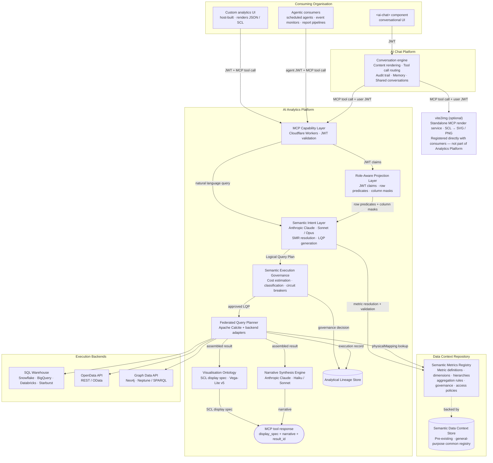
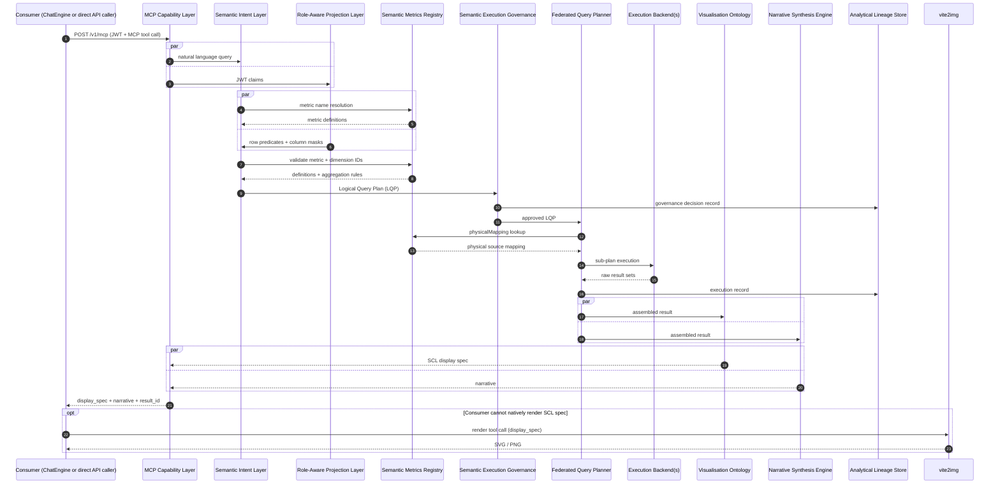
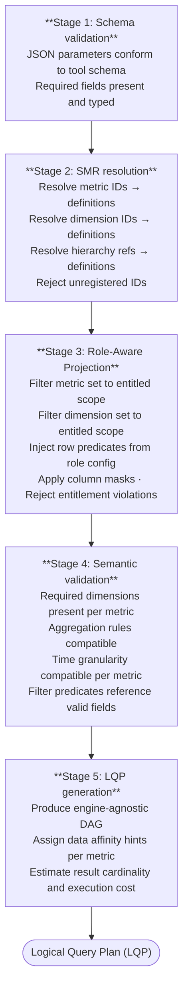
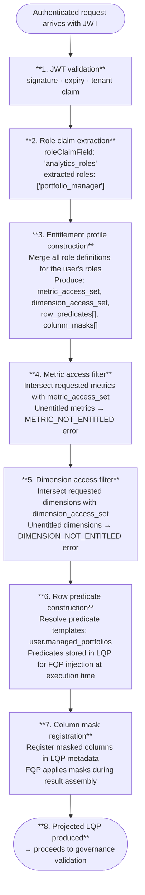
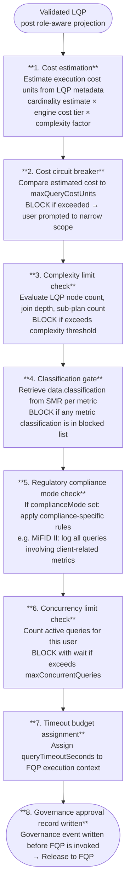
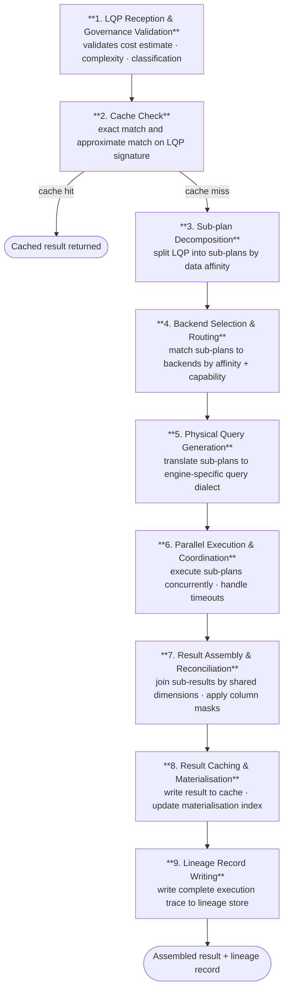

# 3. Core Platform Capabilities

This chapter provides complete specifications for the nine platform components that comprise the governed analytical pipeline. Each component has a defined scope, operates within strict boundaries, and produces a verifiable record of its actions. The pipeline runs in sequence — from intent parsing through physical execution to output formatting and lineage storage — and every step is mandatory for every query, with no bypass paths available to any consumer.

---

## Platform Architecture

The platform exposes its capability through three consumption modes. The first is direct API access, where a host-built custom analytics UI calls the MCP Capability Layer directly with a structured tool invocation, supplying a JWT for entitlement resolution and receiving a structured response containing a display specification and narrative. The second is conversational backend access, where the AI Chat Platform's conversation engine calls the Analytics Platform as a tool provider, mediating between a conversational UI component and the governed query pipeline. The third is agentic access, where scheduled agents, event monitors, and automated report pipelines call the MCP Capability Layer with machine-issued JWTs to perform periodic or event-driven analytical tasks without human-in-the-loop interaction. These three modes share a single entry point and a single governance pipeline; the consumption mode affects only the caller's interaction pattern, not the trust model applied.



The architecture enforces a strict separation between the governance pipeline and the execution backends. No consumer — whether conversational, direct API, or agentic — has a path to execution backends, physical schemas, or raw SQL. Every request, without exception, enters through the MCP Capability Layer and traverses the full governance pipeline: Semantic Intent Layer, Role-Aware Projection Layer, Semantic Execution Governance, and Federated Query Planner, in that order. There is no mechanism to bypass or short-circuit this pipeline. The governance guarantees described throughout this specification are structural properties of the architecture, not policy configurations that could be disabled at runtime.

The `vite2img` service is shown separately from the Analytics Platform boundary because it is an optional, independently registered MCP render service. Consumers that cannot natively render the SCL display specification — for example, an agentic pipeline that requires static image output — register `vite2img` directly and call it as a separate tool invocation using the `result_id` returned by the Analytics Platform. It is not part of the core analytics pipeline.

---

## Request Flow

The following sequence diagram traces a single analytical query from initial consumer invocation through to the structured response, illustrating the precise ordering and parallelism of component interactions. Steps 2–3 are intentionally parallel: JWT claim extraction and natural language processing proceed simultaneously. Steps 4–5 are also parallel: SMR metric name resolution and Role-Aware Projection constraint computation proceed concurrently, so that governance constraints derived from the JWT are available to the Semantic Intent Layer before it submits the Logical Query Plan. This means entitlement enforcement is computed in parallel with intent resolution rather than applied as a sequential post-processing step.



The sequence diagram makes several governance properties explicit that are not visible from the architecture diagram alone. First, the Analytical Lineage Store receives two distinct writes per query: a governance decision record before execution and an execution record after the Federated Query Planner has received results from the backends. This two-phase lineage recording ensures that the audit trail captures both the governance outcome and the precise execution details, irrespective of whether the query ultimately succeeds. Second, display specification and narrative synthesis are produced in parallel from the same assembled result set; neither depends on the other, and both are assembled into the single MCP tool response. Third, the `vite2img` render path is explicitly optional and occurs entirely outside the Analytics Platform boundary — the `result_id` in the MCP response is what enables the consumer to request rendering without re-executing the query.

The combined effect of this architecture is a platform in which analytical access is comprehensively mediated, every result is traceable to its governance decisions and physical sources, and the separation between the semantic layer and the execution layer is maintained by design rather than by convention.

---

## 3.1 Semantic Metrics Registry

The Semantic Metrics Registry (SMR) is the governing catalogue of every analytical concept resolvable on the platform. Before any query can be planned or executed, every identifier in that query — metrics, dimensions, hierarchies — must be registered in the SMR. This is an architectural constraint, not a policy: the Semantic Intent Layer rejects any identifier not present in the SMR for the active tenant, and nothing is queryable that is not registered.

### Concept Types

The SMR is composed of five interconnected concept types:

| Concept type | Description |
|---|---|
| **Metric** | A quantitative measure with a governed formula, aggregation rule, and unit |
| **Dimension** | A categorical or temporal attribute by which metrics can be sliced and filtered |
| **Hierarchy** | An ordered set of dimensions forming a navigable analytical hierarchy (for drilldown) |
| **Measure Group** | A named collection of related metrics grouped for analytical coherence |
| **Domain** | A logical grouping of metrics, dimensions, and hierarchies sharing a common business subject area |

### Metric Definition Schema

Every metric in the SMR conforms to the following schema. This is the authoritative reference for metric registration and validation:

```json
{
  "id":          "portfolio_return",
  "version":     "2.1.0",
  "label":       "Portfolio Return",
  "description": "Total return of a portfolio over the specified period, net of fees, expressed as a percentage.",
  "formula":     "(end_market_value - start_market_value + cash_flows) / start_market_value",
  "unit":        "percentage",
  "aggregation": {
    "default":     "value_weighted_average",
    "allowed":     ["value_weighted_average", "equal_weighted_average", "sum"],
    "granularity": ["daily", "monthly", "quarterly", "annual", "since_inception"]
  },
  "dimensions": {
    "required": ["portfolio", "date"],
    "optional": ["asset_class", "currency", "benchmark"]
  },
  "data": {
    "domain":          "portfolio",
    "sub_domain":      "performance",
    "source_tables":   ["fact_portfolio_daily", "dim_portfolio"],
    "refresh_cadence": "daily",
    "latency_sla":     "T+1"
  },
  "governance": {
    "owner":          "head_of_performance_analytics",
    "steward":        "performance_analytics_team",
    "classification": "INTERNAL",
    "approved":       true,
    "approved_by":    "cdo_office",
    "approved_at":    "2025-11-15T09:00:00Z",
    "effective_from": "2025-11-15",
    "deprecated":     false
  },
  "lineage": {
    "upstream_metrics":   [],
    "upstream_sources":   ["positions_service", "pricing_service", "cash_flow_service"],
    "downstream_metrics": ["active_return", "information_ratio"]
  },
  "access": {
    "roles":  ["portfolio_manager", "risk_officer", "application_admin"],
    "public": false
  },
  "display": {
    "format":               "percentage",
    "decimals":             2,
    "sign_convention":      "positive_is_gain",
    "benchmark_comparison": true
  }
}
```

### Metric Schema Field Reference

| Field | Required | Description |
|---|---|---|
| `id` | Yes | Unique metric identifier within the tenant. Lowercase, underscores. Used in MCP tool call parameters. |
| `version` | Yes | Semantic version. Increment on formula changes (major), aggregation changes (minor), documentation changes (patch). |
| `label` | Yes | Human-readable metric name. Used in UI, narrative synthesis, and chart axis labels. |
| `description` | Yes | Full prose definition. Must be unambiguous — this definition is injected into the AI model context. |
| `formula` | Yes | Business-logic formula expressed in the platform's formula language. Does not reference physical table columns directly — references other SMR metrics or canonical data source identifiers. |
| `unit` | Yes | Value unit. Accepted: `percentage`, `currency`, `basis_points`, `ratio`, `count`, `years`, `days`, `custom`. |
| `aggregation.default` | Yes | Default aggregation rule when the metric is rolled up across a dimension. |
| `aggregation.allowed` | Yes | All permitted aggregation rules for this metric. Requests using non-allowed rules are rejected at intent validation. |
| `aggregation.granularity` | Yes | Time granularities at which this metric is calculable. Requests at unsupported granularities are rejected. |
| `dimensions.required` | Yes | Dimensions that must be present in any query using this metric. Missing required dimensions cause a validation error. |
| `dimensions.optional` | No | Dimensions that may optionally be applied. |
| `data.domain` | Yes | The logical data domain this metric belongs to. Must match a domain registered in the SMR. |
| `data.refresh_cadence` | Yes | How frequently the underlying data is updated. Displayed in the lineage inspector and narrative synthesis. |
| `governance.owner` | Yes | Identifier of the metric owner. Must be a registered owner in the platform. |
| `governance.classification` | Yes | Data classification level. Used by the governance classification gate. |
| `governance.approved` | Yes | Whether this metric has been approved and is resolvable. Unapproved metrics are not returned by SMR queries. |
| `lineage.upstream_metrics` | No | Other SMR metrics this metric is derived from. Used for lineage graph construction. |
| `lineage.downstream_metrics` | No | SMR metrics that depend on this metric. Used for impact analysis when metric definitions change. |
| `access.roles` | Yes | Role IDs from the entitlement config that may query this metric. |

### Registry Governance Workflow

Metrics progress through a defined lifecycle from initial authorship to eventual retirement:

```
Draft → Proposed → In Review → Approved (Active) → Deprecated → Retired
```

| Transition | Trigger | Effect |
|---|---|---|
| Draft → Proposed | Metric owner submits a new definition | Visible in admin UI; not resolvable |
| Proposed → In Review | Application Admin opens for review | Downstream impact analysis runs automatically |
| In Review → Approved | Application Admin approves | Metric becomes resolvable from next refresh cycle |
| Approved → Deprecated | Owner or Admin marks deprecated | Metric resolves with a deprecation warning; removed from SMR browsing defaults |
| Deprecated → Retired | Admin retires after deprecation period | Metric no longer resolvable; lineage records preserved |

When a metric definition is proposed for change, the platform automatically runs an impact analysis covering downstream metrics, saved analytical sessions, and dashboards deriving results from the affected metric. Approval of a change with downstream impacts requires the Application Admin to acknowledge the impact report; that acknowledgement is recorded in the lineage store.

### Formula Language

The SMR formula language expresses metric computation logic in terms of other SMR metrics or canonical data source identifiers — never physical column names. This decouples metric definitions from backend schema changes.

```
# Simple ratio metric
active_return = portfolio_return - benchmark_return

# Information Ratio
information_ratio = active_return / tracking_error

# Weighted average with null protection
weighted_avg_duration = SAFE_DIVIDE(
  SUM(position_market_value * security_modified_duration),
  SUM(position_market_value)
)

# Conditional metric
issuer_concentration = SAFE_DIVIDE(
  SUM(position_market_value, FILTER(issuer = {{dim.issuer}})),
  SUM(position_market_value)
)

# Time-windowed metric
rolling_90d_return = CUMULATIVE_RETURN(daily_return, WINDOW(90, 'days'))
```

### SMR API

```
GET  /v1/smr/metrics              — list all approved metrics
GET  /v1/smr/metrics/{id}         — get metric definition by ID
GET  /v1/smr/metrics/{id}/lineage — get full lineage graph for metric
GET  /v1/smr/dimensions           — list all approved dimensions
GET  /v1/smr/hierarchies          — list all approved hierarchies
GET  /v1/smr/measure-groups       — list all measure groups
POST /v1/smr/metrics              — propose a new metric definition
PUT  /v1/smr/metrics/{id}         — propose a change to an existing metric
POST /v1/smr/metrics/{id}/approve — approve a proposed metric (Application Admin only)
```

---

## 3.2 Semantic Intent Layer

The Semantic Intent Layer receives a structured MCP tool call and produces a validated, engine-agnostic Logical Query Plan (LQP). Its purpose is to ensure that before any query reaches a physical execution backend, every identifier has been resolved against the SMR, every entitlement has been applied, and every semantic constraint has been satisfied. The output of this layer — the LQP — contains no backend references, no SQL, and no physical schema identifiers: only analytical operations expressed against SMR-registered concepts.

### Five-Stage Validation Pipeline

Every MCP tool call passes through five sequential validation stages:



### Intent Parameter Schema

The core parameters shared across all analytical capabilities are:

| Parameter | Type | Description |
|---|---|---|
| `metrics` | `string[]` | Metric IDs from the SMR. Each resolves to its definition, aggregation rule, required dimensions, and data affinity. |
| `dimensions` | `string[]` | Dimension IDs to slice by. Must be permitted for the requested metrics and within the user's entitlement scope. |
| `time_period` | string | Semantic time expression: `quarter_to_date`, `year_to_date`, `since_inception`, `today`, `last_N_months`, `fiscal_year_YYYY`, `RANGE:YYYY-MM-DD:YYYY-MM-DD`. |
| `filters` | object[] | Dimension or metric predicates: `{ dimension, operator, value }`. Operators: `eq neq gt lt gte lte in not_in`. |
| `order_by` | string | `metric_id ASC\|DESC` |
| `limit` | integer | Maximum result rows. Default: 1000. |
| `compare_to` | object | Optional comparison target: benchmark, peer group, or prior period. |

### MCP Input to Resolved Intent: Example

The following illustrates how raw MCP tool call parameters are transformed through SMR resolution and role projection into the enriched input that enters the LQP generator:

```json
// MCP tool call input (what the AI produces)
{
  "metrics":     ["portfolio_return", "tracking_error"],
  "dimensions":  ["portfolio", "asset_class"],
  "time_period": "quarter_to_date",
  "filters": [
    { "dimension": "asset_class", "operator": "eq", "value": "EQUITY" }
  ],
  "order_by": "tracking_error DESC"
}
```

```json
// After SMR resolution and role projection — input to LQP generator
{
  "resolved_metrics": [
    {
      "id":            "portfolio_return",
      "version":       "2.1.0",
      "aggregation":   "value_weighted_average",
      "data_affinity": "portfolio",
      "required_dims": ["portfolio"]
    },
    {
      "id":            "tracking_error",
      "version":       "1.3.0",
      "aggregation":   "value_weighted_average",
      "data_affinity": "risk_metrics",
      "required_dims": ["portfolio"]
    }
  ],
  "dimensions": [
    { "id": "portfolio",   "entitled": true },
    { "id": "asset_class", "entitled": true }
  ],
  "row_predicates": [
    "portfolio_id IN ('GLOB_EQ_OPP', 'UK_CORE_INC', 'STRAT_BAL')"
  ],
  "filters": [
    { "dimension": "asset_class", "operator": "eq", "value": "EQUITY" }
  ],
  "time": { "type": "period", "period": "quarter_to_date", "as_of_date": "2026-05-14" },
  "order_by": { "field": "tracking_error", "direction": "DESC" }
}
```

The resolved form carries metric versions, aggregation rules, and entitlement-derived row predicates. These are embedded in the LQP, which is then stored verbatim in the lineage record, linking the original tool call to the physical execution result.

---

## 3.3 Role-Aware Projection Layer

The Role-Aware Projection Layer applies the authenticated user's entitlement model to the resolved analytical intent before any query plan is compiled. It is the semantic-layer enforcement of data access controls — operating above physical execution, before any query reaches a backend. Projection is not optional and not bypassable: every request, whether from a human user or an AI orchestrator, passes through it.

### Restriction Types

The projection layer applies four categories of restriction:

| Restriction type | Description | Applied at |
|---|---|---|
| **Metric access filter** | Removes metrics from the resolved intent that the user's role is not entitled to query | Intent validation — Stage 3 |
| **Dimension access filter** | Removes dimensions the user is not entitled to slice by | Intent validation — Stage 3 |
| **Row predicate injection** | Injects SQL-like predicates that restrict which data rows the user can access | FQP physical query generation |
| **Column mask application** | Replaces or nullifies column values the user is not permitted to see in the assembled result | FQP result assembly |

### Projection Lifecycle



### Multi-Role Merging

Users may hold multiple roles simultaneously. The projection layer merges role entitlements using union semantics for metric and dimension access — a user entitled to a metric via any role may query it. Row predicates and column masks use the inverse strategy: all predicates must be satisfied (most restrictive wins), and a column masked by any role is masked for the user.

| Entitlement type | Merge strategy | Rationale |
|---|---|---|
| Metric access | Union | A user entitled to a metric via any role may query it |
| Dimension access | Union | A user entitled to a dimension via any role may use it |
| Row predicates | Intersection (AND) | All predicates must be satisfied — most restrictive wins |
| Column masks | Union | A column masked by any role is masked for the user |

### Row Predicate Template Resolution

Row predicate templates reference JWT claim values using `{{user.claim_name}}` syntax, resolved at query time from the authenticated user's current JWT:

**Predicate template (in entitlement config):**
```
portfolio_id IN ({{user.managed_portfolios}})
```

**JWT claim:**
```json
{ "managed_portfolios": ["GLOB_EQ_OPP", "UK_CORE_INC", "STRAT_BAL"] }
```

**Resolved predicate (injected into FQP physical queries):**
```sql
portfolio_id IN ('GLOB_EQ_OPP', 'UK_CORE_INC', 'STRAT_BAL')
```

### Column Masking

Column masks are applied during FQP result assembly, after sub-results return from execution backends but before the result leaves the platform. Three masking modes are supported:

| Mode | Masked column representation |
|---|---|
| `null_replacement` | Column value replaced with `null` |
| `redacted_label` | Column value replaced with the string `"[REDACTED]"` |
| `excluded` | Column omitted entirely from the result schema |

**Before masking (compliance analyst role with `column_masks: ["client_name", "account_number"]`):**
```json
[{ "portfolio_id": "GLOB_EQ_OPP", "client_name": "Blackwood Family Trust", "account_number": "WM-00412", "lcr": 1.24 }]
```

**After masking (`redacted_label` mode):**
```json
[{ "portfolio_id": "GLOB_EQ_OPP", "client_name": "[REDACTED]", "account_number": "[REDACTED]", "lcr": 1.24 }]
```

### Entitlement Audit

Every projection decision — including blocked metrics, applied row predicates, and active column masks — is recorded in the lineage store as part of the execution record. The projection record captures the roles active at query time, which metrics were requested, which were projected through, which were blocked and why, and which predicates were injected. This record provides the evidentiary chain required for regulatory entitlement audits.

---

## 3.4 Semantic Execution Governance

The Semantic Execution Governance (SEG) layer applies a suite of circuit breakers, cost controls, complexity limits, and compliance classification checks to every query before it is released to the Federated Query Planner. It is the final gate before physical execution. Governance applies to every query without exception — there is no privileged user, trusted agent, or internal path that bypasses SEG checks.

### Governance Pipeline



### Cost Estimation Model

Cost units are estimated from LQP metadata before any backend is contacted:

| Factor | Contribution |
|---|---|
| Number of metrics | `metric_count × 50` base units |
| Engine cost tier per sub-plan | `minimal: 10`, `low: 50`, `standard: 100`, `high: 300`, `unrestricted: 0` |
| Dimension cardinality | `low: ×1.0`, `medium: ×1.5`, `high: ×3.0`, `unbounded: ×5.0` |
| Time period scope | `single_day: ×1.0`, `quarter: ×2.0`, `year: ×4.0`, `since_inception: ×8.0` |
| Number of sub-plans (federation) | `+100 per additional sub-plan` |
| Materialised view match | `−800` (pre-computed result) |
| Cache hit (estimated) | `−900` (full cache hit expected) |

**Worked example — `portfolio_return, tracking_error BY portfolio, asset_class FOR YEAR_TO_DATE`:**

```
portfolio_return:        50 (metric base)
tracking_error:          50 (metric base)
SQL warehouse backend:  100 (standard cost tier)
semantic layer backend:  50 (low cost tier)
asset_class:            1.5× cardinality multiplier (medium)
YEAR_TO_DATE:           4.0× period multiplier
2 sub-plans:            100 (federation overhead)
—————————————————————————————
Base: (50+50) × 1.5 × 4.0 = 600
Engines: 100+50 = 150
Federation: 100
Total estimate: 850 cost units
```

Against a `maxQueryCostUnits: 1000` limit, this query is approved. Against a `500` limit, it is blocked and the user receives structured suggestions to narrow scope (reduce time period, reduce metric count, or add a filter).

### Compliance Modes

Named compliance profiles pre-configure governance behaviour for specific regulatory environments:

**MiFID II mode** (`"complianceMode": "mifid2"`)

| Additional rule | Implementation |
|---|---|
| All queries involving client-identifiable data must be logged with business justification | Prompt user for business justification before queries on `client_name`, `account_number`, or similar PII-adjacent dimensions |
| Best execution metrics must be queried with explicit timeframe | Validation error if `date` dimension not specified for best-execution metrics |
| Transaction reporting queries must generate a TRACE record | Additional lineage record written to `analytics.mifid2_trace` table |

**Basel III/IV mode** (`"complianceMode": "basel3"`)

| Additional rule | Implementation |
|---|---|
| Capital ratio queries must include entity identifier | Required dimension: `entity` for all regulatory capital metrics |
| LCR/NSFR queries generate a daily snapshot record | Regulatory metric queries trigger a snapshot write to `analytics.regulatory_snapshots` |
| Queries on stress scenario data classified as RESTRICTED | Stress scenario metrics automatically classified at RESTRICTED level regardless of user role |

**SEC Regulation BI mode** (`"complianceMode": "sec_reg_bi"`)

| Additional rule | Implementation |
|---|---|
| Narrative synthesis prohibited from generating investment recommendations | Additional narrative synthesis constraint injected into prompt |
| Client analytics require suitability record reference | Advisory queries require `suitability_record_id` parameter before execution |

### Timeout and Partial Result Handling

| Scenario | Behaviour |
|---|---|
| All sub-plans complete within timeout | Normal result assembly and return |
| One sub-plan times out, others complete | Partial result assembly — missing metrics represented as null with `timeout` provenance marker; user notified |
| All sub-plans time out | Query failed — error returned to user; governance event written with `timeout` status |
| Engine cancellation on timeout | FQP sends cancellation signal to timed-out engine (if engine supports cancellation) |

---

## 3.5 Federated Query Planner

The Federated Query Planner (FQP) is the only component in the platform that has knowledge of physical execution backends. No other component — not the Semantic Intent Layer, not the AI model, not the MCP Capability Layer — has access to backend connection details or physical schema information. The FQP receives a validated, governance-approved LQP, decomposes it into backend-specific sub-plans, routes those sub-plans to registered execution backends in parallel, assembles the results, and writes a complete execution record to the lineage store.

### Nine-Step FQP Pipeline



### Sub-Plan Decomposition

The FQP decomposes an LQP into sub-plans by data affinity — the logical data domain declared by each metric in its SMR definition. Metrics with the same affinity are grouped into a single sub-plan; metrics with different affinities produce separate sub-plans that execute in parallel. Shared dimensions across sub-plans become the join keys for result assembly.

For a query requesting `portfolio_return` (affinity: `portfolio`) and `var_95` (affinity: `risk_metrics`), the FQP produces two sub-plans routed to different engines, executes them concurrently, and joins the results in memory on `portfolio_id` and `date`.

### Backend Adapter Table

| Backend type | Protocol | Typical use |
|---|---|---|
| SQL warehouse | JDBC/ODBC, SQL dialect | Primary performance and position data |
| Semantic layer | REST/JSON query API | Pre-modelled metrics via dbt Semantic Layer or equivalent |
| OpenData API | OData v4 REST | Reference data and third-party feeds |
| Graph Data API | GraphQL or REST | Relationship and counterparty data |
| OLAP engine | REST/JSON cube query | Pre-aggregated dimensional data |
| Custom adapter | Platform adapter SDK | Proprietary or specialised data sources |

When multiple engines are registered for the same data affinity, the FQP selects the highest-priority available engine. If the highest-priority engine is unavailable or its p95 latency exceeds twice its baseline over a rolling one-hour window, the FQP automatically routes to the next registered engine for that affinity.

### Caching

The FQP maintains a result cache keyed by the LQP signature — a deterministic SHA-256 hash of the metric IDs and versions, dimension IDs, filter predicates, time expression, entitlement hash, and tenant ID.

| Cache property | Specification |
|---|---|
| Cache key | SHA-256 of (metric IDs + versions, dimension IDs, filter predicates, time expression, entitlement hash, tenant ID) |
| Cache TTL | Configurable per `data.refresh_cadence` in the metric definition. Default: 3600 seconds. |
| Cache invalidation | On metric definition version change; on execution backend data refresh signal; on explicit cache clear via Admin API |
| Cache scope | Per-tenant. Results from one tenant are never served to another. |
| Cache storage | Platform-managed result cache. Results over 10 MB bypass the cache and are streamed directly. |
| Cache hit disclosure | Cache hits are disclosed in the lineage record and optionally surfaced to the user as a "Result from cache (data as of [timestamp])" indicator. |

### Adaptive Planning

The FQP adapts routing decisions based on observed execution performance. It tracks p50/p95 latency per engine per data affinity over a rolling one-hour window, automatically falls back to the next available engine if performance degrades, and calibrates cost unit estimates based on observed execution data from completed queries. If a sub-plan engine returns a partial result due to timeout, the FQP logs this in the lineage record and surfaces a warning to the user alongside the partial result.

---

## 3.6 Visualisation Ontology

The Visualisation Ontology is the governing schema that maps result characteristics and analytical intent patterns to specific, parameterised chart contracts. It exists to make chart selection deterministic: the same analytical pattern produces the same chart type across all users, sessions, and AI model versions, regardless of how the question was phrased. The AI model does not select chart types. Intent signals from the query are treated as inputs to the ontology evaluation algorithm, but the ontology makes the final binding decision.

### Intent Pattern Taxonomy

Every analytical result is classified into one of seven intent patterns:

| Intent pattern | Description | Typical trigger phrases |
|---|---|---|
| `COMPARISON` | Comparing a metric across discrete categories | "compare", "by", "across", "ranked by", "top N" |
| `TREND` | Showing how a metric changes over time | "over time", "trend", "history", "30-day", "since" |
| `DISTRIBUTION` | Showing the spread or concentration of a metric | "distribution", "breakdown", "composition", "concentration" |
| `THRESHOLD` | Comparing a metric against a limit or benchmark | "exceeding", "within limit", "versus benchmark", "breach" |
| `ATTRIBUTION` | Decomposing a metric into contributing factors | "attribution", "contribution", "drivers", "breakdown by" |
| `RELATIONSHIP` | Showing correlation or dependency between metrics | "versus", "correlation", "scatter", "risk-return" |
| `COMPOSITION` | Showing part-to-whole relationships | "proportion", "weight", "allocation", "share" |

### Chart Contract Table

| Contract name | Intent patterns matched | Chart type | Key axis assignments | Interaction semantics |
|---|---|---|---|---|
| `BAR_MULTI_SERIES_COMPARISON` | `COMPARISON` | Bar | X: primary categorical dimension (sorted by primary metric DESC); Y: metric value; Colour: metric series or secondary dimension | Click: drilldown; Hover: tooltip; Selection: multi-point |
| `LINE_TIME_SERIES_TREND` | `TREND` | Line | X: temporal dimension; Y: metric value; Colour: metric series; Reference line: injected if `compare_to` present | Hover: crosshair tooltip; Click data point: surface lineage; Brush: zoom X-axis |
| `HEATMAP_THRESHOLD_MATRIX` | `THRESHOLD` | Heatmap | X: first categorical dimension; Y: second categorical dimension; Colour: metric as % of threshold (diverging scale, midpoint at 100% of limit) | Click cell: drilldown into dimension intersection |
| `TREEMAP_COMPOSITION` | `COMPOSITION`, `DISTRIBUTION` | Treemap | Area: proportional to metric value; Colour: secondary metric (diverging scale); Label: dimension value + metric value | Click tile: drilldown to next hierarchy level; Hover: tooltip with all metrics |
| `WATERFALL_ATTRIBUTION` | `ATTRIBUTION` | Waterfall | X: contribution dimension; Y: contribution value (positive/negative); Colour: positive (green), negative (red), total (grey) | Hover: contribution value and percentage |
| `SCATTER_RISK_RETURN` | `RELATIONSHIP` | Scatter | X: first metric (conventionally risk); Y: second metric (conventionally return); Colour: categorical dimension; Size: optional third metric | Hover: all metric values; Reference lines: quadrant boundaries from benchmark values if present |
| `TABLE_GOVERNED` | Fallback (any) | Table | All result columns; column labels from SMR; inline sparklines for temporal metrics | Column sorting; column filtering; export to CSV and JSON |

### Priority-Ordered Evaluation Algorithm

The ontology evaluator receives the LQP, intent pattern classification, and result schema. It evaluates contracts in order of specificity and returns the highest-scoring match:

```python
def evaluate_ontology(lqp, intent_pattern, result_schema, allowed_charts):
    candidates = []
    for contract in ONTOLOGY_CONTRACTS:
        if not all(c in allowed_charts for c in [contract.chart_type]):
            continue
        score = contract.match_score(lqp, intent_pattern, result_schema)
        if score > 0:
            candidates.append((score, contract))
    candidates.sort(key=lambda x: x[0], reverse=True)
    if candidates:
        return candidates[0][1]
    else:
        return TABLE_GOVERNED  # deterministic fallback
```

The `TABLE_GOVERNED` contract is the unconditional fallback. It is always eligible and always matches — ensuring that every query, regardless of result shape, receives a valid `display_spec`.

### Override Mechanism

Power Analysts may override the ontology's chart selection for a single result by expressing an explicit chart type preference in their query. Overrides are subject to the requested chart type being in the tenant's `allowedChartTypes` list and the result schema being compatible with the requested chart type. Incompatible overrides are rejected with an explanation. All overrides are logged in the lineage record as analyst-requested deviations from the governing ontology.

---

## 3.7 Analytical Output Format

The platform is headless: it produces no rendered output. Every successful analytical request returns a structured MCP tool response containing three output elements that together provide a complete, self-describing analytical result.

### Three Output Elements

| Element | Field | Always present | Description |
|---|---|---|---|
| Display specification | `display_spec` | Yes | A Semantic Charting Language (SCL) JSON object — either a chart or table specification. Consumers render from this. |
| Narrative | `narrative` | When enabled | Governed prose produced by the Narrative Synthesis Engine, anchored to result values |
| Lineage reference | `result_id` + `lineage_url` | Yes | A unique result identifier and the URL of the full lineage record |

### Full MCP Response Structure

```json
{
  "result_id":   "res_20260514_093247_a1b2c3",
  "lineage_url": "https://api.analytics-platform.io/v1/lineage/res_20260514_093247_a1b2c3",
  "display_spec": {
    "type": "chart",
    "mark": "bar",
    ...
  },
  "narrative": {
    "lead":   "...",
    "detail": "...",
    "asOf":   "14 May 2026",
    "anchoredTo": "res_20260514_093247_a1b2c3"
  },
  "meta": {
    "latencyMs":    1285,
    "cacheHit":     false,
    "rowCount":     14,
    "backendsUsed": ["primary-warehouse", "semantic-layer"],
    "costUnits":    500
  }
}
```

### Semantic Charting Language (SCL)

SCL is the JSON specification language used for the `display_spec` field. Two types share a consistent discriminated envelope.

**Chart specification** (`type: "chart"`) — produced when a chart contract matches:

```json
{
  "type":   "chart",
  "mark":   "bar",
  "data":   { "values": [ { "portfolio": "Global Equity", "tracking_error": 0.042 }, ... ] },
  "encoding": {
    "x": { "field": "portfolio",      "type": "nominal",      "title": "Portfolio"      },
    "y": { "field": "tracking_error", "type": "quantitative", "title": "Tracking Error" }
  },
  "colorScheme": ["#003f5c", "#58508d", "#bc5090"],
  "formatHints": {
    "tracking_error": { "format": ".2%", "unit": "%" }
  }
}
```

**Table specification** (`type: "table"`) — produced when no chart contract matches:

```json
{
  "type": "table",
  "columns": [
    { "field": "portfolio",      "label": "Portfolio",      "type": "string"                   },
    { "field": "tracking_error", "label": "Tracking Error", "type": "number", "format": ".2%" },
    { "field": "limit",          "label": "Limit",          "type": "number", "format": ".2%" },
    { "field": "breached",       "label": "Breached",       "type": "boolean"                  }
  ],
  "data": [ ... ],
  "thresholds": [
    { "field": "tracking_error", "operator": "gt", "reference": "limit", "severity": "warning" }
  ]
}
```

Column labels in table specifications come from SMR metric and dimension `display.label` values — never from physical field names.

### Narrative Structure

When narrative synthesis is enabled, the `narrative` field carries a structured prose object with a `lead` sentence (the key finding) and a `detail` section (supporting elaboration). Narrative values are anchored strictly to the governed result set — the synthesis engine is constrained to values present in the result and unit-correct formatting from the SMR `display.format`. The `anchoredTo` field carries the `result_id` of the execution result the narrative was derived from.

```json
{
  "narrative": {
    "lead":     "Three of 14 equity portfolios are above their tracking error limit this quarter.",
    "detail":   "Global Equity (4.2% vs 3.5% limit), EM Growth (5.1% vs 4.0% limit), and Asia Pacific (3.8% vs 3.5% limit) are the breaching portfolios. The remaining 11 portfolios are within mandate.",
    "asOf":     "14 May 2026, Q2 2026 QTD",
    "anchoredTo": "res_20260514_093247_a1b2c3"
  }
}
```

### Streaming Behaviour

| Output element | Streaming behaviour |
|---|---|
| `narrative` | Streams token-by-token; consumers may render incrementally |
| `display_spec` | Delivered as a complete JSON object after FQP result assembly — not streamed |
| `result_id` + `lineage_url` | Delivered with `display_spec` — not streamed |
| `meta` | Delivered as a complete object — not streamed |
| Governance-blocked errors | Returned immediately before any backend execution |

### Error Response Structure

All error responses include a `result_id` and `lineage_url`, ensuring that blocked and failed requests appear in the audit trail alongside successful ones.

| Error condition | `error.code` | Behaviour |
|---|---|---|
| Cost circuit breaker triggered | `GOVERNANCE_COST_EXCEEDED` | Blocked before FQP; structured suggestions returned |
| Classification gate blocked | `GOVERNANCE_CLASSIFICATION_BLOCKED` | Blocked before FQP; metric classification disclosed |
| Metric not in SMR | `METRIC_NOT_FOUND` | Blocked at intent validation; metric ID disclosed |
| Entitlement denied | `ENTITLEMENT_DENIED` | Blocked at role projection; partial results returned for entitled metrics |
| Backend timeout | `EXECUTION_TIMEOUT` | Partial or null result with provenance markers |
| No matching chart contract | `NO_CHART_CONTRACT` | Not an error — `TABLE_GOVERNED` fallback applied automatically |

---

## 3.8 Analytical Lineage Store

The Analytical Lineage Store provides computation provenance: a complete, queryable record of how every result was calculated. Analytical lineage, as defined on this platform, is distinct from data lineage. Data lineage tracks how data moves between systems. Analytical lineage records how the analytics engine used specific metric definitions, entitlement rules, and execution backends to compute a specific result. The lineage record is not a log — it is a first-class data structure. A regulator, auditor, or internal reviewer must be able to reconstruct exactly how a specific number was calculated, by whom, under what entitlements, from which backends, and with what result — without re-running the query.

### Per-Query Stored Elements

| Element | Table | Content |
|---|---|---|
| Query record | `analytics.queries` | User ID, tenant ID, raw natural language, tool call parameters, intent pattern, timestamp, governance status, execution status, cost units consumed |
| Lineage record | `analytics.lineage_records` | Complete chain: intent → SMR resolution → projection record → LQP → FQP execution record → result schema → visualisation contract → narrative synthesis status |
| SMR snapshot | `analytics.lineage_records.metric_versions` | For each metric in the query: metric ID, SMR definition version, formula at query time |
| Projection record | `analytics.lineage_records.projection_record` | Roles, requested metrics, projected metrics, blocked metrics, row predicates, column masks |
| FQP execution record | `analytics.lineage_records.fqp_execution` | Sub-plan details, engine IDs, latencies, cost units, cache hit status |
| Governance decision | `analytics.governance_events` | Circuit breaker decisions, classification gates, cost limit checks — including blocked queries |
| Result artefact | Object storage + `analytics.result_artefacts` | CSV result set, chart SVG, narrative text — stored per query |

### Core DDL: `analytics.lineage_records`

```sql
CREATE TABLE analytics.lineage_records (
  id                  UUID PRIMARY KEY DEFAULT gen_random_uuid(),
  query_id            UUID NOT NULL REFERENCES analytics.queries(id),
  tenant_id           TEXT NOT NULL,
  created_at          TIMESTAMPTZ NOT NULL DEFAULT NOW(),
  -- Structured JSONB fields for each lineage chain element
  intent_resolution   JSONB NOT NULL,  -- natural language → intent mapping
  smr_resolution      JSONB NOT NULL,  -- metric/dimension definitions used
  projection_record   JSONB NOT NULL,  -- entitlement decisions
  lqp                 JSONB NOT NULL,  -- Logical Query Plan
  governance_checks   JSONB NOT NULL,  -- governance decisions
  fqp_execution       JSONB NOT NULL,  -- FQP sub-plans and engine calls
  visualisation       JSONB,           -- chart contract selected
  narrative_status    JSONB            -- narrative synthesis outcome
);
```

The JSONB structure allows efficient querying of individual lineage chain elements — for example, finding all queries that used a specific metric version, or all queries where a governance check was blocked — without requiring full record deserialisation.

### Multi-Tenant Isolation

Every record in the `analytics` schema carries a `tenant_id` column. Row-Level Security (RLS) in PostgreSQL enforces that users can only access records belonging to their own tenant. No cross-tenant data access is possible through the platform's API at any privilege level.

### Retention

| Rule | Specification |
|---|---|
| Query records | Configurable per tenant. Platform default: **2,555 days (7 years)** — covering most regulatory audit look-back periods. |
| Lineage records | Retained at least as long as the corresponding query record. Cannot be deleted independently. |
| SMR metric versions | Retained indefinitely — metric version history must be preserved for lineage reconstruction. |
| Governance events | Retained at least as long as query records. |
| Result artefacts (object storage) | Configurable per tenant. Default: 365 days. Lineage record references are preserved even after object storage expiry. |
| Blocked queries | Retained in full — queries that fail governance checks are as important to retain as successful ones. |

### Immutability

Lineage records are never modified after writing. There is no update or delete path available to any user — including Platform Admins. Corrections to erroneous records produce new records that reference the original via a `supersedes` relationship. This constraint is enforced at the database layer, not only by application logic.

### Regulatory Audit Export

```
GET /v1/audit/queries
    ?user_id={user_id}
    &from={ISO8601}
    &to={ISO8601}
    &metric_ids[]={metric_id}
    &include_lineage=true
    → Returns all queries matching the filter with full lineage records
```

Audit export packages include query records with timestamps and user identifiers, lineage records with metric definition versions, governance decisions, role-aware projection records showing entitlements in force at query time, and result artefacts within the retention period. All export packages are digitally signed by the platform using a tenant-specific key registered at onboarding.

---

## 3.9 MCP Capability Layer

The MCP Capability Layer exposes the platform's governed analytical operations to AI orchestrators via MCP Streamable HTTP transport. Each capability is a bounded, named operation with a typed input schema, a governed execution path through the full platform pipeline (Semantic Intent Layer → Role-Aware Projection → SEG → FQP), and a typed output contract. AI agents interact with capabilities, not databases. There is no privileged API path — AI agents receive the same governance-validated results as human users.

### Tool Catalogue

**`analyse_metric`** — Execute a governed query against one or more registered metrics.

| Parameter | Required | Type | Notes |
|---|---|---|---|
| `metrics` | Yes | string[] | SMR metric IDs |
| `dimensions` | No | string[] | Dimension IDs to slice by |
| `time_period` | Yes | string | `quarter_to_date`, `year_to_date`, `last_N_months`, `since_inception`, `today`, `RANGE:YYYY-MM-DD:YYYY-MM-DD` |
| `filters` | No | array | `{dimension, operator, value}` — operators: `eq neq gt lt gte lte in not_in` |
| `order_by` | No | string | `metric_id ASC\|DESC` |
| `limit` | No | integer | Default: 1000 |

**`risk_breakdown`** — Decompose a risk metric into factor contributions by dimension.

| Parameter | Required | Notes |
|---|---|---|
| `portfolio_id` | Yes | |
| `risk_metric` | Yes | e.g. `var_95`, `tracking_error` |
| `attribution_by` | Yes | `asset_class \| factor \| issuer \| geography \| currency` |
| `as_of_date` | Yes | ISO date |

**`compare_portfolios`** — Compare metrics across two or more portfolios, optionally against a benchmark.

| Parameter | Required | Notes |
|---|---|---|
| `portfolio_ids` | Yes | Array of portfolio IDs |
| `metrics` | Yes | SMR metric IDs |
| `time_period` | Yes | Same format as `analyse_metric` |
| `benchmark_id` | No | Optional benchmark comparison |

**`performance_attribution`** — BHB or Brinson-Fachler attribution decomposition.

| Parameter | Required | Notes |
|---|---|---|
| `portfolio_id` | Yes | |
| `benchmark_id` | Yes | |
| `attribution_by` | Yes | `asset_class \| geography \| sector \| currency` |
| `time_period` | Yes | |
| `model` | No | `bhb` (default) or `bf` |

**`regulatory_metric`** — Query a regulatory compliance metric (LCR, NSFR, leverage ratio). Requires `regulatory_reporting` feature flag and appropriate role.

| Parameter | Required | Notes |
|---|---|---|
| `metric_id` | Yes | |
| `entity_id` | Yes | |
| `reporting_date` | Yes | ISO date |
| `jurisdiction` | Yes | Regulatory jurisdiction identifier |

**`drilldown`** — Navigate into a dimension hierarchy from a prior result; parent-level filters are preserved.

| Parameter | Required | Notes |
|---|---|---|
| `result_id` | Yes | Result ID from a prior analytical capability call |
| `hierarchy` | Yes | Hierarchy ID to traverse |
| `selected_value` | No | Dimension value to anchor the drilldown |

**`list_metrics`** — List all SMR metrics available to the current user's role, with IDs, labels, descriptions, and required dimensions.

| Parameter | Required | Notes |
|---|---|---|
| `domain` | No | Filter by data domain |
| `category` | No | Filter by measure group |
| `search_term` | No | Free-text search against metric labels and descriptions |

**`get_metric_definition`** — Retrieve the full SMR definition for a specific metric, including formula, aggregation rules, and governance metadata.

| Parameter | Required | Notes |
|---|---|---|
| `metric_id` | Yes | SMR metric ID |

### Capability Governance

Every capability invocation passes through the full governance pipeline: input schema validation → capability availability check (feature flags and role entitlements) → Semantic Intent Layer → Role-Aware Projection → Semantic Execution Governance → FQP → result assembly → lineage record write. Capability availability is declared in the MCP manifest; a capability not enabled by a feature flag or accessible to the user's role appears as `available: false` with a reason.

### MCP Registration

The following registration JSON declares the Analytics Platform to an AI Chat Platform or orchestration framework:

```json
{
  "id":          "analytics-platform",
  "name":        "Analytics Platform",
  "description": "Governed analytical query engine for portfolio performance, risk, and regulatory metrics. All queries are validated against the Semantic Metrics Registry, subject to role-based entitlement projection, and governed by cost and compliance circuit breakers before execution.",
  "endpoint":    "https://api.analytics-platform.io/v1/mcp",
  "authType":    "bearer",
  "accessTier":  "always-on",
  "roles":       []
}
```

The `roles: []` value indicates that capability availability is determined dynamically from the bearer token's role claims at the time of each invocation, rather than being statically restricted at registration time.
