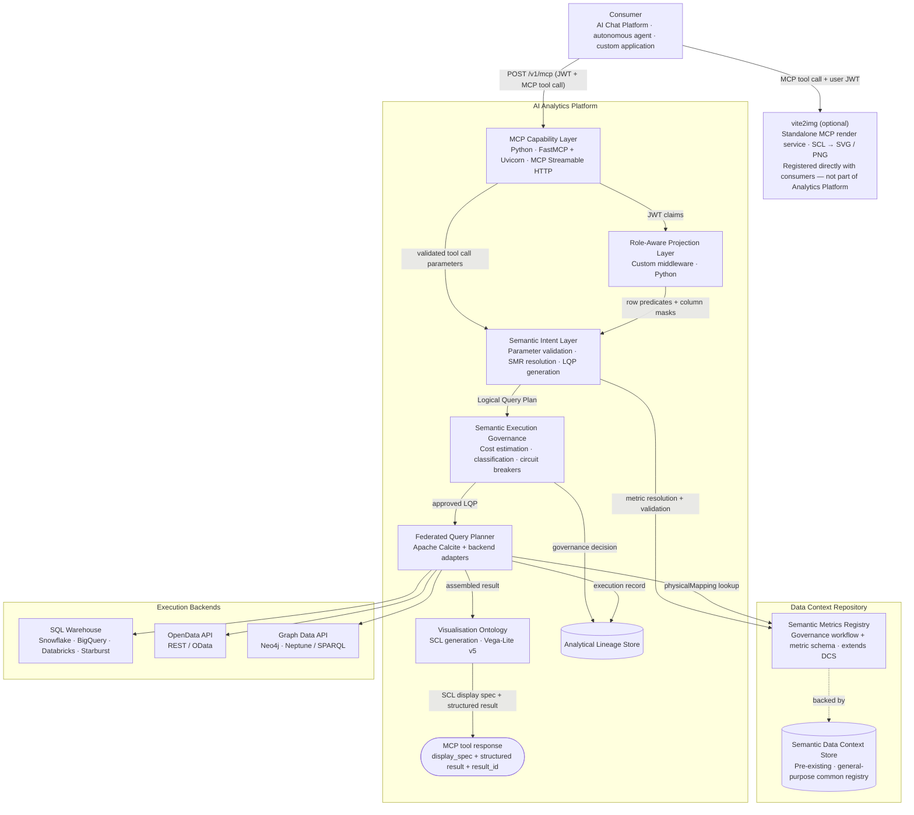

# 5. Proposed Technical Implementation

This chapter describes one reference implementation of the AI Analytics Platform. Stack choices are concrete but not prescriptive — the product specification is intentionally stack-agnostic. Any conformant implementation that satisfies the specified behaviours, governance guarantees, and interface contracts is valid. Technology substitutions at any layer require no changes to the product specification.

---

## 5.1 Architecture Overview



The Semantic Data Context Store (DCS) is a pre-existing platform component — the organisation's general-purpose registry for semantic definitions. The Analytics Platform registers metric definitions as a new `analytical_metric` type in the DCS, reusing its versioned storage, full-text search, cross-definition relationships, and tenant-scoped access control. The SMR governance layer adds the approval workflow, metric-specific schema validation, and the Admin API surface on top.

---

## 5.2 Layer-by-Layer Stack Decisions

### MCP Capability Layer

| Decision | Choice | Rationale |
|----------|--------|-----------|
| **Runtime** | Python · FastMCP + Uvicorn | Lightweight ASGI service; minimal dependencies; deploys as a Kubernetes pod or serverless container |
| **Protocol** | MCP Streamable HTTP | Standard MCP interoperability; supports request/response and streaming |
| **Auth** | JWT validation at request ingress | Stateless; validated before any platform computation begins |

FastMCP (`pip install fastmcp`) provides the `@mcp.tool()`, `@mcp.resource()`, and `@mcp.prompt()` decorators and handles MCP Streamable HTTP transport. Each analytical capability is a decorated Python function; the framework serialises schemas and routes calls automatically.

#### Tools

All eight tools follow the same pattern: JWT validation → Semantic Intent Layer → Role-Aware Projection → Semantic Execution Governance → FQP → response assembly.

```python
from fastmcp import FastMCP
from pydantic import BaseModel
from typing import Literal

mcp = FastMCP(
    name="Analytics Platform",
    instructions=(
        "Governed analytical query engine for portfolio performance, risk, and regulatory metrics. "
        "All queries are validated against the Semantic Metrics Registry, subject to role-based "
        "entitlement projection, and governed by cost and compliance circuit breakers before execution."
    ),
)

# ── Shared pipeline helper ────────────────────────────────────────────────────

async def run_pipeline(payload: BaseModel, jwt: str) -> dict:
    claims = validate_jwt(jwt)
    lqp    = await sil.resolve(payload, claims)
    lqp    = rapl.project(lqp, claims)
    lqp    = await seg.approve(lqp)
    result = await fqp.execute(lqp)
    return await assemble_response(result)

# ── Tool input models ─────────────────────────────────────────────────────────

class Filter(BaseModel):
    dimension: str
    operator: Literal["eq", "neq", "gt", "lt", "gte", "lte", "in", "not_in"]
    value: str | list[str]

class AnalyseMetricInput(BaseModel):
    metrics:     list[str]
    dimensions:  list[str] = []
    time_period: str
    filters:     list[Filter] = []
    order_by:    str | None = None
    limit:       int = 1000
    compare_to:  dict | None = None

class RiskBreakdownInput(BaseModel):
    portfolio_id:   str
    risk_metric:    Literal["var_95", "var_99", "tracking_error", "expected_shortfall", "beta"]
    attribution_by: Literal["asset_class", "factor", "issuer", "geography", "currency"]
    as_of_date:     str  # ISO date

class ComparePortfoliosInput(BaseModel):
    portfolio_ids: list[str]
    metrics:       list[str]
    time_period:   str
    benchmark_id:  str | None = None

class PerformanceAttributionInput(BaseModel):
    portfolio_id:   str
    benchmark_id:   str
    attribution_by: Literal["asset_class", "geography", "sector", "currency"]
    time_period:    str
    model:          Literal["bhb", "bf"] = "bhb"

class RegulatoryMetricInput(BaseModel):
    metric_id:      str
    entity_id:      str
    reporting_date: str  # ISO date
    jurisdiction:   str

class DrilldownInput(BaseModel):
    result_id:      str
    hierarchy:      str
    selected_value: str | None = None

class ListMetricsInput(BaseModel):
    domain:      str | None = None
    category:    str | None = None
    search_term: str | None = None

class GetMetricDefinitionInput(BaseModel):
    metric_id: str

# ── Tool declarations ─────────────────────────────────────────────────────────

@mcp.tool()
async def analyse_metric(input: AnalyseMetricInput, jwt: str) -> dict:
    """Execute a governed query against one or more registered metrics.
    Returns a display spec (chart or table), a structured result set, and a lineage reference."""
    return await run_pipeline(input, jwt)

@mcp.tool()
async def risk_breakdown(input: RiskBreakdownInput, jwt: str) -> dict:
    """Decompose a risk metric into factor contributions by the specified dimension.
    Returns an attribution waterfall display spec and a structured result set."""
    return await run_pipeline(input, jwt)

@mcp.tool()
async def compare_portfolios(input: ComparePortfoliosInput, jwt: str) -> dict:
    """Compare one or more metrics across two or more portfolios, optionally against a benchmark.
    Returns a multi-series bar or table display spec."""
    return await run_pipeline(input, jwt)

@mcp.tool()
async def performance_attribution(input: PerformanceAttributionInput, jwt: str) -> dict:
    """Run a BHB or Brinson-Fachler attribution decomposition for a portfolio versus its benchmark.
    Returns a waterfall display spec broken down by the specified dimension."""
    return await run_pipeline(input, jwt)

@mcp.tool()
async def regulatory_metric(input: RegulatoryMetricInput, jwt: str) -> dict:
    """Query a regulatory compliance metric such as LCR, NSFR, or leverage ratio.
    Requires the regulatory_reporting feature flag and an appropriate compliance role."""
    return await run_pipeline(input, jwt)

@mcp.tool()
async def drilldown(input: DrilldownInput, jwt: str) -> dict:
    """Navigate into a dimension hierarchy from a prior result.
    All filters, role predicates, and entitlement context from the original result are preserved."""
    return await run_pipeline(input, jwt)

@mcp.tool()
async def list_metrics(input: ListMetricsInput, jwt: str) -> dict:
    """List all SMR metrics available to the current user's role.
    Returns metric IDs, labels, descriptions, domains, and required dimensions."""
    claims = validate_jwt(jwt)
    return await smr.list_metrics(input, claims)

@mcp.tool()
async def get_metric_definition(input: GetMetricDefinitionInput, jwt: str) -> dict:
    """Retrieve the full SMR definition for a specific metric, including its formula,
    aggregation rules, required dimensions, governance status, and version history."""
    claims = validate_jwt(jwt)
    return await smr.get_definition(input.metric_id, claims)
```

#### Resources

Resources expose read-only SMR content to AI consumers that want to browse or cache metric definitions before constructing tool calls.

```python
@mcp.resource("smr://metrics")
async def smr_metric_list(jwt: str) -> list[dict]:
    """All approved metrics available to the authenticated user.
    Use this to discover metric IDs before calling analyse_metric."""
    claims = validate_jwt(jwt)
    return await smr.list_approved(claims)

@mcp.resource("smr://metrics/{metric_id}")
async def smr_metric_definition(metric_id: str, jwt: str) -> dict:
    """Full SMR definition for a single metric — formula, aggregation rules,
    required dimensions, data domain, governance status."""
    claims = validate_jwt(jwt)
    return await smr.get_definition(metric_id, claims)

@mcp.resource("smr://dimensions")
async def smr_dimension_list(jwt: str) -> list[dict]:
    """All approved dimensions available to the authenticated user."""
    claims = validate_jwt(jwt)
    return await smr.list_dimensions(claims)

@mcp.resource("smr://hierarchies")
async def smr_hierarchy_list(jwt: str) -> list[dict]:
    """All approved drilldown hierarchies, with their ordered dimension levels."""
    claims = validate_jwt(jwt)
    return await smr.list_hierarchies(claims)

@mcp.resource("lineage://{result_id}")
async def lineage_record(result_id: str, jwt: str) -> dict:
    """Full lineage record for a prior result — intent, resolved definitions,
    role projection, governance decisions, sub-plans, and execution metadata."""
    claims = validate_jwt(jwt)
    return await lineage_store.get(result_id, claims)
```

#### Prompts

Prompts provide pre-built instruction templates that AI consumers can load to anchor their analytical behaviour before making tool calls.

```python
@mcp.prompt()
async def analytical_assistant(jwt: str) -> str:
    """System prompt for an AI assistant using the Analytics Platform.
    Injects the tenant's available metrics and governance constraints."""
    claims  = validate_jwt(jwt)
    metrics = await smr.list_approved_summary(claims)   # id + label + description
    return f"""You are a governed analytical assistant. You answer quantitative questions
by calling the Analytics Platform tools — never by estimating or generating numbers.

Available metrics (call list_metrics or get_metric_definition for full detail):
{metrics}

Rules:
- Only reference metric IDs that appear in the list above.
- Do not invent metric values. Every number must come from a tool result.
- When a result includes a result_id, offer to drilldown or inspect lineage if relevant.
- If a metric is not in the list, tell the user it is not registered and suggest list_metrics."""

@mcp.prompt()
async def regulatory_reporting_assistant(jwt: str) -> str:
    """System prompt for a compliance-focused assistant operating under MiFID II or Basel III/IV.
    Adds regulatory framing and prohibits investment recommendations."""
    claims  = validate_jwt(jwt)
    metrics = await smr.list_approved_summary(claims, domain="regulatory")
    return f"""You are a regulatory reporting assistant operating under strict compliance constraints.

Available regulatory metrics:
{metrics}

Additional rules beyond the standard analytical assistant:
- Do not generate investment recommendations under any circumstances.
- For client-related queries, remind the user that a business justification will be required.
- Cite the result_id and lineage_url in every response that references a computed metric value.
- If a compliance mode error is returned, explain the constraint in plain English before retrying."""

if __name__ == "__main__":
    mcp.run(transport="streamable-http", host="0.0.0.0", port=8000)
```

---

### Semantic Intent Layer

| Decision | Choice | Rationale |
|----------|--------|-----------|
| **Parameter validation** | JSON Schema + Pydantic | Strict schema enforcement against MCP tool input models; structured error responses |
| **SMR resolution** | Direct SMR service call | Synchronous lookup against the metric registry; rejects unregistered IDs before LQP generation |
| **LQP generation** | Custom Python | Backend-agnostic DAG construction from validated parameters; deterministic for any given input |

---

### Semantic Metrics Registry (SMR)

| Decision | Choice | Rationale |
|----------|--------|-----------|
| **Definition storage** | DCS (pre-existing) | Metric definitions alongside data definitions — no duplicate semantic store |
| **Governance tracking** | DCS document store — `smr_governance` document type | Approval workflow state stored as JSON documents in the same store as metric definitions |
| **Runtime reads** | Direct DCS API query by Semantic Intent Layer | Definitions from the authoritative source at resolution time |
| **Search** | DCS native search index | `list_metrics` queries DCS directly; no separate search infrastructure |

#### DCS governance extension — document schema

Each metric version in the SMR has a corresponding governance document stored in the DCS. The document records the approval lifecycle for that version:

```json
{
  "id":           "smr-gov-a1b2c3d4-e5f6-7890-abcd-ef1234567890",
  "type":         "smr_governance",
  "tenant_id":    "acme-wealth",
  "dcs_def_id":   "dcs://analytical_metric/portfolio_return",
  "metric_id":    "portfolio_return",
  "version":      3,
  "status":       "approved",
  "source":       "tenant",
  "created_by":   "alice@acme.com",
  "approved_by":  "cdo@acme.com",
  "approved_at":  "2026-05-14T09:00:00Z",
  "created_at":   "2026-05-13T14:32:00Z",
  "superseded_at": null
}
```

`status` is one of `"proposed"` | `"in_review"` | `"approved"` | `"deprecated"` | `"retired"`. The DCS enforces a uniqueness constraint: at most one document per `(tenant_id, metric_id)` may carry `"status": "approved"` at any point in time. All prior versions are retained as `"deprecated"` documents for lineage reconstruction.

---

### Semantic Intent Layer and LQP Generator

No custom query language. The MCP tool call JSON (metric IDs, dimension IDs, time period, filters) is the analytical intent representation — consistent with Cube.js and MetricFlow conventions.

| Decision | Choice | Rationale |
|----------|--------|-----------|
| **Intent format** | MCP tool call JSON | Standard AI tool-use format; no separate language needed |
| **Implementation** | Python (JSON schema + SMR resolution via DCS API) | Lightweight; no grammar or parser |
| **LQP format** | Custom DAG (JSON) | Engine-agnostic across SQL, OpenData, and Graph backends |

#### MCP input example

```json
{
  "tool": "analyse_metric",
  "input": {
    "metrics":    ["portfolio_return", "tracking_error"],
    "dimensions": ["portfolio"],
    "time":       { "period": "quarter_to_date", "as_of_date": "2026-05-14" },
    "filters":    [{ "dimension": "portfolio", "operator": "in", "values": ["GLOB_EQ_OPP", "UK_CORE_INC"] }],
    "sort":       [{ "metric": "portfolio_return", "direction": "desc" }]
  }
}
```

The Semantic Intent Layer resolves metric IDs against the SMR, merges in role predicates from the RAPL, and emits an engine-agnostic LQP. The LQP carries resolved `physicalMapping` references, expanded time ranges, role-injected filters, and a cost estimate for governance validation.

#### LQP output example

```json
{
  "lqp_id": "lqp-20260514-093241-xyz",
  "tenant_id": "acme-wealth",
  "nodes": [
    {
      "id": "node-1",
      "op": "metric_scan",
      "metric_id": "portfolio_return",
      "metric_version": "2.1.0",
      "aggregation": "value_weighted_average",
      "data_affinity": "portfolio",
      "physical_mapping": { "source": "primary-warehouse", "table": "fact_portfolio_daily" }
    },
    {
      "id": "node-2",
      "op": "metric_scan",
      "metric_id": "tracking_error",
      "metric_version": "1.3.0",
      "aggregation": "value_weighted_average",
      "data_affinity": "risk_metrics",
      "physical_mapping": { "source": "risk-semantic-layer", "cube": "risk_cube" }
    },
    {
      "id": "node-3",
      "op": "join",
      "inputs": ["node-1", "node-2"],
      "join_keys": ["portfolio_id", "date"]
    },
    {
      "id": "node-4",
      "op": "filter",
      "input": "node-3",
      "predicates": [
        "portfolio_id IN ('GLOB_EQ_OPP', 'UK_CORE_INC')",
        "asset_class = 'EQUITY'"
      ]
    },
    {
      "id": "node-5",
      "op": "time_expand",
      "input": "node-4",
      "period": "quarter_to_date",
      "as_of_date": "2026-05-14",
      "resolved_range": { "from": "2026-04-01", "to": "2026-05-14" }
    },
    {
      "id": "node-6",
      "op": "sort",
      "input": "node-5",
      "by": [{ "field": "portfolio_return", "direction": "desc" }]
    }
  ],
  "cost_estimate": 850,
  "column_masks": [],
  "row_predicates_applied": true
}
```

---

### Role-Aware Projection Layer

| Decision | Choice | Rationale |
|----------|--------|-----------|
| **Implementation** | Custom middleware (Python) | Thin, stateless; operates on the LQP before any backend query is generated |
| **Role resolution** | JWT claim extraction + PostgreSQL role config | Role claim field name is configurable per tenant |
| **Row predicates** | `{{user.claim_name}}` template interpolation at LQP build time | Resolved from JWT claims; injected into LQP `filters` |
| **Column masking** | Applied post-assembly in FQP result assembler | Post-assembly supports cross-backend result sets |
| **Default policy** | `defaultDenyAll: true` | No access unless a matching role is found |

#### Role policy example

```json
{
  "roleId":   "regional_analyst",
  "tenantId": "acme-wealth",
  "allowedMetrics": null,
  "deniedMetrics":  ["var_99", "expected_shortfall"],
  "rowPredicates": {
    "portfolio": "portfolio_id IN ({{user.managed_portfolios}})"
  },
  "columnMasks": {
    "aum": {
      "condition":   "{{user.roles}} NOT CONTAINS 'senior_analyst'",
      "action":      "suppress",
      "replacement": null
    }
  }
}
```

---

### Semantic Execution Governance

| Decision | Choice | Rationale |
|----------|--------|-----------|
| **Implementation** | Custom rules engine (Python) | Deterministic; config-driven; no ML inference |
| **Cost estimation** | `Σ(metric.costWeight × dimensionCardinality × timeRangeMultiplier)` | Pre-execution; calibrated against actual cost data |
| **Circuit breaker** | Per-request ceiling + per-user hourly budget | Hard ceiling prevents runaway queries |
| **Config store** | DCS document store — `governance_config` document type | Per-tenant thresholds stored as a JSON document alongside SMR documents |

Each tenant has one governance config document. The Semantic Execution Governance layer reads it at startup and refreshes it on change events from the DCS:

```json
{
  "type":                       "governance_config",
  "tenant_id":                  "acme-wealth",
  "cost_ceiling_per_query":     1000,
  "cost_budget_per_user_hourly": 10000,
  "max_concurrent_queries":     20,
  "max_metrics_per_query":      10,
  "max_dimensions":             5,
  "classification_gate":        true,
  "blocked_classifications":    ["TOP_SECRET", "RESTRICTED"],
  "query_timeout_seconds":      60,
  "compliance_modes":           ["mifid2"],
  "require_lineage_for_export": true,
  "audit_all_queries":          true
}
```

---

### Federated Query Planner (FQP)

| Decision | Choice | Rationale |
|----------|--------|-----------|
| **Plan optimiser** | Apache Calcite | Battle-tested SQL plan optimisation; used by Trino, Flink, Beam |
| **Backend adapters** | Custom adapter per backend type | Calcite handles SQL; custom adapters cover REST/OpenData/GraphQL/SPARQL |
| **Result assembly** | Custom (Python) | Fan-out/fan-in; no off-the-shelf library needed |

The FQP splits the LQP by `dataAffinity`, assigns each sub-plan to the matching registered backend, translates to the backend's native protocol (SQL, OData, SPARQL, etc.), fans out execution in parallel, and assembles results. Each execution backend implements a two-method adapter contract: `ping()` for health checking and `executeSubPlan()` for receiving a sub-plan fragment and returning a typed result set.

#### FQP input — approved LQP

The FQP receives the governance-approved LQP produced by the Semantic Intent Layer. It reads `data_affinity` on each metric node to determine which backend to route each sub-plan to:

```json
{
  "lqp_id": "lqp-20260514-093241-xyz",
  "tenant_id": "acme-wealth",
  "nodes": [
    {
      "id": "node-1", "op": "metric_scan",
      "metric_id": "portfolio_return", "metric_version": "2.1.0",
      "aggregation": "value_weighted_average",
      "data_affinity": "portfolio",
      "physical_mapping": { "source": "primary-warehouse", "table": "fact_portfolio_daily" }
    },
    {
      "id": "node-2", "op": "metric_scan",
      "metric_id": "tracking_error", "metric_version": "1.3.0",
      "aggregation": "value_weighted_average",
      "data_affinity": "risk_metrics",
      "physical_mapping": { "source": "risk-semantic-layer", "cube": "risk_cube" }
    },
    { "id": "node-3", "op": "join",   "inputs": ["node-1", "node-2"], "join_keys": ["portfolio_id", "date"] },
    { "id": "node-4", "op": "filter", "input": "node-3",
      "predicates": ["portfolio_id IN ('GLOB_EQ_OPP', 'UK_CORE_INC')", "asset_class = 'EQUITY'"] },
    { "id": "node-5", "op": "time_expand", "input": "node-4",
      "period": "quarter_to_date", "resolved_range": { "from": "2026-04-01", "to": "2026-05-14" } },
    { "id": "node-6", "op": "sort", "input": "node-5",
      "by": [{ "field": "portfolio_return", "direction": "desc" }] }
  ],
  "cost_estimate": 850,
  "governance_approved": true,
  "row_predicates_applied": true,
  "column_masks": []
}
```

The FQP decomposes this into two sub-plans — one routed to `primary-warehouse` (nodes 1, 4, 5, 6) and one to `risk-semantic-layer` (node 2) — executes them in parallel, and joins on `portfolio_id` and `date` at assembly.

#### FQP output — assembled result

After execution and result assembly the FQP returns a typed result envelope to the Visualisation Ontology:

```json
{
  "result_id":      "res_20260514_093247_a1b2c3",
  "lqp_id":        "lqp-20260514-093241-xyz",
  "tenant_id":     "acme-wealth",
  "cache_hit":     false,
  "latency_ms":    1243,
  "cost_units":    850,
  "backends_used": ["primary-warehouse", "risk-semantic-layer"],
  "schema": [
    { "field": "portfolio_id",     "type": "string"  },
    { "field": "portfolio_return", "type": "number", "unit": "percentage", "decimals": 2 },
    { "field": "tracking_error",   "type": "number", "unit": "percentage", "decimals": 2 }
  ],
  "rows": [
    { "portfolio_id": "GLOB_EQ_OPP", "portfolio_return": 4.21, "tracking_error": 3.18 },
    { "portfolio_id": "UK_CORE_INC", "portfolio_return": 2.87, "tracking_error": 1.94 }
  ],
  "sub_plans": [
    {
      "backend":    "primary-warehouse",
      "dialect":    "snowflake_sql",
      "query":      "SELECT portfolio_id, AVG(portfolio_return) AS portfolio_return FROM fact_portfolio_daily WHERE portfolio_id IN ('GLOB_EQ_OPP','UK_CORE_INC') AND asset_class = 'EQUITY' AND date BETWEEN '2026-04-01' AND '2026-05-14' GROUP BY portfolio_id ORDER BY portfolio_return DESC",
      "latency_ms": 980,
      "row_count":  2
    },
    {
      "backend":    "risk-semantic-layer",
      "dialect":    "metricflow",
      "query":      { "metrics": ["tracking_error"], "group_by": ["portfolio_id"], "where": "portfolio_id IN ('GLOB_EQ_OPP','UK_CORE_INC')" },
      "latency_ms": 620,
      "row_count":  2
    }
  ]
}
```

#### Supported backend adapters

| Backend type | Adapter | Protocols |
|-------------|---------|-----------|
| **SQL warehouse** | Calcite SQL adapter | Snowflake, BigQuery, Databricks, Redshift, Trino, Starburst, PostgreSQL |
| **Semantic layer** | Semantic layer adapter | dbt Semantic Layer (MetricFlow), Cube.js |
| **OpenData API** | REST/OData adapter | REST JSON, OData v4, SOAP (via shim) |
| **Graph Data API** | Graph adapter | Neo4j Bolt, Amazon Neptune SPARQL, OpenCypher REST |
| **OLAP engine** | OLAP adapter | Apache Druid, ClickHouse, Pinot |
| **Custom** | Custom adapter interface | Any backend conforming to the `FQPBackendAdapter` contract |

---

### Visualisation Ontology

| Decision | Choice | Rationale |
|----------|--------|-----------|
| **Chart spec** | Vega-Lite v5 JSON | Industry-standard chart grammar; wide ecosystem for web, server-side, and image rendering |
| **Table spec** | Platform-defined `type: "table"` extension | Vega-Lite has no native table mark; same `data` + `columns` convention |

#### Visualisation Ontology input

The ontology evaluator receives the FQP assembled result alongside the resolved intent pattern. It uses the result schema and intent pattern to select the best-matching chart contract:

```json
{
  "intent_pattern": "COMPARISON",
  "schema": [
    { "field": "portfolio_id",     "type": "string"  },
    { "field": "portfolio_return", "type": "number", "unit": "percentage" },
    { "field": "tracking_error",   "type": "number", "unit": "percentage" }
  ],
  "rows": [
    { "portfolio_id": "GLOB_EQ_OPP", "portfolio_return": 4.21, "tracking_error": 3.18 },
    { "portfolio_id": "UK_CORE_INC", "portfolio_return": 2.87, "tracking_error": 1.94 }
  ],
  "sort": { "field": "portfolio_return", "direction": "desc" },
  "allowed_chart_types": ["bar", "line", "scatter", "heatmap", "treemap", "table"]
}
```

#### Visualisation Ontology output — SCL display spec

The evaluator matches the `COMPARISON` intent pattern and two-metric schema to the `BAR_MULTI_SERIES_COMPARISON` contract and emits a Vega-Lite v5 SCL display spec:

```json
{
  "type": "chart",
  "contract": "BAR_MULTI_SERIES_COMPARISON",
  "mark": "bar",
  "data": {
    "values": [
      { "portfolio_id": "GLOB_EQ_OPP", "metric": "Portfolio Return", "value": 4.21 },
      { "portfolio_id": "GLOB_EQ_OPP", "metric": "Tracking Error",   "value": 3.18 },
      { "portfolio_id": "UK_CORE_INC", "metric": "Portfolio Return", "value": 2.87 },
      { "portfolio_id": "UK_CORE_INC", "metric": "Tracking Error",   "value": 1.94 }
    ]
  },
  "encoding": {
    "x":      { "field": "portfolio_id", "type": "nominal",      "title": "Portfolio",     "sort": "-y" },
    "y":      { "field": "value",        "type": "quantitative", "title": "Value (%)",     "axis": { "format": ".2f" } },
    "color":  { "field": "metric",       "type": "nominal",      "title": "Metric" }
  },
  "colorScheme": ["#003f5c", "#bc5090"],
  "formatHints": {
    "portfolio_return": { "format": ".2%", "unit": "%" },
    "tracking_error":   { "format": ".2%", "unit": "%" }
  },
  "interactions": ["click:drilldown", "hover:tooltip", "select:multi-point"]
}
```

Full SCL examples including the `type: "table"` spec are in Section 3.7 (Analytical Output Format). Full chart contract definitions are in Section 3.6 (Visualisation Ontology).

---

### Static Image Rendering (vite2img)

vite2img is a **standalone MCP render service** — not part of the Analytics Platform. Consumers that need static image output register it as a peer MCP server alongside the Analytics Platform.

| Decision | Choice | Rationale |
|----------|--------|-----------|
| **Integration** | Standalone MCP server registered directly with consumers | Keeps rendering outside the Analytics Platform; consumers decide when to call it |
| **Implementation** | Vite + vega-embed + headless Chromium (Playwright) | Pixel-accurate SVG/PNG from Vega-Lite specs |
| **Table rendering** | Custom HTML template + Playwright screenshot | Styled table rendering |

| Consumer | Chart | Table | Static image |
|---------|-------|-------|------|
| AI Chat Platform | vega-embed | Native data table | vite2img (direct MCP call) |
| Custom UI | vega-embed (recommended) | Host's own grid | vite2img |
| Agentic consumers | vite2img | vite2img | vite2img |

---

### Analytical Lineage Store

| Decision | Choice | Rationale |
|----------|--------|-----------|
| **Lineage records** | PostgreSQL | Structured; queryable; ACID audit integrity |
| **Result artefacts** | S3-compatible object storage | Large result sets stored as blobs; referenced by URL |
| **Retention** | Default 7 years (configurable per compliance mode) | MiFID II and equivalent regimes |

#### `analytics.lineage_records` DDL

```sql
CREATE TABLE analytics.lineage_records (
  result_id            TEXT        PRIMARY KEY,
  tenant_id            TEXT        NOT NULL,
  user_sub             TEXT        NOT NULL,
  lqp_id               TEXT        NOT NULL,
  fqp_execution_id     TEXT,
  cache_hit            BOOLEAN     NOT NULL DEFAULT FALSE,
  request_payload      JSONB       NOT NULL,
  resolved_metrics     JSONB       NOT NULL,
  governance_decision  JSONB       NOT NULL,
  sub_plans            JSONB,
  result_summary       JSONB       NOT NULL,
  error_code           TEXT,
  compliance_mode      TEXT,
  compliance_meta      JSONB,
  result_artefact_url  TEXT,
  created_at           TIMESTAMPTZ NOT NULL DEFAULT now(),
  expires_at           TIMESTAMPTZ NOT NULL
);

CREATE INDEX idx_lineage_tenant_user ON analytics.lineage_records (tenant_id, user_sub, created_at DESC);
CREATE INDEX idx_lineage_tenant_time ON analytics.lineage_records (tenant_id, created_at DESC);
CREATE INDEX idx_lineage_compliance  ON analytics.lineage_records (tenant_id, compliance_mode) WHERE compliance_mode IS NOT NULL;
```

Lineage records are immutable. Post-hoc compliance annotations are written to `analytics.lineage_amendments` referencing the original `result_id`.

---

## 5.3 Infrastructure

| Component | Choice | Rationale |
|-----------|--------|-----------|
| MCP service | Python · FastMCP + Uvicorn | Lightweight ASGI MCP surface; deploys as Kubernetes pod |
| Backend services | Kubernetes (cloud-agnostic) | FQP, governance, SMR as independently scalable pods |
| Primary database | PostgreSQL (Neon or RDS) | SMR, lineage, tenant config, governance config |
| Search | Elasticsearch / OpenSearch | SMR metric search index |
| Object storage | S3-compatible | Result artefacts, large cached result sets |
| Message queue | SQS / Pub/Sub | Async lineage writes, catalog change events |
| Secrets | HashiCorp Vault or cloud-native | Backend credentials, platform service keys |

### Financial Services Reference Model

| Decision | Choice | Rationale |
|----------|--------|-----------|
| **Packaging** | Versioned YAML bundles (one per domain) | Human-readable; idempotently importable; selective per-domain activation |
| **Distribution** | Bundled at installation; updatable from Semantic Registry Service | Air-gapped deployments supported |
| **Activation** | `analyticalDomain` config triggers SMR import at tenant setup | Bundles import as `proposed`; Application Admin approves before metrics become resolvable |
| **Customisation** | Full edit/override via Admin API after import | Customised definitions marked `source: "tenant"` |

YAML bundle structure mirrors the metric definition schema in Section 3.1. The `risk` domain bundle includes `var_95`, `var_99`, `expected_shortfall`, `beta`, `duration`, `convexity`. The `regulatory` bundle (`lcr`, `nsfr`, `leverage_ratio`) uses `classificationLevel: restricted` with regime-specific compliance metadata.
