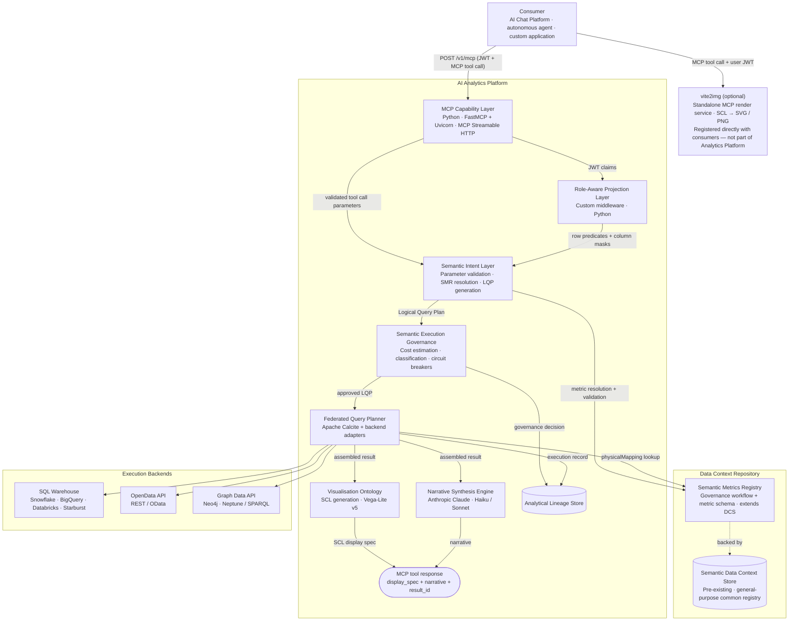

# 5. Proposed Technical Implementation

This chapter describes one reference implementation of the AI Analytics Platform. Stack choices are concrete but not prescriptive — the product specification is intentionally stack-agnostic. Any conformant implementation that satisfies the specified behaviours, governance guarantees, and interface contracts is valid. Technology substitutions at any layer require no changes to the product specification.

The product specification — component behaviours, interface contracts, governance requirements — is in [Chapter 3 — Core Platform Capabilities](./03-core-capabilities.md). The design principles governing every decision are in [Chapter 1 — Platform Overview, §Design Principles](./01-platform-overview.md#design-principles).

---

## 5.1 Architecture Overview



The Semantic Data Context Store (DCS) is a pre-existing platform component — the organisation's general-purpose registry for semantic definitions. The Analytics Platform registers metric definitions as a new `analytical_metric` type in the DCS, reusing its versioned storage, full-text search, cross-definition relationships, and tenant-scoped access control. The SMR governance layer adds the approval workflow, metric-specific schema validation, and the Admin API surface on top.

---

## 5.2 Layer-by-Layer Stack Decisions

### MCP Capability Layer

> **Specification:** [§MCP Capability Layer](./03-core-capabilities.md#mcp-capability-layer)

| Decision | Choice | Rationale |
|----------|--------|-----------|
| **Runtime** | Python · FastMCP + Uvicorn | Lightweight ASGI service; minimal dependencies; deploys as a Kubernetes pod or serverless container |
| **Protocol** | MCP Streamable HTTP | Standard MCP interoperability; supports request/response and streaming |
| **Auth** | JWT validation at request ingress | Stateless; validated before any platform computation begins |
| **Tools** | Three tools: `run_analytics` (SMR-driven execution), `list_operations` (discovery), `drilldown` (result navigation) | SMR owns all operation definitions; code is the execution engine |
| **Resources** | Knowledge artifacts only — guides, skills definitions, compliance reference | Static; no user data; embedded in AI consumer context before analytical tasks; no governance pipeline |
| **Prompts** | Pre-built analytical and regulatory assistant templates | Inject available metrics and governance constraints at session start |

FastMCP (`pip install fastmcp`) provides the `@mcp.tool()`, `@mcp.resource()`, and `@mcp.prompt()` decorators and handles MCP Streamable HTTP transport. Each analytical capability is a decorated Python function; the framework serialises schemas and routes calls automatically.

The separation of tools and resources is intentional. All analytical execution goes through `run_analytics` — a single tool that delegates to the SMR for every operation definition. Resources expose static knowledge artifacts from the Knowledge Store; they contain no user data and require no governance evaluation. The SMR owns what operations exist, what parameters they require, and how deeply they run through the pipeline. The code owns only the execution engine.

#### Tools

Three tools cover the entire analytical surface. The SMR owns every operation definition — what parameters it needs, what metrics and dimensions it supports, and how deeply it runs through the pipeline. No operation type is hardcoded in the execution layer.

```python
from fastmcp import FastMCP
from pydantic import BaseModel

mcp = FastMCP(
    name="Analytics Platform",
    instructions=(
        "Governed analytical execution engine. All operations are defined in the Semantic Metrics Registry. "
        "Call list_operations to discover available operations and their required parameters before "
        "calling run_analytics."
    ),
)

# ── Tool input models ─────────────────────────────────────────────────────────

class RunAnalyticsInput(BaseModel):
    operation_id: str   # SMR operation ID — discover via list_operations
    params:       dict  # operation parameters; validated against SMR operation schema by SIL

class DrilldownInput(BaseModel):
    result_id:      str
    hierarchy:      str
    selected_value: str | None = None

# ── Tools ─────────────────────────────────────────────────────────────────────

@mcp.tool()
async def run_analytics(input: RunAnalyticsInput, jwt: str) -> dict:
    """Execute an SMR-registered analytical operation.
    Call list_operations first to discover valid operation_id values and their required params.
    The execution pipeline depth — data retrieval, metric query, or full analytical — is determined
    by the operation's execution_profile in the SMR, not by this tool."""
    claims    = validate_jwt(jwt)
    operation = await smr.get_operation(input.operation_id, claims)
    lqp       = await sil.resolve(operation, input.params, claims)
    lqp       = rapl.project(lqp, claims)
    return await pipeline_executor.run(lqp, operation["execution_profile"])

@mcp.tool()
async def list_operations(domain: str | None = None, jwt: str = ...) -> dict:
    """List all SMR-registered operations available to the current user's role.
    Returns operation IDs, display names, required parameters, supported metrics,
    supported dimensions, and execution profiles."""
    claims = validate_jwt(jwt)
    return await smr.list_operations(claims, domain=domain)

@mcp.tool()
async def drilldown(input: DrilldownInput, jwt: str) -> dict:
    """Navigate into a dimension hierarchy from a prior result.
    All filters, role predicates, and entitlement context from the original result are preserved."""
    claims = validate_jwt(jwt)
    return await drilldown_service.execute(input, claims)
```

#### Execution profiles

Each SMR operation carries an `execution_profile` that tells the pipeline executor which stages to invoke:

| Profile | Pipeline stages | Typical operations |
|---------|----------------|-------------------|
| `data_retrieval` | Auth → RAPL → FQP → Lineage | Raw data fetches — positions, prices, reference data |
| `metric_query` | Auth → RAPL → SIL → SEG → FQP → Lineage | Single metric value lookups |
| `full_analytical` | Auth → RAPL → SIL → SEG → FQP → VO → NSE → Lineage | Attribution, comparison, regulatory reports |

#### Resources

Resources are used for **knowledge artifacts** — static reference material, skills definitions, and workflow guides that AI consumers embed in their context to understand how to use the platform effectively. Dynamic data lookups (metric definitions, lineage records, dimension catalogues) are handled by tools, not resources.

```python
@mcp.resource("guide://analytics/platform-overview")
async def guide_platform_overview() -> str:
    """What the Analytics Platform does, how it governs queries, and when to use
    each analytical capability. Load this before helping a user with any analytical task."""
    return knowledge_store.get("guide/platform-overview")

@mcp.resource("guide://analytics/analytical-domains")
async def guide_analytical_domains() -> str:
    """Reference guide to the six analytical domains (portfolio, performance, risk,
    regulatory, counterparty, benchmarks) — what each covers, which metrics belong
    to it, and the governance constraints that apply."""
    return knowledge_store.get("guide/analytical-domains")

@mcp.resource("guide://analytics/query-patterns")
async def guide_query_patterns() -> str:
    """Common analytical query patterns with worked examples: time-period comparisons,
    benchmark-relative performance, risk attribution, regulatory ratio queries.
    Use this to choose the right tool and parameter structure for a given user request."""
    return knowledge_store.get("guide/query-patterns")

@mcp.resource("skills://analytics/portfolio-performance-review")
async def skills_portfolio_performance() -> str:
    """Step-by-step skills definition for conducting a portfolio performance review:
    which metrics to query, which dimensions to apply, how to interpret the results,
    and when to drilldown. Designed for AI assistants supporting portfolio managers."""
    return knowledge_store.get("skills/portfolio-performance-review")

@mcp.resource("skills://analytics/risk-analysis")
async def skills_risk_analysis() -> str:
    """Skills definition for risk metric analysis: VaR, tracking error, expected
    shortfall, issuer concentration. Covers query construction, result interpretation,
    threshold context, and escalation patterns."""
    return knowledge_store.get("skills/risk-analysis")

@mcp.resource("skills://analytics/regulatory-reporting")
async def skills_regulatory_reporting() -> str:
    """Skills definition for regulatory metric queries under MiFID II and Basel III/IV:
    required dimensions, compliance mode constraints, business justification requirements,
    and how to surface lineage references in regulatory responses."""
    return knowledge_store.get("skills/regulatory-reporting")

@mcp.resource("guide://compliance/mifid2")
async def guide_mifid2() -> str:
    """MiFID II compliance mode reference: which query types require a business
    justification, best-execution dimension requirements, what the mifid2_trace
    record captures, and how to explain compliance constraints to users."""
    return knowledge_store.get("guide/compliance-mifid2")

@mcp.resource("guide://compliance/basel3")
async def guide_basel3() -> str:
    """Basel III/IV compliance mode reference: entity dimension requirements,
    regulatory snapshot writes, stress scenario classification rules, and
    how to structure LCR and NSFR queries correctly."""
    return knowledge_store.get("guide/compliance-basel3")
```

Knowledge artifacts are stored in a versioned content store (`knowledge_store`) managed via the Admin API. Tenant administrators can extend or override the default guides and skills definitions. Resources do not require JWT authentication — they contain no user data — but are scoped to the platform's public knowledge surface.

#### Prompts

Prompts provide pre-built instruction templates that AI consumers can load to anchor their analytical behaviour before making tool calls.

```python
@mcp.prompt()
async def analytical_assistant(jwt: str) -> str:
    """System prompt for an AI assistant using the Analytics Platform.
    Injects the tenant's available metrics and governance constraints."""
    claims  = validate_jwt(jwt)
    metrics = await smr.list_approved_summary(claims)   # id + label + description
    return f"""You are a governed analytical assistant. You answer quantitative questions
by calling the Analytics Platform tools — never by estimating or generating numbers.

Available metrics (call list_metrics or get_metric_definition for full detail):
{metrics}

Rules:
- Only reference metric IDs that appear in the list above.
- Do not invent metric values. Every number must come from a tool result.
- When a result includes a narrative field, surface it as the primary response — do not paraphrase or restate.
- When a result includes a result_id, offer to drilldown or inspect lineage if relevant.
- If a metric is not in the list, tell the user it is not registered and suggest list_metrics."""

@mcp.prompt()
async def regulatory_reporting_assistant(jwt: str) -> str:
    """System prompt for a compliance-focused assistant operating under MiFID II or Basel III/IV.
    Adds regulatory framing and prohibits investment recommendations."""
    claims  = validate_jwt(jwt)
    metrics = await smr.list_approved_summary(claims, domain="regulatory")
    return f"""You are a regulatory reporting assistant operating under strict compliance constraints.

Available regulatory metrics:
{metrics}

Additional rules beyond the standard analytical assistant:
- Do not generate investment recommendations under any circumstances.
- For client-related queries, remind the user that a business justification will be required.
- Cite the result_id and lineage_url in every response that references a computed metric value.
- If a compliance mode error is returned, explain the constraint in plain English before retrying."""

if __name__ == "__main__":
    mcp.run(transport="streamable-http", host="0.0.0.0", port=8000)
```

---

### Semantic Intent Layer

> **Specification:** [§Semantic Intent Layer](./03-core-capabilities.md#semantic-intent-layer)

| Decision | Choice | Rationale |
|----------|--------|-----------|
| **Parameter validation** | JSON Schema + Pydantic | Strict schema enforcement against MCP tool input models; structured error responses |
| **SMR resolution** | Direct SMR service call | Synchronous lookup against the metric registry; rejects unregistered IDs before LQP generation |
| **LQP generation** | Custom Python | Backend-agnostic DAG construction from validated parameters; deterministic for any given input |

---

### Narrative Synthesis Engine

> **Specification:** [§Narrative Synthesis Engine](./03-core-capabilities.md#narrative-synthesis-engine)

| Decision | Choice | Rationale |
|----------|--------|-----------|
| **Provider** | Anthropic Claude | Reliable instruction-following for constrained summarisation tasks |
| **Standard queries** | Claude Haiku | Sub-200ms narrative generation for simple metric summaries |
| **Complex queries** | Claude Sonnet | Attribution decompositions and multi-portfolio results require richer prose |
| **Prompt construction** | Result-only context | Metric labels + row values + units injected; no user query, no physical schema |
| **Post-generation validation** | Custom Python | Every numeric value in narrative matched against result set; reject and retry once on failure |
| **Feature flag** | `features.narrativeSynthesis` | Tenant-level on/off; disabled means NSE is never invoked |

---

### Semantic Metrics Registry (SMR)

> **Specification:** [§Semantic Metrics Registry](./03-core-capabilities.md#semantic-metrics-registry)

| Decision | Choice | Rationale |
|----------|--------|-----------|
| **Definition storage** | DCS (pre-existing) | Metric definitions alongside data definitions — no duplicate semantic store |
| **Governance tracking** | DCS document store — `smr_governance` document type | Approval workflow state stored as JSON documents in the same store as metric definitions |
| **Runtime reads** | Direct DCS API query by Semantic Intent Layer | Definitions from the authoritative source at resolution time |
| **Search** | DCS native search index | `list_metrics` queries DCS directly; no separate search infrastructure |

#### DCS governance extension — document schema

Each metric version in the SMR has a corresponding governance document stored in the DCS. The document records the approval lifecycle for that version:

```json
{
  "id":           "smr-gov-a1b2c3d4-e5f6-7890-abcd-ef1234567890",
  "type":         "smr_governance",
  "tenant_id":    "acme-wealth",
  "dcs_def_id":   "dcs://analytical_metric/portfolio_return",
  "metric_id":    "portfolio_return",
  "version":      3,
  "status":       "approved",
  "source":       "tenant",
  "created_by":   "alice@acme.com",
  "approved_by":  "cdo@acme.com",
  "approved_at":  "2026-05-14T09:00:00Z",
  "created_at":   "2026-05-13T14:32:00Z",
  "superseded_at": null
}
```

`status` is one of `"proposed"` | `"in_review"` | `"approved"` | `"deprecated"` | `"retired"`. The DCS enforces a uniqueness constraint: at most one document per `(tenant_id, metric_id)` may carry `"status": "approved"` at any point in time. All prior versions are retained as `"deprecated"` documents for lineage reconstruction.

#### DCS analytical operation catalogue — document schema

Analytical operations are also stored as DCS documents (`type: "analytical_operation"`). Each document defines a parameterised operation that the Semantic Intent Layer accepts via the `operation_id` field on tool inputs. The `list_operations` tool queries this catalogue.

```json
[
  {
    "type":                 "analytical_operation",
    "operation_id":         "get_positions",
    "display_name":         "Portfolio Positions",
    "execution_profile":    "data_retrieval",
    "description":          "Fetch current or historical position data for a portfolio.",
    "required_params":      ["portfolio_id"],
    "optional_params":      ["as_of_date", "asset_class"]
  },
  {
    "type":                 "analytical_operation",
    "operation_id":         "portfolio_return",
    "display_name":         "Portfolio Return",
    "execution_profile":    "metric_query",
    "description":          "Retrieve the total return for a portfolio over a specified period.",
    "required_params":      ["portfolio_id", "time_period"],
    "supported_metrics":    ["portfolio_return"]
  },
  {
    "type":                 "analytical_operation",
    "operation_id":         "risk_breakdown",
    "display_name":         "Risk Breakdown",
    "execution_profile":    "full_analytical",
    "description":          "Decompose a risk metric into factor contributions by the specified dimension.",
    "required_params":      ["portfolio_id", "metrics", "attribution_by", "as_of_date"],
    "supported_metrics":    ["var_95", "var_99", "tracking_error", "beta", "duration", "convexity"],
    "supported_dimensions": ["asset_class", "geography", "sector", "currency", "issuer"],
    "default_visualization":"attribution_waterfall"
  },
  {
    "type":                 "analytical_operation",
    "operation_id":         "compare_portfolios",
    "display_name":         "Portfolio Comparison",
    "execution_profile":    "full_analytical",
    "description":          "Compare one or more metrics across two or more portfolios, optionally against a benchmark.",
    "required_params":      ["portfolio_ids", "metrics", "time_period"],
    "optional_params":      ["benchmark_id"],
    "supported_metrics":    ["portfolio_return", "tracking_error", "sharpe_ratio", "volatility", "beta"],
    "default_visualization":"bar_multi_series_comparison"
  },
  {
    "type":                 "analytical_operation",
    "operation_id":         "performance_attribution",
    "display_name":         "Performance Attribution",
    "execution_profile":    "full_analytical",
    "description":          "BHB or Brinson-Fachler attribution decomposition for a portfolio versus its benchmark.",
    "required_params":      ["portfolio_id", "benchmark_id", "attribution_by", "time_period"],
    "supported_dimensions": ["asset_class", "sector", "geography", "currency"],
    "default_visualization":"attribution_waterfall"
  },
  {
    "type":                    "analytical_operation",
    "operation_id":            "regulatory_report",
    "display_name":            "Regulatory Compliance Report",
    "execution_profile":       "full_analytical",
    "description":             "Entity-level regulatory compliance metric report under MiFID II or Basel III/IV.",
    "required_params":         ["metric_id", "entity_id", "reporting_date", "jurisdiction"],
    "compliance_modes":        ["mifid2", "basel3"],
    "required_feature_flag":   "regulatory_reporting",
    "default_visualization":   "table"
  }
]
```

New operations are added via `POST /v1/smr/operations` through the Admin API and follow the same approval workflow as metric definitions. The `supported_metrics`, `supported_dimensions`, and `execution_profile` are enforced by the Semantic Intent Layer — an operation call referencing an unknown metric or profile mismatch is rejected before LQP generation.

---

### Semantic Intent Layer and LQP Generator

No custom query language. The MCP tool call JSON (metric IDs, dimension IDs, time period, filters) is the analytical intent representation — consistent with Cube.js and MetricFlow conventions.

| Decision | Choice | Rationale |
|----------|--------|-----------|
| **Intent format** | MCP tool call JSON | Standard AI tool-use format; no separate language needed |
| **Implementation** | Python (JSON schema + SMR resolution via DCS API) | Lightweight; no grammar or parser |
| **LQP format** | Custom DAG (JSON) | Engine-agnostic across SQL, OpenData, and Graph backends |

#### MCP input example

```json
{
  "tool": "analyse_metric",
  "input": {
    "metrics":    ["portfolio_return", "tracking_error"],
    "dimensions": ["portfolio"],
    "time":       { "period": "quarter_to_date", "as_of_date": "2026-05-14" },
    "filters":    [{ "dimension": "portfolio", "operator": "in", "values": ["GLOB_EQ_OPP", "UK_CORE_INC"] }],
    "sort":       [{ "metric": "portfolio_return", "direction": "desc" }]
  }
}
```

The Semantic Intent Layer resolves metric IDs against the SMR, merges in role predicates from the RAPL, and emits an engine-agnostic LQP. The LQP carries resolved `physicalMapping` references, expanded time ranges, role-injected filters, and a cost estimate for governance validation.

#### LQP output example

```json
{
  "lqp_id": "lqp-20260514-093241-xyz",
  "tenant_id": "acme-wealth",
  "nodes": [
    {
      "id": "node-1",
      "op": "metric_scan",
      "metric_id": "portfolio_return",
      "metric_version": "2.1.0",
      "aggregation": "value_weighted_average",
      "data_affinity": "portfolio",
      "physical_mapping": { "source": "primary-warehouse", "table": "fact_portfolio_daily" }
    },
    {
      "id": "node-2",
      "op": "metric_scan",
      "metric_id": "tracking_error",
      "metric_version": "1.3.0",
      "aggregation": "value_weighted_average",
      "data_affinity": "risk_metrics",
      "physical_mapping": { "source": "risk-semantic-layer", "cube": "risk_cube" }
    },
    {
      "id": "node-3",
      "op": "join",
      "inputs": ["node-1", "node-2"],
      "join_keys": ["portfolio_id", "date"]
    },
    {
      "id": "node-4",
      "op": "filter",
      "input": "node-3",
      "predicates": [
        "portfolio_id IN ('GLOB_EQ_OPP', 'UK_CORE_INC')",
        "asset_class = 'EQUITY'"
      ]
    },
    {
      "id": "node-5",
      "op": "time_expand",
      "input": "node-4",
      "period": "quarter_to_date",
      "as_of_date": "2026-05-14",
      "resolved_range": { "from": "2026-04-01", "to": "2026-05-14" }
    },
    {
      "id": "node-6",
      "op": "sort",
      "input": "node-5",
      "by": [{ "field": "portfolio_return", "direction": "desc" }]
    }
  ],
  "cost_estimate": 850,
  "column_masks": [],
  "row_predicates_applied": true
}
```

---

### Role-Aware Projection Layer

> **Specification:** [§Role-Aware Projection Layer](./03-core-capabilities.md#role-aware-projection-layer)

| Decision | Choice | Rationale |
|----------|--------|-----------|
| **Implementation** | Custom middleware (Python) | Thin, stateless; operates on the LQP before any backend query is generated |
| **Role resolution** | JWT claim extraction + PostgreSQL role config | Role claim field name is configurable per tenant |
| **Row predicates** | `{{user.claim_name}}` template interpolation at LQP build time | Resolved from JWT claims; injected into LQP `filters` |
| **Column masking** | Applied post-assembly in FQP result assembler | Post-assembly supports cross-backend result sets |
| **Default policy** | `defaultDenyAll: true` | No access unless a matching role is found |

#### Role policy example

```json
{
  "roleId":   "regional_analyst",
  "tenantId": "acme-wealth",
  "allowedMetrics": null,
  "deniedMetrics":  ["var_99", "expected_shortfall"],
  "rowPredicates": {
    "portfolio": "portfolio_id IN ({{user.managed_portfolios}})"
  },
  "columnMasks": {
    "aum": {
      "condition":   "{{user.roles}} NOT CONTAINS 'senior_analyst'",
      "action":      "suppress",
      "replacement": null
    }
  }
}
```

---

### Semantic Execution Governance

> **Specification:** [§Semantic Execution Governance](./03-core-capabilities.md#semantic-execution-governance)

| Decision | Choice | Rationale |
|----------|--------|-----------|
| **Implementation** | Custom rules engine (Python) | Deterministic; config-driven; no ML inference |
| **Cost estimation** | `Σ(metric.costWeight × dimensionCardinality × timeRangeMultiplier)` | Pre-execution; calibrated against actual cost data |
| **Circuit breaker** | Per-request ceiling + per-user hourly budget | Hard ceiling prevents runaway queries |
| **Config store** | DCS document store — `governance_config` document type | Per-tenant thresholds stored as a JSON document alongside SMR documents |

Each tenant has one governance config document. The Semantic Execution Governance layer reads it at startup and refreshes it on change events from the DCS:

```json
{
  "type":                       "governance_config",
  "tenant_id":                  "acme-wealth",
  "cost_ceiling_per_query":     1000,
  "cost_budget_per_user_hourly": 10000,
  "max_concurrent_queries":     20,
  "max_metrics_per_query":      10,
  "max_dimensions":             5,
  "classification_gate":        true,
  "blocked_classifications":    ["TOP_SECRET", "RESTRICTED"],
  "query_timeout_seconds":      60,
  "compliance_modes":           ["mifid2"],
  "require_lineage_for_export": true,
  "audit_all_queries":          true
}
```

---

### Federated Query Planner (FQP)

> **Specification:** [§Federated Query Planner](./03-core-capabilities.md#federated-query-planner)

| Decision | Choice | Rationale |
|----------|--------|-----------|
| **Plan optimiser** | Apache Calcite | Battle-tested SQL plan optimisation; used by Trino, Flink, Beam |
| **Backend adapters** | Custom adapter per backend type | Calcite handles SQL; custom adapters cover REST/OpenData/GraphQL/SPARQL |
| **Result assembly** | Custom (Python) | Fan-out/fan-in; no off-the-shelf library needed |

The FQP splits the LQP by `dataAffinity`, assigns each sub-plan to the matching registered backend, translates to the backend's native protocol (SQL, OData, SPARQL, etc.), fans out execution in parallel, and assembles results. Each execution backend implements a two-method adapter contract: `ping()` for health checking and `executeSubPlan()` for receiving a sub-plan fragment and returning a typed result set.

#### FQP input — approved LQP

The FQP receives the governance-approved LQP produced by the Semantic Intent Layer. It reads `data_affinity` on each metric node to determine which backend to route each sub-plan to:

```json
{
  "lqp_id": "lqp-20260514-093241-xyz",
  "tenant_id": "acme-wealth",
  "nodes": [
    {
      "id": "node-1", "op": "metric_scan",
      "metric_id": "portfolio_return", "metric_version": "2.1.0",
      "aggregation": "value_weighted_average",
      "data_affinity": "portfolio",
      "physical_mapping": { "source": "primary-warehouse", "table": "fact_portfolio_daily" }
    },
    {
      "id": "node-2", "op": "metric_scan",
      "metric_id": "tracking_error", "metric_version": "1.3.0",
      "aggregation": "value_weighted_average",
      "data_affinity": "risk_metrics",
      "physical_mapping": { "source": "risk-semantic-layer", "cube": "risk_cube" }
    },
    { "id": "node-3", "op": "join",   "inputs": ["node-1", "node-2"], "join_keys": ["portfolio_id", "date"] },
    { "id": "node-4", "op": "filter", "input": "node-3",
      "predicates": ["portfolio_id IN ('GLOB_EQ_OPP', 'UK_CORE_INC')", "asset_class = 'EQUITY'"] },
    { "id": "node-5", "op": "time_expand", "input": "node-4",
      "period": "quarter_to_date", "resolved_range": { "from": "2026-04-01", "to": "2026-05-14" } },
    { "id": "node-6", "op": "sort", "input": "node-5",
      "by": [{ "field": "portfolio_return", "direction": "desc" }] }
  ],
  "cost_estimate": 850,
  "governance_approved": true,
  "row_predicates_applied": true,
  "column_masks": []
}
```

The FQP decomposes this into two sub-plans — one routed to `primary-warehouse` (nodes 1, 4, 5, 6) and one to `risk-semantic-layer` (node 2) — executes them in parallel, and joins on `portfolio_id` and `date` at assembly.

#### FQP output — assembled result

After execution and result assembly the FQP returns a typed result envelope in parallel to the Visualisation Ontology and Narrative Synthesis Engine:

```json
{
  "result_id":      "res_20260514_093247_a1b2c3",
  "lqp_id":        "lqp-20260514-093241-xyz",
  "tenant_id":     "acme-wealth",
  "cache_hit":     false,
  "latency_ms":    1243,
  "cost_units":    850,
  "backends_used": ["primary-warehouse", "risk-semantic-layer"],
  "schema": [
    { "field": "portfolio_id",     "type": "string"  },
    { "field": "portfolio_return", "type": "number", "unit": "percentage", "decimals": 2 },
    { "field": "tracking_error",   "type": "number", "unit": "percentage", "decimals": 2 }
  ],
  "rows": [
    { "portfolio_id": "GLOB_EQ_OPP", "portfolio_return": 4.21, "tracking_error": 3.18 },
    { "portfolio_id": "UK_CORE_INC", "portfolio_return": 2.87, "tracking_error": 1.94 }
  ],
  "sub_plans": [
    {
      "backend":    "primary-warehouse",
      "dialect":    "snowflake_sql",
      "query":      "SELECT portfolio_id, AVG(portfolio_return) AS portfolio_return FROM fact_portfolio_daily WHERE portfolio_id IN ('GLOB_EQ_OPP','UK_CORE_INC') AND asset_class = 'EQUITY' AND date BETWEEN '2026-04-01' AND '2026-05-14' GROUP BY portfolio_id ORDER BY portfolio_return DESC",
      "latency_ms": 980,
      "row_count":  2
    },
    {
      "backend":    "risk-semantic-layer",
      "dialect":    "metricflow",
      "query":      { "metrics": ["tracking_error"], "group_by": ["portfolio_id"], "where": "portfolio_id IN ('GLOB_EQ_OPP','UK_CORE_INC')" },
      "latency_ms": 620,
      "row_count":  2
    }
  ]
}
```

#### Supported backend adapters

| Backend type | Adapter | Protocols |
|-------------|---------|-----------|
| **SQL warehouse** | Calcite SQL adapter | Snowflake, BigQuery, Databricks, Redshift, Trino, Starburst, PostgreSQL |
| **Semantic layer** | Semantic layer adapter | dbt Semantic Layer (MetricFlow), Cube.js |
| **OpenData API** | REST/OData adapter | REST JSON, OData v4, SOAP (via shim) |
| **Graph Data API** | Graph adapter | Neo4j Bolt, Amazon Neptune SPARQL, OpenCypher REST |
| **OLAP engine** | OLAP adapter | Apache Druid, ClickHouse, Pinot |
| **Custom** | Custom adapter interface | Any backend conforming to the `FQPBackendAdapter` contract |

---

### Visualisation Ontology

> **Specification:** [§Visualisation Ontology](./03-core-capabilities.md#visualisation-ontology)

| Decision | Choice | Rationale |
|----------|--------|-----------|
| **Chart spec** | Vega-Lite v5 JSON | Industry-standard chart grammar; wide ecosystem for web, server-side, and image rendering |
| **Table spec** | Platform-defined `type: "table"` extension | Vega-Lite has no native table mark; same `data` + `columns` convention |

#### Visualisation Ontology input

The ontology evaluator receives the FQP assembled result alongside the resolved intent pattern. It uses the result schema and intent pattern to select the best-matching chart contract:

```json
{
  "intent_pattern": "COMPARISON",
  "schema": [
    { "field": "portfolio_id",     "type": "string"  },
    { "field": "portfolio_return", "type": "number", "unit": "percentage" },
    { "field": "tracking_error",   "type": "number", "unit": "percentage" }
  ],
  "rows": [
    { "portfolio_id": "GLOB_EQ_OPP", "portfolio_return": 4.21, "tracking_error": 3.18 },
    { "portfolio_id": "UK_CORE_INC", "portfolio_return": 2.87, "tracking_error": 1.94 }
  ],
  "sort": { "field": "portfolio_return", "direction": "desc" },
  "allowed_chart_types": ["bar", "line", "scatter", "heatmap", "treemap", "table"]
}
```

#### Visualisation Ontology output — SCL display spec

The evaluator matches the `COMPARISON` intent pattern and two-metric schema to the `BAR_MULTI_SERIES_COMPARISON` contract and emits a Vega-Lite v5 SCL display spec:

```json
{
  "type": "chart",
  "contract": "BAR_MULTI_SERIES_COMPARISON",
  "mark": "bar",
  "data": {
    "values": [
      { "portfolio_id": "GLOB_EQ_OPP", "metric": "Portfolio Return", "value": 4.21 },
      { "portfolio_id": "GLOB_EQ_OPP", "metric": "Tracking Error",   "value": 3.18 },
      { "portfolio_id": "UK_CORE_INC", "metric": "Portfolio Return", "value": 2.87 },
      { "portfolio_id": "UK_CORE_INC", "metric": "Tracking Error",   "value": 1.94 }
    ]
  },
  "encoding": {
    "x":      { "field": "portfolio_id", "type": "nominal",      "title": "Portfolio",     "sort": "-y" },
    "y":      { "field": "value",        "type": "quantitative", "title": "Value (%)",     "axis": { "format": ".2f" } },
    "color":  { "field": "metric",       "type": "nominal",      "title": "Metric" }
  },
  "colorScheme": ["#003f5c", "#bc5090"],
  "formatHints": {
    "portfolio_return": { "format": ".2%", "unit": "%" },
    "tracking_error":   { "format": ".2%", "unit": "%" }
  },
  "interactions": ["click:drilldown", "hover:tooltip", "select:multi-point"]
}
```

Full SCL examples including the `type: "table"` spec are in Section 3.7 (Analytical Output Format). Full chart contract definitions are in Section 3.6 (Visualisation Ontology).

---

### Static Image Rendering (vite2img)

vite2img is a **standalone MCP render service** — not part of the Analytics Platform. Consumers that need static image output register it as a peer MCP server alongside the Analytics Platform.

| Decision | Choice | Rationale |
|----------|--------|-----------|
| **Integration** | Standalone MCP server registered directly with consumers | Keeps rendering outside the Analytics Platform; consumers decide when to call it |
| **Implementation** | Vite + vega-embed + headless Chromium (Playwright) | Pixel-accurate SVG/PNG from Vega-Lite specs |
| **Table rendering** | Custom HTML template + Playwright screenshot | Styled table rendering |

| Consumer | Chart | Table | Static image |
|---------|-------|-------|------|
| AI Chat Platform | vega-embed | Native data table | vite2img (direct MCP call) |
| Custom UI | vega-embed (recommended) | Host's own grid | vite2img |
| Agentic consumers | vite2img | vite2img | vite2img |

---

### Analytical Lineage Store

> **Specification:** [§Analytical Lineage Store](./03-core-capabilities.md#analytical-lineage-store)

| Decision | Choice | Rationale |
|----------|--------|-----------|
| **Lineage records** | S3-compatible object store — one JSON document per query | Write-once; append-only; cheap at scale; no schema migration required; natural fit for immutable audit records |
| **Object key** | `lineage/{tenant_id}/{yyyy}/{mm}/{dd}/{result_id}.json` | Date-partitioned; enables prefix-based listing by tenant and time window |
| **Search index** | Thin PostgreSQL table (scalar fields only, no JSON blobs) | Used by the Lineage Query REST API (Phase 11) for filtered search; full record always fetched from the object store |
| **Retention** | Object lifecycle policy — default 7 years (configurable per compliance mode) | MiFID II and equivalent regimes; enforced at the storage layer, not application code |

#### Lineage document schema

Each completed query writes a single JSON document to the object store at `lineage/{tenant_id}/{yyyy}/{mm}/{dd}/{result_id}.json`:

```json
{
  "result_id":          "res_20260514_093247_a1b2c3",
  "tenant_id":          "acme-wealth",
  "user_sub":           "auth0|user_xyz",
  "lqp_id":             "lqp-20260514-093241-xyz",
  "cache_hit":          false,
  "request_payload":    { "tool": "analyse_metric", "input": { "..." } },
  "resolved_metrics":   [{ "metric_id": "portfolio_return", "version": "2.1.0" }],
  "governance_decision":{ "approved": true, "cost_units": 850, "checks_passed": ["cost", "classification", "circuit_breaker"] },
  "sub_plans":          [{ "backend": "primary-warehouse", "query": "...", "latency_ms": 980 }],
  "result_summary":     { "row_count": 2, "schema": ["..."], "rows": ["..."] },
  "display_spec":       { "type": "chart", "contract": "BAR_MULTI_SERIES_COMPARISON", "..." },
  "error_code":         null,
  "compliance_mode":    "mifid2",
  "compliance_meta":    { "justification": "Quarterly review", "trace_id": "mifid2-trace-abc" },
  "created_at":         "2026-05-14T09:32:47Z",
  "expires_at":         "2033-05-14T09:32:47Z"
}
```

Records are written once and never mutated. Post-hoc compliance annotations are written as separate sibling documents (`{result_id}_amendment_{n}.json`) referencing the original `result_id`.

#### Search index DDL

A lightweight PostgreSQL table holds only the scalar fields required for the Lineage Query REST API (Phase 11). Full records are always retrieved from the object store; this table is never the source of truth for record content.

```sql
CREATE TABLE analytics.lineage_index (
  result_id       TEXT        PRIMARY KEY,
  tenant_id       TEXT        NOT NULL,
  user_sub        TEXT        NOT NULL,
  compliance_mode TEXT,
  error_code      TEXT,
  cache_hit       BOOLEAN     NOT NULL,
  created_at      TIMESTAMPTZ NOT NULL,
  expires_at      TIMESTAMPTZ NOT NULL
);

CREATE INDEX idx_lineage_tenant_user ON analytics.lineage_index (tenant_id, user_sub, created_at DESC);
CREATE INDEX idx_lineage_tenant_time ON analytics.lineage_index (tenant_id, created_at DESC);
CREATE INDEX idx_lineage_compliance  ON analytics.lineage_index (tenant_id, compliance_mode) WHERE compliance_mode IS NOT NULL;
```

---

### Knowledge Store

> **Used by:** MCP Resource handlers

| Decision | Choice | Rationale |
|----------|--------|-----------|
| **Storage** | S3-compatible object store (versioned Markdown or MDX files) | Human-readable; diffable; straightforward Admin API management |
| **Access** | Read-only at runtime via MCP resource handlers | No user data; no governance pipeline required |
| **Management** | Admin API — create, update, version knowledge artifacts | Tenant administrators can extend or override default content |
| **Defaults** | Bundled at installation alongside the Financial Services Reference Model | Covers platform overview, all six analytical domains, core skills definitions, MiFID II and Basel III/IV compliance guides |

Each knowledge artifact is a versioned Markdown document identified by a URI path that maps directly to its MCP resource address (`guide://analytics/platform-overview` → `guide/analytics/platform-overview.md`). The active version for each artifact is controlled via the Admin API; previous versions are retained for audit purposes. Tenants may add custom skills definitions and workflow guides without modifying the platform defaults.

---

## 5.3 Infrastructure

| Component | Choice | Rationale |
|-----------|--------|-----------|
| MCP service | Python · FastMCP + Uvicorn | Lightweight ASGI MCP surface; deploys as Kubernetes pod |
| Backend services | Kubernetes (cloud-agnostic) | FQP, governance, platform services as independently scalable pods |
| Primary database | PostgreSQL (Neon or RDS) | Lineage search index, role policy config, scheduled queries, user preferences, saved queries |
| Data Context Store (DCS) | Pre-existing platform component | SMR metric definitions, governance config, SMR search — reuses DCS versioned storage and native search |
| Knowledge Store | S3-compatible object store (versioned Markdown) | MCP resource content — guides, skills definitions, compliance reference |
| Object storage | S3-compatible | Lineage records (one JSON document per query), result artefacts, large cached result sets |
| Message queue | SQS / Pub/Sub | Async lineage writes, DCS change events |
| Secrets | HashiCorp Vault or cloud-native | Backend credentials, platform service keys |

### Financial Services Reference Model

| Decision | Choice | Rationale |
|----------|--------|-----------|
| **Packaging** | Versioned JSON document bundles (one per domain) | Conforms directly to the DCS `analytical_metric` schema; idempotently importable via `POST /v1/smr/seed`; selective per-domain activation |
| **Distribution** | Bundled at installation; updatable from Semantic Registry Service | Air-gapped deployments supported |
| **Activation** | `analyticalDomain` config triggers SMR import at tenant setup | Bundle documents are written to the DCS in `proposed` state; Application Admin approves before metrics become resolvable |
| **Customisation** | Full edit/override via Admin API after import | Customised definitions marked `source: "tenant"` in the DCS document |

Each bundle is a JSON array of `analytical_metric` documents conforming to the DCS document schema defined in Section 3.1. The `risk` domain bundle includes `var_95`, `var_99`, `expected_shortfall`, `beta`, `duration`, `convexity`. The `regulatory` bundle (`lcr`, `nsfr`, `leverage_ratio`) sets `classificationLevel: "restricted"` with regime-specific compliance metadata.
