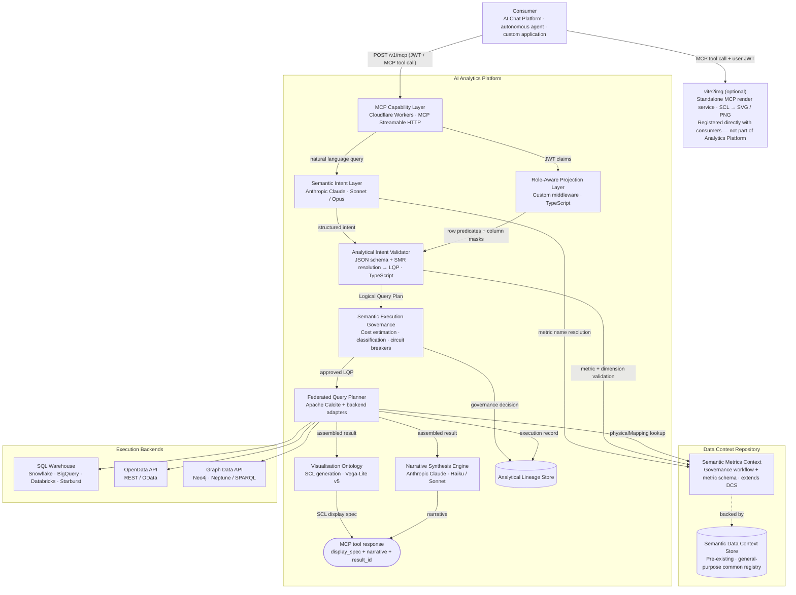

# 5. Proposed Technical Implementation

This chapter describes one reference implementation of the AI Analytics Platform. Stack choices are concrete but not prescriptive — the product specification is intentionally stack-agnostic. Any conformant implementation that satisfies the specified behaviours, governance guarantees, and interface contracts is valid. Technology substitutions at any layer require no changes to the product specification.

---

## 5.1 Architecture Overview



The Semantic Data Context Store (DCS) is a pre-existing platform component — the organisation's general-purpose registry for semantic definitions. The Analytics Platform registers metric definitions as a new `analytical_metric` type in the DCS, reusing its versioned storage, full-text search, cross-definition relationships, and tenant-scoped access control. The SMR governance layer adds the approval workflow, metric-specific schema validation, and the Admin API surface on top.

---

## 5.2 Layer-by-Layer Stack Decisions

### MCP Capability Layer

| Decision | Choice | Rationale |
|----------|--------|-----------|
| **Runtime** | Cloudflare Workers | Sub-10ms cold start; global anycast; ideal for the platform's edge API pattern |
| **Protocol** | MCP Streamable HTTP | Standard MCP interoperability; supports request/response and streaming |
| **Auth** | JWT validation at edge | Stateless; validated before any platform computation begins |

`analyse_metric` accepts: `metrics` (required, array of SMR metric IDs), `dimensions` (array of dimension IDs), `time` (period enum or custom date range), `filters` (dimension/operator/values), `sort` (metric + direction), `limit` (1–1000, default 100).

---

### Semantic Intent Layer

| Decision | Choice | Rationale |
|----------|--------|-----------|
| **Provider** | Anthropic Claude | Strong instruction following and tool-use reliability for constrained analytical domains |
| **Intent resolution** | Sonnet | Good speed/accuracy balance for metric name resolution |
| **Complex queries** | Opus | Multi-metric attribution and ambiguous intent |

---

### Semantic Metrics Registry (SMR)

| Decision | Choice | Rationale |
|----------|--------|-----------|
| **Definition storage** | DCS (pre-existing) | Metric definitions alongside data definitions — no duplicate semantic store |
| **Governance tracking** | PostgreSQL (`analytics.smr_governance`) | Lightweight approval workflow state; the DCS does not manage approval workflows |
| **Runtime reads** | Direct DCS API query by Analytical Intent Validator | Definitions from the authoritative source at resolution time |
| **Search** | DCS native search index | `list_metrics` queries DCS directly; no separate search infrastructure |

#### DCS governance extension schema

```sql
CREATE TABLE analytics.smr_governance (
  id            UUID        PRIMARY KEY DEFAULT gen_random_uuid(),
  tenant_id     TEXT        NOT NULL,
  dcs_def_id    TEXT        NOT NULL,
  metric_id     TEXT        NOT NULL,
  version       INT         NOT NULL,
  status        TEXT        NOT NULL,  -- "proposed" | "approved" | "deprecated"
  source        TEXT        NOT NULL DEFAULT 'tenant',
  created_by    TEXT        NOT NULL,
  approved_by   TEXT,
  approved_at   TIMESTAMPTZ,
  created_at    TIMESTAMPTZ NOT NULL DEFAULT now(),
  superseded_at TIMESTAMPTZ,
  CONSTRAINT uq_smr_version UNIQUE (tenant_id, metric_id, version)
);

CREATE UNIQUE INDEX idx_smr_one_approved
  ON analytics.smr_governance (tenant_id, metric_id)
  WHERE status = 'approved';
```

---

### Analytical Intent Validator and LQP Generator

No custom query language. The MCP tool call JSON (metric IDs, dimension IDs, time period, filters) is the analytical intent representation — consistent with Cube.js and MetricFlow conventions.

| Decision | Choice | Rationale |
|----------|--------|-----------|
| **Intent format** | MCP tool call JSON | Standard AI tool-use format; no separate language needed |
| **Implementation** | TypeScript (JSON schema + SMR resolution) | Lightweight; no grammar or parser |
| **LQP format** | Custom DAG (JSON) | Engine-agnostic across SQL, OpenData, and Graph backends |

#### MCP input example

```json
{
  "tool": "analyse_metric",
  "input": {
    "metrics":    ["portfolio_return", "tracking_error"],
    "dimensions": ["portfolio"],
    "time":       { "period": "quarter_to_date", "as_of_date": "2026-05-14" },
    "filters":    [{ "dimension": "portfolio", "operator": "in", "values": ["GLOB_EQ_OPP", "UK_CORE_INC"] }],
    "sort":       [{ "metric": "portfolio_return", "direction": "desc" }]
  }
}
```

The validator resolves metric IDs against the SMR, injects role predicates from the RAPL, and emits an engine-agnostic LQP carrying resolved `physicalMapping` references, time range expansion, role-injected filters, and a cost estimate for governance validation.

---

### Role-Aware Projection Layer

| Decision | Choice | Rationale |
|----------|--------|-----------|
| **Implementation** | Custom middleware (TypeScript) | Thin, stateless; operates on the LQP before any backend query is generated |
| **Role resolution** | JWT claim extraction + PostgreSQL role config | Role claim field name is configurable per tenant |
| **Row predicates** | `{{user.claim_name}}` template interpolation at LQP build time | Resolved from JWT claims; injected into LQP `filters` |
| **Column masking** | Applied post-assembly in FQP result assembler | Post-assembly supports cross-backend result sets |
| **Default policy** | `defaultDenyAll: true` | No access unless a matching role is found |

#### Role policy example

```json
{
  "roleId":   "regional_analyst",
  "tenantId": "acme-wealth",
  "allowedMetrics": null,
  "deniedMetrics":  ["var_99", "expected_shortfall"],
  "rowPredicates": {
    "portfolio": "portfolio_id IN ({{user.managed_portfolios}})"
  },
  "columnMasks": {
    "aum": {
      "condition":   "{{user.roles}} NOT CONTAINS 'senior_analyst'",
      "action":      "suppress",
      "replacement": null
    }
  }
}
```

---

### Semantic Execution Governance

| Decision | Choice | Rationale |
|----------|--------|-----------|
| **Implementation** | Custom rules engine (TypeScript) | Deterministic; config-driven; no ML inference |
| **Cost estimation** | `Σ(metric.costWeight × dimensionCardinality × timeRangeMultiplier)` | Pre-execution; calibrated against actual cost data |
| **Circuit breaker** | Per-request ceiling + per-user hourly budget | Hard ceiling prevents runaway queries |
| **Config store** | PostgreSQL (`analytics.governance_config`) | Per-tenant thresholds; not hardcoded |

`analytics.governance_config` — per-tenant thresholds: `cost_ceiling_per_query` (default 2000), `cost_budget_per_user_hourly` (default 10000), `max_concurrent_queries` (default 20), `max_metrics_per_query` (default 10), `max_dimensions` (default 5), `classification_gate`, `compliance_modes` array.

---

### Federated Query Planner (FQP)

| Decision | Choice | Rationale |
|----------|--------|-----------|
| **Plan optimiser** | Apache Calcite | Battle-tested SQL plan optimisation; used by Trino, Flink, Beam |
| **Backend adapters** | Custom adapter per backend type | Calcite handles SQL; custom adapters cover REST/OpenData/GraphQL/SPARQL |
| **Result assembly** | Custom (TypeScript) | Fan-out/fan-in; no off-the-shelf library needed |

The FQP splits the LQP by `dataAffinity`, assigns each sub-plan to the matching registered backend, translates to the backend's native protocol (SQL, OData, SPARQL, etc.), fans out execution in parallel, and assembles results. Each execution backend implements a two-method adapter contract: `ping()` for health checking and `executeSubPlan()` for receiving a sub-plan fragment and returning a typed result set.

#### Supported backend adapters

| Backend type | Adapter | Protocols |
|-------------|---------|-----------|
| **SQL warehouse** | Calcite SQL adapter | Snowflake, BigQuery, Databricks, Redshift, Trino, Starburst, PostgreSQL |
| **Semantic layer** | Semantic layer adapter | dbt Semantic Layer (MetricFlow), Cube.js |
| **OpenData API** | REST/OData adapter | REST JSON, OData v4, SOAP (via shim) |
| **Graph Data API** | Graph adapter | Neo4j Bolt, Amazon Neptune SPARQL, OpenCypher REST |
| **OLAP engine** | OLAP adapter | Apache Druid, ClickHouse, Pinot |
| **Custom** | Custom adapter interface | Any backend conforming to the `FQPBackendAdapter` contract |

---

### Visualisation Ontology

| Decision | Choice | Rationale |
|----------|--------|-----------|
| **Chart spec** | Vega-Lite v5 JSON | Industry-standard chart grammar; wide ecosystem for web, server-side, and image rendering |
| **Table spec** | Platform-defined `type: "table"` extension | Vega-Lite has no native table mark; same `data` + `columns` convention |

SCL format examples are shown in Section 3.7 (Analytical Output Format). Full spec is in Section 3.6 (Visualisation Ontology).

---

### Static Image Rendering (vite2img)

vite2img is a **standalone MCP render service** — not part of the Analytics Platform. Consumers that need static image output register it as a peer MCP server alongside the Analytics Platform.

| Decision | Choice | Rationale |
|----------|--------|-----------|
| **Integration** | Standalone MCP server registered directly with consumers | Keeps rendering outside the Analytics Platform; consumers decide when to call it |
| **Implementation** | Vite + vega-embed + headless Chromium (Playwright) | Pixel-accurate SVG/PNG from Vega-Lite specs |
| **Table rendering** | Custom HTML template + Playwright screenshot | Styled table rendering |

| Consumer | Chart | Table | Static image |
|---------|-------|-------|------|
| AI Chat Platform | vega-embed | Native data table | vite2img (direct MCP call) |
| Custom UI | vega-embed (recommended) | Host's own grid | vite2img |
| Agentic consumers | vite2img | vite2img | vite2img |

---

### Narrative Synthesis Engine

| Decision | Choice | Rationale |
|----------|--------|-----------|
| **Provider** | Anthropic Claude | Consistent with intent layer; strong constrained prose generation |
| **Default tier** | Haiku | Low latency; sufficient quality for narrative prose |
| **Complex narratives** | Sonnet | Multi-portfolio attribution; complex regulatory narratives |

---

### Analytical Lineage Store

| Decision | Choice | Rationale |
|----------|--------|-----------|
| **Lineage records** | PostgreSQL | Structured; queryable; ACID audit integrity |
| **Result artefacts** | S3-compatible object storage | Large result sets stored as blobs; referenced by URL |
| **Retention** | Default 7 years (configurable per compliance mode) | MiFID II and equivalent regimes |

#### `analytics.lineage_records` DDL

```sql
CREATE TABLE analytics.lineage_records (
  result_id            TEXT        PRIMARY KEY,
  tenant_id            TEXT        NOT NULL,
  user_sub             TEXT        NOT NULL,
  lqp_id               TEXT        NOT NULL,
  fqp_execution_id     TEXT,
  cache_hit            BOOLEAN     NOT NULL DEFAULT FALSE,
  request_payload      JSONB       NOT NULL,
  resolved_metrics     JSONB       NOT NULL,
  governance_decision  JSONB       NOT NULL,
  sub_plans            JSONB,
  result_summary       JSONB       NOT NULL,
  error_code           TEXT,
  compliance_mode      TEXT,
  compliance_meta      JSONB,
  result_artefact_url  TEXT,
  created_at           TIMESTAMPTZ NOT NULL DEFAULT now(),
  expires_at           TIMESTAMPTZ NOT NULL
);

CREATE INDEX idx_lineage_tenant_user ON analytics.lineage_records (tenant_id, user_sub, created_at DESC);
CREATE INDEX idx_lineage_tenant_time ON analytics.lineage_records (tenant_id, created_at DESC);
CREATE INDEX idx_lineage_compliance  ON analytics.lineage_records (tenant_id, compliance_mode) WHERE compliance_mode IS NOT NULL;
```

Lineage records are immutable. Post-hoc compliance annotations are written to `analytics.lineage_amendments` referencing the original `result_id`.

---

## 5.3 Infrastructure

| Component | Choice | Rationale |
|-----------|--------|-----------|
| Edge runtime | Cloudflare Workers | Global low-latency MCP surface |
| Backend services | Kubernetes (cloud-agnostic) | FQP, governance, SMR as independently scalable pods |
| Primary database | PostgreSQL (Neon or RDS) | SMR, lineage, tenant config, governance config |
| Search | Elasticsearch / OpenSearch | SMR metric search index |
| Object storage | S3-compatible | Result artefacts, large cached result sets |
| Message queue | SQS / Pub/Sub | Async lineage writes, catalog change events |
| Secrets | HashiCorp Vault or cloud-native | Backend credentials, platform service keys |

### Financial Services Reference Model

| Decision | Choice | Rationale |
|----------|--------|-----------|
| **Packaging** | Versioned YAML bundles (one per domain) | Human-readable; idempotently importable; selective per-domain activation |
| **Distribution** | Bundled at installation; updatable from Semantic Registry Service | Air-gapped deployments supported |
| **Activation** | `analyticalDomain` config triggers SMR import at tenant setup | Bundles import as `proposed`; Application Admin approves before metrics become resolvable |
| **Customisation** | Full edit/override via Admin API after import | Customised definitions marked `source: "tenant"` |

YAML bundle structure mirrors the metric definition schema in Section 3.1. The `risk` domain bundle includes `var_95`, `var_99`, `expected_shortfall`, `beta`, `duration`, `convexity`. The `regulatory` bundle (`lcr`, `nsfr`, `leverage_ratio`) uses `classificationLevel: restricted` with regime-specific compliance metadata.
