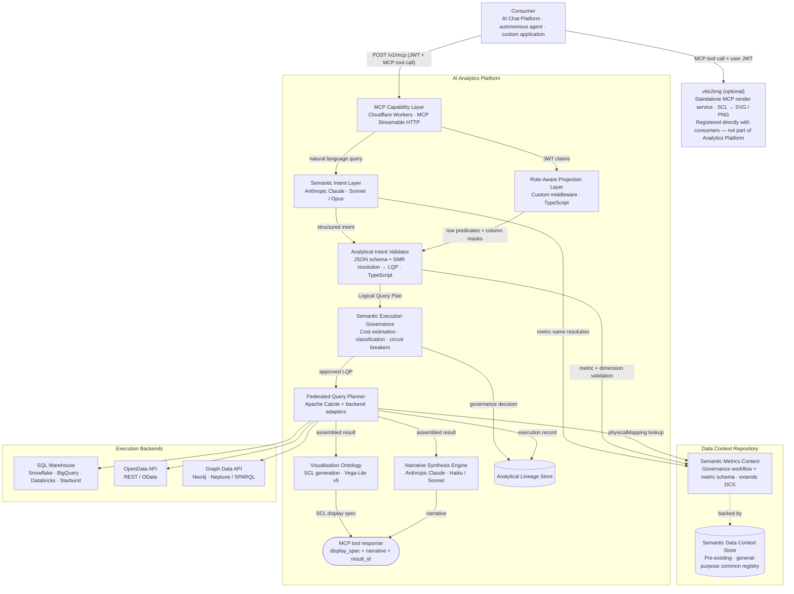

# 17 — Proposed Technical Architecture

One reference implementation of the AI Analytics Platform. Stack choices are concrete but not prescriptive — the product specification is intentionally stack-agnostic. Any conformant implementation that satisfies the specified behaviours, governance guarantees, and interface contracts is valid. Technology substitutions at any layer require no changes to the product spec.

This document assumes the existence of a **Semantic Data Context Store (DCS)** — a pre-existing platform component that maintains the authoritative store of semantic definitions across the organisation. The Analytics Platform extends the DCS to also manage analytical metric definitions, making the DCS the single authoritative source for the SMR rather than introducing a separate definition store.

---

## Architecture overview



---

## Pre-existing components

### Semantic Data Context Store (DCS)

The Analytics Platform registers metric definitions as a new `analytical_metric` type in the DCS, reusing its versioned storage, full-text search, cross-definition relationships, and tenant-scoped access control. The SMR layer adds the governance workflow (proposed → approved → deprecated), metric-specific schema validation, and the Admin API surface. When a metric transitions to `approved`, the canonical definition is written to the DCS; the Analytical Intent Validator reads from the DCS at query time.

#### DCS extension schema (governance tracking — platform-owned PostgreSQL)

```sql
CREATE TABLE analytics.smr_governance (
  id            UUID        PRIMARY KEY DEFAULT gen_random_uuid(),
  tenant_id     TEXT        NOT NULL,
  dcs_def_id    TEXT        NOT NULL,  -- DCS definition document ID
  metric_id     TEXT        NOT NULL,  -- stable identifier, e.g. "portfolio_return"
  version       INT         NOT NULL,
  status        TEXT        NOT NULL,  -- "proposed" | "approved" | "deprecated"
  source        TEXT        NOT NULL DEFAULT 'tenant',  -- "reference" | "tenant"
  created_by    TEXT        NOT NULL,
  approved_by   TEXT,
  approved_at   TIMESTAMPTZ,
  created_at    TIMESTAMPTZ NOT NULL DEFAULT now(),
  superseded_at TIMESTAMPTZ,
  CONSTRAINT uq_smr_version UNIQUE (tenant_id, metric_id, version)
);

-- One approved version per metric per tenant at any time
CREATE UNIQUE INDEX idx_smr_one_approved
  ON analytics.smr_governance (tenant_id, metric_id)
  WHERE status = 'approved';
```

#### Metric definition document (stored in DCS as `type: "analytical_metric"`)

```json
{
  "dcsType":     "analytical_metric",
  "metricId":    "portfolio_return",
  "version":     2,
  "displayName": "Portfolio Return",
  "description": "Time-weighted return for the portfolio over the selected period, expressed as a percentage.",
  "category":    "performance",
  "dataAffinity": ["portfolio"],
  "formula": {
    "type":        "time_weighted_return",
    "inputs":      ["daily_return", "market_value"],
    "aggregation": "chain_link"
  },
  "dimensions": [
    { "id": "portfolio",   "required": true  },
    { "id": "date",        "required": true  },
    { "id": "asset_class", "required": false },
    { "id": "currency",    "required": false }
  ],
  "timePeriods": ["day","week","month","quarter_to_date","year_to_date","trailing_12m"],
  "physicalMapping": {
    "backendId":   "snowflake-primary",
    "table":       "fact_portfolio_daily",
    "valueColumn": "portfolio_return",
    "dateColumn":  "price_date",
    "joinKeys":    { "portfolio": "portfolio_id" }
  },
  "formatting": { "unit": "percent", "decimalPlaces": 2, "suffix": "%" },
  "governance": {
    "costWeight":          1.0,
    "classificationLevel": "internal",
    "entitledRoles":       ["portfolio_manager", "analyst", "risk_officer"],
    "complianceNotes":     "For MiFID II cost disclosure use cost_adjusted_return."
  },
  "narrativeTemplate": "{{portfolio_name}} returned {{value}}% {{period_label}}, {{direction}} its benchmark by {{tracking_error}}%.",
  "aliases": ["return", "twr", "portfolio_twr"],
  "tags":    ["performance", "core", "reference-model"]
}
```

---

## Layer-by-layer stack decisions

### Platform Admin API

| Decision | Choice | Rationale |
|----------|--------|-----------|
| **Runtime** | Node.js (Express / Fastify) on Kubernetes | Low-frequency, latency-tolerant operations; standard service pattern suits complex admin workflows better than edge deployment |
| **Auth** | JWT with `platform_admin` or `app_admin` role claim | Reuses platform JWT infrastructure; validated at API gateway |
| **API style** | REST (JSON) | Admin operations map cleanly to CRUD on named resources |
| **Data store** | PostgreSQL (shared primary database) | Co-located with lineage store and SMR; shared RLS tenant isolation |

---

### Admin Console

| Decision | Choice | Rationale |
|----------|--------|-----------|
| **Framework** | React + TypeScript (SPA) | Rich ecosystem for YAML editors, form handling, and data tables |
| **Hosting** | CDN (Cloudflare Pages or S3 + CloudFront) | No SSR requirement |
| **YAML editor** | Monaco Editor | VS Code engine; built-in YAML validation; familiar to SMR authors |
| **Auth** | Same JWT as Platform Admin API | No separate session management |

---

### Data Source Catalog

| Decision | Choice | Rationale |
|----------|--------|-----------|
| **Storage** | PostgreSQL (`analytics.execution_backends`) | Strongly-typed; shares RLS tenant isolation |
| **Runtime access** | In-memory cache in FQP (refreshed on `CATALOG_UPDATED` message queue event) | Eliminates per-query database round-trips |
| **Change propagation** | `CATALOG_UPDATED` published by Admin API on any catalog change | Decouples Admin API from FQP |

`analytics.execution_backends` — registered backend config: id, type (`sql_warehouse` | `semantic_layer` | `opendata_api` | `graph_api` | `olap_engine` | `custom`), connection config (secret_ref only), data_affinity array (GIN-indexed), priority, enabled flag.

Backend registration (`POST /v1/backends`) specifies `backendId`, `backendType`, `dataAffinity` array, `priority`, and a `config` object holding dialect, connection params, and a `secret_ref` (vault reference — credentials are never stored in plaintext). The FQP filters by `data_affinity @> ARRAY[requiredAffinity]` and selects the lowest-priority healthy backend at query time.

---

### MCP Capability Layer

| Decision | Choice | Rationale |
|----------|--------|-----------|
| **Runtime** | Cloudflare Workers | Sub-10ms cold start; global anycast |
| **Protocol** | MCP Streamable HTTP | Standard MCP interoperability; supports request/response and streaming |
| **Auth** | JWT validation at edge | Stateless; validated before any platform computation |

| Alternative | Why not chosen |
|------------|---------------|
| AWS Lambda + API Gateway | Higher cold start; regional by default |
| Fastly Compute@Edge | Viable; less mature ecosystem |
| Traditional Node.js server | Operational overhead; wrong pattern for an edge API |

`analyse_metric` accepts: `metrics` (required, array of SMR metric IDs), `dimensions` (array of dimension IDs), `time` (period enum or custom date range), `filters` (dimension/operator/values), `sort` (metric + direction), `limit` (1–1000, default 100).

---

### Semantic Intent Layer

| Decision | Choice | Rationale |
|----------|--------|-----------|
| **Provider** | Anthropic Claude | Strong instruction following and tool-use reliability for constrained analytical domains |
| **Intent resolution** | Sonnet | Good speed/accuracy balance for metric name resolution |
| **Complex queries** | Opus | Multi-metric attribution and ambiguous intent |

---

### Semantic Metrics Registry (SMR)

| Decision | Choice | Rationale |
|----------|--------|-----------|
| **Definition storage** | DCS (pre-existing) | Metric definitions live alongside data definitions in the common registry; no duplicate semantic store |
| **Governance tracking** | PostgreSQL (`analytics.smr_governance`) | Lightweight approval workflow state owned by the platform; the DCS does not manage approval workflows |
| **Runtime reads** | Direct DCS API query by Analytical Intent Validator | Definitions read from the authoritative source at resolution time |
| **Search** | DCS native search index | `list_metrics` queries DCS directly; no separate search infrastructure needed |

---

### Financial Services Reference Model

| Decision | Choice | Rationale |
|----------|--------|-----------|
| **Packaging** | Versioned YAML bundles (one per domain) | Human-readable; idempotently importable; selective per-domain activation |
| **Distribution** | Bundled at installation; updatable from Semantic Registry Service | Air-gapped deployments supported |
| **Activation** | `analyticalDomain` config triggers SMR import at tenant setup | Bundles import as `proposed`; Application Admin approves before metrics become resolvable |
| **Customisation** | Full edit/override via Admin API after import | Customised definitions marked `source: "tenant"` |

YAML bundle structure mirrors the metric definition JSON in the DCS section above, with one entry per metric. The `risk` domain bundle includes `var_95`, `var_99`, `expected_shortfall`, `beta`, `duration`, `convexity`. The `regulatory` bundle (`lcr`, `nsfr`, `leverage_ratio`) uses `classificationLevel: restricted` with regime-specific compliance metadata.

---

### Analytical Intent Validator and LQP Generator

No custom query language. The MCP tool call JSON (metric IDs, dimension IDs, time period, filters) is the analytical intent representation — consistent with Cube.js and MetricFlow conventions. The validator performs JSON schema validation + SMR resolution + LQP generation.

| Decision | Choice | Rationale |
|----------|--------|-----------|
| **Intent format** | MCP tool call JSON | Standard AI tool-use format; no separate language needed |
| **Implementation** | TypeScript (JSON schema + SMR resolution) | Lightweight; no grammar or parser required |
| **LQP format** | Custom DAG (JSON) | Engine-agnostic across SQL, OpenData, and Graph backends |

#### MCP input → LQP transformation

```json
// Input: MCP tool call
{
  "tool": "analyse_metric",
  "input": {
    "metrics":    ["portfolio_return", "tracking_error"],
    "dimensions": ["portfolio"],
    "time":       { "period": "quarter_to_date", "as_of_date": "2026-05-14" },
    "filters":    [{ "dimension": "portfolio", "operator": "in", "values": ["GLOB_EQ_OPP", "UK_CORE_INC"] }],
    "sort":       [{ "metric": "portfolio_return", "direction": "desc" }]
  }
}
```

The validator resolves metric IDs against the SMR, injects role predicates, and emits an engine-agnostic LQP (DAG of analytical operations, no backend-specific syntax). The LQP carries resolved `physicalMapping` references, time range expansion, role-injected filters, and a cost estimate for governance validation.

---

### Role-Aware Projection Layer

| Decision | Choice | Rationale |
|----------|--------|-----------|
| **Implementation** | Custom middleware (TypeScript) | Thin and stateless; operates on the LQP before any backend query is generated |
| **Role resolution** | JWT claim extraction + PostgreSQL role config | Role claim field name is configurable per tenant (`entitlements.roleClaimField`) |
| **Row predicates** | `{{user.claim_name}}` template interpolation at LQP build time | Resolved from JWT claims; injected into LQP `filters` |
| **Column masking** | Applied post-assembly in FQP result assembler | Post-assembly supports cross-backend result sets |
| **Default policy** | `defaultDenyAll: true` | No access unless a matching role is found |

`analytics.role_policies` — per-tenant role config: role_name (matches JWT claim), allowed_metrics (NULL = all), denied_metrics (takes precedence), row_predicates JSONB (template strings), column_masks JSONB (suppression rules).

#### Role policy example

```json
{
  "roleId":   "regional_analyst",
  "tenantId": "acme-wealth",
  "allowedMetrics": null,
  "deniedMetrics":  ["var_99", "expected_shortfall"],
  "rowPredicates": {
    "portfolio": "portfolio_id IN ({{user.managed_portfolios}})",
    "entity":    "legal_entity_id IN ({{user.entity_ids}})"
  },
  "columnMasks": {
    "aum": {
      "condition":   "{{user.roles}} NOT CONTAINS 'senior_analyst'",
      "action":      "suppress",
      "replacement": null
    }
  }
}
```

A `regional_analyst` with `managed_portfolios: ["GLOB_EQ_OPP"]` has `portfolio_id IN ('GLOB_EQ_OPP')` injected as a filter. The FQP sees only the resolved predicate, never the source claim.

---

### Semantic Execution Governance

| Decision | Choice | Rationale |
|----------|--------|-----------|
| **Implementation** | Custom rules engine (TypeScript) | Deterministic; config-driven; no ML inference |
| **Cost estimation** | `Σ(metric.costWeight × dimensionCardinality × timeRangeMultiplier)` | Pre-execution; calibrated against actual cost data |
| **Circuit breaker** | Per-request ceiling + per-user hourly budget | Hard ceiling prevents runaway queries |
| **Config store** | PostgreSQL (`analytics.governance_config`) | Per-tenant thresholds; not hardcoded |

`analytics.governance_config` — per-tenant thresholds: cost_ceiling_per_query (default 2000), cost_budget_per_user_hourly (default 10000), max_concurrent_queries (default 20), max_metrics_per_query (default 10), max_dimensions (default 5), classification_gate, compliance_modes array.


---

### Federated Query Planner (FQP)

| Decision | Choice | Rationale |
|----------|--------|-----------|
| **Plan optimiser** | Apache Calcite | Battle-tested SQL plan optimisation; used by Trino, Flink, Beam |
| **Backend adapters** | Custom adapter per backend type | Calcite handles SQL; custom adapters cover REST/OpenData/GraphQL/SPARQL |
| **Result assembly** | Custom (TypeScript) | Simple fan-out/fan-in; no off-the-shelf library needed |

The FQP splits the LQP by `dataAffinity`, assigns each sub-plan to the matching registered backend, translates to the backend's native protocol (SQL, OData, SPARQL, etc.), fans out execution in parallel, and assembles results by `join_keys`. Each execution backend implements a two-method adapter contract: `ping()` for health checking and `executeSubPlan()` for receiving a sub-plan fragment and returning a typed result set.

---

### Execution backends (supported adapters)

| Backend type | Adapter | Protocols |
|-------------|---------|-----------|
| **SQL warehouse** | Calcite SQL adapter | Snowflake, BigQuery, Databricks, Redshift, Trino, Starburst Enterprise, PostgreSQL |
| **Semantic layer** | Semantic layer adapter | dbt Semantic Layer (MetricFlow), Cube.js |
| **OpenData API** | REST/OData adapter | REST JSON, OData v4, SOAP (via shim) |
| **Graph Data API** | Graph adapter | Neo4j Bolt, Amazon Neptune SPARQL, OpenCypher REST |
| **OLAP engine** | OLAP adapter | Apache Druid, ClickHouse, Pinot |
| **Custom** | Custom adapter interface | Any backend conforming to `FQPBackendAdapter` |

---

### Ecosystem complementary services

| Service | Integration | Implementation |
|---------|------------|----------------|
| **Semantic Registry Service** | Config-time — `POST /v1/smr/import` | REST client in Platform Admin API |
| **Regulatory Reference Service** | Runtime backend (`dataAffinity: ["regulatory"]`) | OpenData API FQP adapter |
| **Benchmark Data Service** | Runtime backend (`dataAffinity: ["benchmarks"]`) | OpenData API FQP adapter |

Both runtime services are routed via `dataAffinity` matching with no FQP special-casing. On unavailability the FQP falls back to the next registered backend or returns a partial result with a structured warning. Benchmark Data Service licensing errors propagate as `BENCHMARK_NOT_LICENSED` sub-plan failures.

---

### Visualisation Ontology — SCL

| Decision | Choice | Rationale |
|----------|--------|-----------|
| **Chart spec** | Vega-Lite v5 JSON | Industry-standard chart grammar; wide ecosystem for web, server-side, and image rendering |
| **Table spec** | Platform-defined `type: "table"` extension | Vega-Lite has no native table mark; same `data` + `columns` convention |
| **SCL abstraction** | "Semantic Charting Language (SCL)" | Decouples product spec from the format library |

| Alternative | Why not chosen |
|------------|---------------|
| Plotly JSON | Larger spec; less portable to SSR environments |
| Apache ECharts | Less standard outside enterprise BI |
| Observable Plot | Less mature; smaller SSR ecosystem |
| Custom schema | Vega-Lite is widely understood and tooled |

SCL format examples are shown in [00-overview.md](./00-overview.md#headless-by-design). Full spec is defined in [07-visualization-ontology.md](./07-visualization-ontology.md).

---

### Static image rendering (vite2img)

vite2img is a **standalone MCP render service** — it is not part of the AI Analytics Platform. Consumers that need static image output (the AI Chat Platform for PDF/export workflows, agentic report pipelines) register vite2img as a peer MCP server alongside the Analytics Platform, using the same `mcpServers` registration pattern. It receives a `display_spec` JSON object directly from the consumer and returns SVG or PNG. It has no connection to the Analytics Platform's governance pipeline.

| Decision | Choice | Rationale |
|----------|--------|-----------|
| **Integration pattern** | Standalone MCP server registered directly with consumers | Keeps rendering concerns outside the Analytics Platform; consumers decide when to call it |
| **Implementation** | Vite + vega-embed + headless Chromium (Playwright) | Pixel-accurate SVG/PNG from Vega-Lite specs; handles charts and tables |
| **Table rendering** | Custom HTML template | Styled HTML table via Playwright screenshot |

---

### Consumer-side rendering

| Consumer | Chart | Table | Static image |
|---------|-------|-------|------|
| AI Chat Platform | vega-embed | Native data table | vite2img (direct MCP call) |
| Custom UI | vega-embed (recommended) or any Vega-Lite-compatible library | Host's own grid | vite2img |
| Agentic consumers | vite2img | vite2img | vite2img |


---

### Narrative Synthesis Engine

| Decision | Choice | Rationale |
|----------|--------|-----------|
| **Provider** | Anthropic Claude | Consistent with intent layer; strong constrained prose |
| **Default tier** | Haiku | Low-latency; sufficient quality for narrative prose |
| **Complex narratives** | Sonnet | Multi-portfolio attribution; complex regulatory narratives |

---

### Analytical Lineage Store

| Decision | Choice | Rationale |
|----------|--------|-----------|
| **Lineage records** | PostgreSQL | Structured; queryable; ACID audit integrity |
| **Result artefacts** | S3-compatible object storage | Large result sets stored as blobs; referenced by URL |
| **Retention** | Default 7 years (configurable per compliance mode) | MiFID II and equivalent regimes |

#### `analytics.lineage_records` (DDL)

```sql
CREATE TABLE analytics.lineage_records (
  result_id            TEXT        PRIMARY KEY,       -- e.g. "res_20260514_093247_a1b2c3"
  tenant_id            TEXT        NOT NULL,
  user_sub             TEXT        NOT NULL,          -- JWT sub claim
  lqp_id               TEXT        NOT NULL,
  fqp_execution_id     TEXT,                          -- null on cache hit
  cache_hit            BOOLEAN     NOT NULL DEFAULT FALSE,
  request_payload      JSONB       NOT NULL,          -- full MCP tool call input
  resolved_metrics     JSONB       NOT NULL,          -- metric IDs + versions
  governance_decision  JSONB       NOT NULL,
  sub_plans            JSONB,                         -- FQP execution records per sub-plan
  result_summary       JSONB       NOT NULL,          -- latency, cost, row count
  error_code           TEXT,
  compliance_mode      TEXT,                          -- "mifid2" | "basel3" | "sec_reg_bi" | null
  compliance_meta      JSONB,
  result_artefact_url  TEXT,                          -- S3 URL; null for small/cached results
  created_at           TIMESTAMPTZ NOT NULL DEFAULT now(),
  expires_at           TIMESTAMPTZ NOT NULL
);

CREATE INDEX idx_lineage_tenant_user ON analytics.lineage_records (tenant_id, user_sub, created_at DESC);
CREATE INDEX idx_lineage_tenant_time ON analytics.lineage_records (tenant_id, created_at DESC);
CREATE INDEX idx_lineage_compliance  ON analytics.lineage_records (tenant_id, compliance_mode) WHERE compliance_mode IS NOT NULL;
```

Lineage records are immutable. Post-hoc compliance annotations are written to `analytics.lineage_amendments` referencing the original `result_id`.

---

## Infrastructure

| Component | Choice | Rationale |
|-----------|--------|-----------|
| Edge runtime | Cloudflare Workers | Global low-latency MCP surface |
| Backend services | Kubernetes (cloud-agnostic) | FQP, governance, SMR as independently scalable pods |
| Primary database | PostgreSQL (Neon or RDS) | SMR, lineage, tenant config, governance config |
| Search | Elasticsearch / OpenSearch | SMR metric search index |
| Object storage | S3-compatible | Result artefacts, large cached result sets |
| Message queue | SQS / Pub/Sub | Async lineage writes, catalog change events |
| Secrets | HashiCorp Vault or cloud-native | Backend credentials, platform service keys |

