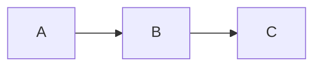

# 06 — Interface and Content Rendering

**Product:** AI Chat Platform  
**Version:** 1.0  
**Date:** 2026-06-16  
**Author:** Andrew Bush / M&A Operating System

---

## Interaction design

### Component structure

The AI Chat Platform is delivered as an `<ai-chat>` web component that host applications embed within their own UI. The component owns a **three-zone layout** inside its mounting point. The host application retains full ownership of its own navigation, header, and surrounding UI — the component does not attempt to replace or extend the host UI beyond its mounting point.

| Zone | Location within component | Contents |
|------|--------------------------|---------|
| **History panel** | Left sidebar | Conversation list — **My Conversations** and **Shared With Me** (reverse-chronological); conversation search; pinned conversations; new conversation button; workflow library access |
| **Conversation area** | Centre — primary | Message thread, streaming responses, rendered content, input area |
| **Conversation panel** | Right sidebar | **Canvas** (active when a document is open for iteration); attachments and artefacts; participant list and share management; session token summary |

#### Desktop layout (≥ 1280px)

```
┌─────────────────────────────────────────────────────────────┐
│                    <ai-chat> component                       │
├─────────────┬───────────────────────────┬────────────────────┤
│ History     │                           │ Conversation panel │
│             │    Conversation area      │                    │
│ [🔍 Search]│                           │ Canvas  Artefacts  │
│             │  ┌─────────────────────┐  │ Participants    ∑  │
│ ▾ My Convs │  │ 🔧 Tool call card   │  ├────────────────────┤
│   — Today   │  └─────────────────────┘  │                    │
│   Conv 1    │  ┌─────────────────────┐  │  [Active canvas    │
│   Conv 2    │  │ Assistant response  │  │   or artefact      │
│   — Yesterday│  │ [👍][👎][↻][⎘]  │  │   panel content]   │
│   Conv 3    │  └─────────────────────┘  │                    │
│             │                           │ — Artefacts —      │
│ ▾ Shared   │  ┌─────────────────────┐  │  📄 report.pdf     │
│   Conv A    │  │ User message bubble │  │  📊 chart.xlsx     │
│             │  └─────────────────────┘  │                    │
│ [Workflows] ├───────────────────────────┤  14 turns · 18 k  │
│             │ 📎 ⚙ [✦ Standard][→]   │                    │
└─────────────┴───────────────────────────┴────────────────────┘
```

#### Why three zones (not four)

The platform component owns three zones inside its mounting point. The host application manages its own navigation independently — the `<ai-chat>` component occupies its mounting point only, making it embeddable anywhere in the host layout: a full page, a side panel, or a modal drawer.

#### History panel

```
┌──────────────────────────┐
│ My Conversations    [+ ] │  ← New conversation
├──────────────────────────┤
│ [🔍 Search conversations]│
├──────────────────────────┤
│ 📌 Pinned                │
│   Q2 Governance Review   │
├──────────────────────────┤
│ Today                    │
│ ▶ Finance domain audit   │  ← Active (highlighted)
│   Onboarding checklist   │
├──────────────────────────┤
│ Yesterday                │
│   Payment service SLOs   │
│   Team standup recap     │
├──────────────────────────┤
│ Past 7 days              │
│   Policy gap analysis    │
├──────────────────────────┤
│ Past 30 days             │
│   Data quality review    │
├──────────────────────────┤
│ Shared With Me           │
│   Team review session ③  │  ← Unread badge
├──────────────────────────┤
│ [⚡ Workflows]           │
└──────────────────────────┘
```

#### Workflow Library

The Workflow Library is accessible via a **Workflows** button in the history panel header. It slides in as a panel over the history list — it is not part of the right sidebar, which is reserved for conversation-specific content.

When clicked, a workflow from the library opens a parameter form (if the workflow has parameters) before injecting the prompt into the input field.

```
┌──────────────────────────────────────┐
│ ⚡ Workflow Library          [ × ]   │
├──────────────────────────────────────┤
│ [🔍 Search workflows…]               │
├──────────────────────────────────────┤
│ ⚡ Governance Health Check           │
│   Summarise coverage and quality     │
│   gaps across a selected domain. [→] │
├──────────────────────────────────────┤
│ 📅 Weekly Status Report              │
│   Generate a plain-language weekly   │
│   summary for a team.           [→]  │
├──────────────────────────────────────┤
│ 📋 Policy Compliance Scan            │
│   Review entities against active     │
│   policies.                     [→]  │
└──────────────────────────────────────┘
```

Selecting a workflow with parameters opens a parameter form before launch:

```
┌──────────────────────────────────────┐
│ ← Governance Health Check            │
├──────────────────────────────────────┤
│ Summarise governance coverage,       │
│ quality gaps, and policy compliance  │
│ across a selected domain.            │
├──────────────────────────────────────┤
│ Data Domain *                        │
│ ┌──────────────────────────────────┐ │
│ │ @{Finance Domain}              × │ │  ← @-binding typeahead
│ └──────────────────────────────────┘ │
├──────────────────────────────────────┤
│             [Launch workflow →]      │
└──────────────────────────────────────┘
```

#### Conversation panel (right sidebar) detail

The right panel is scoped entirely to the **active conversation** and switches between two primary modes via a tab strip at the top:

| Tab | Contents | When active |
|-----|---------|-------------|
| **Canvas** | The active working document — editable, versioned, iteratable | Whenever a canvas document is open in the conversation |
| **Attachments & Artefacts** | All input documents and output artefacts in submission order | Always available |
| **Participants** | Participant list (shared conversations); invite control; leave / remove actions | Always available |
| **Session summary** | Running token totals (`14 turns · 18,430 tokens`) with tooltip expanding to input / output / cached breakdown | Always available |

When a canvas document is opened, the panel automatically switches to the **Canvas** tab. Switching to another tab does not close the canvas — the document remains active and the model retains its context.

---

### Responsive and mobile design

Mobile-first and responsive layout is a core platform standard. The following covers layout behaviour at each breakpoint when the component is mounted at full-page width.

| Viewport | Layout |
|----------|--------|
| Desktop (≥ 1280px) | Full three-zone layout — history panel + conversation area + conversation panel |
| Desktop narrow (1024px – 1279px) | History panel collapses to icon-only rail; conversation panel remains |
| Tablet (768px – 1023px) | Both panels become slide-in drawers; conversation area is primary |
| Mobile (< 768px) | Single-column; history and conversation panels as bottom-sheet drawers; input pinned to bottom |

When the component is mounted in a constrained container (e.g. a side panel or modal), it uses the container width rather than viewport width to determine layout breakpoints. See [07-embedding-and-integration.md](./07-embedding-and-integration.md) for container sizing guidance.

#### Narrow desktop layout (1024px – 1279px)

The history panel collapses to an icon-only rail. Hovering an icon reveals its label tooltip; clicking a conversation icon opens it.

```
┌─────────────────────────────────────────────────────────────┐
│                    <ai-chat> component                       │
├──────┬────────────────────────────────┬──────────────────────┤
│  ☰   │                                │ Conversation panel   │
│  🔍  │     Conversation area          │                      │
│  ─── │                                │ Canvas  Artefacts    │
│  ●   │  ┌──────────────────────────┐  │ Participants    ∑    │
│  ●   │  │ Assistant response       │  ├──────────────────────┤
│  ─── │  │ [👍][👎][↻][⎘]         │  │                      │
│  ●   │  └──────────────────────────┘  │  [Panel content]     │
│  ─── │  ┌──────────────────────────┐  │                      │
│  ●   │  │ User message             │  │                      │
│  ─── ├──────────────────────────────────┤                    │
│  ⚡  │ 📎 ⚙ [✦ Standard][input][→]│                      │
└──────┴──────────────────────────────────┴──────────────────────┘
     Icon rail — hover to label, click to expand
```

#### Tablet layout (768px – 1023px)

Both panels become slide-in drawers triggered by header buttons. The conversation area is the primary view.

```
┌──────────────────────────────────────────────────┐
│                <ai-chat> component                │
├──────────────────────────────────────────────────┤
│  [☰ History]                      [⊞ Panel]     │  ← Drawer triggers in header
├──────────────────────────────────────────────────┤
│                                                  │
│         Conversation area                        │
│                                                  │
│  ┌────────────────────────────────────────────┐  │
│  │ Assistant response                         │  │
│  │ [👍][👎][↻][⎘]                           │  │
│  └────────────────────────────────────────────┘  │
│  ┌────────────────────────────────────────────┐  │
│  │ User message bubble                        │  │
│  └────────────────────────────────────────────┘  │
│                                                  │
├──────────────────────────────────────────────────┤
│ 📎 ⚙ [✦ Standard]  [input…]             [→]    │
└──────────────────────────────────────────────────┘
  Slide-in drawers — swipe from edge or tap header button
```

#### Mobile layout (< 768px)

Single-column; history and conversation panels as full-height bottom-sheet drawers; input pinned to bottom of screen above the keyboard.

```
┌────────────────────────────────────────┐
│           <ai-chat> component          │
├────────────────────────────────────────┤
│                                        │
│       Conversation area                │
│                                        │
│  ┌──────────────────────────────────┐  │
│  │ Assistant response               │  │
│  │ [👍][👎][↻][⎘]                 │  │
│  └──────────────────────────────────┘  │
│                                        │
│  ┌──────────────────────────────────┐  │
│  │              User message        │  │
│  └──────────────────────────────────┘  │
│                                        │
│  ┌────────────────────────────────┐    │
│  │ Jump to latest ↓               │    │  ← Anchored above input when scrolled
│  └────────────────────────────────┘    │
├────────────────────────────────────────┤
│ 📎 ⚙ ✦ Standard   [input…]     [→]   │  ← Pinned above keyboard
└────────────────────────────────────────┘
  ← swipe right: history panel (bottom sheet)
  ← swipe left:  conversation panel (bottom sheet)
```

#### Mobile-specific requirements

| Requirement | Specification |
|-------------|--------------|
| Input controls | All controls (attachment, tool selection, model chip, send/stop) are thumb-reachable — no controls hidden behind secondary menus on mobile |
| `@`-binding typeahead | Anchors to the bottom of the viewport (not cursor position); sized so the top edge is visible above the raised keyboard |
| Mermaid diagrams | Horizontally scrollable — never scaled to illegibility |
| Vega-Lite charts | `width: "container"` for responsive sizing |
| Data tables | Horizontally scrollable; first column is sticky |
| Conversation panel | Opens as full-height bottom sheet — accessible via a tray icon in the input area footer |
| History panel | Opens as full-height bottom sheet — accessible via a history button |
| Conversation search | Opens as full-screen overlay with keyboard raised |
| Touch targets | Minimum 44 × 44 px (Apple HIG / Material Design) |

#### Input area on mobile

The input toolbar presents all controls in a **single row above the text field**, within thumb reach. When horizontal space is tight, secondary controls (model chip, profile indicator) collapse behind an overflow icon — the paperclip (attachment) and send/stop button are **never** moved to overflow.

| Control | Mobile behaviour |
|---------|----------------|
| Paperclip / attachment | Opens the native mobile file picker (camera roll, Files app, camera capture) |
| Tool selection | Opens a full-screen bottom sheet listing available MCP tools |
| Model chip | Opens a bottom sheet listing allowed models |
| Text input | Grows to 3 lines maximum on mobile (vs. 5 on desktop) |
| Submit | Large dedicated tap target — always visible |

#### Keyboard and viewport behaviour

When the software keyboard raises on mobile, the conversation thread scrolls to keep the latest turn visible above the input area. The input area stays pinned to the top of the keyboard. The `@`-binding typeahead panel appears above the keyboard.

#### Hover states on mobile

| Desktop (hover) | Mobile equivalent |
|----------------|-----------------|
| Report icon appears on hover over a turn | Always visible below each turn |
| Edit icon appears on hover over a user message | Always visible below each user message |
| Assistant response action row appears on hover | Always visible below each assistant response |
| Metadata line appears on hover | Tap the response bubble to reveal; tap again to hide |

#### Gestures

| Gesture | Action |
|---------|--------|
| Swipe right from left edge | Opens the history panel bottom sheet |
| Swipe left from right edge | Opens the conversation panel bottom sheet |
| Long press on a user message | Opens message action menu (edit, report, copy) |
| Long press on an assistant response | Opens response action menu (copy, report, regenerate) |
| Tap a binding chip | Fires `binding-click` event to the host application |
| Pinch-to-zoom on a Mermaid diagram | Enters full-screen diagram view |

---

### Conversation thread anatomy

#### User messages

- Appear immediately in the conversation thread on submit (**optimistic UI**) — the message is visible before the API acknowledges receipt. If the send fails, the message is styled as failed with an inline retry control.
- Right-aligned in a muted bubble
- `@`-binding chips render as interactive pills within the bubble
- In shared conversations: author's name and avatar above the bubble

#### Other participants' messages (shared conversations only)

- Left-aligned
- Distinct colour per participant (derived from host primary brand colour)
- Author name and avatar above the bubble

#### Message timestamps

Every message in the conversation thread carries a **timestamp**.

| Display rule | Format |
|-------------|--------|
| Default | Relative: *"Just now"*, *"3 min ago"*, *"Yesterday"*, *"Mon 09:14"* |
| Hover (desktop) | Absolute: *"Monday 11 May 2026, 09:14:32"* |
| Older than 7 days | Absolute date always shown: *"4 May, 09:14"* |

Timestamps are shown below each message bubble (user and assistant). They are not shown during active streaming — the timestamp appears when streaming completes.

#### Thinking indicator

After the user submits a message and before the first streaming token arrives, the assistant displays a **thinking indicator** in the conversation thread:

```
[AssistantName] is thinking…   ●●●
```

An animated three-dot pulse appears beneath a placeholder response bubble. The indicator is replaced immediately by the first streaming token. If the model is queuing tool calls before generating prose, the thinking indicator transitions to the tool call disclosure card (in-progress state) without a gap.

The thinking indicator is suppressed if the model begins streaming within 300 ms of submission.

#### Full thread anatomy

A complete exchange showing all thread elements in sequence:

```
┌──────────────────────────────────────────────────────────┐
│                    Conversation area                      │
│                                                          │
│  ┌────────────────────────────────────────────────────┐  │
│  │  Show me the governance health for @{Finance       │  │  ← User message bubble
│  │  Domain}                                           │  │    (right-aligned)
│  │                                     Just now  🕐  │  │  ← Timestamp
│  └────────────────────────────────────────────────────┘  │
│                                                          │
│  Atlas is thinking…   ● ● ●                              │  ← Thinking indicator
│                                                          │
│  ┌──────────────────────────────────────────────────┐    │
│  │ 🔧 Governance Platform · get_domain_health  ✓ ▼ │    │  ← Tool call disclosure
│  └──────────────────────────────────────────────────┘    │    (collapsed)
│                                                          │
│  ┌────────────────────────────────────────────────────┐  │
│  │ The Finance Domain is in **good health** overall.  │  │  ← Assistant response
│  │                                                    │  │
│  │ | Metric          | Status   |                     │  │
│  │ | Coverage        | 94 %     |                     │  │
│  │ | Quality score   | 87 / 100 |                     │  │
│  │ | Open issues     | 3        |                     │  │
│  │                                                    │  │
│  │ ¹ Governance Platform · get_domain_health          │  │  ← Inline source citation
│  │                                                    │  │
│  │ ✦ Standard · 1,240 tokens · 3 min ago             │  │  ← Metadata (hover/tap)
│  │ [👍] [👎] [↻ Regenerate] [⎘ Copy]               │  │  ← Feedback row
│  └────────────────────────────────────────────────────┘  │
│                                                          │
│  · What are the open quality issues?                     │  ← Suggested follow-ups
│  · Who owns the Finance domain?                          │
│  · Show me a breakdown by sub-domain                     │
│                                                          │
├──────────────────────────────────────────────────────────┤
│  📎  ⚙  [✦ Standard]  [input…]                   [→]   │
└──────────────────────────────────────────────────────────┘
```

#### Per-turn feedback

**User messages** carry a **report icon** (visible on hover / always visible on mobile). Clicking opens the report dialog:

> **What's wrong with this?**  
> [Text field — optional explanation]  
> [Submit report] &nbsp;&nbsp; [Cancel]

On submit, an improvement signal is captured against the specific turn (see [08-platform-operations.md](./08-platform-operations.md)).

**Assistant responses** carry a feedback row with three controls:

| Control | Desktop | Mobile | Action |
|---------|---------|--------|--------|
| 👍 Thumbs up | Appears on hover | Always visible below the response | Records a positive improvement signal against the turn. One-click — no dialog. Fills on selection; toggleable. |
| 👎 Thumbs down | Appears on hover | Always visible below the response | Opens the report dialog (same as user message report). Records a negative signal on submit. |
| Regenerate | Appears on hover | Always visible below the response | Creates a new branch from this turn (see doc 04). |
| Copy full response | Appears on hover | Always visible below the response | Copies the full response text to clipboard. |

Both thumbs signals feed the improvement pipeline (doc 12). Thumbs up signals are used to identify high-quality turns for reference; thumbs down signals trigger the same improvement signal workflow as the explicit report.

#### Assistant responses

Each assistant response carries:

| Element | Desktop | Mobile |
|---------|---------|--------|
| Metadata line | Appears on hover — model label + token counts + (in shared sessions) submitting user's name | Revealed on tap of the response bubble |
| Feedback row (👍 👎 Regenerate Copy) | Appears on hover | Always visible below the response |
| Artefact chips | *"Added to artefacts ↗"* beneath each generated block | Same |

#### Suggested follow-ups

At the end of each assistant response, up to **three suggested follow-up queries** are presented as pill chips generated by the model. Single-click to submit. Follow-ups are model-generated — not from a static list.

---

### Input area controls

| Control | Function |
|---------|---------|
| Paperclip icon | Opens file picker or accepts drag-and-drop (PDF, Excel, Word, images); images also accepted via clipboard paste |
| Tool selection icon | Opens MCP tool opt-in panel |
| Active model chip | Opens model selection popover |
| Text input | Multi-line, grows to 5 lines, `Cmd/Ctrl + Enter` to submit |
| Profile indicator | Read-only `Style · Verbosity` link to host app profile settings — clickable |
| Send / Stop | Submits message or stops active stream |
| Share icon | Opens participant management panel |

#### Input area layout

```
┌──────────────────────────────────────────────────────────┐
│  @{Finance Domain} What are the quality gaps in this     │  ← Text input
│  domain? Any open ownership issues?                      │    (grows to 5 lines)
├──────────────────────────────────────────────────────────┤
│ 📎  ⚙  [✦ Standard]  [Technical · Concise]  [⇪]  [→]  │  ← Controls row
└──────────────────────────────────────────────────────────┘
  📎 Attachment        — file picker / drag-and-drop / clipboard paste
  ⚙  Tool selection   — opens MCP tool opt-in panel (see below)
  ✦ Standard          — model tier chip; opens model selection popover
  Technical · Concise — profile indicator (style · verbosity); read-only link
  ⇪  Share            — opens participant management panel
  →  Send / Stop      — always visible; submits or stops active stream
```

While streaming, the input field is disabled and the Send button becomes a Stop button:

```
┌──────────────────────────────────────────────────────────┐
│  [input disabled while streaming]                        │
├──────────────────────────────────────────────────────────┤
│ 📎  ⚙  [✦ Standard]  [Technical · Concise]  [⇪]  [■]  │  ← ■ Stop
└──────────────────────────────────────────────────────────┘
```

#### Tool selection panel

Opened via the ⚙ icon in the input area:

```
┌──────────────────────────────────────┐
│ Tools                         [ × ]  │
├──────────────────────────────────────┤
│ Always active                        │
│                                      │
│  ● Governance Platform               │
│    Entities, quality, policies       │
│    [Always on — cannot be disabled]  │
├──────────────────────────────────────┤
│ Available for this session           │
│                                      │
│  ○ Data Warehouse        [Enable →]  │
│    Read-only warehouse access        │
│                                      │
│  ○ Web Search            [Enable →]  │
│    Real-time web results             │
│                                      │
│  ○ Platform Resources    [Enable →]  │
│    Shared skills and templates       │
└──────────────────────────────────────┘
  Enabled tools are active for this session only.
  Settings reset on the next session.
```

---

### Session artefact tray

The artefact tray accumulates every input and output artefact produced during a conversation. It persists for the full lifetime of the conversation record.

#### Artefact classes

| Class | Direction | Examples |
|-------|-----------|---------|
| Attached document | Input | PDF report, Excel extract, Word document |
| Generated document | Output | Markdown report, summary |
| Mermaid diagram | Output | Relationship diagram, flow, sequence |
| Vega-Lite chart | Output | Bar chart, trend line, distribution |
| Data table | Output | Multi-row query result (CSV) |
| JSON export | Output | Tool result or entity record |
| Code block | Output | SQL, Python, YAML, shell |
| Binding reference | Input | Non-downloadable — reference card linking to the host application object |

#### Tray entry anatomy

Each tray entry shows:
- Format icon
- Auto-generated name: `[Content type] — [Subject] — [Date]`
- Turn back-link (click to jump to the source turn)
- Direction label (Input / Output)
- Download button
- Preview link

Users may **rename** tray entries. A **"Download all"** control packages all artefacts as a zip archive.

Canvas documents in the artefact tray carry an additional **"Open in canvas"** action that re-opens the document in the canvas panel for further editing, regardless of which turn produced it.

---

### Document canvas

The canvas is the platform's working-document surface — a persistent, editable panel where the model and user collaborate iteratively on a document across multiple turns, rather than treating each AI response as a disposable message.

#### What opens in canvas

The model uses a ` ```document ` fenced block to produce canvas-eligible output. The platform's non-overridable system prompt layer instructs the model to use `document` blocks for substantial, document-like prose outputs — reports, summaries, plans, policy drafts, specifications, structured analyses — where the user is likely to want to refine rather than simply read and move on.

Non-prose outputs (Mermaid diagrams, Vega-Lite charts, data tables, code blocks, JSON) remain as inline thread content and artefact tray entries. They do not open in canvas.

Users may also manually promote any text artefact in the tray to canvas by clicking **"Open in canvas"** on that tray entry.

#### Canvas panel layout

```
┌─────────────────────────────────────────┐
│ [Document title — editable]    v3  [ ↗ ]│  ← Header: title + version + full-screen
├───────────────────────────────────────┬─┤
│ [Toolbar: Edit | Copy | Download]     │ │
├───────────────────────────────────────┤ │
│                                       │ │
│  The canvas document content renders  │ │
│  here as styled markdown. In Edit     │ │
│  mode, becomes a live text editor.    │ │
│                                       │ │
│                                       │ │
└───────────────────────────────────────┴─┘
```

| Element | Behaviour |
|---------|----------|
| **Document title** | Auto-generated from document content; editable inline by clicking |
| **Version indicator** | Shows current version (v1, v2 …); clicking opens a version history dropdown listing every model-generated and user-edited version with timestamp. Selecting a prior version restores it as a new version (no destructive overwrites). |
| **Full-screen toggle** | Expands canvas to fill the component mount point; the conversation area collapses to a narrow strip. Second click restores the split layout. |

#### Canvas full-screen layout

```
┌───────────────────────────────────────────────────────────────┐
│                      <ai-chat> component                       │
├────────────────────────────────────────────────────────┬───────┤
│ [Document title — editable]     v3  [Edit][Copy][↙]×  │ [msg] │
├────────────────────────────────────────────────────────┤  ···  │
│                                                        │ [msg] │
│   Full-width canvas document — headings, prose, and    │       │
│   tables render at full canvas width.                  │ [msg] │
│                                                        │       │
│   Section heading                                      │       │
│   ───────────────                                      │       │
│   Body text renders here with full line length.        │ [inp] │
│   | Col A | Col B |   ← tables at full width          │  [→]  │
│   | ───── | ───── |                                   │       │
│   | val 1 | val 2 |                                   │       │
│                                                        │       │
└────────────────────────────────────────────────────────┴───────┘
  ↙ collapses back to split layout    × closes canvas
```

#### Canvas version history

Clicking the version indicator (e.g. **v3**) opens a dropdown listing every version of the document:

```
┌────────────────────────────────────────────┐
│ [Document title — editable]     v3   [ ↗ ] │
│                           ┌──────────────┐  │
│  [Toolbar]                │ ● v3 · 09:14 │  │  ← Current version
│                           │   Model rev. │  │
│  Document content         │   v2 · 08:52 │  │  ← User edit
│  renders here.            │   User edit  │  │
│                           │   v1 · 08:47 │  │  ← Initial output
│                           │   Initial    │  │
│                           │              │  │
│                           │ [Restore v2] │  │
│                           └──────────────┘  │
└────────────────────────────────────────────┘
  Restoring a prior version creates a new version — no destructive overwrite.
```
| **Edit mode** | Clicking **Edit** transforms the canvas from a read-only rendered view into a live markdown editor. User edits are saved immediately as a new version. Exiting edit mode re-renders the markdown. |
| **Copy** | Copies the full markdown source to the clipboard |
| **Download** | Downloads the document as `.md` (default), `.txt`, or `.pdf` (platform-rendered) |

#### In-thread reference card

When the model produces a `document` block, the conversation thread shows a compact **reference card** in place of the full content:

```
┌────────────────────────────────────────┐
│ 📄  Q2 Governance Summary              │
│     Report · 1,240 words               │
│                           [Open canvas →] │
└────────────────────────────────────────┘
```

The full document is in the canvas panel — it is not rendered inline in the thread. This keeps the conversation thread scannable and avoids large content blocks interrupting the exchange.

#### Model-assisted revision

When a canvas document is open, the platform automatically includes the current canvas content in the model's context:

```
[Canvas document — Q2 Governance Summary]
{full document markdown}
[End canvas document]
```

The user can ask the model to revise the document in natural language: *"Shorten the executive summary to two sentences"*, *"Add a risks section after the findings"*, *"Rewrite this in a more formal tone"*. The model responds with a new `document` block containing the full revised document, which replaces the canvas content and is saved as a new version. The model's reply in the conversation thread confirms what changed: *"Updated — shortened the executive summary and added a risks section."*

#### Multiple canvases

A conversation may produce more than one canvas document. Each is a separate tab within the canvas panel, ordered by creation time. The active tab is the most recently updated document.

```
┌──────────────────────────────────────────┐
│ Q2 Governance Summary │ Risk Register  ▾ │  ← Canvas tabs (+ overflow menu)
├──────────────────────────────────────────┤
│ [Edit] [Copy] [Download]         v3 [ ↗] │
├──────────────────────────────────────────┤
│                                          │
│  Q2 Governance Summary content           │
│  (active tab)                            │
│                                          │
└──────────────────────────────────────────┘
  Switching tabs does not close the inactive canvas — both remain in context.
```

#### Canvas in Mode 1 (floating widget)

The canvas panel is only available in **full state**. In the mini state, canvas documents show as reference cards in the thread with an *"Expand for canvas view ↗"* note. Transitioning to full state opens the canvas panel for the active document.

#### Canvas and the artefact tray

All canvas document versions are stored in the artefact tray as versioned entries. The tray shows the latest version with a version count badge (e.g. `v4`). Individual versions are downloadable from the version history dropdown in the canvas panel.

---

### Returning user state

#### Mode 2 — Inline Page (`<ai-chat>`)

When the component mounts and the authenticated user has prior conversation history, the **conversation area** shows a home state before opening any conversation. The home state is shown on the **first mount per browser session** — subsequent navigations to the page within the same session resume the last-active conversation directly.

```
┌─────────────────────────────────────────────────────────┐
│  Welcome back, [name]                                   │
│                                                         │
│  Continue where you left off:                           │
│  ┌──────────────────────────────────────────────────┐  │
│  │ 📄 Q2 Governance Summary   ·  2 hours ago   [→]  │  │
│  └──────────────────────────────────────────────────┘  │
│                                                         │
│  Recent                                                 │
│  ├── Payment service audit          Yesterday           │
│  └── Onboarding checklist review    Monday              │
│                                                         │
│  ┌─ Unread shared activity ─────────────────────────┐  │
│  │ 📋 Team review session — 3 new messages          │  │
│  └──────────────────────────────────────────────────┘  │
│                                                         │
│  [+ Start new conversation]                             │
└─────────────────────────────────────────────────────────┘
```

| Element | Specification |
|---------|--------------|
| **Continue card** | The single most recently active conversation; single click opens it directly |
| **Recent list** | Up to 2 further recent conversations; click to open |
| **Unread shared activity** | Shown only if there are unread messages in shared conversations; click to open the conversation at the first unread turn |
| **Start new conversation** | Clears to a new conversation with the onboarding welcome state (first-time) or an empty input (returning) |
| **Trigger condition** | Shown when the user has ≥ 1 prior conversation and has not interacted with the component in the current browser session |
| **Skip condition** | Not shown if the user is deep-linked to a specific conversation via the `initial-conversation-id` attribute |

#### Mode 1 — Floating Widget (`<ai-chat-widget>`)

When the widget transitions from collapsed FAB to mini state for the first time in a browser session — and the user was last active more than **4 hours** ago (configurable via `widget.returningUserThreshold` in hours) — the mini panel opens to a compact returning-user card rather than resuming mid-conversation:

```
┌──────────────────────────────────────┐
│ 🤖 Atlas                 [ ↗ ] [ × ] │
├──────────────────────────────────────┤
│  Welcome back                        │
│  ┌────────────────────────────────┐  │
│  │ Continue: Q2 Governance…  [→]  │  │
│  └────────────────────────────────┘  │
│  [📋 3 unread in Team review]        │
│  [+ New conversation]                │
├──────────────────────────────────────┤
│  [input…]                      [→]   │
└──────────────────────────────────────┘
```

The card auto-dismisses when the user clicks any option or starts typing in the input field. If the threshold has not been exceeded (recent session), the widget opens directly into the last conversation.

---

### Onboarding state

On **first visit**, the conversation area shows a welcome state drawn from the host application config:

1. The host-configured `identity.assistantDescription`
2. Starter workflows from `features.starterWorkflows` (up to 3, shown as question-style prompts)
3. Starter questions from `features.starterQuestions` (up to 3, if no starter workflows or alongside them)
4. A link to the full Workflow Library

The onboarding state is shown once per user — it is not shown again once the user has started a conversation.

---

### Error and boundary states

| State | Presentation | User action |
|-------|-------------|------------|
| Model timeout | Inline error card with retry button | Retry re-submits the last message |
| Send failure (network) | Failed user message styled with error colour + inline retry icon | Tap/click retry to resend |
| Connection lost | Non-blocking banner below the conversation header: *"Connection lost — reconnecting…"*; animated reconnect indicator. Banner updates to *"Reconnected"* (auto-dismisses after 3s) on restore. | Wait; drafts are preserved locally |
| MCP tool failure | Tool call disclosure shows error status and raw detail | Rephrase or copy error to report |
| Always-on MCP server unavailable | Degraded-mode banner; session continues in text-only mode | Model answers from system prompt context only |
| Opt-in MCP server unavailable | Error in tool call disclosure | Disable the failing server for the session |
| Context window limit (80%) | Subtle warning in conversation header | Branch to new thread or accept auto-summarisation |
| Out-of-scope query | Model explains scope boundary and suggests reformulation | No error state — graceful redirect |
| Auth session expired | Modal overlay prompting re-authentication | Re-auth restores session and full conversation history |
| Unsupported file type | Inline notice on file selection | User prompted to use a supported format |
| Last participant constraint | Tooltip on disabled Leave/Remove controls | Invite another user before leaving |
| Component mount failure | Error state within the component mount point | Host application is notified via the `error` event |

#### Error state layouts

**Connection lost — non-blocking banner:**

```
┌──────────────────────────────────────────────────────────┐
│ ⚠ Connection lost — reconnecting…  ◌ ◌ ◌               │  ← Banner below header
├──────────────────────────────────────────────────────────┤
│                                                          │
│   [conversation thread — still readable]                 │
│   Input disabled until reconnected                       │
│                                                          │
└──────────────────────────────────────────────────────────┘
  Banner updates to "✓ Reconnected" and auto-dismisses after 3 seconds.
```

**Always-on MCP server unavailable — degraded-mode banner:**

```
┌──────────────────────────────────────────────────────────┐
│ ⚠ Governance Platform is unavailable. Atlas is answering │
│   from its own knowledge only — data may not reflect     │
│   the current state of your application.                 │
├──────────────────────────────────────────────────────────┤
│                                                          │
│   [conversation thread — text-only mode]                 │
│                                                          │
└──────────────────────────────────────────────────────────┘
  Persistent until connectivity is restored.
```

**Auth session expired — blocking modal:**

```
┌──────────────────────────────────────────────────────────┐
│           Session expired                                │
├──────────────────────────────────────────────────────────┤
│                                                          │
│  Please sign in again to continue. Your conversation     │
│  history is preserved and will be restored on sign-in.   │
│                                                          │
│                    [Sign in again]                       │
│                                                          │
└──────────────────────────────────────────────────────────┘
  Full-viewport modal — no interaction behind it.
```

**Send failure — inline retry on user message:**

```
  ┌────────────────────────────────────────────────────┐
  │ What are the quality gaps in the Finance domain?   │
  │ ⚠ Failed to send  [↺ Retry]                       │  ← Inline retry
  └────────────────────────────────────────────────────┘
```

**Context window warning (80% threshold) — subtle header indicator:**

```
┌──────────────────────────────────────────────────────────┐
│ Atlas                    ⚠ Long conversation — 83% full  │  ← Header indicator
│                          [Branch to new thread]          │
├──────────────────────────────────────────────────────────┤
```

---

### Accessibility

WCAG 2.1 AA compliance is a platform requirement. The following are platform-specific additions.

| Requirement | Specification |
|-------------|--------------|
| Mermaid SVG alt text | Descriptive alt text generated by the model for each Mermaid diagram |
| Conversation thread live region | The thread is an `aria-live` region — streaming responses and new shared conversation messages are announced to screen readers |
| `@`-binding typeahead | Fully keyboard-navigable (arrow keys, Enter/Tab to select, Escape to dismiss); focus returns to input field on selection or dismissal |
| Branding token contrast | Platform validates that host-provided colour tokens meet WCAG 2.1 AA contrast ratios at config submission |
| `prefers-reduced-motion` | When the OS-level reduced motion preference is active: streaming text renders immediately (no character-by-character animation); panel slide transitions are instant; the thinking indicator uses a static label instead of the animated three-dot pulse; the FAB pulse animation on stream-in-progress is suppressed; Mermaid and Vega-Lite render-in animations are disabled |
| Focus management | When a shared conversation message arrives, focus is not stolen from the input field. The unread badge and "Jump to latest" button are announced via the live region. Focus only moves to new content on explicit user action. |
| Modal focus trap | All modal overlays (full widget state, diagram full-screen, write confirmation) implement a focus trap — Tab cycles only within the modal; Escape dismisses |

---

### Jump to latest

When a user has scrolled up and new content arrives (streaming response or shared conversation message), a **"Jump to latest ↓"** pill button appears anchored above the input field. Clicking it scrolls immediately to the most recent turn. The button disappears when the user is already at the bottom.

---

### Keyboard shortcuts

The shortcut reference overlay (triggered by `?` or `Cmd/Ctrl + /`):

```
┌──────────────────────────────────────────────┐
│ Keyboard shortcuts                    [ × ]  │
├──────────────────────────────────────────────┤
│ Cmd/Ctrl + Enter     Submit message          │
│ Cmd/Ctrl + K         Cross-conversation search│
│ Cmd/Ctrl + F         In-conversation search  │
│ Cmd/Ctrl + N         New conversation        │
│ ↑  (empty input)     Edit last user message  │
│ Escape               Dismiss / cancel edit   │
│ Cmd/Ctrl + Shift + C Copy last response      │
│ ?  /  Cmd/Ctrl + /   This shortcut list      │
└──────────────────────────────────────────────┘
```

| Shortcut | Action |
|----------|--------|
| `Cmd/Ctrl + Enter` | Submit message |
| `Cmd/Ctrl + K` | Open cross-conversation search |
| `Cmd/Ctrl + F` | Open in-conversation search |
| `Cmd/Ctrl + N` | Start a new conversation |
| `Escape` | Cancel edit / dismiss typeahead / close modal |
| `↑` in empty input | Edit most recent user message |
| `Arrow keys` | Navigate `@`-binding typeahead; navigate search results |
| `Enter` / `Tab` | Select item in `@`-binding typeahead |
| `Cmd/Ctrl + Shift + C` | Copy most recent assistant response to clipboard |
| `?` or `Cmd/Ctrl + /` | Show keyboard shortcut reference |

---

### Post-session CSAT prompt

A **1–5 star rating prompt** is shown to a random sample of users (configured via `features.csatSampleRate`) at the end of a session, after 30 seconds of idle time following the last assistant response.

The prompt appears as a **non-blocking floating card** anchored to the bottom-right of the conversation area:

```
                          ┌────────────────────────────┐
                          │ How useful was this        │
                          │ conversation?              │
                          │                            │
                          │  ★  ★  ★  ★  ☆            │
                          │                            │
                          │ [What could be better?…]   │
                          │                            │
                          │   [Submit]       [Skip]    │
                          └────────────────────────────┘
```

> **How useful was this conversation?**  
> ★ ★ ★ ★ ★  
> [Optional: What could be better? — single text line]  
> [Submit] &nbsp;&nbsp; [Skip]

- Non-blocking — does not prevent input
- Dismissible (Skip or click outside)
- Skipping is not counted as a negative signal
- On mobile: appears as a bottom sheet centred in the viewport

The rating and optional comment are stored in `assistant.conversations.csat_score` and `assistant.conversations.csat_comment`.

---

## Content rendering

### The rendering contract

The platform's rendering pipeline is built on a single foundational assumption:

> **The LLM always produces raw text or JSON. It never produces rendered output. Every structured output is delivered as plain content wrapped in a fenced block, with the rendering target name as the language tag.**

````
```<rendering-target>
<raw content — plain text, JSON, Mermaid source, LaTeX, CSV, Vega-Lite spec, etc.>
```
````

Examples:

````

````

````
```vega-lite
{ "$schema": "...", "mark": "bar", "encoding": { ... } }
```
````

````
```document
# Quarterly Risk Summary
...
```
````

The platform intercepts these fenced blocks before displaying them, identifies the target from the language tag, and hands the raw content to the appropriate renderer. The LLM has no knowledge of how the content will be displayed — it only knows what tag to use and what format the content inside the block must be.

This contract has three important consequences:

1. **The system prompt is the only configuration surface.** The LLM learns which tags are available and what format each expects solely from the system prompt injected at session start. If a renderer is registered, its `systemPromptGuidance` must fully specify the tag name and content format.

2. **Raw content is always available.** Because the LLM always emits the unrendered source, every rendered block can switch to a raw view without any re-fetching or reprocessing — the source is already buffered.

3. **Rendering failures are recoverable.** If a renderer fails, the platform falls back to displaying the raw content as a syntax-highlighted code block. The user always sees something meaningful.

---

### Rendering decision rules

The rendering engine evaluates each content block in an assistant response in priority order. **The first matching rule wins.**

| Priority | Trigger | Rendered as |
|----------|---------|------------|
| 1 | Tool call event (`mcp_tool_use` / `mcp_tool_result`) or MCP `elicitation/create` event | **Tool call disclosure** card / **Feedback request** card |
| 2 | Fenced block tag matching a registered host renderer (`renderers[].trigger`) | **Custom host renderer** — host-provided ES module; see below |
| 3 | Fenced block tagged ` ```write-proposal ` | **Write proposal card** — blocking before/after confirmation card; streaming pauses until user confirms or cancels |
| 4 | Fenced block tagged ` ```feedback-request ` | **Feedback request card** — blocking interactive prompt; streaming pauses until user responds |
| 5 | Fenced block tagged ` ```document ` | **Document canvas** — opens in right panel canvas; reference card in thread |
| 6 | Fenced block tagged ` ```mermaid ` | **Mermaid diagram** — SVG, expandable, exportable |
| 7 | Fenced block tagged ` ```vega-lite ` | **Vega-Lite chart** — interactive, responsive |
| 8 | Fenced block tagged ` ```math ` or `$$...$$` display block | **Math expression** — KaTeX rendered display block |
| 9 | Fenced block tagged ` ```json ` | **JSON inspector** — collapsible tree, copy-to-clipboard |
| 10 | Fenced block tagged ` ```csv ` or ` ```table ` | **Data table** — sortable, filterable, paginated, CSV export |
| 11 | Any other fenced block | **Syntax-highlighted code** — Prism, copy-to-clipboard, line numbers > 5 lines |
| 12 | Inline `$...$` within prose | **Inline math** — KaTeX rendered inline |
| 13 | All other content | **Rich markdown prose** — GFM |

> **Note — priority 1 is event-driven, not fenced-block matching.** Tool call disclosures are triggered by `mcp_tool_use` / `mcp_tool_result` streaming events; feedback request cards are triggered by MCP `elicitation/create` events. Both arrive outside content blocks entirely. Priorities 2–13 are evaluated against the fenced block tag of each content block. The two mechanisms do not compete — protocol events are always rendered as their respective cards regardless of block content.
>
> **Write proposal cards (priority 3) and feedback request cards (priority 4) are the only content types that block streaming.** When the rendering engine encounters either block type, it pauses the stream and does not render subsequent content until the user has responded. Write proposal cards appear before any write MCP call is issued — the model emits the proposal first and only proceeds with the tool call after the user confirms.

The system prompt (injected by the platform) instructs the model to:
- Prefer structured outputs — Vega-Lite for metrics and trends, Mermaid for relationships and flows, data tables for entity lists — over prose equivalents when the data supports it
- Use `document` blocks for substantial prose outputs (reports, summaries, plans, policy drafts, analyses) where the user is likely to iterate across multiple turns rather than simply read once

#### Content type quick reference

| Content type | Trigger | Typical use cases |
|-------------|---------|------------------|
| Prose / markdown | Default | Explanations, summaries, narrative answers |
| Write proposal card | ` ```write-proposal ` | Any create, update, delete, or bulk write operation — always emitted before the write MCP call is issued |
| Feedback request card | ` ```feedback-request ` / MCP elicitation | Approval gates, structured confirmations, mid-workflow choices — any point where the agent must pause for user input before continuing |
| Document canvas | ` ```document ` | Reports, policy drafts, structured summaries, plans — any substantial prose the user will iterate on |
| Custom host renderer | Registered `trigger` tag | Host-defined domain-specific visualisations (risk gauges, compliance scorecards, Gantt views, org charts) |
| Mermaid diagram | ` ```mermaid ` | Entity relationships, process flows, system dependencies, hierarchies |
| Vega-Lite chart | ` ```vega-lite ` | Metrics, trends, distributions, comparisons |
| Math expression | ` ```math ` / `$$...$$` / `$...$` | Scoring formulas, ratios, statistical expressions, metric definitions |
| JSON inspector | ` ```json ` | Raw tool results, configuration objects, structured data |
| Data table | ` ```csv ` / ` ```table ` | Multi-row query results, lists, comparison tables |
| Tool call disclosure | Automatic | All MCP tool invocations — always visible, collapsed by default |
| Syntax-highlighted code | All other fenced blocks | SQL, Python, YAML, shell, TypeScript |

---

### Content types

#### Custom host renderer

Host applications may register custom content renderers in the `renderers` section of their application config (see [02-host-config.md](./02-host-config.md)). When the model produces a fenced block tagged with a registered `trigger`, the platform loads and invokes the host's renderer module.

##### Module loading

Renderer modules are **ES modules** loaded once per session when the first block matching their trigger arrives. The platform loads the module using a dynamic `import()` from the registered `moduleUrl`. Modules are cached for the session lifetime — they are not re-fetched on each block.

The module must export a **renderer class** (or factory function returning an object) that implements the following interface:

```typescript
interface HostRenderer {
  // Called once per content block after the full fenced block content is received.
  // `container` is a plain HTMLElement inside a shadow root — render freely within it.
  render(container: HTMLElement, content: string, context: RendererContext): void | Promise<void>;

  // Optional — called when the rendered element is removed from the DOM.
  dispose?(): void;

  // Optional — if present, called by the platform when the user downloads from the
  // artefact tray. The returned Blob is used instead of the raw fenced block source,
  // allowing the renderer to export a rendered image, PDF, or structured file.
  getExportBlob?(): Promise<Blob>;
}

interface RendererContext {
  tenantId:    string;                    // the current tenant
  conversationId: string;                 // the current conversation
  turnId:      string;                    // the turn this block belongs to
  trigger:     string;                    // the fenced block tag that matched
  themeTokens: Record<string, string>;    // host brand CSS custom properties (e.g. "--color-primary")
}
```

The platform loads the module once per session (cached for the session lifetime) but instantiates the renderer class once per content block. Each block gets its own renderer instance. The platform passes the full fenced block content as a string to `render()`, and calls `dispose()` when the block leaves the DOM (e.g. conversation navigation, component unmount).

##### Isolation

Each rendered block's `container` is the interior of a **shadow root** — the renderer's DOM and styles are isolated from the platform UI and from other rendered blocks. The renderer may use any DOM APIs available to the module. It may not access the platform's internal state, the user's JWT, or other conversations.

##### Block buffering

Custom renderers receive the **full fenced block content** after `content_block_stop` — they cannot stream incrementally. While the block is buffering, the platform shows a loading skeleton in place of the renderer output. The skeleton is replaced by the rendered output on receipt.

##### System prompt guidance injection

For each registered renderer, the platform injects the renderer's `systemPromptGuidance` (or a generated fallback) into the system prompt at session start. This tells the model when and how to produce the custom content type:

```
[Custom content types]
{renderer.name}: {renderer.systemPromptGuidance}
```

All registered renderer guidance blocks are appended together in the order they appear in the `renderers` config array. They are injected after tool descriptions and before memory blocks in the assembled system prompt.

##### Fallback behaviour

If the renderer module fails to load, or if `render()` throws, the platform:

1. Logs the error to the improvement signal pipeline
2. Renders the fenced block content as a **syntax-highlighted code block** (priority 9)
3. Shows an inline notice beneath the block: *"[Renderer name] could not render this content. Showing raw output."*

The fallback is transparent to the user and non-blocking — the rest of the response continues rendering normally.

##### Example: risk gauge renderer

Given the config:

```json
{
  "id":      "risk-gauge",
  "trigger": "risk-gauge",
  "name":    "Risk Gauge",
  "moduleUrl": "https://cdn.acme.com/ai-renderers/risk-gauge.js",
  "systemPromptGuidance": "Use a ```risk-gauge block when asked for a risk score. The block must contain JSON: { \"score\": <0–100>, \"label\": \"<text>\", \"breakdown\": [ { \"factor\": \"<name>\", \"score\": <0–100> } ] }."
}
```

The model produces:

````
```risk-gauge
{ "score": 72, "label": "Medium-High", "breakdown": [
    { "factor": "Data quality", "score": 80 },
    { "factor": "Ownership coverage", "score": 55 },
    { "factor": "Policy compliance", "score": 90 }
  ]
}
```
````

The platform calls `RiskGaugeRenderer.render(container, content, context)`. The renderer parses the JSON and renders a gauge widget into `container`. The raw JSON is stored in the artefact tray.

---

#### Document canvas

A `document` block opens a persistent right-panel canvas alongside the conversation thread. The canvas is designed for substantial prose outputs — reports, summaries, plans, policy drafts, analyses — that the user is likely to iterate on across multiple turns rather than simply read once.

| Behaviour | Specification |
|-----------|--------------|
| Trigger | Fenced block tagged ` ```document ` |
| Panel | Opens in a right-panel canvas; the conversation thread continues uninterrupted in the left panel |
| Thread reference | A reference card appears in the thread at the point the document was produced — title, word count, and a *"Open document →"* link |
| Multiple documents | Each `document` block from the same conversation opens as a tab in the canvas panel. Switching tabs does not navigate the conversation |
| Iteration | Subsequent turns that produce a revised `document` block replace the active canvas content in-place; the prior version is accessible via the version history control (last 10 revisions retained) |
| Export | Full document downloadable as Markdown or plain text from the canvas toolbar; PDF export via browser print |
| Artefact | Document source stored in turn record; added to artefact tray with document title as label |
| Mobile | Canvas panel opens as a full-screen overlay; a back button returns to the conversation thread |
| Empty state | If the model produces a `document` block with no content, the canvas shows a *"No content"* placeholder and the thread reference card is omitted |

##### Document titles

The platform extracts the document title from the first `# Heading` in the block content. If no heading is present, it defaults to *"Document — [timestamp]"*. Titles are shown in the thread reference card, the canvas tab, and the artefact tray entry.

---

#### Write proposal card

A `write-proposal` block renders a structured before/after confirmation card inline in the conversation thread. It is the mandatory mechanism for any model-initiated write operation — create, update, delete, or bulk. The model emits this block before issuing the write MCP tool call; the call is only made if the user confirms.

> **This is a blocking content type.** Streaming pauses on receipt and does not resume until the user confirms or cancels. The input field and stop-generation button are both disabled while the card is pending. The write MCP call is never issued until an explicit confirm response is recorded.

| Behaviour | Specification |
|-----------|--------------|
| Trigger | Fenced block tagged ` ```write-proposal ` |
| Placement | Inline in conversation thread — never modal |
| Blocking | Streaming pauses on receipt; resumes only after user responds |
| On confirm | Model proceeds to issue the write MCP tool call; the tool call disclosure renders as normal |
| On cancel | Model acknowledges the cancellation in prose; no write call is issued |
| Response recording | The confirmed or cancelled outcome is written to the conversation as a structured user turn so the model sees it in context |
| One at a time | At most one pending write proposal per conversation at any moment |

##### Payload schema

The fenced block content must be valid JSON:

```json
{
  "operation": "create | update | delete | bulk",
  "action":    "Human-readable description of what will happen",
  "tool":      "mcp-server-name/tool-name",
  "before":    "Markdown — current state. Omit for create operations.",
  "after":     "Markdown — proposed state. Omit for delete operations.",
  "impact":    "Optional — scope note, affected record count, or risk flag."
}
```

- **`operation`** — drives visual treatment and default button labels. `delete` renders the confirm button as destructive (red). `bulk` shows a count of affected records in the card header.
- **`action`** — the human-readable summary shown prominently at the top of the card. Should be specific: *"Update data maturity score for Acme Corp from 2 to 3"*, not *"Update record"*.
- **`tool`** — the MCP tool that will be called on confirmation; displayed in the card footer for transparency.
- **`before`** — markdown describing the current state. Omit for `create` operations where no prior state exists.
- **`after`** — markdown describing the proposed state. Omit for `delete` operations.
- **`impact`** — optional scope note used when a write affects multiple records or carries elevated risk (e.g. *"Affects 14 downstream entities"*, *"This action cannot be undone"*). Rendered in an amber notice band above the action buttons when present.

##### Default button labels by operation

| `operation` | Confirm button | Confirm style | Cancel button |
|---|---|---|---|
| `create` | Create | primary | Cancel |
| `update` | Apply changes | primary | Cancel |
| `delete` | Delete | destructive | Cancel |
| `bulk` | Apply all | primary | Cancel |

##### Example

````
```write-proposal
{
  "operation": "update",
  "action":    "Update data maturity score for Acme Corp from Level 2 to Level 3",
  "tool":      "data-mcp/update_entity",
  "before":    "**Entity:** Acme Corp\n**Maturity score:** Level 2 — Repeatable\n**Last assessed:** 2026-03-12",
  "after":     "**Entity:** Acme Corp\n**Maturity score:** Level 3 — Defined\n**Last assessed:** 2026-06-17",
  "impact":    "Affects 3 downstream compliance reports."
}
```
````

##### Raw / rendered toggle

Write proposal cards do **not** expose a Raw toggle while the card is pending. Once the user has responded, the resolved card shows a **Raw** control that reveals the original JSON payload alongside the recorded outcome, for audit and debugging purposes.

##### System prompt guidance

The `write-proposal` renderer is a built-in entry in the renderer registry. Its system prompt guidance (injected as part of the layer 2 write confirmation instruction) tells the model when and how to emit a write proposal:

```
[Write proposals]
Before issuing any MCP tool call that creates, updates, deletes, or modifies data, emit a ```write-proposal block. Set operation to create, update, delete, or bulk. Describe the current state in before (omit for create) and the proposed state in after (omit for delete). Be specific in the action field — name the entity and what will change. Only proceed with the tool call after the user confirms. Never issue a write call before a confirmed write-proposal response is recorded in the conversation.
```

---

#### Feedback request card

A `feedback-request` block renders an interactive confirmation card inline in the conversation thread. It is the primary mechanism for the model — or an MCP server mid-execution — to request explicit user input before the conversation continues.

> **This is the only blocking content type.** Streaming pauses at a `feedback-request` block and does not resume until the user selects a response. The input field is disabled while the card is pending. The stop-generation button is also hidden — a pending feedback card is not cancellable by stop; it must be explicitly declined via a `Cancel` or `Reject` option in the card itself.

| Behaviour | Specification |
|-----------|--------------|
| Trigger | Fenced block tagged ` ```feedback-request `, or MCP `elicitation/create` event |
| Placement | Inline in conversation thread — never modal, never toast |
| Blocking | Streaming pauses on receipt; resumes only after user responds |
| Response recording | The selected response is written to the conversation as a structured user turn so the model sees it in context on the next turn |
| One at a time | At most one pending feedback card per conversation at any moment |
| Timeout | None — feedback cards do not expire. The user may respond minutes or hours later |

##### Payload schema

The fenced block content must be valid JSON:

```json
{
  "prompt":       "<question or action description shown to the user>",
  "options": [
    { "id": "<machine-id>", "label": "<human-readable label>", "style": "primary | destructive | secondary" }
  ],
  "allowFreeText": false
}
```

- **`prompt`** — the question or description displayed at the top of the card. Should state clearly what action is being requested or what decision the user is making.
- **`options`** — one to four labelled choices. At least one is required. `style` drives visual weight: `primary` (brand colour, default action), `destructive` (red, irreversible or high-risk action), `secondary` (neutral, cancel or deferral).
- **`allowFreeText`** — if `true`, a text input appears below the option buttons, allowing the user to type a custom response in addition to or instead of selecting a button. The typed response is included in the recorded turn.

##### Option design guidelines

| Pattern | Options | Notes |
|---------|---------|-------|
| Simple approval gate | `Approve` (primary) + `Reject` (destructive) | Use for irreversible or high-impact actions |
| Multi-choice | 2–4 labelled options, one primary | Use when there are meaningful alternatives, not just yes/no |
| With escape hatch | Any options + `Cancel` (secondary) | Include whenever doing nothing is a valid choice |
| Guided free text | 1–2 options + `allowFreeText: true` | Use when sensible defaults exist but the user may need to specify |

The platform enforces a maximum of four option buttons. Flows requiring more than four choices should use a `document` block or a data table to present options and ask the user to respond in free text.

##### MCP elicitation alignment

The feedback request card is the platform's implementation of [MCP Elicitation](https://modelcontextprotocol.io/specification/draft/client/elicitation) — the protocol-level mechanism that allows MCP servers to pause a tool call and request structured input from the user before continuing.

| MCP concept | Platform equivalent |
|-------------|-------------------|
| `elicitation/create` event | Triggers feedback request card directly (bypasses fenced block; same UI) |
| Form mode (JSON Schema input) | Single-question flows → feedback request card; multi-field forms → `document` block with a form layout |
| URL mode (external redirect for OAuth, payments) | Platform opens the URL in a new tab / webview; this is *not* handled by the feedback card |
| Titled enum options | `label` field on each option — human-readable text, not the machine `id` |
| Multi-select enum | Not yet supported by the feedback card; multi-select flows should use a data table or document block until the MCP multi-select spec stabilises |

##### Raw / rendered toggle

Feedback request cards do **not** expose a Raw toggle while the card is pending — displaying the JSON payload while the user is deciding what to do could be misleading. Once the user has responded, the resolved card shows a **Raw** control that reveals the original JSON payload alongside the recorded response, for audit and debugging purposes.

---

#### Mermaid diagram

| Behaviour | Specification |
|-----------|--------------|
| Rendering | SVG via Mermaid.js |
| Default display | Full-width in conversation thread, collapsed to thumbnail in artefact tray |
| Expand | Full-screen overlay available |
| Export | SVG download from artefact tray |
| Mobile | Horizontally scrollable — never scaled to illegibility |
| Accessibility | Descriptive alt text generated by the model and attached to the SVG |
| Artefact | Mermaid source stored in turn record; added to artefact tray on render complete |

##### Common diagram types

| Diagram type | Mermaid syntax | Typical trigger |
|-------------|---------------|----------------|
| Entity relationship | `erDiagram` | *"Show me the relationship between X and Y"* |
| Process flow | `flowchart LR` | *"Walk me through the approval workflow"* |
| Sequence diagram | `sequenceDiagram` | *"How do these services communicate?"* |
| Hierarchy / tree | `graph TD` | *"Show me the organisational structure"* |
| Timeline | `timeline` | *"Show the project milestones"* |

---

#### Vega-Lite chart

| Behaviour | Specification |
|-----------|--------------|
| Rendering | Interactive via vega-embed |
| Responsive sizing | `width: "container"` — adapts to viewport or container |
| Export | PNG or SVG download from artefact tray |
| Interactivity | Hover tooltips, click-to-filter where applicable |
| Mobile | Responsive; minimum bar/point size maintained for touch targets. Hover tooltips activate on tap; click-to-filter activates on double-tap. Pinch-to-zoom is disabled — the chart scales with the viewport instead |
| Artefact | Vega-Lite spec stored in turn record; added to artefact tray on render complete |

---

#### Math expression

Mathematical expressions are rendered using **KaTeX** — fast, lightweight, and browser-native.

| Behaviour | Specification |
|-----------|--------------|
| Display block | Triggered by ` ```math ` fenced block or `$$...$$` delimiter — rendered full-width, centred |
| Inline | Triggered by `$...$` within prose — renders inline without breaking text flow |
| Library | KaTeX — subset of LaTeX math notation |
| Copy | LaTeX source copy-to-clipboard button on display blocks |
| Export | LaTeX source and rendered SVG downloadable from artefact tray |
| Mobile | Display blocks horizontally scrollable at narrow viewports |
| Fallback | If KaTeX fails to parse, the raw LaTeX source is shown in a code block with a parse-error notice |

---

#### JSON inspector

| Behaviour | Specification |
|-----------|--------------|
| Default state | Collapsed to two levels |
| Navigation | Expand/collapse nodes; copy individual values or subtrees |
| Export | Full JSON download from artefact tray |
| Use cases | Tool result payloads, configuration inspection, structured record data |

---

#### Data table

| Behaviour | Specification |
|-----------|--------------|
| Sorting | Click column header to sort ascending/descending |
| Filtering | Inline filter row per column |
| Pagination | 25 rows per page; configurable |
| Mobile | Horizontally scrollable; first column sticky |
| Export | CSV download from artefact tray |
| Empty state | "No results" message with query context |

---

#### Syntax-highlighted code

| Behaviour | Specification |
|-----------|--------------|
| Highlighting | Prism.js — auto-detects language from fenced block tag |
| Copy | Copy-to-clipboard button always visible |
| Line numbers | Shown for blocks of more than five lines |
| Languages | SQL, Python, YAML, TypeScript, JSON, Bash, and all Prism-supported languages |

---

#### Attached content

**Non-image documents** (PDF, Excel, Word) appear in the user message bubble as a labelled file card:
- Format icon
- File name
- Page count (PDF), sheet count (Excel), or section count (Word)

Clicking the file card opens the document in an **inline document viewer** embedded directly in the conversation thread. The viewer renders the full document without leaving the conversation.

| Format | Viewer behaviour |
|--------|-----------------|
| PDF | Paginated page-by-page render; page navigation controls; text selection and search within the PDF |
| Excel | Sheet tabs across the top; each sheet rendered as a scrollable, read-only data table |
| Word / DOCX | Rendered as formatted prose with heading styles and table layout preserved |
| CSV | Rendered as a sortable, filterable data table (same component as ` ```csv ` blocks) |

The viewer opens in-line below the file card, expanding the message bubble to accommodate it. A **collapse** control returns to the file card view. The document remains openable for the lifetime of the conversation.

When the model references a specific section, it cites by page number (PDF), sheet name (Excel), or heading (Word). Clicking a citation opens the viewer scrolled to the referenced location.

**Images** (PNG, JPEG, WEBP) are **rendered inline** in the user message bubble at a constrained size (max 320px wide, max 240px tall, maintaining aspect ratio). Multiple images in one turn stack vertically. Clicking an image opens it in a full-screen lightbox overlay. The original file is downloadable from the lightbox and from the artefact tray.

---

### Cross-cutting behaviours

#### Streaming

| Content type | Streaming behaviour |
|-------------|-------------------|
| Prose / markdown | Streams character-by-character; renders incrementally |
| Non-prose blocks (Mermaid, Vega-Lite, JSON, tables, code) | Buffers internally; renders on `content_block_stop` to prevent hydration errors on partial content |
| **Feedback request card** | **Blocks the stream entirely.** Subsequent content is withheld until the user responds. The stop-generation button is hidden while a card is pending |
| Tool call disclosures | Appear as an in-progress card while the tool is running; update on result receipt |
| Artefact chips | *"Added to artefacts ↗"* chip appears beneath each completed non-prose block |

While the model is streaming, the input field is disabled and replaced by a **stop-generation button**. Stopping generation saves the partial response to the audit trail as a partial turn — it does not discard it. When stopped, a *"(generation stopped)"* label appears beneath the partial response.

##### Truncated response

When the model's response ends without a natural conclusion, a **Continue** button appears below the response. Truncation is detected by either of two signals: (a) the API returns `stop_reason: "max_tokens"`, indicating the output token limit was reached; or (b) heuristic analysis finds the response ends mid-sentence — no terminal punctuation in the last 120 characters and no closing structural element (heading, list item, code block close, or horizontal rule).

> *"Response may be incomplete.* **Continue →***"*

Clicking Continue submits an implicit *"Please continue"* turn, which regenerates from the end of the incomplete response in a new branch. The original truncated response is preserved. This handles output-token-limit cases transparently without requiring the user to know why the response stopped.

The Continue button is shown for a maximum of 60 seconds after the truncated response; after that it is dismissed to avoid polluting old threads.

---

#### Artefact tray

The artefact tray is a persistent UI panel (collapsed by default, expandable from a tray handle at the bottom of the conversation) that collects downloadable outputs from the current conversation. Every non-prose rendered block — Mermaid diagrams, Vega-Lite charts, math expressions, JSON payloads, data tables, document canvas outputs, and custom renderer outputs — is automatically added to the tray when it finishes rendering.

| Element | Specification |
|---------|--------------|
| Trigger | Added automatically on render completion of any non-prose block |
| Entry label | Content type name + block title (where extractable) or timestamp |
| Download | Clicking an entry downloads the artefact. For custom renderers that implement `getExportBlob()`, the exported blob is used; otherwise the raw fenced block source is downloaded as plain text |
| Scope | Tray contents are scoped to the current conversation. Navigating to a new conversation clears the tray |
| Persistence | Artefact tray entries are stored with the turn record and restored when the conversation is reopened |
| Empty state | Tray handle is hidden when there are no artefacts in the current conversation |

---

#### Raw / rendered toggle

Every non-prose rendered block exposes a **Raw** toggle that switches between the rendered view and the raw source in place.


| Content type | Rendered view | Raw view |
|---|---|---|
| Data table | Sortable, filterable, paginated table | Raw CSV or JSON source in a syntax-highlighted code block |
| Vega-Lite chart | Interactive vega-embed chart | Vega-Lite JSON spec in a JSON inspector |
| Mermaid diagram | Rendered SVG | Mermaid source in a syntax-highlighted code block |
| Math expression | KaTeX-rendered formula | LaTeX source in a code block |
| JSON inspector | Collapsible tree | Raw JSON in a syntax-highlighted code block |
| Document canvas | Right-panel canvas | Markdown source in a code block (in-thread, without opening the canvas) |
| Custom host renderer | Renderer output | Raw fenced block source in a syntax-highlighted code block |

The toggle is a **Rendered · Raw** pill control placed in the top-right corner of the content block's bounding box. It appears on hover (desktop) and is always visible on touch devices.

- Switching to Raw does not re-fetch or reprocess content — the raw source is the already-buffered fenced block content.
- The toggle state is per-block and per-session — it is not persisted across page loads.
- Switching a Vega-Lite block to Raw shows the JSON inspector rather than a plain code block, since the spec is structured data with navigable nodes.
- When a block is in Raw view, the artefact tray entry for that block still downloads the rendered export (or raw source if no `getExportBlob()` is available) — the toggle does not affect the download target.
- Custom renderers that implement `getExportBlob()` are not called while the block is in Raw view.

---

#### Inline source citations

When the model's response draws on data returned by an MCP tool call, it should cite the source inline using a numbered superscript that links to the corresponding tool call disclosure card.

| Element | Specification |
|---------|--------------|
| Format | Superscript numeral in the prose (e.g. *"There are 12 entities in this domain¹"*) |
| Anchor | Clicking the superscript scrolls to and expands the referenced disclosure card |
| Scope | Citations reference the specific MCP tool invocation, not a generic tool name |
| Multiple sources | Where a claim draws on more than one tool call, multiple citations appear (e.g. *"...entities¹ ²"*) |
| Attached documents | Citations to attached documents use the document's cite format: page number (PDF), sheet name (Excel), heading (Word) |

Citations are rendered as part of the markdown prose block. Superscript numbers reset per response.

---

### Implementation

#### Scalable renderer registry

All renderers — built-in and host-registered — are represented as entries in a single **renderer registry configuration file**. Built-in renderers (Mermaid, Vega-Lite, math, JSON, tables, code, document canvas) are pre-populated entries in this file; host-registered renderers are appended to it. There is no architectural distinction between the two categories at runtime.

```json
{
  "renderers": [
    {
      "id":                   "mermaid",
      "trigger":              "mermaid",
      "name":                 "Mermaid Diagram",
      "moduleUrl":            "/renderers/mermaid@11.4.1/index.js",
      "version":              "11.4.1",
      "builtIn":              true,
      "systemPromptGuidance": "Use a ```mermaid block for relationships, flows, hierarchies, and sequences."
    },
    {
      "id":                   "vega-lite",
      "trigger":              "vega-lite",
      "name":                 "Vega-Lite Chart",
      "moduleUrl":            "/renderers/vega-lite@5.21.0/index.js",
      "version":              "5.21.0",
      "builtIn":              true,
      "systemPromptGuidance": "Use a ```vega-lite block for metrics, trends, distributions, and comparisons. Always set width to 'container'."
    },
    {
      "id":                   "risk-gauge",
      "trigger":              "risk-gauge",
      "name":                 "Risk Gauge",
      "moduleUrl":            "https://cdn.acme.com/ai-renderers/risk-gauge@2.1.0/index.js",
      "version":              "2.1.0",
      "builtIn":              false,
      "systemPromptGuidance": "Use a ```risk-gauge block when asked for a risk score. Content must be JSON: { \"score\": <0–100>, \"label\": \"<text>\", \"breakdown\": [...] }."
    }
  ]
}
```

##### Adding a renderer

Each renderer is an independently deployed ES module loaded from its own `moduleUrl`. Adding a new renderer requires two steps and touches nothing else in the platform:

1. **Deploy the module** to a versioned URL (`/renderers/<id>@<version>/index.js` or a CDN path).
2. **Append one entry** to the renderer registry config with the trigger tag, module URL, and system prompt guidance.

The platform picks up the new entry at the next session start. Existing renderers are not reloaded, re-tested, or redeployed. Sessions already in progress continue using their cached module set and gain the new renderer at their next session.

##### Independent versioning

Because each renderer module is loaded from a versioned URL, updating a renderer is equally non-disruptive:

1. Deploy the new module version to a new URL (e.g. `risk-gauge@2.2.0`).
2. Update the `moduleUrl` and `version` fields in the registry config.

In-flight sessions continue using the cached `@2.1.0` module for their lifetime. New sessions load `@2.2.0`. No renderer affects any other renderer's availability or performance.

##### Library co-deployment

Each renderer module bundles its own dependencies. There is no shared renderer dependency tree — a renderer that requires D3, a custom charting library, or a domain-specific SDK bundles it directly. This means:

- Renderer A using Vega-Lite 5.x and Renderer B using Vega-Lite 4.x can coexist without conflict.
- Upgrading a library for one renderer does not require coordinating with others.
- A renderer can be pinned to a specific library version indefinitely without affecting platform upgrades.

The only shared surface is the `HostRenderer` interface and the `RendererContext` object passed by the platform — these are stable and versioned separately from renderer implementations.

##### System prompt assembly

At session start, the platform assembles the system prompt guidance block by iterating the registry in order and appending each entry's `systemPromptGuidance`. Built-in renderers come first (they are at the top of the registry), host-registered renderers follow. The LLM receives a complete, current list of available rendering targets with no manual prompt maintenance required — adding a renderer to the registry automatically teaches the LLM to use it.

The `feedback-request` renderer is a built-in entry in the registry. Its system prompt guidance instructs the model on when to emit a feedback block:

```
[Feedback request]
Use a ```feedback-request block when you need explicit user confirmation or a structured choice before continuing. Provide a clear prompt, 1–4 labelled options, and set allowFreeText to true only when free-form input adds value over the available options. Do not use feedback-request for rhetorical or clarifying questions that do not block execution — use prose instead.
```

> **Adding a new renderer requires writing one module and adding one config entry. No existing renderer code, no platform core, and no system prompt template needs to be touched.** The rendering surface scales by addition, not by modification — each new capability is a self-contained deployment that sits alongside everything already running.
