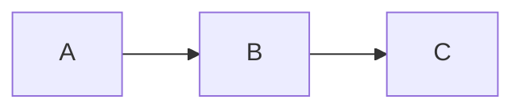
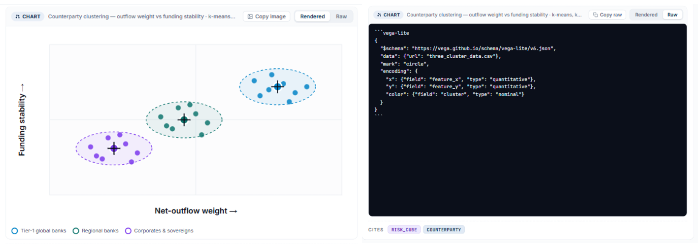

# 10 — Content Rendering

## The rendering contract

The platform's rendering pipeline is built on a single foundational assumption:

> **The LLM always produces raw text or JSON. It never produces rendered output. Every structured output is delivered as plain content wrapped in a fenced block, with the rendering target name as the language tag.**

````
```<rendering-target>
<raw content — plain text, JSON, Mermaid source, LaTeX, CSV, Vega-Lite spec, etc.>
```
````

Examples:

````

````

````
```vega-lite
{ "$schema": "...", "mark": "bar", "encoding": { ... } }
```
````

````
```document
# Quarterly Risk Summary
...
```
````

The platform intercepts these fenced blocks before displaying them, identifies the target from the language tag, and hands the raw content to the appropriate renderer. The LLM has no knowledge of how the content will be displayed — it only knows what tag to use and what format the content inside the block must be.

This contract has three important consequences:

1. **The system prompt is the only configuration surface.** The LLM learns which tags are available and what format each expects solely from the system prompt injected at session start. If a renderer is registered, its `systemPromptGuidance` must fully specify the tag name and content format.

2. **Raw content is always available.** Because the LLM always emits the unrendered source, every rendered block can switch to a raw view without any re-fetching or reprocessing — the source is already buffered.

3. **Rendering failures are recoverable.** If a renderer fails, the platform falls back to displaying the raw content as a syntax-highlighted code block. The user always sees something meaningful.

---

## Rendering decision rules

The rendering engine evaluates each content block in an assistant response in priority order. **The first matching rule wins.**

| Priority | Trigger | Rendered as |
|----------|---------|------------|
| 1 | Tool call event (`mcp_tool_use` / `mcp_tool_result`) | **Tool call disclosure** card |
| 2 | Fenced block tag matching a registered host renderer (`renderers[].trigger`) | **Custom host renderer** — host-provided ES module; see below |
| 3 | Fenced block tagged ` ```document ` | **Document canvas** — opens in right panel canvas; reference card in thread |
| 4 | Fenced block tagged ` ```mermaid ` | **Mermaid diagram** — SVG, expandable, exportable |
| 5 | Fenced block tagged ` ```vega-lite ` | **Vega-Lite chart** — interactive, responsive |
| 6 | Fenced block tagged ` ```math ` or `$$...$$` display block | **Math expression** — KaTeX rendered display block |
| 7 | Fenced block tagged ` ```json ` | **JSON inspector** — collapsible tree, copy-to-clipboard |
| 8 | Fenced block tagged ` ```csv ` or ` ```table ` | **Data table** — sortable, filterable, paginated, CSV export |
| 9 | Any other fenced block | **Syntax-highlighted code** — Prism, copy-to-clipboard, line numbers > 5 lines |
| 10 | Inline `$...$` within prose | **Inline math** — KaTeX rendered inline |
| 11 | All other content | **Rich markdown prose** — GFM |

> **Note — priority 1 is event-driven, not fenced-block matching.** Tool call disclosures are triggered by `mcp_tool_use` / `mcp_tool_result` streaming events, which arrive outside content blocks entirely. Priorities 2–11 are evaluated against the fenced block tag of each content block. The two mechanisms do not compete — tool call events are always rendered as disclosure cards regardless of block content.

The system prompt (injected by the platform) instructs the model to:
- Prefer structured outputs — Vega-Lite for metrics and trends, Mermaid for relationships and flows, data tables for entity lists — over prose equivalents when the data supports it
- Use `document` blocks for substantial prose outputs (reports, summaries, plans, policy drafts, analyses) where the user is likely to iterate across multiple turns rather than simply read once

### Content type quick reference

| Content type | Trigger | Typical use cases |
|-------------|---------|------------------|
| Prose / markdown | Default | Explanations, summaries, narrative answers |
| Document canvas | ` ```document ` | Reports, policy drafts, structured summaries, plans — any substantial prose the user will iterate on |
| Custom host renderer | Registered `trigger` tag | Host-defined domain-specific visualisations (risk gauges, compliance scorecards, Gantt views, org charts) |
| Mermaid diagram | ` ```mermaid ` | Entity relationships, process flows, system dependencies, hierarchies |
| Vega-Lite chart | ` ```vega-lite ` | Metrics, trends, distributions, comparisons |
| Math expression | ` ```math ` / `$$...$$` / `$...$` | Scoring formulas, ratios, statistical expressions, metric definitions |
| JSON inspector | ` ```json ` | Raw tool results, configuration objects, structured data |
| Data table | ` ```csv ` / ` ```table ` | Multi-row query results, lists, comparison tables |
| Tool call disclosure | Automatic | All MCP tool invocations — always visible, collapsed by default |
| Syntax-highlighted code | All other fenced blocks | SQL, Python, YAML, shell, TypeScript |

---

## Content types

### Custom host renderer

Host applications may register custom content renderers in the `renderers` section of their application config (see [01-host-application-config.md](./01-host-application-config.md)). When the model produces a fenced block tagged with a registered `trigger`, the platform loads and invokes the host's renderer module.

#### Module loading

Renderer modules are **ES modules** loaded once per session when the first block matching their trigger arrives. The platform loads the module using a dynamic `import()` from the registered `moduleUrl`. Modules are cached for the session lifetime — they are not re-fetched on each block.

The module must export a **renderer class** (or factory function returning an object) that implements the following interface:

```typescript
interface HostRenderer {
  // Called once per content block after the full fenced block content is received.
  // `container` is a plain HTMLElement inside a shadow root — render freely within it.
  render(container: HTMLElement, content: string, context: RendererContext): void | Promise<void>;

  // Optional — called when the rendered element is removed from the DOM.
  dispose?(): void;

  // Optional — if present, called by the platform when the user downloads from the
  // artefact tray. The returned Blob is used instead of the raw fenced block source,
  // allowing the renderer to export a rendered image, PDF, or structured file.
  getExportBlob?(): Promise<Blob>;
}

interface RendererContext {
  tenantId:    string;                    // the current tenant
  conversationId: string;                 // the current conversation
  turnId:      string;                    // the turn this block belongs to
  trigger:     string;                    // the fenced block tag that matched
  themeTokens: Record<string, string>;    // host brand CSS custom properties (e.g. "--color-primary")
}
```

The platform loads the module once per session (cached for the session lifetime) but instantiates the renderer class once per content block. Each block gets its own renderer instance. The platform passes the full fenced block content as a string to `render()`, and calls `dispose()` when the block leaves the DOM (e.g. conversation navigation, component unmount).

#### Isolation

Each rendered block's `container` is the interior of a **shadow root** — the renderer's DOM and styles are isolated from the platform UI and from other rendered blocks. The renderer may use any DOM APIs available to the module. It may not access the platform's internal state, the user's JWT, or other conversations.

#### Block buffering

Custom renderers receive the **full fenced block content** after `content_block_stop` — they cannot stream incrementally. While the block is buffering, the platform shows a loading skeleton in place of the renderer output. The skeleton is replaced by the rendered output on receipt.

#### System prompt guidance injection

For each registered renderer, the platform injects the renderer's `systemPromptGuidance` (or a generated fallback) into the system prompt at session start. This tells the model when and how to produce the custom content type:

```
[Custom content types]
{renderer.name}: {renderer.systemPromptGuidance}
```

All registered renderer guidance blocks are appended together in the order they appear in the `renderers` config array. They are injected after tool descriptions and before memory blocks in the assembled system prompt.

#### Fallback behaviour

If the renderer module fails to load, or if `render()` throws, the platform:

1. Logs the error to the improvement signal pipeline
2. Renders the fenced block content as a **syntax-highlighted code block** (priority 9)
3. Shows an inline notice beneath the block: *"[Renderer name] could not render this content. Showing raw output."*

The fallback is transparent to the user and non-blocking — the rest of the response continues rendering normally.

#### Example: risk gauge renderer

Given the config:

```json
{
  "id":      "risk-gauge",
  "trigger": "risk-gauge",
  "name":    "Risk Gauge",
  "moduleUrl": "https://cdn.acme.com/ai-renderers/risk-gauge.js",
  "systemPromptGuidance": "Use a ```risk-gauge block when asked for a risk score. The block must contain JSON: { \"score\": <0–100>, \"label\": \"<text>\", \"breakdown\": [ { \"factor\": \"<name>\", \"score\": <0–100> } ] }."
}
```

The model produces:

````
```risk-gauge
{ "score": 72, "label": "Medium-High", "breakdown": [
    { "factor": "Data quality", "score": 80 },
    { "factor": "Ownership coverage", "score": 55 },
    { "factor": "Policy compliance", "score": 90 }
  ]
}
```
````

The platform calls `RiskGaugeRenderer.render(container, content, context)`. The renderer parses the JSON and renders a gauge widget into `container`. The raw JSON is stored in the artefact tray.

---

### Document canvas

A `document` block opens a persistent right-panel canvas alongside the conversation thread. The canvas is designed for substantial prose outputs — reports, summaries, plans, policy drafts, analyses — that the user is likely to iterate on across multiple turns rather than simply read once.

| Behaviour | Specification |
|-----------|--------------|
| Trigger | Fenced block tagged ` ```document ` |
| Panel | Opens in a right-panel canvas; the conversation thread continues uninterrupted in the left panel |
| Thread reference | A reference card appears in the thread at the point the document was produced — title, word count, and a *"Open document →"* link |
| Multiple documents | Each `document` block from the same conversation opens as a tab in the canvas panel. Switching tabs does not navigate the conversation |
| Iteration | Subsequent turns that produce a revised `document` block replace the active canvas content in-place; the prior version is accessible via the version history control (last 10 revisions retained) |
| Export | Full document downloadable as Markdown or plain text from the canvas toolbar; PDF export via browser print |
| Artefact | Document source stored in turn record; added to artefact tray with document title as label |
| Mobile | Canvas panel opens as a full-screen overlay; a back button returns to the conversation thread |
| Empty state | If the model produces a `document` block with no content, the canvas shows a *"No content"* placeholder and the thread reference card is omitted |

#### Document titles

The platform extracts the document title from the first `# Heading` in the block content. If no heading is present, it defaults to *"Document — [timestamp]"*. Titles are shown in the thread reference card, the canvas tab, and the artefact tray entry.

---

### Mermaid diagram

| Behaviour | Specification |
|-----------|--------------|
| Rendering | SVG via Mermaid.js |
| Default display | Full-width in conversation thread, collapsed to thumbnail in artefact tray |
| Expand | Full-screen overlay available |
| Export | SVG download from artefact tray |
| Mobile | Horizontally scrollable — never scaled to illegibility |
| Accessibility | Descriptive alt text generated by the model and attached to the SVG |
| Artefact | Mermaid source stored in turn record; added to artefact tray on render complete |

#### Common diagram types

| Diagram type | Mermaid syntax | Typical trigger |
|-------------|---------------|----------------|
| Entity relationship | `erDiagram` | *"Show me the relationship between X and Y"* |
| Process flow | `flowchart LR` | *"Walk me through the approval workflow"* |
| Sequence diagram | `sequenceDiagram` | *"How do these services communicate?"* |
| Hierarchy / tree | `graph TD` | *"Show me the organisational structure"* |
| Timeline | `timeline` | *"Show the project milestones"* |

---

### Vega-Lite chart

| Behaviour | Specification |
|-----------|--------------|
| Rendering | Interactive via vega-embed |
| Responsive sizing | `width: "container"` — adapts to viewport or container |
| Export | PNG or SVG download from artefact tray |
| Interactivity | Hover tooltips, click-to-filter where applicable |
| Mobile | Responsive; minimum bar/point size maintained for touch targets. Hover tooltips activate on tap; click-to-filter activates on double-tap. Pinch-to-zoom is disabled — the chart scales with the viewport instead |
| Artefact | Vega-Lite spec stored in turn record; added to artefact tray on render complete |

---

### Math expression

Mathematical expressions are rendered using **KaTeX** — fast, lightweight, and browser-native.

| Behaviour | Specification |
|-----------|--------------|
| Display block | Triggered by ` ```math ` fenced block or `$$...$$` delimiter — rendered full-width, centred |
| Inline | Triggered by `$...$` within prose — renders inline without breaking text flow |
| Library | KaTeX — subset of LaTeX math notation |
| Copy | LaTeX source copy-to-clipboard button on display blocks |
| Export | LaTeX source and rendered SVG downloadable from artefact tray |
| Mobile | Display blocks horizontally scrollable at narrow viewports |
| Fallback | If KaTeX fails to parse, the raw LaTeX source is shown in a code block with a parse-error notice |

---

### JSON inspector

| Behaviour | Specification |
|-----------|--------------|
| Default state | Collapsed to two levels |
| Navigation | Expand/collapse nodes; copy individual values or subtrees |
| Export | Full JSON download from artefact tray |
| Use cases | Tool result payloads, configuration inspection, structured record data |

---

### Data table

| Behaviour | Specification |
|-----------|--------------|
| Sorting | Click column header to sort ascending/descending |
| Filtering | Inline filter row per column |
| Pagination | 25 rows per page; configurable |
| Mobile | Horizontally scrollable; first column sticky |
| Export | CSV download from artefact tray |
| Empty state | "No results" message with query context |

---

### Syntax-highlighted code

| Behaviour | Specification |
|-----------|--------------|
| Highlighting | Prism.js — auto-detects language from fenced block tag |
| Copy | Copy-to-clipboard button always visible |
| Line numbers | Shown for blocks of more than five lines |
| Languages | SQL, Python, YAML, TypeScript, JSON, Bash, and all Prism-supported languages |

---

### Attached content

**Non-image documents** (PDF, Excel, Word) appear in the user message bubble as a labelled file card:
- Format icon
- File name
- Page count (PDF), sheet count (Excel), or section count (Word)

Clicking the file card opens the document in an **inline document viewer** embedded directly in the conversation thread. The viewer renders the full document without leaving the conversation.

| Format | Viewer behaviour |
|--------|-----------------|
| PDF | Paginated page-by-page render; page navigation controls; text selection and search within the PDF |
| Excel | Sheet tabs across the top; each sheet rendered as a scrollable, read-only data table |
| Word / DOCX | Rendered as formatted prose with heading styles and table layout preserved |
| CSV | Rendered as a sortable, filterable data table (same component as ` ```csv ` blocks) |

The viewer opens in-line below the file card, expanding the message bubble to accommodate it. A **collapse** control returns to the file card view. The document remains openable for the lifetime of the conversation.

When the model references a specific section, it cites by page number (PDF), sheet name (Excel), or heading (Word). Clicking a citation opens the viewer scrolled to the referenced location.

**Images** (PNG, JPEG, WEBP) are **rendered inline** in the user message bubble at a constrained size (max 320px wide, max 240px tall, maintaining aspect ratio). Multiple images in one turn stack vertically. Clicking an image opens it in a full-screen lightbox overlay. The original file is downloadable from the lightbox and from the artefact tray.

---

## Cross-cutting behaviours

### Streaming

| Content type | Streaming behaviour |
|-------------|-------------------|
| Prose / markdown | Streams character-by-character; renders incrementally |
| Non-prose blocks (Mermaid, Vega-Lite, JSON, tables, code) | Buffers internally; renders on `content_block_stop` to prevent hydration errors on partial content |
| Tool call disclosures | Appear as an in-progress card while the tool is running; update on result receipt |
| Artefact chips | *"Added to artefacts ↗"* chip appears beneath each completed non-prose block |

While the model is streaming, the input field is disabled and replaced by a **stop-generation button**. Stopping generation saves the partial response to the audit trail as a partial turn — it does not discard it. When stopped, a *"(generation stopped)"* label appears beneath the partial response.

#### Truncated response

When the model's response ends without a natural conclusion, a **Continue** button appears below the response. Truncation is detected by either of two signals: (a) the API returns `stop_reason: "max_tokens"`, indicating the output token limit was reached; or (b) heuristic analysis finds the response ends mid-sentence — no terminal punctuation in the last 120 characters and no closing structural element (heading, list item, code block close, or horizontal rule).

> *"Response may be incomplete.* **Continue →***"*

Clicking Continue submits an implicit *"Please continue"* turn, which regenerates from the end of the incomplete response in a new branch. The original truncated response is preserved. This handles output-token-limit cases transparently without requiring the user to know why the response stopped.

The Continue button is shown for a maximum of 60 seconds after the truncated response; after that it is dismissed to avoid polluting old threads.

---

### Artefact tray

The artefact tray is a persistent UI panel (collapsed by default, expandable from a tray handle at the bottom of the conversation) that collects downloadable outputs from the current conversation. Every non-prose rendered block — Mermaid diagrams, Vega-Lite charts, math expressions, JSON payloads, data tables, document canvas outputs, and custom renderer outputs — is automatically added to the tray when it finishes rendering.

| Element | Specification |
|---------|--------------|
| Trigger | Added automatically on render completion of any non-prose block |
| Entry label | Content type name + block title (where extractable) or timestamp |
| Download | Clicking an entry downloads the artefact. For custom renderers that implement `getExportBlob()`, the exported blob is used; otherwise the raw fenced block source is downloaded as plain text |
| Scope | Tray contents are scoped to the current conversation. Navigating to a new conversation clears the tray |
| Persistence | Artefact tray entries are stored with the turn record and restored when the conversation is reopened |
| Empty state | Tray handle is hidden when there are no artefacts in the current conversation |

---

### Raw / rendered toggle

Every non-prose rendered block exposes a **Raw** toggle that switches between the rendered view and the raw source in place.



| Content type | Rendered view | Raw view |
|---|---|---|
| Data table | Sortable, filterable, paginated table | Raw CSV or JSON source in a syntax-highlighted code block |
| Vega-Lite chart | Interactive vega-embed chart | Vega-Lite JSON spec in a JSON inspector |
| Mermaid diagram | Rendered SVG | Mermaid source in a syntax-highlighted code block |
| Math expression | KaTeX-rendered formula | LaTeX source in a code block |
| JSON inspector | Collapsible tree | Raw JSON in a syntax-highlighted code block |
| Document canvas | Right-panel canvas | Markdown source in a code block (in-thread, without opening the canvas) |
| Custom host renderer | Renderer output | Raw fenced block source in a syntax-highlighted code block |

The toggle is a **Rendered · Raw** pill control placed in the top-right corner of the content block's bounding box. It appears on hover (desktop) and is always visible on touch devices.

- Switching to Raw does not re-fetch or reprocess content — the raw source is the already-buffered fenced block content.
- The toggle state is per-block and per-session — it is not persisted across page loads.
- Switching a Vega-Lite block to Raw shows the JSON inspector rather than a plain code block, since the spec is structured data with navigable nodes.
- When a block is in Raw view, the artefact tray entry for that block still downloads the rendered export (or raw source if no `getExportBlob()` is available) — the toggle does not affect the download target.
- Custom renderers that implement `getExportBlob()` are not called while the block is in Raw view.

---

### Inline source citations

When the model's response draws on data returned by an MCP tool call, it should cite the source inline using a numbered superscript that links to the corresponding tool call disclosure card.

| Element | Specification |
|---------|--------------|
| Format | Superscript numeral in the prose (e.g. *"There are 12 entities in this domain¹"*) |
| Anchor | Clicking the superscript scrolls to and expands the referenced disclosure card |
| Scope | Citations reference the specific MCP tool invocation, not a generic tool name |
| Multiple sources | Where a claim draws on more than one tool call, multiple citations appear (e.g. *"...entities¹ ²"*) |
| Attached documents | Citations to attached documents use the document's cite format: page number (PDF), sheet name (Excel), heading (Word) |

Citations are rendered as part of the markdown prose block. Superscript numbers reset per response.

---

## Implementation

### Scalable renderer registry

All renderers — built-in and host-registered — are represented as entries in a single **renderer registry configuration file**. Built-in renderers (Mermaid, Vega-Lite, math, JSON, tables, code, document canvas) are pre-populated entries in this file; host-registered renderers are appended to it. There is no architectural distinction between the two categories at runtime.

```json
{
  "renderers": [
    {
      "id":                   "mermaid",
      "trigger":              "mermaid",
      "name":                 "Mermaid Diagram",
      "moduleUrl":            "/renderers/mermaid@11.4.1/index.js",
      "version":              "11.4.1",
      "builtIn":              true,
      "systemPromptGuidance": "Use a ```mermaid block for relationships, flows, hierarchies, and sequences."
    },
    {
      "id":                   "vega-lite",
      "trigger":              "vega-lite",
      "name":                 "Vega-Lite Chart",
      "moduleUrl":            "/renderers/vega-lite@5.21.0/index.js",
      "version":              "5.21.0",
      "builtIn":              true,
      "systemPromptGuidance": "Use a ```vega-lite block for metrics, trends, distributions, and comparisons. Always set width to 'container'."
    },
    {
      "id":                   "risk-gauge",
      "trigger":              "risk-gauge",
      "name":                 "Risk Gauge",
      "moduleUrl":            "https://cdn.acme.com/ai-renderers/risk-gauge@2.1.0/index.js",
      "version":              "2.1.0",
      "builtIn":              false,
      "systemPromptGuidance": "Use a ```risk-gauge block when asked for a risk score. Content must be JSON: { \"score\": <0–100>, \"label\": \"<text>\", \"breakdown\": [...] }."
    }
  ]
}
```

#### Adding a renderer

Each renderer is an independently deployed ES module loaded from its own `moduleUrl`. Adding a new renderer requires two steps and touches nothing else in the platform:

1. **Deploy the module** to a versioned URL (`/renderers/<id>@<version>/index.js` or a CDN path).
2. **Append one entry** to the renderer registry config with the trigger tag, module URL, and system prompt guidance.

The platform picks up the new entry at the next session start. Existing renderers are not reloaded, re-tested, or redeployed. Sessions already in progress continue using their cached module set and gain the new renderer at their next session.

#### Independent versioning

Because each renderer module is loaded from a versioned URL, updating a renderer is equally non-disruptive:

1. Deploy the new module version to a new URL (e.g. `risk-gauge@2.2.0`).
2. Update the `moduleUrl` and `version` fields in the registry config.

In-flight sessions continue using the cached `@2.1.0` module for their lifetime. New sessions load `@2.2.0`. No renderer affects any other renderer's availability or performance.

#### Library co-deployment

Each renderer module bundles its own dependencies. There is no shared renderer dependency tree — a renderer that requires D3, a custom charting library, or a domain-specific SDK bundles it directly. This means:

- Renderer A using Vega-Lite 5.x and Renderer B using Vega-Lite 4.x can coexist without conflict.
- Upgrading a library for one renderer does not require coordinating with others.
- A renderer can be pinned to a specific library version indefinitely without affecting platform upgrades.

The only shared surface is the `HostRenderer` interface and the `RendererContext` object passed by the platform — these are stable and versioned separately from renderer implementations.

#### System prompt assembly

At session start, the platform assembles the system prompt guidance block by iterating the registry in order and appending each entry's `systemPromptGuidance`. Built-in renderers come first (they are at the top of the registry), host-registered renderers follow. The LLM receives a complete, current list of available rendering targets with no manual prompt maintenance required — adding a renderer to the registry automatically teaches the LLM to use it.

> **Adding a new renderer requires writing one module and adding one config entry. No existing renderer code, no platform core, and no system prompt template needs to be touched.** The rendering surface scales by addition, not by modification — each new capability is a self-contained deployment that sits alongside everything already running.
