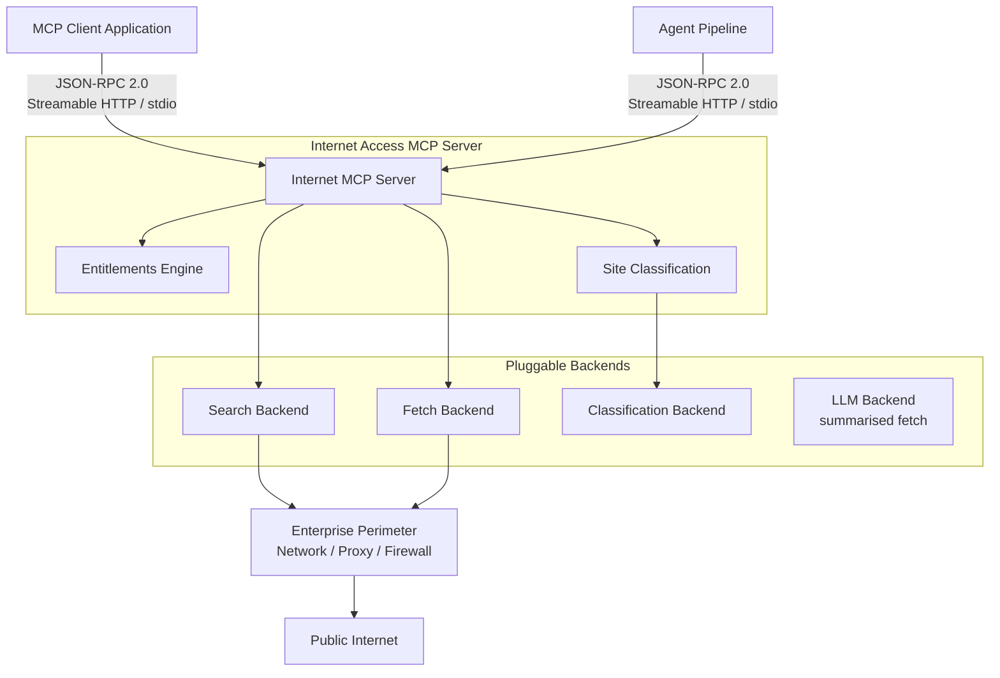

# 01 — Overview

**Product:** MAOS Internet Access MCP Server  
**Version:** 1.0  
**Date:** 2026-06-16  
**Author:** Andrew Bush / M&A Operating System

---

## Problem Statement

AI agents and conversational AI interfaces have no controlled, self-hosted mechanism for accessing live internet content during interactions. Without it, they operate only on training data and users must manually retrieve and paste web content into conversations. Autonomous agents have no mechanism to retrieve current information during pipeline execution.

## Solution

A self-hosted MCP server that exposes web search and page fetch as production-grade, infrastructure-controlled capabilities. Built-in entitlements and site classification govern what internet content AI agents and users can access and consume. No external API dependency is required for core operation.

---

## Primary Consumers

**[AI Chat Platform](../assistant/01-overview.md)** — the primary conversational AI front end; registers this server in its MCP tool registry as **MCP Internet Fetch & Search** to provide end users with real-time web search and page fetch during conversations.

**Autonomous AI agents** — software agents executing within agentic pipelines or multi-agent orchestrations that require live internet content as a step in task execution. The agent issues tool calls and receives structured content without human involvement.

---

## Deployment Model

The server is deployed as shared enterprise infrastructure by a platform or AI infrastructure team. It is not a commercial SaaS product. It runs self-hosted within the enterprise environment and is consumed by any MCP-compatible client — AI assistants, coding agents, orchestration frameworks — operating within that environment.

---

## Layered Control Model

The server operates within a two-layer control model.

**Layer 1 — Enterprise perimeter controls.** Network, proxy, firewall, and identity policies that govern all outbound internet access for the infrastructure on which the server runs. The server inherits and is subject to these controls automatically by virtue of where it is deployed.

**Layer 2 — Server-managed controls.** Entitlements and site classification operating specifically against AI interactions — governing what content the server will search, fetch, and return to agents and interfaces. These controls are additive to the enterprise perimeter, not a replacement for it.

This layering means the server can be deployed within an organisation that already enforces outbound internet policy, and the server's own controls then address the AI-specific access surface on top of that foundation.

---

## System Context

---

## Success Metric

Volume of web pages successfully fetched per deployment — demonstrating active grounding of AI interactions in live internet content.

---

## Current State Without This Product

No controlled mechanism exists. Users manually copy and paste web content into conversations. Autonomous agents cannot retrieve live internet content during execution and either fail or produce responses based solely on training data.

---

## Decisions Log

| ID | Decision |
|---|---|
| D-001 | The server is a general-purpose MCP infrastructure component, not tied to any specific platform or application stack |
| D-002 | Search and fetch are the MVP; entitlements and site classification are included in MVP as safety controls, not Phase 2 features |
| D-003 | Site classification is a safety gate — content that fails classification is blocked server-side before being returned to the LLM |
| D-004 | Classification metadata is returned alongside permitted content in all responses, even when content passes the safety threshold |
| D-005 | Four fetch output formats in target state: raw, markdown, chunked, summarised |
| D-006 | Server-managed controls are explicitly additive to enterprise perimeter controls, not a replacement |
| D-007 | Authenticated fetch targets enterprise IdP (v1) and consumer OAuth providers (v2); not included in MVP |
| D-008 | OAuth 2.0 OBO flow for enterprise IdP; OAuth 2.1 with PKCE for consumer providers; no token passthrough permitted |
| D-009 | Search backend is pluggable behind a standard internal interface |
| D-010 | Classification backend is pluggable; most-restrictive-wins when multiple providers are configured |
| D-011 | All successful search and fetch responses include a provenance block (URL/query, timestamp, size, content hash, backend) returned to the caller and independently recorded in the audit log — establishing a verifiable chain of custody from request to response |
