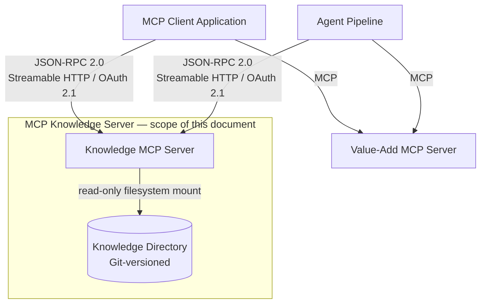

# 01 — Overview

**Product:** MAOS Knowledge MCP Server  
**Version:** 1.0  
**Date:** 2026-06-16  
**Protocol:** MCP 2025-06-18  
**Author:** Andrew Bush / Fortium Partners  

---

## Problem Statement

MAOS platform components — MCP servers providing value-added capabilities, agent pipelines, and downstream agent systems — each carry their own local copies of prompts, skill definitions, agent personas, and reference documentation. There is no single authoritative location to publish, version, and retrieve these assets. When a prompt is updated, every consumer must be updated in lockstep. There is no discovery mechanism and no governed access pattern.

## Solution

A centralised MCP server exposing a structured knowledge directory over the Model Context Protocol. Every MAOS component and any authorised MCP client connects to this server to discover and consume resources, prompts, skills, commands, and agent definitions from one place. The server is the single source of truth for all reusable AI assets across the platform.

The design assumes that all content can be aligned to a knowledge hierarchy that mirrors the organisation itself — structured around the organisation's hierarchy, its existing business processes, and the applications and services that support them. This means the directory tree naturally reflects how the business is structured: domains map to business units or functions, sub-domains to teams or process areas, and application nodes to the specific systems and services in use. AI assets are authored and discovered in the same context as the work they support.

---

## Background: MCP Primitives

The Model Context Protocol defines four core primitives that servers use to expose capabilities to clients. In a typical MCP deployment each server manages its own primitives locally — prompts, skills, and agent definitions live alongside the code that uses them, with no shared authoring location or distribution mechanism.

The Knowledge MCP Server changes this. It acts as a **central repository for all MCP primitives across the ecosystem** — a single, Git-versioned location where primitives are authored, reviewed, and published once, then consumed by any authorised MCP client, agent, or server on the network. When a prompt or skill is updated, every consumer receives the change automatically through MCP notifications. No local copies, no lockstep updates, no drift.

| Primitive | What it is | How the Knowledge Server centralises it |
|---|---|---|
| **Resource** | Named content items a server exposes for clients to discover (`resources/list`) and read (`resources/read`). Identified by a URI. Can be files, database records, or any structured data. | Every reference document, schema, and configuration file in the knowledge directory is versioned in Git and surfaced as a resource addressable by its `file:///knowledge/...` URI — one authoritative copy available to all consumers. |
| **Prompt** | Parameterised message templates the server registers (`prompts/list`) and renders on demand (`prompts/get`). Arguments are substituted at render time; the result is a `messages[]` array ready for direct LLM submission. | Prompt templates, skill entry points, command definitions, and agent system prompts are all authored in one place, version-controlled, and distributed on demand. Any MCP client calls `prompts/get` and receives a fully rendered message array — no local template management required. |
| **Tool** | Callable functions the server exposes for clients and models to invoke. Each tool has a typed input schema; the server executes the function and returns `content` (display text) and `structuredContent` (typed payload). | Ten typed tools give the wider ecosystem structured, type-safe access to every content category — skills, commands, agents, prompts, and resources — without each consumer needing to implement its own parsing or rendering logic. |
| **Notification** | Server-to-client push messages signalling state changes. Clients subscribe to specific resource URIs or to list-change events and receive notifications when content is added, removed, or updated. | When any file in the knowledge directory changes, subscribed clients across the entire ecosystem are notified instantly — eliminating polling and ensuring every agent and server is always working from the latest published version. |

---

## Design Principles

**P1 — Single source of truth.** One server, one directory. No mirrors, no local copies that diverge.

**P2 — Filesystem native.** The knowledge directory is a plain filesystem tree versioned in Git. Any developer can read, write, and deploy content with standard tools. No proprietary database required to author.

**P3 — MCP protocol-first.** All access is through the MCP 2025-06-18 specification. No bespoke APIs, no direct filesystem mounts for consumers.

**P4 — Type-safe content.** Five distinct content types — resources, prompts, skills, commands, agents — each with a defined schema, discovery path, and rendering contract.

**P5 — Folder URI consistency.** Passing a folder URI to any list, read, or get operation returns all entries scoped to that folder. This behaviour is uniform across all content types and all tools.

**P6 — Read-only enforcement.** The server never writes to the knowledge directory. All mutation is performed by authorised humans or deployment pipelines operating through version control.

**P7 — OAuth 2.1 on all remote connections.** Every token is bound to this specific server via RFC 8707. No token sharing across servers.

---

## System Context



## Protocol and Capability Declaration

Transport: Streamable HTTP (HTTPS + SSE). Message format: JSON-RPC 2.0. Auth: OAuth 2.1 + PKCE with RFC 8707 resource binding.

```json
{
  "protocolVersion": "2025-06-18",
  "capabilities": {
    "resources": { "subscribe": true, "listChanged": true },
    "prompts":   { "listChanged": true },
    "tools":     { "listChanged": false }
  },
  "serverInfo": {
    "name":    "maos-knowledge-mcp-server",
    "title":   "MAOS Knowledge MCP Server",
    "version": "1.0.0"
  },
  "instructions": "Serves the MAOS knowledge directory as resources, prompts, skills, commands, and agent definitions. All content is under file:///knowledge/. Pass a folder URI to any list or get operation to enumerate entries. Use typed tools for skills, commands, and agents."
}
```

## Technology Stack

| Component | Technology |
|---|---|
| Language | Python 3.12+ |
| MCP SDK | `mcp[cli]` (Python), official SDK |
| ASGI server | Uvicorn |
| Auth | OAuth 2.1 + PKCE, `python-jose`, `authlib` |
| Full-text search | SQLite FTS5 (embedded) |
| Filesystem watch | `watchfiles` |
| Front-matter parsing | `python-frontmatter` |
| Deployment | Docker / OCI, read-only volume mount |

## Consumers at Launch

- MCP client applications — chat interfaces and interactive tools
- Agent pipelines — orchestrators and sub-agents performing multi-step workflows
- Value-add MCP servers — servers that enrich their own capabilities with knowledge assets
- Claude Code CLI sessions operating in MAOS context

---

## Decisions Log

| ID | Decision |
|---|---|
| D-001 | Protocol locked to `2025-06-18` for v1.0 |
| D-002 | Python 3.12 + FastMCP as server stack |
| D-003 | Knowledge directory is Git-native, read-only mount |
| D-004 | SQLite FTS5 for search — no external search dependency in v1.0 |
| D-005 | Five typed sub-folders are mandatory at every application leaf |
| D-006 | `invoke_skill` and `invoke_command` return resolved definitions only — they do not execute |
| D-007 | Dotted prompt name convention: `{domain}.{subdomain}.{app}.{name}` |

## Open Decisions

**OD-001 — Search index persistence** (MEDIUM): Rebuild on startup is simple and always correct; acceptable if startup time is under 10 seconds. Recommendation: rebuild for v1.0, revisit if startup latency is a problem in practice.

**OD-002 — Write path for AI-generated content** (MEDIUM): Agents may eventually need to propose new knowledge content. Recommendation: implement via GitHub PR tool when a confirmed requirement exists — not in v1.0.

**OD-003 — Prompt name collision** (LOW): Dotted name convention assumes application names are unique across the directory. Recommendation: use full dotted path including all domain segments as the prompt name to guarantee uniqueness.

**OD-004 — Content entitlements** (MEDIUM): The current design assumes that all knowledge held within this service is non-sensitive and generally accessible to any authenticated client — even if a given piece of content is not relevant or useful to every consumer. No per-content or per-subtree access controls are implemented. If future requirements introduce sensitive content (e.g. restricted agent definitions, confidential process documentation, or proprietary prompt IP), a claims-based entitlement model scoped to directory sub-trees will be needed. Recommendation: proceed with open access for v1.0; revisit when a confirmed requirement for content-level access control exists.
